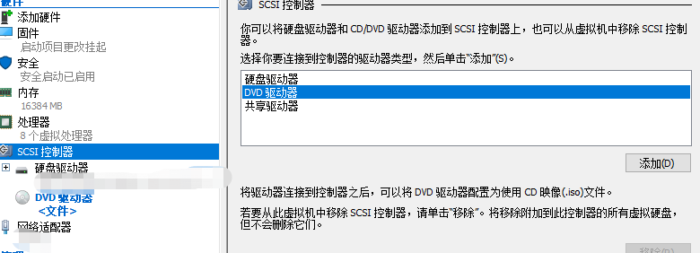
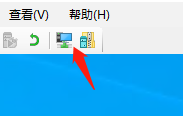
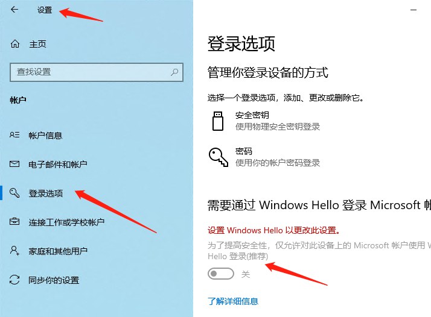
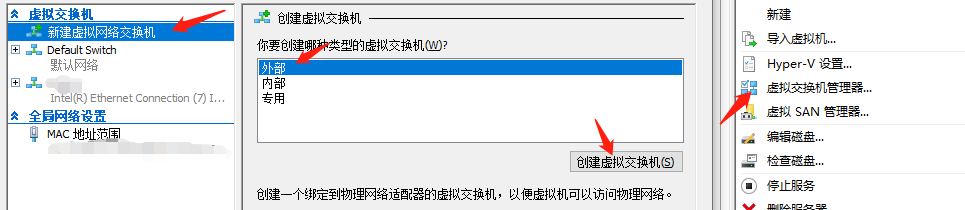
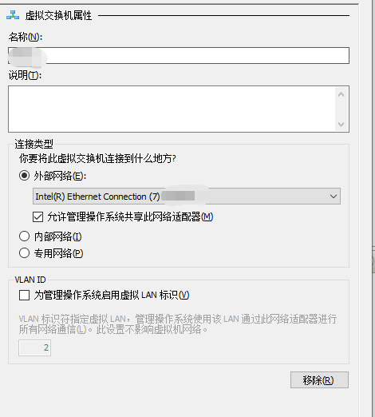
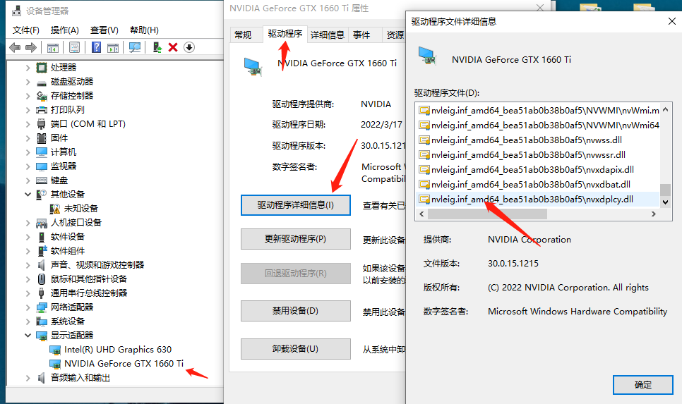
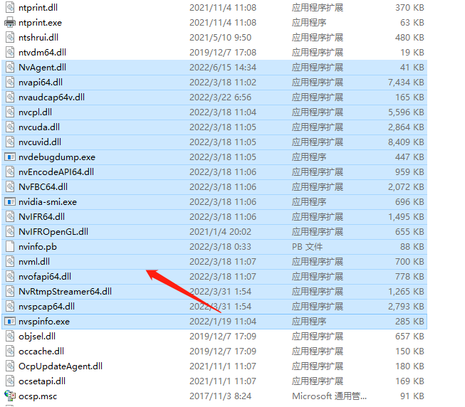
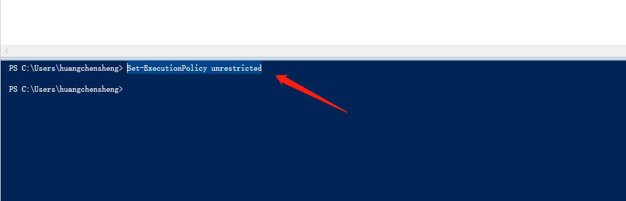

Hyper-V&GPU
======

(Github正常排版: [Hyper-V&GPU][1])

-----------------

记录了和虚拟机那些破事.

-----------------


<!-- @import "[TOC]" {cmd="toc" depthFrom=1 depthTo=6 orderedList=false} -->

<!-- code_chunk_output -->

- [**0. 安装**](#0-安装)
  - [**0.1 Hyper-V**](#01-hyper-v)
  - [**0.1 系统**](#01-系统)
  - [**0.1.1 安装**](#011-安装)
  - [**0.1.2 激活**](#012-激活)
  - [**0.1.3 新的网络**](#013-新的网络)
- [**1. GPU**](#1-gpu)
- [**1.1 准备驱动**](#11-准备驱动)
- [**1.2 安装驱动**](#12-安装驱动)
- [**1.3 其它问题**](#13-其它问题)

<!-- /code_chunk_output -->


-----------------

## **0. 安装**

### **0.1 Hyper-V**

直接桌面按**Win键**输入**Hyper-V** , 会出现 **启用或关闭Windows功能**, 勾上**Hyper-V**, 重启就完事.

### **0.1 系统**

### **0.1.1 安装**

本来应该去官网下载的, 但是速度感人, 而且还可能会出现下载失败的问题. [网站地址][2]

所以我这里用了一个镜像网站, 不知道系统有没有安全问题(应该没事). [网站地址][3]

之后就是装系统了.

可以在创建虚拟机的时候指定系统的ISO.

如果虚拟机已经创建完成了. 可以右键虚拟机->设置->SCSI控制器->添加DVD驱动器. 然后指定我们的系统ISO.



然后就是一系列装系统的过程.

系统装完了, 但是我们会一直无法输入密码/Pin码进去.

那是因为我们开了增强会话, 它好像跟Windows Hellow Pin码 有仇.

解决办法具体可以看这篇, [网站地址][4].

我们先要关掉**增强会话**, 点这个按钮, 或者点击 查看->增强会话.



然后输入我们的window账户密码, 不是pin码, 进入Windows 去关闭pin码.

设置->账户->登录选项->关闭 Windows Hello.



这样我们再开增强会话, 就要输入windows账户密码去进入系统了.

### **0.1.2 激活**

去github找HEU激活, 我也不用考虑什么安全问题, [网站地址][5].

### **0.1.3 新的网络**

每一次重启虚拟机就会提示**新的网络**, 挺烦的.

去新建一个网络交换器.



属性设置为 外部网络->物理显卡.



再修改我们的虚拟机, 设置->网络适配器->刚创建的虚拟交换机. 重启虚拟机就完事了.

-----------------

## **1. GPU**

有时候想挂游戏 or 游戏开发, 就需要独显卡, 不然就是纯牛马CPU在跑.

但是好像显卡商把普通的显卡的虚拟化给ban了, 不知道为什么? 可恶!!! 这时候需要通过手段开启.

我参考了两个油管视频. [视频地址][6] , [视频地址][7]

## **1.1 准备驱动**

查询我们的驱动程序详细信息, 下拉到最后.



记住这个文件夹的名字.

**打开宿主机**, 打开文件夹**C:\Windows\System32\DriverStore\FileRepository** 找到刚才的记住名字的文件夹.

我们在桌面创建空的一系列文件夹叫 **System32\HostDriverStore\FileRepository**. 之后把刚才的文件夹拷贝进来. 文件结构就变成了 **System32\HostDriverStore\FileRepository\nvleigxxxxxxxx**.

**下面针对N卡**

打开**C:\Windows\System32** 选中nv开头的一堆文件, 把它们拷贝到刚创建的**System32**文件夹



**下面针对A卡**

A卡比较麻烦.

查询我们的驱动程序详细信息, 我们之前是只拷贝了最后的. A卡把之前的也进行逐一创建文件夹拷贝进来.

**结束针对**

如果要跑Vulkan Cuda 等, 我们还要看驱动程序详细信息, 把**SysWOW64**文件夹中的对应的驱动也创建文件夹拷贝进来.

打开**虚拟机**, 打开**增强会话**, 直接复制**宿主机**之前拷贝到桌面的几个文件夹, 粘贴到**虚拟机**的桌面.

再打开**虚拟机**的 **C:\Windows** 拷贝进去. 比如 **C:\Windows\System32** , **C:\Windows\SysWOW64**. 因为此时可能需要管理员权限, 所以是先拷贝到虚拟机的桌面.

注意**System32\HostDriverStore**这个文件夹, 在虚拟机上是有**Host**的, 宿主机是没有的.

## **1.2 安装驱动**

关闭虚拟机.

在宿主机桌面右键创建**txt**文件, 粘贴下面这段代码
注意把**xxxxxxxx**, 替换成虚拟机的名字.
修改txt的后缀为**ps1**

```js
$vm = "xxxxxxxx"

Add-VMGpuPartitionAdapter -VMName $vm
Set-VMGpuPartitionAdapter -VMName $vm -MinPartitionVRAM 80000000 -MaxPartitionVRAM 100000000 -OptimalPartitionVRAM 100000000 -MinPartitionEncode 80000000 -MaxPartitionEncode 100000000 -OptimalPartitionEncode 100000000 -MinPartitionDecode 80000000 -MaxPartitionDecode 100000000 -OptimalPartitionDecode 100000000 -MinPartitionCompute 80000000 -MaxPartitionCompute 100000000 -OptimalPartitionCompute 100000000

Set-VM -GuestControlledCacheTypes $true -VMName $vm
Set-VM -LowMemoryMappedIoSpace 1Gb -VMName $vm
Set-VM –HighMemoryMappedIoSpace 32GB –VMName $vm
```

再在桌面按**Win键**输入 **PowerShell ISE**, 右键->管理员打开.

先要执行一段修改策略的命令 **Set-ExecutionPolicy unrestricted**



选全是.

然后 文件->打开->刚才创建的ps1, 按F5运行脚本.

这样基本就装完了.

## **1.3 其它问题**

打开虚拟机, **Win+R** 输入 **dxdiag**.

如果出现独显错误代码43, 说明文件夹可能复制错误了.

如果打开游戏引擎出现闪烁.

在**虚拟机**内, 打开设备管理器, 找到集显设备给他禁用了. 如果出现两个独显设备, 禁用掉其中一个. 就可以愉快的玩耍了.

如果下次启动发现还有闪烁, 但是两个独显设备已经禁用了其中一个. 那就禁掉已经启用的驱动, 再启动之前已经禁用的那个.

-----------------

[1]:https://www.microsoft.com/zh-cn/software-download
[2]:https://www.microsoft.com/zh-cn/software-download
[3]:https://www.xitongku.com/
[4]:https://blog.csdn.net/mayong43111/article/details/124614480
[5]:https://github.com/zbezj/HEU_KMS_Activator
[6]:https://www.youtube.com/watch?v=lUGaH7WMNBQ
[7]:https://www.youtube.com/watch?v=XLLcc29EZ_8