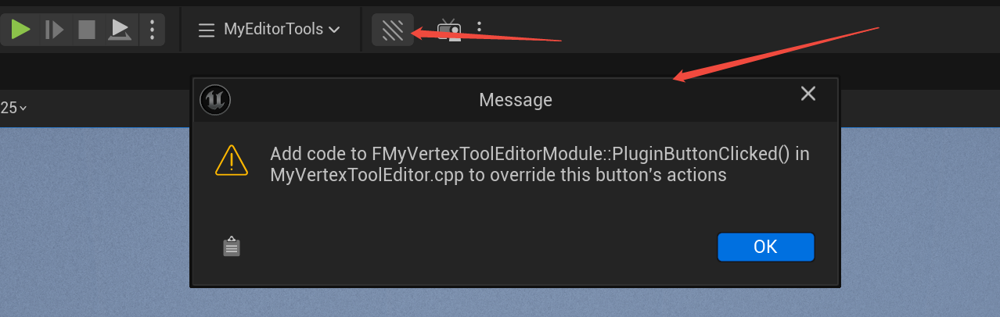
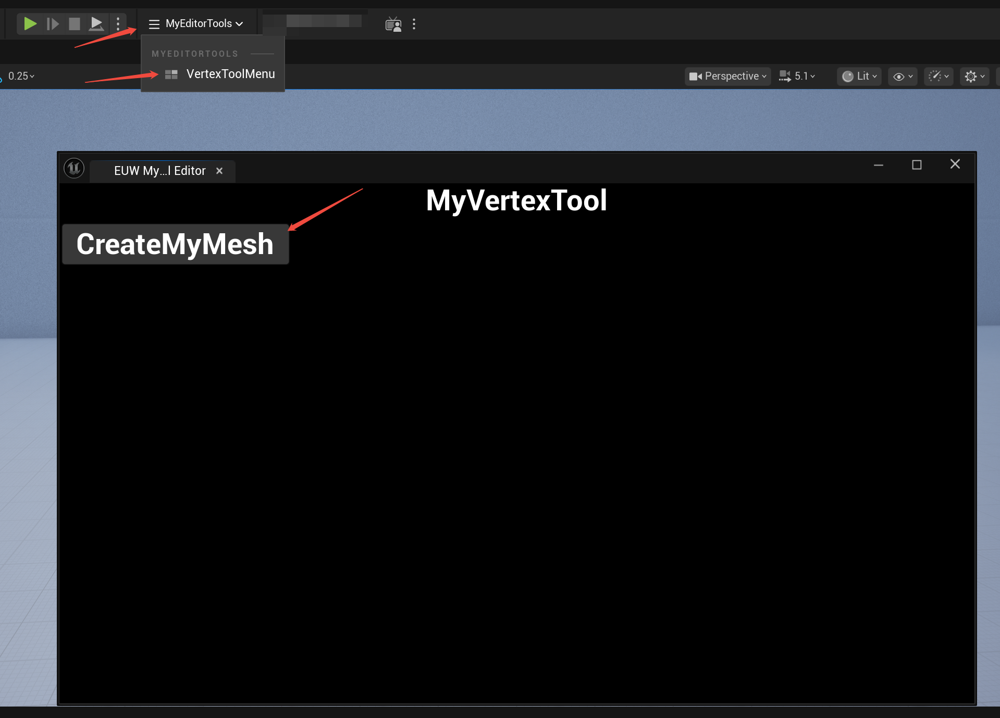
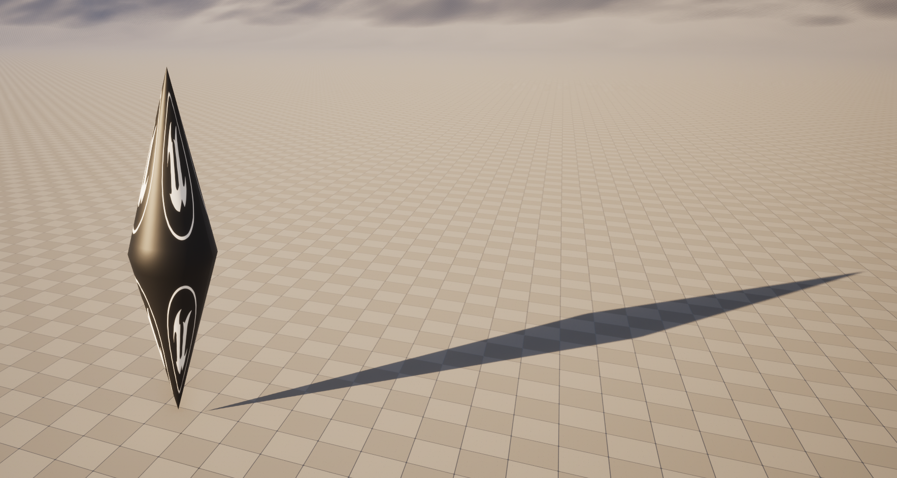
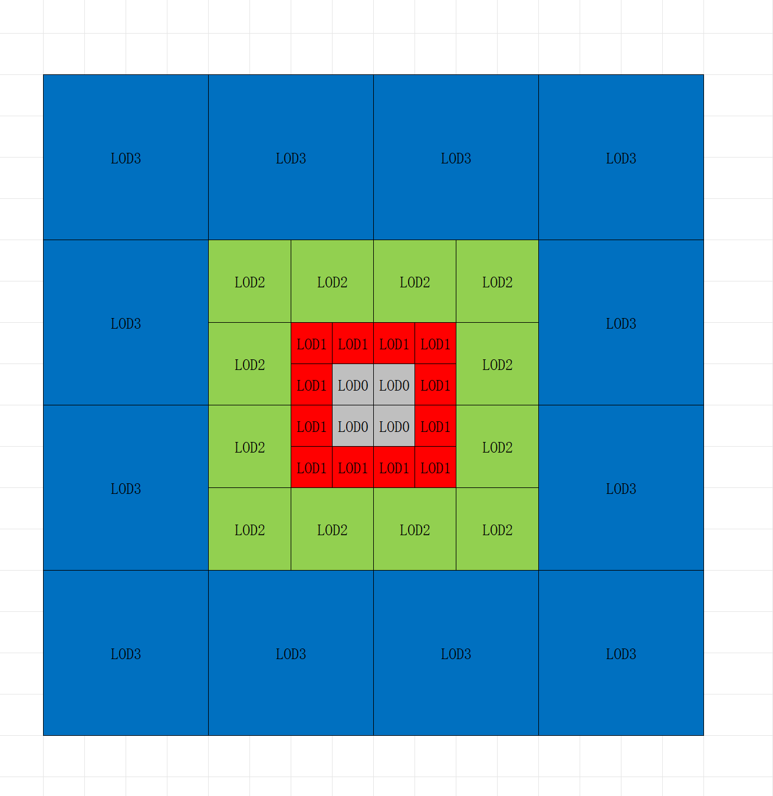

UE57自定义顶点
=================

(Github正常排版: [UE57自定义顶点](https://github.com/HHHHHHHHHHHHHHHHHHHHHCS/MyStudyNote/blob/main/MyNote/UE57%E8%87%AA%E5%AE%9A%E4%B9%89%E9%A1%B6%E7%82%B9.md))

(Github插件源码: [MyVertexTool](https://github.com/HHHHHHHHHHHHHHHHHHHHHCS/MyVertexTool))

------------------------

<!-- @import "[TOC]" {cmd="toc" depthFrom=1 depthTo=6 orderedList=false} -->

<!-- code_chunk_output -->

- [**0. 概述**](#0-概述)
- [**1. 插件**](#1-插件)
  - [**1.1. 插件准备**](#11-插件准备)
- [**2. Editor创建模型**](#2-editor创建模型)
  - [**2.1. 插件界面准备**](#21-插件界面准备)
  - [**2.2. 插件界面制作**](#22-插件界面制作)
  - [**2.3. 插件界面显示**](#23-插件界面显示)
  - [**2.4. 创建模型**](#24-创建模型)
  - [**2.5. 支持覆盖**](#25-支持覆盖)
- [**3. 自定义顶点工厂**](#3-自定义顶点工厂)
  - [**3.1. 思路**](#31-思路)
  - [**3.2. MyMeshConfig**](#32-mymeshconfig)
  - [**3.3. MyMeshComponent**](#33-mymeshcomponent)

<!-- /code_chunk_output -->

------------------------

## **0. 概述**

&emsp;&emsp; 感觉很久没有写了, 对比上次写还是上次!!! 这一年主要都在学UE, 就来水一篇UE的学习吧. 在各位大佬面前班门弄斧.

因为渲染经常需要模型, 所以模型创建就很关键. 这篇就从基础讲怎么创建模型. 不得不说在Unity创建模型或自定义顶点, 用自定义的 Vertex Shader 非常简单, 到了UE就直接痛苦面具了!!!

本文分为两部分: 用 Editor 创建模型, 以及自定义顶点工厂.

**注意** UE 5.5.x 与 5.7.x 在 RHI / RDG 的 Buffer 创建接口上存在差异, 有编译冲突或被标记已过期!

------------------------

## **1. 插件**

&emsp;&emsp; 我习惯用插件形式来做这类比较独立的功能, 便于后续移植与版本升级.

### **1.1. 插件准备**

打开UE 顶部栏Edit -> Plugins -> 左上角Add -> Editor Tool Button , 我这里起名为 MyVertexTool . (起名有点过于随意了, UE这个Plugins创建可选择的模板太多了)

然后打开 {项目}/Plugins/MyVertexTool/MyVertexTool.uplugin, 编辑 **CanContainContent** 的 false 改为 **true**. 在 Modules中, 把第 1 个 Module 的 **Type** 从 Editor 改为 **Runtime**. 再在 Modules 中创建一份 Module 命名为 **MyVertexToolEditor**, Type 改为 **Editor** .

Runtime 模块用于运行时数据与渲染逻辑, Editor 模块仅负责编辑器工具.

```
{
	...
	"CanContainContent": true,
	...
	"Modules": [
		{
			"Name": "MyVertexTool",
			"Type": "Runtime",
			"LoadingPhase": "Default"
		},
		{
			"Name": "MyVertexToolEditor",
			"Type": "Editor",
			"LoadingPhase": "Default"
		}
	]
}
```

把 **MyVertexTool** 文件夹拷贝一份命名为 **MyVertexToolEditor**. 删除 **MyVertexTool** 下的所有 *.cpp / *.h / *.cs . 在后文再修改 **MyVertexToolEditor** 相关文件.

重新创建 MyVertexTool/MyVertexTool.Build.cs

```C#
using UnrealBuildTool;

public class MyVertexTool : ModuleRules
{
	public MyVertexTool(ReadOnlyTargetRules Target) : base(Target)
	{
		PCHUsage = ModuleRules.PCHUsageMode.UseExplicitOrSharedPCHs;

		PublicIncludePaths.AddRange(
			new string[]
			{
			}
		);

		PrivateIncludePaths.AddRange(
			new string[]
			{
			}
		);

		PublicDependencyModuleNames.AddRange(
			new string[]
			{
				"Core",
			}
		);

		PrivateDependencyModuleNames.AddRange(
			new string[]
			{
				"CoreUObject",
				"Engine",
				"Projects",
				"RenderCore"
			}
		);

		DynamicallyLoadedModuleNames.AddRange(
			new string[]
			{
			}
		);
	}
}
```

重新创建 MyVertexTool/Public/MyVertexTool.h

```C++
#pragma once

#include "Modules/ModuleManager.h"

class FMyVertexToolModule : public IModuleInterface
{
public:

	virtual void StartupModule() override;
	virtual void ShutdownModule() override;
};
```

重新创建 MyVertexTool/Private/MyVertexTool.cpp

```C++
#include "MyVertexTool.h"

static const FName MyVertexToolTabName("MyVertexTool");

#define LOCTEXT_NAMESPACE "FMyVertexToolModule"

void FMyVertexToolModule::StartupModule()
{
}

void FMyVertexToolModule::ShutdownModule()
{
}

#undef LOCTEXT_NAMESPACE

IMPLEMENT_MODULE(FMyVertexToolModule, MyVertexTool)
```

继续修改 **MyVertexToolEditor**, 修改文件名, 并且修改全部的类名/模块名/API 宏/Build.cs 文件

```
MyVertexTool.Build.cs -> MyVertexToolEditor.Build.cs

MyVertexTool.h -> MyVertexToolEditor.h
MyVertexToolCommands.h -> MyVertexToolEditorCommands.h
MyVertexToolStyle.h -> MyVertexToolEditorStyle.h

MyVertexTool.cpp -> MyVertexToolEditor.cpp
MyVertexToolCommands.cpp -> MyVertexToolEditorCommands.cpp
MyVertexToolStyle.cpp -> MyVertexToolEditorStyle.cpp
```

同时需要修改 MyVertexToolEditor.cpp 中的 `IMPLEMENT_MODULE` 宏参数.

```
...
IMPLEMENT_MODULE(FMyVertexToolEditorModule, MyVertexToolEditor)
```

尝试编译, UE 启动! 其实还可以进一步规范Editor结构和代码, 这里偷懒不展开细讲, 如果需要可以看下下面几个的修改.

+ MyVertexToolEditorCommands.h 
  + 构造函数
+ MyVertexToolEditorStyle.cpp
  + FMyVertexToolEditorStyle::GetStyleSetName()
  + FMyVertexToolEditorStyle::Create()
+ FMyVertexToolEditorCommands.cpp
  + FMyVertexToolEditorCommands::RegisterCommands()
+ MyVertexToolEditor.cpp
  + static const FName MyVertexToolEditorTabName
  + #define LOCTEXT_NAMESPACE
  + FMyVertexToolEditorModule::PluginButtonClicked()

然后会发现 顶部栏多了一个按钮, 点击会有 弹窗提示. 或者在 顶部 `Window` 下也多了一个按钮, 点击也有一样的弹窗提示.




------------------------

## **2. Editor创建模型**

&emsp;&emsp; 先尝试生成创建界面, 再用界面点击按钮 打开保存窗口, 生成 `StaticMesh` 储存到本地, 最后用自定义 `CustomNode` 用于 Pixel 渲染.

### **2.1. 插件界面准备**

现在可以用刚生成的插件模板, 点击 `ToolbarMenu` 的按钮, 会弹出一个 `MessageDialog` 窗口.

界面分 `Slate` 和 `EditorUtilityWidget` 模式. 因为 `Slate` 写法过于恶心, 所以我个人更喜欢用 `EditorUtilityWidget` 来写界面.

创建 **MyVertexToolEditor/Public/MyVertexToolEditorWidget.h** 继承 **UEditorUtilityWidget**

因为只想做简单一点, 制作 `EditorUtilityWidget`, 其中有一个 `Button`, 点击一下 打开保存窗口, 最后储存 `StaticMesh` 到项目工程.

代码因为个人习惯会先写变量后写方法, 在 C++ 中不是一个好习惯!

```C++
#pragma once

#include "CoreMinimal.h"
#include "EditorUtilityWidget.h"

#include "MyVertexToolEditorWidget.generated.h"

class UEditorUtilityButton;

UCLASS()
class MYVERTEXTOOLEDITOR_API UMyVertexToolEditorWidget : public UEditorUtilityWidget
{
	GENERATED_BODY()

public:
	UPROPERTY(meta=(BindWidget))
	UEditorUtilityButton* Button_CreateMyMesh;
	
public:
	virtual void NativeConstruct() override;

private:
	UFUNCTION()
	void OnClick_CreateMyMesh();

	static bool OpenSaveAssetDialog(FString& outPackagePath, FString& outAssetName);
	void CreateMyMesh(FString packagePath, FString assetName);
};

```

别忘了在 **MyVertexToolEditor.Build.cs** 中添加所需要的依赖`Module`. **UMG** , **UMGEditor** , **Blutility**

```C#
using UnrealBuildTool;

public class MyVertexToolEditor : ModuleRules
{
	public MyVertexToolEditor(ReadOnlyTargetRules Target) : base(Target)
	{
		...

		PrivateDependencyModuleNames.AddRange(
			new string[]
			{
				...
				"UMG",
				"UMGEditor",
				"Blutility",
			}
		);

		...
	}
}
```

为了保证编译通过, 先临时添加空的实现. 创建 **MyVertexToolEditor/Private/MyVertexToolEditorWidget.cpp**, 完善实现.

```C++
#include "MyVertexToolEditorWidget.h"

void UMyVertexToolEditorWidget::NativeConstruct()
{
	Super::NativeConstruct();
}

void UMyVertexToolEditorWidget::OnClick_CreateMyMesh()
{
}

bool UMyVertexToolEditorWidget::OpenSaveAssetDialog(FString& outPackagePath, FString& outAssetName)
{
	return true;
}

void UMyVertexToolEditorWidget::CreateMyMesh(FString packagePath, FString assetName)
{
}

```

尝试编译, 启动成功!!!

### **2.2. 插件界面制作**

创建 `Blueprint`, 创建 **MyVertexTool/Editor/Blueprints/EUW_MyVertexToolEditor** 继承 **MyVertexToolEditorWidget** .

大致想法是 顶部居中显示标题 `MyVertexTool`. 下方按顺序放置一个 `Button_CreateMyMesh`. 其余用于后续功能扩展.

由于界面制作, 不好用文章表达, 大致看下面图示.

注意 `Button_CreateMyMesh` 的名字要和代码里面 **Button_CreateMyMesh** 绑定的一致, 因为使用了 `UPROPERTY(meta=(BindWidget))`.


### **2.3. 插件界面显示**

接下来就是如何在点击顶部按钮时显示刚创建的界面了.

打开 **MyVertexToolEditorModule.h** , 添加接口 **CreateComboToolContent** 和 **OnMenuClicked_VertexTool**

**CreateComboToolContent**, 用于显示 `ToolMenu` 界面

**OnMenuClicked_VertexTool**, 用于创建并且显示插件界面

```C++

class FMyVertexToolEditorModule : public IModuleInterface
{
	...
private:
	void RegisterMenus();

	TSharedRef<SWidget> CreateComboToolContent() const;

	static void OnMenuClicked_VertexTool();
	
	...
};
```

打开 `MyVertexToolEditorModule.cpp`, 先修改 **FMyVertexToolEditorModule::RegisterMenus()** , 创建 **ToolMenus**

UE 这里有一个麻烦的, 如果我想把几个插件的打开界面按钮合并在一个 ToolMenu 中, 一种做法是单独创建插件用于统一管理 Toolbar UI.

FSlateIcon 位置在 Engine/Content/Editor/Slate 下, 相关可以参考 Engine/Source/Editor/EditorStyle/Private/StarshipStyle.cpp 文件.

```C++
void FMyVertexToolEditorModule::RegisterMenus()
{
	// Owner will be used for cleanup in call to UToolMenus::UnregisterOwner
	FToolMenuOwnerScoped OwnerScoped(this);

	UToolMenu* ToolbarMenu = UToolMenus::Get()->ExtendMenu("LevelEditor.LevelEditorToolBar.PlayToolBar");
	if (!ToolbarMenu)
	{
		return;
	}

	// UE 如果要多个插件使用一个ToolbarMenu, 一种做法是单独创建插件用于统一管理 Toolbar UI
	FToolMenuSection& Section = ToolbarMenu->FindOrAddSection("MyEditorToolsMenu");

	// 如何找到 EditorViewportToolBar.OptionsDropdown 对应的 UI 图标
	// 可以看 Engine/Source/Editor/EditorStyle/Private/StarshipStyle.cpp 查找 EditorViewportToolBar.OptionsDropdown
	// 打开 Engine/Content/Editor/Slate 文件夹, 再根据 IMAGE_BRUSH_SVG("Starship/EditorViewport/menu") 就是对应的UI
	const FUIAction PlatformMenuShownDelegate;
	FToolMenuEntry Entry = FToolMenuEntry::InitComboButton(
		"MyEditorToolsMenu",
		PlatformMenuShownDelegate,
		FOnGetContent::CreateLambda([this] { return CreateComboToolContent(); }),
		LOCTEXT("MyEditorTools", "MyEditorTools"),
		LOCTEXT("MyEditorTools_Tooltip", "MyEditorTools_Tooltip"),
		FSlateIcon(FAppStyle::GetAppStyleSetName(), "EditorViewportToolBar.OptionsDropdown"),
		false,
		"PlatformsMenu");
	Entry.StyleNameOverride = "CalloutToolbar";
	Section.AddEntry(Entry);
}
```

继续完善 **FMyVertexToolEditorModule::CreateComboToolContent()**

这里创建 **ToolMenus** 的子选项 **ToolMenuSection**

```C++
...
TSharedRef<SWidget> FMyVertexToolEditorModule::CreateComboToolContent() const
{
	static const FName MenuName("LevelEditor.MainMenu.Window.MyEditorToolsMenu");
	if (!UToolMenus::Get()->IsMenuRegistered(MenuName))
	{
		UToolMenu* Menu = UToolMenus::Get()->RegisterMenu(MenuName);
		// 可以添加不同的section, 分割用
		// FToolMenuSection& ManagePlatformsSection = Menu->AddSection("MyToolsMenu_Other", LOCTEXT("MyEditorTools_Other", "MyEditorTools/Other"));
		FToolMenuSection& ManagePlatformsSection = Menu->AddSection("MyToolsMenu", LOCTEXT("MyEditorTools", "MyEditorTools"));
		ManagePlatformsSection.AddDynamicEntry(
			FName("MyEditorTools"),
			FNewToolMenuSectionDelegate::CreateLambda([](FToolMenuSection& PlatformsSection)
			{
				PlatformsSection.AddMenuEntry(
					NAME_None,
					LOCTEXT("VertexToolMenu", "VertexToolMenu"),
					LOCTEXT("VertexToolMenu_Tooltip", "VertexToolMenu"),
					FSlateIcon(FAppStyle::GetAppStyleSetName(), "LevelEditor.Tabs.Viewports"),
					FUIAction(
						FExecuteAction::CreateStatic(&FMyVertexToolEditorModule::OnMenuClicked_VertexTool))
				);

				// 如果是UI合集插件, 这里可以继续添加按钮
			}));
	}

	const FToolMenuContext MenuContext(PluginCommands);

	return UToolMenus::Get()->GenerateWidget(MenuName, MenuContext);
}
...
```

最后完善 **FMyVertexToolEditorModule::OnMenuClicked_VertexTool()**

这里用于点击Section, 显示`EUW_MyVertexToolEditor` 界面

别忘了添加两个include

蓝图的路径可以 选中资源 -> ctrl+c 或者 选中资源 -> 右键 -> Copy Reference

```C++
#include "EditorUtilitySubsystem.h"
#include "EditorUtilityWidgetBlueprint.h"

...
void FMyVertexToolEditorModule::OnMenuClicked_VertexTool()
{
	UEditorUtilitySubsystem* EditorUtilitySubsystem = GEditor->GetEditorSubsystem<UEditorUtilitySubsystem>();
	if (!EditorUtilitySubsystem)
	{
		UE_LOG(LogTemp, Warning, TEXT("Failed to get EditorUtilitySubsystem"));
		return;
	}
	const FString BlueprintPathStr = TEXT("/Script/Blutility.EditorUtilityWidgetBlueprint'/MyVertexTool/Editor/Blueprints/EUW_MyVertexToolEditor.EUW_MyVertexToolEditor'");
	const FSoftObjectPath BlueprintPath = BlueprintPathStr;
	UObject* BlueprintObject = BlueprintPath.TryLoad();
	UEditorUtilityWidgetBlueprint* LoadedEditorUtilityBlueprint = Cast<UEditorUtilityWidgetBlueprint>(BlueprintObject);
	EditorUtilitySubsystem->SpawnAndRegisterTabWithId(LoadedEditorUtilityBlueprint, FName(TEXT("MyVertexTool")));
}
```

编译启动!!! 点击按钮 显示EUW蓝图界面. 到此为止已经完成了界面的显示和绑定.



### **2.4. 创建模型**

先完成 `Button` 事件的绑定和相关流程. 点击按钮 -> 资源保存窗口 -> 返回资源路径和名称 -> 保存到本地.

继续完善 **MyVertexToolEditorWidget.cpp** , 修改之前添加空的声明.

别忘了添加include.

```C++
...
#include "EditorUtilityWidgetComponents.h"

void UMyVertexToolEditorWidget::NativeConstruct()
{
	Super::NativeConstruct();
	
	if (IsValid(Button_CreateMyMesh))
	{
		Button_CreateMyMesh->OnClicked.AddDynamic(this, &UMyVertexToolEditorWidget::OnClick_CreateMyMesh);
	}
}

void UMyVertexToolEditorWidget::OnClick_CreateMyMesh()
{
	FString outPackagePath;
	FString outAssetName;
	bool canSave = OpenSaveAssetDialog(outPackagePath, outAssetName);

	if (!canSave)
	{
		return;
	}

	CreateMyMesh(outPackagePath, outAssetName);
}

```

然后完善 **UMyVertexToolEditorWidget::OpenSaveAssetDialog()** 弹出保存窗口相关逻辑.

注意保存的文件要在 `Content` 目录下, 而且最后要转换成UE的虚拟路径.

```C++
...
#include "DesktopPlatformModule.h"

...

bool UMyVertexToolEditorWidget::OpenSaveAssetDialog(FString& outPackagePath, FString& outAssetName)
{
	IDesktopPlatform* desktopPlatform = FDesktopPlatformModule::Get();
	if (!desktopPlatform)
	{
		return false;
	}

	void* parentWindowHandle = nullptr;

	const FString defaultPath = FPaths::ProjectContentDir();
	const FString defaultFile = TEXT("MyMeshAsset");

	TArray<FString> outFiles;

	bool bResult = desktopPlatform->SaveFileDialog(
		parentWindowHandle,
		TEXT("Save Asset"),
		defaultPath,
		defaultFile,
		TEXT("Unreal Asset (*.uasset)|*.uasset"),
		EFileDialogFlags::None,
		outFiles
	);

	if (!bResult || outFiles.Num() == 0)
	{
		return false;
	}

	FString fullPath = outFiles[0];

	// 必须在 Content 目录下
	if (!fullPath.StartsWith(FPaths::ProjectContentDir()))
	{
		UE_LOG(LogTemp, Error, TEXT("Asset must be saved under Content folder"));
		return false;
	}

	// 磁盘路径 -> /Game/ 路径
	FString relativePath = fullPath;
	FPaths::MakePathRelativeTo(relativePath, *FPaths::ProjectContentDir());

	FString packagePath = TEXT("/Game/") + FPaths::GetPath(relativePath);
	FString assetName = FPaths::GetBaseFilename(relativePath);

	outPackagePath = packagePath;
	outAssetName = assetName;
	return true;
}

```

有了路径之后就是完成模型的 数据初始化 创建 和 保存 了.

这里写一个稍微复杂点的模型: 双锥体. 注意 UE的尺寸单位是cm 对比Unity 要x100, UV 是翻转的, z轴是向上的.

这里只用 Index, Vertex, UV, Tangent 和 Normal 准备用自动生成. 

```C++
...
#include "StaticMeshAttributes.h"
#include "AssetRegistry/AssetRegistryModule.h"

...

void UMyVertexToolEditorWidget::CreateMyMesh(FString packagePath, FString assetName)
{
	constexpr float k_MeshHeight = 4.0f;
	constexpr float k_MeshRadius = 1.0f;
	constexpr int32 k_MeshWNum = 30;
	constexpr int32 k_MeshHNum = 13;

	FVector3f vertexs[k_MeshWNum + 1][k_MeshHNum * 2 + 1];
	FVector2f uvs[k_MeshWNum + 1][k_MeshHNum * 2 + 1];
	float delta = 2.0f * PI / k_MeshWNum;
	for (int32 i = 0; i < k_MeshWNum + 1; i++)
	{
		float a = i * delta;
		if (i == k_MeshWNum)
		{
			a = 0;
		}

		float x = FMath::Sin(a);
		float z = FMath::Cos(a);
		for (int j = -k_MeshHNum; j <= k_MeshHNum; j++)
		{
			float y = k_MeshHeight * j / k_MeshHNum;

			float r = (1 - (float)FMath::Abs(j) / k_MeshHNum) * k_MeshRadius;
			// 注意向上的轴是z, 尺寸单位是 cm 所以x100
			vertexs[i][j + k_MeshHNum] = 100.0f * FVector3f(x * r, z * r, y);

			FVector2f uv = FVector2f(
				4.0f * i / k_MeshWNum,
				(float)j / k_MeshHNum);

			// 因为UE UV Y 和 Unity 不太一样
			uv.Y = -uv.Y;

			uvs[i][j + k_MeshHNum] = uv;
		}
	}

	constexpr int32 k_VertexCount = (k_MeshWNum + 1) * (2 * k_MeshHNum + 1);
	constexpr int32 k_IndicesCount = k_MeshWNum * (2 * k_MeshHNum) * 6;

	// 把二维数组转换为一维线性数据
	TArray<FVector3f> vertArray;
	vertArray.SetNum(k_VertexCount);
	TArray<FVector2f> uvArray;
	uvArray.SetNum(k_VertexCount);
	TArray<int32> indexArray;
	indexArray.SetNum(k_IndicesCount);

	int32 currIdx = 0;
	for (int32 i = 0; i < k_MeshWNum + 1; i++)
	{
		for (int32 j = 0; j < k_MeshHNum * 2 + 1; j++)
		{
			int32 idx = i * (k_MeshHNum * 2 + 1) + j;
			vertArray[idx] = vertexs[i][j];
			uvArray[idx] = uvs[i][j];
			currIdx++;
		}
	}

	currIdx = 0;
	for (int32 i = 0; i < k_MeshWNum; i++)
	{
		for (int32 j = 0; j < k_MeshHNum * 2; j++)
		{
			// Quad的四个顶点
			int32 i0 = i * (k_MeshHNum * 2 + 1) + j;
			int32 i1 = i * (k_MeshHNum * 2 + 1) + (j + 1);
			int32 i2 = (i + 1) * (k_MeshHNum * 2 + 1) + (j + 1);
			int32 i3 = (i + 1) * (k_MeshHNum * 2 + 1) + j;

			// Triangle 1: v2 v1 v0
			indexArray[currIdx + 0] = i2;
			indexArray[currIdx + 1] = i1;
			indexArray[currIdx + 2] = i0;
			// Triangle 2: v3 v2 v0
			indexArray[currIdx + 3] = i3;
			indexArray[currIdx + 4] = i2;
			indexArray[currIdx + 5] = i0;

			currIdx += 6;
		}
	}

	// TODO:
}

```

数据准备完了, 开始导入数据给 Mesh.

先导入 `Position` 数据, 再 `CreatePolygonGroup`, 利用 `Polygon` 创建 UV.

```C++

void UMyVertexToolEditorWidget::CreateMyMesh(FString packagePath, FString assetName)
{
	...

	FMeshDescription meshDesc;
	FStaticMeshAttributes attributes{meshDesc};
	attributes.Register();

	TVertexAttributesRef<FVector3f> posRef = attributes.GetVertexPositions();
	TMap<int32, FVertexID> vertexIDs;
	for (int i = 0; i < vertArray.Num(); i++)
	{
		FVertexID vertexID = meshDesc.CreateVertex();
		vertexIDs.Add(i, vertexID);
		posRef[vertexID] = vertArray[i];
	}

	FPolygonGroupID polyGroup = meshDesc.CreatePolygonGroup();
	// 设置polygon name, 之后设置材质要和这个name一样
	attributes.GetPolygonGroupMaterialSlotNames()[polyGroup] = FName("Default");

	TVertexInstanceAttributesRef<FVector2f> uvs0Ref = attributes.GetVertexInstanceUVs();
	uvs0Ref.SetNumChannels(1);

	const int32 k_PolygonTypeNum = 3;
	TArray<FVertexInstanceID> instanceIDs;
	instanceIDs.SetNum(k_PolygonTypeNum);

	currIdx = 0;
	for (int i = 0; i < indexArray.Num() / k_PolygonTypeNum; i++)
	{
		for (int j = 0; j < k_PolygonTypeNum; j++)
		{
			int32 idx = indexArray[currIdx];
			FVertexID vertexID = vertexIDs[idx];
			FVertexInstanceID vi = meshDesc.CreateVertexInstance(vertexID);
			instanceIDs[j] = vi;
			uvs0Ref.Set(vi, 0, uvArray[idx]);
			currIdx++;
		}

		meshDesc.CreatePolygon(polyGroup, instanceIDs);
	}

	// TODO:
}

```

接下来就创建 `UStaticMesh` .

UE 重写了 `/`，可以用它来拼接路径. 在该路径下实例化一个 `NewObject<UStaticMesh>` , 然后再初始化 Resource 和 Models. `RF_Public | RF_Standalone` 标志, 以确保该资源可以被正常保存 引用并显示在内容浏览器中.

构建 Model, 构建参数里 标记了 重建 `Normal` 和 `Tangent` , 并且 移除未被引用的三角形(虽然这里的Demo不存在未被引用的三角形). 

再给Mesh提供默认的材质, 注意 `MaterialSlotNames` **Default** 要和上面的 `PolygonGroupMaterialSlotNames` 一致.

在构建 `FBuildMeshDescriptionsParams` 时, 因为直接用于渲染, 不需要 CPU 做读写, 所以 `bAllowCpuAccess` 为 **false**. 之后利用 `BuildFromMeshDescriptions` 根据 Mesh 生成渲染资源

最后, 调用 `MarkPackageDirty` 标记资源包发生修改, 并通过 `AssetRegistry` 通知编辑器系统有新的资产被创建.

```C++

void UMyVertexToolEditorWidget::CreateMyMesh(FString packagePath, FString assetName)
{
	...

	// UE 重写了 '/', 这里的作用是路径拼接
	FString fullPackageName = packagePath / assetName;
	UPackage* package = CreatePackage(*fullPackageName);

	UStaticMesh* staticMesh = NewObject<UStaticMesh>(
		package,
		*assetName,
		RF_Public | RF_Standalone);

	// staticMesh->bSupportRayTracing = 0;
	staticMesh->InitResources();
	staticMesh->SetNumSourceModels(1);

	FStaticMeshSourceModel& srcModel = staticMesh->GetSourceModel(0);
	srcModel.BuildSettings.bRecomputeNormals = true;
	srcModel.BuildSettings.bRecomputeTangents = true;
	srcModel.BuildSettings.bRemoveDegenerates = true;

	UMaterialInterface* defaultMaterial = UMaterial::GetDefaultMaterial(MD_Surface);
	staticMesh->GetStaticMaterials().Add(FStaticMaterial(defaultMaterial, FName("Default")));

	UStaticMesh::FBuildMeshDescriptionsParams params;
	params.bFastBuild = false;
	params.bUseHashAsGuid = true;
	params.bMarkPackageDirty = true;
	params.bCommitMeshDescription = true;
	params.bAllowCpuAccess = false;
	staticMesh->BuildFromMeshDescriptions({&meshDesc}, params);

	staticMesh->MarkPackageDirty();

	FAssetRegistryModule::AssetCreated(staticMesh);
}

```

最后别忘记在 **MyVertexToolEditor.Build.cs** 中补充依赖的 Module: DesktopPlatform, MeshDescription, StaticMeshDescription, AssetRegistry.

```C#
...
public MyVertexToolEditor(ReadOnlyTargetRules Target) : base(Target)
{
	...
	PrivateDependencyModuleNames.AddRange(
		new string[]
		{
			...
			"DesktopPlatform",
			"MeshDescription",
			"StaticMeshDescription",
			"AssetRegistry",
			// ... add private dependencies that you statically link with here ...	
		}
	);
	...
}

```

编译启动. 点击按钮 创建 Mesh 再保存到本地, 之后把它拖入场景, 给一个材质, 大功告成!




### **2.5. 支持覆盖**

到此为止基本已经结束了, 但是还存在一个问题就是如果我要覆盖已有的模型就会报错 Crash.

> Error: A FRenderResource was deleted without being released first!

我暂时的解决办法就是修改之前已有的模型, 而不是做资源覆盖.

继续修改 **UMyVertexToolEditorWidget::CreateMyMesh()**

判断资源是否已经存在. 如果不存在就 NewObject，否则就 Modify. 注意释放资源, 记得要等待渲染线程结束, 然后释放资源.

```C++
void UMyVertexToolEditorWidget::CreateMyMesh(FString packagePath, FString assetName)
{
	...
	// UE 重写了 '/', 这里的作用是路径拼接
	FString fullPackageName = packagePath / assetName;
	UPackage* package = CreatePackage(*fullPackageName);

	// 判断是否存在, 如果存在就做修改, 不存在就New
	UStaticMesh* staticMesh = FindObject<UStaticMesh>(package, *assetName);
	const bool bIsNewAsset = (staticMesh == nullptr);
	
	if (bIsNewAsset)
	{
		staticMesh = NewObject<UStaticMesh>(package, *assetName, RF_Public | RF_Standalone);
	}
	else
	{
		// 先释放资源, 注意要等待 然后释放渲染资源
		staticMesh->Modify(); // 记录修改
		staticMesh->ReleaseResources();
		FlushRenderingCommands(); // 等渲染线程彻底放掉旧资源
		staticMesh->GetStaticMaterials().Reset();
	}

	...
}
```

在 **MyVertexToolEditor.Build.cs** 中补充依赖的Module: RenderCore.

```C#
...
public MyVertexToolEditor(ReadOnlyTargetRules Target) : base(Target)
{
	...
	PrivateDependencyModuleNames.AddRange(
		new string[]
		{
			...
			"RenderCore",
			// ... add private dependencies that you statically link with here ...	
		}
	);
	...
}

```

编译启动! 再次尝试替换资源, 保存. 执行成功!

自此 用Editor 创建Mesh 已经结束了.

------------------------

## **3. 自定义顶点工厂**

&emsp;&emsp; 上面的创建模型和外部创建模型再导入区别不大. 接着就是自定义顶点工厂. 支持动态修改顶点, Draw Instance 等. 但是实现起来也是比较麻烦的!

大致想做一个: 用 `Quad` 组成 类似于 九宫格, 最大为 LOD3 的地形块. 类似于下图的感觉.

生成 16x16 顶点 且 5x5m `Quad` Mesh 当作 LOD0. 通过 `Draw Instance` 来绘制. 并且支持 顶点偏移. (如果想要继续写的话, 还能完成CPU侧的 `Quad` 的 Culling, 也不解决LOD之间的临边切换问题等)



### **3.1. 思路**

1. 要实现自定义模型, 就要先继承 `UMeshComponent`
    + 让该组件参与场景管理, 变换, 剔除等流程
    + 为后续创建 `FPrimitiveSceneProxy` 提供容器
2. 创建 `FPrimitiveSceneProxy` 负责渲染描述
    + 向渲染系统描述该如何绘制
    + 持有 `FVertexFactory`
    + 组织 `FMeshBatch` 并提交给渲染管线
    + 将 Component 中的数据安全地传递到渲染线程
3. 创建 `FVertexFactory`
    + 有 顶点 Buffer `vertexBuffer` / `indexBuffer` / `instanceBuffer` / `uniformBuffer` 等
    + 绑定Vertex Shader. `FVertexFactory` 是 CPU 侧顶点数据与 GPU Shader 之间的桥梁
4. 顶点相关Buffer 多继承于 `FRenderResource`
5. 编写 Shader 接口, 实现 VertexFactory.ush
    + 定义顶点输入结构(ATTRIBUTE / TEXCOORD 等)
    + 描述每个顶点属性如何从 Buffer 中读取

### **3.2. MyMeshConfig**

先写一个配置类, 创建 **MyVertexTool/Public/MyMeshConfig.h**

```C++
#pragma once

constexpr uint32 k_LODMaxLevel = 3; // Lod最大级别
constexpr int32 k_TessQuadCount = 16; // Quad细分成个数 count x count
constexpr int32 k_QuadWorldScale = 5; // level0 对应几米 之后 x2 递增

// 注意这里只是最大缩放, 如果要计算位置 要乘以100  (1m == UE 100cm)
constexpr float k_MaxWorldScale = k_QuadWorldScale * (1 << k_LODMaxLevel);

constexpr int32 k_WorldMinHeight = -100; // 最低多少m
constexpr int32 k_WorldMaxHeight = 1000; // 最高多少m
constexpr int32 k_WorldHeightCenter = 0.5f * (k_WorldMinHeight + k_WorldMaxHeight);
constexpr int32 k_WorldHeightExtent = 0.5f * (k_WorldMaxHeight - k_WorldMinHeight);

```

### **3.3. MyMeshComponent**


先创建 **MyVertexTool/Public/MyMeshComponent.h**

**myMaterialInst** : `UMeshComponent` 要储存要渲染的 `Material`, 然后传入给 `FPrimitiveSceneProxy`

**bEvaluateWorldPositionOffset** : 后续用于支持材质的 `WPO` 

重写 **CreateSceneProxy()** : 返回我们自己的 `FPrimitiveSceneProxy`

重写 **CalcBounds()** : 没有重写这个Bounds, 会被 UE CPU侧 直接culling, 从而导致不渲染

重写 **GetUsedMaterials** : 注册要使用的 Material, 不注册会报错

**GetMyMaterial()** : 用于 `FPrimitiveSceneProxy` 中渲染数据准备

```C++
#pragma once

#include "CoreMinimal.h"
#include "Components/MeshComponent.h"
#include "MyMeshComponent.generated.h"


UCLASS(ClassGroup=(Custom), meta=(BlueprintSpawnableComponent))
class MYVERTEXTOOL_API UMyMeshComponent : public UMeshComponent
{
	GENERATED_BODY()

public:
	UPROPERTY(EditAnywhere, BlueprintReadOnly, Category="Materials")
	TObjectPtr<UMaterialInstance> myMaterialInst;

	UPROPERTY(EditAnywhere, BlueprintReadOnly, Category="MyMesh")
	uint8 bEvaluateWorldPositionOffset : 1;

public:
	UMyMeshComponent();

	virtual ~UMyMeshComponent() override;

protected:
	virtual void BeginPlay() override;

public:
	virtual void TickComponent(float DeltaTime, ELevelTick TickType, FActorComponentTickFunction* ThisTickFunction) override;

	virtual FPrimitiveSceneProxy* CreateSceneProxy() override;

	virtual FBoxSphereBounds CalcBounds(const FTransform& LocalToWorld) const override;

	virtual void GetUsedMaterials(TArray<UMaterialInterface*>& OutMaterials, bool bGetDebugMaterials = false) const override;

public:
	UMaterialInstance* GetMyMaterial() const { return myMaterialInst.Get(); }
};

```

再创建 **MyVertexTool/Private/MyMeshComponent.cpp**

暂时先实现 **CalcBounds()**

**CreateSceneProxy()** 在后面 `FPrimitiveSceneProxy` 类 创建后 再实现.

```C++
#include "MyMeshComponent.h"
#include "MyMeshConfig.h"

UMyMeshComponent::UMyMeshComponent()
{
	PrimaryComponentTick.bCanEverTick = true;
}

UMyMeshComponent::~UMyMeshComponent()
{
}

void UMyMeshComponent::BeginPlay()
{
	Super::BeginPlay();
}

void UMyMeshComponent::TickComponent(float DeltaTime, ELevelTick TickType, FActorComponentTickFunction* ThisTickFunction)
{
	Super::TickComponent(DeltaTime, TickType, ThisTickFunction);
}

FPrimitiveSceneProxy* UMyMeshComponent::CreateSceneProxy()
{
	// TODO:
	return nullptr;
}

FBoxSphereBounds UMyMeshComponent::CalcBounds(const FTransform& LocalToWorld) const
{
	// 因为这个是extent(半尺寸) 所以要*2
	const float k_AABBExtent = 100 * 2 * k_MaxWorldScale;

	FBoxSphereBounds newBounds;
	newBounds.Origin = FVector{0, 0, k_WorldHeightCenter};
	newBounds.BoxExtent = FVector{k_AABBExtent, k_AABBExtent, k_WorldHeightExtent};
	newBounds.SphereRadius = 1.414214f * k_AABBExtent; // 1.414 = sqrt(2)
	return newBounds.TransformBy(LocalToWorld);
}

void UMyMeshComponent::GetUsedMaterials(TArray<UMaterialInterface*>& OutMaterials, bool bGetDebugMaterials) const
{
	OutMaterials.Add(GetMyMaterial());
}

```