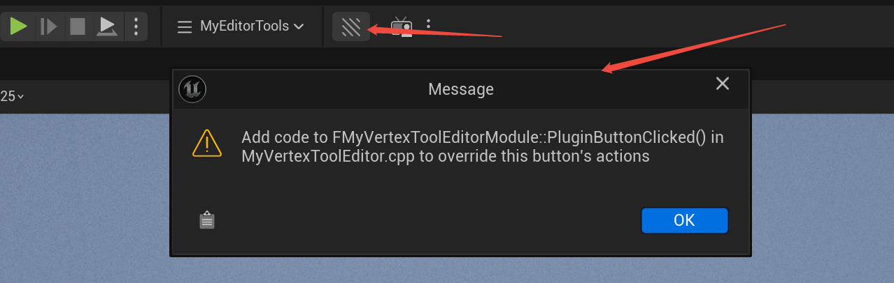
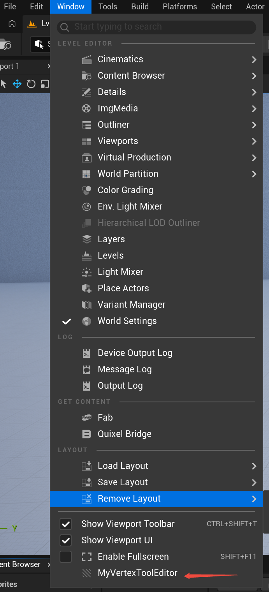
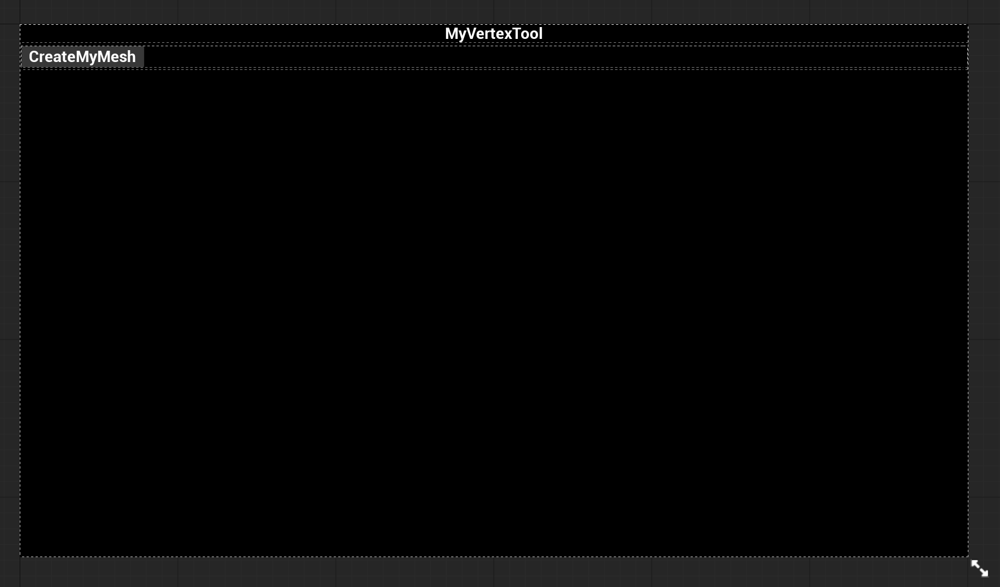
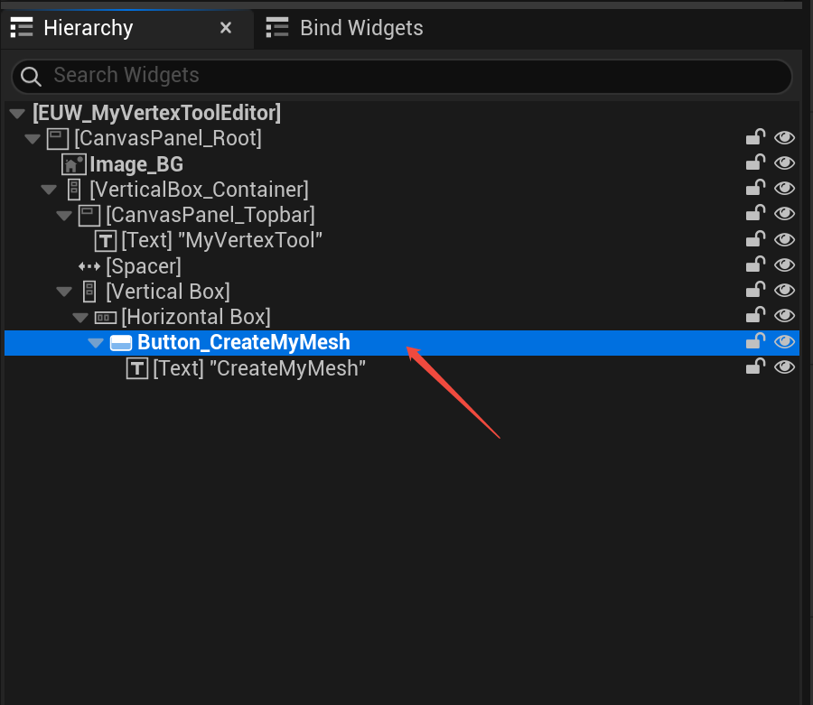
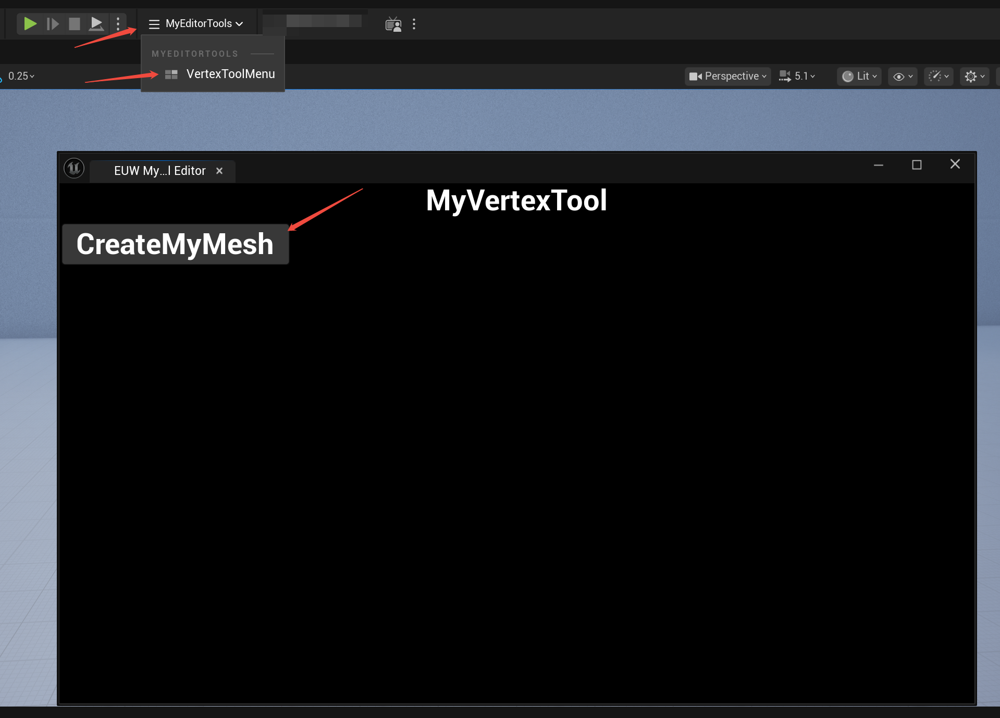
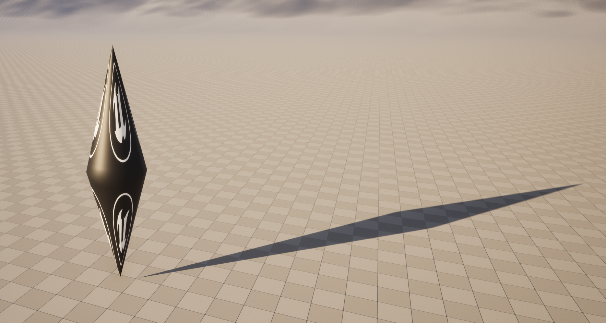
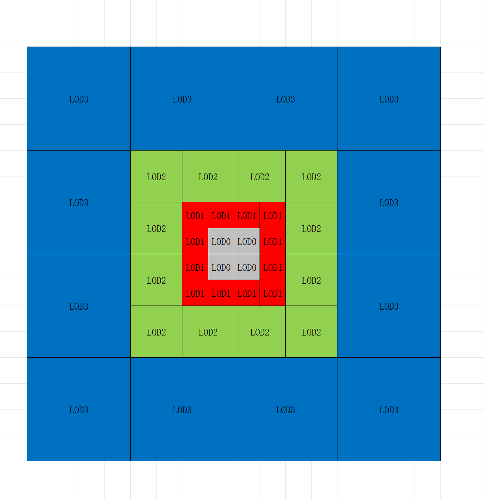
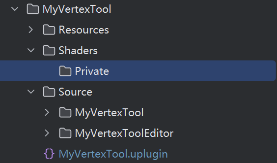

UE57自定义顶点
=================

(Github正常排版: [UE57自定义顶点](https://github.com/HHHHHHHHHHHHHHHHHHHHHCS/MyStudyNote/blob/main/MyNote/UE57%E8%87%AA%E5%AE%9A%E4%B9%89%E9%A1%B6%E7%82%B9.md))

(Github插件源码: [MyVertexTool](https://github.com/HHHHHHHHHHHHHHHHHHHHHCS/MyVertexTool))

------------------------

<!-- @import "[TOC]" {cmd="toc" depthFrom=1 depthTo=6 orderedList=false} -->

<!-- code_chunk_output -->

- [**0. 概述**](#0-概述)
- [**1. 插件初始化**](#1-插件初始化)
  - [**1.1. 结构准备**](#11-结构准备)
- [**2. Editor生成模型**](#2-editor生成模型)
  - [**2.1. 界面准备**](#21-界面准备)
  - [**2.2. 界面制作**](#22-界面制作)
  - [**2.3. 界面挂载**](#23-界面挂载)
  - [**2.4. 模型生成**](#24-模型生成)
  - [**2.5. 资源覆盖**](#25-资源覆盖)
- [**3. 自定义顶点工厂实现**](#3-自定义顶点工厂实现)
  - [**3.1. 整体思路**](#31-整体思路)
  - [**3.2. Mesh配置**](#32-mesh配置)
  - [**3.3. Mesh组件**](#33-mesh组件)
  - [**3.4. SceneProxy**](#34-sceneproxy)
  - [**3.5. VertexFactory**](#35-vertexfactory)
  - [**3.6. 模块依赖**](#36-模块依赖)
- [**4. Buffer与Shader接入**](#4-buffer与shader接入)
  - [**4.1. Shader公共结构**](#41-shader公共结构)
  - [**4.2. Buffer实现**](#42-buffer实现)
  - [**4.3. VertexShader注册**](#43-vertexshader注册)
    - [**4.3.1. Shaders路径注册**](#431-shaders路径注册)
    - [**4.3.2. VertexFactory参数绑定**](#432-vertexfactory参数绑定)

<!-- /code_chunk_output -->

------------------------

## **0. 概述**

&emsp;&emsp; 感觉很久没有写了, 对比上次写还是上次!!! 这一年主要都在学UE, 就来水一篇UE的学习吧. 在各位大佬面前班门弄斧.

因为渲染经常需要模型, 所以模型创建就很关键. 这篇就从基础讲怎么创建模型. 不得不说在Unity创建模型或自定义顶点, 用自定义的 Vertex Shader 非常简单, 到了UE就直接痛苦面具了!!!

本文分为两部分: 用 Editor 创建模型, 以及自定义顶点工厂.

**注意** UE 5.5.x 与 5.7.x 在 RHI / RDG 的 Buffer 创建接口上存在差异, 有编译冲突或被标记已过期!

------------------------

## **1. 插件初始化**

&emsp;&emsp; 我习惯用插件形式来做这类比较独立的功能, 便于后续移植与版本升级.

### **1.1. 结构准备**

打开 UE 顶部栏 Edit -> Plugins -> 左上角 Add -> Editor Tool Button, 我这里起名为 MyVertexTool. (起名有点过于随意了, UE 的 Plugins 创建流程里可选择的模板太多了)

然后打开 {项目}/Plugins/MyVertexTool/MyVertexTool.uplugin, 将 **CanContainContent** 从 false 改为 **true**. 在 Modules 中, 把第 1 个 Module 的 **Type** 从 Editor 改为 **Runtime**. 再在 Modules 中创建一份 Module 命名为 **MyVertexToolEditor**, Type 改为 **Editor**.

Runtime 模块用于运行时数据与渲染逻辑, Editor 模块仅负责编辑器工具.

```
{
	...
	"CanContainContent": true,
	...
	"Modules": [
		{
			"Name": "MyVertexTool",
			"Type": "Runtime",
			"LoadingPhase": "Default"
		},
		{
			"Name": "MyVertexToolEditor",
			"Type": "Editor",
			"LoadingPhase": "Default"
		}
	]
}
```

把 **MyVertexTool** 文件夹拷贝一份并命名为 **MyVertexToolEditor**. 删除 **MyVertexTool** 下的所有 `*.cpp` / `*.h` / `*.cs`. 后文再修改 **MyVertexToolEditor** 相关文件.

重新创建 MyVertexTool/MyVertexTool.Build.cs

```C#
using UnrealBuildTool;

public class MyVertexTool : ModuleRules
{
	public MyVertexTool(ReadOnlyTargetRules Target) : base(Target)
	{
		PCHUsage = ModuleRules.PCHUsageMode.UseExplicitOrSharedPCHs;

		PublicIncludePaths.AddRange(
			new string[]
			{
			}
		);

		PrivateIncludePaths.AddRange(
			new string[]
			{
			}
		);

		PublicDependencyModuleNames.AddRange(
			new string[]
			{
				"Core",
			}
		);

		PrivateDependencyModuleNames.AddRange(
			new string[]
			{
				"CoreUObject",
				"Engine",
				"Projects",
				"RenderCore"
			}
		);

		DynamicallyLoadedModuleNames.AddRange(
			new string[]
			{
			}
		);
	}
}
```

重新创建 MyVertexTool/Public/MyVertexTool.h

```C++
#pragma once

#include "Modules/ModuleManager.h"

class FMyVertexToolModule : public IModuleInterface
{
public:

	virtual void StartupModule() override;
	virtual void ShutdownModule() override;
};
```

重新创建 MyVertexTool/Private/MyVertexTool.cpp

```C++
#include "MyVertexTool.h"

static const FName MyVertexToolTabName("MyVertexTool");

#define LOCTEXT_NAMESPACE "FMyVertexToolModule"

void FMyVertexToolModule::StartupModule()
{
}

void FMyVertexToolModule::ShutdownModule()
{
}

#undef LOCTEXT_NAMESPACE

IMPLEMENT_MODULE(FMyVertexToolModule, MyVertexTool)
```

继续修改 **MyVertexToolEditor**, 修改文件名, 并且修改全部的类名/模块名/API 宏/Build.cs 文件

```
MyVertexTool.Build.cs -> MyVertexToolEditor.Build.cs

MyVertexTool.h -> MyVertexToolEditor.h
MyVertexToolCommands.h -> MyVertexToolEditorCommands.h
MyVertexToolStyle.h -> MyVertexToolEditorStyle.h

MyVertexTool.cpp -> MyVertexToolEditor.cpp
MyVertexToolCommands.cpp -> MyVertexToolEditorCommands.cpp
MyVertexToolStyle.cpp -> MyVertexToolEditorStyle.cpp
```

同时需要修改 MyVertexToolEditor.cpp 中的 `IMPLEMENT_MODULE` 宏参数.

```
...
IMPLEMENT_MODULE(FMyVertexToolEditorModule, MyVertexToolEditor)
```

尝试编译, UE 启动. 其实还可以进一步规范 Editor 的结构和代码, 这里先不展开细讲, 如果需要可以看下面几个修改点.

+ MyVertexToolEditorCommands.h 
  + 构造函数
+ MyVertexToolEditorStyle.cpp
  + FMyVertexToolEditorStyle::GetStyleSetName()
  + FMyVertexToolEditorStyle::Create()
+ FMyVertexToolEditorCommands.cpp
  + FMyVertexToolEditorCommands::RegisterCommands()
+ MyVertexToolEditor.cpp
  + static const FName MyVertexToolEditorTabName
  + #define LOCTEXT_NAMESPACE
  + FMyVertexToolEditorModule::PluginButtonClicked()

然后会发现顶部栏多了一个按钮, 点击会弹出提示窗口. 或者在顶部 `Window` 下也多了一个按钮, 点击效果相同.





------------------------

## **2. Editor生成模型**

&emsp;&emsp; 先尝试创建界面, 再通过界面按钮打开保存窗口, 生成 `StaticMesh` 并保存到本地, 最后用自定义 `CustomNode` 用于 Pixel 渲染.

### **2.1. 界面准备**

现在可以用刚生成的插件模板, 点击 `ToolbarMenu` 的按钮, 会弹出一个 `MessageDialog` 窗口.

界面分为 `Slate` 和 `EditorUtilityWidget` 两种模式. 因为 `Slate` 写法相对繁琐, 所以我个人更倾向使用 `EditorUtilityWidget` 来写界面.

创建 **MyVertexToolEditor/Public/MyVertexToolEditorWidget.h** 继承 **UEditorUtilityWidget**

这里先做一个简单版 `EditorUtilityWidget`: 放一个 `Button`, 点击后打开保存窗口, 最后把 `StaticMesh` 保存到项目工程.

代码因为个人习惯会先写变量后写方法, 在 C++ 中不是一个好习惯!

```C++
#pragma once

#include "CoreMinimal.h"
#include "EditorUtilityWidget.h"

#include "MyVertexToolEditorWidget.generated.h"

class UEditorUtilityButton;

UCLASS()
class MYVERTEXTOOLEDITOR_API UMyVertexToolEditorWidget : public UEditorUtilityWidget
{
	GENERATED_BODY()

public:
	UPROPERTY(meta=(BindWidget))
	UEditorUtilityButton* Button_CreateMyMesh;
	
public:
	virtual void NativeConstruct() override;

private:
	UFUNCTION()
	void OnClick_CreateMyMesh();

	static bool OpenSaveAssetDialog(FString& outPackagePath, FString& outAssetName);
	void CreateMyMesh(FString packagePath, FString assetName);
};

```

别忘了在 **MyVertexToolEditor.Build.cs** 中添加所需依赖模块. **UMG**, **UMGEditor**, **Blutility**

```C#
using UnrealBuildTool;

public class MyVertexToolEditor : ModuleRules
{
	public MyVertexToolEditor(ReadOnlyTargetRules Target) : base(Target)
	{
		...

		PrivateDependencyModuleNames.AddRange(
			new string[]
			{
				...
				"UMG",
				"UMGEditor",
				"Blutility",
			}
		);

		...
	}
}
```

为了保证编译通过, 先临时添加空实现. 创建 **MyVertexToolEditor/Private/MyVertexToolEditorWidget.cpp**, 后续再逐步完善.

```C++
#include "MyVertexToolEditorWidget.h"

void UMyVertexToolEditorWidget::NativeConstruct()
{
	Super::NativeConstruct();
}

void UMyVertexToolEditorWidget::OnClick_CreateMyMesh()
{
}

bool UMyVertexToolEditorWidget::OpenSaveAssetDialog(FString& outPackagePath, FString& outAssetName)
{
	return true;
}

void UMyVertexToolEditorWidget::CreateMyMesh(FString packagePath, FString assetName)
{
}

```

尝试编译, 启动成功!!!

### **2.2. 界面制作**

创建 `Blueprint`: **MyVertexTool/Editor/Blueprints/EUW_MyVertexToolEditor**, 并继承 **MyVertexToolEditorWidget**.

大致想法是 顶部居中显示标题 `MyVertexTool`. 下方按顺序放置一个 `Button_CreateMyMesh`. 其余用于后续功能扩展.

由于界面制作, 不好用文章表达, 大致看下面图示.

注意 `Button_CreateMyMesh` 的名字要和代码里面 **Button_CreateMyMesh** 绑定的一致, 因为使用了 `UPROPERTY(meta=(BindWidget))`.





### **2.3. 界面挂载**

接下来就是如何在点击顶部按钮时显示刚创建的界面了.

打开 **MyVertexToolEditorModule.h** , 添加接口 **CreateComboToolContent** 和 **OnMenuClicked_VertexTool**

**CreateComboToolContent**, 用于显示 `ToolMenu` 界面

**OnMenuClicked_VertexTool**, 用于创建并且显示插件界面

```C++

class FMyVertexToolEditorModule : public IModuleInterface
{
	...
private:
	void RegisterMenus();

	TSharedRef<SWidget> CreateComboToolContent() const;

	static void OnMenuClicked_VertexTool();
	
	...
};
```

打开 `MyVertexToolEditorModule.cpp`, 先修改 **FMyVertexToolEditorModule::RegisterMenus()** , 创建 **ToolMenus**

这里有个小麻烦: 如果想把多个插件的界面入口按钮合并到一个 ToolMenu 中, 一种做法是单独做一个插件统一管理 Toolbar UI.

FSlateIcon 位置在 Engine/Content/Editor/Slate 下, 相关可以参考 Engine/Source/Editor/EditorStyle/Private/StarshipStyle.cpp 文件.

```C++
void FMyVertexToolEditorModule::RegisterMenus()
{
	// Owner will be used for cleanup in call to UToolMenus::UnregisterOwner
	FToolMenuOwnerScoped OwnerScoped(this);

	UToolMenu* ToolbarMenu = UToolMenus::Get()->ExtendMenu("LevelEditor.LevelEditorToolBar.PlayToolBar");
	if (!ToolbarMenu)
	{
		return;
	}

	// UE 如果要多个插件使用一个ToolbarMenu, 一种做法是单独创建插件用于统一管理 Toolbar UI
	FToolMenuSection& Section = ToolbarMenu->FindOrAddSection("MyEditorToolsMenu");

	// 如何找到 EditorViewportToolBar.OptionsDropdown 对应的 UI 图标
	// 可以看 Engine/Source/Editor/EditorStyle/Private/StarshipStyle.cpp 查找 EditorViewportToolBar.OptionsDropdown
	// 打开 Engine/Content/Editor/Slate 文件夹, 再根据 IMAGE_BRUSH_SVG("Starship/EditorViewport/menu") 就是对应的UI
	const FUIAction PlatformMenuShownDelegate;
	FToolMenuEntry Entry = FToolMenuEntry::InitComboButton(
		"MyEditorToolsMenu",
		PlatformMenuShownDelegate,
		FOnGetContent::CreateLambda([this] { return CreateComboToolContent(); }),
		LOCTEXT("MyEditorTools", "MyEditorTools"),
		LOCTEXT("MyEditorTools_Tooltip", "MyEditorTools_Tooltip"),
		FSlateIcon(FAppStyle::GetAppStyleSetName(), "EditorViewportToolBar.OptionsDropdown"),
		false,
		"PlatformsMenu");
	Entry.StyleNameOverride = "CalloutToolbar";
	Section.AddEntry(Entry);
}
```

继续完善 **FMyVertexToolEditorModule::CreateComboToolContent()**

这里创建 **ToolMenus** 的子选项 **ToolMenuSection**

```C++
...
TSharedRef<SWidget> FMyVertexToolEditorModule::CreateComboToolContent() const
{
	static const FName MenuName("LevelEditor.MainMenu.Window.MyEditorToolsMenu");
	if (!UToolMenus::Get()->IsMenuRegistered(MenuName))
	{
		UToolMenu* Menu = UToolMenus::Get()->RegisterMenu(MenuName);
		// 可以添加不同的section, 分割用
		// FToolMenuSection& ManagePlatformsSection = Menu->AddSection("MyToolsMenu_Other", LOCTEXT("MyEditorTools_Other", "MyEditorTools/Other"));
		FToolMenuSection& ManagePlatformsSection = Menu->AddSection("MyToolsMenu", LOCTEXT("MyEditorTools", "MyEditorTools"));
		ManagePlatformsSection.AddDynamicEntry(
			FName("MyEditorTools"),
			FNewToolMenuSectionDelegate::CreateLambda([](FToolMenuSection& PlatformsSection)
			{
				PlatformsSection.AddMenuEntry(
					NAME_None,
					LOCTEXT("VertexToolMenu", "VertexToolMenu"),
					LOCTEXT("VertexToolMenu_Tooltip", "VertexToolMenu"),
					FSlateIcon(FAppStyle::GetAppStyleSetName(), "LevelEditor.Tabs.Viewports"),
					FUIAction(
						FExecuteAction::CreateStatic(&FMyVertexToolEditorModule::OnMenuClicked_VertexTool))
				);

				// 如果是UI合集插件, 这里可以继续添加按钮
			}));
	}

	const FToolMenuContext MenuContext(PluginCommands);

	return UToolMenus::Get()->GenerateWidget(MenuName, MenuContext);
}
...
```

最后完善 **FMyVertexToolEditorModule::OnMenuClicked_VertexTool()**

这里用于点击该菜单项(Section), 显示 `EUW_MyVertexToolEditor` 界面

别忘了添加两个include

蓝图的路径可以 选中资源 -> ctrl+c 或者 选中资源 -> 右键 -> Copy Reference

```C++
#include "EditorUtilitySubsystem.h"
#include "EditorUtilityWidgetBlueprint.h"

...
void FMyVertexToolEditorModule::OnMenuClicked_VertexTool()
{
	UEditorUtilitySubsystem* EditorUtilitySubsystem = GEditor->GetEditorSubsystem<UEditorUtilitySubsystem>();
	if (!EditorUtilitySubsystem)
	{
		UE_LOG(LogTemp, Warning, TEXT("Failed to get EditorUtilitySubsystem"));
		return;
	}
	const FString BlueprintPathStr = TEXT("/Script/Blutility.EditorUtilityWidgetBlueprint'/MyVertexTool/Editor/Blueprints/EUW_MyVertexToolEditor.EUW_MyVertexToolEditor'");
	const FSoftObjectPath BlueprintPath = BlueprintPathStr;
	UObject* BlueprintObject = BlueprintPath.TryLoad();
	UEditorUtilityWidgetBlueprint* LoadedEditorUtilityBlueprint = Cast<UEditorUtilityWidgetBlueprint>(BlueprintObject);
	EditorUtilitySubsystem->SpawnAndRegisterTabWithId(LoadedEditorUtilityBlueprint, FName(TEXT("MyVertexTool")));
}
```

编译并启动后, 点击按钮即可显示 EUW 蓝图界面. 到此为止, 已经完成界面的显示和绑定.



### **2.4. 模型生成**

先完成 `Button` 事件的绑定和相关流程. 点击按钮 -> 资源保存窗口 -> 返回资源路径和名称 -> 保存到本地.

继续完善 **MyVertexToolEditorWidget.cpp**, 修改之前添加的空实现.

别忘了添加include.

```C++
...
#include "EditorUtilityWidgetComponents.h"

void UMyVertexToolEditorWidget::NativeConstruct()
{
	Super::NativeConstruct();
	
	if (IsValid(Button_CreateMyMesh))
	{
		Button_CreateMyMesh->OnClicked.AddDynamic(this, &UMyVertexToolEditorWidget::OnClick_CreateMyMesh);
	}
}

void UMyVertexToolEditorWidget::OnClick_CreateMyMesh()
{
	FString outPackagePath;
	FString outAssetName;
	bool canSave = OpenSaveAssetDialog(outPackagePath, outAssetName);

	if (!canSave)
	{
		return;
	}

	CreateMyMesh(outPackagePath, outAssetName);
}

```

然后完善 **UMyVertexToolEditorWidget::OpenSaveAssetDialog()** 弹出保存窗口相关逻辑.

注意保存的文件要在 `Content` 目录下, 而且最后要转换成UE的虚拟路径.

```C++
...
#include "DesktopPlatformModule.h"

...

bool UMyVertexToolEditorWidget::OpenSaveAssetDialog(FString& outPackagePath, FString& outAssetName)
{
	IDesktopPlatform* desktopPlatform = FDesktopPlatformModule::Get();
	if (!desktopPlatform)
	{
		return false;
	}

	void* parentWindowHandle = nullptr;

	const FString defaultPath = FPaths::ProjectContentDir();
	const FString defaultFile = TEXT("MyMeshAsset");

	TArray<FString> outFiles;

	bool bResult = desktopPlatform->SaveFileDialog(
		parentWindowHandle,
		TEXT("Save Asset"),
		defaultPath,
		defaultFile,
		TEXT("Unreal Asset (*.uasset)|*.uasset"),
		EFileDialogFlags::None,
		outFiles
	);

	if (!bResult || outFiles.Num() == 0)
	{
		return false;
	}

	FString fullPath = outFiles[0];

	// 必须在 Content 目录下
	if (!fullPath.StartsWith(FPaths::ProjectContentDir()))
	{
		UE_LOG(LogTemp, Error, TEXT("Asset must be saved under Content folder"));
		return false;
	}

	// 磁盘路径 -> /Game/ 路径
	FString relativePath = fullPath;
	FPaths::MakePathRelativeTo(relativePath, *FPaths::ProjectContentDir());

	FString packagePath = TEXT("/Game/") + FPaths::GetPath(relativePath);
	FString assetName = FPaths::GetBaseFilename(relativePath);

	outPackagePath = packagePath;
	outAssetName = assetName;
	return true;
}

```

有了路径之后, 就是完成模型的数据初始化, 创建和保存.

这里写一个稍微复杂点的模型: 双锥体. 注意 UE 的尺寸单位是 cm, 相比 Unity 要 x100, UV 是翻转的, z 轴是向上的.

这里只用 Index, Vertex, UV, Tangent, Normal, 其中 Tangent 和 Normal 准备自动生成.

```C++
...
#include "StaticMeshAttributes.h"
#include "AssetRegistry/AssetRegistryModule.h"

...

void UMyVertexToolEditorWidget::CreateMyMesh(FString packagePath, FString assetName)
{
	constexpr float k_MeshHeight = 4.0f;
	constexpr float k_MeshRadius = 1.0f;
	constexpr int32 k_MeshWNum = 30;
	constexpr int32 k_MeshHNum = 13;

	FVector3f vertices[k_MeshWNum + 1][k_MeshHNum * 2 + 1];
	FVector2f uvs[k_MeshWNum + 1][k_MeshHNum * 2 + 1];
	float delta = 2.0f * PI / k_MeshWNum;
	for (int32 i = 0; i < k_MeshWNum + 1; i++)
	{
		float a = i * delta;
		if (i == k_MeshWNum)
		{
			a = 0;
		}

		float x = FMath::Sin(a);
		float z = FMath::Cos(a);
		for (int j = -k_MeshHNum; j <= k_MeshHNum; j++)
		{
			float y = k_MeshHeight * j / k_MeshHNum;

			float r = (1 - (float)FMath::Abs(j) / k_MeshHNum) * k_MeshRadius;
			// 注意向上的轴是z, 尺寸单位是 cm 所以x100
			vertices[i][j + k_MeshHNum] = 100.0f * FVector3f(x * r, z * r, y);

			FVector2f uv = FVector2f(
				4.0f * i / k_MeshWNum,
				(float)j / k_MeshHNum);

			// 因为UE UV Y 和 Unity 不太一样
			uv.Y = -uv.Y;

			uvs[i][j + k_MeshHNum] = uv;
		}
	}

	constexpr int32 k_VertexCount = (k_MeshWNum + 1) * (2 * k_MeshHNum + 1);
	constexpr int32 k_IndicesCount = k_MeshWNum * (2 * k_MeshHNum) * 6;

	// 把二维数组转换为一维线性数据
	TArray<FVector3f> vertArray;
	vertArray.SetNum(k_VertexCount);
	TArray<FVector2f> uvArray;
	uvArray.SetNum(k_VertexCount);
	TArray<int32> indexArray;
	indexArray.SetNum(k_IndicesCount);

	int32 currIdx = 0;
	for (int32 i = 0; i < k_MeshWNum + 1; i++)
	{
		for (int32 j = 0; j < k_MeshHNum * 2 + 1; j++)
		{
			int32 idx = i * (k_MeshHNum * 2 + 1) + j;
			vertArray[idx] = vertices[i][j];
			uvArray[idx] = uvs[i][j];
			currIdx++;
		}
	}

	currIdx = 0;
	for (int32 i = 0; i < k_MeshWNum; i++)
	{
		for (int32 j = 0; j < k_MeshHNum * 2; j++)
		{
			// Quad的四个顶点
			int32 i0 = i * (k_MeshHNum * 2 + 1) + j;
			int32 i1 = i * (k_MeshHNum * 2 + 1) + (j + 1);
			int32 i2 = (i + 1) * (k_MeshHNum * 2 + 1) + (j + 1);
			int32 i3 = (i + 1) * (k_MeshHNum * 2 + 1) + j;

			// Triangle 1: v2 v1 v0
			indexArray[currIdx + 0] = i2;
			indexArray[currIdx + 1] = i1;
			indexArray[currIdx + 2] = i0;
			// Triangle 2: v3 v2 v0
			indexArray[currIdx + 3] = i3;
			indexArray[currIdx + 4] = i2;
			indexArray[currIdx + 5] = i0;

			currIdx += 6;
		}
	}

	// TODO:
}

```

数据准备完了, 开始导入数据给 Mesh.

先导入 `Position` 数据, 再 `CreatePolygonGroup`, 利用 `Polygon` 创建 UV.

```C++

void UMyVertexToolEditorWidget::CreateMyMesh(FString packagePath, FString assetName)
{
	...

	FMeshDescription meshDesc;
	FStaticMeshAttributes attributes{meshDesc};
	attributes.Register();

	TVertexAttributesRef<FVector3f> posRef = attributes.GetVertexPositions();
	TMap<int32, FVertexID> vertexIDs;
	for (int i = 0; i < vertArray.Num(); i++)
	{
		FVertexID vertexID = meshDesc.CreateVertex();
		vertexIDs.Add(i, vertexID);
		posRef[vertexID] = vertArray[i];
	}

	FPolygonGroupID polyGroup = meshDesc.CreatePolygonGroup();
	// 设置polygon name, 之后设置材质要和这个name一样
	attributes.GetPolygonGroupMaterialSlotNames()[polyGroup] = FName("Default");

	TVertexInstanceAttributesRef<FVector2f> uvs0Ref = attributes.GetVertexInstanceUVs();
	uvs0Ref.SetNumChannels(1);

	const int32 k_PolygonTypeNum = 3;
	TArray<FVertexInstanceID> instanceIDs;
	instanceIDs.SetNum(k_PolygonTypeNum);

	currIdx = 0;
	for (int i = 0; i < indexArray.Num() / k_PolygonTypeNum; i++)
	{
		for (int j = 0; j < k_PolygonTypeNum; j++)
		{
			int32 idx = indexArray[currIdx];
			FVertexID vertexID = vertexIDs[idx];
			FVertexInstanceID vi = meshDesc.CreateVertexInstance(vertexID);
			instanceIDs[j] = vi;
			uvs0Ref.Set(vi, 0, uvArray[idx]);
			currIdx++;
		}

		meshDesc.CreatePolygon(polyGroup, instanceIDs);
	}

	// TODO:
}

```

接下来就创建 `UStaticMesh`.

UE 重写了 `/`, 可以用它来拼接路径. 在该路径下实例化一个 `NewObject<UStaticMesh>`, 然后再初始化 Resource 和 Models. 使用 `RF_Public | RF_Standalone` 标志, 以确保该资源可以被正常保存, 引用并显示在内容浏览器中.

构建 Model, 构建参数里标记重建 `Normal` 和 `Tangent`, 并移除未被引用的三角形(虽然这里的 Demo 不存在未被引用的三角形).

再给 Mesh 提供默认材质, 注意 `MaterialSlotNames` 的 **Default** 要和上面的 `PolygonGroupMaterialSlotNames` 一致.

在构建 `FBuildMeshDescriptionsParams` 时, 因为直接用于渲染, 不需要 CPU 做读写, 所以 `bAllowCpuAccess` 为 **false**. 之后利用 `BuildFromMeshDescriptions` 根据 Mesh 生成渲染资源.

最后, 调用 `MarkPackageDirty` 标记资源包发生修改, 并通过 `AssetRegistry` 通知编辑器系统有新的资产被创建.

```C++

void UMyVertexToolEditorWidget::CreateMyMesh(FString packagePath, FString assetName)
{
	...

	// UE 重载了 '/', 这里用于路径拼接
	FString fullPackageName = packagePath / assetName;
	UPackage* package = CreatePackage(*fullPackageName);

	UStaticMesh* staticMesh = NewObject<UStaticMesh>(
		package,
		*assetName,
		RF_Public | RF_Standalone);

	// staticMesh->bSupportRayTracing = 0;
	staticMesh->InitResources();
	staticMesh->SetNumSourceModels(1);

	FStaticMeshSourceModel& srcModel = staticMesh->GetSourceModel(0);
	srcModel.BuildSettings.bRecomputeNormals = true;
	srcModel.BuildSettings.bRecomputeTangents = true;
	srcModel.BuildSettings.bRemoveDegenerates = true;

	UMaterialInterface* defaultMaterial = UMaterial::GetDefaultMaterial(MD_Surface);
	staticMesh->GetStaticMaterials().Add(FStaticMaterial(defaultMaterial, FName("Default")));

	UStaticMesh::FBuildMeshDescriptionsParams params;
	params.bFastBuild = false;
	params.bUseHashAsGuid = true;
	params.bMarkPackageDirty = true;
	params.bCommitMeshDescription = true;
	params.bAllowCpuAccess = false;
	staticMesh->BuildFromMeshDescriptions({&meshDesc}, params);

	staticMesh->MarkPackageDirty();

	FAssetRegistryModule::AssetCreated(staticMesh);
}

```

最后别忘记在 **MyVertexToolEditor.Build.cs** 中补充依赖的 Module: DesktopPlatform, MeshDescription, StaticMeshDescription, AssetRegistry.

```C#
...
public MyVertexToolEditor(ReadOnlyTargetRules Target) : base(Target)
{
	...
	PrivateDependencyModuleNames.AddRange(
		new string[]
		{
			...
			"DesktopPlatform",
			"MeshDescription",
			"StaticMeshDescription",
			"AssetRegistry",
			// ... add private dependencies that you statically link with here ...	
		}
	);
	...
}

```

编译启动. 点击按钮 创建 Mesh 再保存到本地, 之后把它拖入场景, 给一个材质, 大功告成!




### **2.5. 资源覆盖**

到此为止基本已经结束了, 但是还存在一个问题, 如果我要覆盖已有模型就会直接 Crash.

> Error: A FRenderResource was deleted without being released first!

我暂时的解决办法是修改已有模型资源, 而不是直接覆盖资源文件.

继续修改 **UMyVertexToolEditorWidget::CreateMyMesh()**

判断资源是否已经存在. 如果不存在就 NewObject, 否则就 Modify. 注意要等待渲染线程结束后再释放渲染资源.

```C++
void UMyVertexToolEditorWidget::CreateMyMesh(FString packagePath, FString assetName)
{
	...
	// UE 重载了 '/', 这里用于路径拼接
	FString fullPackageName = packagePath / assetName;
	UPackage* package = CreatePackage(*fullPackageName);

	// 判断是否存在, 如果存在就做修改, 不存在就New
	UStaticMesh* staticMesh = FindObject<UStaticMesh>(package, *assetName);
	const bool bIsNewAsset = (staticMesh == nullptr);
	
	if (bIsNewAsset)
	{
		staticMesh = NewObject<UStaticMesh>(package, *assetName, RF_Public | RF_Standalone);
	}
	else
	{
		// 先释放资源, 注意要等待渲染线程完成后再继续
		staticMesh->Modify(); // 记录修改
		staticMesh->ReleaseResources();
		FlushRenderingCommands(); // 等渲染线程彻底放掉旧资源
		staticMesh->GetStaticMaterials().Reset();
	}

	...
}
```

在 **MyVertexToolEditor.Build.cs** 中补充依赖模块: RenderCore.

```C#
...
public MyVertexToolEditor(ReadOnlyTargetRules Target) : base(Target)
{
	...
	PrivateDependencyModuleNames.AddRange(
		new string[]
		{
			...
			"RenderCore",
			// ... add private dependencies that you statically link with here ...	
		}
	);
	...
}

```

编译启动! 再次尝试替换资源, 保存. 执行成功!

至此, 用 Editor 创建 Mesh 的部分已经结束了.

------------------------

## **3. 自定义顶点工厂实现**

&emsp;&emsp; 上面的流程和在外部创建模型后再导入区别不大. 接下来进入自定义顶点工厂, 支持动态修改顶点, Draw Instance 等, 但实现也更复杂.

大致想做一个: 由 `Quad` 组成, 类似九宫格, 最大为 LOD3 的地形块. 类似下图这种感觉.

生成 16x16 Quad 且 5x5m 的 `Quad` Mesh 当作 LOD0. 通过 `Draw Instance` 来绘制, 并且支持顶点偏移. (如果想继续写, 还能完成 CPU 侧 `Quad` 的 Culling, 随相机更新, 以及 LOD 之间的临边切换问题等)



### **3.1. 整体思路**

1. 要实现自定义模型, 就要先继承 `UMeshComponent`
    + 让该组件参与场景管理, 变换, 剔除等流程
    + 为后续创建 `FPrimitiveSceneProxy` 提供容器
2. 创建 `FPrimitiveSceneProxy` 负责渲染描述
    + 向渲染系统描述该如何绘制
    + 持有 `FVertexFactory`
    + 组织 `FMeshBatch` 并提交给渲染管线
    + 将 Component 中的数据安全地传递到渲染线程
3. 创建 `FVertexFactory`
    + 有顶点 Buffer `vertexBuffer` / `indexBuffer` / `instanceBuffer` / `uniformBuffer` 等
    + 绑定 Vertex Shader. `FVertexFactory` 是 CPU 侧顶点数据与 GPU Shader 之间的桥梁
4. 顶点相关 Buffer 大多继承自 `FRenderResource`
5. 编写 Shader 接口, 实现 VertexFactory.ush
    + 定义顶点输入结构(ATTRIBUTE / TEXCOORD 等)
    + 描述每个顶点属性如何从 Buffer 中读取

### **3.2. Mesh配置**

因为后面会反复使用相关配置, 所以先写一个配置类, 之后 include 就可以方便使用了.

创建 **MyVertexTool/Public/MyMeshConfig.h**, 配置详细内容具体看注释.

```C++
#pragma once

constexpr uint32 k_LODMaxLevel = 3; // Lod最大级别
constexpr int32 k_TessQuadCount = 16; // Quad细分成个数 count x count
constexpr int32 k_QuadWorldScale = 5; // level0 对应几米 之后 x2 递增

constexpr uint32 k_QuadCount = 4 + 12 * k_LODMaxLevel;
constexpr int32 k_PointCount = k_TessQuadCount + 1;
constexpr uint32 k_VertexCount = k_PointCount * k_PointCount;
constexpr uint32 k_IndexCount = 6 * k_TessQuadCount * k_TessQuadCount;
// 注意这里只是最大缩放, 如果要计算位置 要乘以100  (1m == UE 100cm)
constexpr float k_MaxWorldScale = k_QuadWorldScale * (1 << k_LODMaxLevel);

constexpr int32 k_WorldMinHeight = -100; // 最低多少cm
constexpr int32 k_WorldMaxHeight = 1000; // 最高多少cm
constexpr int32 k_WorldHeightCenter = 0.5f * (k_WorldMinHeight + k_WorldMaxHeight);
constexpr int32 k_WorldHeightExtent = 0.5f * (k_WorldMaxHeight - k_WorldMinHeight);

```

### **3.3. Mesh组件**

先创建 **MyVertexTool/Public/MyMeshComponent.h**

**myMaterialInst** : `UMeshComponent` 要保存需要渲染的 `Material`, 然后传给 `FPrimitiveSceneProxy`

**bEvaluateWorldPositionOffset** : 后续用于支持材质的 `WPO` 

重写 **CreateSceneProxy()** : 返回我们自己的 `FPrimitiveSceneProxy`

重写 **CalcBounds()** : 没有重写这个 Bounds, 会被 UE CPU 侧直接 culling, 从而导致不渲染

重写 **GetUsedMaterials** : 注册要使用的 Material, 不注册会报错

**GetMyMaterial()** : 用于 `FPrimitiveSceneProxy` 中渲染数据准备

```C++
#pragma once

#include "CoreMinimal.h"
#include "Components/MeshComponent.h"
#include "MyMeshComponent.generated.h"


UCLASS(ClassGroup=(Custom), meta=(BlueprintSpawnableComponent))
class MYVERTEXTOOL_API UMyMeshComponent : public UMeshComponent
{
	GENERATED_BODY()

public:
	UPROPERTY(EditAnywhere, BlueprintReadOnly, Category="Materials")
	TObjectPtr<UMaterialInstance> myMaterialInst;

	UPROPERTY(EditAnywhere, BlueprintReadOnly, Category="MyMesh")
	uint8 bEvaluateWorldPositionOffset : 1;

public:
	UMyMeshComponent();

	virtual ~UMyMeshComponent() override;

protected:
	virtual void BeginPlay() override;

public:
	virtual void TickComponent(float DeltaTime, ELevelTick TickType, FActorComponentTickFunction* ThisTickFunction) override;

	virtual FPrimitiveSceneProxy* CreateSceneProxy() override;

	virtual FBoxSphereBounds CalcBounds(const FTransform& LocalToWorld) const override;

	virtual void GetUsedMaterials(TArray<UMaterialInterface*>& OutMaterials, bool bGetDebugMaterials = false) const override;

public:
	UMaterialInstance* GetMyMaterial() const { return myMaterialInst.Get(); }
};

```

再创建 **MyVertexTool/Private/MyMeshComponent.cpp**

暂时先实现 **CalcBounds()**

**CreateSceneProxy()** 在后面 `FPrimitiveSceneProxy` 类 创建后 再实现.

```C++
#include "MyMeshComponent.h"
#include "MyMeshConfig.h"

UMyMeshComponent::UMyMeshComponent()
{
	PrimaryComponentTick.bCanEverTick = true;
}

UMyMeshComponent::~UMyMeshComponent()
{
}

void UMyMeshComponent::BeginPlay()
{
	Super::BeginPlay();
}

void UMyMeshComponent::TickComponent(float DeltaTime, ELevelTick TickType, FActorComponentTickFunction* ThisTickFunction)
{
	Super::TickComponent(DeltaTime, TickType, ThisTickFunction);
}

FPrimitiveSceneProxy* UMyMeshComponent::CreateSceneProxy()
{
	// TODO:
	return nullptr;
}

FBoxSphereBounds UMyMeshComponent::CalcBounds(const FTransform& LocalToWorld) const
{
	// 因为这个是extent(半尺寸) 所以要*2
	const float k_AABBExtent = 100 * 2 * k_MaxWorldScale;

	FBoxSphereBounds newBounds;
	newBounds.Origin = FVector{0, 0, k_WorldHeightCenter};
	newBounds.BoxExtent = FVector{k_AABBExtent, k_AABBExtent, k_WorldHeightExtent};
	newBounds.SphereRadius = 1.414214f * k_AABBExtent; // 1.414 = sqrt(2)
	return newBounds.TransformBy(LocalToWorld);
}

void UMyMeshComponent::GetUsedMaterials(TArray<UMaterialInterface*>& OutMaterials, bool bGetDebugMaterials) const
{
	OutMaterials.Add(GetMyMaterial());
}

```

### **3.4. SceneProxy**

创建 **MyVertexTool/Public/MyMeshSceneProxy.h**

**FMyMeshVertexFactory** 在之后创建

**GetTypeHash()**, **GetMemoryFootprint()**, **NewGetAllocatedSize()** 照着UE官方代码实现的

```C++
#pragma once

class UMyMeshComponent;
class FMyMeshVertexFactory;

class FMyMeshSceneProxy final : public FPrimitiveSceneProxy
{
private:
	TObjectPtr<UMyMeshComponent> myMeshComponent;
	TUniquePtr<FMyMeshVertexFactory> myMeshVertexFactory;

public:
	FMyMeshSceneProxy(UMyMeshComponent* _myMeshComponent);

	virtual ~FMyMeshSceneProxy() override;

	virtual SIZE_T GetTypeHash() const override
	{
		static size_t UniquePointer;
		return reinterpret_cast<size_t>(&UniquePointer);
	}

	virtual uint32 GetMemoryFootprint() const override
	{
		return sizeof(*this) + NewGetAllocatedSize();
	}

	uint32 NewGetAllocatedSize() const
	{
		return (uint32)(FPrimitiveSceneProxy::GetAllocatedSize());
	}

	virtual FPrimitiveViewRelevance GetViewRelevance(const FSceneView* View) const override;

	virtual void GetDynamicMeshElements(
		const TArray<const FSceneView*>& Views, const FSceneViewFamily& ViewFamily, uint32 VisibilityMap,
		class FMeshElementCollector& Collector) const override;
};

```

创建 **MyVertexTool/Private/MyMeshSceneProxy.cpp**

先临时实现空方法

```C++
#include "MyMeshSceneProxy.h"
#include "MyMeshComponent.h"

FMyMeshSceneProxy::FMyMeshSceneProxy(UMyMeshComponent* _myMeshComponent)
	: FPrimitiveSceneProxy(_myMeshComponent)
{
}

FMyMeshSceneProxy::~FMyMeshSceneProxy()
{
}

FPrimitiveViewRelevance FMyMeshSceneProxy::GetViewRelevance(const FSceneView* View) const
{
	// TODO:
	return FPrimitiveSceneProxy::GetViewRelevance(View);
}

void FMyMeshSceneProxy::GetDynamicMeshElements(const TArray<const FSceneView*>& Views, const FSceneViewFamily& ViewFamily, uint32 VisibilityMap, class FMeshElementCollector& Collector) const
{
	// TODO:
	FPrimitiveSceneProxy::GetDynamicMeshElements(Views, ViewFamily, VisibilityMap, Collector);
}

```

同时回到 **MyMeshComponent.cpp**, 完善 **CreateSceneProxy()** 方法

```C++
#include "MyMeshSceneProxy.h"

...

FPrimitiveSceneProxy* UMyMeshComponent::CreateSceneProxy()
{
	return new FMyMeshSceneProxy(this);
}
```

### **3.5. VertexFactory**

创建 **MyVertexTool/Public/MyMeshVertexFactory.h**

个人代码习惯: 在 .h 中尽量减少 #include, 优先使用前向声明(forward declaration). 在 .cpp 中再 include 真正需要的头文件

**FMyMeshVertexBuffer** : 顶点信息数据
**FMyMeshIndexBuffer** : 顶点索引数据
**FMyMeshInstanceBuffer** : Instance数据
**FMyMeshParamsBuffer** : 共享 Uniform 数据

```C++
#pragma once

class FMyMeshVertexBuffer;
class FMyMeshIndexBuffer;
class FMyMeshInstanceBuffer;
class FMyMeshParamsBuffer;

class FMyMeshVertexFactory final : public FVertexFactory
{
	DECLARE_VERTEX_FACTORY_TYPE(FMyMeshVertexFactory);

public:
	using Super = FVertexFactory;

private:
	bool isBorder;
	TUniquePtr<FMyMeshVertexBuffer> vertexBuffer;
	TUniquePtr<FMyMeshIndexBuffer> indexBuffer;
	TUniquePtr<FMyMeshInstanceBuffer> instanceBuffer;
	TUniquePtr<FMyMeshParamsBuffer> paramsBuffer;

public:
	FMyMeshVertexFactory(ERHIFeatureLevel::Type InFeatureLevel);

	virtual ~FMyMeshVertexFactory() override;

	static bool ShouldCompilePermutation(const FVertexFactoryShaderPermutationParameters& Parameters);

	static void ModifyCompilationEnvironment(const FVertexFactoryShaderPermutationParameters& Parameters,
											FShaderCompilerEnvironment& OutEnvironment);

	static void ValidateCompiledResult(const FVertexFactoryType* Type, EShaderPlatform Platform,
										const FShaderParameterMap& ParameterMap, TArray<FString>& OutErrors);

	static void GetPSOPrecacheVertexFetchElements(EVertexInputStreamType VertexInputStreamType,
												FVertexDeclarationElementList& Elements);

	virtual void InitRHI(FRHICommandListBase& RHICmdList) override;
	virtual void ReleaseRHI() override;

	UE_NODISCARD_CTOR FORCEINLINE FMyMeshVertexBuffer* GetVertexBuffer() const { return vertexBuffer.Get(); }
	UE_NODISCARD_CTOR FORCEINLINE FMyMeshIndexBuffer* GetIndexBuffer() const { return indexBuffer.Get(); }
	UE_NODISCARD_CTOR FORCEINLINE FMyMeshInstanceBuffer* GetInstanceBuffer() const { return instanceBuffer.Get(); }
	UE_NODISCARD_CTOR FORCEINLINE FMyMeshParamsBuffer* GetParamsBuffer() const { return paramsBuffer.Get(); }
};

```

创建 **MyVertexTool/Private/MyMeshVertexFactory.cpp**, 实现空的方法

之后再继续补充. 因为还要 Vertex Shader 对 VertexFactory 进行绑定

```C++
#include "MyMeshVertexFactory.h"

FMyMeshVertexFactory::FMyMeshVertexFactory(ERHIFeatureLevel::Type InFeatureLevel)
	: FVertexFactory(InFeatureLevel)
{
}

FMyMeshVertexFactory::~FMyMeshVertexFactory()
{
}

bool FMyMeshVertexFactory::ShouldCompilePermutation(const FVertexFactoryShaderPermutationParameters& Parameters)
{
	return true;
}

void FMyMeshVertexFactory::ModifyCompilationEnvironment(const FVertexFactoryShaderPermutationParameters& Parameters,
														FShaderCompilerEnvironment& OutEnvironment)
{
}

void FMyMeshVertexFactory::ValidateCompiledResult(const FVertexFactoryType* Type, EShaderPlatform Platform,
												const FShaderParameterMap& ParameterMap, TArray<FString>& OutErrors)
{
}

void FMyMeshVertexFactory::GetPSOPrecacheVertexFetchElements(EVertexInputStreamType VertexInputStreamType,
															FVertexDeclarationElementList& Elements)
{
}

void FMyMeshVertexFactory::InitRHI(FRHICommandListBase& RHICmdList)
{
	FVertexFactory::InitRHI(RHICmdList);
}

void FMyMeshVertexFactory::ReleaseRHI()
{
	FVertexFactory::ReleaseRHI();
}

```

### **3.6. 模块依赖**

因为代码都和渲染有关, 所以继续补充依赖库 **MyVertexTool.Build.cs**, 添加
 **RHI** 和 **Renderer** .

写了 **FMyMeshVertexFactory**, 但是并没有完成 Vertex Shader 的绑定, 所以此时还是无法编译通过.

```C#
...

PrivateDependencyModuleNames.AddRange(
	new string[]
	{
		...
		"RHI",
		"Renderer",
	}
);

```

------------------------

## **4. Buffer与Shader接入**

### **4.1. Shader公共结构**

在创建相关 Buffer 之前, 先定义 Buffer 所需要的数据结构

创建 **MyVertexTool/Public/MyMeshShaderCommon.h**

因为 Demo 比较简单. 顶点数据只需要 Position, UV 可以通过 WorldPosition 推算出来, Normal 基本都是向上的, 如果有 WPO 则用法线图替代.

InstanceBuffer: 只记录 Quad 的偏移和 LOD 缩放.

公共 Parameters: 只保存 LOD 最大的 Level(虽然后面没有用到) 和 LOD0 的 WorldScale.

踩过的坑, UE 顶点阶段不怎么支持 StructuredBuffer, 所以这里用 Buffer<float4> Pack/Unpack. Buffer<float4> 需要 float4 对齐.

```C++
#pragma once

struct MyMeshVertexType
{
public:
	FVector3f position;
};

// UE 顶点不怎么支持 StructuredBuffer, 所以这里用 Buffer<float4> Pack/Unpack
// Buffer<float4> 需要 float4 对齐
// 注意要写空的构造函数, TArray 需要
struct MyMeshInstanceType
{
public:
	FVector2f posWSOffset;
	float scale;
	float padding0;

	MyMeshInstanceType(FVector2f _posWSOffset, float _scale)
		: posWSOffset(_posWSOffset)
		, scale(_scale)
		, padding0(0)
	{
	}

	MyMeshInstanceType()
		: posWSOffset(FVector2f{})
		, scale(0)
		, padding0(0)
	{
	}
};

BEGIN_GLOBAL_SHADER_PARAMETER_STRUCT(FMyMeshVertexFactoryParameters,)
	SHADER_PARAMETER(int32, _LODMaxLevel)
	SHADER_PARAMETER(int32, _QuadWorldScale)
END_GLOBAL_SHADER_PARAMETER_STRUCT()

typedef TUniformBufferRef<FMyMeshVertexFactoryParameters> FMyMeshVertexFactoryBufferRef;

struct FMyMeshA2VType
{
	FVertexStreamComponent positionComponent;
};

```

### **4.2. Buffer实现**

创建 **MyVertexTool/Public/MyMeshBuffer.h**, 定义所需要的 Buffer 和接口.

```C++
#pragma once
#include "MyMeshConfig.h"
#include "MyMeshShaderCommon.h"

class FMyMeshVertexBuffer final : public FVertexBuffer
{
public:
	virtual void InitRHI(FRHICommandListBase& RHICmdList) override;

	UE_NODISCARD_CTOR FORCEINLINE uint32 GetVertexCount() const { return k_VertexCount; }
};

class FMyMeshIndexBuffer final : public FIndexBuffer
{
public:
	virtual void InitRHI(FRHICommandListBase& RHICmdList) override;

	template <typename IndexType>
	FBufferRHIRef CreateIndexBuffer(FRHICommandListBase& RHICmdList);

	UE_NODISCARD_CTOR FORCEINLINE uint32 GetIndexCount() const { return k_IndexCount; }
};


class FMyMeshInstanceBuffer final : public FRenderResource
{
private:
	bool isDataDirty;
	TArray<MyMeshInstanceType> instanceDataArray;
	FBufferRHIRef instanceBufferRHI;
	FShaderResourceViewRHIRef instanceBufferSRV;
	
public:
	FMyMeshInstanceBuffer();

	void OnInit();

	virtual void InitRHI(FRHICommandListBase& RHICmdList) override;
	virtual void ReleaseRHI() override;

	void UpdateBuffer_RenderThread(FRHICommandList& RHICmdList);

	FORCEINLINE void SetDataDirty(bool _isDataDirty = true) { isDataDirty = _isDataDirty; }

	UE_NODISCARD_CTOR FORCEINLINE uint32 GetInstanceCount() const { return k_QuadCount; }
	UE_NODISCARD_CTOR FORCEINLINE uint32 GetInstanceBufferSize() const { return GetInstanceCount() * sizeof(MyMeshInstanceType); }
	UE_NODISCARD_CTOR FORCEINLINE TArray<MyMeshInstanceType>& GetInstanceDataArray() { return instanceDataArray; }
	UE_NODISCARD_CTOR FORCEINLINE FRHIShaderResourceView* GetInstanceBufferSRV() const { return instanceBufferSRV; }
};

class FMyMeshParamsBuffer final : public FRenderResource
{
private:
	bool isDataDirty = false;
	FMyMeshVertexFactoryParameters myMeshVertexFactoryParameters;
	FUniformBufferRHIRef uniformBufferRHI;

public:
	FMyMeshParamsBuffer();

	virtual void InitRHI(FRHICommandListBase& RHICmdList) override;

	virtual void ReleaseRHI() override;

	void SetData(const FMyMeshVertexFactoryParameters& newParams);

	void UpdateBuffer(FRHICommandList& rhiCmdList);

	UE_NODISCARD_CTOR FORCEINLINE FUniformBufferRHIRef GetUniformBuffer() const { return uniformBufferRHI; }
};

```

接下来实现 Buffer 的数据填充, 这里不做过多数学细节展开.

注意这里 Create Buffer 的写法 UE 5.7.x 和 5.5.x 不一致! 主要是在 `FRHIBufferCreateDesc` 和 `TRHIBufferInitializer` 上.

VertexBuffer: 创建的 Quad Mesh 尺寸为 1 米, 方便之后做不同 LOD 的缩放.

IndexBuffer: 这边为了后面方便修改 Config, 所以支持了 Index 长度 大于等于 UINT16_MAX.

InstanceBuffer: 在这里踩了很多坑. 

1. 比如 UE Vertex Shader 不太支持变体, 官方通常用模板和宏定义实现 shader 变体.

2. 顶点阶段不怎么支持 `StructuredBuffer`, 所以用 buffer<float4> Pack/Unpack 替代, 同时要注意 float4 对齐.

3. 如果写了 `SetInitActionZeroData`, 会导致在 Vulkan 上报空指针错误. 因为如果是 ZeroData Vulkan 会延迟初始化. 从而导致报空指针错误.

ParamsBuffer: `RHICreateUniformBuffer` 有引用计数, 会自动 `MarkForDelete` 然后 `Release`. 同时注意由游戏线程设置脏标记, 由渲染线程真正写入数据.

创建 **MyVertexTool/Private/MyMeshBuffer.cpp**.

```C++
#include "MyMeshBuffer.h"

void FMyMeshVertexBuffer::InitRHI(FRHICommandListBase& RHICmdList)
{
	// 创建[-0.5,-0.5]~[0.5,0.5]的单位vertex, ue 100cm = 1m
	constexpr float k_VertexStartPosX = -50.0f;
	constexpr float k_VertexStartPosY = -50.0f;
	constexpr float k_VertexStep = 100.0f / (k_PointCount - 1);

	const FRHIBufferCreateDesc createDesc =
		FRHIBufferCreateDesc::CreateVertex<MyMeshVertexType>(TEXT("MyMeshVertexBuffer"), GetVertexCount())
		.AddUsage(EBufferUsageFlags::Static | EBufferUsageFlags::ShaderResource)
		.SetInitialState(ERHIAccess::VertexOrIndexBuffer | ERHIAccess::SRVMask)
		.SetInitActionInitializer();

	TRHIBufferInitializer<MyMeshVertexType> initializer = RHICmdList.CreateBufferInitializer(createDesc);

	int32 vertexIdx = 0;
	for (int32 y = 0; y < k_PointCount; y++)
	{
		float vertexY = k_VertexStartPosY + y * k_VertexStep;
		for (int32 x = 0; x < k_PointCount; x++)
		{
			initializer[vertexIdx] = MyMeshVertexType
			{
				.position = FVector3f{k_VertexStartPosX + x * k_VertexStep, vertexY, 0},
			};
			vertexIdx++;
		}
	}

	VertexBufferRHI = initializer.Finalize();
}

void FMyMeshIndexBuffer::InitRHI(FRHICommandListBase& RHICmdList)
{
	if (GetIndexCount() <= UINT16_MAX)
	{
		IndexBufferRHI = CreateIndexBuffer<uint16>(RHICmdList);
	}
	else
	{
		IndexBufferRHI = CreateIndexBuffer<uint32>(RHICmdList);
	}
}

template <typename IndexType>
FBufferRHIRef FMyMeshIndexBuffer::CreateIndexBuffer(FRHICommandListBase& RHICmdList)
{
	const FRHIBufferCreateDesc createDesc =
		FRHIBufferCreateDesc::CreateIndex<IndexType>(TEXT("MyMeshIndexBuffer"), GetIndexCount())
		.AddUsage(EBufferUsageFlags::Static)
		.SetInitialState(ERHIAccess::VertexOrIndexBuffer)
		.SetInitActionInitializer();

	TRHIBufferInitializer<IndexType> initializer = RHICmdList.CreateBufferInitializer(createDesc);

	int32 indexIdx = 0;
	for (int32 y = 0; y < k_TessQuadCount; y++)
	{
		for (int32 x = 0; x < k_TessQuadCount; x++)
		{
			int32 vertexIdx = y * k_PointCount + x;
			initializer[indexIdx + 0] = vertexIdx + 0;
			initializer[indexIdx + 1] = vertexIdx + k_PointCount + 1;
			initializer[indexIdx + 2] = vertexIdx + 1;
			initializer[indexIdx + 3] = vertexIdx + 0;
			initializer[indexIdx + 4] = vertexIdx + k_PointCount;
			initializer[indexIdx + 5] = vertexIdx + k_PointCount + 1;
			indexIdx += 6;
		}
	}

	return initializer.Finalize();
}

FMyMeshInstanceBuffer::FMyMeshInstanceBuffer()
{
	OnInit();
}

void FMyMeshInstanceBuffer::OnInit()
{
	instanceDataArray.SetNum(GetInstanceCount());
}

void FMyMeshInstanceBuffer::InitRHI(FRHICommandListBase& RHICmdList)
{
	constexpr uint32 k_Stride = 4 * sizeof(float);
	const uint32 k_Num = GetInstanceBufferSize() / k_Stride;

	// 为什么这么写
	// 1. 因为 UE 顶点流程不支持变体, 用模板替代
	// 2. 顶点阶段不怎么支持StructuredBuffer, 用 buffer<float4> Pack/Unpack 替代, 同时要注意 float4 对齐
	//       在Mobile Vulkan上bound有问题 会被当做RWBuffer, 以至于StructuredBuffer绑不上去
	FRHIBufferDesc bufferDesc{GetInstanceBufferSize(), k_Stride, EBufferUsageFlags::None};
	const FRHIBufferCreateDesc createDesc =
		FRHIBufferCreateDesc::Create(TEXT("MyMeshInstanceBuffer"), bufferDesc)
		.AddUsage(EBufferUsageFlags::Dynamic | EBufferUsageFlags::ShaderResource)
		.SetInitialState(ERHIAccess::SRVGraphics);
	// 第一次的时候会刷入数据没有必要初始化, 而且 如果是 ZeroData Vulkan 会延迟初始化 导致空指针报错
	// .SetInitActionZeroData();

	instanceBufferRHI = RHICmdList.CreateBuffer(createDesc);

	FRHIViewDesc::FBufferSRV::FInitializer viewDesc =
		FRHIViewDesc::CreateBufferSRV()
		.SetType(FRHIViewDesc::EBufferType::Typed)
		.SetFormat(EPixelFormat::PF_A32B32G32R32F)
		.SetNumElements(k_Num);
	instanceBufferSRV = RHICmdList.CreateShaderResourceView(instanceBufferRHI, viewDesc);
}

void FMyMeshInstanceBuffer::ReleaseRHI()
{
	if (instanceBufferRHI.IsValid())
	{
		instanceBufferRHI.SafeRelease();
	}
	if (instanceBufferSRV.IsValid())
	{
		instanceBufferSRV.SafeRelease();
	}
}

void FMyMeshInstanceBuffer::UpdateBuffer_RenderThread(FRHICommandList& RHICmdList)
{
	if (!isDataDirty)
	{
		return;
	}
	isDataDirty = false;
	void* destBuffer = RHICmdList.LockBuffer(instanceBufferRHI, 0, GetInstanceBufferSize(), RLM_WriteOnly);
	FMemory::Memcpy(destBuffer, instanceDataArray.GetData(), GetInstanceBufferSize());
	RHICmdList.UnlockBuffer(instanceBufferRHI);
}

FMyMeshParamsBuffer::FMyMeshParamsBuffer()
{
}

void FMyMeshParamsBuffer::InitRHI(FRHICommandListBase& RHICmdList)
{
	// RHICreateUniformBuffer 有引用计数器, 会自动 MarkForDelete 并 Release
	uniformBufferRHI = RHICreateUniformBuffer(
		&myMeshVertexFactoryParameters, &FMyMeshVertexFactoryParameters::GetStructMetadata()->GetLayout(), UniformBuffer_MultiFrame);
}

void FMyMeshParamsBuffer::ReleaseRHI()
{
	uniformBufferRHI.SafeRelease();
}

void FMyMeshParamsBuffer::SetData(const FMyMeshVertexFactoryParameters& newParams)
{
	myMeshVertexFactoryParameters = newParams;
	isDataDirty = true;
}

void FMyMeshParamsBuffer::UpdateBuffer(FRHICommandList& rhiCmdList)
{
	if (!isDataDirty)
	{
		return;
	}
	isDataDirty = false;
	rhiCmdList.UpdateUniformBuffer(uniformBufferRHI, &myMeshVertexFactoryParameters);
}

```

### **4.3. VertexShader注册**

至此仍然无法编译通过, 所以没法很好地校验新写代码是否正确, 也不利于快速定位编译问题.

现在编译会有下面两个问题, 具体原因是因为没有实现 `IMPLEMENT` Vertex Shader 相关的规则.

>unresolved external symbol "public: static class FShaderParametersMetadata const * __cdecl FMyMeshVertexFactoryParameters::GetStructMetadata(void)" (?GetStructMetadata@FMyMeshVertexFactoryParameters@@SAPEBVFShaderParametersMetadata@@XZ) referenced in function "public: virtual void __cdecl FMyMeshParamsBuffer::InitRHI(class FRHICommandListBase &)" (?InitRHI@FMyMeshParamsBuffer@@UEAAXAEAVFRHICommandListBase@@@Z)
>unresolved external symbol "public: virtual class FVertexFactoryType * __cdecl FMyMeshVertexFactory::GetType(void)const " (?GetType@FMyMeshVertexFactory@@UEBAPEAVFVertexFactoryType@@XZ)

#### **4.3.1. Shaders路径注册**

要先注册 Shaders 路径.

如果是项目, Shaders 可以直接绑定路径, 可以参考 `LaunchEngineLoop.cpp`.

在项目目录下创建 `Shaders` 文件夹, 添加 `test.ush`. 然后在 Material 的 `Custom Node` 里, 将 include file 写为 `/Project/test.ush`.

```C++

const FString ProjectShaderPath = FPaths::Combine(FPaths::ProjectDir(), TEXT("Shaders"));
if (FPaths::DirectoryExists(ProjectShaderPath))
{
	AddShaderSourceDirectoryMapping(TEXT("/Project"), ProjectShaderPath);
}

```

但是因为我们这个是插件, 所以要自己做绑定.

修改 **MyVertexTool.cpp**, 在启动 Module 时注册路径.

```C++
...
#include "Interfaces/IPluginManager.h"

...

void FMyVertexToolModule::StartupModule()
{
	FString pluginShaderDir = FPaths::Combine(IPluginManager::Get().FindPlugin(TEXT("MyVertexTool"))->GetBaseDir(),
										  TEXT("Shaders"));
	AddShaderSourceDirectoryMapping(TEXT("/Plugin/MyVertexTool"), pluginShaderDir);
}

...
```

创建文件夹 **MyVertexTool/Shaders/Private**, 注意 **Shaders** 文件夹要和 **MyVertexTool.uplugin** 在同一目录.



新建 **Shaders/Private/MyMeshVertexFactory.ush**, 暂时只做占位, 后面再写入Shader.

#### **4.3.2. VertexFactory参数绑定**

回到 **MyMeshVertexFactory.cpp**, 先完成 `ShaderParameters` 的注册.

`MyMeshVF` 是后续在 Shader 中使用的变量名. 比如会使用 `MyMeshVF._QuadWorldScale`.

class `FMyMeshVertexFactoryShaderParameters`, Vertex Shader 数据的绑定.

  + **Bind()** Buffer 通过什么名字注册到 Vertex Shader
  + **GetElementShaderBindings()** Buffer 的数据绑定
  + 如果有贴图要做绑定, 需要使用 **AddTexture**

因为后续准备做 WPO, 会让 `Ray Tracing` 性能表现不理想, 所以在 `VertexFactory` 里直接屏蔽了 ray tracing 相关内容. 如果确实要用, 可以尝试 `Ray Tracing Intersection Shader`. (而且如果要支持 `Ray Tracing`, Vertex Shader 的代码量会更多, 更复杂)

```C++
...
#include "MeshDrawShaderBindings.h"
#include "MeshMaterialShader.h"
#include "MyMeshShaderCommon.h"
#include "MyMeshBuffer.h"

#pragma region VertexShader

IMPLEMENT_GLOBAL_SHADER_PARAMETER_STRUCT(FMyMeshVertexFactoryParameters, "MyMeshVF");

class FMyMeshVertexFactoryShaderParameters : public FVertexFactoryShaderParameters
{
	DECLARE_TYPE_LAYOUT(FMyMeshVertexFactoryShaderParameters, NonVirtual);

private:
	LAYOUT_FIELD(FShaderResourceParameter, _MyMeshInstanceBufferParam);

public:
	void Bind(const FShaderParameterMap& ParameterMap)
	{
		_MyMeshInstanceBufferParam.Bind(ParameterMap, TEXT("_MyMeshInstanceBuffer"));
	}

	void GetElementShaderBindings(
		const FSceneInterface* Scene,
		const FSceneView* View,
		const FMeshMaterialShader* Shader,
		const EVertexInputStreamType InputStreamType,
		ERHIFeatureLevel::Type FeatureLevel,
		const FVertexFactory* VertexFactory,
		const FMeshBatchElement& BatchElement,
		class FMeshDrawSingleShaderBindings& ShaderBindings,
		FVertexInputStreamArray& VertexStreams) const
	{
		FMyMeshVertexFactory* vertexFactory = (FMyMeshVertexFactory*)VertexFactory;
		if (vertexFactory)
		{
			ShaderBindings.Add(Shader->GetUniformBufferParameter<FMyMeshVertexFactoryParameters>(), vertexFactory->GetParamsBuffer()->GetUniformBuffer());
			ShaderBindings.Add(_MyMeshInstanceBufferParam, vertexFactory->GetInstanceBuffer()->GetInstanceBufferSRV());
			// 如果贴图要这样
			// ShaderBindings.AddTexture(VectorFieldTexture, VectorFieldTextureSampler, SamplerStatePoint, UserData->VectorFieldTextureRHI);
		}
	}
};

IMPLEMENT_TYPE_LAYOUT(FMyMeshVertexFactoryShaderParameters);

IMPLEMENT_VERTEX_FACTORY_PARAMETER_TYPE(FMyMeshVertexFactory, SF_Vertex, FMyMeshVertexFactoryShaderParameters);

IMPLEMENT_VERTEX_FACTORY_TYPE(FMyMeshVertexFactory, "/Plugin/MyVertexTool/Private/MyMeshVertexFactory.ush",
							EVertexFactoryFlags::UsedWithMaterials
							| EVertexFactoryFlags::SupportsStaticLighting
							| EVertexFactoryFlags::SupportsDynamicLighting
							| EVertexFactoryFlags::SupportsPrecisePrevWorldPos
							| EVertexFactoryFlags::SupportsPositionOnly
							| EVertexFactoryFlags::SupportsCachingMeshDrawCommands
							| EVertexFactoryFlags::SupportsPrimitiveIdStream
							// 如果要支持 Ray Tracing, 理论上需要 Ray Tracing Intersection Shader
							// 但是因为存在 WPO, 会导致需要持续更新加速结构, 成本较高
							// 所以暂时不支持
							// | EVertexFactoryFlags::SupportsRayTracing
							// | EVertexFactoryFlags::SupportsRayTracingDynamicGeometry
							| EVertexFactoryFlags::SupportsLightmapBaking
							| EVertexFactoryFlags::SupportsManualVertexFetch
							| EVertexFactoryFlags::SupportsPSOPrecaching
							| EVertexFactoryFlags::SupportsGPUSkinPassThrough
							| EVertexFactoryFlags::SupportsLumenMeshCards
							| EVertexFactoryFlags::SupportsTriangleSorting);

#pragma endregion VertexShader

FMyMeshSceneProxy::FMyMeshSceneProxy(UMyMeshComponent* _myMeshComponent)

...

```

现在可以编译通过了, 但是启动时会报错.
