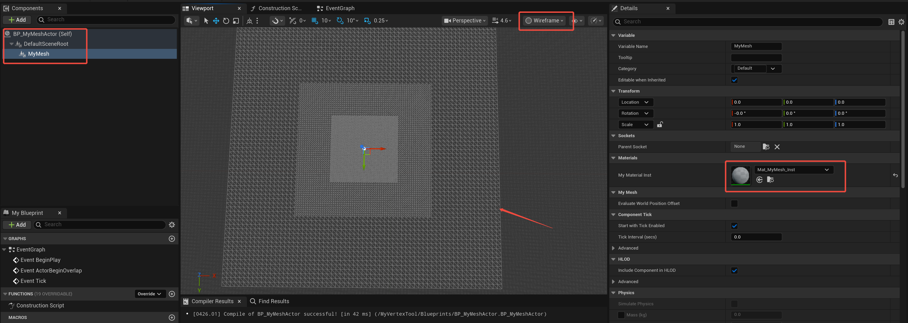
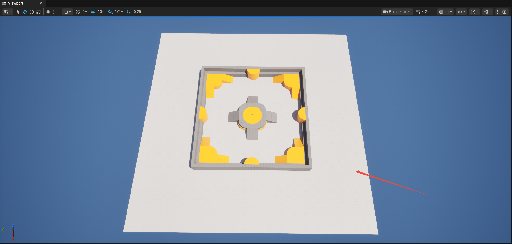
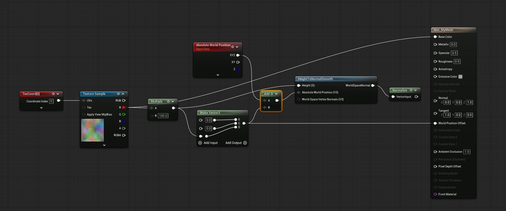

UE57自定义顶点
=================

(Github正常排版: [UE57自定义顶点](https://github.com/HHHHHHHHHHHHHHHHHHHHHCS/MyStudyNote/blob/main/MyNote/UE57%E8%87%AA%E5%AE%9A%E4%B9%89%E9%A1%B6%E7%82%B9.md))

(Github插件源码: [MyVertexTool](https://github.com/HHHHHHHHHHHHHHHHHHHHHCS/MyVertexTool))

------------------------

<!-- @import "[TOC]" {cmd="toc" depthFrom=1 depthTo=6 orderedList=false} -->

<!-- code_chunk_output -->

- [**0. 概述**](#0-概述)
- [**1. 插件基础搭建**](#1-插件基础搭建)
  - [**1.1. 创建插件与模块结构**](#11-创建插件与模块结构)
- [**2. 通过 Editor 生成 StaticMesh**](#2-通过-editor-生成-staticmesh)
  - [**2.1. EditorUtilityWidget 准备**](#21-editorutilitywidget-准备)
  - [**2.2. 制作编辑器界面蓝图**](#22-制作编辑器界面蓝图)
  - [**2.3. 挂载工具菜单与入口**](#23-挂载工具菜单与入口)
  - [**2.4. 保存面板与模型生成流程**](#24-保存面板与模型生成流程)
  - [**2.5. 覆盖已有资源的处理**](#25-覆盖已有资源的处理)
- [**3. 自定义 Vertex Factory 实现**](#3-自定义-vertex-factory-实现)
  - [**3.1. 渲染链路设计**](#31-渲染链路设计)
  - [**3.2. Mesh 参数配置**](#32-mesh-参数配置)
  - [**3.3. 自定义 Mesh 组件**](#33-自定义-mesh-组件)
  - [**3.4. SceneProxy 实现**](#34-sceneproxy-实现)
  - [**3.5. VertexFactory 基础实现**](#35-vertexfactory-基础实现)
  - [**3.6. 补充模块依赖**](#36-补充模块依赖)
- [**4. Buffer 与 Shader 对接**](#4-buffer-与-shader-对接)
  - [**4.1. 定义 Shader 公共结构**](#41-定义-shader-公共结构)
  - [**4.2. Buffer 实现细节**](#42-buffer-实现细节)
  - [**4.3. 注册 Vertex Shader 相关类型**](#43-注册-vertex-shader-相关类型)
    - [**4.3.1. 注册 Shaders 路径**](#431-注册-shaders-路径)
    - [**4.3.2. 绑定 VertexFactory 参数**](#432-绑定-vertexfactory-参数)
  - [**4.4. 调整插件加载阶段**](#44-调整插件加载阶段)
- [**5. 完善渲染提交流程**](#5-完善渲染提交流程)
  - [**5.1. 补全 VertexFactory 逻辑**](#51-补全-vertexfactory-逻辑)
  - [**5.2. 补全 SceneProxy 逻辑**](#52-补全-sceneproxy-逻辑)
  - [**5.2.1. 初始化与释放 VertexFactory**](#521-初始化与释放-vertexfactory)
  - [**5.2.2. 初始化 Instance 数据**](#522-初始化-instance-数据)
  - [**5.2.3. 收集并提交渲染数据**](#523-收集并提交渲染数据)
- [**6. 编写 Vertex Shader**](#6-编写-vertex-shader)
  - [**6.1. 基于模板精简**](#61-基于模板精简)
  - [**6.2. 计算 PositionOS**](#62-计算-positionos)
  - [**6.3. 计算 UV**](#63-计算-uv)
  - [**6.4. 处理 Velocity**](#64-处理-velocity)
- [**7. 结果验证**](#7-结果验证)
  - [**7.1. 基础效果验证**](#71-基础效果验证)
  - [**7.2. WPO 效果验证**](#72-wpo-效果验证)

<!-- /code_chunk_output -->

------------------------

## **0. 概述**

&emsp;&emsp; 感觉很久没有写了, 对比上次写还是上次!!! 这一年主要都在学UE, 就来水一篇的当作UE的学习吧. 在各位大佬面前班门弄斧了. 文中如有不准确的地方, 欢迎指正!

渲染经常需要模型, 所以模型创建是基础技能. 这篇会从基础开始讲如何创建模型. 不得不说在Unity创建模型或自定义顶点, 用自定义的 Vertex Shader 非常简单, 到了UE就直接痛苦面具了!!!

本文分为两部分: 一是用 Editor 创建模型, 二是实现自定义 Vertex Factory.

**注意** UE 5.5.x 和 5.7.x 在 RHI / RDG 的 Buffer 创建接口上存在差异, 可能出现编译冲突或接口过期提示!

Editor 创建 Mesh 和 Instance Mesh 完成的效果图如下:


------------------------

## **1. 插件基础搭建**

&emsp;&emsp; 我习惯用插件形式来承载这类相对独立的功能, 便于后续移植和版本升级.

### **1.1. 创建插件与模块结构**

打开 UE 顶部栏 `Edit -> Plugins -> Add -> Editor Tool Button`, 我这里命名为 `MyVertexTool`. (名字比较随意, UE 的 Plugins 创建流程里可选择的模板实在太多了.)

然后打开 {项目}/Plugins/MyVertexTool/MyVertexTool.uplugin, 将 **CanContainContent** 从 false 改为 **true**. 在 Modules 中, 把第 1 个 Module 的 **Type** 从 Editor 改为 **Runtime**. 再在 Modules 中创建一份 Module 命名为 **MyVertexToolEditor**, Type 改为 **Editor**.

Runtime 模块用于运行时数据与渲染逻辑, Editor 模块仅负责编辑器工具.

```JSON
{
	...
	"CanContainContent": true,
	...
	"Modules": [
		{
			"Name": "MyVertexTool",
			"Type": "Runtime",
			"LoadingPhase": "Default"
		},
		{
			"Name": "MyVertexToolEditor",
			"Type": "Editor",
			"LoadingPhase": "Default"
		}
	]
}
```

把 **MyVertexTool** 文件夹拷贝一份并命名为 **MyVertexToolEditor**. 删除 **MyVertexTool** 下的所有 `*.cpp` / `*.h` / `*.cs`. 后文再修改 **MyVertexToolEditor** 相关文件.

重新创建 MyVertexTool/MyVertexTool.Build.cs

```C#
using UnrealBuildTool;

public class MyVertexTool : ModuleRules
{
	public MyVertexTool(ReadOnlyTargetRules Target) : base(Target)
	{
		PCHUsage = ModuleRules.PCHUsageMode.UseExplicitOrSharedPCHs;

		PublicIncludePaths.AddRange(
			new string[]
			{
			}
		);

		PrivateIncludePaths.AddRange(
			new string[]
			{
			}
		);

		PublicDependencyModuleNames.AddRange(
			new string[]
			{
				"Core",
			}
		);

		PrivateDependencyModuleNames.AddRange(
			new string[]
			{
				"CoreUObject",
				"Engine",
				"Projects",
				"RenderCore"
			}
		);

		DynamicallyLoadedModuleNames.AddRange(
			new string[]
			{
			}
		);
	}
}
```

重新创建 MyVertexTool/Public/MyVertexTool.h

```C++
#pragma once

#include "Modules/ModuleManager.h"

class FMyVertexToolModule : public IModuleInterface
{
public:

	virtual void StartupModule() override;
	virtual void ShutdownModule() override;
};
```

重新创建 MyVertexTool/Private/MyVertexTool.cpp

```C++
#include "MyVertexTool.h"

static const FName MyVertexToolTabName("MyVertexTool");

#define LOCTEXT_NAMESPACE "FMyVertexToolModule"

void FMyVertexToolModule::StartupModule()
{
}

void FMyVertexToolModule::ShutdownModule()
{
}

#undef LOCTEXT_NAMESPACE

IMPLEMENT_MODULE(FMyVertexToolModule, MyVertexTool)
```

继续修改 **MyVertexToolEditor**: 调整文件名, 同时统一修改类名/模块名/API 宏/Build.cs 文件.

```
MyVertexTool.Build.cs -> MyVertexToolEditor.Build.cs

MyVertexTool.h -> MyVertexToolEditor.h
MyVertexToolCommands.h -> MyVertexToolEditorCommands.h
MyVertexToolStyle.h -> MyVertexToolEditorStyle.h

MyVertexTool.cpp -> MyVertexToolEditor.cpp
MyVertexToolCommands.cpp -> MyVertexToolEditorCommands.cpp
MyVertexToolStyle.cpp -> MyVertexToolEditorStyle.cpp
```

同时需要修改 MyVertexToolEditor.cpp 中的 `IMPLEMENT_MODULE` 宏参数.

```
...
IMPLEMENT_MODULE(FMyVertexToolEditorModule, MyVertexToolEditor)
```

尝试编译并启动 UE. 这里还可以继续规范 Editor 的结构和代码, 暂时先不展开, 先列几个关键修改点.

+ MyVertexToolEditorCommands.h 
  + 构造函数
+ MyVertexToolEditorStyle.cpp
  + FMyVertexToolEditorStyle::GetStyleSetName()
  + FMyVertexToolEditorStyle::Create()
+ FMyVertexToolEditorCommands.cpp
  + FMyVertexToolEditorCommands::RegisterCommands()
+ MyVertexToolEditor.cpp
  + static const FName MyVertexToolEditorTabName
  + #define LOCTEXT_NAMESPACE
  + FMyVertexToolEditorModule::PluginButtonClicked()

之后会看到顶部栏多了一个按钮, 点击会弹出提示窗口. 顶部 `Window` 菜单下也会出现同样入口, 效果一致.


------------------------

## **2. 通过 Editor 生成 StaticMesh**

&emsp;&emsp; 先创建工具界面, 再通过界面按钮打开保存窗口, 生成 `StaticMesh` 并保存到本地.

### **2.1. EditorUtilityWidget 准备**

现在可以用刚生成的插件模板, 点击 `ToolbarMenu` 的按钮, 会弹出一个 `MessageDialog` 窗口.

界面分为 `Slate` 和 `EditorUtilityWidget` 两种模式. 因为 `Slate` 写法相对繁琐, 所以我个人更倾向使用 `EditorUtilityWidget` 来写界面.

创建 **MyVertexToolEditor/Public/MyVertexToolEditorWidget.h**, 继承 **UEditorUtilityWidget**.

这里先做一个简单版 `EditorUtilityWidget`: 放一个 `Button`, 点击后打开保存窗口, 最后把 `StaticMesh` 保存到项目工程.

我个人习惯是先写变量再写方法, 而且变量多是小写命名, 但在 C++ 里不算一个好习惯.

```C++
#pragma once

#include "CoreMinimal.h"
#include "EditorUtilityWidget.h"

#include "MyVertexToolEditorWidget.generated.h"

class UEditorUtilityButton;

UCLASS()
class MYVERTEXTOOLEDITOR_API UMyVertexToolEditorWidget : public UEditorUtilityWidget
{
	GENERATED_BODY()

public:
	UPROPERTY(meta=(BindWidget))
	UEditorUtilityButton* Button_CreateMyMesh;
	
public:
	virtual void NativeConstruct() override;

private:
	UFUNCTION()
	void OnClick_CreateMyMesh();

	static bool OpenSaveAssetDialog(FString& outPackagePath, FString& outAssetName);
	void CreateMyMesh(FString packagePath, FString assetName);
};

```

别忘了在 **MyVertexToolEditor.Build.cs** 中添加所需依赖模块: **UMG**, **UMGEditor**, **Blutility**.

```C#
using UnrealBuildTool;

public class MyVertexToolEditor : ModuleRules
{
	public MyVertexToolEditor(ReadOnlyTargetRules Target) : base(Target)
	{
		...

		PrivateDependencyModuleNames.AddRange(
			new string[]
			{
				...
				"UMG",
				"UMGEditor",
				"Blutility",
			}
		);

		...
	}
}
```

为了保证编译通过, 先临时添加空实现. 创建 **MyVertexToolEditor/Private/MyVertexToolEditorWidget.cpp**, 后续再逐步完善.

```C++
#include "MyVertexToolEditorWidget.h"

void UMyVertexToolEditorWidget::NativeConstruct()
{
	Super::NativeConstruct();
}

void UMyVertexToolEditorWidget::OnClick_CreateMyMesh()
{
}

bool UMyVertexToolEditorWidget::OpenSaveAssetDialog(FString& outPackagePath, FString& outAssetName)
{
	return true;
}

void UMyVertexToolEditorWidget::CreateMyMesh(FString packagePath, FString assetName)
{
}

```

尝试编译, 启动成功!!!

### **2.2. 制作编辑器界面蓝图**

创建 `Blueprint`: **MyVertexTool/Editor/Blueprints/EUW_MyVertexToolEditor**, 并继承 **MyVertexToolEditorWidget**.

界面思路是顶部居中显示标题 `MyVertexTool`, 下方放置 `Button_CreateMyMesh`, 其余区域留给后续功能扩展.

界面搭建不太适合纯文字描述, 下面给出图示.

注意 `Button_CreateMyMesh` 的名字要和代码里面 **Button_CreateMyMesh** 绑定的一致, 因为使用了 `UPROPERTY(meta=(BindWidget))`.


### **2.3. 挂载工具菜单与入口**

接下来处理点击顶部按钮后如何显示刚创建的界面.

打开 **MyVertexToolEditorModule.h**, 添加接口 **CreateComboToolContent** 和 **OnMenuClicked_VertexTool**.

**CreateComboToolContent** 用于生成 `ToolMenu` 内容.

**OnMenuClicked_VertexTool** 用于创建并显示插件界面.

```C++

class FMyVertexToolEditorModule : public IModuleInterface
{
	...
private:
	void RegisterMenus();

	TSharedRef<SWidget> CreateComboToolContent() const;

	static void OnMenuClicked_VertexTool();
	
	...
};
```

打开 `MyVertexToolEditorModule.cpp`, 先修改 **FMyVertexToolEditorModule::RegisterMenus()**, 创建 **ToolMenus**.

这里有个小麻烦: 如果想把多个插件的界面入口按钮合并到一个 ToolMenu 中, 一种做法是单独做一个插件统一管理 Toolbar UI.

FSlateIcon 位置在 Engine/Content/Editor/Slate 下, 相关可以参考 Engine/Source/Editor/EditorStyle/Private/StarshipStyle.cpp 文件.

```C++
void FMyVertexToolEditorModule::RegisterMenus()
{
	// Owner will be used for cleanup in call to UToolMenus::UnregisterOwner
	FToolMenuOwnerScoped OwnerScoped(this);

	UToolMenu* ToolbarMenu = UToolMenus::Get()->ExtendMenu("LevelEditor.LevelEditorToolBar.PlayToolBar");
	if (!ToolbarMenu)
	{
		return;
	}

	// UE 如果要多个插件使用一个ToolbarMenu, 一种做法是单独创建插件用于统一管理 Toolbar UI
	FToolMenuSection& Section = ToolbarMenu->FindOrAddSection("MyEditorToolsMenu");

	// 如何找到 EditorViewportToolBar.OptionsDropdown 对应的 UI 图标
	// 可以看 Engine/Source/Editor/EditorStyle/Private/StarshipStyle.cpp 查找 EditorViewportToolBar.OptionsDropdown
	// 打开 Engine/Content/Editor/Slate 文件夹, 再根据 IMAGE_BRUSH_SVG("Starship/EditorViewport/menu") 就是对应的UI
	const FUIAction PlatformMenuShownDelegate;
	FToolMenuEntry Entry = FToolMenuEntry::InitComboButton(
		"MyEditorToolsMenu",
		PlatformMenuShownDelegate,
		FOnGetContent::CreateLambda([this] { return CreateComboToolContent(); }),
		LOCTEXT("MyEditorTools", "MyEditorTools"),
		LOCTEXT("MyEditorTools_Tooltip", "MyEditorTools_Tooltip"),
		FSlateIcon(FAppStyle::GetAppStyleSetName(), "EditorViewportToolBar.OptionsDropdown"),
		false,
		"PlatformsMenu");
	Entry.StyleNameOverride = "CalloutToolbar";
	Section.AddEntry(Entry);
}
```

继续完善 **FMyVertexToolEditorModule::CreateComboToolContent()**

这里创建 **ToolMenus** 的子选项 **ToolMenuSection**

```C++
...
TSharedRef<SWidget> FMyVertexToolEditorModule::CreateComboToolContent() const
{
	static const FName MenuName("LevelEditor.MainMenu.Window.MyEditorToolsMenu");
	if (!UToolMenus::Get()->IsMenuRegistered(MenuName))
	{
		UToolMenu* Menu = UToolMenus::Get()->RegisterMenu(MenuName);
		// 可以添加不同的section, 分割用
		// FToolMenuSection& ManagePlatformsSection = Menu->AddSection("MyToolsMenu_Other", LOCTEXT("MyEditorTools_Other", "MyEditorTools/Other"));
		FToolMenuSection& ManagePlatformsSection = Menu->AddSection("MyToolsMenu", LOCTEXT("MyEditorTools", "MyEditorTools"));
		ManagePlatformsSection.AddDynamicEntry(
			FName("MyEditorTools"),
			FNewToolMenuSectionDelegate::CreateLambda([](FToolMenuSection& PlatformsSection)
			{
				PlatformsSection.AddMenuEntry(
					NAME_None,
					LOCTEXT("VertexToolMenu", "VertexToolMenu"),
					LOCTEXT("VertexToolMenu_Tooltip", "VertexToolMenu"),
					FSlateIcon(FAppStyle::GetAppStyleSetName(), "LevelEditor.Tabs.Viewports"),
					FUIAction(
						FExecuteAction::CreateStatic(&FMyVertexToolEditorModule::OnMenuClicked_VertexTool))
				);

				// 如果是UI合集插件, 这里可以继续添加按钮
			}));
	}

	const FToolMenuContext MenuContext(PluginCommands);

	return UToolMenus::Get()->GenerateWidget(MenuName, MenuContext);
}
...
```

最后完善 **FMyVertexToolEditorModule::OnMenuClicked_VertexTool()**

这里用于点击该菜单项(Section), 显示 `EUW_MyVertexToolEditor` 界面.

别忘了添加两个 include.

蓝图路径可以通过 `选中资源 -> Ctrl+C` 或者 `选中资源 -> 右键 -> Copy Reference` 获取.

```C++
#include "EditorUtilitySubsystem.h"
#include "EditorUtilityWidgetBlueprint.h"

...
void FMyVertexToolEditorModule::OnMenuClicked_VertexTool()
{
	UEditorUtilitySubsystem* EditorUtilitySubsystem = GEditor->GetEditorSubsystem<UEditorUtilitySubsystem>();
	if (!EditorUtilitySubsystem)
	{
		UE_LOG(LogTemp, Warning, TEXT("Failed to get EditorUtilitySubsystem"));
		return;
	}

	const FString BlueprintPathStr = TEXT("/Script/Blutility.EditorUtilityWidgetBlueprint'/MyVertexTool/Editor/Blueprints/EUW_MyVertexToolEditor.EUW_MyVertexToolEditor'");
	const FSoftObjectPath BlueprintPath = BlueprintPathStr;
	UObject* BlueprintObject = BlueprintPath.TryLoad();

	if (!IsValid(BlueprintObject))
	{
		UE_LOG(LogTemp, Warning, TEXT("Failed to load EUW blueprint: %s"), *BlueprintPathStr);
		return;
	}

	UEditorUtilityWidgetBlueprint* LoadedEditorUtilityBlueprint = Cast<UEditorUtilityWidgetBlueprint>(BlueprintObject);
	if (!IsValid(LoadedEditorUtilityBlueprint))
	{
		UE_LOG(LogTemp, Warning, TEXT("Loaded object is not UEditorUtilityWidgetBlueprint: %s"), *BlueprintPathStr);
		return;
	}

	EditorUtilitySubsystem->SpawnAndRegisterTabWithId(LoadedEditorUtilityBlueprint, FName(TEXT("MyVertexTool")));
}
```

编译并启动后, 点击按钮即可显示 EUW 蓝图界面. 到此为止, 已经完成界面的显示和绑定.


### **2.4. 保存面板与模型生成流程**

先完成 `Button` 事件的绑定和相关流程. 点击按钮 -> 资源保存窗口 -> 返回资源路径和名称 -> 保存到本地.

继续完善 **MyVertexToolEditorWidget.cpp**, 修改之前添加的空实现.

别忘了添加 include.

```C++
...
#include "EditorUtilityWidgetComponents.h"

void UMyVertexToolEditorWidget::NativeConstruct()
{
	Super::NativeConstruct();
	
	if (IsValid(Button_CreateMyMesh))
	{
		Button_CreateMyMesh->OnClicked.AddDynamic(this, &UMyVertexToolEditorWidget::OnClick_CreateMyMesh);
	}
}

void UMyVertexToolEditorWidget::OnClick_CreateMyMesh()
{
	FString outPackagePath;
	FString outAssetName;
	bool canSave = OpenSaveAssetDialog(outPackagePath, outAssetName);

	if (!canSave)
	{
		return;
	}

	CreateMyMesh(outPackagePath, outAssetName);
}

```

然后完善 **UMyVertexToolEditorWidget::OpenSaveAssetDialog()** 弹出保存窗口相关逻辑.

建议直接使用 Content Browser 的资产保存面板, 避免手动处理磁盘路径和 `.uasset` 文件名.

```C++
...
#include "ContentBrowserModule.h"
#include "IContentBrowserSingleton.h"
#include "Misc/PackageName.h"

...

bool UMyVertexToolEditorWidget::OpenSaveAssetDialog(FString& outPackagePath, FString& outAssetName)
{
	FContentBrowserModule& ContentBrowserModule =
		FModuleManager::LoadModuleChecked<FContentBrowserModule>("ContentBrowser");
	IContentBrowserSingleton& ContentBrowser = ContentBrowserModule.Get();

	FSaveAssetDialogConfig SaveAssetDialogConfig;
	SaveAssetDialogConfig.DefaultPath = TEXT("/Game");
	SaveAssetDialogConfig.DefaultAssetName = TEXT("MyMeshAsset");
	SaveAssetDialogConfig.AssetClassNames.Add(UStaticMesh::StaticClass()->GetClassPathName());
	SaveAssetDialogConfig.ExistingAssetPolicy = ESaveAssetDialogExistingAssetPolicy::AllowButWarn;
	SaveAssetDialogConfig.DialogTitleOverride = FText::FromString(TEXT("Save MyMesh Asset"));

	// 如果只储存在 Content下 CreateModalSaveAssetDialog 比 SaveFileDialog 效果更好
	// FDesktopPlatformModule::Get()->SaveFileDialog() // 别忘添加 "DesktopPlatform" module
	const FString SaveObjectPath = ContentBrowser.CreateModalSaveAssetDialog(SaveAssetDialogConfig);
	if (SaveObjectPath.IsEmpty())
	{
		return false;
	}

	outPackagePath = FPackageName::GetLongPackagePath(SaveObjectPath);
	outAssetName = FPackageName::GetLongPackageAssetName(SaveObjectPath);
	return !outPackagePath.IsEmpty() && !outAssetName.IsEmpty();
}

```

有了路径之后, 就是完成模型的数据初始化, 创建和保存.

这里写一个稍微复杂点的模型: 双锥体. 注意 UE 的尺寸单位是 cm, 相比 Unity 要 x100, UV 是翻转的, z 轴是向上的.

这里只用 Index, Vertex, UV, Tangent, Normal, 其中 Tangent 和 Normal 准备自动生成.

```C++
...
#include "StaticMeshAttributes.h"
#include "AssetRegistry/AssetRegistryModule.h"

...

void UMyVertexToolEditorWidget::CreateMyMesh(FString packagePath, FString assetName)
{
	constexpr float k_MeshHeight = 4.0f;
	constexpr float k_MeshRadius = 1.0f;
	constexpr int32 k_MeshWNum = 30;
	constexpr int32 k_MeshHNum = 13;

	FVector3f vertices[k_MeshWNum + 1][k_MeshHNum * 2 + 1];
	FVector2f uvs[k_MeshWNum + 1][k_MeshHNum * 2 + 1];
	float delta = 2.0f * PI / k_MeshWNum;
	for (int32 i = 0; i < k_MeshWNum + 1; i++)
	{
		float a = i * delta;
		if (i == k_MeshWNum)
		{
			a = 0;
		}

		float x = FMath::Sin(a);
		float z = FMath::Cos(a);
		for (int j = -k_MeshHNum; j <= k_MeshHNum; j++)
		{
			float y = k_MeshHeight * j / k_MeshHNum;

			float r = (1 - (float)FMath::Abs(j) / k_MeshHNum) * k_MeshRadius;
			// 注意向上的轴是z, 尺寸单位是 cm 所以x100
			vertices[i][j + k_MeshHNum] = 100.0f * FVector3f(x * r, z * r, y);

			FVector2f uv = FVector2f(
				4.0f * i / k_MeshWNum,
				(float)j / k_MeshHNum);

			// 因为UE UV Y 和 Unity 不太一样
			uv.Y = -uv.Y;

			uvs[i][j + k_MeshHNum] = uv;
		}
	}

	constexpr int32 k_VertexCount = (k_MeshWNum + 1) * (2 * k_MeshHNum + 1);
	constexpr int32 k_IndicesCount = k_MeshWNum * (2 * k_MeshHNum) * 6;

	// 把二维数组转换为一维线性数据
	TArray<FVector3f> vertArray;
	vertArray.SetNum(k_VertexCount);
	TArray<FVector2f> uvArray;
	uvArray.SetNum(k_VertexCount);
	TArray<int32> indexArray;
	indexArray.SetNum(k_IndicesCount);

	int32 currIdx = 0;
	for (int32 i = 0; i < k_MeshWNum + 1; i++)
	{
		for (int32 j = 0; j < k_MeshHNum * 2 + 1; j++)
		{
			int32 idx = i * (k_MeshHNum * 2 + 1) + j;
			vertArray[idx] = vertices[i][j];
			uvArray[idx] = uvs[i][j];
			currIdx++;
		}
	}

	currIdx = 0;
	for (int32 i = 0; i < k_MeshWNum; i++)
	{
		for (int32 j = 0; j < k_MeshHNum * 2; j++)
		{
			// Quad的四个顶点
			int32 i0 = i * (k_MeshHNum * 2 + 1) + j;
			int32 i1 = i * (k_MeshHNum * 2 + 1) + (j + 1);
			int32 i2 = (i + 1) * (k_MeshHNum * 2 + 1) + (j + 1);
			int32 i3 = (i + 1) * (k_MeshHNum * 2 + 1) + j;

			// Triangle 1: v2 v1 v0
			indexArray[currIdx + 0] = i2;
			indexArray[currIdx + 1] = i1;
			indexArray[currIdx + 2] = i0;
			// Triangle 2: v3 v2 v0
			indexArray[currIdx + 3] = i3;
			indexArray[currIdx + 4] = i2;
			indexArray[currIdx + 5] = i0;

			currIdx += 6;
		}
	}

	// TODO:
}

```

数据准备完了, 开始导入数据给 Mesh.

先导入 `Position` 数据, 再 `CreatePolygonGroup`, 利用 `Polygon` 创建 UV.

```C++

void UMyVertexToolEditorWidget::CreateMyMesh(FString packagePath, FString assetName)
{
	...

	FMeshDescription meshDesc;
	FStaticMeshAttributes attributes{meshDesc};
	attributes.Register();

	TVertexAttributesRef<FVector3f> posRef = attributes.GetVertexPositions();
	TMap<int32, FVertexID> vertexIDs;
	for (int i = 0; i < vertArray.Num(); i++)
	{
		FVertexID vertexID = meshDesc.CreateVertex();
		vertexIDs.Add(i, vertexID);
		posRef[vertexID] = vertArray[i];
	}

	FPolygonGroupID polyGroup = meshDesc.CreatePolygonGroup();
	// 设置polygon name, 之后设置材质要和这个name一样
	attributes.GetPolygonGroupMaterialSlotNames()[polyGroup] = FName("Default");

	TVertexInstanceAttributesRef<FVector2f> uvs0Ref = attributes.GetVertexInstanceUVs();
	uvs0Ref.SetNumChannels(1);

	const int32 k_PolygonTypeNum = 3;
	TArray<FVertexInstanceID> instanceIDs;
	instanceIDs.SetNum(k_PolygonTypeNum);

	currIdx = 0;
	for (int i = 0; i < indexArray.Num() / k_PolygonTypeNum; i++)
	{
		for (int j = 0; j < k_PolygonTypeNum; j++)
		{
			int32 idx = indexArray[currIdx];
			FVertexID vertexID = vertexIDs[idx];
			FVertexInstanceID vi = meshDesc.CreateVertexInstance(vertexID);
			instanceIDs[j] = vi;
			uvs0Ref.Set(vi, 0, uvArray[idx]);
			currIdx++;
		}

		meshDesc.CreatePolygon(polyGroup, instanceIDs);
	}

	// TODO:
}

```

接下来就创建 `UStaticMesh`.

UE 重写了 `/`, 可以用它来拼接路径. 在该路径下实例化一个 `NewObject<UStaticMesh>`, 然后再初始化 Resource 和 Models. 使用 `RF_Public | RF_Standalone` 标志, 以确保该资源可以被正常保存, 引用并显示在内容浏览器中.

构建 Model, 构建参数里标记重建 `Normal` 和 `Tangent`, 并移除未被引用的三角形(虽然这里的 Demo 不存在未被引用的三角形).

再给 Mesh 提供默认材质, 注意 `MaterialSlotNames` 的 **Default** 要和上面的 `PolygonGroupMaterialSlotNames` 一致.

在构建 `FBuildMeshDescriptionsParams` 时, 因为直接用于渲染, 不需要 CPU 做读写, 所以 `bAllowCpuAccess` 为 **false**. 之后利用 `BuildFromMeshDescriptions` 根据 Mesh 生成渲染资源.

最后, 调用 `MarkPackageDirty` 标记资源包发生修改, 并通过 `AssetRegistry` 通知编辑器系统有新的资产被创建.

```C++

void UMyVertexToolEditorWidget::CreateMyMesh(FString packagePath, FString assetName)
{
	...

	// UE 重载了 '/', 这里用于路径拼接
	FString fullPackageName = packagePath / assetName;
	UPackage* package = CreatePackage(*fullPackageName);

	UStaticMesh* staticMesh = NewObject<UStaticMesh>(
		package,
		*assetName,
		RF_Public | RF_Standalone);

	// staticMesh->bSupportRayTracing = 0;
	staticMesh->InitResources();
	staticMesh->SetNumSourceModels(1);

	FStaticMeshSourceModel& srcModel = staticMesh->GetSourceModel(0);
	srcModel.BuildSettings.bRecomputeNormals = true;
	srcModel.BuildSettings.bRecomputeTangents = true;
	srcModel.BuildSettings.bRemoveDegenerates = true;

	UMaterialInterface* defaultMaterial = UMaterial::GetDefaultMaterial(MD_Surface);
	staticMesh->GetStaticMaterials().Add(FStaticMaterial(defaultMaterial, FName("Default")));

	UStaticMesh::FBuildMeshDescriptionsParams params;
	params.bFastBuild = false;
	params.bUseHashAsGuid = true;
	params.bMarkPackageDirty = true;
	params.bCommitMeshDescription = true;
	params.bAllowCpuAccess = false;
	staticMesh->BuildFromMeshDescriptions({&meshDesc}, params);

	staticMesh->MarkPackageDirty();

	FAssetRegistryModule::AssetCreated(staticMesh);
}

```

最后别忘记在 **MyVertexToolEditor.Build.cs** 中补充依赖的 Module: ContentBrowser, MeshDescription, StaticMeshDescription, AssetRegistry.

```C#
...
public MyVertexToolEditor(ReadOnlyTargetRules Target) : base(Target)
{
	...
	PrivateDependencyModuleNames.AddRange(
		new string[]
		{
			...
			"ContentBrowser",
			"MeshDescription",
			"StaticMeshDescription",
			"AssetRegistry",
			// ... add private dependencies that you statically link with here ...	
		}
	);
	...
}

```

编译并启动后, 点击按钮创建 Mesh 并保存到本地, 再拖入场景并赋予材质即可.


### **2.5. 覆盖已有资源的处理**

到这里功能基本可用, 但还有一个问题: 覆盖已有模型时会直接 Crash.

> Error: A FRenderResource was deleted without being released first!

我这里的临时方案是修改已有模型资源, 而不是直接覆盖资源文件.

继续修改 **UMyVertexToolEditorWidget::CreateMyMesh()**

先判断资源是否存在. 不存在就 `NewObject`, 存在就 `Modify`. 同时要等待渲染线程结束后再释放渲染资源.

```C++
void UMyVertexToolEditorWidget::CreateMyMesh(FString packagePath, FString assetName)
{
	...
	// UE 重载了 '/', 这里用于路径拼接
	FString fullPackageName = packagePath / assetName;
	UPackage* package = CreatePackage(*fullPackageName);

	// 判断是否存在, 如果存在就做修改, 不存在就New
	UStaticMesh* staticMesh = FindObject<UStaticMesh>(package, *assetName);
	const bool bIsNewAsset = (staticMesh == nullptr);
	
	if (bIsNewAsset)
	{
		staticMesh = NewObject<UStaticMesh>(package, *assetName, RF_Public | RF_Standalone);
	}
	else
	{
		// 先释放资源, 注意要等待渲染线程完成后再继续
		staticMesh->Modify(); // 记录修改
		staticMesh->ReleaseResources();
		FlushRenderingCommands(); // 等渲染线程彻底放掉旧资源
		staticMesh->GetStaticMaterials().Reset();
	}

	...
}
```

在 **MyVertexToolEditor.Build.cs** 中补充依赖模块: RenderCore.

```C#
...
public MyVertexToolEditor(ReadOnlyTargetRules Target) : base(Target)
{
	...
	PrivateDependencyModuleNames.AddRange(
		new string[]
		{
			...
			"RenderCore",
			// ... add private dependencies that you statically link with here ...	
		}
	);
	...
}

```

编译并启动后, 再次尝试替换并保存资源, 可以执行成功.

至此, 用 Editor 创建 Mesh 的部分完成.

------------------------

## **3. 自定义 Vertex Factory 实现**

&emsp;&emsp; 上面的流程和外部建模后再导入差异不大. 接下来进入自定义顶点工厂, 支持动态顶点和 Draw Instance, 但实现会更复杂.

目标是做一个由 `Quad` 组成的网格块, 类似九宫格布局, 最大支持到 LOD3.

先生成 16x16, 单块 5x5m 的 `Quad` Mesh 作为 LOD0, 再通过 `Draw Instance` 绘制, 并支持顶点偏移. (如果继续扩展, 还可以加入 CPU 侧 `Quad` Culling, 跟随相机更新, 以及 LOD 邻边接缝等.)


### **3.1. 渲染链路设计**

1. 要实现自定义模型, 就要先继承 `UMeshComponent`
    + 让该组件参与场景管理, 变换, 剔除等流程
    + 为后续创建 `FPrimitiveSceneProxy` 提供容器
2. 创建 `FPrimitiveSceneProxy` 负责渲染描述
    + 向渲染系统描述该如何绘制
    + 持有 `FVertexFactory`
    + 组织 `FMeshBatch` 并提交给渲染管线
    + 将 Component 中的数据安全地传递到渲染线程
3. 创建 `FVertexFactory`
    + 有顶点 Buffer `vertexBuffer` / `indexBuffer` / `instanceBuffer` / `uniformBuffer` 等
    + 绑定 Vertex Shader. `FVertexFactory` 是 CPU 侧顶点数据与 GPU Shader 之间的桥梁
4. 顶点相关 Buffer 大多继承自 `FRenderResource`
5. 编写 Shader 接口, 实现 VertexFactory.ush
    + 定义顶点输入结构(ATTRIBUTE / TEXCOORD 等)
    + 描述每个顶点属性如何从 Buffer 中读取

### **3.2. Mesh 参数配置**

后面会反复使用这些配置, 所以先抽一个配置头文件, 后续直接 `include` 即可.

创建 **MyVertexTool/Public/MyMeshConfig.h**, 具体配置看注释.

```C++
#pragma once

constexpr uint32 k_LODMaxLevel = 3; // Lod最大级别
constexpr int32 k_TessQuadCount = 16; // Quad细分成个数 count x count
constexpr int32 k_QuadWorldScale = 5; // level0 对应几米 之后 x2 递增

constexpr uint32 k_QuadCount = 4 + 12 * k_LODMaxLevel;
constexpr int32 k_PointCount = k_TessQuadCount + 1;
constexpr uint32 k_VertexCount = k_PointCount * k_PointCount;
constexpr uint32 k_IndexCount = 6 * k_TessQuadCount * k_TessQuadCount;
// 注意这里只是最大缩放, 如果要计算位置 要乘以100  (1m == UE 100cm)
constexpr float k_MaxWorldScale = k_QuadWorldScale * (1 << k_LODMaxLevel);

constexpr int32 k_WorldMinHeight = -100; // 最低多少cm
constexpr int32 k_WorldMaxHeight = 1000; // 最高多少cm
constexpr int32 k_WorldHeightCenter = 0.5f * (k_WorldMinHeight + k_WorldMaxHeight);
constexpr int32 k_WorldHeightExtent = 0.5f * (k_WorldMaxHeight - k_WorldMinHeight);

```

### **3.3. 自定义 Mesh 组件**

先创建 **MyVertexTool/Public/MyMeshComponent.h**

**myMaterialInst** : `UMeshComponent` 要保存需要渲染的 `Material`, 然后传给 `FPrimitiveSceneProxy`

**bEvaluateWorldPositionOffset** : 后续用于支持材质的 `WPO` 

重写 **CreateSceneProxy()** : 返回我们自己的 `FPrimitiveSceneProxy`

重写 **CalcBounds()**: 如果不重写 Bounds, 可能被 UE 在 CPU 侧直接剔除, 导致不渲染.

重写 **GetUsedMaterials()**: 注册要使用的 Material, 否则会报错.

**GetMyMaterial()** : 用于 `FPrimitiveSceneProxy` 中渲染数据准备

```C++
#pragma once

#include "CoreMinimal.h"
#include "Components/MeshComponent.h"
#include "MyMeshComponent.generated.h"


UCLASS(ClassGroup=(Custom), meta=(BlueprintSpawnableComponent))
class MYVERTEXTOOL_API UMyMeshComponent : public UMeshComponent
{
	GENERATED_BODY()

public:
	UPROPERTY(EditAnywhere, BlueprintReadOnly, Category="Materials")
	TObjectPtr<UMaterialInstance> myMaterialInst;

	UPROPERTY(EditAnywhere, BlueprintReadOnly, Category="MyMesh")
	uint8 bEvaluateWorldPositionOffset : 1;

public:
	UMyMeshComponent();

	virtual ~UMyMeshComponent() override;

protected:
	virtual void BeginPlay() override;

public:
	virtual void TickComponent(float DeltaTime, ELevelTick TickType, FActorComponentTickFunction* ThisTickFunction) override;

	virtual FPrimitiveSceneProxy* CreateSceneProxy() override;

	virtual FBoxSphereBounds CalcBounds(const FTransform& LocalToWorld) const override;

	virtual void GetUsedMaterials(TArray<UMaterialInterface*>& OutMaterials, bool bGetDebugMaterials = false) const override;

public:
	UMaterialInstance* GetMyMaterial() const { return myMaterialInst.Get(); }
};

```

再创建 **MyVertexTool/Private/MyMeshComponent.cpp**

暂时先实现 **CalcBounds()**

**CreateSceneProxy()** 在后面 `FPrimitiveSceneProxy` 类 创建后 再实现.

```C++
#include "MyMeshComponent.h"
#include "MyMeshConfig.h"

UMyMeshComponent::UMyMeshComponent()
{
	PrimaryComponentTick.bCanEverTick = true;
}

UMyMeshComponent::~UMyMeshComponent()
{
}

void UMyMeshComponent::BeginPlay()
{
	Super::BeginPlay();
}

void UMyMeshComponent::TickComponent(float DeltaTime, ELevelTick TickType, FActorComponentTickFunction* ThisTickFunction)
{
	Super::TickComponent(DeltaTime, TickType, ThisTickFunction);
}

FPrimitiveSceneProxy* UMyMeshComponent::CreateSceneProxy()
{
	// TODO:
	return nullptr;
}

FBoxSphereBounds UMyMeshComponent::CalcBounds(const FTransform& LocalToWorld) const
{
	// 因为这个是extent(半尺寸) 所以要*2
	const float k_AABBExtent = 100 * 2 * k_MaxWorldScale;

	FBoxSphereBounds newBounds;
	newBounds.Origin = FVector{0, 0, k_WorldHeightCenter};
	newBounds.BoxExtent = FVector{k_AABBExtent, k_AABBExtent, k_WorldHeightExtent};
	newBounds.SphereRadius = 1.414214f * k_AABBExtent; // 1.414 = sqrt(2)
	return newBounds.TransformBy(LocalToWorld);
}

void UMyMeshComponent::GetUsedMaterials(TArray<UMaterialInterface*>& OutMaterials, bool bGetDebugMaterials) const
{
	OutMaterials.Add(GetMyMaterial());
}

```

### **3.4. SceneProxy 实现**

创建 **MyVertexTool/Public/MyMeshSceneProxy.h**

**FMyMeshVertexFactory** 在之后创建

**GetTypeHash()**, **GetMemoryFootprint()**, **NewGetAllocatedSize()** 照着UE官方代码实现的

```C++
#pragma once

class UMyMeshComponent;
class FMyMeshVertexFactory;

class FMyMeshSceneProxy final : public FPrimitiveSceneProxy
{
private:
	TObjectPtr<UMyMeshComponent> myMeshComponent;
	TUniquePtr<FMyMeshVertexFactory> myMeshVertexFactory;

public:
	FMyMeshSceneProxy(UMyMeshComponent* _myMeshComponent);

	virtual ~FMyMeshSceneProxy() override;

	virtual SIZE_T GetTypeHash() const override
	{
		static size_t UniquePointer;
		return reinterpret_cast<size_t>(&UniquePointer);
	}

	virtual uint32 GetMemoryFootprint() const override
	{
		return sizeof(*this) + NewGetAllocatedSize();
	}

	uint32 NewGetAllocatedSize() const
	{
		return (uint32)(FPrimitiveSceneProxy::GetAllocatedSize());
	}

	virtual FPrimitiveViewRelevance GetViewRelevance(const FSceneView* View) const override;

	virtual void GetDynamicMeshElements(
		const TArray<const FSceneView*>& Views, const FSceneViewFamily& ViewFamily, uint32 VisibilityMap,
		class FMeshElementCollector& Collector) const override;
};

```

创建 **MyVertexTool/Private/MyMeshSceneProxy.cpp**

先临时实现空方法

```C++
#include "MyMeshSceneProxy.h"
#include "MyMeshComponent.h"

FMyMeshSceneProxy::FMyMeshSceneProxy(UMyMeshComponent* _myMeshComponent)
	: FPrimitiveSceneProxy(_myMeshComponent)
{
	// TODO:
}

FMyMeshSceneProxy::~FMyMeshSceneProxy()
{
	// TODO:
}

FPrimitiveViewRelevance FMyMeshSceneProxy::GetViewRelevance(const FSceneView* View) const
{
	// TODO:
	return FPrimitiveSceneProxy::GetViewRelevance(View);
}

void FMyMeshSceneProxy::GetDynamicMeshElements(const TArray<const FSceneView*>& Views, const FSceneViewFamily& ViewFamily, uint32 VisibilityMap, class FMeshElementCollector& Collector) const
{
	// TODO:
	FPrimitiveSceneProxy::GetDynamicMeshElements(Views, ViewFamily, VisibilityMap, Collector);
}

```

同时回到 **MyMeshComponent.cpp**, 完善 **CreateSceneProxy()** 方法

```C++
#include "MyMeshSceneProxy.h"

...

FPrimitiveSceneProxy* UMyMeshComponent::CreateSceneProxy()
{
	return new FMyMeshSceneProxy(this);
}
```

### **3.5. VertexFactory 基础实现**

创建 **MyVertexTool/Public/MyMeshVertexFactory.h**

个人代码习惯: 在 .h 中尽量减少 #include, 优先使用前向声明(forward declaration). 在 .cpp 中再 include 真正需要的头文件

**FMyMeshVertexBuffer** : 顶点信息数据
**FMyMeshIndexBuffer** : 顶点索引数据
**FMyMeshInstanceBuffer** : Instance数据
**FMyMeshParamsBuffer** : 共享 Uniform 数据

```C++
#pragma once

class FMyMeshVertexBuffer;
class FMyMeshIndexBuffer;
class FMyMeshInstanceBuffer;
class FMyMeshParamsBuffer;

class FMyMeshVertexFactory final : public FVertexFactory
{
	DECLARE_VERTEX_FACTORY_TYPE(FMyMeshVertexFactory);

public:
	using Super = FVertexFactory;

private:
	bool isBorder;
	TUniquePtr<FMyMeshVertexBuffer> vertexBuffer;
	TUniquePtr<FMyMeshIndexBuffer> indexBuffer;
	TUniquePtr<FMyMeshInstanceBuffer> instanceBuffer;
	TUniquePtr<FMyMeshParamsBuffer> paramsBuffer;

public:
	FMyMeshVertexFactory(ERHIFeatureLevel::Type InFeatureLevel);

	virtual ~FMyMeshVertexFactory() override;

	static bool ShouldCompilePermutation(const FVertexFactoryShaderPermutationParameters& Parameters);

	static void ModifyCompilationEnvironment(const FVertexFactoryShaderPermutationParameters& Parameters,
											FShaderCompilerEnvironment& OutEnvironment);

	static void ValidateCompiledResult(const FVertexFactoryType* Type, EShaderPlatform Platform,
										const FShaderParameterMap& ParameterMap, TArray<FString>& OutErrors);

	static void GetPSOPrecacheVertexFetchElements(EVertexInputStreamType VertexInputStreamType,
												FVertexDeclarationElementList& Elements);

	virtual void InitRHI(FRHICommandListBase& RHICmdList) override;
	virtual void ReleaseRHI() override;

	UE_NODISCARD_CTOR FORCEINLINE FMyMeshVertexBuffer* GetVertexBuffer() const { return vertexBuffer.Get(); }
	UE_NODISCARD_CTOR FORCEINLINE FMyMeshIndexBuffer* GetIndexBuffer() const { return indexBuffer.Get(); }
	UE_NODISCARD_CTOR FORCEINLINE FMyMeshInstanceBuffer* GetInstanceBuffer() const { return instanceBuffer.Get(); }
	UE_NODISCARD_CTOR FORCEINLINE FMyMeshParamsBuffer* GetParamsBuffer() const { return paramsBuffer.Get(); }
};

```

创建 **MyVertexTool/Private/MyMeshVertexFactory.cpp**, 实现空的方法

之后再继续补充. 因为还要 Vertex Shader 对 VertexFactory 进行绑定

```C++
#include "MyMeshVertexFactory.h"

FMyMeshVertexFactory::FMyMeshVertexFactory(ERHIFeatureLevel::Type InFeatureLevel)
	: FVertexFactory(InFeatureLevel)
{
}

FMyMeshVertexFactory::~FMyMeshVertexFactory()
{
}

bool FMyMeshVertexFactory::ShouldCompilePermutation(const FVertexFactoryShaderPermutationParameters& Parameters)
{
	return true;
}

void FMyMeshVertexFactory::ModifyCompilationEnvironment(const FVertexFactoryShaderPermutationParameters& Parameters,
														FShaderCompilerEnvironment& OutEnvironment)
{
}

void FMyMeshVertexFactory::ValidateCompiledResult(const FVertexFactoryType* Type, EShaderPlatform Platform,
												const FShaderParameterMap& ParameterMap, TArray<FString>& OutErrors)
{
}

void FMyMeshVertexFactory::GetPSOPrecacheVertexFetchElements(EVertexInputStreamType VertexInputStreamType,
															FVertexDeclarationElementList& Elements)
{
}

void FMyMeshVertexFactory::InitRHI(FRHICommandListBase& RHICmdList)
{
	FVertexFactory::InitRHI(RHICmdList);
}

void FMyMeshVertexFactory::ReleaseRHI()
{
	FVertexFactory::ReleaseRHI();
}

```

### **3.6. 补充模块依赖**

这部分代码都和渲染相关, 所以在 **MyVertexTool.Build.cs** 里继续补充依赖, 添加 **RHI** 和 **Renderer**.

写了 **FMyMeshVertexFactory**, 但是并没有完成 Vertex Shader 的绑定, 所以此时还是无法编译通过.

```C#
...

PrivateDependencyModuleNames.AddRange(
	new string[]
	{
		...
		"RHI",
		"Renderer",
	}
);

```

------------------------

## **4. Buffer 与 Shader 对接**

&emsp;&emsp; 有了 Vertex Factory 后, 还需要完成 Buffer 和 Shader 的对接.

### **4.1. 定义 Shader 公共结构**

在创建相关 Buffer 之前, 先定义所需的数据结构.

创建 **MyVertexTool/Public/MyMeshShaderCommon.h**

因为这个 Demo 比较简单. 顶点数据只需要 Position. UV 可通过 WorldPosition 推算. Normal 基本朝上. 如果有 WPO 则由法线图补充细节.

InstanceBuffer: 只记录 Quad 的偏移和 LOD 缩放.

公共 Parameters: 只保存 LOD 最大的 Level(虽然后面没有用到) 和 LOD0 的 WorldScale.

这里有个坑: UE 顶点阶段对 `StructuredBuffer` 支持有限, 所以改用 `Buffer<float4>` 做 Pack/Unpack, 同时要保证 float4 对齐.

```C++
#pragma once

struct MyMeshVertexType
{
public:
	FVector3f position;
};

// UE 顶点不怎么支持 StructuredBuffer, 所以这里用 Buffer<float4> Pack/Unpack
// Buffer<float4> 需要 float4 对齐
// 注意要写空的构造函数, TArray 需要
struct MyMeshInstanceType
{
public:
	FVector2f posWSOffset;
	float scale;
	float padding0;

	MyMeshInstanceType(FVector2f _posWSOffset, float _scale)
		: posWSOffset(_posWSOffset)
		, scale(_scale)
		, padding0(0)
	{
	}

	MyMeshInstanceType()
		: posWSOffset(FVector2f{})
		, scale(0)
		, padding0(0)
	{
	}
};

BEGIN_GLOBAL_SHADER_PARAMETER_STRUCT(FMyMeshVertexFactoryParameters,)
	SHADER_PARAMETER(int32, _LODMaxLevel)
	SHADER_PARAMETER(int32, _QuadWorldScale)
END_GLOBAL_SHADER_PARAMETER_STRUCT()

typedef TUniformBufferRef<FMyMeshVertexFactoryParameters> FMyMeshVertexFactoryBufferRef;

struct FMyMeshA2VType
{
	FVertexStreamComponent positionComponent;
};

```

### **4.2. Buffer 实现细节**

创建 **MyVertexTool/Public/MyMeshBuffer.h**, 定义所需要的 Buffer 和接口.

Update Buffer 的执行最好都放在 Render Thread.

```C++
#pragma once
#include "MyMeshConfig.h"
#include "MyMeshShaderCommon.h"

class FMyMeshVertexBuffer final : public FVertexBuffer
{
public:
	virtual void InitRHI(FRHICommandListBase& RHICmdList) override;

	UE_NODISCARD_CTOR FORCEINLINE uint32 GetVertexCount() const { return k_VertexCount; }
};

class FMyMeshIndexBuffer final : public FIndexBuffer
{
public:
	virtual void InitRHI(FRHICommandListBase& RHICmdList) override;

	template <typename IndexType>
	FBufferRHIRef CreateIndexBuffer(FRHICommandListBase& RHICmdList);

	UE_NODISCARD_CTOR FORCEINLINE uint32 GetIndexCount() const { return k_IndexCount; }
};


class FMyMeshInstanceBuffer final : public FRenderResource
{
private:
	bool isDataDirty;
	TArray<MyMeshInstanceType> instanceDataArray;
	FBufferRHIRef instanceBufferRHI;
	FShaderResourceViewRHIRef instanceBufferSRV;
	
public:
	FMyMeshInstanceBuffer();

	void OnInit();

	virtual void InitRHI(FRHICommandListBase& RHICmdList) override;
	virtual void ReleaseRHI() override;

	void UpdateBuffer_RenderThread(FRHICommandList& RHICmdList);

	FORCEINLINE void SetDataDirty(bool _isDataDirty = true) { isDataDirty = _isDataDirty; }

	UE_NODISCARD_CTOR FORCEINLINE uint32 GetInstanceCount() const { return k_QuadCount; }
	UE_NODISCARD_CTOR FORCEINLINE uint32 GetInstanceBufferSize() const { return GetInstanceCount() * sizeof(MyMeshInstanceType); }
	UE_NODISCARD_CTOR FORCEINLINE TArray<MyMeshInstanceType>& GetInstanceDataArray() { return instanceDataArray; }
	UE_NODISCARD_CTOR FORCEINLINE FRHIShaderResourceView* GetInstanceBufferSRV() const { return instanceBufferSRV; }
};

class FMyMeshParamsBuffer final : public FRenderResource
{
private:
	bool isDataDirty = false;
	FMyMeshVertexFactoryParameters myMeshVertexFactoryParameters;
	FUniformBufferRHIRef uniformBufferRHI;

public:
	FMyMeshParamsBuffer();

	virtual void InitRHI(FRHICommandListBase& RHICmdList) override;

	virtual void ReleaseRHI() override;

	void SetData(const FMyMeshVertexFactoryParameters& newParams);

	void UpdateBuffer_RenderThread(FRHICommandList& rhiCmdList);

	UE_NODISCARD_CTOR FORCEINLINE FUniformBufferRHIRef GetUniformBuffer() const { return uniformBufferRHI; }
};

```

接下来实现 Buffer 的数据填充, 这里不展开数学细节.

注意 `Create Buffer` 的写法在 UE 5.5.x 和 5.7.x 不一致, 主要差异在 `FRHIBufferCreateDesc` 和 `TRHIBufferInitializer`.

VertexBuffer: 创建的 Quad Mesh 尺寸为 1 米, 方便之后做不同 LOD 的缩放.

IndexBuffer: 为了后续方便调整 Config, 这里支持 index 数量大于等于 `UINT16_MAX`.

InstanceBuffer: 这里踩坑较多.

1. 比如 UE Vertex Shader 不太支持变体, 官方通常用模板和宏定义实现 shader 变体.

2. 顶点阶段不怎么支持 `StructuredBuffer`, 所以用 buffer<float4> Pack/Unpack 替代, 同时要注意 float4 对齐.

3. 如果写了 `SetInitActionZeroData`, 会导致在 Vulkan 上报空指针错误. 因为如果是 ZeroData Vulkan 会延迟初始化. 从而导致报空指针错误.

ParamsBuffer: `RHICreateUniformBuffer` 有引用计数, 会自动 `MarkForDelete` 然后 `Release`. 同时注意由游戏线程设置脏标记, 由渲染线程真正写入数据.

创建 **MyVertexTool/Private/MyMeshBuffer.cpp**.

```C++
#include "MyMeshBuffer.h"

void FMyMeshVertexBuffer::InitRHI(FRHICommandListBase& RHICmdList)
{
	// 创建[-0.5,-0.5]~[0.5,0.5]的单位vertex, ue 100cm = 1m
	constexpr float k_VertexStartPosX = -50.0f;
	constexpr float k_VertexStartPosY = -50.0f;
	constexpr float k_VertexStep = 100.0f / (k_PointCount - 1);

	const FRHIBufferCreateDesc createDesc =
		FRHIBufferCreateDesc::CreateVertex<MyMeshVertexType>(TEXT("MyMeshVertexBuffer"), GetVertexCount())
		.AddUsage(EBufferUsageFlags::Static | EBufferUsageFlags::ShaderResource)
		.SetInitialState(ERHIAccess::VertexOrIndexBuffer | ERHIAccess::SRVMask)
		.SetInitActionInitializer();

	TRHIBufferInitializer<MyMeshVertexType> initializer = RHICmdList.CreateBufferInitializer(createDesc);

	int32 vertexIdx = 0;
	for (int32 y = 0; y < k_PointCount; y++)
	{
		float vertexY = k_VertexStartPosY + y * k_VertexStep;
		for (int32 x = 0; x < k_PointCount; x++)
		{
			initializer[vertexIdx] = MyMeshVertexType
			{
				.position = FVector3f{k_VertexStartPosX + x * k_VertexStep, vertexY, 0},
			};
			vertexIdx++;
		}
	}

	VertexBufferRHI = initializer.Finalize();
}

void FMyMeshIndexBuffer::InitRHI(FRHICommandListBase& RHICmdList)
{
	if (GetIndexCount() <= UINT16_MAX)
	{
		IndexBufferRHI = CreateIndexBuffer<uint16>(RHICmdList);
	}
	else
	{
		IndexBufferRHI = CreateIndexBuffer<uint32>(RHICmdList);
	}
}

template <typename IndexType>
FBufferRHIRef FMyMeshIndexBuffer::CreateIndexBuffer(FRHICommandListBase& RHICmdList)
{
	const FRHIBufferCreateDesc createDesc =
		FRHIBufferCreateDesc::CreateIndex<IndexType>(TEXT("MyMeshIndexBuffer"), GetIndexCount())
		.AddUsage(EBufferUsageFlags::Static)
		.SetInitialState(ERHIAccess::VertexOrIndexBuffer)
		.SetInitActionInitializer();

	TRHIBufferInitializer<IndexType> initializer = RHICmdList.CreateBufferInitializer(createDesc);

	int32 indexIdx = 0;
	for (int32 y = 0; y < k_TessQuadCount; y++)
	{
		for (int32 x = 0; x < k_TessQuadCount; x++)
		{
			int32 vertexIdx = y * k_PointCount + x;
			initializer[indexIdx + 0] = vertexIdx + 0;
			initializer[indexIdx + 1] = vertexIdx + k_PointCount + 1;
			initializer[indexIdx + 2] = vertexIdx + 1;
			initializer[indexIdx + 3] = vertexIdx + 0;
			initializer[indexIdx + 4] = vertexIdx + k_PointCount;
			initializer[indexIdx + 5] = vertexIdx + k_PointCount + 1;
			indexIdx += 6;
		}
	}

	return initializer.Finalize();
}

FMyMeshInstanceBuffer::FMyMeshInstanceBuffer()
{
	OnInit();
}

void FMyMeshInstanceBuffer::OnInit()
{
	instanceDataArray.SetNum(GetInstanceCount());
}

void FMyMeshInstanceBuffer::InitRHI(FRHICommandListBase& RHICmdList)
{
	constexpr uint32 k_Stride = 4 * sizeof(float);
	const uint32 k_Num = GetInstanceBufferSize() / k_Stride;

	// 为什么这么写
	// 1. 因为 UE 顶点流程不支持变体, 用模板替代
	// 2. 顶点阶段不怎么支持StructuredBuffer, 用 buffer<float4> Pack/Unpack 替代, 同时要注意 float4 对齐
	//       在Mobile Vulkan上bound有问题 会被当做RWBuffer, 以至于StructuredBuffer绑不上去
	FRHIBufferDesc bufferDesc{GetInstanceBufferSize(), k_Stride, EBufferUsageFlags::None};
	const FRHIBufferCreateDesc createDesc =
		FRHIBufferCreateDesc::Create(TEXT("MyMeshInstanceBuffer"), bufferDesc)
		.AddUsage(EBufferUsageFlags::Dynamic | EBufferUsageFlags::ShaderResource)
		.SetInitialState(ERHIAccess::SRVGraphics);
	// 第一次的时候会刷入数据没有必要初始化, 而且 如果是 ZeroData Vulkan 会延迟初始化 导致空指针报错
	// .SetInitActionZeroData();

	instanceBufferRHI = RHICmdList.CreateBuffer(createDesc);

	FRHIViewDesc::FBufferSRV::FInitializer viewDesc =
		FRHIViewDesc::CreateBufferSRV()
		.SetType(FRHIViewDesc::EBufferType::Typed)
		.SetFormat(EPixelFormat::PF_A32B32G32R32F)
		.SetNumElements(k_Num);
	instanceBufferSRV = RHICmdList.CreateShaderResourceView(instanceBufferRHI, viewDesc);
}

void FMyMeshInstanceBuffer::ReleaseRHI()
{
	if (instanceBufferRHI.IsValid())
	{
		instanceBufferRHI.SafeRelease();
	}
	if (instanceBufferSRV.IsValid())
	{
		instanceBufferSRV.SafeRelease();
	}
}

void FMyMeshInstanceBuffer::UpdateBuffer_RenderThread(FRHICommandList& RHICmdList)
{
	if (!isDataDirty)
	{
		return;
	}
	isDataDirty = false;
	void* destBuffer = RHICmdList.LockBuffer(instanceBufferRHI, 0, GetInstanceBufferSize(), RLM_WriteOnly);
	FMemory::Memcpy(destBuffer, instanceDataArray.GetData(), GetInstanceBufferSize());
	RHICmdList.UnlockBuffer(instanceBufferRHI);
}

FMyMeshParamsBuffer::FMyMeshParamsBuffer()
{
}

void FMyMeshParamsBuffer::InitRHI(FRHICommandListBase& RHICmdList)
{
	// RHICreateUniformBuffer 有引用计数器, 会自动 MarkForDelete 并 Release
	uniformBufferRHI = RHICreateUniformBuffer(
		&myMeshVertexFactoryParameters, &FMyMeshVertexFactoryParameters::GetStructMetadata()->GetLayout(), UniformBuffer_MultiFrame);
}

void FMyMeshParamsBuffer::ReleaseRHI()
{
	uniformBufferRHI.SafeRelease();
}

void FMyMeshParamsBuffer::SetData(const FMyMeshVertexFactoryParameters& newParams)
{
	myMeshVertexFactoryParameters = newParams;
	isDataDirty = true;
}

void FMyMeshParamsBuffer::UpdateBuffer_RenderThread(FRHICommandList& rhiCmdList)
{
	if (!isDataDirty)
	{
		return;
	}
	isDataDirty = false;
	rhiCmdList.UpdateUniformBuffer(uniformBufferRHI, &myMeshVertexFactoryParameters);
}

```

### **4.3. 注册 Vertex Shader 相关类型**

至此仍然无法编译通过, 所以没法很好地校验新写代码是否正确, 也不利于快速定位编译问题.

现在编译会出现下面两个问题, 主要原因是还没有补齐 `IMPLEMENT` 相关的 Vertex Shader 注册规则.

>unresolved external symbol "public: static class FShaderParametersMetadata const * __cdecl FMyMeshVertexFactoryParameters::GetStructMetadata(void)" (?GetStructMetadata@FMyMeshVertexFactoryParameters@@SAPEBVFShaderParametersMetadata@@XZ) referenced in function "public: virtual void __cdecl FMyMeshParamsBuffer::InitRHI(class FRHICommandListBase &)" (?InitRHI@FMyMeshParamsBuffer@@UEAAXAEAVFRHICommandListBase@@@Z)
>unresolved external symbol "public: virtual class FVertexFactoryType * __cdecl FMyMeshVertexFactory::GetType(void)const " (?GetType@FMyMeshVertexFactory@@UEBAPEAVFVertexFactoryType@@XZ)

#### **4.3.1. 注册 Shaders 路径**

首先需要注册 Shaders 路径.

如果是项目, Shaders 可以直接绑定路径, 可以参考 `LaunchEngineLoop.cpp`.

在项目目录下创建 `Shaders` 文件夹, 添加 `test.ush`. 然后在 Material 的 `Custom Node` 里, 将 include file 写为 `/Project/test.ush`.

```C++

const FString ProjectShaderPath = FPaths::Combine(FPaths::ProjectDir(), TEXT("Shaders"));
if (FPaths::DirectoryExists(ProjectShaderPath))
{
	AddShaderSourceDirectoryMapping(TEXT("/Project"), ProjectShaderPath);
}

```

但这里是插件工程, 所以需要手动绑定路径.

修改 **MyVertexTool.cpp**, 在启动 Module 时注册路径.

```C++
...
#include "Interfaces/IPluginManager.h"

...

void FMyVertexToolModule::StartupModule()
{
	FString pluginShaderDir = FPaths::Combine(IPluginManager::Get().FindPlugin(TEXT("MyVertexTool"))->GetBaseDir(),
										  TEXT("Shaders"));
	AddShaderSourceDirectoryMapping(TEXT("/Plugin/MyVertexTool"), pluginShaderDir);
}

...
```

创建文件夹 **MyVertexTool/Shaders/Private**, 注意 **Shaders** 文件夹要和 **MyVertexTool.uplugin** 在同一目录.


新建 **Shaders/Private/MyMeshVertexFactory.ush**, 先做占位, 后面再补充 Shader 内容.

#### **4.3.2. 绑定 VertexFactory 参数**

回到 **MyMeshVertexFactory.cpp**, 先完成 `ShaderParameters` 的注册.

`MyMeshVF` 是后续在 Shader 中使用的变量名. 比如会使用 `MyMeshVF._QuadWorldScale`.

`FMyMeshVertexFactoryShaderParameters` 这个类用于绑定 Vertex Shader 数据.

  + **Bind()** Buffer 通过什么名字注册到 Vertex Shader
  + **GetElementShaderBindings()** Buffer 的数据绑定
  + 如果有贴图要做绑定, 需要使用 **AddTexture**

因为后续准备做 WPO, 会让 `Ray Tracing` 性能表现不理想, 所以在 `VertexFactory` 里直接屏蔽了 ray tracing 相关内容. 如果确实要用, 可以尝试 `Ray Tracing Intersection Shader`. (而且如果要支持 `Ray Tracing`, Vertex Shader 的代码量会更多, 更复杂)

```C++
...
#include "MeshDrawShaderBindings.h"
#include "MeshMaterialShader.h"
#include "MyMeshShaderCommon.h"
#include "MyMeshBuffer.h"

#pragma region VertexShader

IMPLEMENT_GLOBAL_SHADER_PARAMETER_STRUCT(FMyMeshVertexFactoryParameters, "MyMeshVF");

class FMyMeshVertexFactoryShaderParameters : public FVertexFactoryShaderParameters
{
	DECLARE_TYPE_LAYOUT(FMyMeshVertexFactoryShaderParameters, NonVirtual);

private:
	LAYOUT_FIELD(FShaderResourceParameter, _MyMeshInstanceBufferParam);

public:
	void Bind(const FShaderParameterMap& ParameterMap)
	{
		_MyMeshInstanceBufferParam.Bind(ParameterMap, TEXT("_MyMeshInstanceBuffer"));
	}

	void GetElementShaderBindings(
		const FSceneInterface* Scene,
		const FSceneView* View,
		const FMeshMaterialShader* Shader,
		const EVertexInputStreamType InputStreamType,
		ERHIFeatureLevel::Type FeatureLevel,
		const FVertexFactory* VertexFactory,
		const FMeshBatchElement& BatchElement,
		class FMeshDrawSingleShaderBindings& ShaderBindings,
		FVertexInputStreamArray& VertexStreams) const
	{
		FMyMeshVertexFactory* vertexFactory = (FMyMeshVertexFactory*)VertexFactory;
		if (vertexFactory)
		{
			ShaderBindings.Add(Shader->GetUniformBufferParameter<FMyMeshVertexFactoryParameters>(), vertexFactory->GetParamsBuffer()->GetUniformBuffer());
			ShaderBindings.Add(_MyMeshInstanceBufferParam, vertexFactory->GetInstanceBuffer()->GetInstanceBufferSRV());
			// 如果贴图要这样
			// ShaderBindings.AddTexture(VectorFieldTexture, VectorFieldTextureSampler, SamplerStatePoint, UserData->VectorFieldTextureRHI);
		}
	}
};

IMPLEMENT_TYPE_LAYOUT(FMyMeshVertexFactoryShaderParameters);

IMPLEMENT_VERTEX_FACTORY_PARAMETER_TYPE(FMyMeshVertexFactory, SF_Vertex, FMyMeshVertexFactoryShaderParameters);

IMPLEMENT_VERTEX_FACTORY_TYPE(FMyMeshVertexFactory, "/Plugin/MyVertexTool/Private/MyMeshVertexFactory.ush",
							EVertexFactoryFlags::UsedWithMaterials
							| EVertexFactoryFlags::SupportsStaticLighting
							| EVertexFactoryFlags::SupportsDynamicLighting
							| EVertexFactoryFlags::SupportsPrecisePrevWorldPos
							| EVertexFactoryFlags::SupportsPositionOnly
							| EVertexFactoryFlags::SupportsCachingMeshDrawCommands
							| EVertexFactoryFlags::SupportsPrimitiveIdStream
							// 如果要支持 Ray Tracing, 理论上需要 Ray Tracing Intersection Shader
							// 但是因为存在 WPO, 会导致需要持续更新加速结构, 成本较高
							// 所以暂时不支持
							// | EVertexFactoryFlags::SupportsRayTracing
							// | EVertexFactoryFlags::SupportsRayTracingDynamicGeometry
							| EVertexFactoryFlags::SupportsLightmapBaking
							| EVertexFactoryFlags::SupportsManualVertexFetch
							| EVertexFactoryFlags::SupportsPSOPrecaching
							| EVertexFactoryFlags::SupportsGPUSkinPassThrough
							| EVertexFactoryFlags::SupportsLumenMeshCards
							| EVertexFactoryFlags::SupportsTriangleSorting);

#pragma endregion VertexShader

FMyMeshSceneProxy::FMyMeshSceneProxy(UMyMeshComponent* _myMeshComponent)

...

```

### **4.4. 调整插件加载阶段**

现在可以编译通过, 但启动时会报错. 大意是 Vertex Factory 模块加载时机不对, Vertex Factory 加载需要在引擎初始化之后.

> VF type was loaded after engine init, use ELoadingPhase::PostConfigInit on your module to cause it to load earlier.

编辑 **MyVertexTool.uplugin**, 修改 `MyVertexTool` Module 的 `LoadingPhase` 将 `Default` 改为 `PostConfigInit`.

```JSON
...
"Modules": [
	{
		"Name": "MyVertexTool",
		"Type": "Runtime",
		"LoadingPhase": "PostConfigInit"
	},
	...
]
```

到这里, 启动阶段只剩 Shader 编译问题需要处理.

------------------------

## **5. 完善渲染提交流程**

&emsp;&emsp; 当前 **Shader 编译** 和 **渲染绘制** 两部分都还不完整. 我先补全渲染提交流程, 因为 Shader 代码会更冗长.

### **5.1. 补全 VertexFactory 逻辑**

修改 **MyMeshVertexFactory.cpp**. 先添加 Buffer 创建和释放.

```C++
FMyMeshVertexFactory::FMyMeshVertexFactory(ERHIFeatureLevel::Type InFeatureLevel)
	: FVertexFactory(InFeatureLevel)
{
	vertexBuffer = MakeUnique<FMyMeshVertexBuffer>();
	indexBuffer = MakeUnique<FMyMeshIndexBuffer>();
	instanceBuffer = MakeUnique<FMyMeshInstanceBuffer>();
	paramsBuffer = MakeUnique<FMyMeshParamsBuffer>();
}

FMyMeshVertexFactory::~FMyMeshVertexFactory()
{
	vertexBuffer.Reset(nullptr);
	indexBuffer.Reset(nullptr);
	instanceBuffer.Reset(nullptr);
	paramsBuffer.Reset(nullptr);
}
```

再看 **ShouldCompilePermutation()**, **ModifyCompilationEnvironment()** 和 **ValidateCompiledResult()**.

**ShouldCompilePermutation()** : 在 Shader 编译前阶段, 用于本次 Vertex Factory 是否可以编译. 大致上可以过滤如下几种情况:
  + 平台(PCD3D_SM6 / Vulkan / Metal...)
  + FeatureLevel(SM5 / ES3_1...)
  + 材质类型(bIsUsedWithWater / bIsUsedWithNanite...)
  + Shader类型(TShadowDepthVS / TShadowDepthPSPixelShadowDepth_OnePassPointLight...)
  + 变体组合

举几个例子.
  1. 当前 VertexFactory 只参与 SM5(PC) 编译, 不想编译 ES3_1(Mobile).
  2. 新增了这个 VertexFactory, 它会对每一个材质都进行一份额外编译, 这会极大的增加变体. 这时候只用修改源码添加一个 **bIsUsedMyMesh**, 然后在这里进行过滤. 
  3. 同时这个 VertexFactory 有很多Shader类型是不需要的, 比如说过滤 ShadowDepth 相关的Shader类型.

**ModifyCompilationEnvironment()** : 向 Shader 编译注入 #define/常量/平台特性/开关 等. 比如说 移动端使用低计算量代码来实现.

**ValidateCompiledResult()**: 在编译后校验 Shader 是否合格. 不合格就报错或警告并拒绝生成. 例如在 GBuffer 或 RayTracing 阶段读取 SceneTexture, 再比如当前 Shader 只允许 UniformBuffer 和 LooseData(CBuffer).

继续修改 **MyMeshVertexFactory.cpp**. 因为是Demo, 不做实际功能的修改, 但是具体内容可以看注释.

```C++
...

bool FMyMeshVertexFactory::ShouldCompilePermutation(const FVertexFactoryShaderPermutationParameters& Parameters)
{
	return true;

	/*
	if (!IsFeatureLevelSupported(Parameters.Platform, ERHIFeatureLevel::ES3_1))
	{
		return false;
	}

	if (!Parameters.MaterialParameters.bIsUsedMyMesh)
	{
		return false;
	}

	const FName shaderTypeName = Parameters.ShaderType->GetName();

	static const TArray<FName> k_DisableShaderType =
	{
		FName(TEXT("TShadowDepthVSVertexShadowDepth_VirtualShadowMap")),
		FName(TEXT("TShadowDepthVSVertexShadowDepth_VirtualShadowMapPositionOnly")),
		FName(TEXT("TShadowDepthPSPixelShadowDepth_VirtualShadowMap")),
		FName(TEXT("TShadowDepthVSVertexShadowDepth_OnePassPointLight")),
		FName(TEXT("TShadowDepthVSVertexShadowDepth_OnePassPointLightPositionOnly")),
		FName(TEXT("TShadowDepthPSPixelShadowDepth_OnePassPointLight")),
		FName(TEXT("TShadowDepthVS")),
		FName(TEXT("TShadowDepthVSVertexShadowDepth_OutputDepth")),
		FName(TEXT("TShadowDepthVSVertexShadowDepth_OutputDepthPositionOnly")),
		FName(TEXT("TShadowDepthVSVertexShadowDepth_PerspectiveCorrect")),
		FName(TEXT("TShadowDepthVSVertexShadowDepth_PerspectiveCorrectPositionOnly")),
		FName(TEXT("TShadowDepthPSPixelShadowDepth_PerspectiveCorrect")),
		FName(TEXT("TShadowDepthPSPixelShadowDepth_NonPerspectiveCorrect")),
	};

	for (const FName& item : k_DisableShaderType)
	{
		if (shaderTypeName == item)
		{
			return false;
		}
	}
	return true;
	*/
}

void FMyMeshVertexFactory::ModifyCompilationEnvironment(const FVertexFactoryShaderPermutationParameters& Parameters,
														FShaderCompilerEnvironment& OutEnvironment)
{
	// if (IsFeatureLevelSupported(Parameters.Platform, ERHIFeatureLevel::ES3_1))
	// {
	// 	OutEnvironment.SetDefine(TEXT("USE_LOW_QUALITY"), 1);
	// }

	// const bool bVFSupportsPrimitiveSceneData = Parameters.VertexFactoryType->SupportsPrimitiveIdStream() && UseGPUScene(Parameters.Platform, GetMaxSupportedFeatureLevel(Parameters.Platform));
	// OutEnvironment.SetDefine(TEXT("VF_SUPPORTS_PRIMITIVE_SCENE_DATA"), bVFSupportsPrimitiveSceneData);

	// When combining ray tracing and WPO, leave the mesh in local space for consistency with how shading normals are calculated.
	// See UE-139634 for the case that lead to this.
	// OutEnvironment.SetDefine(TEXT("RAY_TRACING_DYNAMIC_MESH_IN_LOCAL_SPACE"), TEXT("1"));
}

void FMyMeshVertexFactory::ValidateCompiledResult(const FVertexFactoryType* Type, EShaderPlatform Platform,
												const FShaderParameterMap& ParameterMap, TArray<FString>& OutErrors)
{
	/*
	if (ParameterMap.ContainsParameterAllocation(FSceneTextureUniformParameters::FTypeInfo::GetStructMetadata()->GetShaderVariableName()))
	{
		OutErrors.Add(TEXT("Ray tracing callable shaders cannot read from the SceneTexturesStruct."));
		return ;
	}

	for (const auto& It : ParameterMap.GetParameterMap())
	{
		const FParameterAllocation& ParamAllocation = It.Value;
		if (ParamAllocation.Type != EShaderParameterType::UniformBuffer
			&& ParamAllocation.Type != EShaderParameterType::LooseData)
		{
			OutErrors.Add(FString::Printf(TEXT("Invalid ray tracing shader parameter '%s'. Only uniform buffers and loose data parameters are supported."), *(It.Key)));
			return;
		}
	}
	*/
}

...

```

**GetPSOPrecacheVertexFetchElements()**: 确保在PSO预缓存阶段收集的顶点声明与运行时实际渲染使用的顶点声明完全一致. 详情可以看: https://dev.epicgames.com/documentation/zh-cn/unreal-engine/pso-precaching-for-unreal-engine

它生效的条件是未提供明确的顶点元素集, 但是我们在 Vertex Factory 中明确了 `SupportsManualVertexFetch`. 所以这里是不起作用的. 不过为了以防万一还是做下完善.

这个 Demo 的 Vertex Input 只有 float3 position. 如果启用 GPU Scene, 就把 instance index 放在 Attribute 13 (Default) 或 Attribute 1 (PositionOnly/PositionAndNormalOnly).

```C++
...

void FMyMeshVertexFactory::GetPSOPrecacheVertexFetchElements(EVertexInputStreamType VertexInputStreamType,
															FVertexDeclarationElementList& Elements)
{
	// 确保在PSO预缓存阶段收集的顶点声明与运行时实际渲染使用的顶点声明完全一致
	// https://dev.epicgames.com/documentation/zh-cn/unreal-engine/pso-precaching-for-unreal-engine
	// VertexInputStreamType == Default / PositionOnly / PositionAndNormalOnly,
	Elements.Add(FVertexElement(0, 0, VET_Float3, 0, sizeof(float) * 3u, false));

	if (UseGPUScene(GMaxRHIShaderPlatform, GMaxRHIFeatureLevel)
		&& !PlatformGPUSceneUsesUniformBufferView(GMaxRHIShaderPlatform))
	{
		switch (VertexInputStreamType)
		{
		case EVertexInputStreamType::Default:
			{
				Elements.Add(FVertexElement(1, 0, VET_UInt, 13, sizeof(uint32), true));
				break;
			}
		case EVertexInputStreamType::PositionOnly:
		case EVertexInputStreamType::PositionAndNormalOnly:
			{
				Elements.Add(FVertexElement(1, 0, VET_UInt, 1, sizeof(uint32), true));
				break;
			}
		default:
			checkNoEntry();
		}
	}
}

...
```

最后就是完善 **InitRHI()** 和 **ReleaseRHI()**.

通过 `InitResource` 和 `ReleaseResource` 管理 Vertex Buffer, 并确认 Vertex Stream 布局与 Attribute Index 的对应关系.

```C++
...
void FMyMeshVertexFactory::InitRHI(FRHICommandListBase& RHICmdList)
{
	FVertexFactory::InitRHI(RHICmdList);

	vertexBuffer->InitResource(RHICmdList);
	indexBuffer->InitResource(RHICmdList);
	instanceBuffer->InitResource(RHICmdList);
	paramsBuffer->InitResource(RHICmdList);

	// No streams should currently exist.
	check(Streams.Num() == 0);

	FMyMeshA2VType a2vType;
	a2vType.positionComponent = STRUCTMEMBER_VERTEXSTREAMCOMPONENT(vertexBuffer.Get(), MyMeshVertexType, position, VET_Float3);

	FVertexDeclarationElementList Elements;
	Elements.Add(AccessStreamComponent(a2vType.positionComponent, 0));

	InitDeclaration(Elements);
}

void FMyMeshVertexFactory::ReleaseRHI()
{
	if (vertexBuffer.IsValid())
	{
		vertexBuffer->ReleaseResource();
	}

	if (indexBuffer.IsValid())
	{
		indexBuffer->ReleaseResource();
	}

	if (instanceBuffer.IsValid())
	{
		instanceBuffer->ReleaseResource();
	}

	if (paramsBuffer.IsValid())
	{
		paramsBuffer->ReleaseResource();
	}

	FVertexFactory::ReleaseRHI();
}

```

进行编译.

### **5.2. 补全 SceneProxy 逻辑**

C++ 侧只剩 SceneProxy 需要完善.

SceneProxy 这部分主要包含三件事: 初始化与释放 VertexFactory, 初始化 Instance 数据, 收集并提交渲染数据.

### **5.2.1. 初始化与释放 VertexFactory**

打开 **MyMeshSceneProxy.cpp**, 处理 VertexFactory 的初始化和释放.

**BeginInitResource()** 会通过 **ENQUEUE_RENDER_COMMAND** 在渲染线程执行 VertexFactory 的 **InitResource()**. 对应释放阶段执行**ReleaseResource()**.

```C++
...
#include "MyMeshVertexFactory.h"

FMyMeshSceneProxy::FMyMeshSceneProxy(UMyMeshComponent* _myMeshComponent)
	: FPrimitiveSceneProxy(_myMeshComponent)
{
	UWorld* world = _myMeshComponent->GetWorld();
	if (!IsValid(world))
	{
		myMeshComponent = nullptr;
		myMeshVertexFactory = nullptr;
		return;
	}

	myMeshComponent = _myMeshComponent;
	myMeshVertexFactory = MakeUnique<FMyMeshVertexFactory>(world->GetFeatureLevel());
	// 开启WPO 顶点要做偏移
	bEvaluateWorldPositionOffset = myMeshComponent->bEvaluateWorldPositionOffset;
	BeginInitResource(myMeshVertexFactory.Get());
}

FMyMeshSceneProxy::~FMyMeshSceneProxy()
{
	if (myMeshVertexFactory.IsValid())
	{
		myMeshVertexFactory->ReleaseResource();
		myMeshVertexFactory.Reset(nullptr);
	}
}
...

```

### **5.2.2. 初始化 Instance 数据**

先打开 **MyMeshSceneProxy.h**, 声明函数: **InitMyMeshData**, **UpdateInstanceBuffer**, **UpdateParamsBuffer**.

```C++
...
class FMyMeshSceneProxy final : public FPrimitiveSceneProxy
{
	...

	virtual void GetDynamicMeshElements(
		const TArray<const FSceneView*>& Views, const FSceneViewFamily& ViewFamily, uint32 VisibilityMap,
		class FMeshElementCollector& Collector) const override;

	void InitMyMeshData() const;
	void UpdateInstanceBuffer(FRHICommandList& rhiCmdList) const;
	void UpdateParamsBuffer(FRHICommandList& rhiCmdList) const;
};

```

回到 **MyMeshSceneProxy.cpp**, 实现这些函数.

先补充 include. 其他细节不赘述, 这里主要说明 Instance Data.

和前图一致: 最内圈是 2x2 的 LOD0. 外扩一圈是 12 个 LOD1, 尺寸再 x2 后继续外扩 12 个 LOD2, 依此循环.

别忘了在构造函数中执行 **InitMyMeshData()**.


```C++
#include "MyMeshSceneProxy.h"
#include "MyMeshConfig.h"
#include "MyMeshShaderCommon.h"
#include "MyMeshComponent.h"
#include "MyMeshBuffer.h"
#include "MyMeshVertexFactory.h"

FMyMeshSceneProxy::FMyMeshSceneProxy(UMyMeshComponent* _myMeshComponent)
	: FPrimitiveSceneProxy(_myMeshComponent)
{
	...
	BeginInitResource(myMeshVertexFactory.Get());
	InitMyMeshData();
}

...

void FMyMeshSceneProxy::GetDynamicMeshElements(const TArray<const FSceneView*>& Views, const FSceneViewFamily& ViewFamily, uint32 VisibilityMap, class FMeshElementCollector& Collector) const
{
	// TODO:
	FPrimitiveSceneProxy::GetDynamicMeshElements(Views, ViewFamily, VisibilityMap, Collector);
}

void FMyMeshSceneProxy::InitMyMeshData() const
{
	// Params Buffer
	{
		FMyMeshVertexFactoryParameters paramsData;
		paramsData._LODMaxLevel = k_LODMaxLevel;
		paramsData._QuadWorldScale = k_QuadWorldScale;
		myMeshVertexFactory->GetParamsBuffer()->SetData(paramsData);
	}

	// Instance Data
	{
		FMyMeshInstanceBuffer* instanceBuffer = myMeshVertexFactory->GetInstanceBuffer();
		TArray<MyMeshInstanceType>& instanceDataArray = instanceBuffer->GetInstanceDataArray();

		float radiusStep = 50.0f;
		float radiusAcc = radiusStep;
		int32 dataIdx = 0;
		float scale = 1;

		instanceDataArray[dataIdx + 0] = MyMeshInstanceType{FVector2f{radiusAcc, radiusAcc}, scale};
		instanceDataArray[dataIdx + 1] = MyMeshInstanceType{FVector2f{-radiusAcc, radiusAcc}, scale};
		instanceDataArray[dataIdx + 2] = MyMeshInstanceType{FVector2f{radiusAcc, -radiusAcc}, scale};
		instanceDataArray[dataIdx + 3] = MyMeshInstanceType{FVector2f{-radiusAcc, -radiusAcc}, scale};

		radiusAcc += radiusStep;
		dataIdx += 4;
		for (int32 currLevel = 0; currLevel < k_LODMaxLevel; currLevel++)
		{
			radiusAcc += radiusStep;
			float quadStep = radiusStep * 2;

			instanceDataArray[dataIdx + 0] = MyMeshInstanceType{FVector2f{-radiusAcc, -radiusAcc}, scale};
			instanceDataArray[dataIdx + 1] = MyMeshInstanceType{FVector2f{-radiusAcc + quadStep, -radiusAcc}, scale};
			instanceDataArray[dataIdx + 2] = MyMeshInstanceType{FVector2f{+radiusAcc - quadStep, -radiusAcc}, scale};
			instanceDataArray[dataIdx + 3] = MyMeshInstanceType{FVector2f{+radiusAcc, -radiusAcc}, scale};

			instanceDataArray[dataIdx + 4] = MyMeshInstanceType{FVector2f{-radiusAcc, +radiusAcc}, scale};
			instanceDataArray[dataIdx + 5] = MyMeshInstanceType{FVector2f{-radiusAcc + quadStep, +radiusAcc}, scale};
			instanceDataArray[dataIdx + 6] = MyMeshInstanceType{FVector2f{+radiusAcc - quadStep, +radiusAcc}, scale};
			instanceDataArray[dataIdx + 7] = MyMeshInstanceType{FVector2f{+radiusAcc, +radiusAcc}, scale};

			instanceDataArray[dataIdx + 8] = MyMeshInstanceType{FVector2f{-radiusAcc, -radiusAcc + quadStep}, scale};
			instanceDataArray[dataIdx + 9] = MyMeshInstanceType{FVector2f{-radiusAcc, +radiusAcc - quadStep}, scale};

			instanceDataArray[dataIdx + 10] = MyMeshInstanceType{FVector2f{radiusAcc, -radiusAcc + quadStep}, scale};
			instanceDataArray[dataIdx + 11] = MyMeshInstanceType{FVector2f{radiusAcc, +radiusAcc - quadStep}, scale};

			radiusAcc += radiusStep;
			radiusStep *= 2;
			scale *= 2;
			dataIdx += 12;
		}

		instanceBuffer->SetDataDirty();
	}
}

void FMyMeshSceneProxy::UpdateInstanceBuffer(FRHICommandList& rhiCmdList) const
{
	myMeshVertexFactory->GetInstanceBuffer()->UpdateBuffer_RenderThread(rhiCmdList);
}

void FMyMeshSceneProxy::UpdateParamsBuffer(FRHICommandList& rhiCmdList) const
{
	myMeshVertexFactory->GetParamsBuffer()->UpdateBuffer_RenderThread(rhiCmdList);
}

```

### **5.2.3. 收集并提交渲染数据**

继续完善 **MyMeshSceneProxy.cpp**.

修改 **GetViewRelevance()**.

当前 Mesh 通常作为地表使用, 可以先不投射阴影. 同时考虑后续可能加入 Culling 或跟随相机移动, 所以标记为 Dynamic. 开启 `DynamicRelevance` 后需要实现 **GetDynamicMeshElements()**.

```C++
...
FPrimitiveViewRelevance FMyMeshSceneProxy::GetViewRelevance(const FSceneView* View) const
{
	FPrimitiveViewRelevance Result;
	Result.bDrawRelevance = IsShown(View);
	Result.bShadowRelevance = false; // 暂时不用阴影
	// bDynamicRelevance: 该 Primitive 需要在每帧的 GetDynamicMeshElements() 中生成 MeshBatch
	// 之后可以改成跟相机移动, 所以这里暂时标记为动态
	Result.bDynamicRelevance = true;
	// bStaticRelevance: 该 Primitive 可以在场景初始化阶段生成 Static Mesh Draw Commands, 并长期复用
	// 通常在 DrawStaticElements() 中提交, 不随相机变化/不随参数变化/不随 InstanceBuffer 更新 位置和数量
	Result.bStaticRelevance = false;
	Result.bRenderInMainPass = ShouldRenderInMainPass();
	Result.bUsesLightingChannels = GetLightingChannelMask() != GetDefaultLightingChannelMask();
	Result.bRenderCustomDepth = ShouldRenderCustomDepth();
	Result.bTranslucentSelfShadow = bCastVolumetricTranslucentShadow;
	Result.bVelocityRelevance = DrawsVelocity() && Result.bOpaque && Result.bRenderInMainPass;
	return Result;
}
...
```

完善 **GetDynamicMeshElements()**

流程是: 检查 VF -> 准备材质 (Wireframe/正常) -> 更新 GPU Buffer -> 遍历可见 View -> 构建 FMeshBatch -> 配置 Instance -> 提交到 Collector.

最主要的就是 `Collector`, `MeshBatch` 和 `MeshBatchElement`.

```C++
#include "MyMeshSceneProxy.h"
#include "Materials/MaterialRenderProxy.h"

...

void FMyMeshSceneProxy::GetDynamicMeshElements(const TArray<const FSceneView*>& Views, const FSceneViewFamily& ViewFamily, uint32 VisibilityMap, class FMeshElementCollector& Collector) const
{
	if (!myMeshVertexFactory.IsValid())
	{
		return;
	}

	QUICK_SCOPE_CYCLE_COUNTER(STAT_ProceduralMeshSceneProxy_GetDynamicMeshElements);

	// Set up wireframe material (if needed)
	const bool isEditor = ViewFamily.EngineShowFlags.Editor;
	const bool isWireframe = AllowDebugViewmodes() && ViewFamily.EngineShowFlags.Wireframe;
	FMaterialRenderProxy* wireframeMaterialInstance = new FColoredMaterialRenderProxy(GEngine->WireframeMaterial ? GEngine->WireframeMaterial->GetRenderProxy() : NULL, FLinearColor(0, 0.5f, 1.f));
	Collector.RegisterOneFrameMaterialProxy(wireframeMaterialInstance);

	FRHICommandList& rhiCmdList = Collector.GetRHICommandList();

	UpdateParamsBuffer(rhiCmdList);

	// Gather visible tiles, their lod and materials for all renderable views (skip right view when stereo pair is rendered instanced)
	for (int32 viewIndex = 0; viewIndex < Views.Num(); viewIndex++)
	{
		if (VisibilityMap & (1 << viewIndex))
		{
			const FSceneView* view = Views[viewIndex];

			TObjectPtr<UMaterialInstance> myMaterial = myMeshComponent->GetMyMaterial();

			if (IsValid(myMaterial))
			{
				UpdateInstanceBuffer(rhiCmdList);

				FMaterialRenderProxy* materialProxy = nullptr;
				if (isWireframe)
				{
					materialProxy = wireframeMaterialInstance;
				}
				else
				{
					UMaterialInterface* material = myMaterial;
					materialProxy = material->GetRenderProxy();
				}

				bool bUseForDepthPass = false;
				// If there's a valid material, use that to figure out the depth pass status
				if (const FMaterial* BucketMaterial = materialProxy->GetMaterialNoFallback(
					GetScene().GetFeatureLevel()))
				{
					// Preemptively turn off depth rendering for this mesh batch if the material doesn't need it
					bUseForDepthPass = !BucketMaterial->GetShadingModels().HasShadingModel(MSM_SingleLayerWater) &&
						!IsTranslucentOnlyBlendMode(*BucketMaterial);
				}

				{
					FMeshBatch& Mesh = Collector.AllocateMesh();
					Mesh.bWireframe = isWireframe;
					Mesh.VertexFactory = myMeshVertexFactory.Get();
					Mesh.MaterialRenderProxy = materialProxy;
					Mesh.ReverseCulling = IsLocalToWorldDeterminantNegative();
					Mesh.Type = PT_TriangleList;
					Mesh.DepthPriorityGroup = SDPG_World;
					Mesh.bCanApplyViewModeOverrides = true;
					Mesh.bUseForMaterial = true;
					Mesh.CastShadow = false; // 水暂时也不用阴影
					Mesh.bUseForDepthPass = bUseForDepthPass; // 其实本来水暂时不用写 PreDepth
					Mesh.bUseAsOccluder = false;

					// 默认值就有一个
					// Mesh.Elements.SetNumZeroed(1);
					FMeshBatchElement& BatchElement = Mesh.Elements[0];
					BatchElement.IndexBuffer = myMeshVertexFactory->GetIndexBuffer();
					BatchElement.NumInstances = myMeshVertexFactory->GetInstanceBuffer()->GetInstanceCount();
					BatchElement.PrimitiveUniformBuffer = GetUniformBuffer();
					BatchElement.FirstIndex = 0;
					BatchElement.NumPrimitives = myMeshVertexFactory->GetIndexBuffer()->GetIndexCount() / 3;
					BatchElement.MinVertexIndex = 0;
					BatchElement.MaxVertexIndex = myMeshVertexFactory->GetVertexBuffer()->GetVertexCount() - 1;

					Collector.AddMesh(viewIndex, Mesh);
				}
			}
		}
	}
}
```

C++ 端结束, 编译! 之后只用继续编写 Shader.

------------------------

## **6. 编写 Vertex Shader**

&emsp;&emsp; UE 的 Vertex Factory 代码比较复杂冗长, 所以我先拷贝官方模板 **LocalVertexFactory.ush** 再做精简和修改.

### **6.1. 基于模板精简**

因为暂时不支持 VR 和 RayTracing, 可以先精简掉很多分支代码, 后续再按需补回.

Mesh 是 Quad, 所以法线先固定为向上 (0, 0, 1), tangent 固定为向前 (1, 0, 0). Pixel Shader 的 Normal 由法线图计算.

打开 **MyMeshVertexFactory.ush**, 先写一个空模板, 后续再逐步填充.

```C++
#include "/Engine/Public/Platform.ush"
#include "/Engine/Private/VertexFactoryCommon.ush"

// UniformBuffer MyMeshVF

struct FVertexFactoryInterpolantsVSToPS
{
#if NUM_TEX_COORD_INTERPOLATORS
	float4	TexCoords[(NUM_TEX_COORD_INTERPOLATORS+1)/2] : TEXCOORD0;
#endif

#if VF_USE_PRIMITIVE_SCENE_DATA
	nointerpolation uint PrimitiveId : PRIMITIVE_ID;
#endif

#if INSTANCED_STEREO
	nointerpolation uint EyeIndex : PACKED_EYE_INDEX;
#endif
};

/** 
 * Per-vertex inputs from bound vertex buffers.  Used by passes with a trimmed down position-only shader.
 */
struct FPositionOnlyVertexFactoryInput
{
	float4 Position : ATTRIBUTE0;

	uint InstanceId : SV_InstanceID;

	VF_GPUSCENE_DECLARE_INPUT_BLOCK(1)
	VF_INSTANCED_STEREO_DECLARE_INPUT_BLOCK()
};

struct FPositionAndNormalOnlyVertexFactoryInput
{
	float4 Position : ATTRIBUTE0;
	float4 Normal : ATTRIBUTE2;

	uint InstanceId : SV_InstanceID;

	VF_GPUSCENE_DECLARE_INPUT_BLOCK(1)
	VF_INSTANCED_STEREO_DECLARE_INPUT_BLOCK()
};


/**
 * Per-vertex inputs from bound vertex buffers
 */
struct FVertexFactoryInput
{
	float4 Position : ATTRIBUTE0;

	uint InstanceId : SV_InstanceID;
	uint VertexId : SV_VertexID;

	VF_GPUSCENE_DECLARE_INPUT_BLOCK(13)
	VF_INSTANCED_STEREO_DECLARE_INPUT_BLOCK()
};

/** 
 * Caches intermediates that would otherwise have to be computed multiple times.  Avoids relying on the compiler to optimize out redundant operations.
 */
struct FVertexFactoryIntermediates
{
	/** Cached primitive and instance data */
	FSceneDataIntermediates SceneData;

	FDFMatrix LocalToWorld;
};

// 因为不用VR 所以不用专门写
// #if INSTANCED_STEREO
// #endif

FPrimitiveSceneData GetPrimitiveData(FVertexFactoryIntermediates Intermediates)
{
	return Intermediates.SceneData.Primitive;
}

uint GetPrimitiveId(FVertexFactoryInterpolantsVSToPS Interpolants)
{
#if VF_USE_PRIMITIVE_SCENE_DATA
	return Interpolants.PrimitiveId;
#else
	return 0;
#endif
}

void SetPrimitiveId(inout FVertexFactoryInterpolantsVSToPS Interpolants, uint PrimitiveId)
{
#if VF_USE_PRIMITIVE_SCENE_DATA
	Interpolants.PrimitiveId = PrimitiveId;
#endif
}

#if NUM_TEX_COORD_INTERPOLATORS
float2 GetUV(FVertexFactoryInterpolantsVSToPS Interpolants, int UVIndex)
{
	float4 UVVector = Interpolants.TexCoords[UVIndex / 2];
	return UVIndex % 2 ? UVVector.zw : UVVector.xy;
}

void SetUV(inout FVertexFactoryInterpolantsVSToPS Interpolants, int UVIndex, float2 InValue)
{
	FLATTEN
	if (UVIndex % 2)
	{
		Interpolants.TexCoords[UVIndex / 2].zw = InValue;
	}
	else
	{
		Interpolants.TexCoords[UVIndex / 2].xy = InValue;
	}
}
#endif

/**
* Get the 3x3 tangent basis vectors for this vertex factory
* this vertex factory will calculate the binormal on-the-fly
*
* @param Input - vertex input stream structure
* @return 3x3 matrix
*/
half3x3 VertexFactoryGetTangentToLocal(FVertexFactoryInput Input, FVertexFactoryIntermediates Intermediates)
{
	return half3x3(1, 0, 0, 0, 1, 0, 0, 0, 1);
}

float3 GetPositionOS(float3 a2vPos, int instanceID)
{
	float3 positionOS = a2vPos;

	// TODO:

	return positionOS;
}

// @return translated world position
float4 VertexFactoryGetWorldPosition(FVertexFactoryInput Input, FVertexFactoryIntermediates Intermediates)
{
	float3 positionOS = GetPositionOS(Input.Position.xyz, Input.InstanceId);
	float4 position = TransformLocalToTranslatedWorld(positionOS, Intermediates.LocalToWorld);
	return position;
}

/** for depth-only pass */
float4 VertexFactoryGetWorldPosition(FPositionOnlyVertexFactoryInput Input)
{
	float3 positionOS = GetPositionOS(Input.Position.xyz, Input.InstanceId);
	float4 position = TransformLocalToTranslatedWorld(positionOS);
	return position;
}

float4 VertexFactoryGetWorldPosition(FPositionAndNormalOnlyVertexFactoryInput Input)
{
	float3 positionOS = GetPositionOS(Input.Position.xyz, Input.InstanceId);
	float4 position = TransformLocalToTranslatedWorld(positionOS);
	return position;
}

float4 VertexFactoryGetRasterizedWorldPosition(FVertexFactoryInput Input, FVertexFactoryIntermediates Intermediates,
												float4 InWorldPosition)
{
	return InWorldPosition;
}

float3 VertexFactoryGetPositionForVertexLighting(FVertexFactoryInput Input, FVertexFactoryIntermediates Intermediates,
												float3 TranslatedWorldPosition)
{
	return TranslatedWorldPosition;
}

// local position relative to instance
float3 VertexFactoryGetPreviousInstanceSpacePosition(FVertexFactoryInput Input, FVertexFactoryIntermediates Intermediates)
{
	float3 PrevLocalPosition = GetPositionOS(Input.Position.xyz, Input.InstanceId);
	return PrevLocalPosition.xyz;
}

FInstanceSceneData GetInstanceData(FVertexFactoryIntermediates Intermediates)
{
	return Intermediates.SceneData.InstanceData;
}

// @return previous translated world position
float4 VertexFactoryGetPreviousWorldPosition(FVertexFactoryInput Input, FVertexFactoryIntermediates Intermediates)
{
	float4 PrevLocalPosition = float4(VertexFactoryGetPreviousInstanceSpacePosition(Input, Intermediates), 1);
	// TODO:
	FDFMatrix PreviousLocalToWorld = GetInstanceData(Intermediates).PrevLocalToWorld;
	return TransformPreviousLocalPositionToTranslatedWorld(PrevLocalPosition.xyz, PreviousLocalToWorld);
}

float4 VertexFactoryGetTranslatedPrimitiveVolumeBounds(FVertexFactoryInterpolantsVSToPS Interpolants)
{
	FPrimitiveSceneData PrimitiveData = GetPrimitiveData(GetPrimitiveId(Interpolants));
	return float4(DFFastToTranslatedWorld(PrimitiveData.ObjectWorldPosition, ResolvedView.PreViewTranslation), PrimitiveData.ObjectRadius);
}

uint VertexFactoryGetPrimitiveId(FVertexFactoryInterpolantsVSToPS Interpolants)
{
	return GetPrimitiveId(Interpolants);
}

float3 VertexFactoryGetWorldNormal(FPositionAndNormalOnlyVertexFactoryInput Input)
{
	return float3(0.0f, 0.0f, 1.0f);
}

float3 VertexFactoryGetWorldNormal(FVertexFactoryInput Input, FVertexFactoryIntermediates Intermediates)
{
	// TODO: Central differencing to figure out the normal
	return float3(0.0f, 0.0f, 1.0f);
}

/** Converts from vertex factory specific interpolants to a FMaterialPixelParameters, which is used by material inputs. */
FMaterialPixelParameters GetMaterialPixelParameters(FVertexFactoryInterpolantsVSToPS Interpolants, float4 SvPosition)
{
	// GetMaterialPixelParameters is responsible for fully initializing the result
	FMaterialPixelParameters Result = MakeInitializedMaterialPixelParameters();

#if NUM_TEX_COORD_INTERPOLATORS
	UNROLL
	for (int CoordinateIndex = 0; CoordinateIndex < NUM_TEX_COORD_INTERPOLATORS; CoordinateIndex++)
	{
		Result.TexCoords[CoordinateIndex] = GetUV(Interpolants, CoordinateIndex);
	}
#endif	//NUM_MATERIAL_TEXCOORDS

	// half3 TangentToWorld0 = half3(1, 0, 0);
	// half4 TangentToWorld2 = half4(0, 0, 1, 1);
	// Result.TangentToWorld = AssembleTangentToWorld(TangentToWorld0, TangentToWorld2);

	Result.TangentToWorld = half3x3(1, 0, 0, 0, 1, 0, 0, 0, 1);

	Result.TwoSidedSign = 1;

	return Result;
}

/** Converts from vertex factory specific input to a FMaterialVertexParameters, which is used by vertex shader material inputs. */
FMaterialVertexParameters GetMaterialVertexParameters(FVertexFactoryInput Input,
													FVertexFactoryIntermediates Intermediates,
													float3 WorldPosition,
													half3x3 TangentToLocal,
													bool bIsPreviousFrame = false)
{
	FMaterialVertexParameters Result = MakeInitializedMaterialVertexParameters();

	Result.SceneData = Intermediates.SceneData;
	Result.WorldPosition = WorldPosition;
	Result.TangentToWorld = float3x3(1, 0, 0, 0, 1, 0, 0, 0, 1);
	Result.PreSkinnedPosition = GetPositionOS(Input.Position.xyz, Input.InstanceId);
	Result.PreSkinnedNormal = float3(0, 0, 1);

	Result.LWCData = MakeMaterialLWCData(Result);

#if NUM_MATERIAL_TEXCOORDS_VERTEX
	// Water doesn't get texcoords from its input verts, so all the vert texcoords will default to the same world position
	// LWC note: this calculation was optimized to avoid a subtraction, which theoretically could have an impact near tile edges, but testing showed no additional artifacts.
	UNROLL
	for(int CoordinateIndex = 0; CoordinateIndex < NUM_MATERIAL_TEXCOORDS_VERTEX; CoordinateIndex++)
	{
		// 通过 WorldPosition 直接推算 UV
		float3 AbsoluteWorldPos = LWCToFloat(Result.LWCData.AbsoluteWorldPosition);
		Result.TexCoords[CoordinateIndex] = AbsoluteWorldPos.xy / 100.0f;
	}
#endif  //NUM_MATERIAL_TEXCOORDS_VERTEX

	return Result;
}

FVertexFactoryIntermediates GetVertexFactoryIntermediates(FVertexFactoryInput Input)
{
	FVertexFactoryIntermediates Intermediates;

	Intermediates.SceneData = VF_GPUSCENE_GET_INTERMEDIATES(Input);

	Intermediates.LocalToWorld = GetInstanceData(Intermediates).LocalToWorld;

	return Intermediates;
}


FVertexFactoryInterpolantsVSToPS VertexFactoryGetInterpolantsVSToPS(FVertexFactoryInput Input,
																	FVertexFactoryIntermediates Intermediates,
																	FMaterialVertexParameters VertexParameters)
{
	FVertexFactoryInterpolantsVSToPS Interpolants;

	// Initialize the whole struct to 0
	// Really only the last two components of the packed UVs have the opportunity to be uninitialized
	Interpolants = (FVertexFactoryInterpolantsVSToPS)0;

#if NUM_TEX_COORD_INTERPOLATORS
	float2 CustomizedUVs[NUM_TEX_COORD_INTERPOLATORS];
	GetMaterialCustomizedUVs(VertexParameters, CustomizedUVs);
	GetCustomInterpolators(VertexParameters, CustomizedUVs);
	
	UNROLL
	for (int CoordinateIndex = 0; CoordinateIndex < NUM_TEX_COORD_INTERPOLATORS; CoordinateIndex++)
	{
		SetUV(Interpolants, CoordinateIndex, CustomizedUVs[CoordinateIndex]);
	}
#endif

	SetPrimitiveId(Interpolants, Intermediates.SceneData.PrimitiveId);

#if INSTANCED_STEREO
	Interpolants.EyeIndex = 0;
#endif

	return Interpolants;
}

#if RAYHITGROUPSHADER

FVertexFactoryInput LoadVertexFactoryInputForHGS(uint TriangleIndex, int VertexIndex)
{
	FVertexFactoryInput Input = (FVertexFactoryInput)0;

	FTriangleBaseAttributes Tri = LoadTriangleBaseAttributes(TriangleIndex);

	Input.VertexId = Tri.Indices[VertexIndex];
	Input.Position = float4(Tri.LocalPositions[VertexIndex], 1.0f);
#if VF_USE_PRIMITIVE_SCENE_DATA
	const uint GPUSceneInstanceId = GetInstanceUserData();
	const FInstanceSceneData InstanceSceneData = GetInstanceSceneData(GPUSceneInstanceId);
	VF_GPUSCENE_SET_INPUT_FOR_RT(Input, GPUSceneInstanceId, InstanceSceneData.RelativeId);

#if USE_INSTANCING
	Input.InstanceId = InstanceSceneData.RelativeId;
#endif
#else
#error "HGS requires GPU Scene support"
#endif // VF_USE_PRIMITIVE_SCENE_DATA

	return Input;
}
#endif


#if COMPUTESHADER

FVertexFactoryInput LoadVertexFactoryInputForDynamicUpdate(uint TriangleIndex, int VertexIndex, uint PrimitiveId, uint DrawInstanceId)
{
	FVertexFactoryInput Input = (FVertexFactoryInput)0;

	if (IsGPUSkinPassThrough())
	{
		// GPUSkinPassThrough can change the PositionBuffer every frame but doesn't always update the corresponding 
		// LocalVF.VertexFetch_PositionBuffer since it relies on fixed function vertex buffer fetch and so doesn't need
		// to pay the cost of recreating the UniformBuffer.
		// For the compute shader case we store the PositionBuffer SRV in the loose uniform buffer.
		Input.VertexId = TriangleIndex * 3 + VertexIndex;
		uint VertexOffset = LocalVF.VertexFetch_Parameters[VF_VertexOffset] + Input.VertexId;
		Input.Position.x = GPUSkinPassThroughVFLooseParameters.PositionBuffer[VertexOffset * 3 + 0];
		Input.Position.y = GPUSkinPassThroughVFLooseParameters.PositionBuffer[VertexOffset * 3 + 1];
		Input.Position.z = GPUSkinPassThroughVFLooseParameters.PositionBuffer[VertexOffset * 3 + 2];
	}
	else
	{
		Input.VertexId = TriangleIndex * 3 + VertexIndex;
		uint VertexOffset = LocalVF.VertexFetch_Parameters[VF_VertexOffset] + Input.VertexId * 3;
		Input.Position.x = LocalVF.VertexFetch_PositionBuffer[VertexOffset + 0];
		Input.Position.y = LocalVF.VertexFetch_PositionBuffer[VertexOffset + 1];
		Input.Position.z = LocalVF.VertexFetch_PositionBuffer[VertexOffset + 2];
	}

	FPrimitiveSceneData PrimitiveData = GetPrimitiveData(PrimitiveId);
	VF_GPUSCENE_SET_INPUT_FOR_RT(Input, PrimitiveData.InstanceSceneDataOffset + DrawInstanceId, DrawInstanceId);

#if USE_SPLINEDEFORM
	Input.Position.w = 1.0;
#endif

	return Input;
}

#endif

#if NEEDS_VERTEX_FACTORY_INTERPOLATION
	struct FVertexFactoryRayTracingInterpolants
	{
		FVertexFactoryInterpolantsVSToPS InterpolantsVSToPS;
	};

	float2 VertexFactoryGetRayTracingTextureCoordinate( FVertexFactoryRayTracingInterpolants Interpolants )
	{
#if NUM_MATERIAL_TEXCOORDS
		return Interpolants.InterpolantsVSToPS.TexCoords[0].xy;
#else // #if NUM_MATERIAL_TEXCOORDS
		return float2(0,0);
#endif // #if NUM_MATERIAL_TEXCOORDS
	}

	FVertexFactoryInterpolantsVSToPS VertexFactoryAssignInterpolants(FVertexFactoryRayTracingInterpolants Input)
	{
		return Input.InterpolantsVSToPS;
	}

	FVertexFactoryRayTracingInterpolants VertexFactoryGetRayTracingInterpolants(FVertexFactoryInput Input, FVertexFactoryIntermediates Intermediates, FMaterialVertexParameters VertexParameters)
	{
		FVertexFactoryRayTracingInterpolants Interpolants;
		Interpolants.InterpolantsVSToPS = VertexFactoryGetInterpolantsVSToPS(Input, Intermediates, VertexParameters);
		return Interpolants;
	}

	FVertexFactoryRayTracingInterpolants VertexFactoryInterpolate(FVertexFactoryRayTracingInterpolants a, float aInterp, FVertexFactoryRayTracingInterpolants b, float bInterp)
	{
		FVertexFactoryRayTracingInterpolants O = a;
	
#if INTERPOLATE_MEMBER
		INTERPOLATE_MEMBER(InterpolantsVSToPS.TexCoords);
#endif

		return O;
	}
#endif // #if NEEDS_VERTEX_FACTORY_INTERPOLATION

#include "/Engine/Private/VertexFactoryDefaultInterface.ush"
```

### **6.2. 计算 PositionOS**

在正确计算 PositionOS 之前, 需要先拿到 Instance Buffer Data.

声明 C++ 绑定的 `_MyMeshInstanceBuffer`, 然后实现 **UnpackMyMeshInstanceBuffer()**.

注意假如 InstanceBuffer 中有 int 数据, 这里 Unpack 需要执行 **asint** 进行转换.

```C++
...

struct MyMeshInstanceType
{
	float2 posWSOffset;
	float scale;
	float padding0;
};

Buffer<float4> _MyMeshInstanceBuffer;

// 为什么这么写? 参考FMyMeshCommonInstanceBuffer::InitRHI, 顶点阶段不怎么支持StructuredBuffer
MyMeshInstanceType UnpackMyMeshInstanceBuffer(int instanceID)
{
	MyMeshInstanceType OUT;
	int idx = instanceID;
	float4 val0 = _MyMeshInstanceBuffer[idx];
	// 如果我们的结构体里面有 int, 需要用 asint 转换回来
	OUT.posWSOffset = val0.xy;
	OUT.scale = val0.z;
	OUT.padding0 = val0.w;
	return OUT;
}

FPrimitiveSceneData GetPrimitiveData(FVertexFactoryIntermediates Intermediates)
{
	...
}
...
```

继续完成 **GetPositionOS()**.

`MyMeshVF` 是之前在 Vertex Factory 的 `IMPLEMENT_GLOBAL_SHADER_PARAMETER_STRUCT` 宏中注册的名字.

公式大致为: positionOS = ((meshPositionOS * lodScale) + offset) * worldScale

```C++
...
float3 GetPositionOS(float3 a2vPos, int instanceID)
{
	float3 positionOS = a2vPos;
	MyMeshInstanceType data = UnpackMyMeshInstanceBuffer(instanceID);
	positionOS.xy *= data.scale;
	positionOS.xy += data.posWSOffset;
	positionOS.xy *= MyMeshVF._QuadWorldScale;

	return positionOS;
}
...
```

### **6.3. 计算 UV**

这里 UV 逻辑比较简单, 直接用 WorldPosition 推算, 每 1m 对应 UV [0, 1].

编辑 **GetMaterialVertexParameters()**.

```C++
...
FMaterialVertexParameters GetMaterialVertexParameters(...)
{
	...
#if NUM_MATERIAL_TEXCOORDS_VERTEX
	...
	UNROLL
	for(int CoordinateIndex = 0; CoordinateIndex < NUM_MATERIAL_TEXCOORDS_VERTEX; CoordinateIndex++)
	{
		// 通过 WorldPosition 直接推算 UV
		Result.TexCoords[CoordinateIndex] = WorldPosition.xy / 100.0f;
	}
#endif  //NUM_MATERIAL_TEXCOORDS_VERTEX

	...
}
...
```

### **6.4. 处理 Velocity**

这里模型默认静止, 暂时不会出现 Velocity 引起的问题, 比如 motion blur 闪动.

如果 MyMesh 动起来, 内部 Quad 会因 Instance Buffer 变化而大幅移动, 但视觉上只是 Mesh 位置替换. 所以可以在 Velocity 计算里把 `PrevLocalToWorld` 替换成当前帧的 `LocalToWorld`, 让 Velocity 归零.

```C++

float4 VertexFactoryGetPreviousWorldPosition(FVertexFactoryInput Input, FVertexFactoryIntermediates Intermediates)
{
	float4 PrevLocalPosition = float4(VertexFactoryGetPreviousInstanceSpacePosition(Input, Intermediates), 1);
	// 为什么这么写? 因为有motion blur的存在, 会导致quad大移动的时候闪一下, 所以这样去掉velocity差
	FDFMatrix PreviousLocalToWorld = GetInstanceData(Intermediates).LocalToWorld;// .PrevLocalToWorld;
	return TransformPreviousLocalPositionToTranslatedWorld(PrevLocalPosition.xyz, PreviousLocalToWorld);
}

```

编译并启动 UE. 这时会看到熟悉的 `Compile Shader(9999)`, 起身去喝杯水!

------------------------

## **7. 结果验证**

### **7.1. 基础效果验证**

&emsp;&emsp; 到这里核心流程已经完成, 剩下就是做测试验证.

在插件的 Content 中创建 **Actor**. 如果没有 Content, 可以看上文的 **CanContainContent** 是否添加或为 true.

创建父类为 **Actor** 的 **MyVertexTool/Content/Blueprints/BP_MyMeshActor**, 再在 **DefaultSceneRoot** 下添加组件 **MyMeshComponent**.

创建默认材质 **MyVertexTool/Content/Materials/Mat_MyMesh**, 再为其创建材质实例 **MyVertexTool/Content/Materials/Mat_MyMesh_Inst**.

给 **MyMeshComponent** 的 **MyMaterialInst** 赋值为刚创建的材质实例 **Mat_MyMesh_Inst**.

切换 `View Mode` 为 `Wireframe`, 检验是否正确.



可以在 **MyMeshComponent** 下创建 **Plane** 用于添加碰撞. 尺寸设为 80x80x80, `Visible` 设为 false.

把 **BP_MyMeshActor** 拖入场景, 得到下面这种效果.



### **7.2. WPO 效果验证**

修改蓝图 **BP_MyMeshActor/MyMeshComponent** 的 **EvaluateWorldPositionOffset** 属性为 true.

继续修改材质, 连接 `World Position Offset` 和 `BaseColor`. 先不连接 `Normal`, 否则效果会偏差较大. (这里先做简单 Demo 验证.)



篇幅已经很长, 这里的 LOD 接缝问题先不展开处理.


------------------------

终于在过年前写完了, 过年心理没有负担了hhh. (UE 这类教程写起来确实又长又难.)

2026 年才过去两个月, AI 已经恐怖如斯, 倒吸一口凉气. 想起一个段子: 以前一个 UI 组 100 人每天做 100 个 UI. 现在用了 AI, 10 个人每天先生成 1000 个 UI, 再筛选和细修 100 个甚至更多. 人少裁员90个, 剩下的工作量还不一定少hhh. 铁人三项/吉祥三宝 to be or not to be, this is a question.