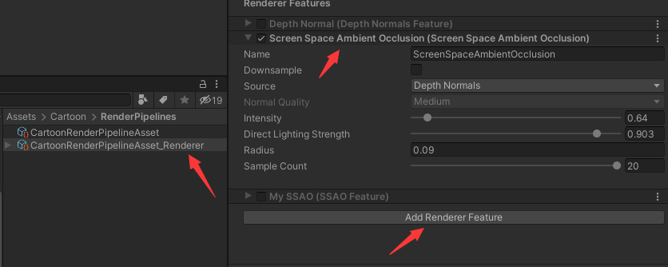
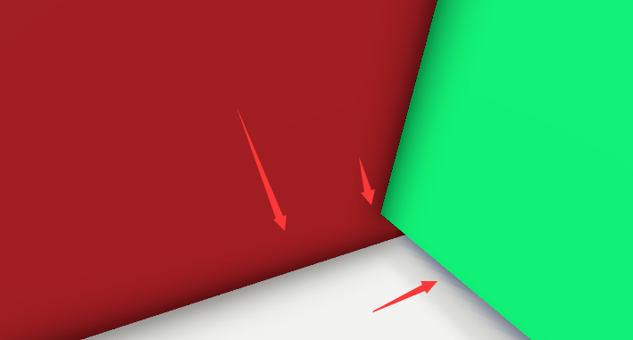
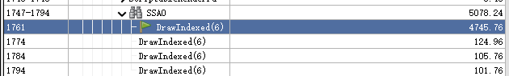
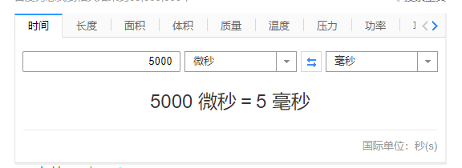
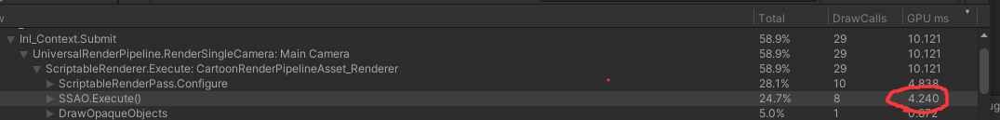

URP的SSAO
=================

(Github正常排版: [URP的SSAO]())

-----------------

## **0.先放结论**

&emsp;&emsp; URP去年更新了SSAO,很久之前写(抄)完一直没有写个文章记录学习下.最近放假就写一下.

食()用方法很简单.打开**RenderData**, 再**Add Renderer Feature**, 选择**Screen Space Ambient Occlusion**就好了.

然后看下对比效果.现在是没有开.

我想开了.

再看下耗时.虽然用render doc来检测耗时不是很科学和准确,但是手里也没有别的工具了.

差不多5ms.这效果配上这耗时真的一言难尽...... 但是不妨碍拿来学习.

这里的版本是2020的. 2021对延迟渲染和XR做了支持,并且可以修改渲染的时机为BeforeOpaque/AfterOpaque. 其实选2020作为学习的版本也有部分原因是避开延迟和XR.

-----------------

## **1.拆解C#**

&emsp;&emsp; 我的习惯是先拆解C#,再学习shader.

先拆解设置属性,看看都有啥.
