URP的SSAO
=================

(Github正常排版: [URP的SSAO]())

-----------------

## **0.先放结论**

&emsp;&emsp; URP去年更新了SSAO,很久之前写(抄)完一直没有写个文章记录学习下.最近放假就写一下.

食()用方法很简单.打开**RenderData**, 再**Add Renderer Feature**, 选择**Screen Space Ambient Occlusion**就好了.

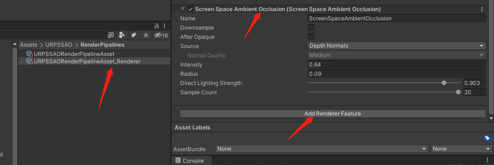

然后看下对比效果.现在是没有开.


我想开了.

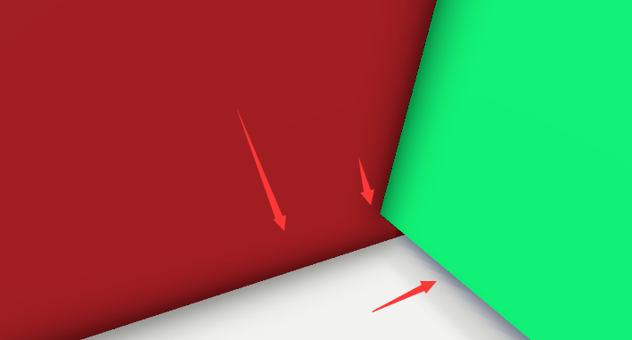

再看下耗时.虽然用render doc来检测耗时不是很科学和准确,但是手里也没有别的工具了.

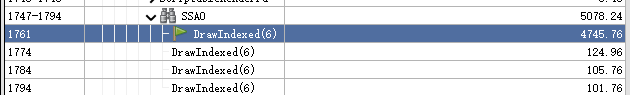


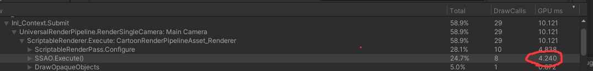

差不多5ms.这效果配上这耗时真的一言难尽...... 但是不妨碍拿来学习.

这里的版本是2021的. 2021对延迟渲染和XR做了支持,并且可以修改渲染的时机为BeforeOpaque/AfterOpaque(就是在物体shader中采样,还是贴到屏幕上).

下图是2020版的设置. 可以和上面对比一下, 基本没有什么大改动.


-----------------

## **1.原理**
//TODO:
GAMES 202 百人计划  知乎 OPENGL

-----------------

## **2.拆解C#**

&emsp;&emsp; 我的习惯是先拆解C#,再学习shader. 我这里是自己复制改动了一些,方便自己区分.可以对照源码看.

### **2.1 URPSSAOSettings**

先拆解设置属性,看看都有啥. 看上面属性面板很简单, 看了一眼代码果然很简单呢. 所以这里创建C# **URPSSAORenderFeature.cs**. 直接复制Settings Class.

```C#
[Serializable]
public class URPSSAOSettings
{
	// Enums
	public enum DepthSource
	{
		Depth = 0,
		DepthNormals = 1,
	}

	public enum NormalQuality
	{
		Low,
		Medium,
		High
	}

	// Parameters
	[SerializeField] public bool Downsample = false;
	[SerializeField] public bool AfterOpaque = false;
	[SerializeField] public DepthSource Source = DepthSource.DepthNormals;
	[SerializeField] public NormalQuality NormalSamples = NormalQuality.Medium;
	[SerializeField] public float Intensity = 3.0f;
	[SerializeField] public float DirectLightingStrength = 0.25f;
	[SerializeField] public float Radius = 0.035f;
	[SerializeField] public int SampleCount = 4;
}

public class URPSSAORenderFeature: MonoBehaviour
{
	...
}

```

### **2.2 URPSSAORenderFeature**

然后再看**RendererFeature**. 这个里面基本就是创建个渲染Pass,是否添加到渲染队列,创建材质和存个设置. 
**[DisallowMultipleRendererFeature]**这个标签作用是禁止多次添加用的,在2020是**internal**加上去会报错,2021是**public**.
**Dispose**在切换**RendererData**的时候会触发,销毁创建的材质.
**URPSSAORenderPass**在后面补充.
修改完善**class URPSSAORenderFeature**.
**k_ShaderName**要和Shader中的name对应, 并且打包的时候注意别剔除了(可以添加材质球强制让其入包, 或者用**Shader Variant Collect**), 不然会找不到.

```C#
using System;
using UnityEngine;
using UnityEngine.Rendering;
using UnityEngine.Rendering.Universal;

[Serializable]
public class URPSSAOSettings
{
	...
}

[DisallowMultipleRendererFeature]
[Tooltip("The Ambient Occlusion effect darkens creases, holes, intersections and surfaces that are close to each other.")]
public class URPSSAORenderFeature : ScriptableRendererFeature
{
	// Constants
	private const string k_ShaderName = "Hidden/Universal Render Pipeline/ScreenSpaceAmbientOcclusion";

	// Serialized Fields
	[SerializeField, HideInInspector] private Shader m_Shader = null;
	[SerializeField] private URPSSAOSettings m_Settings = new URPSSAOSettings();

	// Private Fields
	private Material m_Material;
	private URPSSAORenderPass m_SSAOPass = null;

	/// <inheritdoc/>
	public override void Create()
	{
		// Create the pass...
		if (m_SSAOPass == null)
		{
			m_SSAOPass = new URPSSAORenderPass();
		}

		GetMaterial();
	}

	/// <inheritdoc/>
	public override void AddRenderPasses(ScriptableRenderer renderer, ref RenderingData renderingData)
	{
		if (!GetMaterial())
		{
			Debug.LogErrorFormat(
				"{0}.AddRenderPasses(): Missing material. {1} render pass will not be added. Check for missing reference in the renderer resources.",
				GetType().Name, m_SSAOPass.profilerTag);
			return;
		}

		bool shouldAdd = m_SSAOPass.Setup(m_Settings, renderer, m_Material);
		if (shouldAdd)
		{
			renderer.EnqueuePass(m_SSAOPass);
		}
	}

	/// <inheritdoc/>
	protected override void Dispose(bool disposing)
	{
		CoreUtils.Destroy(m_Material);
	}

	private bool GetMaterial()
	{
		if (m_Material != null)
		{
			return true;
		}

		if (m_Shader == null)
		{
			m_Shader = Shader.Find(k_ShaderName);
			if (m_Shader == null)
			{
				return false;
			}
		}

		m_Material = CoreUtils.CreateEngineMaterial(m_Shader);
		return m_Material != null;
	}
}

```

### **2.3 URPSSAORenderPass**

然后就再看**RenderPass**.

#### **2.3.1 构造函数**

这里先看构造函数
因为我这里是抄写的,比较符合我自己的代码习惯,而且还是一步一步慢慢填充的,所以跟原来的代码不一样.但是大体上的思想基本一致.
比如说**ProfilingSampler.Get(URPProfileId.SSAO)**外部获取不了,我这里用**k_tag**来自己创建.
再比如**isRendererDeferred**判断是否为延迟渲染. 因为 **renderer.renderingMode** 是internal, 所以没有办法判断, 只能先写成false, 之后再想办法解决.

```C#
using System;
using UnityEngine;
using UnityEngine.Rendering;
using UnityEngine.Rendering.Universal;

public class URPSSAORenderPass : ScriptableRenderPass
{
	// private ProfilingSampler m_ProfilingSampler = ProfilingSampler.Get(URPProfileId.SSAO);
	private const string k_tag = "URPSSAO";

	// Private Variables
	private URPSSAOSettings m_CurrentSettings;

	// Properties

	// 因为是internal 
	// m_Renderer is UniversalRenderer renderer && renderer.renderingMode == RenderingMode.Deferred;
	private bool isRendererDeferred => false; 

	internal URPSSAORenderPass()
	{
		profilingSampler = new ProfilingSampler(k_tag);
		m_CurrentSettings = new URPSSAOSettings();
	}

	public override void Execute(ScriptableRenderContext context, ref RenderingData renderingData)
	{
		throw new System.NotImplementedException();
	}
}

```

#### **2.3.2 Setup**

然后再看看每帧执行的**Setup**.
把**Feature**的变量传递进去,记录保存.
根据变量决定是否要开启SSAO, 渲染队列, 和需要的场景信息.
ConfigureInput告诉管线, 我这个pass需要什么图, 让引擎帮忙启用对应的pass, 得到对应的图.
(URP2021**ConfigureInput**终于支持**Motion Vector**)

比如说:前项渲染且勾选了**DepthNormals**, 则会利用物体的**DepthNormal Pass** 去绘制生成Normal图.

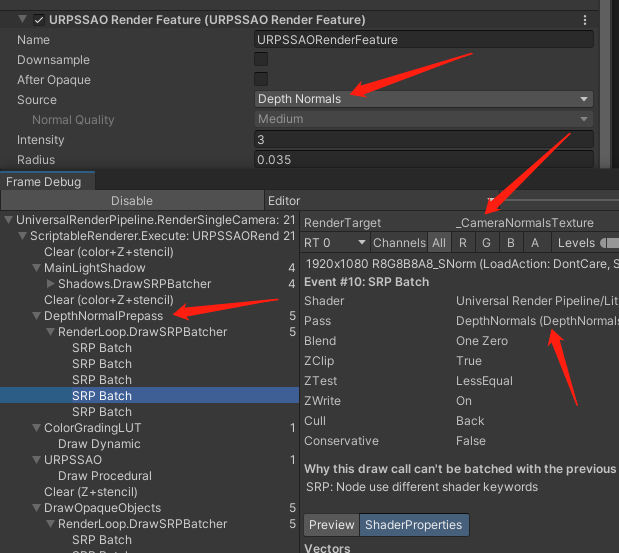

```C#
...

private Material m_Material;
private ScriptableRenderer m_Renderer;
private URPSSAOSettings m_CurrentSettings;

...

internal URPSSAORenderPass()
{
	...
}

internal bool Setup(URPSSAOSettings featureSettings, ScriptableRenderer renderer, Material material)
{
	m_Material = material;
	m_Renderer = renderer;
	m_CurrentSettings = featureSettings;

	URPSSAOSettings.DepthSource source;
	if (isRendererDeferred)
	{
		renderPassEvent = featureSettings.AfterOpaque
			? RenderPassEvent.AfterRenderingOpaques
			: RenderPassEvent.AfterRenderingGbuffer;
		source = URPSSAOSettings.DepthSource.DepthNormals;
	}
	else
	{
		// Rendering after PrePasses is usually correct except when depth priming is in play:
		// then we rely on a depth resolve taking place after the PrePasses in order to have it ready for SSAO.
		// Hence we set the event to RenderPassEvent.AfterRenderingPrePasses + 1 at the earliest.
		renderPassEvent = featureSettings.AfterOpaque
			? RenderPassEvent.AfterRenderingOpaques
			: RenderPassEvent.AfterRenderingPrePasses + 1;
		source = m_CurrentSettings.Source;
	}


	switch (source)
	{
		case URPSSAOSettings.DepthSource.Depth:
			ConfigureInput(ScriptableRenderPassInput.Depth);
			break;
		case URPSSAOSettings.DepthSource.DepthNormals:
			// need depthNormal prepass for forward-only geometry
			ConfigureInput(ScriptableRenderPassInput.Normal);
			break;
		default:
			throw new ArgumentOutOfRangeException();
	}

	return m_Material != null
			&& m_CurrentSettings.Intensity > 0.0f
			&& m_CurrentSettings.Radius > 0.0f
			&& m_CurrentSettings.SampleCount > 0;
}

public override void Execute(ScriptableRenderContext context, ref RenderingData renderingData)
{
	...
}

```

#### **2.3.3 Property**

为了后面对材质球属性设置省事,我们可以提前粘贴需要的全部属性. Ctrl+C+V一下,啪很快啊.
 
```C#
private const string k_tag = "URPSSAO";

#region Property

public static readonly int s_SourceSize = Shader.PropertyToID("_SourceSize");


private static readonly int s_BaseMapID = Shader.PropertyToID("_BaseMap");
private static readonly int s_SSAOParamsID = Shader.PropertyToID("_SSAOParams");
private static readonly int s_SSAOTexture1ID = Shader.PropertyToID("_SSAO_OcclusionTexture1");
private static readonly int s_SSAOTexture2ID = Shader.PropertyToID("_SSAO_OcclusionTexture2");
private static readonly int s_SSAOTexture3ID = Shader.PropertyToID("_SSAO_OcclusionTexture3");
private static readonly int s_SSAOTextureFinalID = Shader.PropertyToID("_SSAO_OcclusionTexture");
private static readonly int s_CameraViewXExtentID = Shader.PropertyToID("_CameraViewXExtent");
private static readonly int s_CameraViewYExtentID = Shader.PropertyToID("_CameraViewYExtent");
private static readonly int s_CameraViewZExtentID = Shader.PropertyToID("_CameraViewZExtent");
private static readonly int s_ProjectionParams2ID = Shader.PropertyToID("_ProjectionParams2");
private static readonly int s_CameraViewProjectionsID = Shader.PropertyToID("_CameraViewProjections");
private static readonly int s_CameraViewTopLeftCornerID = Shader.PropertyToID("_CameraViewTopLeftCorner");

#endregion

// Private Variables
private Material m_Material;
...

internal URPSSAORenderPass()
{
	...
}

```

#### **2.3.4 OnCameraSetup**

我们这里按照渲染逻辑顺序依次说明.不过这里只写override的方法,比如**Configure**,**FrameCleanup**都没有重写就跳过顺序说明了.
当成功加入到渲染队列之后,就是先执行**OnCameraSetup**.
**OnCameraSetup**这里主要是对材质球的属性设置.

先写ssaoParams的设置.
```C#

internal bool Setup(URPSSAOSettings featureSettings, ScriptableRenderer renderer,
	Material material)
{
	...
}

public override void OnCameraSetup(CommandBuffer cmd, ref RenderingData renderingData)
{
	RenderTextureDescriptor cameraTargetDescriptor = renderingData.cameraData.cameraTargetDescriptor;
	int downsampleDivider = m_CurrentSettings.Downsample ? 2 : 1;

	// Update SSAO parameters in the material
	Vector4 ssaoParams = new Vector4(
		m_CurrentSettings.Intensity, // Intensity
		m_CurrentSettings.Radius, // Radius
		1.0f / downsampleDivider, // Downsampling
		m_CurrentSettings.SampleCount // Sample count
	);
	m_Material.SetVector(s_SSAOParamsID, ssaoParams);

}
```

然后就是摄像机属性的设置. 
2021新加了XR的支持.**renderingData.cameraData.xr**因为是**internal**,我这里改成**renderingData.cameraData.xrRendering**. 因为我也没有VR已经不开发VR了(不会还有人在开发VR,不会吧不会吧), 根本不关心这个API hhh.
XR主要是多了一个eye,让其成为**VectorArray**.但是总体没有什么大变化.
这里主要的计算就是把**proj空间**下的**最远的极值点**(最远左上点,最远右上点,最远右下点,最远中心点), 转换到**world空间**坐标. 然后记录左上,XY方向,中心方向.


```C#

...

private URPSSAOSettings m_CurrentSettings;

private Vector4[] m_CameraTopLeftCorner = new Vector4[2];
private Vector4[] m_CameraXExtent = new Vector4[2];
private Vector4[] m_CameraYExtent = new Vector4[2];
private Vector4[] m_CameraZExtent = new Vector4[2];
private Matrix4x4[] m_CameraViewProjections = new Matrix4x4[2];

...

public override void OnCameraSetup(CommandBuffer cmd, ref RenderingData renderingData)
{
	...
	m_Material.SetVector(s_SSAOParamsID, ssaoParams);

	
#if ENABLE_VR && ENABLE_XR_MODULE
	//renderingData.cameraData.xr.enabled && renderingData.cameraData.xr.singlePassEnabled ->  renderingData.cameraData.xrRendering  
	int eyeCount = renderingData.cameraData.xrRendering ? 2 : 1;
#else
	int eyeCount = 1;
#endif
	for (int eyeIndex = 0; eyeIndex < eyeCount; eyeIndex++)
	{
		Matrix4x4 view = renderingData.cameraData.GetViewMatrix(eyeIndex);
		Matrix4x4 proj = renderingData.cameraData.GetProjectionMatrix(eyeIndex);
		m_CameraViewProjections[eyeIndex] = proj * view;

		// camera view space without translation, used by SSAO.hlsl ReconstructViewPos() to calculate view vector.
		Matrix4x4 cview = view;
		cview.SetColumn(3, new Vector4(0.0f, 0.0f, 0.0f, 1.0f));
		Matrix4x4 cviewProj = proj * cview;
		Matrix4x4 cviewProjInv = cviewProj.inverse;

		Vector4 topLeftCorner = cviewProjInv.MultiplyPoint(new Vector4(-1, 1, -1, 1));
		Vector4 topRightCorner = cviewProjInv.MultiplyPoint(new Vector4(1, 1, -1, 1));
		Vector4 bottomLeftCorner = cviewProjInv.MultiplyPoint(new Vector4(-1, -1, -1, 1));
		Vector4 farCentre = cviewProjInv.MultiplyPoint(new Vector4(0, 0, 1, 1));
		m_CameraTopLeftCorner[eyeIndex] = topLeftCorner;
		m_CameraXExtent[eyeIndex] = topRightCorner - topLeftCorner;
		m_CameraYExtent[eyeIndex] = bottomLeftCorner - topLeftCorner;
		m_CameraZExtent[eyeIndex] = farCentre;
	}

	m_Material.SetVector(s_ProjectionParams2ID,
		new Vector4(1.0f / renderingData.cameraData.camera.nearClipPlane, 0.0f, 0.0f, 0.0f));
	m_Material.SetMatrixArray(s_CameraViewProjectionsID, m_CameraViewProjections);
	m_Material.SetVectorArray(s_CameraViewTopLeftCornerID, m_CameraTopLeftCorner);
	m_Material.SetVectorArray(s_CameraViewXExtentID, m_CameraXExtent);
	m_Material.SetVectorArray(s_CameraViewYExtentID, m_CameraYExtent);
	m_Material.SetVectorArray(s_CameraViewZExtentID, m_CameraZExtent);
}
```

再后面就是一些**keyword**设置.
添加关键字string并且设置.
比如摄像机类型, Normal采样质量, 用Depth还是DepthNormal图.

```C#

private const string k_tag = "URPSSAO";

#region Keyword

private const string k_ScreenSpaceOcclusion = "_SCREEN_SPACE_OCCLUSION";
private const string k_SSAOTextureName = "_ScreenSpaceOcclusionTexture";
private const string k_SSAOAmbientOcclusionParamName = "_AmbientOcclusionParam";

private const string k_OrthographicCameraKeyword = "_ORTHOGRAPHIC";
private const string k_NormalReconstructionLowKeyword = "_RECONSTRUCT_NORMAL_LOW";
private const string k_NormalReconstructionMediumKeyword = "_RECONSTRUCT_NORMAL_MEDIUM";
private const string k_NormalReconstructionHighKeyword = "_RECONSTRUCT_NORMAL_HIGH";
private const string k_SourceDepthKeyword = "_SOURCE_DEPTH";
private const string k_SourceDepthNormalsKeyword = "_SOURCE_DEPTH_NORMALS";

#endregion

#region Property
...
#endregion

...

public override void OnCameraSetup(CommandBuffer cmd, ref RenderingData renderingData)
{
	m_Material.SetVectorArray(s_CameraViewZExtentID, m_CameraZExtent);
	...

	// Update keywords
	CoreUtils.SetKeyword(m_Material, k_OrthographicCameraKeyword, renderingData.cameraData.camera.orthographic);

	URPSSAOSettings.DepthSource source = this.isRendererDeferred
		? URPSSAOSettings.DepthSource.DepthNormals
		: m_CurrentSettings.Source;

	if (source == URPSSAOSettings.DepthSource.Depth)
	{
		switch (m_CurrentSettings.NormalSamples)
		{
			case URPSSAOSettings.NormalQuality.Low:
				CoreUtils.SetKeyword(m_Material, k_NormalReconstructionLowKeyword, true);
				CoreUtils.SetKeyword(m_Material, k_NormalReconstructionMediumKeyword, false);
				CoreUtils.SetKeyword(m_Material, k_NormalReconstructionHighKeyword, false);
				break;
			case URPSSAOSettings.NormalQuality.Medium:
				CoreUtils.SetKeyword(m_Material, k_NormalReconstructionLowKeyword, false);
				CoreUtils.SetKeyword(m_Material, k_NormalReconstructionMediumKeyword, true);
				CoreUtils.SetKeyword(m_Material, k_NormalReconstructionHighKeyword, false);
				break;
			case URPSSAOSettings.NormalQuality.High:
				CoreUtils.SetKeyword(m_Material, k_NormalReconstructionLowKeyword, false);
				CoreUtils.SetKeyword(m_Material, k_NormalReconstructionMediumKeyword, false);
				CoreUtils.SetKeyword(m_Material, k_NormalReconstructionHighKeyword, true);
				break;
			default:
				throw new ArgumentOutOfRangeException();
		}
	}

	switch (source)
	{
		case URPSSAOSettings.DepthSource.DepthNormals:
			CoreUtils.SetKeyword(m_Material, k_SourceDepthKeyword, false);
			CoreUtils.SetKeyword(m_Material, k_SourceDepthNormalsKeyword, true);
			break;
		default:
			CoreUtils.SetKeyword(m_Material, k_SourceDepthKeyword, true);
			CoreUtils.SetKeyword(m_Material, k_SourceDepthNormalsKeyword, false);
			break;
	}
}

```

最后的最后就是 **descriptors**创建和设置, **RenderTargetIdentifier**的初始化, RT的创建, 和画布的输入.
因为AO的结果图是一个0-1的黑白图,所以单通道的**R8**就可以了.不过可能存在一些设备不支持,就用**ARGB32**.
为了效果好,这里RT的用**FilterMode**用**Bilinear**.
最后的画布输入,如果是**AfterOpaque**, 就画在Color RT上类似于贴上去, 否则就创建一个RT, 物体着色的时候进行采样, 让其变暗.
**RenderTargetIdentifier** , 是和**ID**进行绑定的. 在后面渲染的时候用到, 作用是避免每次传递的时候都进行创建, 所以在这里先初始化.


```C#
...

#region Property
...
#endregion

private bool m_SupportsR8RenderTextureFormat = SystemInfo.SupportsRenderTextureFormat(RenderTextureFormat.R8);

private Material m_Material;

...
private Matrix4x4[] m_CameraViewProjections = new Matrix4x4[2];

private RenderTextureDescriptor m_AOPassDescriptor;
private RenderTextureDescriptor m_BlurPassesDescriptor;
private RenderTextureDescriptor m_FinalDescriptor;

private RenderTargetIdentifier m_SSAOTexture1Target = new(s_SSAOTexture1ID, 0, CubemapFace.Unknown, -1);
private RenderTargetIdentifier m_SSAOTexture2Target = new(s_SSAOTexture2ID, 0, CubemapFace.Unknown, -1);
private RenderTargetIdentifier m_SSAOTexture3Target = new(s_SSAOTexture3ID, 0, CubemapFace.Unknown, -1);
private RenderTargetIdentifier m_SSAOTextureFinalTarget = new(s_SSAOTextureFinalID, 0, CubemapFace.Unknown, -1);

// Properties

// 因为是internal 
//m_Renderer is UniversalRenderer renderer && renderer.renderingMode == RenderingMode.Deferred;
private bool isRendererDeferred => false;

internal URPSSAORenderPass()
{
	...
}

public override void OnCameraSetup(CommandBuffer cmd, ref RenderingData renderingData)
{
	...
	
	switch (source)
	{
		...
	}

	// Set up the descriptors
	RenderTextureDescriptor descriptor = cameraTargetDescriptor;
	descriptor.msaaSamples = 1;
	descriptor.depthBufferBits = 0;

	m_AOPassDescriptor = descriptor;
	m_AOPassDescriptor.width /= downsampleDivider;
	m_AOPassDescriptor.height /= downsampleDivider;
	m_AOPassDescriptor.colorFormat = RenderTextureFormat.ARGB32;

	m_BlurPassesDescriptor = descriptor;
	m_BlurPassesDescriptor.colorFormat = RenderTextureFormat.ARGB32;

	m_FinalDescriptor = descriptor;
	m_FinalDescriptor.colorFormat =
		m_SupportsR8RenderTextureFormat ? RenderTextureFormat.R8 : RenderTextureFormat.ARGB32;

	// Get temporary render textures
	cmd.GetTemporaryRT(s_SSAOTexture1ID, m_AOPassDescriptor, FilterMode.Bilinear);
	cmd.GetTemporaryRT(s_SSAOTexture2ID, m_BlurPassesDescriptor, FilterMode.Bilinear);
	cmd.GetTemporaryRT(s_SSAOTexture3ID, m_BlurPassesDescriptor, FilterMode.Bilinear);
	cmd.GetTemporaryRT(s_SSAOTextureFinalID, m_FinalDescriptor, FilterMode.Bilinear);

	// Configure targets and clear color
	ConfigureTarget(m_CurrentSettings.AfterOpaque ? m_Renderer.cameraColorTarget : s_SSAOTexture2ID);
	ConfigureClear(ClearFlag.None, Color.white);
}

```

#### **2.3.5 Execute**

之后就是执行渲染了. 先写一个基础的框架.

```C#

 public override void Execute(ScriptableRenderContext context, ref RenderingData renderingData)
{
	if (m_Material == null)
	{
		Debug.LogErrorFormat("{0}.Execute(): Missing material. ScreenSpaceAmbientOcclusion pass will not execute. Check for missing reference in the renderer resources.", GetType().Name);
		return;
	}

	CommandBuffer cmd = CommandBufferPool.Get();
	using (new ProfilingScope(cmd, m_ProfilingSampler))
	{
		//TODO:
	}

	context.ExecuteCommandBuffer(cmd);
	CommandBufferPool.Release(cmd);
}
```

然后填充框架.这里是先设置**Keyword**和**SourceSize**.
**AfterOpaque**决定是由哪种方式采样表现AO效果.所以需要设置一个关键字**k_ScreenSpaceOcclusion**在shader中进行开关. 关键字重置在后面的**OnCameraCleanup**中完成.


```C#

public override void Execute(ScriptableRenderContext context, ref RenderingData renderingData)
{
	...

	using (new ProfilingScope(cmd, profilingSampler))
	{
		if (!m_CurrentSettings.AfterOpaque)
		{
			//ShaderKeywordStrings.ScreenSpaceOcclusion 拷贝出来
			CoreUtils.SetKeyword(cmd, k_ScreenSpaceOcclusion, true);
		}	
	}

	...
}


```

再后面就是渲染AO了. 在此之前 先写 **Enum ShaderPasses** 和 三个Render的公共方法.
**Enum ShaderPasses**, 需要和shader pass index 对应.
因为**SetSourceSize**是**interal**, 所以我这里直接拷贝出来了. 主要作用就是 传递画布尺寸(考虑动态画布缩放)到Shader中.
**Render**, 设置RT, 全屏绘制某个pass. 因为是全部覆盖的后处理绘制, 所以不关心(**DontCare**)输入的颜色 和 depth, 只需要**Store**输出的颜色就好了. 原来是全屏的四边形, 我这里改成用大三角形, 同时Shader中也要对应处理.
**RenderAndSetBaseMap**, 同上, 并且多传入一个BaseMap.

```C#

public class URPSSAORenderPass : ScriptableRenderPass
{
	private enum ShaderPasses
	{
		AO = 0,
		BlurHorizontal = 1,
		BlurVertical = 2,
		BlurFinal = 3,
		AfterOpaque = 4
	}
	
	
	private const string k_tag = "URPSSAO";

	...

	public override void Execute(ScriptableRenderContext context, ref RenderingData renderingData)
	{
		...
	}

	//PostProcessUtils.SetSourceSize是internal,所以拷贝出来了
	private void SetSourceSize(CommandBuffer cmd, RenderTextureDescriptor desc)
	{
		float width = desc.width;
		float height = desc.height;
		if (desc.useDynamicScale)
		{
			width *= ScalableBufferManager.widthScaleFactor;
			height *= ScalableBufferManager.heightScaleFactor;
		}

		cmd.SetGlobalVector(s_SourceSize, new Vector4(width, height, 1.0f / width, 1.0f / height));
	}

	private void Render(CommandBuffer cmd, RenderTargetIdentifier target, ShaderPasses pass)
	{
		cmd.SetRenderTarget(
			target,
			RenderBufferLoadAction.DontCare,
			RenderBufferStoreAction.Store,
			target,
			RenderBufferLoadAction.DontCare,
			RenderBufferStoreAction.DontCare
		);

		//原来的是绘制四个全屏顶点, 这里优化用大三角形  Shader中也要对应修改
		//cmd.DrawMesh(RenderingUtils.fullscreenMesh, Matrix4x4.identity, m_Material, 0, (int) pass);
		CoreUtils.DrawFullScreen(cmd, m_Material, null, (int) pass);
	}

	private void RenderAndSetBaseMap(CommandBuffer cmd, RenderTargetIdentifier baseMap, RenderTargetIdentifier target, ShaderPasses pass)
	{
		cmd.SetGlobalTexture(s_BaseMapID, baseMap);
		Render(cmd, target, pass);
	}
}

```

然后渲染.
设置分辨率(可能是半分辨率), 渲染AO, 然后横着模糊.
重新设置全分辨率尺寸, 竖着模糊. 稍微处理一下输出FinalRT.
设置FinalRT和AO参数.
因为**AfterOpaque**时, 是类似于贴上去的. 所以还需要设置RT进行全屏带blend的绘制.

```C#

public override void Execute(ScriptableRenderContext context, ref RenderingData renderingData)
{
	...

	CommandBuffer cmd = CommandBufferPool.Get();
	using (new ProfilingScope(cmd, profilingSampler))
	{
		if (!m_CurrentSettings.AfterOpaque)
		{
			...
		}

		SetSourceSize(cmd, m_AOPassDescriptor);
		// Execute the SSAO
		Render(cmd, m_SSAOTexture1Target, ShaderPasses.AO);

		// Execute the Blur Passes
		RenderAndSetBaseMap(cmd, m_SSAOTexture1Target, m_SSAOTexture2Target, ShaderPasses.BlurHorizontal);

		SetSourceSize(cmd, m_BlurPassesDescriptor);
		RenderAndSetBaseMap(cmd, m_SSAOTexture2Target, m_SSAOTexture3Target, ShaderPasses.BlurVertical);
		RenderAndSetBaseMap(cmd, m_SSAOTexture3Target, m_SSAOTextureFinalTarget, ShaderPasses.BlurFinal);

		// Set the global SSAO texture and AO Params
		cmd.SetGlobalTexture(k_SSAOTextureName, m_SSAOTextureFinalTarget);
		cmd.SetGlobalVector(k_SSAOAmbientOcclusionParamName, new Vector4(0f, 0f, 0f, m_CurrentSettings.DirectLightingStrength));

		// If true, SSAO pass is inserted after opaque pass and is expected to modulate lighting result now.
		if (m_CurrentSettings.AfterOpaque)
		{
			// This implicitly also bind depth attachment. Explicitly binding m_Renderer.cameraDepthTarget does not work.
			cmd.SetRenderTarget(
				m_Renderer.cameraColorTarget,
				RenderBufferLoadAction.Load,
				RenderBufferStoreAction.Store
			);
			cmd.DrawMesh(RenderingUtils.fullscreenMesh, Matrix4x4.identity, m_Material, 0, (int)ShaderPasses.AfterOpaque);
		}

	}

	...
}

```

#### **2.3.5 OnCameraCleanup**

整个camera渲染完成, 重置参数, 清理临时RT.

```C#

public override void Execute(ScriptableRenderContext context, ref RenderingData renderingData)
{
	...
}

public override void OnCameraCleanup(CommandBuffer cmd)
{
	if (cmd == null)
	{
		throw new ArgumentNullException("cmd");
	}

	if (!m_CurrentSettings.AfterOpaque)
	{
		CoreUtils.SetKeyword(cmd, ShaderKeywordStrings.ScreenSpaceOcclusion, false);
	}

	cmd.ReleaseTemporaryRT(s_SSAOTexture1ID);
	cmd.ReleaseTemporaryRT(s_SSAOTexture2ID);
	cmd.ReleaseTemporaryRT(s_SSAOTexture3ID);
	cmd.ReleaseTemporaryRT(s_SSAOTextureFinalID);
}

//PostProcessUtils.SetSourceSize是internal,所以拷贝出来了
private void SetSourceSize(CommandBuffer cmd, RenderTextureDescriptor desc)
{
	...
}

```

#### **2.3.6 Deferred设置**

因为我们获取不到Deferred, 所以需要自己添加bool, 通过反射来设置.
虽然也可以用**AssemblyDefinition Reference** 和 **[InternalsVisibleTo]** 来实现, 但是没有搞明白搞成功 , 就先算了.
至于效率问题, 因为运行的时候基本不会修改渲染模式. 所以基本只用获取一次就够了. 

打开**URPSSAORenderFeature.cs**, 修改 **class URPSSAOSettings**

```C#

[Serializable]
public class URPSSAOSettings
{
	...

	// Parameters
	[NonSerialized] public bool? IsDeferred = null;
	[SerializeField] public bool Downsample = false;
	...
}

...
public class URPSSAORenderFeature : ScriptableRendererFeature
{
	...
}

```

然后修改**class URPSSAORenderFeature**, 在里面添加反射获取.

```C#

...
public class URPSSAORenderFeature : ScriptableRendererFeature
{
	...
	
	public override void AddRenderPasses(ScriptableRenderer renderer, ref RenderingData renderingData)
	{
		if (!GetMaterial())
		{
			...
		}

		if (m_Settings.IsDeferred == null)
		{
			var ur = renderer as UniversalRenderer;
			var fieldInfo =
				ur.GetType().GetField("m_RenderingMode", BindingFlags.NonPublic | BindingFlags.Instance);

			var rendererMode = (RenderingMode) fieldInfo.GetValue(ur);

			m_Settings.IsDeferred = rendererMode == RenderingMode.Deferred;
		}

		bool shouldAdd = m_SSAOPass.Setup(m_Settings, renderer, m_Material);
		...
	}

	...
}

```

最后返回**URPSSAORenderPass.cs**, 修改**isRendererDeferred**

```C#

public class URPSSAORenderPass : ScriptableRenderPass
{
	...
	private RenderTargetIdentifier m_SSAOTextureFinalTarget = new(s_SSAOTextureFinalID, 0, CubemapFace.Unknown, -1);

	// Properties

	// 因为是internal 
	// m_Renderer is UniversalRenderer renderer && renderer.renderingMode == RenderingMode.Deferred;
	private bool IsRendererDeferred => m_CurrentSettings.IsDeferred != null && m_CurrentSettings.IsDeferred.Value;

	internal URPSSAORenderPass()
	{
		...
	}

	...
}

```

### **2.4 InspectorGUI**

然后编写Editor InspectorGUI.
为什么要写? 好看(doge). 还有是因为Deferred Mode下, 模式应该自动是Depth&Normal, 不让美术编辑.

修改前后.

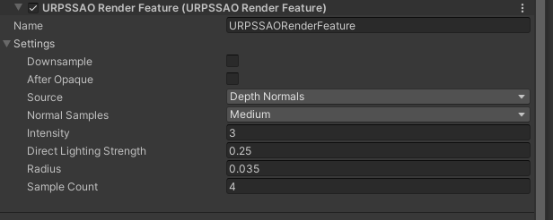

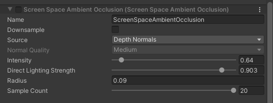

这里**RendererIsDeferred()**的写法跟原URP不一样, 因为原来的写法存在问题. 他拿的的是当前管线, 然后是否存在当前**RenderFeature**, 决定能不能编辑. 但是其实可以直接获取这个**RenderFeature**所属的**RendererData**, 得到**renderingMode**是否是延迟就好了.

```C#

using MyGraphics.URPSSAO.Scripts;
using UnityEditor;
using UnityEngine;
using UnityEngine.Rendering.Universal;

[CustomEditor(typeof(URPSSAORenderFeature))]
public class URPSSAOEditor : UnityEditor.Editor
{
	#region Serialized Properties

	private SerializedProperty m_Downsample;
	private SerializedProperty m_AfterOpaque;
	private SerializedProperty m_Source;
	private SerializedProperty m_NormalQuality;
	private SerializedProperty m_Intensity;
	private SerializedProperty m_DirectLightingStrength;
	private SerializedProperty m_Radius;
	private SerializedProperty m_SampleCount;

	#endregion

	private bool m_IsInitialized = false;

	// Structs
	private struct Styles
	{
		public static GUIContent Downsample = EditorGUIUtility.TrTextContent("Downsample",
			"With this option enabled, Unity downsamples the SSAO effect texture to improve performance. Each dimension of the texture is reduced by a factor of 2.");

		public static GUIContent AfterOpaque = EditorGUIUtility.TrTextContent("After Opaque",
			"With this option enabled, Unity calculates and apply SSAO after the opaque pass to improve performance on mobile platforms with tiled-based GPU architectures. This is not physically correct.");

		public static GUIContent Source = EditorGUIUtility.TrTextContent("Source",
			"The source of the normal vector values.\nDepth Normals: the feature uses the values generated in the Depth Normal prepass.\nDepth: the feature reconstructs the normal values using the depth buffer.\nIn the Deferred rendering path, the feature uses the G-buffer normals texture.");

		public static GUIContent NormalQuality = new GUIContent("Normal Quality",
			"The number of depth texture samples that Unity takes when computing the normals. Low:1 sample, Medium: 5 samples, High: 9 samples.");

		public static GUIContent Intensity =
			EditorGUIUtility.TrTextContent("Intensity", "The degree of darkness that Ambient Occlusion adds.");

		public static GUIContent DirectLightingStrength = EditorGUIUtility.TrTextContent("Direct Lighting Strength",
			"Controls how much the ambient occlusion affects direct lighting.");

		public static GUIContent Radius = EditorGUIUtility.TrTextContent("Radius",
			"The radius around a given point, where Unity calculates and applies the effect.");

		public static GUIContent SampleCount = EditorGUIUtility.TrTextContent("Sample Count",
			"The number of samples that Unity takes when calculating the obscurance value. Higher values have high performance impact.");
	}

	private void Init()
	{
		SerializedProperty settings = serializedObject.FindProperty("m_Settings");
		m_Source = settings.FindPropertyRelative("Source");
		m_Downsample = settings.FindPropertyRelative("Downsample");
		m_AfterOpaque = settings.FindPropertyRelative("AfterOpaque");
		m_NormalQuality = settings.FindPropertyRelative("NormalSamples");
		m_Intensity = settings.FindPropertyRelative("Intensity");
		m_DirectLightingStrength = settings.FindPropertyRelative("DirectLightingStrength");
		m_Radius = settings.FindPropertyRelative("Radius");
		m_SampleCount = settings.FindPropertyRelative("SampleCount");
		m_IsInitialized = true;
	}

	public override void OnInspectorGUI()
	{
		if (!m_IsInitialized)
		{
			Init();
		}
		
		bool isDeferredRenderingMode = RendererIsDeferred();

		EditorGUILayout.PropertyField(m_Downsample, Styles.Downsample);

		EditorGUILayout.PropertyField(m_AfterOpaque, Styles.AfterOpaque);

		GUI.enabled = !isDeferredRenderingMode;
		EditorGUILayout.PropertyField(m_Source, Styles.Source);

		// We only enable this field when depth source is selected
		GUI.enabled = !isDeferredRenderingMode &&
						m_Source.enumValueIndex == (int) URPSSAOSettings.DepthSource.Depth;
		EditorGUI.indentLevel++;
		EditorGUILayout.PropertyField(m_NormalQuality, Styles.NormalQuality);
		EditorGUI.indentLevel--;
		GUI.enabled = true;

		EditorGUILayout.PropertyField(m_Intensity, Styles.Intensity);
		EditorGUILayout.PropertyField(m_Radius, Styles.Radius);
		m_DirectLightingStrength.floatValue = EditorGUILayout.Slider(Styles.DirectLightingStrength,
			m_DirectLightingStrength.floatValue, 0f, 1f);
		m_SampleCount.intValue = EditorGUILayout.IntSlider(Styles.SampleCount, m_SampleCount.intValue, 4, 20);

		m_Intensity.floatValue = Mathf.Clamp(m_Intensity.floatValue, 0f, m_Intensity.floatValue);
		m_Radius.floatValue = Mathf.Clamp(m_Radius.floatValue, 0f, m_Radius.floatValue);
	}

	private bool RendererIsDeferred()
	{
		//原来的写法是internal  而且是错误的  因为他是根据当前挂载管线data来判断的  其实可以直接去读取feature所在的管线data
		//但是这个也有问题  首先只能是Editor下 并且需要 是展开状态  但是编辑的时候必须是展开状态所以没事
		
		/*
		ScreenSpaceAmbientOcclusion ssaoFeature = (ScreenSpaceAmbientOcclusion)this.target;
		UniversalRenderPipelineAsset pipelineAsset = (UniversalRenderPipelineAsset)GraphicsSettings.renderPipelineAsset;

		if (ssaoFeature == null || pipelineAsset == null)
			return false;

		// We have to find the renderer related to the SSAO feature, then test if it is in deferred mode.
		var rendererDataList = pipelineAsset.m_RendererDataList;
		for (int rendererIndex = 0; rendererIndex < rendererDataList.Length; ++rendererIndex)
		{
			ScriptableRendererData rendererData = (ScriptableRendererData)rendererDataList[rendererIndex];
			if (rendererData == null)
				continue;

			var rendererFeatures = rendererData.rendererFeatures;
			foreach (var feature in rendererFeatures)
			{
				if (feature is ScreenSpaceAmbientOcclusion && (ScreenSpaceAmbientOcclusion)feature == ssaoFeature)
					return rendererData is UniversalRendererData && ((UniversalRendererData)rendererData).renderingMode == RenderingMode.Deferred;
			}
		}
		*/
		
		URPSSAORenderFeature ssaoFeature = (URPSSAORenderFeature) this.target;
		UniversalRendererData rendererData =
			AssetDatabase.LoadAssetAtPath<UniversalRendererData>(AssetDatabase.GetAssetPath(ssaoFeature));
		return rendererData.renderingMode == RenderingMode.Deferred;
	}
}

```

-----------------

## **3.拆解Shader**

&emsp;&emsp; 终于到Shader了.

### **3.1 Shader框架**

创建一个Shader **ScreenSpaceAmbientOcclusion.shader**. 因为用的是**Shader.Find()**, 所以Shader的name要和之前的**RenderFeature**的**k_ShaderName**对应.

我们是URP, 所以要指定**RenderPipeline**为**UniversalPipeline**, 虽然也可以不写.

为了确保绘制不会被剔除遮挡, 添加**Cull Off ZWrite Off ZTest Always**. 比如三角顺序错误, 深度比较失败等 都可能会引起绘制失败. 所以用设置确保无误.

```C++

Shader "MyRP/URPSSAO/ScreenSpaceAmbientOcclusion"
{
	SubShader
	{
		Tags
		{
			"RenderType" = "Opaque" "RenderPipeline" = "UniversalPipeline"
		}
		Cull Off ZWrite Off ZTest Always
		
		//TODO:Pass
	}
}

```

让代码美观, 我们把代码写在hlsl里面, shader中就写配置.
创建一个hlsl **URPSSAOLib.hlsl**, 需要和Shader在同一个文件夹下.

```C++

#ifndef __URP_SSAO_LIB_INCLUDE__
#define __URP_SSAO_LIB_INCLUDE__

#endif

```

### **3.2 参数准备**

先把参数全部复制过去, 这样写的时候就有代码智能提示, 也减少了来回切看参数的问题.

include **DeclareDepthTexture** 和 **DeclareNormalsTexture**, 用于获取深度和法线.

后面是我们传入的参数, 随机UV数组, 固定值等...

```C++

#ifndef UNIVERSAL_SSAO_INCLUDED
#define UNIVERSAL_SSAO_INCLUDED

// Includes
#include "Packages/com.unity.render-pipelines.core/ShaderLibrary/Common.hlsl"
#include "Packages/com.unity.render-pipelines.universal/ShaderLibrary/Core.hlsl"
#include "Packages/com.unity.render-pipelines.universal/ShaderLibrary/ShaderVariablesFunctions.hlsl"
#include "Packages/com.unity.render-pipelines.universal/ShaderLibrary/DeclareDepthTexture.hlsl"
#include "Packages/com.unity.render-pipelines.universal/ShaderLibrary/DeclareNormalsTexture.hlsl"

// Textures & Samplers
TEXTURE2D_X(_BaseMap);
TEXTURE2D_X(_ScreenSpaceOcclusionTexture);

SAMPLER(sampler_BaseMap);
SAMPLER(sampler_ScreenSpaceOcclusionTexture);

// Params
half4 _SSAOParams;
half4 _CameraViewTopLeftCorner[2];
half4x4 _CameraViewProjections[2]; // This is different from UNITY_MATRIX_VP (platform-agnostic projection matrix is used). Handle both non-XR and XR modes.

float4 _SourceSize;
float4 _ProjectionParams2;
float4 _CameraViewXExtent[2];
float4 _CameraViewYExtent[2];
float4 _CameraViewZExtent[2];

// Hardcoded random UV values that improves performance.
// The values were taken from this function:
// r = frac(43758.5453 * sin( dot(float2(12.9898, 78.233), uv)) ));
// Indices  0 to 19 are for u = 0.0
// Indices 20 to 39 are for u = 1.0
static half SSAORandomUV[40] =
{
    0.00000000,  // 00
    0.33984375,  // 01
    0.75390625,  // 02
    0.56640625,  // 03
    0.98437500,  // 04
    0.07421875,  // 05
    0.23828125,  // 06
    0.64062500,  // 07
    0.35937500,  // 08
    0.50781250,  // 09
    0.38281250,  // 10
    0.98437500,  // 11
    0.17578125,  // 12
    0.53906250,  // 13
    0.28515625,  // 14
    0.23137260,  // 15
    0.45882360,  // 16
    0.54117650,  // 17
    0.12941180,  // 18
    0.64313730,  // 19

    0.92968750,  // 20
    0.76171875,  // 21
    0.13333330,  // 22
    0.01562500,  // 23
    0.00000000,  // 24
    0.10546875,  // 25
    0.64062500,  // 26
    0.74609375,  // 27
    0.67968750,  // 28
    0.35156250,  // 29
    0.49218750,  // 30
    0.12500000,  // 31
    0.26562500,  // 32
    0.62500000,  // 33
    0.44531250,  // 34
    0.17647060,  // 35
    0.44705890,  // 36
    0.93333340,  // 37
    0.87058830,  // 38
    0.56862750,  // 39
};

// SSAO Settings
#define INTENSITY _SSAOParams.x
#define RADIUS _SSAOParams.y
#define DOWNSAMPLE _SSAOParams.z

// GLES2: In many cases, dynamic looping is not supported.
#if defined(SHADER_API_GLES) && !defined(SHADER_API_GLES3)
    #define SAMPLE_COUNT 3
#else
    #define SAMPLE_COUNT int(_SSAOParams.w)
#endif

// Function defines
#define SCREEN_PARAMS        GetScaledScreenParams()
#define SAMPLE_BASEMAP(uv)   SAMPLE_TEXTURE2D_X(_BaseMap, sampler_BaseMap, UnityStereoTransformScreenSpaceTex(uv));

// Constants
// kContrast determines the contrast of occlusion. This allows users to control over/under
// occlusion. At the moment, this is not exposed to the editor because it's rarely useful.
// The range is between 0 and 1.
static const half kContrast = half(0.5);

// The constant below controls the geometry-awareness of the bilateral
// filter. The higher value, the more sensitive it is.
static const half kGeometryCoeff = half(0.8);

// The constants below are used in the AO estimator. Beta is mainly used for suppressing
// self-shadowing noise, and Epsilon is used to prevent calculation underflow. See the paper
// (Morgan 2011 https://casual-effects.com/research/McGuire2011AlchemyAO/index.html)
// for further details of these constants.
static const half kBeta = half(0.002);
static const half kEpsilon = half(0.0001);

#if defined(USING_STEREO_MATRICES)
    #define unity_eyeIndex unity_StereoEyeIndex
#else
    #define unity_eyeIndex 0
#endif


#endif //UNIVERSAL_SSAO_INCLUDED


```


### **3.3 顶点阶段**

然后继续修改**URPSSAOLib.hlsl**.
因为都是全屏的后处理. 所以顶点阶段都可以用大三角绘制 ,可以提高效率(根据平台而定, 一些没有反应 https://zhuanlan.zhihu.com/p/128023876).
uv加了一个很小的epsilon, 避免重建法线的时候出现问题.

```C++

#if defined(USING_STEREO_MATRICES)
    #define unity_eyeIndex unity_StereoEyeIndex
#else
    #define unity_eyeIndex 0
#endif

struct Attributes
{
    uint vertexID :SV_VertexID;
    UNITY_VERTEX_INPUT_INSTANCE_ID
};

struct Varyings
{
    float4 positionCS : SV_POSITION;
    float2 uv : TEXCOORD0;
    UNITY_VERTEX_OUTPUT_STEREO
};

Varyings VertDefault(Attributes input)
{
    Varyings output;
    UNITY_SETUP_INSTANCE_ID(input);
    UNITY_INITIALIZE_VERTEX_OUTPUT_STEREO(output);

    output.positionCS = GetFullScreenTriangleVertexPosition(input.vertexID);
    output.uv = GetFullScreenTriangleTexCoord(input.vertexID);

    // 添加一个很极小的 epsilon 避免重建法线的时候出现问题
    output.uv += 1.0e-6;

    return output;
}

```

### **3.4 SSAO_Occlusion**

先写第一个Pass **SSAO_Occlusion**. 

#### **3.4.1 Pass**

在**ScreenSpaceAmbientOcclusion.shader**中先添加一个Pass.

**_GBUFFER_NORMALS_OCT**, 用于Normal解压缩, 做用是高精度Normal.
**_SOURCE_DEPTH**, **_SOURCE_DEPTH_NORMALS**, 决定输入的图.
**_RECONSTRUCT_NORMAL_LOW** , **_RECONSTRUCT_NORMAL_MEDIUM** , **_RECONSTRUCT_NORMAL_HIGH** , 如果是纯Depth 这个关键字决定用什么质量.
**_ORTHOGRAPHIC**, 摄像机是透视还是正交相机. 相机类型决定深度的反算(透视相机的深度是非线性变化).

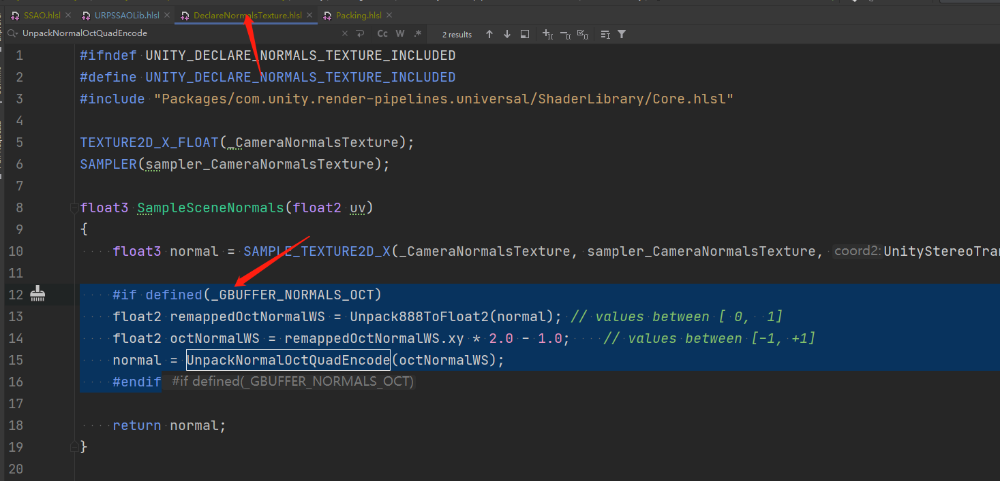

```C++

Shader "MyRP/URPSSAO/ScreenSpaceAmbientOcclusion"
{
	SubShader
	{
		Tags
		{
			"RenderType" = "Opaque" "RenderPipeline" = "UniversalPipeline"
		}
		Cull Off ZWrite Off ZTest Always

		// 0 - Occlusion estimation with CameraDepthTexture
		Pass
		{
			Name "SSAO_Occlusion"

			HLSLPROGRAM
			#pragma vertex VertDefault
			#pragma fragment SSAOFrag
			#pragma multi_compile_fragment _ _GBUFFER_NORMALS_OCT
			#pragma multi_compile_local _SOURCE_DEPTH _SOURCE_DEPTH_NORMALS
			#pragma multi_compile_local _RECONSTRUCT_NORMAL_LOW _RECONSTRUCT_NORMAL_MEDIUM _RECONSTRUCT_NORMAL_HIGH
			#pragma multi_compile_local _ _ORTHOGRAPHIC
			#include "URPSSAOLib.hlsl"
			ENDHLSL
		}
	}
}

```

#### **3.4.2 Depth**

已经有uv了,要获取ViewPos,就需要先获取depth.
返回**URPSSAOLib.hlsl**, 添加方法**float SampleAndGetLinearEyeDepth(float2 uv)**.
正交相机,深度是线性插值.透视相机,是非线性,所以要区分计算.
这里可以直接调用封装好的API来完成.

```C++

...

struct Varyings
{
	...
};

float SampleAndGetLinearEyeDepth(float2 uv)
{
    float rawDepth = SampleSceneDepth(uv.xy);
    #if defined(_ORTHOGRAPHIC)
    return LinearDepthToEyeDepth(rawDepth);
    #else
    return LinearEyeDepth(rawDepth, _ZBufferParams);
    #endif
}

Varyings VertDefault(Attributes input)
{
	...
}

```

#### **3.4.3 ViewPos**

根据上面的原理还需要计算ViewPos. 
这里ViewPos是世界坐标系下, **摄像机位置** 到 **屏幕UV坐标和深度所描述的点** 的向量.
大体的写法是:
ViewPos=(左上角起点+x方向*uv.x+y方向*uv.y)*(depth)
但是还是要区分相机类型, 还要To Screen 的时候注意Y反转.

添加方法**half3 ReconstructViewPos(float2 uv, float depth)**.

```C++


float SampleAndGetLinearEyeDepth(float2 uv)
{
	....
}

// This returns a vector in world unit (not a position), from camera to the given point described by uv screen coordinate and depth (in absolute world unit).
half3 ReconstructViewPos(float2 uv, float depth)
{
    // Screen is y-inverted.
    uv.y = 1.0 - uv.y;

    // view pos in world space
    #if defined(_ORTHOGRAPHIC)
    float zScale = depth * _ProjectionParams.w; // divide by far plane
    float3 viewPos = _CameraViewTopLeftCorner[unity_eyeIndex].xyz
                        + _CameraViewXExtent[unity_eyeIndex].xyz * uv.x
                        + _CameraViewYExtent[unity_eyeIndex].xyz * uv.y
                        + _CameraViewZExtent[unity_eyeIndex].xyz * zScale;
    #else
    float zScale = depth * _ProjectionParams2.x; // divide by near plane
    float3 viewPos = _CameraViewTopLeftCorner[unity_eyeIndex].xyz
        + _CameraViewXExtent[unity_eyeIndex].xyz * uv.x
        + _CameraViewYExtent[unity_eyeIndex].xyz * uv.y;
    viewPos *= zScale;
    #endif

    return half3(viewPos);
}

```

#### **3.4.4 Normal**

还需要再获取Normal.
如果是延迟渲染利用UV和Gbuffer可以直接获取.
如果是前项渲染且勾选了**DepthNormals**, 则会利用物体的**DepthNormal Pass** 去绘制生成Normal图, 传入Shader.
否则就要利用空间坐标去生成重建.


先写利用Normal图获取Normal吧.需要宏**_SOURCE_DEPTH_NORMALS**.
添加方法**void SampleDepthNormalView(float2 uv, out float depth, out half3 normal, out half3 vpos)**

```C++

half3 ReconstructViewPos(float2 uv, float depth)
{
	...
}

void SampleDepthNormalView(float2 uv, out float depth, out half3 normal, out half3 vpos)
{
    #if defined(_SOURCE_DEPTH_NORMALS)
    normal = half3(SampleSceneNormals(uv));
    #endif
}

Varyings VertDefault(Attributes input)
{
	...
}

```

如果没有法线图, 就利用空间坐标重建.
添加方法**half3 ReconstructNormal(float2 uv, float depth, float3 vpos)** , 代码下面再补充.
并且获取depth和viewPos, 然后调用**SampleDepthNormalView**.
注释的两个超链接可以打开看一下, 讲的挺详细的.

```C++

half3 ReconstructViewPos(float2 uv, float depth)
{
	...
}


// Try reconstructing normal accurately from depth buffer.
// Low:    DDX/DDY on the current pixel
// Medium: 3 taps on each direction | x | * | y |
// High:   5 taps on each direction: | z | x | * | y | w |
// https://atyuwen.github.io/posts/normal-reconstruction/
// https://wickedengine.net/2019/09/22/improved-normal-reconstruction-from-depth/
half3 ReconstructNormal(float2 uv, float depth, float3 vpos)
{
	//TODO:
}

void SampleDepthNormalView(float2 uv, out float depth, out half3 normal, out half3 vpos)
{
    depth = SampleAndGetLinearEyeDepth(uv);
    vpos = ReconstructViewPos(uv, depth);

    #if defined(_SOURCE_DEPTH_NORMALS)
    normal = half3(SampleSceneNormals(uv));
    #else
    normal = ReconstructNormal(uv, depth, vpos);
    #endif
}

```

补充完善**ReconstructNormal**方法.

分三个质量 **Low**, **Medium**, **High**, 大体效果如下图.

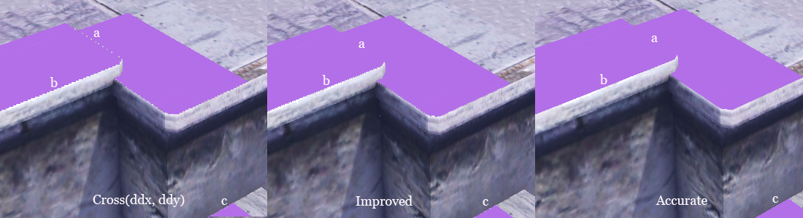

先写**_RECONSTRUCT_NORMAL_LOW**, 可以直接用cross(ddx, ddy), 进行重建.

```C++

half3 ReconstructNormal(float2 uv, float depth, float3 vpos)
{
    #if defined(_RECONSTRUCT_NORMAL_LOW)
        return half3(normalize(cross(ddy(vpos), ddx(vpos))));
    #else
        //TODO:
    #endif
}

```

再写 **Medium**.
选择上下方向中深度较大的一个方向, 左右方向中深度较大的方向, 分别生成VerViewPos和HorViewPos. 然后cross(VerViewPos - ViewPos, HorViewPos - ViewPos) 就是法线了. 具体效果如下图.

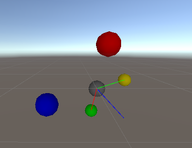

注意, URP版本**delta**是 *2.0, 我这里改成 *1.0. 因为发现效果会好一点, 不知道为什么他这里写 *2.0. 下面图一是 *2.0, 图二是 *2.0, 看龙珠那边的瑕疵.

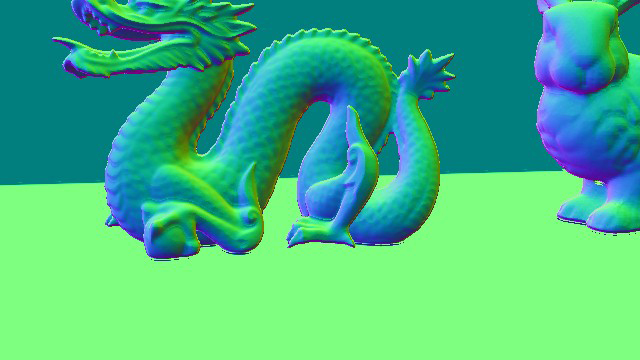
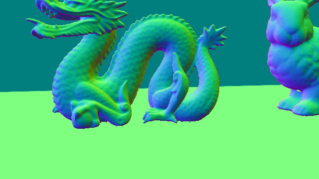


```C++

half3 ReconstructNormal(float2 uv, float depth, float3 vpos)
{
    #if defined(_RECONSTRUCT_NORMAL_LOW)
        ...
    #else
        //原来是*2.0  我这里改成*1.0
        float2 delta = float2(_SourceSize.zw * 1.0);

        // Sample the neighbour fragments
        float2 lUV = float2(-delta.x, 0.0);
        float2 rUV = float2(delta.x, 0.0);
        float2 uUV = float2(0.0, delta.y);
        float2 dUV = float2(0.0, -delta.y);

        float3 l1 = float3(uv + lUV, 0.0);
        l1.z = SampleAndGetLinearEyeDepth(l1.xy); // Left1
        float3 r1 = float3(uv + rUV, 0.0);
        r1.z = SampleAndGetLinearEyeDepth(r1.xy); // Right1
        float3 u1 = float3(uv + uUV, 0.0);
        u1.z = SampleAndGetLinearEyeDepth(u1.xy); // Up1
        float3 d1 = float3(uv + dUV, 0.0);
        d1.z = SampleAndGetLinearEyeDepth(d1.xy); // Down1

        // Determine the closest horizontal and vertical pixels...
        // horizontal: left = 0.0 right = 1.0
        // vertical  : down = 0.0    up = 1.0
        #if defined(_RECONSTRUCT_NORMAL_MEDIUM)
            const uint closest_horizontal = l1.z > r1.z ? 0 : 1;
            const uint closest_vertical   = d1.z > u1.z ? 0 : 1;
        #else
            //TODO:
        #endif


        // Calculate the triangle, in a counter-clockwize order, to
        // use based on the closest horizontal and vertical depths.
        // h == 0.0 && v == 0.0: p1 = left,  p2 = down
        // h == 1.0 && v == 0.0: p1 = down,  p2 = right
        // h == 1.0 && v == 1.0: p1 = right, p2 = up
        // h == 0.0 && v == 1.0: p1 = up,    p2 = left
        // Calculate the view space positions for the three points...
        float3 P1;
        float3 P2;
        if (closest_vertical == 0)
        {
            P1 = closest_horizontal == 0 ? l1 : d1;
            P2 = closest_horizontal == 0 ? d1 : r1;
        }
        else
        {
            P1 = closest_horizontal == 0 ? u1 : r1;
            P2 = closest_horizontal == 0 ? l1 : u1;
        }

        // Use the cross product to calculate the normal...
        return half3(normalize(cross(ReconstructViewPos(P2.xy, P2.z) - vpos, ReconstructViewPos(P1.xy, P1.z) - vpos)));
    #endif
}

```

再写 **High**. 它需要在 **Medium** 中继续改写.
修改查找方向的公式为 离中心点深度最平缓的左右方向和上下方向.
如下图:
左边=abs((l1-l2)+(l1-p0)) , 右边=abs((r1-r2)+(r1-p0))
因为左边<右边, 所以认为左边平缓,采用左边重建, 上下同理.

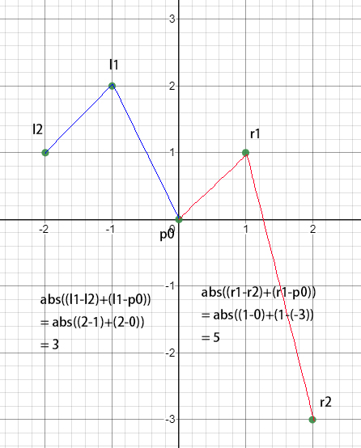

```C++

half3 ReconstructNormal(float2 uv, float depth, float3 vpos)
{
    #if defined(_RECONSTRUCT_NORMAL_LOW)
        ...
    #else
        ...

        // Determine the closest horizontal and vertical pixels...
        // horizontal: left = 0.0 right = 1.0
        // vertical  : down = 0.0    up = 1.0
        #if defined(_RECONSTRUCT_NORMAL_MEDIUM)
            const uint closest_horizontal = l1.z > r1.z ? 0 : 1;
            const uint closest_vertical   = d1.z > u1.z ? 0 : 1;
        #else
            float3 l2 = float3(uv + lUV * 2.0, 0.0);
            l2.z = SampleAndGetLinearEyeDepth(l2.xy); // Left2
            float3 r2 = float3(uv + rUV * 2.0, 0.0);
            r2.z = SampleAndGetLinearEyeDepth(r2.xy); // Right2
            float3 u2 = float3(uv + uUV * 2.0, 0.0);
            u2.z = SampleAndGetLinearEyeDepth(u2.xy); // Up2
            float3 d2 = float3(uv + dUV * 2.0, 0.0);
            d2.z = SampleAndGetLinearEyeDepth(d2.xy); // Down2

            const uint closest_horizontal = abs((2.0 * l1.z - l2.z) - depth) < abs((2.0 * r1.z - r2.z) - depth) ? 0 : 1;
            const uint closest_vertical = abs((2.0 * d1.z - d2.z) - depth) < abs((2.0 * u1.z - u2.z) - depth) ? 0 : 1;
        #endif


        ...
    #endif
}

```

然后可以对比一下Normal的差别.
这里注意 **Deferred** 的 **Normal** 已经是 **[-1, 1]** 的了, 还有这边的 **delta**是 *1.0 的.
龙身体原来就是有凸起的瑕疵.

顺序分别是 **Normal**, **Low**, **Medium**, **High**.

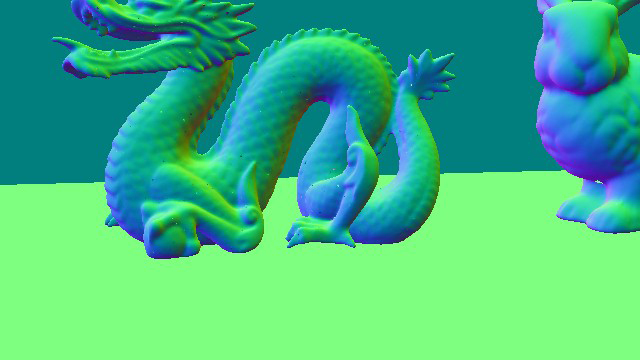
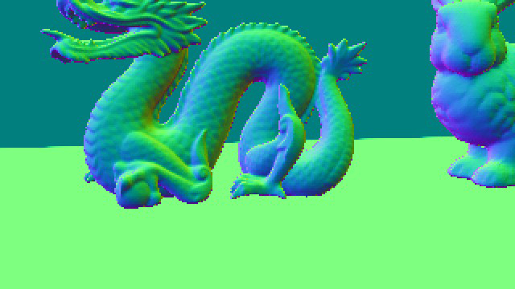
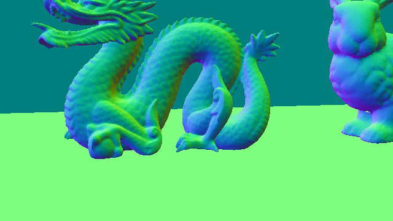


#### **3.4.5 SampleRandomDirection**

有了当前点的信息, 然后再在当前点的沿法线半球进行多次随机采样获取多个点, 再和当前点比较生成AO.

那么就要先写一个获取随机方向的办法.
添加方法**half3 PickSamplePoint(float2 uv, int sampleIndex)**和相关的方法. 
这里利用出之前的随机数组和随机函数生成是一个整球的随机方向.

**InterleavedGradientNoise**方法在SRP内置的**Random.hlsl**.

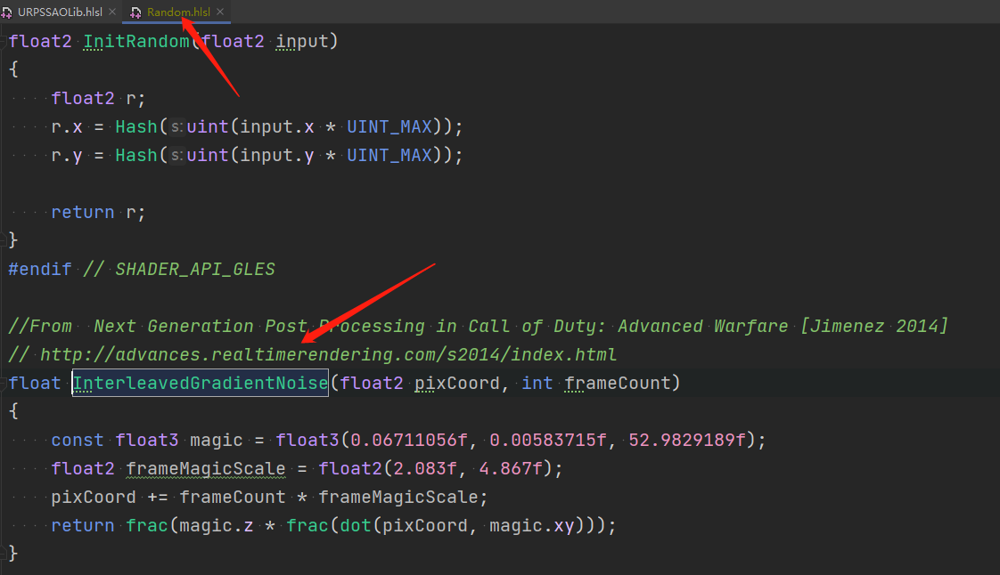

```C++

void SampleDepthNormalView(float2 uv, out float depth, out half3 normal, out half3 vpos)
{
	...
}


// Trigonometric function utility
half2 CosSin(half theta)
{
    half sn, cs;
    sincos(theta, sn, cs);
    return half2(cs, sn);
}

// Pseudo random number generator with 2D coordinates
half GetRandomUVForSSAO(float u, int sampleIndex)
{
    return SSAORandomUV[u * 20 + sampleIndex];
}

float2 GetScreenSpacePosition(float2 uv)
{
    return float2(uv * SCREEN_PARAMS.xy * DOWNSAMPLE);
}

// Sample point picker
half3 PickSamplePoint(float2 uv, int sampleIndex)
{
    const float2 positionSS = GetScreenSpacePosition(uv);
    const half gn = half(InterleavedGradientNoise(positionSS, sampleIndex));

    const half u = frac(GetRandomUVForSSAO(half(0.0), sampleIndex) + gn) * half(2.0) - half(1.0);
    const half theta = (GetRandomUVForSSAO(half(1.0), sampleIndex) + gn) * half(TWO_PI);

    return half3(CosSin(theta) * sqrt(half(1.0) - u * u), u);
}

Varyings VertDefault(Attributes input)
{
	...
}

```

#### **3.4.6 SSAOFrag**

接着就可以写Fragment Shader, 创建方法 **half4 SSAOFrag(Varyings input)**.
把之前写的获取Depth, Normal, View Position先加进去.

```C++

...

Varyings VertDefault(Attributes input)
{
	...
}

// Distance-based AO estimator based on Morgan 2011
// "Alchemy screen-space ambient obscurance algorithm"
// http://graphics.cs.williams.edu/papers/AlchemyHPG11/
half4 SSAOFrag(Varyings input) : SV_Target
{
    UNITY_SETUP_STEREO_EYE_INDEX_POST_VERTEX(input);
    float2 uv = input.uv;

    // Parameters used in coordinate conversion
    half3x3 camTransform = (half3x3)_CameraViewProjections[unity_eyeIndex]; // camera viewProjection matrix

    // Get the depth, normal and view position for this fragment
    float depth_o;
    half3 norm_o;
    half3 vpos_o;
    SampleDepthNormalView(uv, depth_o, norm_o, vpos_o);

	//TODO:
}

```

然后就要For循环获得随机采样点.
先获取随机方向, 根据循环索引确定长度, 从而确定点的位置. 
因为要沿着法线正方向, 所以利用**faceforward**方法确保如果在反面也翻转到正面.
最后随机采样点的位置=当前像素点位置+随机偏移方向.

//MyTODO:faceforward 取巧

```C++

...

half4 SSAOFrag(Varyings input) : SV_Target
{
	...
    SampleDepthNormalView(uv, depth_o, norm_o, vpos_o);

    // This was added to avoid a NVIDIA driver issue.
    const half rcpSampleCount = half(rcp(SAMPLE_COUNT));
    half ao = 0.0;
    for (int s = 0; s < SAMPLE_COUNT; s++)
    {
        // Sample point
        half3 v_s1 = PickSamplePoint(uv, s);

        // Make it distributed between [0, _Radius]
        v_s1 *= sqrt((half(s) + half(1.0)) * rcpSampleCount) * RADIUS;

        //-n sign(dot(i, ng)).   确保跟normal一个方向
        v_s1 = faceforward(v_s1, -norm_o, v_s1);

        half3 vpos_s1 = vpos_o + v_s1;

		//TODO:
    }
}

```

有了这个随机点之后, 利用它在所在Project Space的UV位置, 配合深度图获取这个位置最靠前的点信息. 然后进行比较. 

所以就要先把这个View Space的点转换到Project Space 获得UV, 再采样深度图, 获得depth. 在用之前写的**ReconstructViewPos(uv, depth)**方法, 获得靠前的点信息.

在获取点所在屏幕UV位置的时候有点不一样. 这里camTransform(VP Martix)是3x3的, 而且如果就算是4x4计算到的结果还要除以w. 所以这里为了减少计算量, 就用了另外一种方法等比变化.
因为**透视相机**的点在屏幕空间的UV坐标是会根据深度变化从而进行等比变化, 但是正交相机则不会, 所以还要区分开来写.

```C++

...

half4 SSAOFrag(Varyings input) : SV_Target
{
	...
    for (int s = 0; s < SAMPLE_COUNT; s++)
    {
		...

        half3 vpos_s1 = vpos_o + v_s1;

        half3 spos_s1 = mul(camTransform, vpos_s1);

        #if defined(_ORTHOGRAPHIC)
            float2 uv_s1_01 = clamp((spos_s1.xy + float(1.0)) * float(0.5), float(0.0), float(1.0));
        #else
            float zdist = -dot(UNITY_MATRIX_V[2].xyz, vpos_s1);
            float2 uv_s1_01 = clamp((spos_s1.xy * rcp(zdist) + float(1.0)) * float(0.5), float(0.0), float(1.0));
        #endif

        // Depth at the sample point
        float depth_s1 = SampleAndGetLinearEyeDepth(uv_s1_01);

        // Relative position of the sample point
        half3 vpos_s2 = ReconstructViewPos(uv_s1_01, depth_s1);

		//TODO:
    }
}

```

有了正确的随机采样点的View Space信息. 就可以和原点进行比较, 得到AO值.
设 矢量D=随机点-原点.
D和法线夹角越小, AO强度越大. 如果在背面(dot产生负数), 则不产生AO. 
原点离我们摄像机越远, AO也会衰减. 
如果D的长度越长, 既两点距离越远, AO也会变弱.

```C++

...

half4 SSAOFrag(Varyings input) : SV_Target
{
	...
    for (int s = 0; s < SAMPLE_COUNT; s++)
    {
		...

        // Relative position of the sample point
        half3 vpos_s2 = ReconstructViewPos(uv_s1_01, depth_s1);

        half3 v_s2 = vpos_s2 - vpos_o;
        // Estimate the obscurance value
        half dotVal = dot(v_s2, norm_o);
        #if defined(_ORTHOGRAPHIC)
            dotVal -= half(2.0 * kBeta * depth_o);
        #else
            dotVal -= half(kBeta * depth_o);
        #endif

        half a1 = max(dotVal, half(0.0));
        half a2 = dot(v_s2, v_s2) + kEpsilon;
        ao += a1 * rcp(a2);
    }

	//TODO:
}

```

然后这里得到的AO值是累积的, 需要平均正常化.
正常的是: ao = (ao累加值/数量)*强度
这里为了效果可能是添加了一点魔法吧233333. 具体我也不知道.
可以输出看看AO效果.

```C++

...

half4 SSAOFrag(Varyings input) : SV_Target
{
	...
    for (int s = 0; s < SAMPLE_COUNT; s++)
    {
		...
    }

    // Intensity normalization
    ao *= RADIUS;

    // Apply contrast
    ao = PositivePow(ao * INTENSITY * rcpSampleCount, kContrast);

    return ao;
}

```

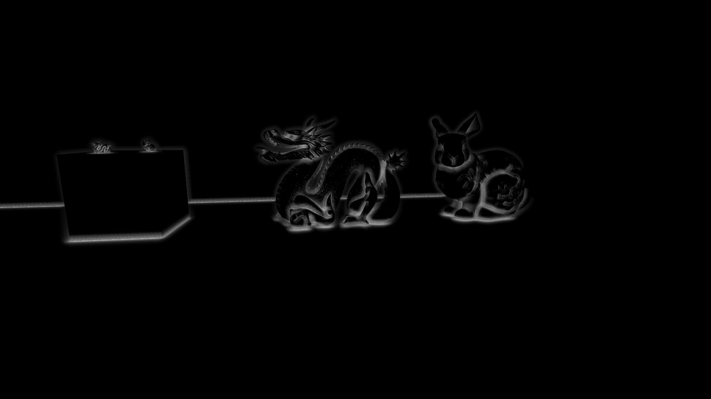


#### **3.4.7 PackAONormal**

最后因为后面的Pass还需要用到Normal, 所以需要把ao和normal 进行pack一下, 然后进行输出.
r:ao    gba:normal*0.5+0.5
添加三个新方法, 并且修改**half4 SSAOFrag(Varyings input)**的输出.
**half4 PackAONormal(half ao, half3 n)** , pack ao和normal
**half3 GetPackedNormal(half4 p)** , unpack normal
**half GetPackedAO(half4 p)** , 获取ao

```C++

...

struct Varyings
{
	...
};

half4 PackAONormal(half ao, half3 n)
{
    return half4(ao, n * half(0.5) + half(0.5));
}

half3 GetPackedNormal(half4 p)
{
    return p.gba * half(2.0) - half(1.0);
}

half GetPackedAO(half4 p)
{
    return p.r;
}

float SampleAndGetLinearEyeDepth(float2 uv)
{
	...
}

...

half4 SSAOFrag(Varyings input) : SV_Target
{
	...

    // Apply contrast
    ao = PositivePow(ao * INTENSITY * rcpSampleCount, kContrast);
    return PackAONormal(ao, norm_o);
}
```

### **3.5 SSAO_HorizontalBlur**

看上面的AO图, 可以知道这时候得到的AO结果非常的粗糙,充满颗粒感,不平滑. 所以需要blur进行处理一下. 这里的模糊用高效高斯模糊, 即分别用横(Horizontal)方向和竖(Vertical)方向进行处理.

#### **3.5.1 Pass**

返回**ScreenSpaceAmbientOcclusion.shader**中再添加一个Pass **SSAO_HorizontalBlur**.
**BLUR_SAMPLE_CENTER_NORMAL** , 用于重建normal,后面细讲.
之后的变体, 上面都讲过.

```C++

Shader "MyRP/URPSSAO/ScreenSpaceAmbientOcclusion"
{
	SubShader
	{
		...

		// 0 - Occlusion estimation with CameraDepthTexture
		Pass
		{
			...
		}

		// 1 - Horizontal Blur
		Pass
		{
			Name "SSAO_HorizontalBlur"

			HLSLPROGRAM
			#pragma vertex VertDefault
			#pragma fragment HorizontalBlur
			#define BLUR_SAMPLE_CENTER_NORMAL
			#pragma multi_compile_local _ _ORTHOGRAPHIC
			#pragma multi_compile_fragment _ _GBUFFER_NORMALS_OCT
			#pragma multi_compile_local _SOURCE_DEPTH _SOURCE_DEPTH_NORMALS
			#include "URPSSAOLib.hlsl"
			ENDHLSL
		}
	}
}

```

#### **3.5.2 Blur**

在写Frag之前, 先写相关方法.
在**URPSSAOLib.hlsl**中添加一个模糊方法**half4 Blur(float2 uv, float2 delta)**.

那些魔法数字, 具体参考这篇 [基于线性采样的高效高斯模糊实现（译）](https://zhuanlan.zhihu.com/p/58182228), 理解偏移和权重, 作用是提高效率, 这里就不多说了.

**SAMPLE_BASEMAP**是之前定义的宏,对_BaseMap进行采样.

但是这里有点无法理解! Unity为什么要利用宏**BLUR_SAMPLE_CENTER_NORMAL** 开启对当前点重建Normal, 上面不都重建好并且储存了!? 不过关系不大 还是照抄吧, 因为我们的Normal图是提前准备好的.(怀疑不是一个人写的既视感)
所以还要添加方法**half3 SampleNormal(float2 uv)**, 大体和**SampleDepthNormalView**方法相似.

```C++

...

half3 ReconstructNormal(float2 uv, float depth, float3 vpos)
{
	...
}

// For when we don't need to output the depth or view position
// Used in the blur passes
half3 SampleNormal(float2 uv)
{
    #if defined(_SOURCE_DEPTH_NORMALS)
        return half3(SampleSceneNormals(uv));
    #else
        float depth = SampleAndGetLinearEyeDepth(uv);
        half3 vpos = ReconstructViewPos(uv, depth);
        return ReconstructNormal(uv, depth, vpos);
    #endif
}

void SampleDepthNormalView(float2 uv, out float depth, out half3 normal, out half3 vpos)
{
	...
}

...

// Geometry-aware separable bilateral filter
half4 Blur(float2 uv, float2 delta) 
{
    half4 p0 =  (half4) SAMPLE_BASEMAP(uv                 );
    half4 p1a = (half4) SAMPLE_BASEMAP(uv - delta * 1.3846153846);
    half4 p1b = (half4) SAMPLE_BASEMAP(uv + delta * 1.3846153846);
    half4 p2a = (half4) SAMPLE_BASEMAP(uv - delta * 3.2307692308);
    half4 p2b = (half4) SAMPLE_BASEMAP(uv + delta * 3.2307692308);

    #if defined(BLUR_SAMPLE_CENTER_NORMAL)
        #if defined(_SOURCE_DEPTH_NORMALS)
            half3 n0 = half3(SampleSceneNormals(uv));
        #else
            half3 n0 = SampleNormal(uv);
        #endif
    #else
        half3 n0 = GetPackedNormal(p0);
    #endif

    //TODO:
}

```

本来是AO*权重就好了. 不过URP这里加了一个法线的比较. 如果周围点的法线和当前点的法线偏离过大, 则AO再适当减弱.

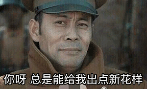

添加方法**half CompareNormal(half3 d1, half3 d2)**, 用于比较当前点的法线和周围法线 从而得到AO的适当衰减, **kGeometryCoeff** 之前定义为 0.8.

然后把ao * 权重 * 法线比较衰减, 就好了.


```C++

...

half GetPackedAO(half4 p)
	...
}

half CompareNormal(half3 d1, half3 d2)
{
    return smoothstep(kGeometryCoeff, half(1.0), dot(d1, d2));
}

float SampleAndGetLinearEyeDepth(float2 uv)
{
	...
}

...

// Geometry-aware separable bilateral filter
half4 Blur(float2 uv, float2 delta) 
{
    ...

    #if defined(BLUR_SAMPLE_CENTER_NORMAL)
		...
    #endif


    half w0  =                                           half(0.2270270270);
    half w1a = CompareNormal(n0, GetPackedNormal(p1a)) * half(0.3162162162);
    half w1b = CompareNormal(n0, GetPackedNormal(p1b)) * half(0.3162162162);
    half w2a = CompareNormal(n0, GetPackedNormal(p2a)) * half(0.0702702703);
    half w2b = CompareNormal(n0, GetPackedNormal(p2b)) * half(0.0702702703);

    half s = half(0.0);
    s += GetPackedAO(p0)  * w0;
    s += GetPackedAO(p1a) * w1a;
    s += GetPackedAO(p1b) * w1b;
    s += GetPackedAO(p2a) * w2a;
    s += GetPackedAO(p2b) * w2b;
    s *= rcp(w0 + w1a + w1b + w2a + w2b);

    return PackAONormal(s, n0);
}

```

#### **3.5.3 HorizontalBlur**

然后写FragPass. 添加Pass **half4 HorizontalBlur(Varyings input)**
只用把当前uv和delta传进**Blur**方法就好了.

```C++

...

half4 SSAOFrag(Varyings input) : SV_Target
{
	...
}

half4 HorizontalBlur(Varyings input) : SV_Target
{
    UNITY_SETUP_STEREO_EYE_INDEX_POST_VERTEX(input);

    const float2 uv = input.uv;
    const float2 delta = float2(_SourceSize.z, 0.0);
    return Blur(uv, delta);
}

```


### **3.6 SSAO_VerticalBlur**

有了横向模糊, 还要继续纵向模糊一下.

#### **3.5.1 Pass**

返回**ScreenSpaceAmbientOcclusion.shader**中再添加一个Pass **SSAO_VerticalBlur**.

```C++

Shader "MyRP/URPSSAO/ScreenSpaceAmbientOcclusion"
{
	SubShader
	{
		...

		// 0 - Occlusion estimation with CameraDepthTexture
		Pass
		{
			...
		}

		// 1 - Horizontal Blur
		Pass
		{
			...
		}

		// 2 - Vertical Blur
		Pass
		{
			Name "SSAO_VerticalBlur"

			HLSLPROGRAM
				#pragma vertex VertDefault
				#pragma fragment VerticalBlur
				#include "URPSSAOLib.hlsl"
			ENDHLSL
		}
	}
}

```

#### **3.5.2 VerticalBlur**

因为**Blur**方法在横向模糊的时候已经写好了. 这里只用再写Fragment Shader就好了, 方向是竖着的.
因为存在**DOWNSAMPLE**, 所以还是要注意一下delta的值.
+ 比如Screen RT是1920*1080. 
+ Pass1RT 启用**DOWNSAMPLE**为960x540. 
+ Pass2 RT恢复为1920*1080 . 因为引用Pass1RT, 所以delta为1/(960x540) . 
+ Pass3 RT也为1920*1080. 引用Pass2, delta为1/(1920x1080). 这显然是错的, 因为这个时候rt已经Resize过了, 颜色Bilinear重新生成过. 我们需要采样Resize前的颜色点. 所以delta 应该是 1/(960|540). 

```C++

half4 HorizontalBlur(Varyings input) : SV_Target
{
    UNITY_SETUP_STEREO_EYE_INDEX_POST_VERTEX(input);

    const float2 uv = input.uv;
    const float2 delta = float2(_SourceSize.z, 0.0);
    return Blur(uv, delta);
}

half4 VerticalBlur(Varyings input) : SV_Target
{
    UNITY_SETUP_STEREO_EYE_INDEX_POST_VERTEX(input);

    const float2 uv = input.uv;
    const float2 delta = float2(0.0, _SourceSize.w * rcp(DOWNSAMPLE));
    return Blur(uv, delta);
}

```

可以看看Blur之后的效果. 下面分别是: 没有Blur, HorizontalBlur, VerticalBlur. 显然效果好了很多.

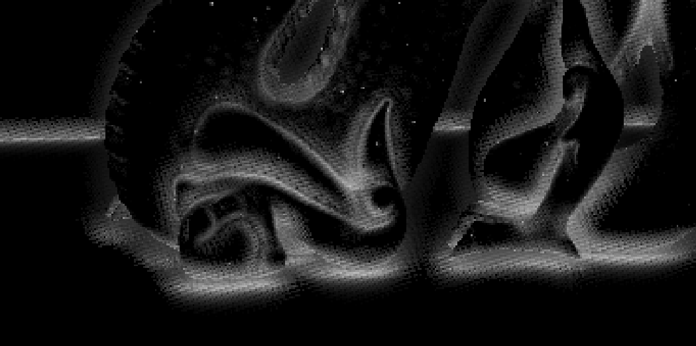
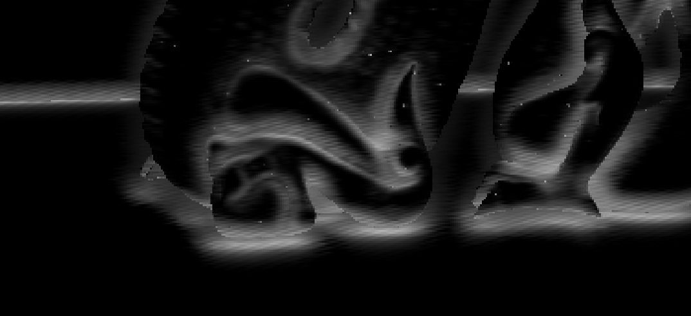
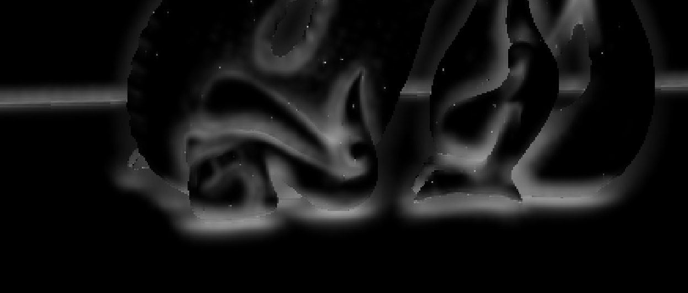


### **3.7 SSAO_FinalBlur**

URP还有最后一次对角Blur, 然后OneMinus输出.

#### **3.5.1 Pass**

返回**ScreenSpaceAmbientOcclusion.shader**中再添加一个Pass **SSAO_VerticalBlur**.