写写GTVBAO
======

(Github正常排版: [写写GTVBAO][1])

项目地址: [MyGTVBAO](https://github.com/HHHHHHHHHHHHHHHHHHHHHCS/MyGTVBAO)

-----------------

<!-- @import "[TOC]" {cmd="toc" depthFrom=1 depthTo=6 orderedList=false} -->

<!-- code_chunk_output -->

- [**0. 起因**](#0-起因)
- [**1. 原理**](#1-原理)
  - [**1.1 从Horizon到Bitmask**](#11-从horizon到bitmask)
  - [**1.2 有限厚度**](#12-有限厚度)
  - [**1.3 当前Demo的近似**](#13-当前demo的近似)
- [**2. C#**](#2-c)
  - [**2.1 RenderSettings**](#21-rendersettings)
  - [**2.2 RenderFeature**](#22-renderfeature)
  - [**2.3 RenderGraph和RT**](#23-rendergraph和rt)
  - [**2.4 参数传递**](#24-参数传递)
  - [**2.5 ComputePass**](#25-computepass)
- [**3. AOShader**](#3-aoshader)
  - [**3.1 Compute入口**](#31-compute入口)
  - [**3.2 数据准备**](#32-数据准备)
  - [**3.3 采样半径和随机值**](#33-采样半径和随机值)
  - [**3.4 循环采样**](#34-循环采样)
  - [**3.5 Thickness和角度**](#35-thickness和角度)
  - [**3.6 VisibilityBitmask**](#36-visibilitybitmask)
  - [**3.7 输出AO**](#37-输出ao)
- [**4. Blur**](#4-blur)
  - [**4.1 groupshared**](#41-groupshared)
  - [**4.2 双边权重**](#42-双边权重)
- [**5. Temporal**](#5-temporal)
  - [**5.1 History**](#51-history)
  - [**5.2 重投影和深度判断**](#52-重投影和深度判断)
  - [**5.3 NeighborhoodClamp**](#53-neighborhoodclamp)
- [**6. Combine**](#6-combine)
  - [**6.1 半分辨率上采样**](#61-半分辨率上采样)
  - [**6.2 合成和Debug**](#62-合成和debug)
- [**7. 其它**](#7-其它)
- [**8. 实测**](#8-实测)
  - [**8.1 效果对比**](#81-效果对比)
  - [**8.2 性能对比**](#82-性能对比)

<!-- /code_chunk_output -->

-----------------

## **0. 起因**

&emsp;&emsp; 之前写过[URP的SSAO](URP的SSAO.md), [HBAO](写写简单的HBAO.md), 还有[CapsuleAO](写轮眼个CapsuleAO.md). AO这个坑还能继续挖, 这次看看GTVBAO.

其实还是因为遇到节假日, No heart work!!! 所以配合AI 学习一下, 水一篇. 过节我将猛蹬, 毕竟送了好多重置卡!!!

之前HBAO那篇最后说, 可以用Compute Shader和groupshared做优化, 再来个半分辨率. 这次Demo里面都有了, 顺便还加上了Temporal. 属于是把之前画的饼补一下2333.

先说清楚, 本文沿用Demo的 **GTVBAO** 命名, 讲的是当前项目中这套有限厚度和Visibility Bitmask的实现. 原理参考可以看论文 [Screen Space Indirect Lighting with Visibility Bitmask][2], 以及作者的[实现说明][3]. 不把Demo的近似代码直接等同于论文的完整实现.

下面代码以拆解为主, 省略号表示省略已有内容, 不是每个代码块都能单独复制成一个完整文件.

先放同一个机位的对比图.

先关掉GTVBAO. 看方块底部, 龙的脚底, 还有墙和地板的连接处.

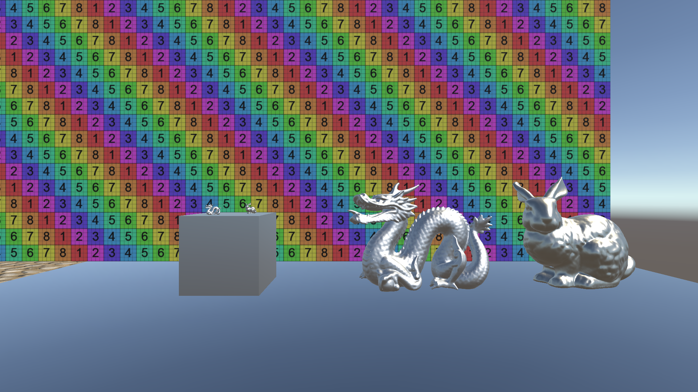

再打开. 接触的位置补上了一层暗部, 方块终于没有那么像飘着的了. 好, 很有精神!

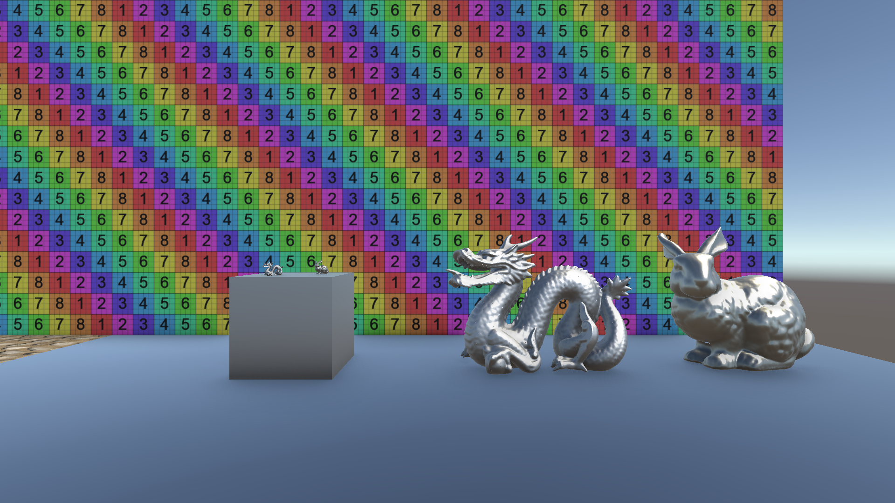

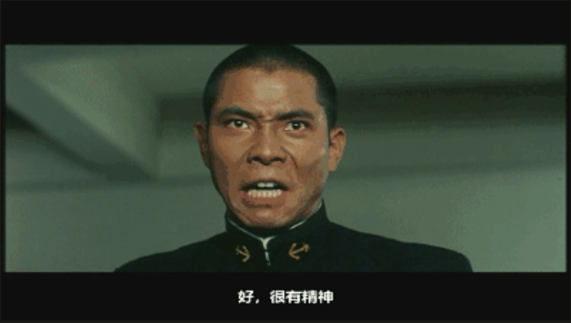

下面还会放Raw AO, Blur和Thickness的对比. 最后还有 **GTVBAO** / **我写的GTAO** / **URP SSAO** 的效果和性能对比放在最后的实测里.

-----------------

## **1. 原理**

### **1.1 从Horizon到Bitmask**

&emsp;&emsp; 先回忆之前的HBAO, 沿屏幕方向采样深度, 反算位置, 找到遮挡的Horizon Angle, 再得到AO.

可以想象自己站在地面上往周围看, 周围的东西越高, 能看到的天空越少. 但如果面前是一块悬空的薄板, 板下面其实还有空隙. 只记录地平线边界, 就不容易把这些分离的空隙表示出来.

Visibility Bitmask的想法是, 把角度范围分成很多小格子, 每一格记录是否被挡住. 这样就可以表示“这里挡住, 中间通了, 后面又挡住”. 作者用它替换切片上的两个Horizon角度, 并用固定厚度近似表面背后的位置. [原理出处][2]

先用8格举个例子, 这里只是说明位操作, 实际Demo用的是32格. 从左到右表示bit 7到bit 0.

```text
初始可见性:   11111111
遮挡bit 2到4:  11100011
再挡bit 4到5:  11000011
```

这里 **1表示可见, 0表示被遮挡**. 两个遮挡重叠的bit 4, 不会重复扣两次. 同一格已经被挡住, 再来一个物体也不能收第二遍遮挡费.

最后剩下4个1, 可见比例就是4/8. 思路很直接, 甚至最后可以用一条 **countbits** 统计, 对味了.

注意还有另一种记法: 1表示被遮挡, 初始mask为0, 最后用1减去遮挡比例. 作者示例就是这种记法. 当前Demo反过来记录可见性, 看代码的时候别把黑白弄反.

### **1.2 有限厚度**

深度图只告诉我们相机看到的最前面一层表面, 不会顺便告诉我们物体后面在哪里. 所以这里人为给它一个厚度. Depth只交了正面证件照, 背面尺寸只好先靠估.

当前Demo的做法是:

```C++

float thickness = radius * _GTVBAOThickness;
float3 toBack = samplePosition - viewDirection * thickness - center;

```

**center**: 当前像素反算出来的世界坐标, 记为P.

**samplePosition**: 采样点的世界坐标, 记为S.

**viewDirection**: 从P指向相机的方向V.

于是近似背面的位置就是 **B = S - V * thickness**. 因为V朝向相机, 减去V就是往远离相机的方向推.

注意这是沿当前点视线方向的近似厚度, 不是沿采样点法线挤出, 更不是读到了真实背面Depth.

接着看P指向S和B的两个方向, 把它们转换成角度, 中间的区间就认为被遮挡了. 这样有限厚度只占一段角度, 不需要把后面的所有方向都一起涂黑.

### **1.3 当前Demo的近似**

这里提前说一下, 不然后面看见 **acos(dot(normal, direction))** 容易误会.

作者的实现会建立切片平面, 把法线投影到切片, 并保留左右方向的有符号角度. [实现说明][3]

当前Demo没有完整照搬这一段. 它直接使用世界法线和采样方向的夹角, 映射到 **0到PI/2** 的32格, 并让正反两个采样方向共用一个mask.

因此它丢掉了左右角度的符号. 两边不同的遮挡, 如果恰好落在相同的角度格子, 会被合并. 后面 **countbits / 32** 也是等权计数, 没有做完整的余弦加权积分.

所以这里把它理解成 **有限厚度 + 角度量化 + bitmask合并遮挡** 的学习实现就好. 想继续往论文实现靠, 需要补上切片坐标和有符号角度的映射, 不能只把采样次数调高就算完成.

另外AO表达的是遮挡/可见性, 当前Demo没有采样场景颜色做间接光反弹, 也没有多次弹射补偿. 名字里带GT, 不代表输出就是真实场景的Ground Truth.

-----------------

## **2. C#**

&emsp;&emsp; 个人习惯, 还是先看C#.

### **2.1 RenderSettings**

参数都在 **GTVBAORenderSettings**. 先把Demo Renderer里面保存的值列一下, 后面遇到Shader变量就容易对上.

| 参数 | 当前值 | 用途 |
| --- | --- | --- |
| radius | 1 | 世界空间采样半径, Unity世界单位 |
| intensity | 1 | 遮挡强度 |
| bias | 0.1 | 法线与采样方向点积的阈值 |
| quality | 2 | 方向数和步进数 |
| maxPixelRadius | 100 | 最大屏幕采样半径, 单位为完整分辨率像素 |
| thickness | 0.3 | 厚度系数, 实际厚度为radius乘它 |
| halfResolution | false | AO宽高是否减半 |
| distanceFadeStart / End | 150 / 300 | 根据当前点Eye Depth淡出 |
| blur | true | 双边模糊 |
| depthSharpness / normalSharpness | 16 / 8 | Blur的深度和法线权重 |
| temporalAccumulation | true | 请求时域累积 |
| temporalBlend | 0.95 | 历史权重, 还会根据运动量减小 |
| historyDepthThreshold | 0.02 | 重投影后的相对深度容差 |
| debugMode | Composite | 输出模式 |
| showInSceneView | true | Scene窗口也显示效果 |

这里 **bias不是角度的弧度值**, 也不是世界空间偏移. 它直接与 **dot(normal, sampleDirection)** 比较, 后面会看到.

### **2.2 RenderFeature**

**Create()** 创建Pass, 渲染时机是 **BeforeRenderingPostProcessing**.

```CSharp

public override void Create()
{
	renderPass?.OnDestroy();
	renderPass = new GTVBAORenderPass
	{
		renderPassEvent = RenderPassEvent.BeforeRenderingPostProcessing
	};
}

```

**AddRenderPasses()** 里面先检查Shader和Compute支持, 再筛选相机. 当前Demo只处理非XR的Base Game/Scene相机, Overlay和其它类型会跳过.

接着配置输入.

```CSharp

bool temporal = settings.temporalAccumulation
	&& Application.isPlaying
	&& camera.cameraType == CameraType.Game;

renderPass.OnInit(effectMat, computeShader, settings, temporal);
renderPass.ConfigureInput(ScriptableRenderPassInput.Depth
	| ScriptableRenderPassInput.Normal
	| (temporal ? ScriptableRenderPassInput.Motion : ScriptableRenderPassInput.None));
renderer.EnqueuePass(renderPass);

```

Depth用来反算位置, Normal用来判断遮挡方向和Blur权重, Motion用来找上一帧对应的位置.

**勾上Temporal不代表Scene窗口也在累积.** 这里要求Play模式下的Game相机, RenderGraph里面还要确认Motion Texture有效才真正启用.

### **2.3 RenderGraph和RT**

这次用的是 **RecordRenderGraph()**, 不走以前GetTemporaryRT那套流程.

先画一下数据怎么走:

```text
Depth + Normal
      |
      v
 Main Compute ---> Raw AO
                      |
                 Bilateral X  (可选)
                      |
                 Bilateral Y  (可选)
                      |
History + Motion --> Temporal (可选) ---> 本帧History
                      |
Scene Color ------> Composite ---> cameraColor
```

AO贴图用 **R32G32_SFloat**. R记录可见性, G记录线性Eye Depth. 后面的Blur, Temporal和半分辨率上采样都需要这个深度.

```CSharp

int divisor = settings.halfResolution ? 2 : 1;
aoDesc.width = Mathf.Max(1, (fullDesc.width + divisor - 1) / divisor);
aoDesc.height = Mathf.Max(1, (fullDesc.height + divisor - 1) / divisor);
aoDesc.graphicsFormat = GraphicsFormat.R32G32_SFloat;

var computeDesc = aoDesc;
computeDesc.enableRandomWrite = true;

```

半分辨率是宽高都除2, 像素数量约为1/4. 这里用向上取整, 比如宽度1919会得到960, 不直接丢掉最后一列.

Main和Blur由Compute写入, 所以对应RT要开RandomWrite. History由光栅Pass写入, 不需要为了这个流程给它开UAV.

写的时候还发现了一个神奇的属性. Pass构造函数里设置了 **requiresIntermediateTexture = true**. 它是在告诉URP: 别直接往BackBuffer上画, 我还要拿当前画面做后处理呢, 先留在中间RT里, 处理完再输出到BackBuffer. 如果其它后处理已经让URP用了中间颜色RT, 不设置可能也能跑. 但不能指望别人每次都帮我们留着, 该声明还是声明一下hhh.


### **2.4 参数传递**

C#的 **GTVBAOParams** 和HLSL的 **CBUFFER_START(GTVBAOParams)** 一一对应.

比如:

```C++

float4 _GTVBAOFullSize; // xy:完整尺寸, zw:倒数
float4 _GTVBAOSize;     // xy:AO尺寸, zw:倒数
float4 _GTVBAOParams;   // radius, bias, intensity, maxPixelRadius
float4 _GTVBAOFilter;   // depthSharpness, normalSharpness, fadeStart, fadeEnd
float4 _GTVBAOTemporal; // historyValid, blend, depthThreshold, jitterEnabled

```

矩阵也在C#中拍好快照, 包括当前相机的InvVP, View, Position和投影缩放. Compute部分通过 **GTVBAO_COMPUTE** 宏切换到这些显式传入的数据.

这样RenderGraph之后真正执行时, Compute使用的就是这次记录的相机参数. 不需要赌某个全局矩阵此时刚好还是自己的相机.

参数Buffer由Main上传, 后面的Pass读取同一份. C#字段顺序和HLSL布局要保持一致, 包括Padding, 不要在其中一边随便插个float就完事了.

### **2.5 ComputePass**

**AddComputePass()** 把输入和输出交给RenderGraph登记.

```CSharp

builder.UseBuffer(parametersBuffer,
	kernel == ShaderConstants.Kernel_Main ? AccessFlags.ReadWrite : AccessFlags.Read);
builder.UseTexture(destination, AccessFlags.WriteAll);
builder.UseTexture(data.normals, AccessFlags.Read);

```

Main读Depth和Normal. Blur读前一张AO和Normal. 有效的输入贴图会继续用 **UseTexture(..., AccessFlags.Read)** 声明.

执行时绑定常量Buffer和贴图, 然后Dispatch. 只把Texture塞进PassData不算声明资源依赖, Shader绑定和RenderGraph声明两边都得有.

线程组数量也对应不同的Kernel:

| Kernel | numthreads | Dispatch组数 |
| --- | --- | --- |
| Main | 8, 8, 1 | ceil(width/8), ceil(height/8), 1 |
| BlurX | 64, 1, 1 | ceil(width/64), height, 1 |
| BlurY | 64, 1, 1 | width, ceil(height/64), 1 |

BlurY虽然也是64个横向排列的线程编号, 但Shader内部会把lane映射成纵向像素, 后面再说.

-----------------

## **3. AOShader**

### **3.1 Compute入口**

打开 **GTVBAO.compute**, Main入口很短.

```C++

[numthreads(8, 8, 1)]
void GTVBAOMainCS(uint3 DTID : SV_DispatchThreadID)
{
	uint2 pixel = DTID.xy;
	if (any(pixel >= (uint2)_GTVBAOSize.xy))
	{
		return;
	}
	float2 uv = (float2(pixel) + 0.5) * _GTVBAOSize.zw;
	_GTVBAOOutput[pixel] = GTVBAOCalculateAO(uv, float2(pixel));
}

```

每个线程算一个AO像素, +0.5取像素中心. Dispatch向上取整后可能有越界线程, 所以先return.

真正干活的是 **GTVBAOLib.hlsl** 里面的 **GTVBAOCalculateAO()**.

### **3.2 数据准备**

先把UV对齐到完整Depth贴图的某个真实像素中心.

```C++

float2 GTVBAOSceneUV(float2 uv)
{
	float2 pixel = clamp(floor(uv * _GTVBAOFullSize.xy),
		0.0, _GTVBAOFullSize.xy - 1.0);
	return (pixel + 0.5) * _GTVBAOFullSize.zw;
}

```

这样半分辨率AO和奇数尺寸也有明确的Depth采样位置. 注意这里只是选定一个像素, 没有在2x2里面挑最近的深度.

采样Device Depth, 如果是背景就返回 **float2(1, 0)**, 表示无遮挡, 同时用深度0标记背景.

再算Eye Depth和距离淡出.

```C++

float eyeDepth = GTVBAOEyeDepth(uv, depth);
float fade = 1.0 - smoothstep(_GTVBAOFilter.z, _GTVBAOFilter.w, eyeDepth);
if (fade <= 0.0)
{
	return float2(1.0, eyeDepth);
}

float3 center = GTVBAOWorldPosition(uv, depth);
float3 normal = GTVBAONormal(uv);

```

**GTVBAOWorldPosition()** 使用 **ComputeWorldSpacePosition(uv, depth, InvVP)** 反算世界坐标. 非Reversed Z的分支先根据 **UNITY_NEAR_CLIP_VALUE** 调整深度范围.

**GTVBAOEyeDepth()** 在透视相机下用LinearEyeDepth. 正交相机则反算世界坐标, 乘View矩阵后取负z.

**GTVBAONormal()** 从NormalRT取法线. 如果定义了 **_GBUFFER_NORMALS_OCT**, 先解包八面体编码, 然后归一化. 当前Demo Renderer保存的是Forward模式, 不要直接把所有NormalRT都当成同一种原始编码.

到这里, center, normal, viewDirection都会在世界空间下计算. 坐标空间统一很重要, 不然Shader能运行, 图却不一定对.

### **3.3 采样半径和随机值**

radius是世界空间半径, 真正在DepthRT上走的时候要转换成像素半径.

```C++

float pixelRadius = radius * projectionScale
	/ (GTVBAO_ORTHOGRAPHIC > 0.5 ? 1.0 : max(eyeDepth, 0.0001));
pixelRadius = clamp(pixelRadius, 1.0, _GTVBAOParams.w);

```

其中 **projectionScale = abs(P[0][0]) * fullWidth * 0.5**.

透视相机下, 同样大的东西越远越小, 所以除Eye Depth. 正交相机不会近大远小, 就不除.

再用maxPixelRadius限制最大开销覆盖范围. 注意即使开了半分辨率, 这里仍然是完整分辨率的像素单位, 后面偏移UV时也乘FullSize的倒数.

随机值用 **InterleavedGradientNoise** 生成.

```C++

float frame = _GTVBAOTemporal.w > 0.5 ? _GTVBAOFrameIndex : 0;
float2 noise = float2(
	InterleavedGradientNoise(noisePixel, frame),
	InterleavedGradientNoise(noisePixel, frame + 13));

int directionCount = _GTVBAOQuality == 0 ? 2 : (_GTVBAOQuality == 1 ? 3 : 4);
int stepCount = _GTVBAOQuality + 2;

```

noise.x控制方向旋转, noise.y控制步进位置. Temporal生效时C#传入 **sampleIndex % 8**, 在8个采样索引之间循环. 不启用Temporal时固定frame为0, 避免没有累积还每帧换噪点.

不同quality的最大采样尝试数量如下, 不包含中心点采样和后续滤波.

| quality | 方向轴数量 | 每侧步数 | 两侧合计 |
| --- | --- | --- | --- |
| 0 | 2 | 2 | 8 |
| 1 | 3 | 3 | 18 |
| 2 | 4 | 4 | 32 |
| 3 | 4 | 5 | 40 |

32位mask不等于32次深度采样, 两个32只是默认配置刚好撞上了.

### **3.4 循环采样**

每个方向轴先创建一个全可见mask, 然后沿正反两侧采样.

```C++

float angle = noise.x * TWO_PI + directionIndex * PI / directionCount;
float2 direction;
sincos(angle, direction.y, direction.x);
uint visibilityMask = 0xFFFFFFFFu;

for (int side = 0; side < 2; ++side)
{
	float2 ray = side == 0 ? direction : -direction;
	for (int step = 0; step < stepCount; ++step)
	{
		float t = (step + 0.5 + noise.y) / stepCount;
		float2 sampleUV = uv + ray * (t * t * pixelRadius) * _GTVBAOFullSize.zw;
		// 后面补充采样和遮挡判断.
	}
}

```

方向间隔用PI而不是TWO_PI, 因为每根轴已经会走正反两边.

**t * t** 让样本更偏向中心附近, 接触位置的细节可以多照顾一点. 这里t没有saturate, 最后一步可能略大于1, 所以它不是严格限制在pixelRadius内的固定圆盘采样; 后面还会检查世界空间距离.

sampleUV出了屏幕就continue, 不把屏幕边缘Clamp成一个能反复贡献的遮挡点. 没有出界则对齐Depth texel, 采样深度, 跳过背景, 再反算samplePosition.

```C++

float3 toSample = samplePosition - center;
float distanceSquared = dot(toSample, toSample);
if (distanceSquared <= 0.00000001 || distanceSquared >= radiusSquared)
{
	continue;
}

float nDotS = dot(normal, toSample * rsqrt(distanceSquared));
if (nDotS <= _GTVBAOParams.y)
{
	continue;
}

```

离得过近跳过, 避免自己采自己和归一化时除0. 超过radius跳过, 不产生无限远的AO.

然后是bias. 点积太小, 说明方向太贴近切面, 或已经在法线背面, 这里不算遮挡. bias调大通常会减少这类遮挡, 但也可能丢掉接触细节.

### **3.5 Thickness和角度**

现在前面的点有了, 用厚度估一个背面的点.

```C++

float3 toBack = samplePosition - viewDirection * thickness - center;
float3 backDirection = toBack * rsqrt(max(dot(toBack, toBack), 0.0000000001));

int startBit = clamp((int)(GTVBAOApproxAcos(nDotS) * (32.0 / HALF_PI)), 0, 31);
int endBit = clamp((int)(GTVBAOApproxAcos(dot(normal, backDirection))
	* (32.0 / HALF_PI)), 0, 31);

```

这里P是当前点center, S是采样到的前表面点samplePosition, B是用thickness估出来的背面点, N是当前点的法线normal. 两端都是方向与N的夹角:

```cpp
前表面角度 = acos(dot(N, P→S 的单位方向))
背面角度   = acos(dot(N, P→B 的单位方向))
角度换算成bit索引 = clamp((int)(angle * (32.0 / HALF_PI)), 0, 31)
```

相当于把0到90度分成32个格子. 这里得到的是startBit和endBit两个索引, 后面再用它们生成遮挡区间的BitMask.

比如夹角是PI/4, 即45度, 对应位置约为16. 后面转int, 再限制到0到31.

**GTVBAOApproxAcos()** 用多项式近似acos:

```C++

float GTVBAOApproxAcos(float value)
{
	float x = saturate(value);
	return sqrt(1.0 - x)
		* (1.5707288 + x * (-0.2121144 + x * (0.0742610 - 0.0187293 * x)));
}

```

这里输入先saturate到0到1, 所以输出大致是0到PI/2. 负点积会被当成0, 不是完整支持-1到1的acos. 结合上一节就能看出来, 当前实现的角度表示确实做了简化.

thickness为0时, 前后方向相同, startBit和endBit相同, 不会写入遮挡. 所以这个参数在这里控制的是“遮挡区间有没有宽度”, 并不是普通的暗度滑杆.

顺便看看实际效果. 下面只改变thickness, 都是全分辨率, quality=2, 开Blur, 关Temporal, 以AO模式输出.

先是 **thickness=0.1**, 也就是当前radius=1时, 假设厚度为0.1个世界单位.

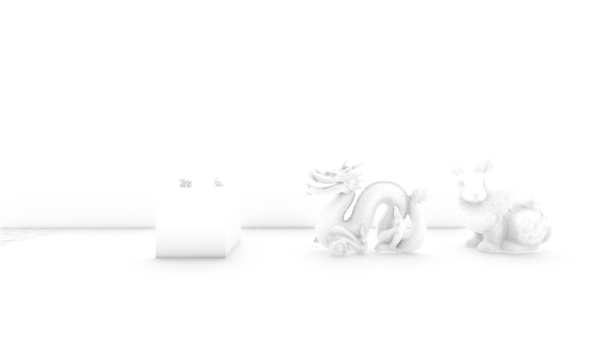

再是 **thickness=0.6**. 墙脚的暗带和龙身体凹进去的地方更明显了. 但这只能说明这个参数改变了遮挡范围, 不能说明调大之后就更接近真实几何厚度.

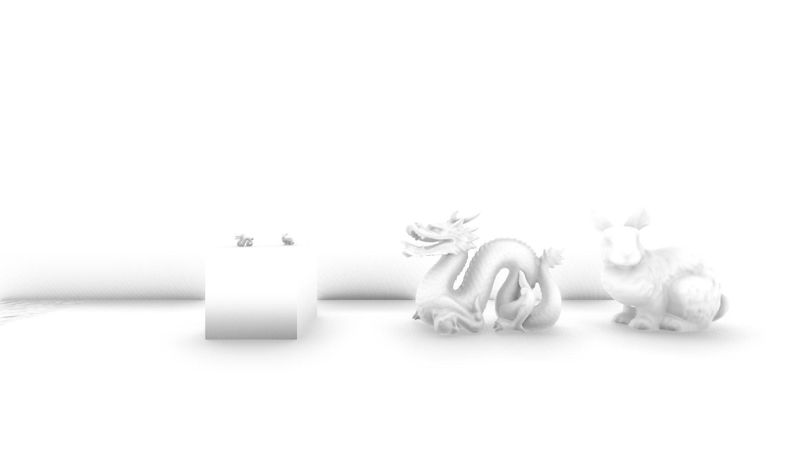

### **3.6 VisibilityBitmask**

下面是整篇最核心的几行.

```C++

if (startBit < endBit)
{
	uint mask = ((1u << (endBit - startBit)) - 1u) << startBit;
	visibilityMask &= ~mask;
}

```

别被一堆位运算吓到, 拆开就很简单.

假设 **startBit = 2, endBit = 5**.

```text
endBit - startBit        = 3
1u << 3                 = 00001000
(1u << 3) - 1u          = 00000111
再左移startBit          = 00011100
取反并与visibility相与   = 11100011
```

于是bit 2, 3, 4被清0, 表示这些角度被挡住. 后面再遇到另一个遮挡, 继续清0, 已经清过的位不会重复减去.

注意这是 **[startBit, endBit)** 的区间, 不包含endBit. 当前代码两端都clamp到31, 所以最高的bit 31不会被清掉.

这意味着单个方向的原始可见性至少留有 **1/32**, 即便其它31位全被遮挡. 后面强度大于1仍可能把最终结果压到0, 但那是强度处理, 不是mask真的全黑了.

还有, startBit >= endBit会直接忽略, 没有自动交换前后端点. 这是当前代码实际的行为. 如果之后改进区间覆盖, 要同时考虑角度方向和边界, 不能只把31改成32, 否则还要处理32位移位的边界问题.

### **3.7 输出AO**

一根方向轴的两侧采样完成后, 统计可见的bit数量.

```C++

visibilitySum += countbits(visibilityMask) / 32.0;

```

所有方向算完, 取平均, 转成遮挡量, 乘距离淡出和强度, 最后再转回可见性.

```C++

float occlusion = (1.0 - visibilitySum / directionCount) * fade;
return float2(1.0 - saturate(occlusion * _GTVBAOParams.z), eyeDepth);

```

所以RT中的R依旧是 **1白色无遮挡, 0黑色完全遮挡**.

这里的fade取决于当前点离相机多远. 采样点之间的距离则只做radius范围判断, 没有再乘一条HBAO式的距离衰减曲线. 两个距离不要混在一起看.

-----------------

## **4. Blur**

&emsp;&emsp; Raw AO的方向数和步数都有限, 又带随机采样, 接下来给它Blur一下.

先看 **RawAmbientOcclusion**, 在原尺寸下看龙的身体和墙脚, 可以看到细密的采样纹路. 浏览器把图缩小后不一定明显, 可以点开原图看.


再看横向和纵向Blur之后的结果. 高频噪点少了很多, 但墙脚仍然能看到一些较宽的条纹, 并不是Blur一开就万事大吉. 这两张都关闭Temporal, thickness回到默认的0.3.

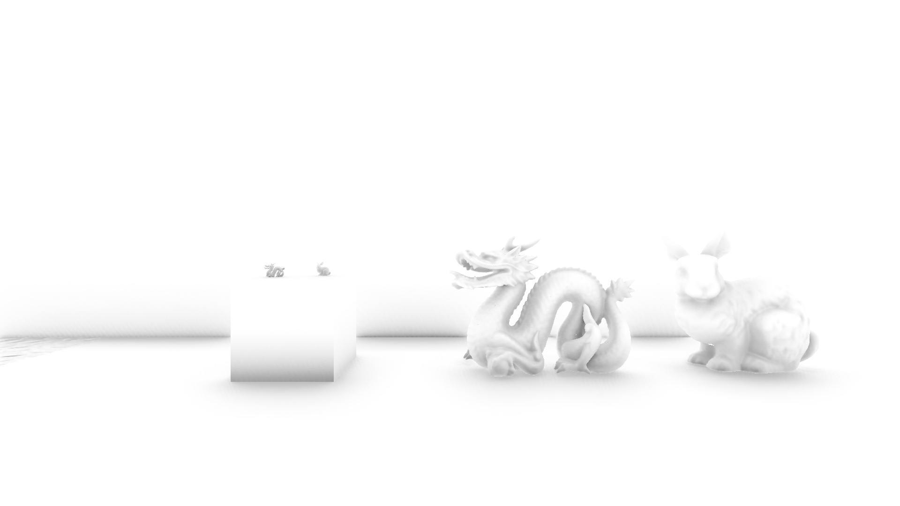

### **4.1 groupshared**

这次横向和纵向各做一次, 单次半径为4, 即中心点加左右各4个点, 总共9 tap.

```C++

#define GTVBAO_BLUR_GROUP_SIZE 64
#define GTVBAO_BLUR_RADIUS 4
#define GTVBAO_BLUR_CACHE_SIZE (GTVBAO_BLUR_GROUP_SIZE + 2 * GTVBAO_BLUR_RADIUS)

groupshared float2 gs_AODepth[GTVBAO_BLUR_CACHE_SIZE];
groupshared float3 gs_Normal[GTVBAO_BLUR_CACHE_SIZE];

```

一组算64个连续像素, 左右边缘各补4个, 所以缓存是72个元素. 缓存AO和Depth, 还有对应的Normal.

各个线程协作把数据加载进来.

```C++

for (uint index = lane; index < GTVBAO_BLUR_CACHE_SIZE; index += GTVBAO_BLUR_GROUP_SIZE)
{
	int2 samplePixel = basePixel + direction * ((int)index - GTVBAO_BLUR_RADIUS);
	samplePixel = clamp(samplePixel, int2(0, 0), (int2)_GTVBAOSize.xy - 1);
	float2 uv = (float2(samplePixel) + 0.5) * _GTVBAOSize.zw;
	gs_AODepth[index] = LOAD_TEXTURE2D(_GTVBAOSource, samplePixel).rg;
	gs_Normal[index] = GTVBAONormal(GTVBAOSceneUV(uv));
}
GroupMemoryBarrierWithGroupSync();

```

lane 0到63先各装一个, lane 0到7再装剩下8个. 同步之后大家才能放心读邻居加载的数据.

横向的direction为(1, 0), 纵向为(0, 1), 因此相同的lane就能对应一行或者一列.

这里有个很容易踩的坑: **越界线程也要先参与加载和同步, 再return**. 最后一组可能不足64个有效像素, 不能像Main那样在Barrier前直接提前退出.

groupshared减少的是这一组邻域数据的重复纹理读取, Main里面的深度采样没有因此一起变成共享缓存. 至于实际快多少, 还要看GPU计时, 不能只看见Compute就默认起飞.

**groupshared + GroupMemoryBarrierWithGroupSync也可能负优化, 手机上尤其要实测.** 少读几次纹理, 得先付出搬数据、共享内存读写和组内同步的成本. 如果滤波核小、数据复用少, 或者直接采样已经很容易命中纹理缓存, 省下来的开销可能还不够付账. 搞不好大家排队等集合的时间, 比各自读完还长hhh.

不过这里不能直接删掉Barrier来提速, 因为后面要读其它线程写进来的数据, 没同步就可能读到还没准备好的内容. 真要比较, 应该拿直接纹理采样版和groupshared版在目标手机上测, 再看看不同线程组大小的表现. 桌面GPU上跑得快, 也不能直接给手机开保票.

### **4.2 双边权重**

如果只用高斯权重, 前景的黑色AO很容易糊到远处的背景上. 所以这里加深度和法线判断.

```C++

float depthWeight = saturate(1.0 - abs(sampleValue.y - center.y)
	/ max(center.y, 0.0001) * _GTVBAOFilter.x);
float normalWeight = pow(saturate(dot(centerNormal, sampleNormal)), _GTVBAOFilter.y);
float weight = exp(-offset * offset * 0.25) * depthWeight * normalWeight;
weight *= sampleValue.y > 0.0 ? 1.0 : 0.0;

weightedAO += sampleValue.x * weight;
weights += weight;

```

空间上越远, 权重越低. 深度差越大, 权重越低. 法线方向差越大, 权重越低. 背景直接不参与.

depthSharpness越大, 越不愿意跨越深度差进行混合. normalSharpness越大, 越不愿意混合法线方向不同的点.

最后只模糊AO, **Depth保留中心点自己的值**.

```C++

_GTVBAOOutput[outputPixel] = float2(saturate(weightedAO / weights), center.y);

```

如果深度也跟着平均, 后面的Temporal就会拿一个混合出来的深度去判断表面, 白忙活了.

-----------------

## **5. Temporal**

&emsp;&emsp; Blur主要处理空间上的噪点, Temporal再把不同帧的采样结果积累起来.

### **5.1 History**

C#为每个Camera保存一个 **CameraHistory**, 两张RTHandle来回交换. 本帧读A写B, 下一帧读B写A.

这些RT要跨帧存在, 所以不能只是RenderGraph内部的一张临时Texture. 每帧通过 **ImportTexture()** 导入, 再声明读写依赖.

历史也不是拿到就能一直用. 当前代码会在这些情况下让它失效:

- RT重新分配, 比如分辨率变化.
- 相机平移超过max(1, radius * 2), 或旋转超过30度.
- 上次更新不是上一帧.
- 被纳入Hash的AO和滤波参数变化.
- 非抖动投影矩阵发生变化.

长期不用的相机历史会被清理, Feature销毁时也会Release. Game和Scene相机各自有状态, 不拿同一份历史互相覆盖.

### **5.2 重投影和深度判断**

打开 **GTVBAOTemporal()**. current是本帧空间滤波后的AO和深度. 历史无效或者当前是背景, 就直接输出current.

先用Motion找上一帧UV.

```C++

float2 velocity = SAMPLE_TEXTURE2D_LOD(_GTVBAOMotion, sampler_PointClamp, sceneUV, 0).xy;
float2 previousUV = uv - velocity + _GTVBAOJitterDelta.xy;

```

这里按URP Motion的当前减上一帧UV位移使用, 所以是减velocity. 这段没有UE那种额外的速度编码解码.

**_GTVBAOJitterDelta** 是上一帧减当前帧的投影抖动UV. 代码按Motion不含TAA投影抖动来补偿, 因为AO历史存的是抖动后的光栅位置. 它和前面让AO采样方向变化的noise是两件事.

previousUV越界就放弃历史. 没出界也不代表找对了, 还要验证深度.

```C++

float3 worldPosition = GTVBAOWorldPosition(sceneUV, GTVBAODeviceDepth(sceneUV));
float expectedDepth = -mul(_GTVBAOPreviousView, float4(worldPosition, 1.0)).z;
float2 previousPoint = SAMPLE_TEXTURE2D_LOD(_GTVBAOHistory, sampler_PointClamp, previousUV, 0).rg;
float tolerance = max(0.01, expectedDepth * _GTVBAOTemporal.z);
if (previousPoint.y <= 0.0 || abs(previousPoint.y - expectedDepth) > tolerance)
{
	return current;
}

```

注意比较的是 **当前世界点转换到上一帧View空间后的深度**, 与历史贴图存的深度. 相机动了, 当前Eye Depth和上一帧Eye Depth本来就可能不同, 不能直接拿两帧的G通道硬比.

深度取Point采样, 避免前后景插值出来一个不存在的表面. 通过测试之后, 历史AO才用Linear采样.

这里仍然是简化的判断. 对移动或变形物体, 当前世界位置未必就是上一帧的世界位置, 只有Motion UV不能完整恢复这一点. 所以它能降低历史错误, 但不能保证所有动态物体都没有拖影或者历史拒绝.

### **5.3 NeighborhoodClamp**

通过深度检测后, 再找当前AO的3x3邻域最小值和最大值, 把历史AO夹进这个区间.

```C++

previousAO = clamp(previousAO, minimum, maximum);
float velocityPixels = length(velocity * _GTVBAOFullSize.xy);
float historyWeight = saturate(_GTVBAOTemporal.y - velocityPixels * 0.05);
return float2(saturate(lerp(current.x, previousAO, historyWeight)), current.y);

```

比如现在附近已经很亮了, 历史还留着一块很黑的AO, Clamp就不允许它继续黑得太离谱.

速度越大, 历史权重越小. temporalBlend为0.95时, 静止且历史有效可以混入很多历史信息, 运动起来则更相信当前帧.

这里也只累积AO, Depth继续保存当前值. 而且顺序是 **先Blur, 再Temporal**, 邻域Clamp看到的是当前空间滤波结果.

下面是在 **Play模式** 下开启Temporal的截图. 同样是1920x1080, 全分辨率, quality=2, 开Blur, temporalBlend=0.95, 固定相机运行120帧后读取结果, 同时确认了该相机的History有效.


对比前面的Blur图, 墙脚的条纹进一步减弱了. 这里只展示静止时的累积结果, 一张静态图不能说明运动时没有拖影, 运动稳定性还得另看.

-----------------

## **6. Combine**

### **6.1 半分辨率上采样**

关闭halfResolution时, Composite直接线性采样最终AO.

打开时走 **GTVBAOUpsample()**. 取低分辨率周围2x2的AO和Depth, 除了双线性空间权重, 再乘一个深度权重.

```C++

float weight = spatial * exp(-abs(tap.y - depth)
	/ max(depth, 0.01) * max(32.0, _GTVBAOFilter.x));
weight *= tap.y > 0.0 ? 1.0 : 0.0;
aoSum += tap.x * weight;
weightSum += weight;

```

这样前景和背景的深度不接近时, 尽量不让低分辨率AO直接跨边缘混过去. 所有权重都太小则返回1, 宁可不加AO.

这里上采样只考虑Depth, 没有再加Normal. 它也无法恢复低分辨率计算时完全没采到的细小几何, 半分辨率还是要付出细节代价的.

下面这张输出仍然是1920x1080, 但内部AO改为 **960x540**, quality=2, 开Blur, 关Temporal. 可以和前面的全分辨率Blur图对照.


方块上面的两个小模型, 龙角和身体的细碎起伏变得更糊了. 因为Blur半径按AO像素算, AO降到半分辨率之后, 同样的4像素半径还会覆盖更大的屏幕范围. 所以不只是采样数量减少这么简单.

### **6.2 合成和Debug**

最后就很朴素了. 前面折腾了一大圈, 到合成这一步, 核心业务还是一个乘号.

```C++

return _GTVBAODebugMode != 0
	? float4(ao.xxx, color.a)
	: float4(color.rgb * ao, color.a);

```

场景RGB乘AO, Alpha保留原值. 背景在前面提前返回, 正常合成保持原色, Debug显示白色.

和以前HBAO最后用Blend乘颜色的目标类似, 这里是显式采样场景Color, 写到新的ColorRT.

**这份Demo没有把AO接进URP材质的间接光计算.** 它在后处理之前乘已经画好的场景颜色, 因此直接光和其它已经写入颜色的贡献也会被压暗. 没有深度/法线对应信息的透明内容也不能指望正确处理.

Debug模式对应如下:

| 模式 | 看什么 |
| --- | --- |
| Composite | 最终场景乘AO |
| AmbientOcclusion | 最终AO, 包含已启用的滤波和累积 |
| RawAmbientOcclusion | Main输出, 未经过Blur和Temporal |
| WorldNormals | 世界法线映射到0到1显示 |

虽然变量名叫 **_GTVBAOHistory**, 在Composite里面绑定的是“最终AO”. Temporal没开时也可能是Blur结果或者Raw, 并不一定来自上一帧.

调试可以先看WorldNormals, 再看Raw, 然后依次开启Blur和Temporal, 最后看Composite. Raw都不对, 就别靠Blur把问题糊过去了hhh.

-----------------

## **7. 其它**

&emsp;&emsp; 这次最有意思的是用一个uint记录角度区间. 多个遮挡直接合并, 同一格不会重复变黑, 最后countbits就能数出剩下多少可见方向.

但屏幕空间的限制依旧存在. 屏幕外和前面物体后面的几何没有被Depth记录, 有限厚度只能补一个假设出来的背面, 不能补全场景.

thickness也要结合场景看. 薄板和厚墙共用同一个系数, 总会有不合适的时候. 调radius还会同时改变实际厚度, 因为它们在代码里是相乘的, 不要以为只改变了搜索范围.

当前mask还有前面说的左右角度合并, 最高bit始终保留, 小区间量化后可能消失等问题. 想认真比较算法质量, 可以先补切片角度表示和区间边界, 再用同一场景同一参数尺度对照. intensity拉得更黑不等于更准确.

性能方面, 可以先试quality 1和halfResolution, 看细节是否还能接受. Temporal适合在运动中看稳定性, 只截一张静态图很难判断拖影. 当前RT每像素两个32位浮点, History还要两张, 带宽和显存也要算进去. AO本来只想存一份黑白, 为了照顾历史Depth, 最后租了个双人间.

后续如果想试更紧凑的RT格式, 要先检查远处Depth精度能不能满足历史拒绝和上采样, 不要只因为AO本身0到1就把G通道也一起随便压缩了.

这次从AO写到Blur又写到Temporal, 后面的收尾比前面的算法还长. 图形学日常了属于是(Doge).

最近学会了一个搭配AI的用法: 抄写代码 学完文章, 直接让AI向我提问, 看看自己到底理解到位. 结果回答的时候一些错误, 一些模棱两可. 可恶, 难绷!!!

**问题1: `visibilityMask`里的1和0各表示什么, 一条轴算完后怎样得到可见性?**

答: 每条方向轴开始时, `visibilityMask = 0xFFFFFFFFu`, 32个1表示32个角度格都可见. 采样点挡住的区间会通过`visibilityMask &= ~mask`清成0. 这条轴的可见比例是`countbits(visibilityMask) / 32.0`, 数的是剩下的1; 数0得到的才是被遮挡的格数. 正反两侧共用该轴的mask, 下一条轴重新从全1开始.

**问题2: Q2一共尝试多少次深度采样, 两个noise又在改变什么?**

答: Q2有4条方向轴, 每条轴走正反两侧, 每侧4步, 所以最多尝试`4 * 2 * 4 = 32`次深度采样. 32位mask和32次采样只是这档配置碰巧相同, 也不是每条轴单独开一张RT. `noise.x`旋转整组方向轴, `noise.y`扰动步进位置. Temporal生效时C#传入`sampleIndex % 8`, 在0到7间循环; 没有累积时固定frame为0, 让噪声图案不再逐帧变化, 但空间噪点并不会凭空消失.

**问题3: `thickness`怎样变成bitmask里的遮挡区间?**

答: `P`是当前点, `S`是深度图采到的前表面点. 代码用`B = S - viewDirection * (radius * thickness)`估出背面, 再计算`P→S`与`P→B`相对当前法线的角度. 角度映射到32个bit后, 如果`startBit = 2`、`endBit = 5`, 清掉的是bit 2、3、4, 不包括5. 这就是`[startBit, endBit)`半开区间. `thickness = 0`时`B = S`, 两端角度相同, 当前代码不会清除遮挡位. 这个背面始终是近似, 不是Depth真的看见了物体背后.

**问题4: 为什么不能把当前Demo直接当成论文算法的完整实现?**

答: 论文实现会建立切片平面, 把法线投影进去, 并保留左右的有符号角度. 当前Demo直接取世界法线和`S-P`方向的夹角, 映射到0到`PI/2`的32格, 正反两侧还共用一个mask. 两边不同的遮挡可能落到同一格被合并; 最后也是`countbits / 32`等权计数, 没做完整的余弦加权积分. 这些是表示方式的差异, 不是把quality调高就能补回来的.

**问题5: Temporal如何找历史像素, `NeighborhoodClamp`又在防什么?**

答: 上一帧的UV主要靠Motion Vector找: `previousUV = uv - velocity + jitterDelta`. `PreviousView`矩阵不是拿来找UV的, 它负责把当前世界点变到上一帧View空间, 得到预期深度, 再和历史贴图里的深度比较. 历史无效或深度对不上就直接用当前AO. 通过检查后, 还要把历史AO限制在当前帧3x3邻域AO的最小值和最大值之间, 防止过去的一块黑影一直赖着不走. 这一步限制的是历史值, 不能代替前面的深度判断.

-----------------

## **8. 实测**

&emsp;&emsp; GTVBAO、My GTAO（我写的GTAO）和URP SSAO放在一起, 看看画面, 再看看开销.

| 设备 / 条件 | |
| --- | --- |
| GPU | NVIDIA GeForce RTX 5060 Ti 16G |
| CPU | AMD Ryzen 9 9950X |
| 条件 | 6000.6.2f1 Editor Play模式 |

### **8.1 效果对比**

**纯AO, 全分辨率:**

| GTVBAO | My GTAO | URP SSAO |
| --- | --- | --- |
|  | 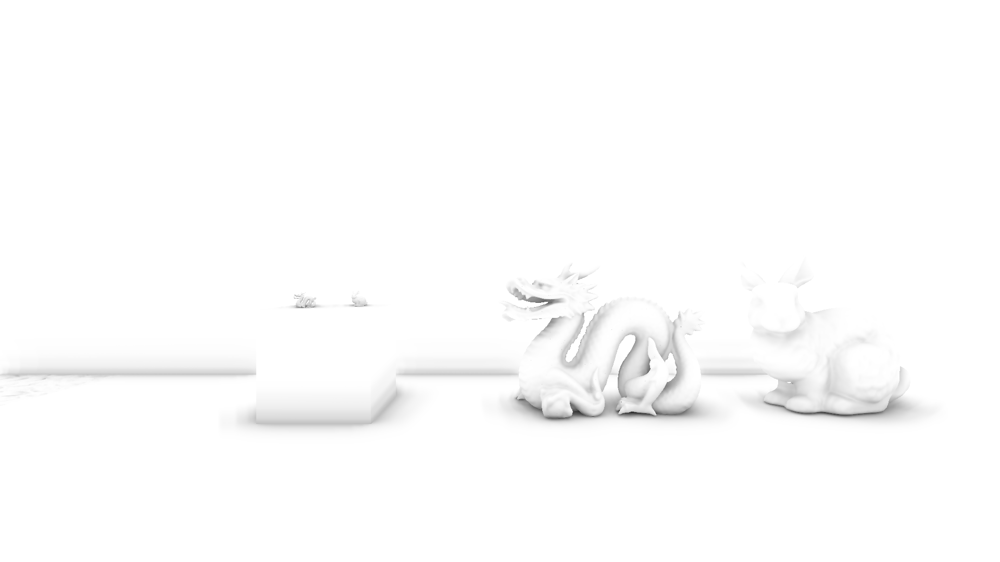 | 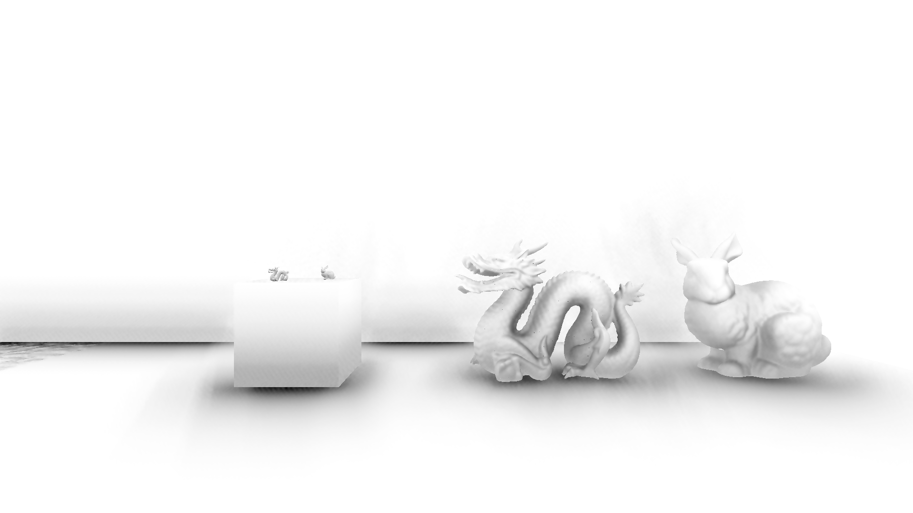 |

My GTAO的接触暗部更集中, 大平面也比较干净; GTVBAO的过渡更散一些. URP SSAO在方块底部、墙脚和龙腹部压得更黑, 也能看到一些细碎噪声. AO不是黑芝麻糊, 倒得越浓可不一定越好喝2333.

**Combine, 全分辨率:**

| GTVBAO | My GTAO | URP SSAO |
| --- | --- | --- |
|  |  | 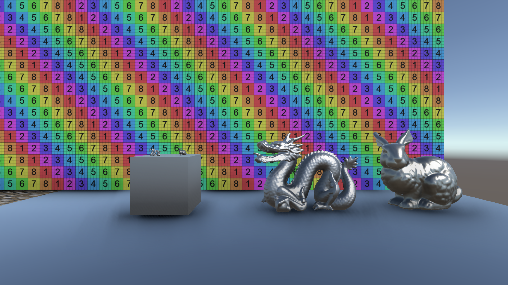 |

合成后我更喜欢My GTAO这组的接触感. URP SSAO的暗部更重, 可以按口味调Intensity和Radius.

**纯AO, 半分辨率:**

| GTVBAO | My GTAO | URP SSAO |
| --- | --- | --- |
|  |  | 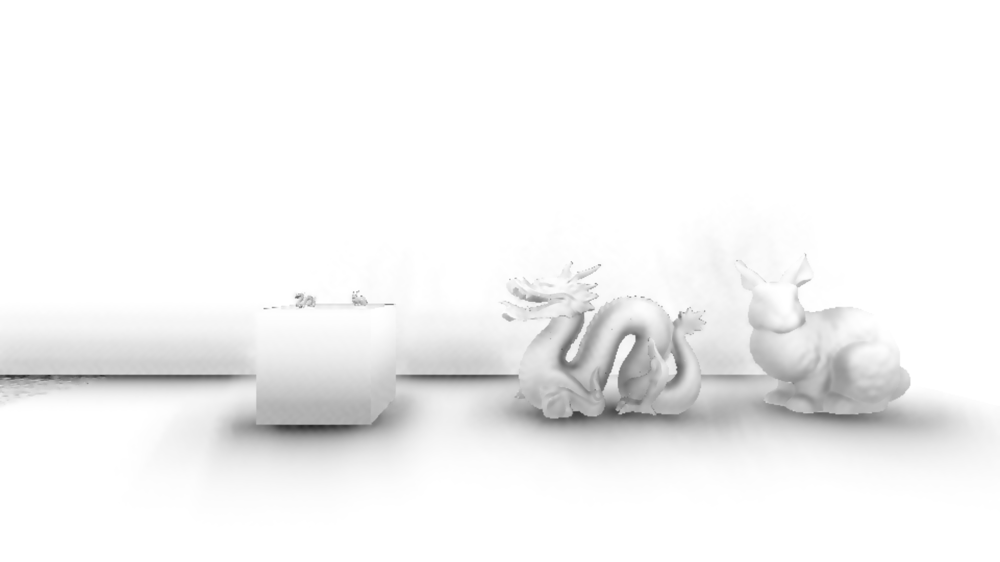 |

**Combine, 半分辨率:**

| GTVBAO | My GTAO | URP SSAO |
| --- | --- | --- |
|  | 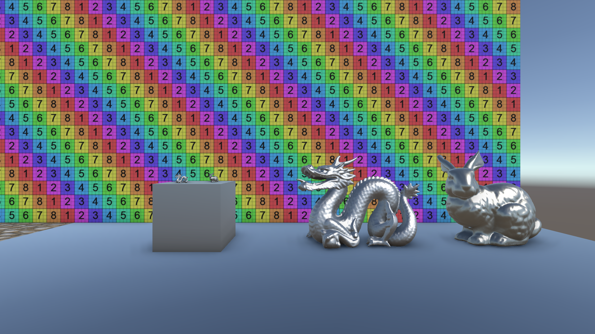 |  |

半分辨率下, URP SSAO在龙角和兔子轮廓附近的颗粒更明显. GTVBAO和My GTAO则更软, 滤波把噪点请走时, 也顺手带走了一点细节.

### **8.2 性能对比**

GPU耗时如下, 单位ms, 取AO相关Pass合计的中位数.

| 实现 | 全分辨率 | 半分辨率 |
| --- | ---: | ---: |
| GTVBAO | 1.260 | 0.388 |
| My GTAO | 0.835 | 0.327 |
| URP SSAO | 0.635 | 0.195 |

GTVBAO和My GTAO用Q2、Blur+Temporal; URP SSAO用High、After Opaque, 没有Temporal.

URP SSAO这组最快, 半分辨率只要0.195 ms. 结合上面的画面, 我更偏向My GTAO的半分辨率, 接触感和开销都比较合胃口; 近看模型细节时再切全分辨率. GTVBAO这轮吃得多一点, Visibility Bitmask这条路还可以继续折腾hhh.

-----------------

[1]:https://github.com/HHHHHHHHHHHHHHHHHHHHHCS/MyStudyNote/blob/main/MyNote/写写GTVBAO.md
[2]:https://arxiv.org/abs/2301.11376
[3]:https://cdrinmatane.github.io/posts/ssaovb-code/
[4]:https://www.activision.com/cdn/research/Practical_Real_Time_Strategies_for_Accurate_Indirect_Occlusion_NEW%20VERSION_COLOR.pdf
[5]:https://github.com/GameTechDev/XeGTAO
[6]:https://docs.unity.com/en-us/engine/6000.6/manual/lighting-overview/lighting/shadows-in-urp/post-processing-ssao/ssao-renderer-feature-reference
