写写简单的HBAO
======

(Github正常排版: [写写简单的HBAO][1])

-----------------

<!-- @import "[TOC]" {cmd="toc" depthFrom=1 depthTo=6 orderedList=false} -->

<!-- code_chunk_output -->

- [**0. 起因**](#0-起因)
- [**1. 原理**](#1-原理)
- [**2. C#**](#2-c)
  - [**2.1 RenderSettings**](#21-rendersettings)
  - [**2.2 RenderFeature**](#22-renderfeature)
  - [**2.3 RenderPass**](#23-renderpass)
- [**3. AOShader**](#3-aoshader)
  - [**3.1 基础的框架**](#31-基础的框架)
  - [**3.2 数据准备**](#32-数据准备)
  - [**3.3 循环迭代**](#33-循环迭代)
  - [**3.4 ComputeAO**](#34-computeao)
  - [**3.5 强度**](#35-强度)
- [**4. Blur**](#4-blur)
  - [**4.1 C#**](#41-c)
  - [**4.2 Shader框架**](#42-shader框架)
  - [**4.3 提前准备**](#43-提前准备)
  - [**4.4 Blur**](#44-blur)
- [**5. Combine**](#5-combine)
  - [**5.1 C#**](#51-c)
  - [**5.2 Shader**](#52-shader)

<!-- /code_chunk_output -->

-----------------

## **0. 起因**

&emsp;&emsp; URP有SSAO, HDRP有GTAO. 所以摆烂学一个HBAO. [官方的Github地址][5]

下面是效果图.

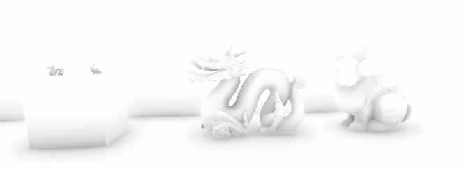

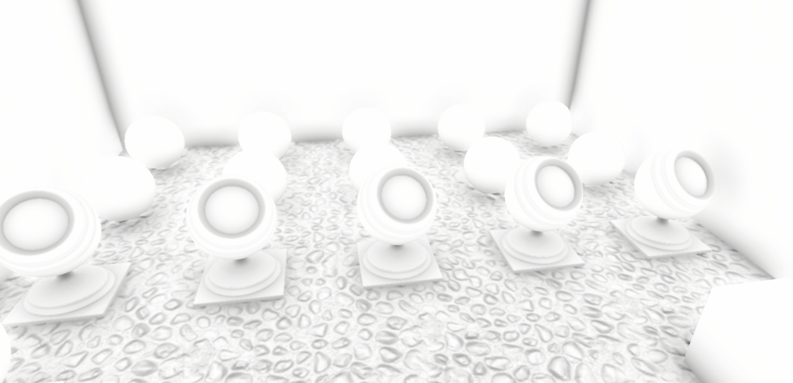

下面是URP的SSAO. 可以发现HBAO会软很多, 慢慢淡出.

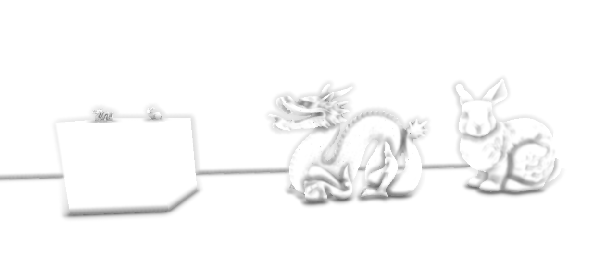

下面是自己写的GTAO, 调参没有调对. GTAO因为多了多次弹射的结果, 感觉更黑了.

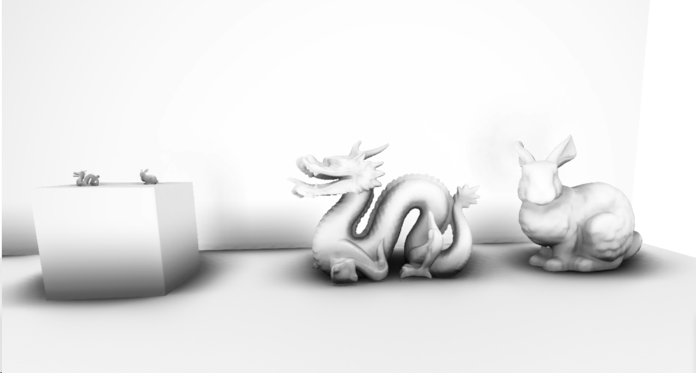

下面随便写的RayTracingAO, 也没有仔细的调参. 但是视觉效基本上和上面的差不多.

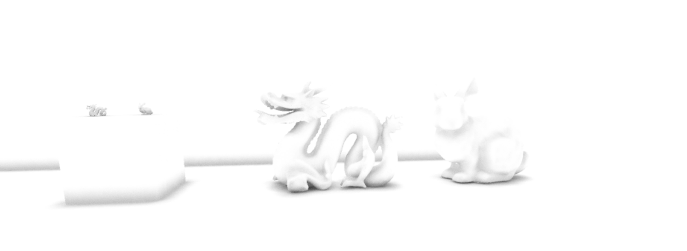

自己调参可能有点不准确, 这是官方给的SSAO和HBAO的对比图.

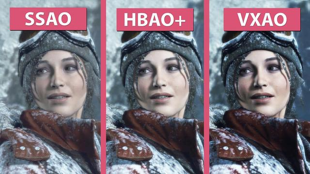

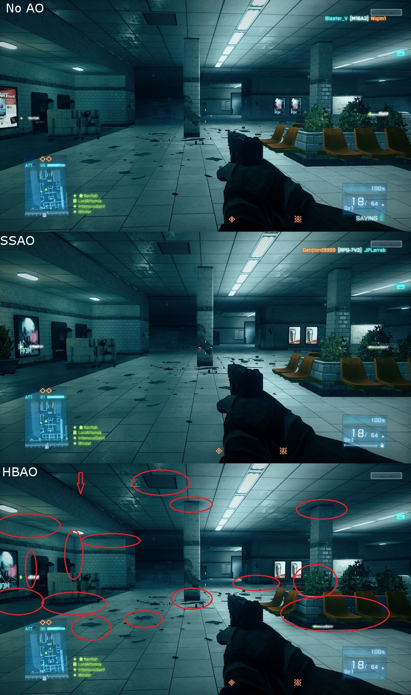

HBAO对比SSAO采样次数更少, 效果也好很多, 不过使用了多次三角函数. 虽然SSAO可以变成TSSAO来减少采样和降低噪点.

同时我在找资料的时候还发现CACAO, 算是SSAO的升级, 效果也不错.[Github地址][4]


-----------------

## **1. 原理**

&emsp;&emsp; HBAO, Image-Space Horizon-Based Ambient Occlusion, 水平基准环境光遮蔽, 是一项英伟达于2008年提出的SSAO衍生版, 效果比SSAO更好. [文章地址][2]

YiQiuuu的有篇文章是关于HBAO原理和实现, 讲的详细且不错, [文章地址][3]. 这里直接快速引用概括一下.

1. 屏幕上的每一个像素, 做一个四等分的四条射线, 然后随机旋转一下. 每一个像素的随机角度不能一样, 否则效果很怪/是错的. 这里的四等分也可以是六等分, 八等分...

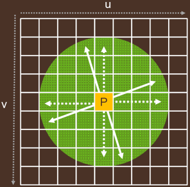

2. 对于任意一条射线, 沿着射线方向生成一个一维的高度. 然后RayMarch根据深度做找到一个最大的水平角(Horizon Angle).

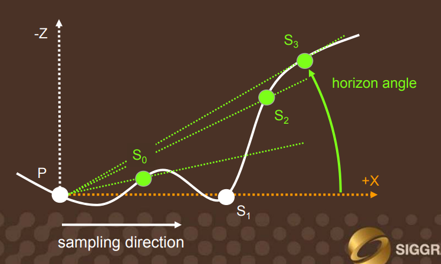

3. 根据点P和它的法线(面法线), 计算它的切面角(Tangent Angle).

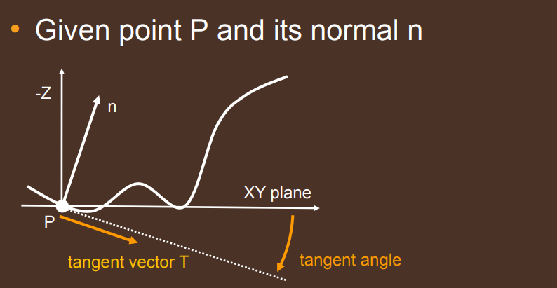

4. 根据Horizon Angle和Tangent Angle, 得到AO. AO = sin(h) - sin(t).

至于为什么AO=角度值的差? 

我的理解(个人理解)是 周围的东西对比当前点越高, 则表示光被周围东西遮挡的越多, 则越暗.

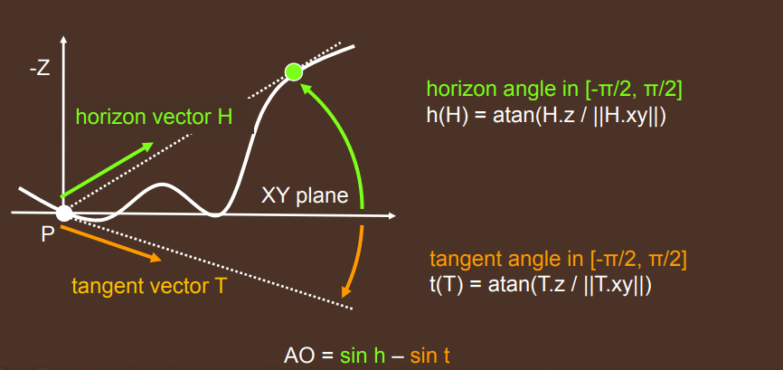

为什么用面法线, 而不是顶点插值法线?

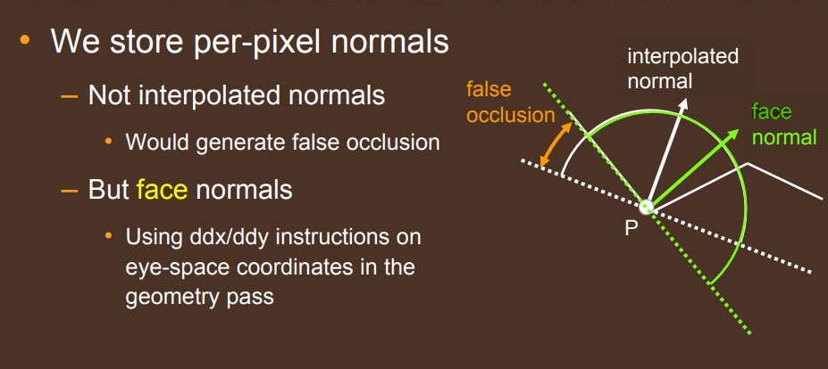

看官网的PPT是说 如果用顶点插值法线去计算会得到错误的遮挡.

如果我们用的是顶点插值法线, 当P在拐弯位置的时候, 顶点插值法线和面法线不一致. 计算的半球起始位置就可能会是错的.

而根据View Space 利用ddx/ddy重新生成的法线是对的. 之前的SSAO篇中有介绍怎么重新生成法线.

但是我下面的代码还是会用NormalRT, 首先为了提高性能. 

下面是我用ddx/ddy重新生成的法线出的效果. 发现会出现奇怪的死黑的边缘和锯齿.

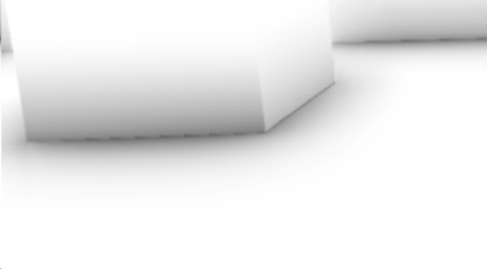

如果用的是比较复杂算法生成NormalRT, 看着效果和Gbuffer的NormalRT产生的效果也差不多.

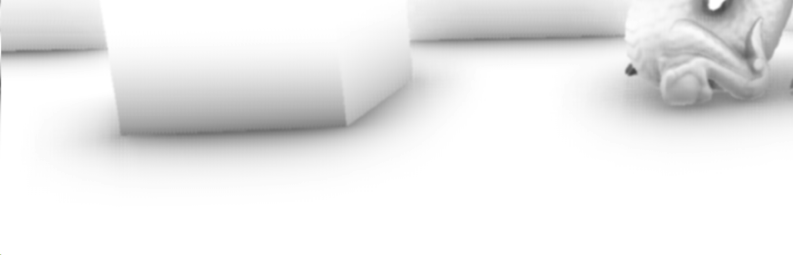

而且物体一般都有NormalMap, 用深度图和算法重新生成的NormalRT是没有NormalMap的. 比如地表的石子用的是NormalMap, 就会出现下面的效果.

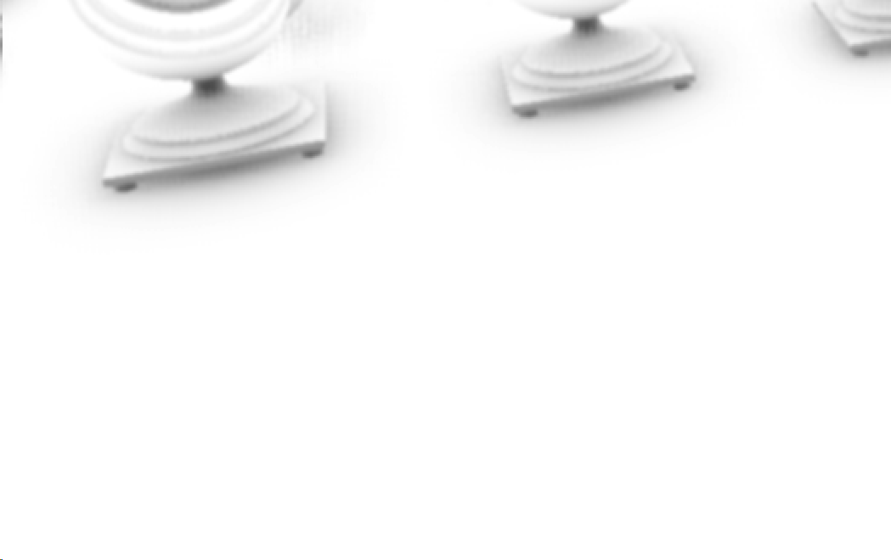


因此我这里还是用的GBuffer的Normal 或者 DepthNormals Pass 生成的NormalRT.

其实正确的应该是用BentNormalRT. BentNormal大体指光线大概率通过的平均方向/不被其他物体遮挡的方向. 因此生成这个也更麻烦, 业界做法常常是离线烘焙好贴图.

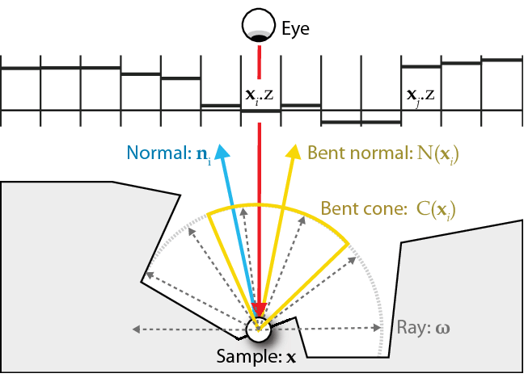

-----------------

## **2. C#**

&emsp;&emsp; 个人习惯, 先写C#吧.

### **2.1 RenderSettings**

创建一个C#文件**HBAORenderFeature.cs**. 先写RenderSettings.

```C#

using UnityEngine;
using UnityEngine.Rendering;
using UnityEngine.Rendering.Universal;

[System.Serializable]
public class HBAORenderSettings
{
	[Range(0.0f, 1.0f)] public float intensity = 1.0f;
	[Range(0.25f, 5.0f)] public float radius = 1.2f;
	[Range(16f, 256f)] public float maxRadiusPixels = 256;
	[Range(0.0f, 0.5f)] public float angleBias = 0.05f;
	[Min(0)] public float maxDistance = 150.0f;
	[Min(0)] public float distanceFalloff = 50.0f;
	[Range(0.0f,16.0f)] public float sharpness = 8.0f;
}

```

intensity: AO强度

radius: 射线半径

maxRadiusPixels: 最大半径的像素数量

angleBias: 角度阈值

maxDistance: AO的最大距离, 超过这个距离就没有AO了

distanceFalloff: AO的距离衰减, 淡出用

sharpness: 模糊深度权重

### **2.2 RenderFeature**

然后继续在C#文件**HBAORenderFeature.cs**中, 写RenderFeature. **HBAORenderPass** 在后面补充.

因为URP的生命周期越来越神奇 存在反复调用, 所以我用 **OnCreate()** 和 flag 来管理.

这里只是demo, **renderPassEvent**我是随便写的. 比如这里是**RenderPassEvent.BeforeRenderingPostProcessing**.

```C#

using UnityEngine;
using UnityEngine.Rendering;
using UnityEngine.Rendering.Universal;

[System.Serializable]
public class HBAORenderSettings
{
	...
}

public class HBAORenderFeature : ScriptableRendererFeature
{
	public Shader effectShader;
	public HBAORenderSettings renderSettings;

	private bool needCreate;
	private HBAORenderPass renderPass;
	private Material effectMat;

	public override void Create()
	{
		needCreate = true;
	}

	protected override void Dispose(bool disposing)
	{
		CoreUtils.Destroy(effectMat);
		if (renderPass != null)
		{
			renderPass.OnDestroy();
			renderPass = null;
		}
	}

	public void OnCreate()
	{
		if (!needCreate)
		{
			return;
		}

		needCreate = false;

		if (renderPass == null)
		{
			renderPass = new HBAORenderPass()
			{
				renderPassEvent = RenderPassEvent.BeforeRenderingPostProcessing,
			};
		}

		if (effectMat == null || effectMat.shader != effectShader)
		{
			CoreUtils.Destroy(effectMat);
			if (effectShader != null)
			{
				effectMat = CoreUtils.CreateEngineMaterial(effectShader);
			}
		}

		renderPass.OnInit(effectMat, renderSettings);
	}

	public override void AddRenderPasses(ScriptableRenderer renderer, ref RenderingData renderingData)
	{
		if (effectShader == null)
		{
			return;
		}

		OnCreate();
		renderer.EnqueuePass(renderPass);
	}
}

```

到这里RenderFeature基本就写完了.

### **2.3 RenderPass**

创建**HBAORenderPass.cs**文件. 先写一个基础框架.

```C#

using UnityEngine;
using UnityEngine.Rendering;
using UnityEngine.Rendering.Universal;

public class HBAORenderPass : ScriptableRenderPass
{
	private const string k_tag = "HBAO";

	private HBAORenderSettings settings;
	private Material effectMat;

	public HBAORenderPass()
	{
		profilingSampler = new ProfilingSampler(k_tag);
	}

	public void OnInit(Material _effectMat, HBAORenderSettings _renderSettings)
	{
		effectMat = _effectMat;
		settings = _renderSettings;
	}

	public void OnDestroy()
	{
	}

	public override void Configure(CommandBuffer cmd, RenderTextureDescriptor cameraTextureDescriptor)
	{
	}

	public override void Execute(ScriptableRenderContext context, ref RenderingData renderingData)
	{
		var cmd = CommandBufferPool.Get();
		using (new ProfilingScope(cmd, profilingSampler))
		{
			
		}

		context.ExecuteCommandBuffer(cmd);
		CommandBufferPool.Release(cmd);
	}
}

```

从前面知道我们需要depthRT和normalRT, 所以在**Configure**中配置ConfigureInput.

```C#

public class HBAORenderPass : ScriptableRenderPass
{
	...

	public override void Configure(CommandBuffer cmd, RenderTextureDescriptor cameraTextureDescriptor)
	{
		ConfigureInput(ScriptableRenderPassInput.Depth | ScriptableRenderPassInput.Normal);
	}

	...
}

```

然后我们需要一个随机旋和射线长度的噪音图, 这里我偷懒用了**ComputeBuffer**. 但是建议离线把Texture保存下来传入.

创建一个变量 **ComputeBuffer noiseCB** , 和 **GenerateNoise** 方法.

noise.x: 随机初始角度

noise.y: 射线随机初始化长度

```C#

public class HBAORenderPass : ScriptableRenderPass
{
	...

	private ComputeBuffer noiseCB;
	private HBAORenderSettings settings;
	private Material effectMat;

	...

	public void OnInit(Material _effectMat, HBAORenderSettings _renderSettings)
	{
		effectMat = _effectMat;
		settings = _renderSettings;
		if (noiseCB != null)
		{
			noiseCB.Release();
		}
		Vector2[] noiseData = GenerateNoise();
		noiseCB = new ComputeBuffer(noiseData.Length, sizeof(float) * 2);
		noiseCB.SetData(noiseData);
	}

	public void OnDestroy()
	{
		if (noiseCB != null)
		{
			noiseCB.Release();
			noiseCB = null;
		}
	}

	...

	public override void Execute(ScriptableRenderContext context, ref RenderingData renderingData)
	{
		...
	}

	private Vector2[] GenerateNoise()
	{
		Vector2[] noises = new Vector2[4 * 4];

		for (int i = 0; i < noises.Length; i++)
		{
			float x = Random.value;
			float y = Random.value;
			noises[i] = new Vector2(x, y);
		}

		return noises;
	}
}

```

然后就是Shader属性ID. 这里直接全部一把梭写完了, 不用来回折腾, 也方便自动补全.

```C#

public class HBARenderPass : ScriptableRenderPass
{
	private const string k_tag = "HBAO";

	private static readonly int hbaoRT_ID = Shader.PropertyToID("_HBAORT");
	private static readonly int hbaoBlurRT_ID = Shader.PropertyToID("_HBAOBlurRT");
	private static readonly int noiseCB_ID = Shader.PropertyToID("_NoiseCB");
	private static readonly int aoTex_ID = Shader.PropertyToID("_AOTex");
	private static readonly int intensity_ID = Shader.PropertyToID("_Intensity");
	private static readonly int radius_ID = Shader.PropertyToID("_Radius");
	private static readonly int negInvRadius2_ID = Shader.PropertyToID("_NegInvRadius2");
	private static readonly int maxRadiusPixels_ID = Shader.PropertyToID("_MaxRadiusPixels");
	private static readonly int angleBias_ID = Shader.PropertyToID("_AngleBias");
	private static readonly int aoMultiplier_ID = Shader.PropertyToID("_AOMultiplier");
	private static readonly int maxDistance_ID = Shader.PropertyToID("_MaxDistance");
	private static readonly int distanceFalloff_ID = Shader.PropertyToID("_DistanceFalloff");
	private static readonly int blurSharpness_ID = Shader.PropertyToID("_BlurSharpness");
	private static readonly int blurDeltaUV_ID = Shader.PropertyToID("_BlurDeltaUV");

	...

}

```

在 **Execute(ScriptableRenderContext context, ref RenderingData renderingData)** 方法中, 把Settings参数和NoiseCB等传输给GPU.

radius, 跟屏幕尺寸比例有关.

maxRadiusPixels, 跟屏幕分辨率有关.

aoMultiplier, 跟bias有关系, 因为bias会减弱ao, 所以这个做补偿.

```C#

public override void Execute(ScriptableRenderContext context, ref RenderingData renderingData)
{
	var cmd = CommandBufferPool.Get();
	using (new ProfilingScope(cmd, profilingSampler))
	{
		int width = renderingData.cameraData.cameraTargetDescriptor.width;
		int height = renderingData.cameraData.cameraTargetDescriptor.height;
		float fov = renderingData.cameraData.camera.fieldOfView;
		float tanHalfFovY = Mathf.Tan(0.5f * fov * Mathf.Deg2Rad);

		cmd.SetGlobalBuffer(noiseCB_ID, noiseCB);
		cmd.SetGlobalFloat(intensity_ID, settings.intensity);
		cmd.SetGlobalFloat(radius_ID, settings.radius * 0.5f * height / (2.0f * tanHalfFovY));
		cmd.SetGlobalFloat(negInvRadius2_ID, -1.0f / (settings.radius * settings.radius));
		float maxRadiusPixels = settings.maxRadiusPixels * Mathf.Sqrt((width * height) / (1080.0f * 1920.0f));
		cmd.SetGlobalFloat(maxRadiusPixels_ID, Mathf.Max(16, maxRadiusPixels));
		cmd.SetGlobalFloat(angleBias_ID, settings.angleBias);
		cmd.SetGlobalFloat(aoMultiplier_ID, 2.0f / (1.0f - settings.angleBias));
		cmd.SetGlobalFloat(maxDistance_ID, settings.maxDistance);
		cmd.SetGlobalFloat(distanceFalloff_ID, settings.distanceFalloff);
	}

	context.ExecuteCommandBuffer(cmd);
	CommandBufferPool.Release(cmd);
}

```

然后就是申请RT, SetRT, 绘制HBAO, 别忘了释放RT.

Blur和Combine的模块之后再补充.

```C#

public override void Execute(ScriptableRenderContext context, ref RenderingData renderingData)
{
	...
	using (new ProfilingScope(cmd, profilingSampler))
	{
		...
		cmd.SetGlobalFloat(distanceFalloff_ID, settings.distanceFalloff);
	
		cmd.GetTemporaryRT(hbaoRT_ID, width, height, 0, FilterMode.Bilinear, RenderTextureFormat.R8, RenderTextureReadWrite.Linear);

		cmd.SetRenderTarget(hbaoRT_ID);
		CoreUtils.DrawFullScreen(cmd, effectMat, null, 0);

		//TODO:Blur
		//TODO:Combine

		cmd.ReleaseTemporaryRT(hbaoRT_ID);
	}
	...
}

```

这样简单的HBAO C#基本写完了.

-----------------

## **3. AOShader**

### **3.1 基础的框架**

创建一个Shader文件 **HBAO.shader**. 写个空的框架进去.

```C++

Shader "HBAO"
{
	SubShader
	{
		Tags
		{
			"RenderType"="Opaque"
		}
		LOD 100

		Cull Off
		ZWrite Off
		ZTest Always

		Pass
		{

			Name "HBAO"

			HLSLPROGRAM
			#pragma vertex vert
			#pragma fragment frag

			#include "Packages/com.unity.render-pipelines.core/ShaderLibrary/Common.hlsl"
			#include "Packages/com.unity.render-pipelines.universal/ShaderLibrary/Core.hlsl"

			struct a2v
			{
				uint vertexID :SV_VertexID;
			};

			struct v2f
			{
				float4 pos:SV_Position;
				float2 uv:TEXCOORD0;
			};

			v2f vert(a2v IN)
			{
				v2f o;
				o.pos = GetFullScreenTriangleVertexPosition(IN.vertexID);
				o.uv = GetFullScreenTriangleTexCoord(IN.vertexID);
				return o;
			}

			half frag(v2f IN) : SV_Target
			{
				float2 uv = IN.uv;

				return 1;
			}
			ENDHLSL
		}

	}
}

```

把C#的传入的参数写上. 

还有我们需要DephtRT和NormalRT, 把它们的include也写上 **DeclareDepthTexture.hlsl** 和 **DeclareNormalsTexture.hlsl**.

同时定义方向等分个数(DIRECTIONS)和射线步进次数(STEPS). 这里直接大力出奇迹! 8等分, 6步进.

我这里偷懒用了Buffer!!!

```C++

Pass
{

	Name "HBAO"

	HLSLPROGRAM

	...
	#include "Packages/com.unity.render-pipelines.universal/ShaderLibrary/Core.hlsl"
	#include "Packages/com.unity.render-pipelines.universal/ShaderLibrary/DeclareDepthTexture.hlsl"
	#include "Packages/com.unity.render-pipelines.universal/ShaderLibrary/DeclareNormalsTexture.hlsl"

	...

	struct v2f
	{
		...
	};

	#define DIRECTIONS 8
	#define STEPS 6

	StructuredBuffer<float2> _NoiseCB;

	float _Intensity;
	float _Radius;
	float _NegInvRadius2;
	float _MaxRadiusPixels;
	float _AngleBias;
	float _AOMultiplier;
	float _MaxDistance;
	float _DistanceFalloff;

	v2f vert(a2v IN)
	{
		...
	}

	...

}

```

### **3.2 数据准备**

在循环判断HBAO之前还要在Fragment中做点数据准备.

先写一个 **GetViewPos** . 输入uv, uv采样深度图获得depth. uv和depth和UNITY_MATRIX_I_P 反算出viewPos. viewPos的z是near~far而不是0~1.

再写一个 **FetchViewNormals** . 采样之前ConfigInput的WorldNormal, 再转换到ViewSpace下. 注意反转YZ.

```C++

...
float _DistanceFalloff;

float3 GetViewPos(float2 uv)
{
	float depth = SampleSceneDepth(uv);
	float2 newUV = float2(uv.x, uv.y);
	newUV = newUV * 2 - 1;
	float4 viewPos = mul(UNITY_MATRIX_I_P, float4(newUV, depth, 1));
	viewPos /= viewPos.w;
	viewPos.z = -viewPos.z;
	return viewPos.xyz;
}

float3 FetchViewNormals(float2 uv)
{
	float3 N = SampleSceneNormals(uv);
	N = TransformWorldToViewDir(N, true);
	N.y = -N.y;
	N.z = -N.z;

	return N;
}

v2f vert(a2v IN)
{
	...
}

```

回到 **Frag** . 

得到当前像素的viewPos, 如果z>=_MaxDistance, 则无AO(return 1).

再得到当前像素的ViewNormal.

随机值. 根据屏幕坐标划分用NoiseCB得到noise. 因为这里是4x4=16的buffer, 所以是%4.

stepSize和stepAng. 步进的半径由深度决定, 近的时候放大, 远的时候缩小.

```C++

half frag(v2f IN) : SV_Target
{
	float2 uv = IN.uv;

	float3 viewPos = GetViewPos(uv);
	if (viewPos.z >= _MaxDistance)
	{
		return 1;
	}

	float3 nor = FetchViewNormals(uv);

	int noiseX = (uv.x * _ScreenSize.x - 0.5) % 4;
	int noiseY = (uv.y * _ScreenSize.y - 0.5) % 4;
	int noiseIndex = 4 * noiseY + noiseX;
	float2 rand = _NoiseCB[noiseIndex];

	float stepSize = min(_Radius / viewPos.z, _MaxRadiusPixels) / (STEPS + 1.0);
	float stepAng = TWO_PI / DIRECTIONS;

	...
}

```

### **3.3 循环迭代**

下面就是循环迭代计算AO了. 先写一个二重循环, 循环角度和步进.

角度和射线步进长度 都需要 **随机值** 做起始. 而且射线的起始像素不包含自己本身的像素, 所以给个最小值1.

为什么要随机值? 

因为效果看起来不会那么规则, 而且Blur之后的效果会更好. 可以看下面的两张图, 图一:无随机值且开启Blur 和 图二:有随机值开启Blur.

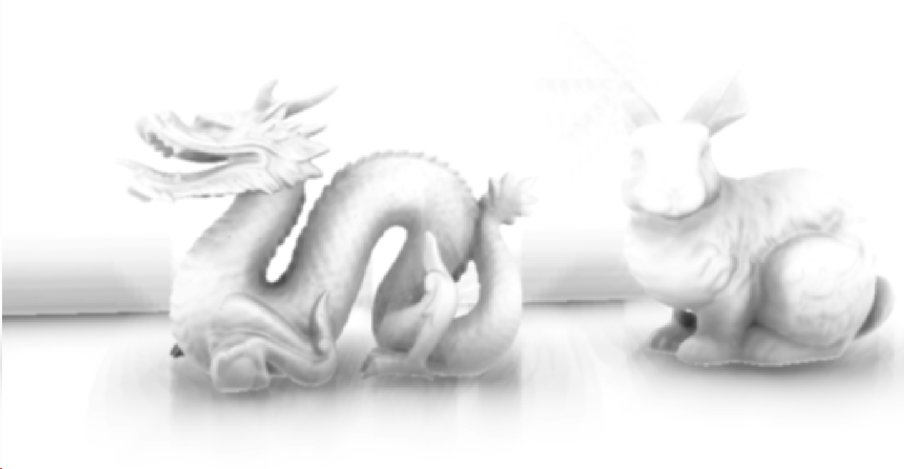

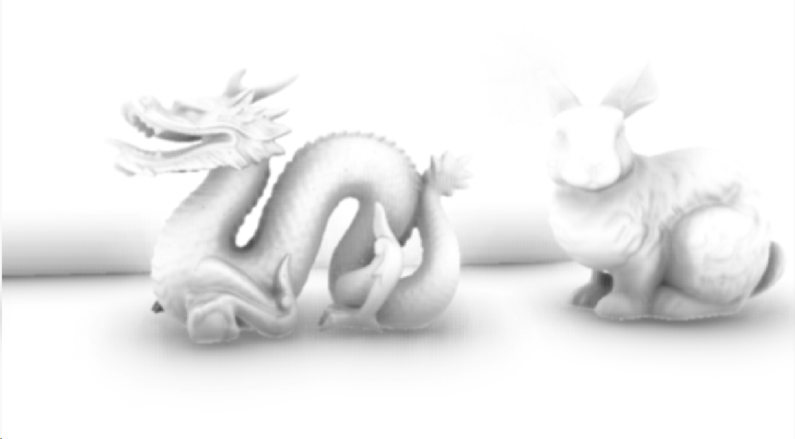

```C++

half frag(v2f IN) : SV_Target
{
	...
	float stepAng = TWO_PI / DIRECTIONS;

	float ao = 0;

	UNITY_UNROLL
	for (int d = 0; d < DIRECTIONS; ++d)
	{
		float angle = stepAng * (float(d) + rand.x);

		float cosAng, sinAng;
		sincos(angle, sinAng, cosAng);
		float2 direction = float2(cosAng, sinAng);

		float rayPixels = frac(rand.y) * stepSize + 1.0;

		UNITY_UNROLL
		for (int s = 0; s < STEPS; ++s)
		{
			//TODO:ComputeAO
		}
	}

	return ao;
}

```

在循环里面累加AO.

偏移UV, 得到新的偏移ViewPos.

利用 当前ViewPos, 当前Normal, 偏移ViewPos, 调用**ComputeAO**方法得到AO值, 方法在后面补充.

```C++

half frag(v2f IN) : SV_Target
{
	...
	UNITY_UNROLL
	for (int s = 0; s < STEPS; ++s)
	{
		float2 snappedUV = round(rayPixels * direction) * _ScreenSize.zw + uv;
		float3 tempViewPos = GetViewPos(snappedUV);
		rayPixels += stepSize;
		float tempAO = ComputeAO(viewPos, nor, tempViewPos);
		ao += tempAO;
	}
	...
}

```

### **3.4 ComputeAO**

完善**ComputeAO**方法.

这里的公式跟上面的PPT不一样, 但是思想大致相同.

首先上面PPT用的是重新生成的面法线, 所以要做起始角度的补偿. 但是这里用的是顶点插值生成的法线. 所以去掉了角度补偿.

接着我这里用的是累加每个Marching的AO值, 而文章是找到最大值角度值去计算AO.

NoV越大, 说明两个向量的角度越小, 即V靠近N, 周围的物体比较高, AO则越强. NoV 别忘了减去 settings 传入的 **_AngleBias** . 

rsqrt(VoV) = 1 / sqrt(VoV) = 1 / sqrt(dot(VoV)) = 1 / length(V);

NoV = dot(n, v) * rsqrt(VoV) = dot(n, v / length(v)) = dot(n, normalize(v));

然后还要考虑到距离的衰减, 这里用了一个简单的公式: 1 - (dist^2 / maxDist^2).

为什么要 **_AngleBias** ?

不然在弧形区域会出现不连续的问题, 即出现一段一段的AO. 不过我自己试验了一下好像没有出现.

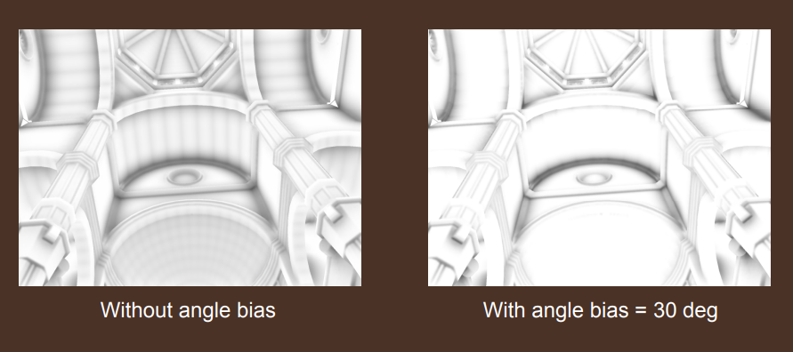

为什么要距离衰减?

距离衰减可以解决距离过渡导致的跳变的问题, 使其淡出更柔和. 而且还能解决在距离过大的时候, 但是还会计算AO的问题.

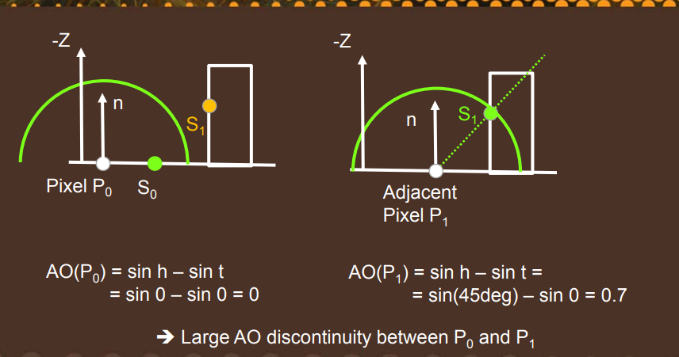

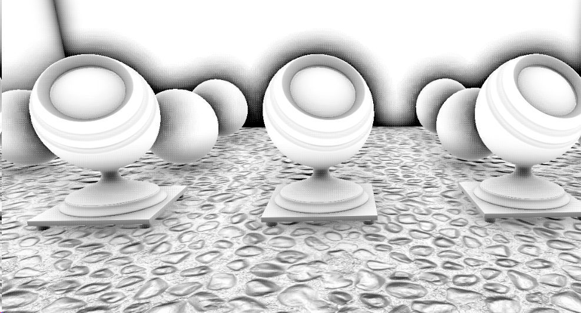

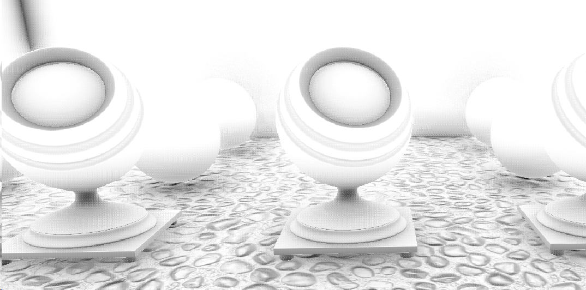

```C++

float Falloff(float distanceSquare)
{
	return distanceSquare * _NegInvRadius2 + 1.0;
}

float ComputeAO(float3 p, float3 n, float3 s)
{
	float3 v = s - p;
	float VoV = dot(v, v);
	float NoV = dot(n, v) * rsqrt(VoV);

	return saturate(NoV - _AngleBias) * saturate(Falloff(VoV));
}

v2f vert(a2v IN)
{
	...
}

...

```

### **3.5 强度**

最后就是把上面累加的AO除以Count, 再把Settings的强度乘进去.

Settings的强度里面有考虑 **AngleBias** . 不然bias过大就会让AO显得很弱 偏白. 所以 引入 **_AOMultiplier** , **AngleBias** 越大, **_AOMultiplier** 会越小, 让AO越黑.

因为上面z>_MaxDistance 直接 return 1, 太过于突兀了. 所以这里再考虑一个AO距离的衰减.

```C++

half frag(v2f IN) : SV_Target
{
	...

	float ao = 0;

	UNITY_UNROLL
	for (int d = 0; d < DIRECTIONS; ++d)
	{
		...
	}

	//apply bias multiplier
	ao *= _Intensity * _AOMultiplier / (STEPS * DIRECTIONS);

	float distFactor = saturate((viewPos.z - (_MaxDistance - _DistanceFalloff)) / _DistanceFalloff);

	ao = lerp(saturate(1 - ao), 1, distFactor);

	return ao;
}

```

HBAO第一个pass写完基本就是下图这样, 充满噪点, 放大看就是一个格子一个格子的跳变. 后面就是横竖两次Blur就够了.

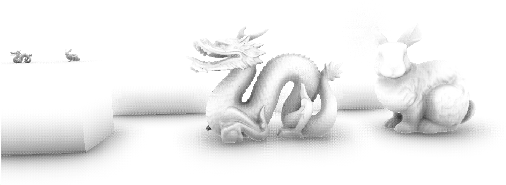

-----------------

## **4. Blur**

### **4.1 C#**

在**HBAORenderPass.cs**文件中, 修改**Execute**方法 添加blur pass. 

再申请一个BlurRT. 把AORT作为Input, BlurRT作为Target, 进行一次Horizontal Blur. 再把BlurRT作为Input, AORT作为Target, 进行一次Vertical Blur.

最后别忘了销毁申请的BlurRT.

```C++

public class HBAORenderPass : ScriptableRenderPass
{
	...

	public override void Execute(ScriptableRenderContext context, ref RenderingData renderingData)
	{
		var cmd = CommandBufferPool.Get();
		using (new ProfilingScope(cmd, profilingSampler))
		{
			...
			CoreUtils.DrawFullScreen(cmd, effectMat, null, 0);

			cmd.GetTemporaryRT(hbaoBlurRT_ID, width, height, 0, FilterMode.Bilinear, RenderTextureFormat.R8, RenderTextureReadWrite.Linear);

			
			cmd.SetGlobalFloat(blurSharpness_ID, settings.sharpness);

			cmd.SetGlobalVector(blurDeltaUV_ID, new Vector4(1.0f / width, 0, 0, 0));
			cmd.SetGlobalTexture(aoTex_ID, hbaoRT_ID);
			cmd.SetRenderTarget(hbaoBlurRT_ID);
			CoreUtils.DrawFullScreen(cmd, effectMat, null, 1);
			
			cmd.SetGlobalVector(blurDeltaUV_ID, new Vector4(0, 1.0f / height, 0, 0));
			cmd.SetGlobalTexture(aoTex_ID, hbaoBlurRT_ID);
			cmd.SetRenderTarget(hbaoRT_ID);
			CoreUtils.DrawFullScreen(cmd, effectMat, null, 1);

			//TODO:Combine

			cmd.ReleaseTemporaryRT(hbaoRT_ID);
			cmd.ReleaseTemporaryRT(hbaoBlurRT_ID);
		}
		context.ExecuteCommandBuffer(cmd);
		CommandBufferPool.Release(cmd);
	}

}

```

### **4.2 Shader框架**

返回 **HBAO.shader** , 添加一个新的Blur Pass框架.

后面权重比较需要Depth, 这里先提前加了include **DeclareDepthTexture.hlsl** .

```C++

Shader "HBAO"
{
	SubShader
	{
		...

		Pass
		{

			Name "HBAO"
			...
		}

		Pass
		{
			Name "Blur"

			HLSLPROGRAM
			#pragma vertex vert
			#pragma fragment frag

			#include "Packages/com.unity.render-pipelines.core/ShaderLibrary/Common.hlsl"
			#include "Packages/com.unity.render-pipelines.universal/ShaderLibrary/Core.hlsl"
			#include "Packages/com.unity.render-pipelines.universal/ShaderLibrary/DeclareDepthTexture.hlsl"

			struct a2v
			{
				uint vertexID :SV_VertexID;
			};

			struct v2f
			{
				float4 pos:SV_Position;
				float2 uv:TEXCOORD0;
			};

			v2f vert(a2v IN)
			{
				v2f o;
				o.pos = GetFullScreenTriangleVertexPosition(IN.vertexID);
				o.uv = GetFullScreenTriangleTexCoord(IN.vertexID);
				return o;
			}

			half frag(v2f IN) : SV_Target
			{
				float2 uv = IN.uv;

				return 0;
			}
			ENDHLSL
		}
	}
}

```

添加C#传入的属性 和 KERNEL_RADIUS(模糊半径).

```C++

Pass
{
	Name "Blur"

	HLSLPROGRAM

	...
	struct v2f
	{
		...
	};

	#define KERNEL_RADIUS 2

	TEXTURE2D(_AOTex);
	SAMPLER(sampler_AOTex);

	float _BlurSharpness;
	float2 _BlurDeltaUV;

	v2f vert(a2v IN)
	{
		...
	}

	...
	ENDHLSL
}

```

### **4.3 提前准备**

在Blur之前还要写一些方法.

**FetchAOAndDepth** . 传入UV, 得到AO和线性的0~1深度.

```C++

...
float2 _BlurDeltaUV;

void FetchAOAndDepth(float2 uv, inout float ao, inout float depth)
{
	ao = SAMPLE_TEXTURE2D_LOD(_AOTex, sampler_AOTex, uv, 0).r;
	depth = SampleSceneDepth(uv);
	depth = Linear01Depth(depth, _ZBufferParams);
}

v2f vert(a2v IN)
{
	...
}


half frag(v2f IN) : SV_Target
{
	...
}

```

再添加三个方法, **CrossBilateralWeight**, **ProcessSample** , **ProcessRadius**.

**CrossBilateralWeight**, 通过采样半径和深度差得到一个滤波权重.

**ProcessSample**, 累加 滤波权重 和 AO*滤波权重, 后面得到平均AO用.

**ProcessRadius**, 循环偏移UV进行采样和累加.

```C++

void FetchAOAndDepth(float2 uv, inout float ao, inout float depth)
{
	...
}

float CrossBilateralWeight(float r, float d, float d0)
{
	float blurSigma = KERNEL_RADIUS * 0.5;
	float blurFalloff = 1.0 / (2.0 * blurSigma * blurSigma);

	float dz = (d0 - d) * _ProjectionParams.z * _BlurSharpness;
	return exp2(-r * r * blurFalloff - dz * dz);
}

void ProcessSample(float ao, float d, float r, float d0, inout float totalAO, inout float totalW)
{
	float w = CrossBilateralWeight(r, d, d0);
	totalW += w;
	totalAO += w * ao;
}

void ProcessRadius(float2 uv0, float2 deltaUV, float d0, inout float totalAO, inout float totalW)
{
	float ao;
	float d;
	float2 uv;
	UNITY_UNROLL
	for (int r = 1; r <= KERNEL_RADIUS; r++)
	{
		uv = uv0 + r * deltaUV;
		FetchAOAndDepth(uv, ao, d);
		ProcessSample(ao, d, r, d0, totalAO, totalW);
	}
}

v2f vert(a2v IN)
{
	...
}

```

### **4.4 Blur**

直接在frag中调用刚才创建的方法. 即累加AO除权就好了.

```C++

half frag(v2f IN) : SV_Target
{
	float2 uv = IN.uv;
	float2 deltaUV = _BlurDeltaUV;

	float totalAO;
	float depth;
	FetchAOAndDepth(uv, totalAO, depth);
	float totalW = 1.0;

	ProcessRadius(uv, -deltaUV, depth, totalAO, totalW);
	ProcessRadius(uv, +deltaUV, depth, totalAO, totalW);

	totalAO /= totalW;

	return totalAO;
}

```

Blur这一步做完就是下图这样. 之后就是要Combine了.

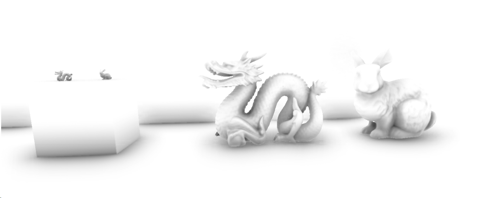

-----------------

## **5. Combine**

### **5.1 C#**

最后就是把AO图贴回到主画布上.

我这里用的是Unity2022, API和2021有点不一样.

返回 **HBAORenderPass.cs** , 继续修改 **Execute** 方法. 其实就是把AOTex传给Shader, 再SetRT为ColorTarget, 最后执行全屏绘制.

```C#

public class HBAORenderPass : ScriptableRenderPass
{
	...

	public override void Execute(ScriptableRenderContext context, ref RenderingData renderingData)
	{
		var cmd = CommandBufferPool.Get();
		using (new ProfilingScope(cmd, profilingSampler))
		{
			...
			CoreUtils.DrawFullScreen(cmd, effectMat, null, 1);

			cmd.SetGlobalTexture(aoTex_ID, hbaoRT_ID);
			cmd.SetRenderTarget(renderingData.cameraData.renderer.cameraColorTargetHandle);
			CoreUtils.DrawFullScreen(cmd, effectMat, null, 2);

			cmd.ReleaseTemporaryRT(hbaoRT_ID);
			...
		}
		context.ExecuteCommandBuffer(cmd);
		CommandBufferPool.Release(cmd);
	}
}

```

### **5.2 Shader**

Shader这里准备用Color Blend(OM)模式来做, 我们把AO的值当作Alpha来输出. 最后就是 finalColor = DestRT.rgb(原图颜色) * srcAlpha(AO) + srcColor(白色) * 0 .

为什么原图的rgb要输出白色?
因为方便改Color Blend(OM)进行debug. 比如说 把 Blend SrcAlpha Zero 改成 Blend SrcAlpha Zero 就可以直接进行debug了.

修改 **HBAO.Shader** 文件, 加一个CombinePass.

```C++

Shader "HBAO"
{
	SubShader
	{
		...

		Pass
		{

			Name "HBAO"
			...
		}

		Pass
		{
			Name "Blur"
		}

		Pass
		{
			Name "Combine"

			Blend Zero SrcAlpha
			// Blend SrcAlpha Zero

			HLSLPROGRAM
			#pragma vertex vert
			#pragma fragment frag

			#include "Packages/com.unity.render-pipelines.core/ShaderLibrary/Common.hlsl"
			#include "Packages/com.unity.render-pipelines.universal/ShaderLibrary/Core.hlsl"

			struct a2v
			{
				uint vertexID :SV_VertexID;
			};

			struct v2f
			{
				float4 pos:SV_Position;
				float2 uv:TEXCOORD0;
			};

			TEXTURE2D(_AOTex);
			SAMPLER(sampler_AOTex);

			v2f vert(a2v IN)
			{
				v2f o;
				o.pos = GetFullScreenTriangleVertexPosition(IN.vertexID);
				o.uv = GetFullScreenTriangleTexCoord(IN.vertexID);
				return o;
			}

			half4 frag(v2f IN) : SV_Target
			{
				half ao = SAMPLE_TEXTURE2D_LOD(_AOTex, sampler_AOTex, IN.uv, 0).x;

				return half4(1, 1, 1, ao);
			}
			ENDHLSL
		}
	}
}

```

这样做完了一个简单的HBAO. 下面是Combine之后的对比图, 效果能凑活着用.

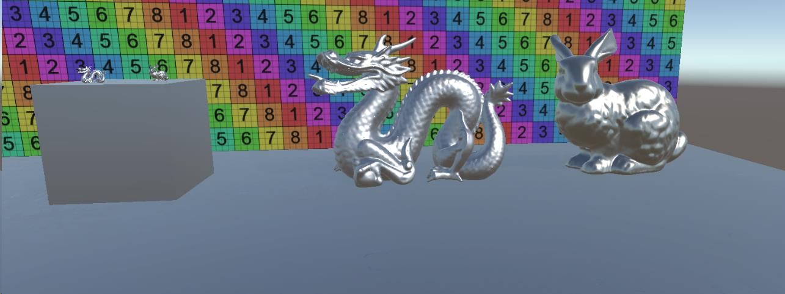

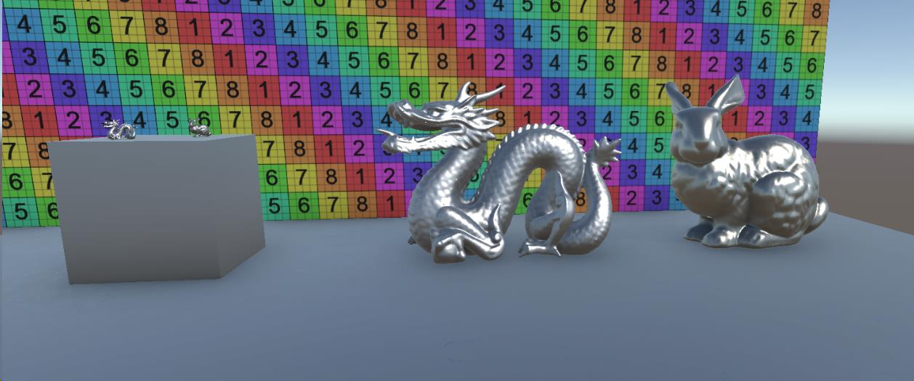

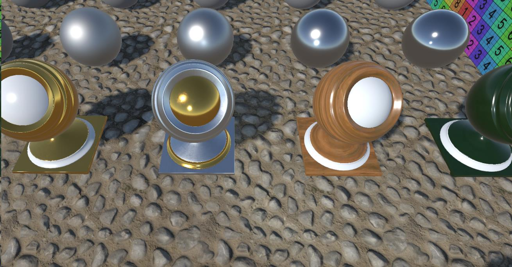

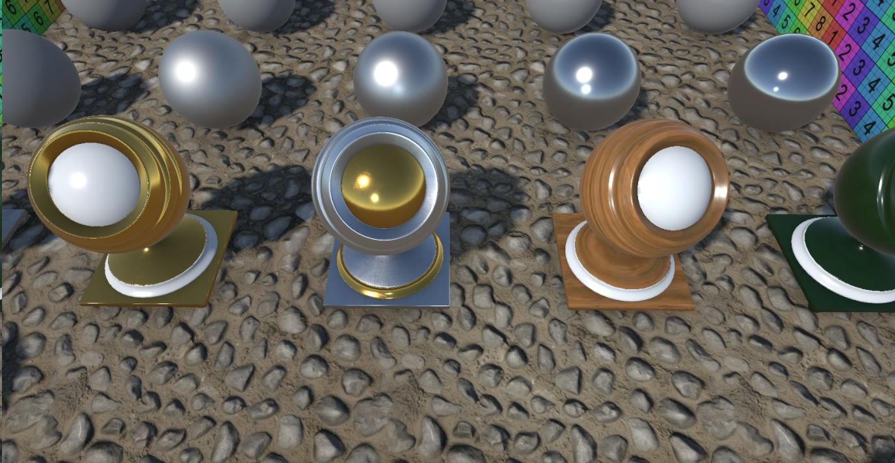

-----------------

在计算AO和Blur阶段, 感觉用Compute Shader应该会快一点. 用groupshared 去缓存depth, 从而减少采样. 

项目中感觉可以用半分辨率+更少的方向划分和步进, 效果其实差不了多少.

下面还有一些别人的文章, 里面有代码和其它的AO可以做参考. 

[图形学基础|环境光遮蔽（Ambient Occlusion）][6]

[【论文复现】Image-Space Horizon-Based Ambient Occlusion][7]

[环境遮罩][8]

-----------------

写完印度の剑3正好上线, 芜湖起飞!

-----------------

[1]:https://github.com/HHHHHHHHHHHHHHHHHHHHHCS/MyStudyNote/blob/main/MyNote/%E5%86%99%E5%86%99%E7%AE%80%E5%8D%95%E7%9A%84HBAO.md
[2]:https://developer.download.nvidia.cn/presentations/2008/SIGGRAPH/HBAO_SIG08b.pdf
[3]:https://zhuanlan.zhihu.com/p/103683536
[4]:https://github.com/GPUOpen-Effects/FidelityFX-CACAO/tree/master/sample
[5]:https://github.com/scanberg/hbao
[6]:https://blog.csdn.net/qjh5606/article/details/120001743
[7]:https://zhuanlan.zhihu.com/p/367793439
[8]:https://zhuanlan.zhihu.com/p/545497019