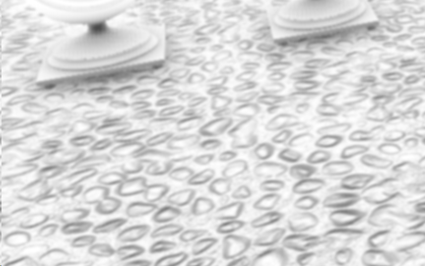

写写简单的HBAO
======

(Github正常排版: [写写简单的HBAO][1])

-----------------

<!-- @import "[TOC]" {cmd="toc" depthFrom=1 depthTo=6 orderedList=false} -->

<!-- code_chunk_output -->

- [**0. 起因**](#0-起因)
- [**1. 原理**](#1-原理)
- [**2. C#**](#2-c)
  - [**2.1 RenderSettings**](#21-rendersettings)
  - [**2.2 RenderFeature**](#22-renderfeature)
  - [**2.3 RenderPass**](#23-renderpass)

<!-- /code_chunk_output -->

-----------------

## **0. 起因**

&emsp;&emsp; URP有SSAO, HDRP有GTAO. 所以摆烂学一个HBAO.

下面是效果图.


下面是URP的SSAO. 可以发现HBAO会软很多, 慢慢淡出.


下面是自己洗的GTAO, 调参没有调对. GTAO多了多次弹射的结果, 感觉更黑了.


下面随便写的RayTracingAO, 也没有仔细的调参. 但是基本的视觉效果是有了.


自己调参可能有点不准确, 这是官方给的对比图.


HBAO对比SSAO采样次数更少, 效果也好很多. 虽然可以用TSSAO来减少采样和降低噪点.

-----------------

## **1. 原理**

&emsp;&emsp; HBAO, Image-Space Horizon-Based Ambient Occlusion, 水平基准环境光遮蔽, 是一项英伟达于2008年提出的SSAO衍生版, 效果比SSAO更好. [文章地址][2]

YiQiuuu的有篇文章是关于HBAO原理和实现, 讲的详细且不错, [文章地址][3]. 这里直接快速引用概括一下.


1. 屏幕上的每一个像素, 做一个四等分的四条射线, 然后随机旋转一下. 每一个像素的随机角度不能一样, 否则效果很怪/是错的. 这里的四等分也可以是六等分, 八等分...


2. 对于任意一条射线, 沿着射线方向生成一个一维的高度. 然后根据深度做RayMarch找到一个最大的水平角(Horizon Angle).


3. 根据点P和它的法线(面法线), 计算它的切面角(Tangent Angle).


4. 根据Horizon Angle和Tangent Angle, 得到AO. AO = sin(h) - sin(t).

至于为什么AO=角度差值? 

我的理解(个人理解)是 周围的东西对比当前点越高, 则表示光被周围东西遮挡的越多, 则越暗.


为什么用面法线, 而不是顶点插值法线?


看官网的PPT是说 如果用顶点插值法线去计算会得到错误的遮挡.

如果我们用的是顶点插值法线, 当P在拐弯位置的时候, 顶点插值法线和面法线不一致. 计算的半球起始位置就可能会是错的.

而根据View Space 利用ddx/ddy重新生成的法线是对的. 之前的SSAO篇中有介绍怎么重新生成法线.

但是我下面的代码还是会用GBuffer的NormalMap, 首先为了提高性能. 

下面是我用ddx/ddy重新生成的法线出的效果. 发现会出现奇怪的死黑的边缘和锯齿.


如果用的是比较复杂算法生成NormalMap, 看着效果和Gbuffer的NormalMap产生的效果也差不多.


不过物体一般都有NormalMap, 我们用深度图重新生成的Normal是没有NormalMap的. 比如地表的石子用的是NormalMap.




因此我这里还是用的GBuffer的Normal 或者 DepthNormals Pass 生成的NormalRT.

-----------------

## **2. C#**

&emsp;&emsp; 个人习惯, 先写C#吧.

### **2.1 RenderSettings**

创建一个C#文件**HBAORenderFeature.cs**. 先写RenderSettings.

```C#

using UnityEngine;
using UnityEngine.Rendering;
using UnityEngine.Rendering.Universal;

[System.Serializable]
public class HBAORenderSettings
{
	[Range(0.0f, 1.0f)] public float intensity = 1.0f;
	[Range(0.25f, 5.0f)] public float radius = 1.2f;
	[Range(16f, 256f)] public float maxRadiusPixels = 256;
	[Range(0.0f, 0.5f)] public float angleBias = 0.05f;
	[Min(0)] public float maxDistance = 150.0f;
	[Min(0)] public float distanceFalloff = 50.0f;
	[Range(0.0f,16.0f)] public float sharpness = 8.0f;
}


```

intensity: AO强度

radius: 射线半径

maxRadiusPixels: 最大半径的像素数量

angleBias: 角度阈值

maxDistance: AO的最大距离, 超过这个距离就没有AO了

distanceFalloff: AO的距离衰减, 淡出用

sharpness: 模糊深度权重

### **2.2 RenderFeature**

然后继续在C#文件**HBAORenderFeature.cs**中, 写RenderFeature. **HBAORenderPass** 在后面补充.

因为URP的生命周期越来越神奇 存在反复调用, 所以我用**OnCreate()**和flag来管理.

这里只是demo, **renderPassEvent**我是随便写的. 比如这里是**RenderPassEvent.BeforeRenderingPostProcessing**.

```C#

using UnityEngine;
using UnityEngine.Rendering;
using UnityEngine.Rendering.Universal;

[System.Serializable]
public class HBAORenderSettings
{
	...
}

public class HBAORenderFeature : ScriptableRendererFeature
{
	public Shader effectShader;
	public HBAORenderSettings renderSettings;

	private bool needCreate;
	private HBAORenderPass renderPass;
	private Material effectMat;

	public override void Create()
	{
		needCreate = true;
	}

	protected override void Dispose(bool disposing)
	{
		CoreUtils.Destroy(effectMat);
		if (renderPass != null)
		{
			renderPass.OnDestroy();
			renderPass = null;
		}
	}

	public void OnCreate()
	{
		if (!needCreate)
		{
			return;
		}

		needCreate = false;

		if (renderPass == null)
		{
			renderPass = new HBAORenderPass()
			{
				renderPassEvent = RenderPassEvent.BeforeRenderingPostProcessing,
			};
		}

		if (effectMat == null || effectMat.shader != effectShader)
		{
			CoreUtils.Destroy(effectMat);
			if (effectShader != null)
			{
				effectMat = CoreUtils.CreateEngineMaterial(effectShader);
			}
		}

		renderPass.OnInit(effectMat, renderSettings);
	}

	public override void AddRenderPasses(ScriptableRenderer renderer, ref RenderingData renderingData)
	{
		if (effectShader == null)
		{
			return;
		}

		OnCreate();
		renderer.EnqueuePass(renderPass);
	}
}

```

到这里RenderFeature基本就写完了.

### **2.3 RenderPass**

创建**HBAORenderPass.cs**文件. 先写一个基础框架.

```C#

using UnityEngine;
using UnityEngine.Rendering;
using UnityEngine.Rendering.Universal;

public class HBAORenderPass : ScriptableRenderPass
{
	private const string k_tag = "HBAO";

	private HBAORenderSettings settings;
	private Material effectMat;

	public HBAORenderPass()
	{
		profilingSampler = new ProfilingSampler(k_tag);
	}

	public void OnInit(Material _effectMat, HBAORenderSettings _renderSettings)
	{
		effectMat = _effectMat;
		settings = _renderSettings;
	}

	public void OnDestroy()
	{
	}

	public override void Configure(CommandBuffer cmd, RenderTextureDescriptor cameraTextureDescriptor)
	{
	}

	public override void Execute(ScriptableRenderContext context, ref RenderingData renderingData)
	{
		var cmd = CommandBufferPool.Get();
		using (new ProfilingScope(cmd, profilingSampler))
		{
			
		}

		context.ExecuteCommandBuffer(cmd);
		CommandBufferPool.Release(cmd);
	}
}

```

-----------------

Settings

C#

Shader

Blur

-----------------

Low-Tessellation问题
bias

不连续问题
衰减

噪声
blur


-----------------

[1]:https://github.com/HHHHHHHHHHHHHHHHHHHHHCS/MyStudyNote/blob/main/MyNote/%E5%86%99%E5%86%99%E7%AE%80%E5%8D%95%E7%9A%84HBAO.md
[2]:https://developer.download.nvidia.cn/presentations/2008/SIGGRAPH/HBAO_SIG08b.pdf
[3]:https://zhuanlan.zhihu.com/p/103683536


https://blog.csdn.net/qjh5606/article/details/120001743

https://www.csdn.net/tags/MtTaAg2sOTIzOTM4LWJsb2cO0O0O.html

https://zhuanlan.zhihu.com/p/367793439