写轮眼个CapsuleAO
======

(Github正常排版: [写轮眼个CapsuleAO][1])

-----------------


<!-- @import "[TOC]" {cmd="toc" depthFrom=1 depthTo=6 orderedList=false} -->

<!-- code_chunk_output -->

- [**0. 起因**](#0-起因)
- [**1. 原理**](#1-原理)
- [**2. 先写个Capsule**](#2-先写个capsule)
  - [**2.1. frag**](#21-frag)
  - [**2.2. GetCapsuleColor**](#22-getcapsulecolor)
  - [**2.3. CapsuleIntersect**](#23-capsuleintersect)
  - [**2.4. CapsuleNormal**](#24-capsulenormal)
  - [**2.5. Lighting**](#25-lighting)
  - [**2.6. Floor**](#26-floor)
  - [**2.7. CapsuleShadow**](#27-capsuleshadow)
  - [**2.8. CapsuleOcclusion**](#28-capsuleocclusion)
  - [**2.9. Final**](#29-final)
- [**3. Unity**](#3-unity)

<!-- /code_chunk_output -->


-----------------

## **0. 起因**

无(you)意间看到了一个Capsule AO插件, 正好学一下(Ctrl+C+V). 请多多支持正版, 我只做学习笔记. [插件地址][2]

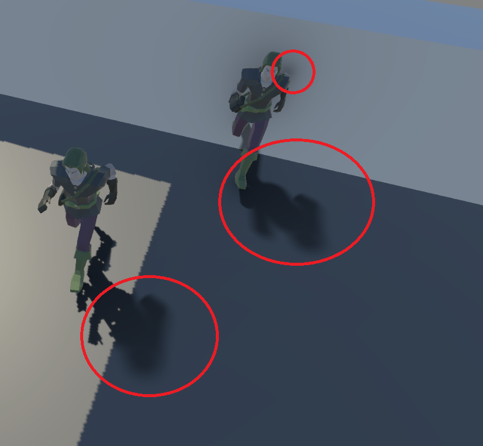

我使用CapsuleAO, 最主要是想要生成影中影和贴近墙壁地板的AO的效果.

UE的Docs上有一个很好的对比图, 比我不知道高到哪里去了. [对比地址][3]. 建议抄UE的代码[UE分享][8].

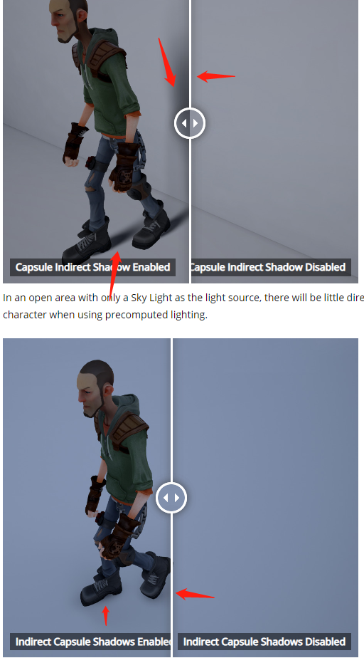

尽可能的跳过了数学的地方. 因为讲起来好复杂啊!!! 还是直接Ctrl+C+V快!!!

-----------------

## **1. 原理**

一句话概括本文的原理, 用胶囊体(Capsule)来替代角色的躯干去模拟Shadow和AO. Screen的WorldPos沿着WorldNormal和LightDir对Capsule做射线检测, 从而产生AO和Shadow.

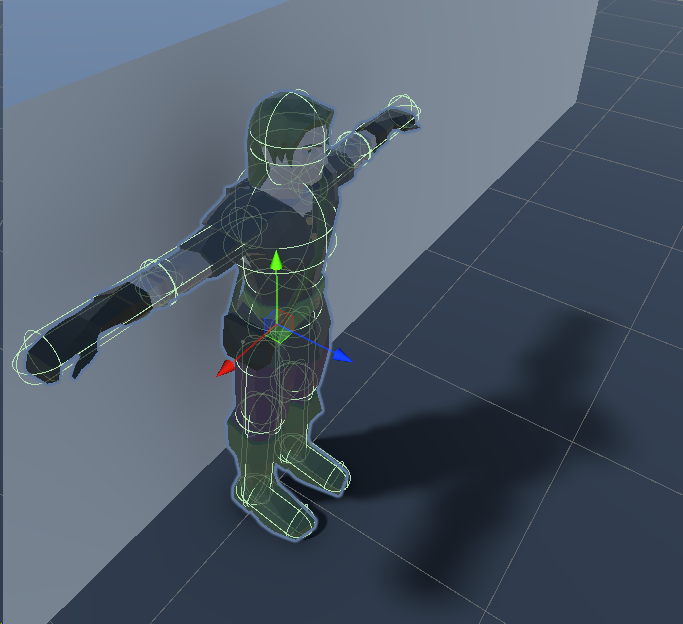

下面内容主要参考(Copy) 简书的 离原春草 的 [Ambient Occlusion技术方案综述][4] 的 CapsuleAO.

雏形是 [Ren2006] & [Sloan 2007] 中用球谐函数SH来对球形遮挡体的可见性进行模拟的. 但是长距离软影, 至少需要2阶球谐函数, 消耗过高. 所以顽皮狗的Michal Iwanicki 在 [SIGGRAPH2013][5] 提出了 Capsule AO. 

CapsuleAO的基础技术原理用球是相似的. 效果主要由AO(Ambient term)和Shadow(Directional term)组成.

AO: 球在半球上投影面积比例.

Shadow: 发射点沿着LightDir 产生一个圆锥(锥角由我们决定, 效果是阴影的软化程度). 球和圆锥的相交面积比例.

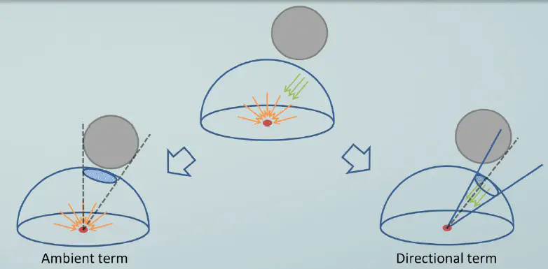

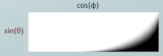

还有一个预计算贴图, 用于Directional term, 是蒙特卡洛算法在离线时预计算出遮挡体与被渲染点几何关系与遮挡值的函数关系. 因为那时是PS3时代, ALU不足, 用贴图采样取代复杂的算法. **但是这篇文章的代码里面并没有用到这个图**.

对于一个给定的锥角而言, 遮挡值可以用遮挡体对于当前点的张角(Θ,theta)以及到球心的射线与椎体轴线夹角(Φ,phi)的函数来表示, 这个结果被存成像上面一样的贴图里. 对于不同的锥角, 可分别输出2D贴图, 然后组成3D贴图. ([文章写数学符号][7])

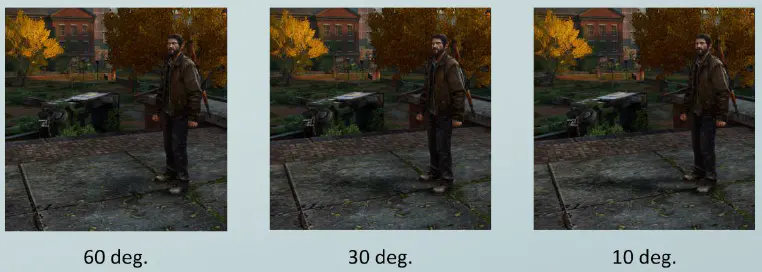

不同的锥角影响着阴影的软化程度, 锥角越大, 软化程度越高。

还有一堆数学公式的可以直接看这篇文章, [文章地址][6].

-----------------

## **2. 先写个Capsule**

可以尝试写(Copy)一下Shader toy 上面 iq大佬的 Capsule AO. 抄完大致先效果如下图, [ShaderToy地址][9].

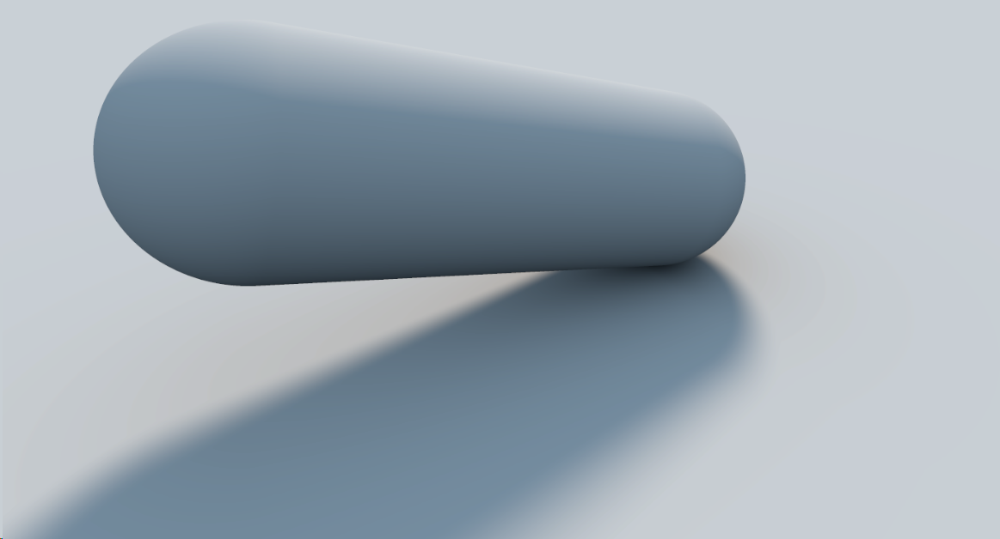

### **2.1. frag**

我直接省去了全屏代码的框架, 需要的可以去之前的文章. 直接创建一个frag方法.

ro是摄像机的位置, 位置会随着时间变化. ta是相机看向哪里, 这里是零点. 大体意思是在一个高0.4, 半径为1的圆环上一直看着零点.

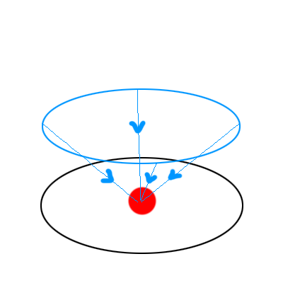

```C++

half4 frag(v2f IN) : SV_Target
{
	const float2 uv = IN.uv;
	const float2 fragCoord = uv * _ScreenParams.xy;
	const float an = 0.5 * _Time.y;
	const float3 ro = float3(1.0 * cos(an), 0.4, 1.0 * sin(an));
	const float3 ta = float3(0, 0, 0);

	float3 tot = float3(0, 0, 0);


	return half4(tot, 1);
}

```

### **2.2. GetCapsuleColor**

然后就是计算颜色. 不过这里他引入了个 AA 的抗锯齿多次采样.

我们定义AA为3, 也就是计算九次, 然后平均.

创建方法 **GetCapsuleColor** 用于得到CapsuleColor(废话).

```C++

#define AA 3

half3 GetCapsuleColor(float3 ta, float3 ro, float2 fragCoord, float2 o)
{
	//TODO: 
}

half4 frag(v2f IN) : SV_Target
{
	...
	float3 tot = float3(0, 0, 0);

	#if AA > 1

	for (int m = 0; m < AA; ++m)
	{
		for (int n = 0; n < AA; ++n)
		{
			float2 o = float2(m, n) / float(AA) - 0.5;
			half3 col = GetCapsuleColor(ta, ro, fragCoord, o);
			tot += col;
		}
	}
	tot /= float(AA * AA);

	#else

	tot = GetCapsuleColor(ta, ro, fragCoord, 0);

	#endif


	return half4(tot, 1);
}

````

再完善刚才写的 **GetCapsuleColor** 方法.

传入的 fragCoord 是像素(如:0 ~ 1920等), o是 offset(如:0 ~ AA), 然后转成屏幕uv(如:-1 ~ 1等). 但是这里为了美观, 不是除以xy(会被拉伸很丑), 而是根据屏幕的长宽比重新做了拉伸, 就是除以了y.

如果除以xy而不是除以y, 就会得到下图这种效果, 拉伸了.

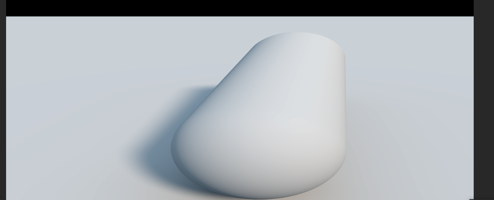

再建立相机的forward, up, right. 因为forward方向基本都是事先知道的, 不会和float3(0,1,0)重合, 所以这里放心大胆使用了.

再生成相机的射线方向 rd.

```C++

half3 GetCapsuleColor(float3 ta, float3 ro, float2 fragCoord, float2 o)
{
	float2 p = (2.0 * (fragCoord + o) - _ScreenParams.xy) / _ScreenParams.y;

	// camera matrix
	float3 ww = normalize(ta - ro);
	float3 uu = normalize(cross(ww, float3(0.0, 1.0, 0.0)));
	float3 vv = normalize(cross(uu, ww));
	// create view ray
	float3 rd = normalize(p.x * uu + p.y * vv + 1.5 * ww);

	return 0;
}

```

### **2.3. CapsuleIntersect**

先做RayTrace CapsuleIntersect. 创建个 **CapsuleIntersect** 方法. 用射线去检测是否碰撞到了Capsule.

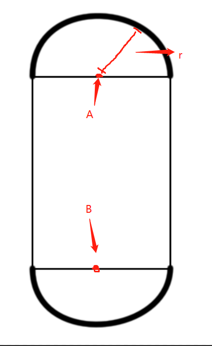

ro, 射线起点. rd, 射线方向. pa, 胶囊体A点. pb, 胶囊体B点. r, 胶囊体半径. 返回值是 射线起点到碰撞点的距离(射线方向需要是Normalize的).

具体的数学这里就不展开BB了, 去搜下挺多的(能用就行). 我是自己用C#写了一版检测, 这里还是用他的吧.

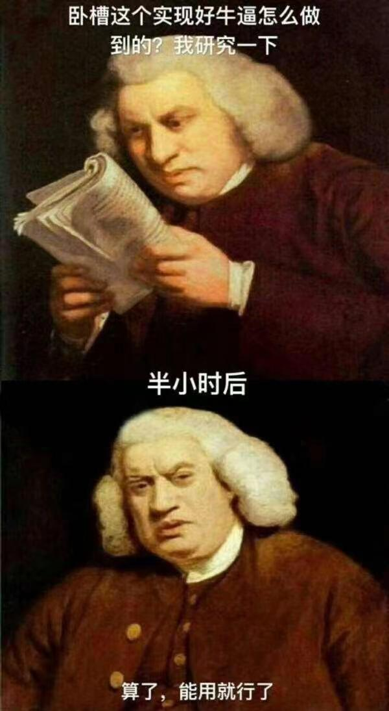


```C++

float CapsuleIntersect(float3 ro, float3 rd, float3 pa, float3 pb, float r)
{
	float3 ba = pb - pa;
	float3 oa = ro - pa;

	float baba = dot(ba, ba);
	float bard = dot(ba, rd);
	float baoa = dot(ba, oa);
	float rdoa = dot(rd, oa);
	float oaoa = dot(oa, oa);

	float a = baba - bard * bard;
	float b = baba * rdoa - baoa * bard;
	float c = baba * oaoa - baoa * baoa - r * r * baba;
	float h = b * b - a * c;
	if (h >= 0.0)
	{
		float t = (-b - sqrt(h)) / a;

		float y = baoa + t * bard;

		// body
		if (y > 0.0 && y < baba)
		{
			return t;
		}

		//capsule
		float3 oc = (y <= 0.0) ? oa : ro - pb;
		b = dot(rd, oc);
		c = dot(oc, oc) - r * r;
		h = b * b - c;
		if (h > 0.0)
		{
			return -b - sqrt(h);
		}
	}
	return -1.0;
}

half3 GetCapsuleColor(float3 ta, float3 ro, float2 fragCoord, float2 o)
{
	...
}

```

返回 **GetCapsuleColor** 方法, 补充代码做个测试.

我们随便定义个胶囊体的a, b, r.

```C++

half3 GetCapsuleColor(float3 ta, float3 ro, float2 fragCoord, float2 o)
{
	...
	float3 rd = normalize(p.x * uu + p.y * vv + 1.5 * ww);

	const float3 capA = float3(-0.3, -0.1, -0.1);
	const float3 capB = float3(0.3, 0.1, 0.4);
	const float capR = 0.2;

	float tmin = 1e+20;

	// capsule
	{
		float t = CapsuleIntersect(ro, rd, capA, capB, capR);
		if (t > 0.0 && t < tmin)
		{
			return 1;
		}
	}

	return 0;
}

```

就能见到下图这样的胶囊体了.

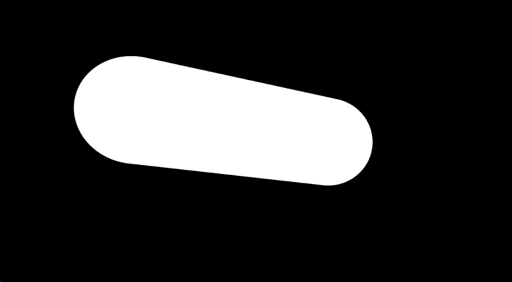

### **2.4. CapsuleNormal**

现在的颜色看起来太单一了, 加入点Normal, 让它Normal点.

加个方法**CapsuleNormal**.

pos = ro + t * rd, 就是射线打到胶囊体的位置. a, b, r不多赘述了.

就是表面的交点 找到 离A到B这条线段最近的点, 两点做连线, 再除以r(做归一化), 就是法线了.

```C++

float CapsuleIntersect(float3 ro, float3 rd, float3 pa, float3 pb, float r)
{
	...
}

float3 CapsuleNormal(float3 pos, float3 a, float3 b, float r)
{
	float3 ba = b - a;
	float3 pa = pos - a;
	float h = clamp(dot(pa, ba) / dot(ba, ba), 0.0, 1.0);
	return (pa - h * ba) / r;
}

half3 GetCapsuleColor(float3 ta, float3 ro, float2 fragCoord, float2 o)
{
	...
}

```

观察下Normal. 修改 **GetCapsuleColor**, 看看Normal 是否 Normal.

加入变量 nor , 方便后面使用.

之前说过射线在胶囊体的碰撞位置就是 ro + t * rd, 然后用 **CapsuleNormal** 计算法线.

```C++

half3 GetCapsuleColor(float3 ta, float3 ro, float2 fragCoord, float2 o)
{
	...
	float tmin = 1e+20;

	float3 nor = float3(0, 0, 0);

	// capsule
	{
		float t = CapsuleIntersect(ro, rd, capA, capB, capR);
		if (t > 0.0 && t < tmin)
		{
			tmin = t;
			float3 pos = ro + t * rd;
			nor = CapsuleNormal(pos, capA, capB, capR);
		}
	}

	return nor;
}

```

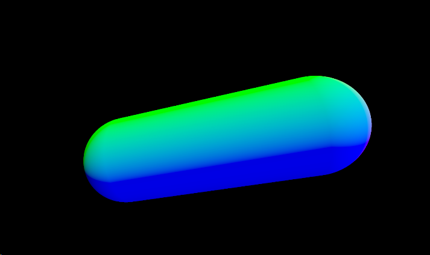

### **2.5. Lighting**

都有normal了, 这不加个自定义的光源, 简单的上个色.

直接用Shader Toy的简单的魔法公式/代码吧, 下面只用好看就行, 不用考虑具体数学物理定义, 毕竟都是魔法.

添加个自定义个光照方向常量 **lig** .

然后再加两个变量 **sha** 阴影系数, **occ** AO系数. occ 根据nor.y来变化. 

胶囊体的颜色 = 环境颜色 * AO + 光颜色 * NoL * shadow * ambient. 

设 ambient = 0.8.

```C++

half3 GetCapsuleColor(float3 ta, float3 ro, float2 fragCoord, float2 o)
{
	...
	const float capR = 0.2;

	const float3 lig = normalize(float3(-0.8, 0.8, 0.2));
	
	float3 col = 0;

	float tmin = 1e+20;
	float sha = 1.0;
	float occ = 1.0;

	float3 nor = float3(0, 0, 0);

	// capsule
	{
		float t = CapsuleIntersect(ro, rd, capA, capB, capR);
		if (t > 0.0 && t < tmin)
		{
			tmin = t;
			float3 pos = ro + t * rd;
			nor = CapsuleNormal(pos, capA, capB, capR);
			occ = 0.5 + 0.5 * nor.y;
			sha = 1.0;
		}
	}

	// lighting
	if (tmin < 1e20)
	{
		float dif = clamp(dot(nor, lig), 0.0, 1.0) * sha;
		float amb = 1.0 * occ;
		col = float3(0.2, 0.3, 0.4) * amb;
		col += float3(0.7, 0.6, 0.5) * dif * 0.8;
	}

	return col;
}

```

上色完成.

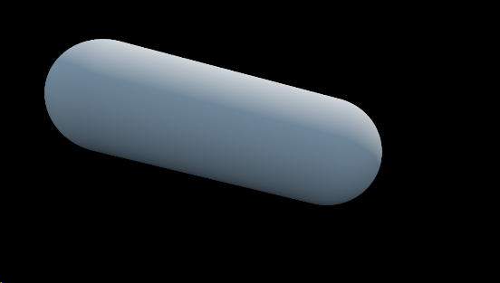

### **2.6. Floor**

写了那么长都差点忘了主题----CapsuleAO, 所以要让胶囊对地板产生效果.

所以先创建个地板吧. 自定义地板高度 **floorHeight** 为 -0.3.

从rayOri(ro)发射的一根射线到地板的距离为 = (地板高度-ro.y) / rd.y. 即把rayDir(rd)拆分成x,y,z 三个方向. 从眼睛到达地板只跟y方向有关. 再根据相似三角形原理, 因为rayDir是normalized的(长度为1), 所以省掉了几个计算指令.

继续修改 **GetCapsuleColor** 方法, 添加常量 **floorHeight** , 添加 floor 的射线检测.

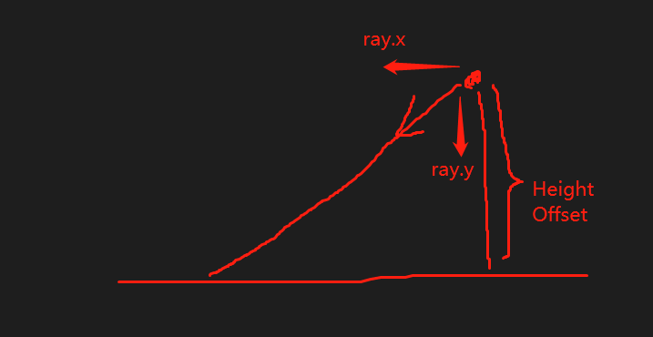


```C++

half3 GetCapsuleColor(float3 ta, float3 ro, float2 fragCoord, float2 o)
{
	...
	const float3 lig = normalize(float3(-0.8, 0.8, 0.2));

	const float floorHeight = -0.3;
	
	...
	float3 nor = float3(0, 0, 0);

	// plane(floor)
	{
		float t = (floorHeight - ro.y) / rd.y;
		if (t > 0.0 && t < tmin)
		{
			tmin = t;
			float3 pos = ro + t * rd;
			nor = float3(0.0, 1.0, 0.0);
		}
	}

	// capsule
	{
		...
	}

	...
}

```

做完效果就是下面这样.

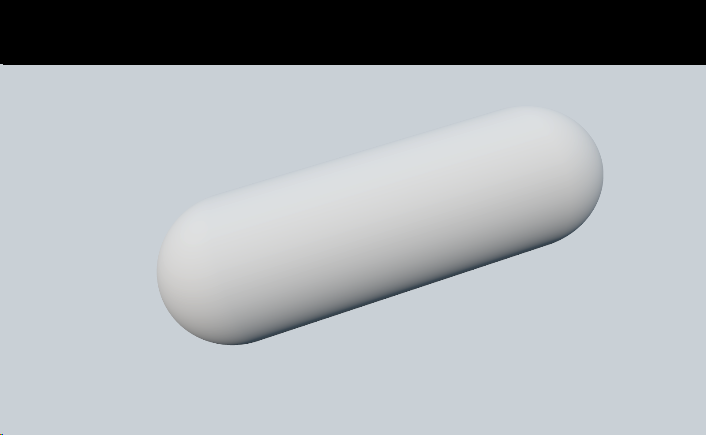


### **2.7. CapsuleShadow**

先添加阴影吧. 

如果以前的做法应该是, 地板上的点沿着光的方向发射射线. 如果射线被阻碍, 则说明是被遮挡的则是阴影.

但是他这里用了另外一种方法(因为要做软阴影, 算是一种假阴影的做法). 地板上的点沿着光的方向发射射线, 计算射线离胶囊体最短的距离. 根据距离判断要阴影的程度.

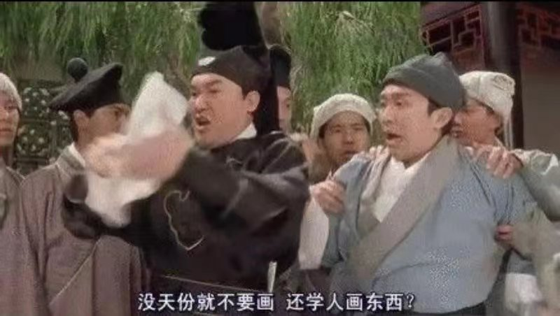

胶囊体可以看成 圆球半径r 球心在a, 然后球心从a位移到b形成的一个形状. 这样射线离胶囊体最近的点可以看成两个线的问题.

射线rord 找到距离线段 ab 最近的点q, 同时找到离射线最近的点p. d = dist(p,q) - r.

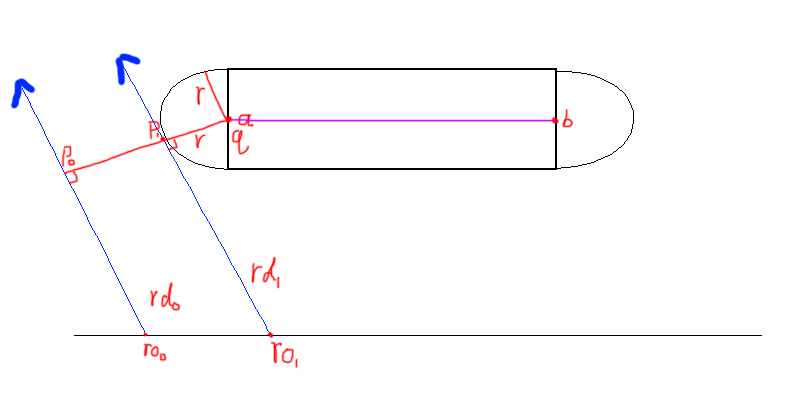

添加 **CapsuleShadow** 方法, 返回射线和胶囊体的最近距离.

```C++

#define AA 3

float CapsuleShadow(float3 ro, float3 rd, float3 a, float3 b, float r, float k)
{
	float3 ba = b - a;
	float3 oa = ro - a;

	float oard = dot(oa, rd);
	float rdba = dot(rd, ba);
	float baba = dot(ba, ba);
	float oaba = dot(oa, ba);
	float2 th = float2(rdba * oaba - oard * baba, oaba - oard * rdba) / (baba - rdba * rdba);

	th.x = max(th.x, 0.0001);
	th.y = clamp(th.y, 0.0, 1.0);

	float3 p = a + ba * th.y;
	float3 q = ro + rd * th.x;
	float d = length(p - q) - r;

	return d;
}

float CapsuleIntersect(float3 ro, float3 rd, float3 pa, float3 pb, float r)
{
	...
}

```

先输出d看看符不符合预想结果. 修改 **GetCapsuleColor** 方法, 添加刚写的 **CapsuleShadow** , 同时修改返回值为 **sha** 进行测试.

```C++

half3 GetCapsuleColor(float3 ta, float3 ro, float2 fragCoord, float2 o)
{
	...
	float3 nor = float3(0, 0, 0);

	// plane(floor)
	{
		float t = (floorHeight - ro.y) / rd.y;
		if (t > 0.0 && t < tmin)
		{
			tmin = t;
			float3 pos = ro + t * rd;
			nor = float3(0.0, 1.0, 0.0);
			//fake soft shadow
			sha = CapsuleShadow(pos + 0.001 * nor, lig, capA, capB, capR, 4.0);

		}
	}

	// capsule
	{
		...
	}

	// lighting
	if (tmin < 1e20)
	{
		...
	}

	return sha;
}

```

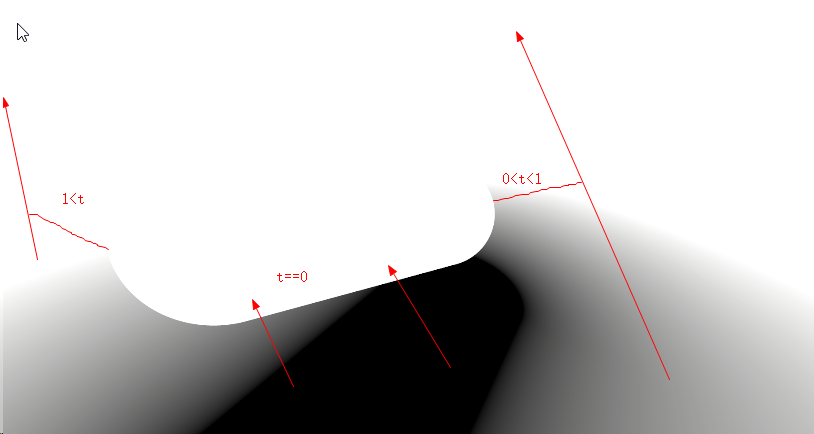

然后再根据距离生成假的阴影效果. 这里为了美观加了点魔法. 同时还有个挺有趣的想法. th.x越大, 说明投影物体离地板越远, 产生的阴影越虚(淡), 但是阴影面积越大. 如果th.x越小, 说明投影物体离地板越近, 产生的阴影越实, 面积越小. 有点类似于PCSS(脑补闫老师的钢笔图吧2333).

继续返回修改 **CapsuleShadow** , 观察修改后的效果.

```C++

float CapsuleShadow(float3 ro, float3 rd, float3 a, float3 b, float r, float k)
{
	...
	float d = length(p - q) - r;

	//fake shadow
	float s = clamp(k * d / th.x + 0.5, 0.0, 1.0);
	return s * s * (3.0 - 2.0 * s);
}

```

下图分别为 当k和d保持不变, th.x为原值, th.x*=10, th.x/=10. 正常效果, 很虚但是面积很大, 很实面积较小. 当然这个效果其实可以通过调节k来实现.

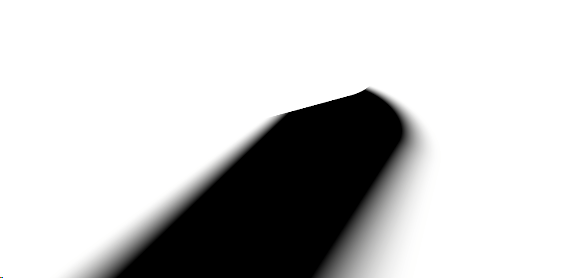

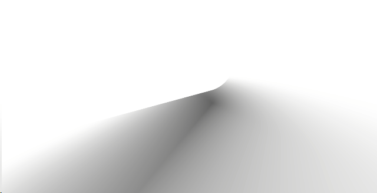

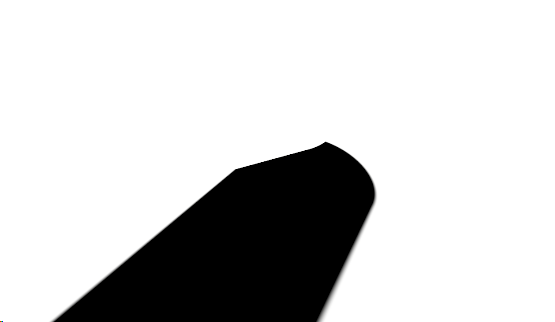

返回 **GetCapsuleColor**, 把之前测试输出的sha 改成回原来的颜色看看. 对味了.

```C++

half3 GetCapsuleColor(float3 ta, float3 ro, float2 fragCoord, float2 o)
{
	...
	// lighting
	if (tmin < 1e20)
	{
		...
	}

	return col;
}

```

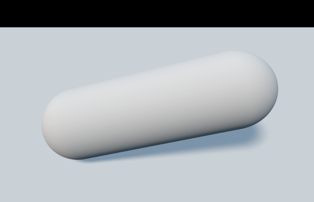

### **2.8. CapsuleOcclusion**

之后就是AO模块了. 这里依旧还是快速跳过数学吧.

可以先看作地板点P 在 线段AB 上的哪个点(记做x)最近. 然后根据 x和P 的距离计算AO. 他这里还考虑到了法线和Dir(x,P).

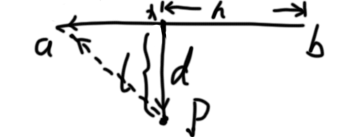

先求h, 就是 dot(pa, ba) / dot(ba, ba), 然后因为要在线段上 所以要clamp01 一下. 

再求方向d, d = pa - x 即 d = pa - h * ba.

得到P离线段AB最近的距离为 l = length(d). 

添加方法 **CapsuleOcclusion** . 这里为了美观加了点别的代码, 自行理解.

```C++

float CapsuleOcclusion(float3 p, float3 n, float3 a, float3 b, float r)
{
	float3 ba = b - a;
	float3 pa = p - a;
	float h = clamp(dot(pa, ba) / dot(ba, ba), 0.0, 1.0);		float t = (floorHeight - ro.y) / rd.y;
		if (t > 0.0 && t < tmin)
		{
			tmin = t;
			float3 pos = ro + t * rd;
			nor = float3(0.0, 1.0, 0.0);
			//fake soft shadow
			sha = CapsuleShadow(pos + 0.001 * nor, lig, capA, capB, capR, 4.0);
	
			//fake occlusion
			occ = CapsuleOcclusion(pos, nor, capA, capB, capR);
		}
	}

	// capsule
	{
		...
	}

	// lighting
	if (tmin < 1e20)
	{
		...
	}
	
	return occ;
}

对比看看, 有无AO效果.


	float3 d = pa - h * ba;
	float l = length(d);
	float o = 1.0 - max(0.0, dot(-d, n)) * r * r / (l * l * l);
	return sqrt(o * o * o);
}

```

修改 **GetCapsuleColor** 方法. 在plane中添加刚写的 **CapsuleOcclusion**, 顺便修改输出值为 **occ**, 方便观察我们刚添加的AO.


```C++

half3 GetCapsuleColor(float3 ta, float3 ro, float2 fragCoord, float2 o)
{

	// plane(floor)
	{
		float t = (floorHeight - ro.y) / rd.y;
		if (t > 0.0 && t < tmin)
		{
			tmin = t;
			float3 pos = ro + t * rd;
			nor = float3(0.0, 1.0, 0.0);
			//fake soft shadow
			sha = CapsuleShadow(pos + 0.001 * nor, lig, capA, capB, capR, 4.0);
	
			//fake occlusion
			occ = CapsuleOcclusion(pos, nor, capA, capB, capR);
		}
	}

	// capsule
	{
		...
	}

	// lighting
	if (tmin < 1e20)
	{
		...
	}
	
	return occ;
}

```

对比看看, 有无AO效果.

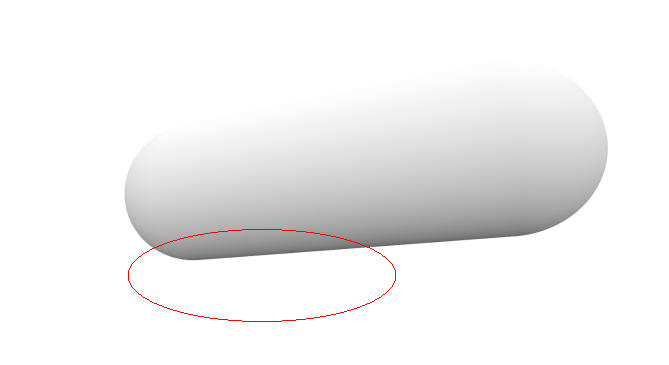

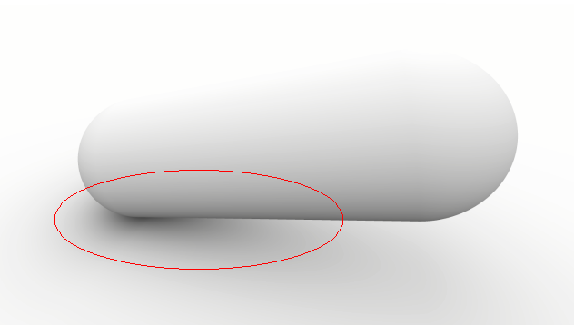

### **2.9. Final**

修改 **GetCapsuleColor** 把之前输出的 occ 改回为 col. 

```C++

half3 GetCapsuleColor(float3 ta, float3 ro, float2 fragCoord, float2 o)
{
	...
	
	// lighting
	if (tmin < 1e20)
	{
		...
	}

	return col;
}

```

ShaderToy Capsule AO 写轮眼完成.

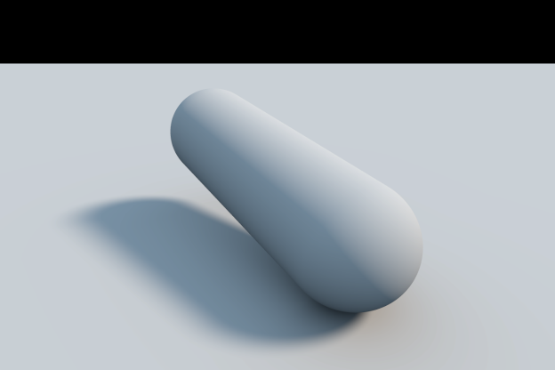

-----------------

## **3. Unity**

写完ShaderToy的版本, 回到游戏中思考(麦麦:别思). 

一个场景有N个角色需要胶囊体阴影. 每个角色由N个胶囊体包裹. 同时每个角色受到光不一样, 导致光线方向不一样和胶囊体阴影强度不一样.

我们用一个 **List\<Capsule\> capsules**记录胶囊体, 这样角色就只用记录他的胶囊体在capsules中的index位置了.

为了避免阴影投影在角色自己身上, 还要记录角色的Renderer. 虽然其实也可以用stencil来解决. 但这里的做法是再次绘制一次角色, if(abs(depth - characterDepth) < eps), 就不产生投影.

下面为开启角色自投影 和 关闭的对比.

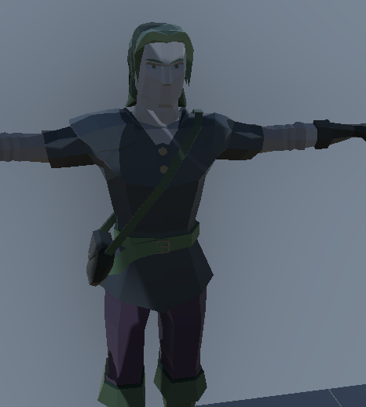

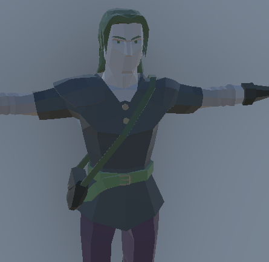

创建一个C# 文件 **CapsuleAOManager.cs** . 添加结构体和数据.

```C#

using System.Collections.Generic;
using UnityEngine;

public struct Capsule
{
	public Vector3 a, b;
	public float radius;
}

public struct Character
{
	public Vector3 position;
	public float radius;
	public int startID, endID;
	public Vector4 lightDir;
}

public class CapsuleV2Manager
{
	private List<Capsule> capsules = new();
	private List<Character> characters = new();
	private List<Renderer> renderers = new();
}

```


-----------------

[1]:https://github.com/HHHHHHHHHHHHHHHHHHHHHCS/MyStudyNote/blob/main/MyNote/%E5%86%99%E8%BD%AE%E7%9C%BC%E4%B8%AACapsuleAO.md
[2]:https://assetstore.unity.com/packages/vfx/shaders/fullscreen-camera-effects/ambient-character-shadows-209214
[3]:https://docs.unrealengine.com/4.27/en-US/BuildingWorlds/LightingAndShadows/CapsuleShadows/Overview/
[4]:https://www.jianshu.com/p/7d0704442306
[5]:http://miciwan.com/SIGGRAPH2013/Lighting%20Technology%20of%20The%20Last%20Of%20Us.pdf
[6]:https://zhuanlan.zhihu.com/p/460444838
[7]:https://gist.github.com/mrquincle/1102e58562411b7f633c08d5dc9a2e1f
[8]:https://zhuanlan.zhihu.com/p/368039787
[9]:https://www.shadertoy.com/view/MlGczG


character shadow
editor
manager
feature
pass
shader


还有Capsule Shadow做法是. 用圆进行不规则拉伸, 把它拉长像胶囊体, 记录Transform Martix. 然后把射线传入矩阵进行判断求交, 这样就可以使用球的公式来计算, 避免用复杂的胶囊体的公式来计算.