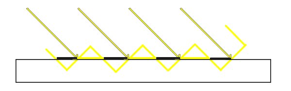

几种简单的阴影效果
======

(Github正常排版: [几种简单的阴影效果][1])

-----------------

<!-- @import "[TOC]" {cmd="toc" depthFrom=1 depthTo=6 orderedList=false} -->

<!-- code_chunk_output -->

- [**0. 起因**](#0-起因)
- [**1. 基础的Shadowmap**](#1-基础的shadowmap)
  - [**1.1. shadowmap**](#11-shadowmap)
  - [**1.2. bias**](#12-bias)
- [**2. PCF**](#2-pcf)
  - [**2.1. 基础版本**](#21-基础版本)
  - [**2.2. 升级版本**](#22-升级版本)
- [**3. PCSS(Percentage-Closer Soft Shadows)**](#3-pcsspercentage-closer-soft-shadows)
  - [**3.1 基础**](#31-基础)
  - [**3.2. 泊松盘采样(Poisson Disc Sampling)**](#32-泊松盘采样poisson-disc-sampling)
- [**4. ESM**](#4-esm)
  - [**4.1. 基础版本**](#41-基础版本)
  - [**4.2. 升级版本**](#42-升级版本)

<!-- /code_chunk_output -->

-----------------

## **0. 起因**

> 早点写完去看宫崎英高跌落神坛. 


&emsp;&emsp; Unity的Shadow贴图利用率挺低的, 所以有时候需要自己重新搞一套阴影.


比如上面这个场景, 可以看到场景在阴影贴图中的利用率非常低. 因为Unity比较保守, 会考虑到背后物体的投影.

所以可以我们可以设置Light 的 View Proj来生成阴影, 进行对比. 反正都是学习嘛.

不过本文主要是讲阴影效果的, 偷懒可以利用摄像机视角找一个好的角度角度设置就当是平行光的ViewProj. (虽然我是用场景的AABB自动设置平行光的位置)

同时也可以参考不帅大佬的shadowmap文章 [常见几种Shadowmap在unity实现][2] , 还有视锥外的阴影物体裁剪的文章 [阴影视锥裁剪实现][3].

-----------------

## **1. 基础的Shadowmap**

### **1.1. shadowmap**

&emsp;&emsp; 没有阴影物体就会显得浮空, 或者无法判断是否和地面有接触, 无法掌握距离感.


之前有Stencil Shadow Volume来生成阴影, 就是通过正面Stencil+1 背面Stencil-1来判断是否, 最后阴影的Stencil中为1. 不过现在基本都是Shadowmap比较多.

https://www.zhihu.com/question/412479769/answer/2349576550

Shadowmap大体的原理是:
  1. 先现在灯光位置放一个摄像机, 记录物体的深度, 叫Shadowmap
  2. 然后观察点P mul(LightVP, P_worldPos), 除以其次坐标, 得到NDC空间下的位置NDCPos.xyz
  3. NDCPos.xy*0.5+0.5 = shadowmapUV, 去采样shadowmap, 得到我们记录的最前面的深度
  4. 通过两个深度比较, 得到shadow


但是基本会得到很严重的摩尔纹, 英文名字叫shadow acne(阴影痤疮???).


下面是来自learnopengl的图. 但是能解释清楚造成摩尔纹的原因了, 就是贴图的精度不够. 视野中的相邻的像素在坐标转换之后可能会采样同一个阴影贴图的位置, 从而导致一些通过一些没有通过.




### **1.2. bias**

这时候就可以引入shadow bias 来解决这个问题. 分别为depth 和 normal两种. 跟上图不一样的是, 这个是在生成阴影贴图的时候把物体的worldPos分别向沿着灯光反方向的偏移 和 沿着normal反方向的进行偏移.

下面是URP的ShadowBias, 多数情况是够用的. 分别是C#和Shader.

C#: 这里删0减了很多代码. 但是可以明显看到有对Shadow Far, 分辨率 和 Soft的适应.

Shadow Far越大, 深度所对应的数据就会越不准确, 所以bias越大. 
分辨率越小, 采样到同一个阴影贴图上的概率概率就会上升, 所以bias越大.
Soft Shadow使用PCF采样, 要对Shadowmap上周围的点采样进行比较, 保证好的结果, 所以bias会变大.

```C#

public static Vector4 GetShadowBias(ref VisibleLight shadowLight,  Matrix4x4 lightProjectionMatrix, float shadowResolution, float depthBias, float normalBias)
{
	float frustumSize = 2.0f / lightProjectionMatrix.m00;
	float texelSize = frustumSize / shadowResolution;
	float depthBias = -depthBias.x * texelSize;
	float normalBias = -normalBias.y * texelSize;

	if (shadowLight.light.shadows == LightShadows.Soft)
	{
		// For now we scale it by the PCF kernel size of non-mobile platforms (5x5)
		const float kernelRadius = 2.5f;
		depthBias *= kernelRadius;
		normalBias *= kernelRadius;
	}

	return new Vector4(depthBias, normalBias, 0.0f, 0.0f);
}

```

Shader, normal bias的强度也有和 法线和灯光的角度有关.

```C++

float4 _ShadowBias; // x: depth bias, y: normal bias

float3 ApplyShadowBias(float3 positionWS, float3 normalWS, float3 lightDirection)
{
    float invNdotL = 1.0 - saturate(dot(lightDirection, normalWS));
    float scale = invNdotL * _ShadowBias.y;

    // normal bias is negative since we want to apply an inset normal offset
    positionWS = lightDirection * _ShadowBias.xxx + positionWS;
    positionWS = normalWS * scale.xxx + positionWS;
    return positionWS;
}

```

但是两个bias都不能调整太大. 不然 depth bias可能会导致漏光或者视觉浮空. normal bias 会镂空, 影子错误(漏光/变形).


Unity其实也有一个API类似于这种Bias, 但是在记录深度的时候做的偏移.

CommandBuffer.SetGlobalDepthBias(float bias, float slopeBias). 具体详情自己可以看官方的API Doc [API地址][4]. 

第一个参数bias, 缩放 GPU 的最小可解析深度缓冲区值以产生恒定的深度偏移。 最小可解析深度缓冲区值因设备而异。 负数为靠近相机, 正数为远离相机. 可以填50000能获得明显的效果. 

第二个参数slopeBias, 深度斜率. 不平行于近剪裁平面和远剪裁平面的多边形具有斜率. 用这个可以产生斜率偏移. 填个2.5就有效果了

Unity的Shadowmap默认值是(1.0, 1.0). URP和HDRP是(1.0, 2.5).

但是要注意使用方法, 在记录shadowmap之前设置参数, 记录完之后要把数值进行归零, 不然会影响后面的效果.

同时还可以看看@zlich的[自适应Shadow Bias算法][5], 里面也介绍了几种bias导致的问题. 还有他给出了bias的适应公式.


并且也提到了在Receive物体上进行shadow bias导致的一种问题. 虽然可以节省一定的计算量, 但是如果光照的角度比较奇葩也会出现问题.

用了zlich的数据:
+ Distance 10
+ 关闭Cascades
+ Directional Light Rotation = (2,30,0)


而且这种情况无论怎样调整bias都无法拯救.

-----------------

## **2. PCF**

### **2.1. 基础版本**

PCF(Percentage Closer Filtering)的主要作用就是产生软阴影. 

做法也很简单, 我们之前是采样一个点, 那么这次我们采样周围几个点的shadowmap和当前点的depth做比较.

先假设是一个简单的PCF 3x3. 其中有x个点在阴影中, 那么阴影的强度就可以从原来的0 or 1, 变成x/9.


当然这个采样点范围可以从3x3, 变成5x5, 7x7等, 但是我们写出来的基本不是这种效果.

先随便举一段简单的PCF 3X3代码.

```C++

for (int y = -1; y <= 1; ++y)
{
	for (int x = -1; x <= 1; ++x)
	{
		float2 uv = shadowMapUV + float2(x * _ShadowMapTex_TexelSize.x, y * _ShadowMapTex_TexelSize.y);
		float shadowMapZ = SampleShadowmap(uv);
		shadowAtten += shadowMapZ > z ? 0.0 : 1.0;
	}
}
return shadowAtten / 9.0;

```

这个出来的大体结果是这样的.


### **2.2. 升级版本**

喂喂. URP的PCF明明更细腻, 更少颗粒感. 我们这个跟抗锯齿一样23333.

首先是我们的采样偏移点没有选好, URP提供了一个计算PCF偏移点的方法. 这里就拿5x5的方法 SampleShadow_ComputeSamples_Tent_5x5 举例子.

```C++

float fetchesWeights[9];
float2 fetchesUV[9];
SampleShadow_ComputeSamples_Tent_5x5(_ShadowMapTex_TexelSize, shadowMapUV, fetchesWeights, fetchesUV);
float shadowAtten = fetchesWeights[0] * IsShadow(fetchesUV[0], z);
shadowAtten += fetchesWeights[1] * IsShadow(fetchesUV[1], z);
shadowAtten += fetchesWeights[2] * IsShadow(fetchesUV[2], z);
shadowAtten += fetchesWeights[3] * IsShadow(fetchesUV[3], z);
shadowAtten += fetchesWeights[4] * IsShadow(fetchesUV[4], z);
shadowAtten += fetchesWeights[5] * IsShadow(fetchesUV[5], z);
shadowAtten += fetchesWeights[6] * IsShadow(fetchesUV[6], z);
shadowAtten += fetchesWeights[7] * IsShadow(fetchesUV[7], z);
shadowAtten += fetchesWeights[8] * IsShadow(fetchesUV[8], z);
return shadowAtten;

```

这个具体计算的代码挺长的就不放了, 有兴趣可以直接搜一下.

具体的原理直接看@zilch的阴影的PCF采样优化算法 [文章地址][6] 和 一个CSDN的相关文章 [文章地址][7]

然后我们使用了上面的UVs和Weights, 但是直接出来的效果是这样的. 而且为什么叫5x5实际上却用的是3x3=9个采样点呢.


首先他用了一个API SampleCmpLevelZero, 来替代我们原来的SampleShadowMap.

这个API和Gather有点类似. 采样一个点, 会同时获取周围的四个像素进行双线性插值.

所以我们的RT一定要设置为Linear, 不能为Point. 不然就是白给 寄.


采样分布差不多是大概是这样的, 所以我们就可以通过9次采样来得到25个点的近似结果.

其它的3x3 7x7也差不多, 使用的采样点数量为((N-1)/2)^2. 

同时我们上面的基础的shadowmap也可以用这个API来完成一个简单的2x2阴影判断. 这比我们单纯在一个点采样效果要好一点.

不过PCF有时候也有问题. 当光和物体趋于平行的时候进行PCF采样也会导致漏光.


-----------------

## **3. PCSS(Percentage-Closer Soft Shadows)**

### **3.1 基础**
直接根据Games202 和 Nvdia文章 [文章地址][14] 和快速介绍下.

目的是越靠近底部阴影越硬, 越远越虚越软. 


会利用到相似三角形. 当blocker点和receiver点的距离越大, 相似变化之后也会越大.


做法: 
  1. 找到遮挡的blocker的平均深度
  2. 根据receiver的深度和blocker平均深度, 确定采样半径r
  3. 用半径r进行PCF采样


### **3.2. 泊松盘采样(Poisson Disc Sampling)**
PCSS需要用到PCF, 这里可以是上面的普通PCF, 也可以是泊松分布的PCF进行采样.

泊松分布, 这里快速讲一下, 具体可以看文章 [文章地址][12] 和 这篇 [文章地址][13].

泊松盘上的任意两点都不会靠的太近, 大于半径r. 分布比较均匀, 并且能用半径r的圆覆盖整个图.


可以看下图, 左边随机分布会出现小集群, 而右边泊松盘就比较均匀的分布.(密恐慎入)


怎么快速生成呢? 毕竟是实时计算的, 讲究一个快. 刚开始想到的是直接用格子, 但是我们要的是随机, 网格太过于工整了.

那么就又想到了等速线. 等速线两圈之间的距离是恒定的, 然后在根据一定线速度的距离去生成采样点. 因为圈比较小, 而且为了更快速, 直接把线速度变成角速度.


```C++

const int count = 32.0;
float poissonAngleStep  = TWOPI * 10.0 / count;
float poissonAngle      = rnd * TWOPI;
float poissonRadius     = 1.0 / count;
float poissonRadiusStep = poissonRadius;

for(int i = 0; i < count; ++i)
{
	float2 offset = float2(cos(poissonAngle), sin(poissonAngle)) * poissonRadius;
	poissonRadius += poissonRadiusStep;
	poissonAngle  += poissonAngleStep;

	float2 uv = inputUV + offset * radius;
}

```


-----------------

## **4. ESM**

### **4.1. 基础版本**

ESM(Exponential Shadow Maps), 这个我看龚敏敏大佬的文章 [文章地址][8] 和原论文 [文章地址][9].

ESM的好处是不用ShadowBias, 不过需要引入一个常量C, 通常是88左右.

做法:
  + 当我们保存shadowmap的时候, 不是写入简单的depth, 而是写入exp(C*depth)
  + 采样阴影的时候, 视野物体的深度Z, exp(-C*Z)
  + 最后阴影强度, saturate(exp(C * depth) * exp(-C * Z))


ESM主要不是为了soft shadow, 所以C要尽可能的大, 从而让Color Bleeding变小, 不过也有极限. 比如32float RT, 如果让C=120f, 那么就会跟下图一样出现错误的效果. 手机端如果是开16float RT那么会更容易溢出.


不过ESM的Shadowmap是可以进行Blur的, 从而产生soft shadow. 比如这里把ESM Shadowmap直接进行一个5x5的高斯模糊, 就可以产生软阴影的感觉了.


### **4.2. 升级版本**

来自于EGSR2013上浙大的文章"Exponential Soft Shadow Mapping" [文章地址][10] 或者直接看这篇知乎有代码 [文章地址][11], 龚敏敏大佬的那篇好像公式裂开了.

主要是解决常量C太大,会导致exp(C*d)会超过float的溢出问题, 而且这套保存切换更通用方便.

因为c*(d-z)本身远远小于c*d, 不容易溢出, 甚至也能支持移动端的16float深度.

做法:
 + 我们需要的是在View Space下线性的dpeth
 + 生成shadowmap阶段, 生成线性的depth (0~1)
 + 计算阶段, 视野的深度Z, 直接exp(C*(z-d))

但是这样就不能直接进行Blur了. 因为强行Blur就会发现胖了一大圈.


在SIGGRAPH 2009的Advances in Real-Time Rendering in 3D Graphics and Games里, Lighting Research at Bungie就提到了logarithmic space filtering的方法. 

利用d-z远小于d或z的原理, 把取值范围缩小了, 精度也因此提高.filtering本身也可以使用这个完成. 其中W是高斯模糊的kernel.


把e提取出来, 剩下部分被称为log space filtering, 这个filter的结果是不会溢出的. 


但是我照着抄完, 发现底部被soft, 反而越远越硬, 不知道哪里写错...

```C++

float diff = 0;
int index = 0;
for (i = -size; i <= size; i++)
{
	for (j = -size; j <= size; j++)
	{

		float di = SampleShadowTex(uv + float2(i, j) * offset);
		diff += weights[index] * exp(C * (di - d0));
		index++;
	}
}

float shadowMapZ = log(diff) + C * d0;

float shadowAtten = saturate(exp(C * z - shadowMapZ));

```


不过我不是很喜欢ESM, 因为他会漏光. 如果反一下就好, 靠近底部阴影实, 顶部阴影虚就好了.


NVDIA 在 GDC 上也有一篇不错的shadow PPT https://developer.download.nvidia.com/presentations/2008/GDC/GDC08_SoftShadowMapping.pdf


[1]:https://github.com/HHHHHHHHHHHHHHHHHHHHHCS/MyStudyNote/blob/main/MyNote/
[2]:https://zhuanlan.zhihu.com/p/454970727
[3]:https://zhuanlan.zhihu.com/p/449889679
[4]:https://docs.unity3d.com/ScriptReference/Rendering.CommandBuffer.SetGlobalDepthBias.html
[5]:https://zhuanlan.zhihu.com/p/370951892
[6]:https://zhuanlan.zhihu.com/p/369761748
[7]:https://blog.csdn.net/cgy56191948/article/details/105726682/
[8]:http://www.klayge.org/2013/10/07/%e5%88%87%e6%8d%a2%e5%88%b0esm/
[9]:https://jankautz.com/publications/esm_gi08.pdf
[10]:http://www.cad.zju.edu.cn/home/jqfeng/papers/Exponential%20Soft%20Shadow%20Mapping.pdf
[11]:https://zhuanlan.zhihu.com/p/408343196
[12]:http://xinyuefei.com/d3/poisson-disc.html
[13]:https://medium.com/@hemalatha.psna/implementation-of-poisson-disc-sampling-in-javascript-17665e406ce1
[14]:https://developer.download.nvidia.com/presentations/2008/GDC/GDC08_SoftShadowMapping.pdf