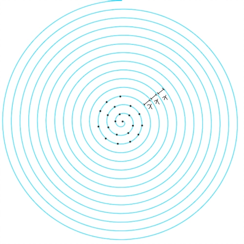
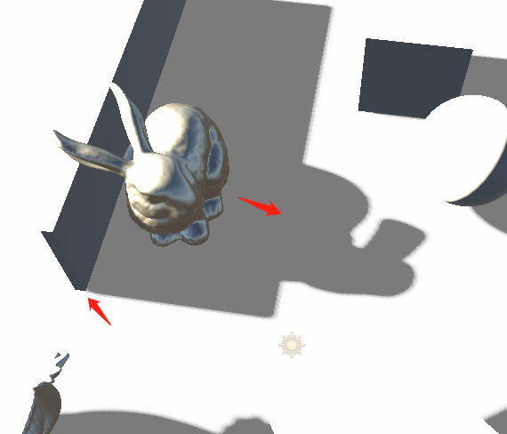

几种简单的阴影效果
======

(Github正常排版: [几种简单的阴影效果][1])

-----------------

<!-- @import "[TOC]" {cmd="toc" depthFrom=1 depthTo=6 orderedList=false} -->

<!-- code_chunk_output -->

- [**0. 起因**](#0-起因)
- [**1. 基础的Shadowmap**](#1-基础的shadowmap)
  - [**1.1 shadowmap**](#11-shadowmap)
  - [**1.2 bias**](#12-bias)
- [**2. PCF(Percentage Closer Filtering)**](#2-pcfpercentage-closer-filtering)
  - [**2.1 基础版本**](#21-基础版本)
  - [**2.2 升级版本**](#22-升级版本)
  - [**2.3 DepthDerivative**](#23-depthderivative)
- [**3. PCSS(Percentage-Closer Soft Shadows)**](#3-pcsspercentage-closer-soft-shadows)
  - [**3.1 基础**](#31-基础)
  - [**3.2 泊松盘采样(Poisson Disc Sampling)**](#32-泊松盘采样poisson-disc-sampling)
  - [**3.3 Blocker Search**](#33-blocker-search)
  - [**3.4 PenumbraWidth**](#34-penumbrawidth)
  - [**3.5 PCF**](#35-pcf)
  - [**3.6 优化**](#36-优化)
- [**4. ESM**](#4-esm)
  - [**4.1 基础版本**](#41-基础版本)
  - [**4.2 升级版本**](#42-升级版本)
- [**5. VSM(Variance Shadow Map)**](#5-vsmvariance-shadow-map)
  - [**5.1 基础**](#51-基础)
    - [**5.1.1 方差**](#511-方差)
    - [**5.1.2 切比雪夫不等式**](#512-切比雪夫不等式)
  - [**5.2 做法**](#52-做法)
  - [**5.3 光渗**](#53-光渗)
- [**6. EVSM(Exponential Variance Shadow Maps)**](#6-evsmexponential-variance-shadow-maps)
  - [**6.1 做法**](#61-做法)
- [**7. SDF(Signed Distance Field)**](#7-sdfsigned-distance-field)
  - [**7.1 原理**](#71-原理)
  - [**7.2 做法**](#72-做法)
- [**8. 其它**](#8-其它)

<!-- /code_chunk_output -->

-----------------

## **0. 起因**

> 早点写完去看宫崎英高跌落神坛. 


&emsp;&emsp; Unity的Shadow贴图利用率挺低的, 所以有时候需要自己重新搞一套阴影.


比如上面这个场景, 可以看到场景在阴影贴图中的利用率非常低. 因为Unity比较保守, 会考虑到背后物体的投影.

所以可以我们可以设置Light 的 View Proj来生成阴影, 进行对比. 反正都是学习嘛.

不过本文主要是讲阴影效果的, 偷懒可以利用摄像机视角找一个好的角度角度设置就当是平行光的ViewProj. (虽然我是用场景的AABB自动设置平行光相机的位置)

同时也可以参考 偶尔不帅 大佬的shadowmap文章 [常见几种Shadowmap在unity实现][2] , 还有视锥外的阴影物体裁剪的文章 [阴影视锥裁剪实现][3].

-----------------

## **1. 基础的Shadowmap**

### **1.1 shadowmap**

&emsp;&emsp; 没有阴影物体就会显得浮空, 或者无法判断是否和地面有接触, 无法掌握距离感.


首先可以用Trick Shadow. 比如脚底下搞一个小圆黑片. 或者用Planar Shadow, 把顶点投射到一个平面上, [文章地址][23].

还有Stencil Shadow Volume来生成阴影, 就是通过正面Stencil+1 背面Stencil-1来判断是否, 最后阴影的Stencil中为1, [文章地址][24].

不过现在基本都是Shadowmap比较多.


Shadowmap大体的原理是:
  1. 先现在灯光位置放一个摄像机, 记录物体的深度, 叫Shadowmap
  2. 然后观察点P mul(LightVP, P_worldPos), 除以其次坐标, 得到NDC空间下的位置NDCPos.xyz
  3. NDCPos.xy*0.5+0.5 = shadowmapUV, 去采样shadowmap, 得到我们记录的最前面的深度
  4. 通过两个深度比较, 得到shadow


但是基本会得到像是摩尔纹的东西, 英文名字叫shadow acne(阴影痤疮/粉刺？？？).


下面是来自learnopengl的图. 但是能解释清楚造成shadow acne的原因了, 就是贴图的精度不够. 视野中的相邻的像素在坐标转换之后可能会采样同一个阴影贴图的位置, 从而导致一些通过一些没有通过.


### **1.2 bias**

这时候就可以引入shadow bias 来解决这个问题. 

一种是在Reciver物体去采样shadowmap的时候, 对采样到的深度值进行偏移.

另外一种是在Caster生成shadowmap的时候进行偏移, 偏移分别为depth 和 normal两种(URP就是用的这种做法). 把Caster物体的worldPos分别向沿着灯光反方向的偏移 和 沿着normal反方向的进行偏移.

下面是URP的ShadowBias, 多数情况是够用的. 分别是C#和Shader.

C#: 这里删减了很多代码. 但是可以明显看到有对Shadow Far, 分辨率 和 Soft的适应.

Shadow Far越大, 深度所对应的数据就会越不准确, 所以bias越大. 
分辨率越小, 采样到同一个阴影贴图上的概率概率就会上升, 所以bias越大.
Soft Shadow使用PCF采样, 要对Shadowmap上周围的点采样进行比较, 保证好的结果, 所以bias会变大.

```C#

public static Vector4 GetShadowBias(ref VisibleLight shadowLight,  Matrix4x4 lightProjectionMatrix, float shadowResolution, float depthBias, float normalBias)
{
	float frustumSize = 2.0f / lightProjectionMatrix.m00;
	float texelSize = frustumSize / shadowResolution;
	float depthBias = -depthBias.x * texelSize;
	float normalBias = -normalBias.y * texelSize;

	if (shadowLight.light.shadows == LightShadows.Soft)
	{
		// For now we scale it by the PCF kernel size of non-mobile platforms (5x5)
		const float kernelRadius = 2.5f;
		depthBias *= kernelRadius;
		normalBias *= kernelRadius;
	}

	return new Vector4(depthBias, normalBias, 0.0f, 0.0f);
}

```

Shader, normal bias的强度也有和 法线和灯光的角度有关.

```C++

float4 _ShadowBias; // x: depth bias, y: normal bias

float3 ApplyShadowBias(float3 positionWS, float3 normalWS, float3 lightDirection)
{
    float invNdotL = 1.0 - saturate(dot(lightDirection, normalWS));
    float scale = invNdotL * _ShadowBias.y;

    // normal bias is negative since we want to apply an inset normal offset
    positionWS = lightDirection * _ShadowBias.xxx + positionWS;
    positionWS = normalWS * scale.xxx + positionWS;
    return positionWS;
}

```

但是两个bias都不能调整太大. 不然 depth bias可能会导致漏光或者视觉浮空. normal bias 会镂空, 影子错误(漏光/变形).


Unity其实也有一个API类似于这种Bias, 是在记录物体深度的时候进行偏移.

CommandBuffer.SetGlobalDepthBias(float bias, float slopeBias). 具体详情自己可以看官方的API Doc [API地址][4]. 

第一个参数bias, 缩放 GPU 的最小可解析深度缓冲区值以产生恒定的深度偏移。 最小可解析深度缓冲区值因设备而异。 负数为靠近相机, 正数为远离相机. 可以填50000能获得明显的效果. 

第二个参数slopeBias, 深度斜率. 不平行于近剪裁平面和远剪裁平面的多边形具有斜率. 用这个可以产生斜率偏移. 填个2.5就有效果了

Unity的Shadowmap默认值是(1.0, 1.0). URP和HDRP是(1.0, 2.5).

但是要注意使用方法, 在记录shadowmap之前设置参数, 记录完之后要把数值进行归零, 不然会影响后面的效果.

同时还可以看看 zlich 的[自适应Shadow Bias算法][5], 里面也介绍了几种bias导致的问题. 还有他给出了bias的适应公式.


并且也提到了在Caster物体上进行shadow bias导致的一种问题. 虽然在Caster阶段进行偏移可以节省一定的计算量, 但是如果光照的角度比较奇葩会出现问题.

用了zlich的数据:
+ Distance 10
+ 关闭Cascades
+ Directional Light Rotation = (2,30,0)


这种情况无论怎样调整bias都无法拯救. 因为光照方向差不多平行于物体. 这个时候光照到的面基本是前后左右, 所以做深度偏移不会影响效果. 对前后左右面向面的法线方向偏移, 也不会改良上面的效果.

-----------------

## **2. PCF(Percentage Closer Filtering)**

### **2.1 基础版本**

PCF的主要作用就是利用滤波来产生软阴影. 

上面的硬阴影是 先计算采样位置即观察点在光照空间下的位置(获得uv和z), 再去采样shadowmap上的深度值(depth), 最后z和depth进行比较. 

软阴影, 在shadowmap上采样的时候, 顺便采样UV的周围几个点(得到depths), 再分别和z进行比较, 除权得到值.

先假设是一个简单的PCF 3x3. 其中有x个点在阴影中, 那么阴影的强度就可以从原来的0 or 1, 变成x/9.


当然这个采样点范围可以从3x3, 变成5x5, 7x7等, 不过我们写出来的基本不是上面URP的这种效果.

先随便举一段最简单的PCF 3X3代码.

```C++

float shadowAtten = 0;
for (int y = -1; y <= 1; ++y)
{
	for (int x = -1; x <= 1; ++x)
	{
		float2 uv = shadowMapUV + float2(x * _ShadowMapTex_TexelSize.x, y * _ShadowMapTex_TexelSize.y);
		float shadowMapZ = SampleShadowmap(uv);
		shadowAtten += shadowMapZ > z ? 0.0 : 1.0;
	}
}
return shadowAtten / 9.0;

```

这个出来的大体结果是这样的.


### **2.2 升级版本**

喂喂. URP的PCF明明更细腻, 更少颗粒感. 我们这个跟抗锯齿一样23333.

首先是我们的采样偏移点没有选好, URP提供了一个计算PCF偏移点的方法. 这里就拿5x5的方法 SampleShadow_ComputeSamples_Tent_5x5 举例子.

```C++

float fetchesWeights[9];
float2 fetchesUV[9];
SampleShadow_ComputeSamples_Tent_5x5(_ShadowMapTex_TexelSize, shadowMapUV, fetchesWeights, fetchesUV);
float shadowAtten = fetchesWeights[0] * IsShadow(fetchesUV[0], z);
shadowAtten += fetchesWeights[1] * IsShadow(fetchesUV[1], z);
shadowAtten += fetchesWeights[2] * IsShadow(fetchesUV[2], z);
shadowAtten += fetchesWeights[3] * IsShadow(fetchesUV[3], z);
shadowAtten += fetchesWeights[4] * IsShadow(fetchesUV[4], z);
shadowAtten += fetchesWeights[5] * IsShadow(fetchesUV[5], z);
shadowAtten += fetchesWeights[6] * IsShadow(fetchesUV[6], z);
shadowAtten += fetchesWeights[7] * IsShadow(fetchesUV[7], z);
shadowAtten += fetchesWeights[8] * IsShadow(fetchesUV[8], z);
return shadowAtten;

```

这个具体计算的代码挺长的就不放了, 有兴趣可以直接搜一下.

具体的原理直接看@zilch的阴影的PCF采样优化算法 [文章地址][6] 和 一个CSDN的相关文章 [文章地址][7]

然后我们使用了上面的UVs和Weights, 但是直接出来的效果是这样的. 而且为什么叫5x5实际上却用的是3x3=9个采样点呢.


接着他用了一个API SampleCmpLevelZero, 来替代我们原来的SampleShadowMap.

这个API和Gather有点类似. 采样一个点, 会同时获取周围的四个像素进行双线性插值.

所以我们的RT一定要设置为Linear, 不能为Point. 不然就是白给 寄.


采样分布差不多是大概是这样的, 所以我们就可以通过9次采样来得到25个点的近似结果.

其它的3x3 7x7也差不多, 使用的采样点数量为((N-1)/2)^2. 

同时我们上面的基础的shadowmap也可以用这个API来完成一个简单的2x2阴影判断. 这比我们单纯在一个点采样效果要好一点.

不过PCF有时候也有问题. 当光和物体趋于平行的时候进行PCF采样也会导致漏光.


### **2.3 DepthDerivative**

之前我们判断如果是PCF, 则给更大的Bias. 而AMD(YES!) 在GDC 2008中有一篇文章 [文章地址][15] 介绍了PCF的时候对当前点添加自适应的偏移值, 来解决shadow acne的小问题.


代码具体如下.

```C++

//Packing derivatives of u,v, and distance to light source w.r.t. screen space x, and y
duvdist_dx = ddx(projCoords);
duvdist_dy = ddy(projCoords);
//Invert texture Jacobian and use chain rule to compute ddist/du and ddist/dv
// |ddist/du| = |du/dx du/dy|-T * |ddist/dx|
// |ddist/dv| |dv/dx dv/dy| |ddist/dy|
//Multiply ddist/dx and ddist/dy by inverse transpose of Jacobian
float invDet = 1 / ((duvdist_dx.x * duvdist_dy.y) - (duvdist_dx.y * duvdist_dy.x) );
//Top row of 2x2
ddist_duv.x = duvdist_dy.y * duvdist_dx.w ; // invJtrans[0][0] * ddist_dx
ddist_duv.x -= duvdist_dx.y * duvdist_dy.w ; // invJtrans[0][1] * ddist_dy
//Bottom row of 2x2
ddist_duv.y = duvdist_dx.x * duvdist_dy.w ; // invJtrans[1][1] * ddist_dy
ddist_duv.y -= duvdist_dy.x * duvdist_dx.w ; // invJtrans[1][0] * ddist_dx
ddist_duv *= invDet;
//compute depth offset and PCF taps 4 at a time
for(int i=0; i<9; i++)
{
//offset of texel quad in texture coordinates;
texCoordOffset = (g_vFullTexelOffset * quadOffsets[i] );
//shadow map values
shadowMapVals = tex2D(ShadowSampler, projCoords.xy + texCoordOffset.xy );
//Apply receiver plane depth offset
dist = projCoords.w + (ddist_duv.x * texCoordOffset.x) + (ddist_duv.y * texCoordOffset.y);
inLight = ( dist < shadowMapVals );
percentInLight += dot(inLight, invNumTaps);
}

```

利用了DDX和DDY对depth进行自适应bias偏移, 之后再比较.

-----------------

## **3. PCSS(Percentage-Closer Soft Shadows)**

### **3.1 基础**
直接根据Games202 和 Nvdia文章 [文章地址][14] 和快速介绍下.

目的是越靠近底部阴影越硬, 越远越虚越软. 


会利用到相似三角形. 当blocker点和receiver点的距离越大, 相似变化之后也会越大.


做法: 
  1. 找到遮挡的blocker的平均深度
  2. 根据receiver的深度和blocker平均深度, 确定采样半径r
  3. 用半径r进行PCF采样


### **3.2 泊松盘采样(Poisson Disc Sampling)**
PCSS需要用到PCF, 这里可以是上面的普通PCF, 也可以是泊松分布的PCF进行采样.

泊松分布, 这里快速讲一下, 具体可以看文章 [文章地址][12] 和 这篇 [文章地址][13].

泊松盘上的任意两点都不会靠的太近, 大于半径r. 分布比较均匀, 并且能用半径r的圆覆盖整个图.


可以看下图, 左边随机分布会出现小集群, 而右边泊松盘就比较均匀的分布.(密恐慎入)


怎么快速生成呢? 毕竟是实时计算的, 讲究一个快. 刚开始想到的是直接用格子, 但是我们要的是随机, 网格太过于工整了.

那么就又想到了等速线. 等速线两圈之间的距离是恒定的, 然后在根据一定线速度的距离去生成采样点. 因为圈比较小, 而且为了更快速, 直接把线速度变成魔法角速度.



```C++

const int COUNT = 32.0;
float poissonAngleStep  = TWOPI * 10.0 / COUNT;
float poissonAngle      = rnd * TWOPI;
float poissonRadius     = 1.0 / COUNT;
float poissonRadiusStep = poissonRadius;

float2 poissonDisk[COUNT];

for(int i = 0; i < COUNT; ++i)
{
	float2 offset = float2(cos(poissonAngle), sin(poissonAngle)) * pow(poissonRadius, 0.75);
	poissonRadius += poissonRadiusStep;
	poissonAngle  += poissonAngleStep;

	poissonDisk[i] = offset * radius;
}

```

### **3.3 Blocker Search**
有了上面的泊松盘采样, 就可以先找平均被遮蔽的深度了.

如果都全部点都不在阴影内, 为了节省性能直接返回1.0, 直接不参与后面的PCF采样计算.

```C++

float averageBlockerDepth = 0;
int blockerCount = 0;

for (int i = 0; i < COUNT; ++i)
{
	float2 uvOffset = poissonDisk[i] * radius;
	float2 sampleUV = uv + uvOffset;

	float blockerDepth = SampleShadowDepth(sampleUV);

	if (blockerDepth > depth)
	{
		averageBlockerDepth += blockerDepth;
		blockerCount ++;
	}
}

if (blockerCount > 0)
{
	averageBlockerDepth /= blockerCount;
}
else
{
	return 1.0;
}

```

### **3.4 PenumbraWidth**

有了上面的平均深度之后, 我们需要确定PCF采样的半径.

之前上面的图已经给出了公式. 大体理解就是距离差越大, 采样半径越大.

```C++

#define LIGHT_WIDTH 25

float penumbraWidth = LIGHT_WIDTH * ((depth - averageBlockerDepth) / averageBlockerDepth);

```

### **3.5 PCF**

有了上面的半径之后, 再次进行PCF计算出阴影. 这里为了简单(偷懒), 复用泊松盘PCF计算. 

```C++

float2 filterRange = ShadoMapTexSize.xy * penumbraWidth;
float shadow = 0.0;

for (int i = 0; i < COUNT; ++i)
{
	float2 uv = poissonDisk[i] * filterRange + shadowMapUV;
	shadow += IsShadow(uv, z);
}
shadow *= INV_NUM_SAMPLE;

return shadow;

```

我做的效果不是很好, 远处应该发散开来hhhh.


### **3.6 优化**

PCSS的缺点就是需要很多次的采样, 所以性能很堪忧...


在 Games202-03Shadows 中说了一种方法可以减少第一步寻找平均遮蔽深度值的采样, 虽然我还没有尝试实现hhhh...

之前我们是用固定数量的采样. 而这种方法是先在光源和观察点之间生成锥体, 阴影贴图放在锥体之间, 在阴影贴图中锥体连线生成的区域便是我们所要采样的区域.

这样一来在我们便可以动态范围的进行采样获取平均深度. 靠近光则采样范围大, 越远采样范围越小.

-----------------

## **4. ESM**

&emsp;&emsp; ESM(Exponential Shadow Maps), 这个我看龚敏敏大佬的文章 [文章地址][8] 和原论文 [文章地址][9].

### **4.1 基础版本**

ESM的好处是不用ShadowBias, 不过需要引入一个常量C, 通常是88左右.

做法:
  + 当我们保存shadowmap的时候, 不是写入简单的depth, 而是写入exp(C*depth). 记得去掉ShadowBias不然效果会错.
  + 采样阴影的时候, 视野物体的深度Z, exp(-C*Z)
  + 最后阴影强度, saturate(exp(C * depth) * exp(-C * Z))


ESM主要不是为了soft shadow, 所以C要尽可能的大, 从而让Color Bleeding变小. 但是也有极限. 比如32float RT, 如果让C=120f, 那么就会跟下图一样出现错误的效果. 手机端如果是开16float RT那么会更容易溢出.


不过ESM的Shadowmap是可以进行Blur的, 从而产生soft shadow. 比如这里把ESM Shadowmap直接进行一个5x5的高斯模糊, 就可以产生软阴影的感觉了.


### **4.2 升级版本**

来自于EGSR2013上浙大的文章"Exponential Soft Shadow Mapping" [文章地址][10] 或者直接看这篇知乎有代码 [文章地址][11], 龚敏敏大佬的那篇好像公式裂开了.

主要是解决常量C太大,会导致exp(C*d)会超过float的溢出问题, 而且这套保存切换更通用方便. 因为储存的时候只用存线性depth就好了.

因为c*(d-z)本身远远小于c*d, 不容易溢出, 甚至也能支持移动端的16float深度.

做法:
 + 我们需要的是在View Space下线性的dpeth
 + 生成shadowmap阶段, 生成线性的depth (0~1)
 + 计算阶段, 视野的深度Z, 直接exp(C*(z-d))

但是这样就不能直接进行Blur了. 因为强行Blur就会发现胖了一大圈.


在SIGGRAPH 2009的Advances in Real-Time Rendering in 3D Graphics and Games里, Lighting Research at Bungie就提到了logarithmic space filtering的方法. 

利用d-z远小于d或z的原理, 把取值范围缩小了, 精度也因此提高.filtering本身也可以使用这个完成. 其中W是高斯模糊的kernel.


把e提取出来, 剩下部分被称为log space filtering, 这个filter的结果是不会溢出的. 


但是我照着抄完, 发现底部被soft, 反而越远越硬hhhh.

```C++

float diff = 0;
int index = 0;
for (i = -size; i <= size; i++)
{
	for (j = -size; j <= size; j++)
	{

		float di = SampleShadowTex(uv + float2(i, j) * offset);
		diff += weights[index] * exp(C * (di - d0));
		index++;
	}
}

float shadowMapZ = log(diff) + C * d0;

float shadowAtten = saturate(exp(C * z - shadowMapZ));

```


不过我不是很喜欢ESM, 首先它会漏光. 如果反一下就好了, 靠近底部阴影实, 顶部阴影虚就好了.

-----------------

## **5. VSM(Variance Shadow Map)**

&emsp;&emsp; VSM, 方差阴影贴图. 需要理解方差和切比雪夫不等式. 可以参考GPU Gems3 [文章地址][18]

### **5.1 基础**

#### **5.1.1 方差**

方差直接上百度百科的说法. 


说的简单一点. 假设一个原来的3x3数据. 它的平均值是5, 记做M1.

|1|2|3|
|-|-|-|
|4|5|6|
|7|8|9|

每个值减去平均值(5)再平方. 现在的平均值就是6.666667, 这就是方差值.

|(1-5)^2=16|(2-5)^2=16|(3-5)^2=4 |
|----------|----------|----------|
|(4-5)^2=1 |(5-5)^2=0 |(6-5)^2=1 |
|(7-5)^2=4 |(8-5)^2=9 |(9-5)^2=16|

根据上面的公式可以得到一种更快的办法. 把最初的3x3直接平方取平均值为M2, 为31.66667.

|1 |4 |9 |
|--|--|--|
|16|25|36|
|49|64|81|

然后方差=M2-M1^2, 31.666667 - (5 * 5) = 6.666667.

#### **5.1.2 切比雪夫不等式**

先直接上个知乎文章 [文章地址][16]. 切比雪夫不等式是马尔科夫不等式的特殊情况.

马可夫不等式. 如果x是 >0 的随机变量, 则任意a(a > 0) 有:


切比雪夫不等式. 作用是越远离平均值，概率值越低. 方差是标注差的平方.


切比雪夫one-tailed版本, 即坎泰利不等式. wiki百科 [文章地址][17]


不过有时候, 说这么多不如等下直接上代码方便理解.

它还有别的玩法, 比如说DDGI的用切比雪夫不等式计算像素点到probe的概率, 再配合法线和点到probe的方向去进行权重混合.

### **5.2 做法**

1. 记录深度的时候, 还要多记录深度的平方. 所以shadowmap要开r32g32.
2. 进行一次滤波. 不然怎么获得平均值, 方差平均呢. 可以是高斯模糊也可以是取平均值.
3. 用切比雪夫不等式, 得到阴影值.

第一步就不用多说了. 开一个RT(R32G32), 记录depth和depth*depth.

第二步. 一定要滤波, 不然跳过这步直接走第三步, 就会没有效果. 这里偷懒可以直接用平均值, 当然也可以用高斯模糊.

```C++

float2 result = float2(0, 0);

for(int y = -2; y <= 2; ++y)
{
	for(int x = -2; x <= 2; ++x)
	{
		float2 shadowUV = uv + float2(x, y) * _InvSize.xy;
		result += SampleShadowMap(shadowUV).rg * 0.04;
	}
}

return result;

```

第三步. 切比雪夫不等式 (o^2) / (o^2 - (t-u)^2) (不要纠结符号, 打符号不方便). 把公式带入我们的值.

o是标准差, o^2是方差, 根据上面的理解就是 平方后的均值 - 均值^2.

为了防止方差为0(深度都一样的情况) 触发除以0的情况, 需要给一个保护. 

当o2不变的时候, diff差距越大, 即遮挡和投影物体的深度差距越大, 值越接近于0.

```C++

float2 shadows = SampleShadow(uv).xy;
float o2 = shadows.y - shadows.x * shadows.x;
o2 = max(o2, 0.0001);
float diff = objDepth - shadow.x;

return o2/(o2 + diff*diff);

```

就这样一个最最最基础版本的方差阴影就写好了. 但是会出一个问题, 光渗.


### **5.3 光渗**

GPU Gems3中也有说到光渗的Why&How. 


先说why. 最上面的A, 中间半影的是B, 最下面的是C. 最下面的C在左边被A,B两个物体遮挡.
但是到了中间光渗区域的时候, 原本是一下子跳变过去的. 不过因为我们有滤波, 所以会产生一个A到B的过渡. 这时候o2就会从0变成>0, 尤其是 A到B的深度差比 B到C的深度差 大的时候, 光渗透更明显.

然后How. GPU Gems3刚开始说的是可以暴力的增加采样范围, 但是这样跟退化成PCF没有什么区别.

还有一种近似的办法, 引入映射. 如果某个区域被完全遮挡 ,则diff>0 , shadow<1. 那我们我们可以让shadow 小于某个值的时候, 强行为到0, 并且重新缩放剩余值, 重新映射0到1.

```C++

float linstep(float minVal, float maxVal, float val) 
{
	return saturate((val – minVal) / (maxVal – minVal)); 
}

float ReduceLightBleeding(float shadow, float amount) 
{
    // Remove the [0, Amount] tail and linearly rescale (Amount, 1].
	return linstep(amount, 1.0, shadow); 
}

```

然后文章又说linestep可以替换为任意单调递增连续函数. 比如说用smoothstep可以产生一个漂亮的三次衰减函数.



这样就修复完成了. 因为VSM需要用R32G32来储存, 极大的加大了显存.

Games202 还介绍了Moment Shadow Mapping 来解决则个问题. 用N阶矩来近似CDF. 可以想成展开, 保留前N项来恢复出近似值.

正常情况下用四阶矩就足够了, 可以表达两级台阶了, 而且产生的CDF和PCF的CDF近似. (PCF的CDF已经很准确, 除了一点噪声.)  四阶也可以正好用一张RGBA四通道的图来储存.


-----------------

## **6. EVSM(Exponential Variance Shadow Maps)**

&emsp;&emsp; I have a esm, I have a vsm, 嗯哼 evsm. 参考的影子传说 [文章地址][19] 和 martincap的EVSM [文章地址][20]. martincap里面还有demo和代码.

EVSM算是对VSM的一种扩展. 同时具有ESM和VSM的优点, 同时解决了VSM的渗透和ESM的漏光. 但是做法不是简单的min(esm, vsm).


### **6.1 做法**

  1. 开阴影图, 格式为R32G32B32A32, 但是好像R16G16B16A16也勉强也够用
  2. 记录深度阶段
    2.1 VS阶段, 需要没有bias的深度
    2.2. PS阶段类似于ESM配合VSM
    2.3 ESM需要一个C, 这里要两个 c1和c2
    2.4 r = exp(c1 * z), g = r * r, b = -exp(c2 * z), a = b*b
  3. 对阴影图进行一次filter, 随便什么blur. 这里用的是高斯模糊
  4. 采样shadow阶段
    4.1 float x = exp(c1 * depth). float y = -exp(c1 * depth)
    4.2 用这两个值做两次切比雪夫和ReduceLightBleeding, 得到result1和result2
    4.3 min(result1, result2)

作者还给了耗时.


-----------------

## **7. SDF(Signed Distance Field)**
&emsp;&emsp; SDF的具体可以参考IQ大佬的网站. SDF具体讲挺复杂的, 单生成SDF 3DTexture就可以单独写一篇. 所以这里就不细讲了.

我做的存在很多瑕疵. 比如说漏光, 颗粒化严重. 因为我开的SDF图分辨率太小了.


### **7.1 原理**

观察点沿着光照方向做射线步进. 如果射线击中了物体, 则说明这个点在阴影内.


### **7.2 做法**

生成SDF贴图, 别忘记需要记录Size. 因为要把物体压缩到UVW 0~1的3D贴图就丢失了Size, 后面还要需要利用Size再计算AABB和UVW.


单拿一个物体来说, 我们要传入物体的WorldToLocalMatrix 和 SDF的Extent(=Size/2).

然后生成光线的初始信息.

```C++

//排除自身
worldPos += 0.1 * lightDir;
float3 rayStart = mul(_WorldToSDF, float4(worldPos, 1.0)).xyz;
float3 endPoint = worldPos + lightDir * SDF_MAX_LENGTH;
float3 rayEnd = mul(_WorldToSDF, float4(endPoint, 1.0)).xyz;
float3 rayDir = normalize(rayEnd - rayStart);

```

这里就说一下硬阴影, 软阴影可以去看IQ大佬的文章, 大体原理也差不多.

可以先用RayCastBox让射线是否会击中物体的AABB进行预测, 如果没有命中就不用进行下面的SDF步进了. 如果rayStart在AABB的里面, 那么RayCastBox得到的两个值中的一个为负数. 让其强制为0, 因为背后我们不用管.

然后就是SDF步进了, 因为我们上面对AABB求交过, 我们可以知道射线的起点和离开Box的射线长度. 然后用起点采样SDF图的值x, 再沿着RayDir步进x值. 循环ing... 如果采样SDF图的值<=0, 则说明击中物体为阴影. 如果Ray步进的长度超过离开Box的射线长度, 说明没有击中, 则不在阴影内.

```C++

UNITY_LOOP
for (uint step = 0; step < SDF_MAX_STEP; ++step)
{
	float3 localPos = rayStart + sampleRayLen * rayDir;
	localPos = localPos * rcpExtent;
	float3 uvw = localPos * 0.5 + 0.5;
	uvw = saturate(uvw);
	float distanceField = SampleSDF(sdfIndex, uvw);

	if (distanceField < 0.0)
	{
		return sampleRayLen / rayLen;
	}

	float stepDistance = max(distanceField, minStepSize);
	sampleRayLen += stepDistance;

	if (sampleRayLen > maxRayLen)
	{
		break;
	}
}

```

-----------------

## **8. 其它**

这里没有讲CSM. CSM有时候也比较复杂. 因为他可以远处用ESM, 近处用PCF. 还有CSM Blend, 更新频率等.

Wiki上还写了一堆别的shadowmap的相关文章 [Wiki地址][21].

NVDIA 在 GDC 上也有一篇不错的shadow PPT [文章地址][22].

感觉写的过于仓促, 很多没有讲清楚, 可以去看原文. 如有错误, 感谢斧正.

-----------------

已知奥日史低为17R, XBOX手柄为750R. 玩了一天之后, 残破的XBOX手柄+1, 没有通关游戏+1, 啊这.


[1]:https://github.com/HHHHHHHHHHHHHHHHHHHHHCS/MyStudyNote/blob/main/MyNote/%E5%87%A0%E7%A7%8D%E7%AE%80%E5%8D%95%E7%9A%84%E9%98%B4%E5%BD%B1%E6%95%88%E6%9E%9C.md
[2]:https://zhuanlan.zhihu.com/p/454970727
[3]:https://zhuanlan.zhihu.com/p/449889679
[4]:https://docs.unity3d.com/ScriptReference/Rendering.CommandBuffer.SetGlobalDepthBias.html
[5]:https://zhuanlan.zhihu.com/p/370951892
[6]:https://zhuanlan.zhihu.com/p/369761748
[7]:https://blog.csdn.net/cgy56191948/article/details/105726682/
[8]:http://www.klayge.org/2013/10/07/%e5%88%87%e6%8d%a2%e5%88%b0esm/
[9]:https://jankautz.com/publications/esm_gi08.pdf
[10]:http://www.cad.zju.edu.cn/home/jqfeng/papers/Exponential%20Soft%20Shadow%20Mapping.pdf
[11]:https://zhuanlan.zhihu.com/p/408343196
[12]:http://xinyuefei.com/d3/poisson-disc.html
[13]:https://medium.com/@hemalatha.psna/implementation-of-poisson-disc-sampling-in-javascript-17665e406ce1
[14]:https://developer.download.nvidia.com/presentations/2008/GDC/GDC08_SoftShadowMapping.pdf
[15]:https://developer.amd.com/wordpress/media/2012/10/Isidoro-ShadowMapping.pdf
[16]:https://www.zhihu.com/question/27821324/answer/248693398
[17]:https://en.wikipedia.org/wiki/Cantelli%27s_inequality
[18]:https://developer.nvidia.com/gpugems/gpugems3/part-ii-light-and-shadows/chapter-8-summed-area-variance-shadow-maps
[19]:https://zhuanlan.zhihu.com/p/382202359
[20]:https://www.martincap.io/project_detail.php?project_id=9
[21]:https://en.wikipedia.org/wiki/Shadow_mapping
[22]:https://developer.download.nvidia.com/presentations/2008/GDC/GDC08_SoftShadowMapping.pdf
[23]:https://zhuanlan.zhihu.com/p/266174847
[24]:https://www.zhihu.com/question/412479769/answer/2349576550
