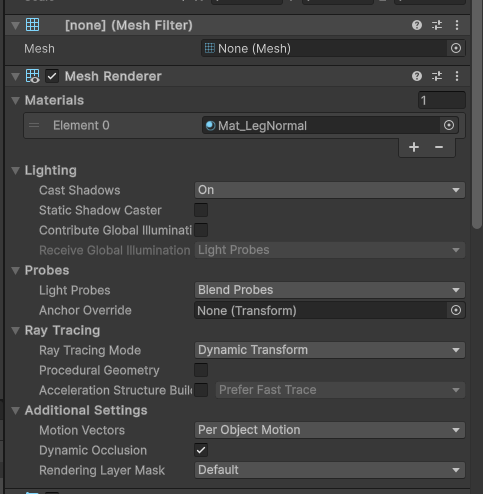
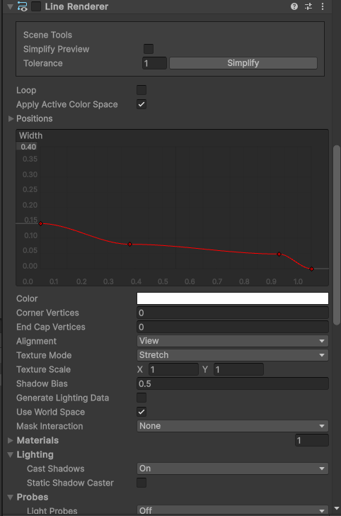
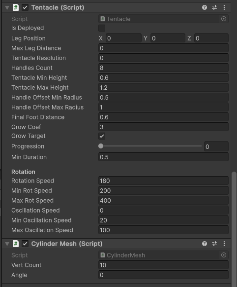
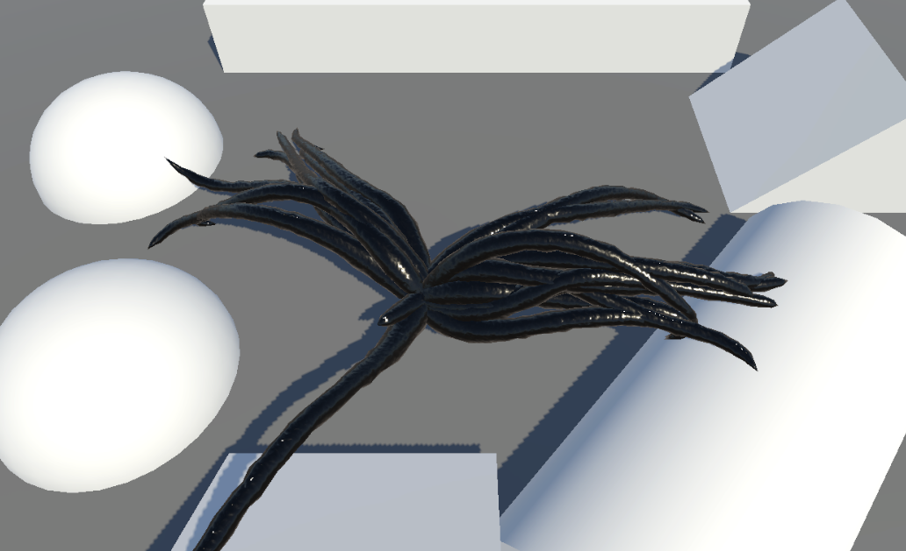

当个触手怪
======

(Github正常排版: [当个触手怪][1])

-----------------


<!-- @import "[TOC]" {cmd="toc" depthFrom=1 depthTo=6 orderedList=false} -->

<!-- code_chunk_output -->

- [**0. 起因**](#0-起因)
- [**1. 原理**](#1-原理)
- [**2. Mimic**](#2-mimic)
  - [**2.1 变量**](#21-变量)
  - [**2.2 初始化**](#22-初始化)
  - [**2.3 Update**](#23-update)
  - [**2.4 其它方法补充**](#24-其它方法补充)
  - [**2.5 组装**](#25-组装)
- [**3. Movement**](#3-movement)
  - [**3.1 移动**](#31-移动)
- [**4. Tentacle**](#4-tentacle)
  - [**4.1 Tentacle**](#41-tentacle)
  - [**4.2 OnInit**](#42-oninit)
  - [**4.3 Die**](#43-die)
  - [**4.4 Update**](#44-update)
  - [**4.5 触手点**](#45-触手点)
  - [**4.6 贝塞尔曲线**](#46-贝塞尔曲线)
- [**5. CylinderMesh**](#5-cylindermesh)
  - [**5.1 CylinderMesh**](#51-cylindermesh)
  - [**5.2 组装**](#52-组装)

<!-- /code_chunk_output -->


-----------------

## **0. 起因**

之前群里看到一张图, 就好奇实现.


随便想了一下是

1. 从终点位置从高处往下射线, 命中点为落脚点
2. 玩家中心点到落脚点位置生成贝塞尔曲线
3. 代码控制Mesh的生长 
4. 加入触手位置的扰动

然后看看有没有现成的吧! 随便一搜还真有, 而且是免费的, 赛高!!! [资源地址][2]

抄完差不多这样, 开始恶心心 真下头.

虽然只是一个粗略版, 有很多可以调优的地方, 但是还是可以提供一下思路的.


-----------------

## **1. 原理**

1. 每帧Update, 如果腿的数量少于阈值就产生新的腿

2. 新的腿的终点.xz = 怪物中心点 + 移动方向 * 产生腿的半径 + 随机数, 新的腿的终点.y 通过xz从高处做射线确定

3. 给腿设置个生命周期, 到期就销毁, 下一帧产生新的腿

4. 通过 怪物中心点 新腿的终点 和 腿的生命周期 生成贝塞尔曲线, 表示腿每个节点的位置

5. 把 每个节点 到 后一个节点 的方向 当作旋转轴, 围绕着生成mesh point, 最后拼接成mesh

当然中间还有很多细节, 比如扰动, 射线检测. 放在后面慢慢讲.

-----------------

## **2. Mimic**

### **2.1 变量**

创建个C#文件 **Mimic.cs**.

```CSharp

using System.Collections.Generic;
using UnityEngine;
using Task = System.Threading.Tasks.Task;

public class Mimic : MonoBehaviour
{
}

```

先想想需要什么变量. **Tentacle** 类后面补充.

每次移动要产生腿, 腿由很多个触手组成, 触手说白了就是圆环拼成的Mesh.


availableTentaclePool 对象池. 新版本的Unity提供了ObjectPool, 不过我并没有去尝试2333.

```CSharp

public class Mimic : MonoBehaviour
{
	// 触手的prefab
	public Tentacle tentaclePrefab;
	
	// 腿的数量
	[Range(2, 20)] public int numberOfLegs = 5;

	// 一个腿有几个触手
	[Range(1, 10)]
	public int partsPerLeg = 4;

	// 最少需要几个腿站立
	public int minimumAnchoredLegs = 3;

	// 触手的生命周期
	public float minTentacleLifetime = 5;
	public float maxTentacleLifetime = 15;

	// 新腿的产生半径
	public float newLegRadius = 3;

	// 腿的距离范围
	public float minLegDistance = 4.5f;
	public float maxLegDistance = 6.3f;

	// 触手要细分多少个环
	[Range(2, 50)]
	public int tentacleResolution = 40;

	// 触手生长的最小/最大速度
	public float minGrowCoef = 4.5f;
	public float maxGrowCoef = 6.5f;

	// 腿生长的CD
	public float newLegCooldown = 0.3f;

	// 腿的落点
	public Vector3 legPlacerOrigin;

	// 移动向量
	public Vector3 velocity;

	// 最少需要触手的数量
	public int minimumAnchoredParts;

	// 当前触手的数量
	public int tentacleCount;

	// 已经生长完毕的触手的数量
	public int deployedTentacles;

	private int maxTentacles;

	private bool canCreateLeg = true;

	// 对象池, 新版本提供了ObjectPool
	private Queue<Tentacle> availableTentaclePool = new();
}

```

### **2.2 初始化**

初始化上面的一些变量.

添加方法 **ResetMimic**, 然后在 **Start** 和 **OnValidate** 中调用.

删除已存在触手, 清空对象池, 然后初始化一些变量.

为什么要初始化方向为随机数? 因为刚开始进入游戏的时候还没有位移, 但是又需要产生腿以供支撑.

```CSharp

public class Mimic : MonoBehaviour
{
	...
	private Queue<Tentacle> availableTentaclePool = new();

	private void Start()
	{
		ResetMimic();
	}

	private void OnValidate()
	{
		ResetMimic();
	}

	private void ResetMimic()
	{
		foreach (var item in GetComponentsInChildren<Tentacle>())
		{
			Destroy(item.gameObject);
		}

		while (availableTentaclePool.Count > 0)
		{
			Destroy(availableTentaclePool.Dequeue().gameObject);
		}

		tentacleCount = 0;
		deployedTentacles = 0;

		maxTentacles = numberOfLegs * partsPerLeg;
		Vector2 randV = Random.insideUnitCircle;
		velocity = new Vector3(randV.x, 0, randV.y);
		minimumAnchoredParts = minimumAnchoredLegs * partsPerLeg;
		maxLegDistance = newLegRadius * 2.1f;
	}
}

```

### **2.3 Update**

在Update中判断条件, 申请新的腿/触手. 先添加方法 **Update**.

```CSharp

public class Mimic : MonoBehaviour
{
	...

	private void OnValidate()
	{
		...
	}

	private void Update()
	{
		//TODO: 
	}

	private void ResetMimic()
	{
		...
	}
}

```

完善 **Update** 方法.

大体就是计算落点位置, 然后生成触手. 这么多注释懂得都懂!

**NewLegCooldown** 和 **RequestLeg** 后面再补充.

```CSharp

private void Update()
{
	if (!canCreateLeg)
	{
		return;
	}

	Vector3 centerPos = transform.position;

	// 先根据位移方向粗略生成腿的落点
	legPlacerOrigin = centerPos + velocity.normalized * newLegRadius;

	// 不超过最大的触手数量
	if (tentacleCount <= maxTentacles - partsPerLeg)
	{
		// 在落点附近在加点随机值
		Vector2 offset = Random.insideUnitCircle * newLegRadius;
		Vector3 newLegPos = legPlacerOrigin + new Vector3(offset.x, 0, offset.y);

		// 如果落点和移动的方向相反, 则翻转落点为移动方向
		if (velocity.magnitude > 1f)
		{
			float newLegAng = Vector3.Angle(velocity, newLegPos - centerPos);

			if (Mathf.Abs(newLegAng) > 90)
			{
				newLegPos = -newLegPos;
			}
		}

		// 如果和移动方向角度差太大, 则让它更靠近移动方向
		if (Vector3.Angle(velocity, newLegPos - centerPos) > 45)
		{
			Vector3 posOffset = newLegPos - centerPos;
			newLegPos = centerPos + (posOffset + velocity.normalized * posOffset.magnitude) * 0.5f;
		}

		// 限制最小落点距离
		if (Vector2.Distance(new Vector2(centerPos.x, centerPos.z), new Vector2(legPlacerOrigin.x, legPlacerOrigin.z)) < minLegDistance)
		{
			newLegPos = (newLegPos - centerPos).normalized * minLegDistance + centerPos;
		}

		// 落点高度判断
		Vector3 hitPoint = Vector3.zero;
		RaycastHit hit;
		if (Physics.Raycast(newLegPos + Vector3.up * 10f, Vector3.down, out hit))
		{
			hitPoint = hit.point;
		}

		// 途径判断
		if (Physics.Linecast(centerPos, hit.point, out hit))
		{
			hitPoint = hit.point;
		}

		float lifeTime = Random.Range(minTentacleLifetime, maxTentacleLifetime);

		// 腿的生长CD
		NewLegCooldown();

		for (int i = 0; i < partsPerLeg; i++)
		{
			// 申请触手
			RequestTentacle(hitPoint, tentacleResolution, maxLegDistance, Random.Range(minGrowCoef, maxGrowCoef), lifeTime);
			if (tentacleCount >= maxTentacles)
			{
				break;
			}
		}
	}
}

```

### **2.4 其它方法补充**

补充 **Mimic** 剩下的方法.

添加方法 **NewLegCooldown**. 主要作用就是让腿的生长有一个冷却, 而不是一下子出来. 平时都是协程写习惯了, 这次换一个口味用 **async/await** .

**RequestTentacle** , 从对象池获得触手.

**RecycleTentacle** , 回收触手放回对象池.

```CSharp

...

private void ResetMimic()
{
	...
}

private async void NewLegCooldown()
{
	canCreateLeg = false;
	await Task.Delay((int)(newLegCooldown * 1000));
	canCreateLeg = true;
}

private void RequestTentacle(Vector3 legPosition, int resolution, float _maxLegDistance, float growCoef, float lifeTime)
{
	Tentacle newTentacle;
	if (availableTentaclePool.Count > 0)
	{
		newTentacle = availableTentaclePool.Dequeue();
	}
	else
	{
		newTentacle = Instantiate(tentaclePrefab, transform.position, Quaternion.identity);
	}

	newTentacle.gameObject.SetActive(true);
	newTentacle.OnInit(this, legPosition, resolution, _maxLegDistance, growCoef, lifeTime);
	newTentacle.transform.SetParent(transform);
}

public void RecycleTentacle(Tentacle tentacle)
{
	availableTentaclePool.Enqueue(tentacle);
	tentacle.gameObject.SetActive(false);
}

```

到这里 **Mimic** 基本就写完了.

### **2.5 组装**

创建一个空的GameObject, 命名为 **Mimic**. 添加类**Mimic** 放一个变量设定图. 我这里有点修改过, 反正大差不差.


然后在 GameObject **Mimic** 下面创建个小球, 把它当做触手怪的做中心点. 

改变小球的缩放, 给一个黑色的材质. 同时为了避免射线检测问题, 需要删除球碰撞组件.


-----------------

## **3. Movement**

### **3.1 移动**

写一个简单的移动组件, 让它动起来.

新建一个C# **Movement.cs**, 添加到mimic身上.

获取输入轴, 改变位置. 但是中心点的高度还要做射线检测进行改变, 目的是适应爬坡.

```CSharp

using UnityEngine;

public class Movement : MonoBehaviour
{
	[Range(0.5f, 5f)]
	public float height = 0.8f;

	public float speed = 5f;
	public float velocityLerpCoef = 4f;

	private Mimic mimic;
	private Vector3 velocity = Vector3.zero;


	private void Start()
	{
		mimic = GetComponent<Mimic>();
	}

	public void Update()
	{
		
		float vertical = Input.GetAxis("Vertical");
		float horizontal = Input.GetAxis("Horizontal");

		velocity = Vector3.Lerp(velocity, new Vector3(horizontal, 0, vertical).normalized * speed, velocityLerpCoef * Time.deltaTime);

		mimic.velocity = velocity;

		transform.position += velocity * Time.deltaTime;
		RaycastHit hit;
		Vector3 destHeight = transform.position;
		if (Physics.Raycast(transform.position + Vector3.up * 5f, Vector3.down, out hit))
		{
			destHeight = new Vector3(transform.position.x, hit.point.y + height, transform.position.z);
		}

		transform.position = Vector3.Lerp(transform.position, destHeight, velocityLerpCoef * Time.deltaTime);
	}
}

```

-----------------

## **4. Tentacle**

### **4.1 Tentacle**

新建C# **Tentacle.cs** 触手类. 添加变量, 后面边写边说明. 

它原来的代码还有一种 **LineRenderer** 面片渲染模式. 但是我这里删除, 只保留了比较复杂的Mesh渲染, 所以只使用 **LineRenderer** 中的positions 和 width curve.

```CSharp

using System;
using System.Threading.Tasks;
using UnityEngine;
using Random = UnityEngine.Random;

public class Tentacle : MonoBehaviour
{
	public bool isDeployed;
	public Vector3 legPosition;
	public float maxLegDistance;
	public int tentacleResolution;
	public int handlesCount = 8; // 8 = 7 tentacle + 1 finalPoint

	public float tentacleMinHeight = 0.6f;
	public float tentacleMaxHeight = 1.2f;
	public float handleOffsetMinRadius = 0.5f;
	public float handleOffsetMaxRadius = 1.0f;

	public float finalFootDistance = 0.6f;

	public float growCoef = 3f;
	public bool growTarget = true;

	// 进度条
	[Range(0, 1f)] public float progression;
	public float minDuration = 0.5f;

	[Header("Rotation")] public float rotationSpeed = 180f;
	public float minRotSpeed = 200f;
	public float maxRotSpeed = 400f;

	public float oscillationSpeed;
	public float minOscillationSpeed = 20f;
	public float maxOscillationSpeed = 100f;

	private Mimic mimic;
	private LineRenderer lienRenderer;
	private float tentacleHeight;
	private bool isRemoved;
	private bool canDie;
	private float rotationSign;
	private float oscillationProgress;
	
	private Vector3[] handles;
	private Vector3[] handleOffsets;
}

```

### **4.2 OnInit**

添加 **OnInit** 方法, 初始化变量.

```CSharp

public class Tentacle : MonoBehaviour
{
	...

	public void OnInit(Mimic _mimic, Vector3 _legPosition, int _tentacleResolution, float _maxLegDistance, float _growCoef, float lifeTime)
	{
		mimic = _mimic;
		legPosition = _legPosition;
		tentacleResolution = _tentacleResolution;
		maxLegDistance = _maxLegDistance;
		growCoef = _growCoef;

		lienRenderer = GetComponent<LineRenderer>();
		handles = new Vector3[handlesCount];

		handleOffsets = new Vector3[6];
		handleOffsets[0] = Random.onUnitSphere * Random.Range(handleOffsetMinRadius, handleOffsetMaxRadius);
		handleOffsets[1] = Random.onUnitSphere * Random.Range(handleOffsetMinRadius, handleOffsetMaxRadius);
		handleOffsets[2] = Random.onUnitSphere * Random.Range(handleOffsetMinRadius, handleOffsetMaxRadius);
		handleOffsets[3] = Random.onUnitSphere * Random.Range(handleOffsetMinRadius, handleOffsetMaxRadius);
		handleOffsets[4] = Random.onUnitSphere * Random.Range(handleOffsetMinRadius, handleOffsetMaxRadius);
		handleOffsets[5] = Random.onUnitSphere * Random.Range(handleOffsetMinRadius, handleOffsetMaxRadius);

		Vector2 legOffset = Random.insideUnitCircle.normalized * finalFootDistance;
		RaycastHit hit;
		Physics.Raycast(legPosition + Vector3.up * 5f + new Vector3(legOffset.x, 0, legOffset.y), Vector3.down, out hit);
		handles[7] = hit.point;

		tentacleHeight = Random.Range(tentacleMinHeight, tentacleMaxHeight);
		rotationSpeed = Random.Range(minRotSpeed, maxRotSpeed);
		rotationSign = 1;
		oscillationSpeed = Random.Range(minOscillationSpeed, maxOscillationSpeed);
		oscillationProgress = 0;

		mimic.tentacleCount++;
		growTarget = true;

		isRemoved = false;
		canDie = false;
		isDeployed = false;

		WaitToDie();
		WaitAndDie(lifeTime);
	}
}

```

### **4.3 Die**

完善 **OnInit** 中的 **WaitToDie** 和 **WaitAndDie**, 添加这两个方法.

**WaitToDie**, 等待x秒然后标记触手可以死亡.

**WaitAndDie**, 每帧检测判断触手是否已经生长完毕. 生长完毕后 **growTarget** 为 false, 则表示可以缩回了.

```CSharp

public class Tentacle : MonoBehaviour
{
	public void OnInit(Mimic _mimic, Vector3 _legPosition, int _tentacleResolution, float _maxLegDistance, float _growCoef, float lifeTime)
	{
		...
	}

	private async void WaitToDie()
	{
		await Task.Delay((int)(minDuration * 1000));
		canDie = true;
	}

	private async void WaitAndDie(float lifeTime)
	{
		await Task.Delay((int)(lifeTime * 1000));
		while (mimic.deployedTentacles < mimic.minimumAnchoredParts)
		{
			await Task.Yield();
		}

		growTarget = false;
	}
}

```

### **4.4 Update**

继续添加 **Update** 方法.

```CSharp

public class Leg : MonoBehaviour
{
	public void OnInit(Mimic _mimic, Vector3 _legPosition, int _tentacleResolution, float _maxLegDistance, float _growCoef, float lifeTime)

	{
		...
	}

	private void Update()
	{
		// growTarget==true, 腿要生长. 等于false, 腿要缩回
		if (growTarget)
		{
			// 到达死亡周期 && 身体和腿的落点距离太远 && 触手数量>最低触手数量
			if (canDie
				&& Vector2.Distance(new Vector2(mimic.legPlacerOrigin.x, mimic.legPlacerOrigin.z), new Vector2(legPosition.x, legPosition.z)) > maxLegDistance
				&& mimic.deployedTentacles > mimic.minimumAnchoredParts)
			{
				growTarget = false;
			}
			else
			{
				// 身体到腿的中间出现遮挡物
				if (Physics.Linecast(legPosition, transform.position, out var hit))
				{
					growTarget = false;
				}
			}
		}

		// 进度条  growTarget==true, 为1  表示要生长,  否则为0 表示要缩回
		progression = Mathf.Lerp(progression, growTarget ? 1 : 0, growCoef * Time.deltaTime);

		// 根据进度 设置已经生长完毕的触手
		if (!isDeployed && progression > 0.9f)
		{
			mimic.deployedTentacles++;
			isDeployed = true;
		}
		else if (isDeployed && progression < 0.9f)
		{
			mimic.deployedTentacles--;
			isDeployed = false;
		}

		// 触手是缩回状态 进度条足够小, 将会被回收
		if (progression < 0.5f && !growTarget)
		{
			if (!isRemoved)
			{
				mimic.tentacleCount--;
				isRemoved = true;
			}

			if (progression < 0.05f)
			{
				lienRenderer.positionCount = 0;
				mimic.RecycleTentacle(this);
				return;
			}
		}

		// 更新触手节点, 加入了偏移和旋转
		SetHandles();

		// 生成触手的贝塞尔曲线点
		Vector3[] points = GetSamplePoints(handles, tentacleResolution, progression);
		lienRenderer.positionCount = points.Length;
		lienRenderer.SetPositions(points);
	}

	private async void WaitToDie()
	{
		...
	}
}

```

### **4.5 触手点**

继续添加 **SetHandles** 和 **RotateHandleOffset** 方法.

**SetHandles** 的作用是大致生成触手的主要点, 给后面的贝塞尔曲线和Mesh使用.

**RotateHandleOffset** 的作用是给触手加上每帧的旋转偏移, 使其更生动. 不然触手每帧都不懂, 比YYF还僵硬.

```CSharp

private async void WaitAndDie(float lifeTime)
{
	...
}

private void SetHandles()
{
	handles[0] = transform.position;

	// [6] 为 [7] 向上偏移一点, 是为了让[6][7] 结合起来更像触手着地的关节
	handles[6] = legPosition + Vector3.up * 0.05f;

	handles[2] = Vector3.Lerp(handles[0], handles[6], 0.4f);
	handles[2].y = handles[0].y + tentacleHeight;

	handles[1] = Vector3.Lerp(handles[0], handles[2], 0.5f);
	handles[3] = Vector3.Lerp(handles[2], handles[6], 0.25f);
	handles[4] = Vector3.Lerp(handles[2], handles[6], 0.5f);
	handles[5] = Vector3.Lerp(handles[2], handles[6], 0.75f);

	RotateHandleOffset();

	handles[1] += handleOffsets[0];
	handles[2] += handleOffsets[1];
	handles[3] += handleOffsets[2];
	handles[4] += handleOffsets[3] / 2f;
	handles[5] += handleOffsets[4] / 4f;
}

private void RotateHandleOffset()
{
	oscillationProgress += Time.deltaTime * oscillationSpeed;
	if (oscillationProgress >= 360f)
	{
		oscillationProgress -= Mathf.Floor(oscillationProgress / 360) * 360;
	}

	float newAngle = rotationSpeed * Time.deltaTime * Mathf.Cos(oscillationProgress * Mathf.Deg2Rad) + 1f;

	Vector3 axisRotation;
	for (int i = 1; i < 6; i++)
	{
		axisRotation = (handles[i + 1] - handles[i - 1]) * 0.5f;
		handleOffsets[i - 1] = Quaternion.AngleAxis(newAngle, rotationSign * axisRotation) * handleOffsets[i - 1];
	}
}

```

### **4.6 贝塞尔曲线**

上面有了触手大致的点, 可以利用贝塞尔曲线更细化.

这里的代码写的不是很好, 感觉可以进一步优化!

添加两个方法 **GetSamplePoints** 和 **GetPointOnCurve**.

**resolution** 要细分的数量, **t** 触手的进度.

```CSharp

private void SetHandles()
{
	...
}

private Vector3[] GetSamplePoints(Vector3[] curveHandles, int resolution, float t)
{
	float segmentLength = 1f / resolution;
	int count = Mathf.CeilToInt(t / segmentLength);
	Vector3[] segmentPos = new Vector3[count + 1];
	Vector3[] cloneArray = new Vector3[curveHandles.Length];

	for (int i = 0; i < count; i++)
	{
		segmentPos[i] = GetPointOnCurve(curveHandles, cloneArray, i * segmentLength);
	}

	segmentPos[count] = GetPointOnCurve(curveHandles, cloneArray, t);
	return segmentPos;
}

private Vector3 GetPointOnCurve(Vector3[] curveHandles, Vector3[] cloneArray, float t)
{
	int count = cloneArray.Length;
	Array.Copy(curveHandles, cloneArray, count);

	while (count > 1)
	{
		for (int i = 0; i < count - 1; i++)
		{
			cloneArray[i] = Vector3.Lerp(cloneArray[i], cloneArray[i + 1], t);
		}

		count--;
	}

	return cloneArray[0];
}

```

-----------------

## **5. CylinderMesh**

### **5.1 CylinderMesh**

有了上面的 **LineRenderer** 的 positions 和 with curve, 可以生成由圆环组成的圆柱Mesh.

创建C# **CylinderMesh.cs**.

```CSharp

using Unity.Collections;
using UnityEngine;
using UnityEngine.Rendering;

public class CylinderMesh : MonoBehaviour
{
	public int vertCount = 10;
	public float angle;

	private LineRenderer lineRenderer;
	private MeshFilter meshFilter;
	private Mesh mesh;

	private void Start()
	{
		lineRenderer = GetComponent<LineRenderer>();
		meshFilter = GetComponent<MeshFilter>();
		mesh = new Mesh();
		meshFilter.sharedMesh = mesh;
	}

	private void OnDestroy()
	{
		CoreUtils.Destroy(mesh);
	}

	private void Update()
	{
		BuildMesh();
	}

	private void BuildMesh()
	{
		if (lineRenderer.positionCount <= 2 || vertCount <= 1)
		{
			return;
		}

		mesh.Clear();
		int pointCount = lineRenderer.positionCount;
		angle = 360.0f / vertCount;
		Vector3[] vertices = new Vector3[1 + vertCount * (pointCount - 1)];
		int[] trinagles = new int[6 * (pointCount - 2) * vertCount + 3 * (vertCount - 1)];

		Vector3 circleNormal;
		Vector3 perpendicularVector;
		int idx = 0;

		NativeArray<Vector3> posArray = new NativeArray<Vector3>(pointCount, Allocator.Temp);
		lineRenderer.GetPositions(posArray);
		for (int i = 0; i < pointCount - 1; i++)
		{
			circleNormal = (posArray[i + 1] - posArray[i]).normalized;
			perpendicularVector = Vector3.Cross(circleNormal, Vector3.up)
									* (lineRenderer.widthCurve.Evaluate(i / (float)lineRenderer.positionCount) * 0.5f);
			Quaternion vertRotation = Quaternion.AngleAxis(angle, circleNormal);

			for (int j = 0; j < vertCount; j++)
			{
				vertices[idx] = transform.InverseTransformPoint(perpendicularVector + posArray[i]);
				perpendicularVector = vertRotation * perpendicularVector;
				idx++;
			}
		}

		vertices[idx] = transform.InverseTransformPoint(posArray[pointCount - 1]);
		posArray.Dispose();

		idx = 0;
		for (int i = 0; i < pointCount - 2; i++)
		{
			for (int j = 0; j < vertCount; j++)
			{
				trinagles[idx++] = i * vertCount + j;
				trinagles[idx++] = i * vertCount + 1 + j;
				trinagles[idx++] = (i + 1) * vertCount + j;

				trinagles[idx++] = (i + 1) * vertCount + j;
				trinagles[idx++] = i * vertCount + 1 + j;
				trinagles[idx++] = (i + 1) * vertCount + j + 1;
			}
		}

		int offset = (pointCount - 2) * vertCount;

		for (int i = 1; i < vertCount; i++)
		{
			trinagles[idx++] = offset + i - 1;
			trinagles[idx++] = offset + i;
			trinagles[idx++] = vertices.Length - 1;
		}

		mesh.vertices = vertices;
		mesh.triangles = trinagles;
		mesh.RecalculateNormals();
		mesh.RecalculateBounds();
	}
}

```

### **5.2 组装**

创建一个空的 **GameObject** 命名 **TentacleMesh**. 添加下图这些组件, 并且变成 **Prefab** . 最后拖拽给场景中的 **Mimic**.

**LineRenderer**, 因为只用到了 **positions** 和 **width** , 所以完全可以disable.

材质球可以用简单的Lit.

因为没有UV, 所以不是很友好地支持法线贴图. 过可以使用 **Triplanar Mapping** 来解决. 拿世界坐标和TBN 采样法线贴图 生成法线效果. [相关文章][3] , [相关文章][4] .

并且vs阶段为了效果更好, 可以继续加点noise扰动顶点.







随便放点 Collider 测试下. 图一乐Demo prefect!!!



-----------------

最近又回看了卡马克hhhh [视频地址][5] , 让技术迷茫的我再次充满了兴趣.


本想照着 catlike文章 或者 张秀宏的书 有条有理的一步一步写下来, 可惜我再次写了一个四不像hhhh.

鬼灭完结了!!! 又要开始周会分享了, 要想分享主题了orz..

-----------------

[1]:https://github.com/HHHHHHHHHHHHHHHHHHHHHCS/MyStudyNote/blob/main/MyNote/%E5%BD%93%E4%B8%AA%E8%A7%A6%E6%89%8B%E6%80%AA.md
[2]:https://assetstore.unity.com/publishers/80631
[3]:https://zhuanlan.zhihu.com/p/258822142
[4]:https://zhuanlan.zhihu.com/p/88916815
[5]:https://www.bilibili.com/video/BV1MV4y1U7p5