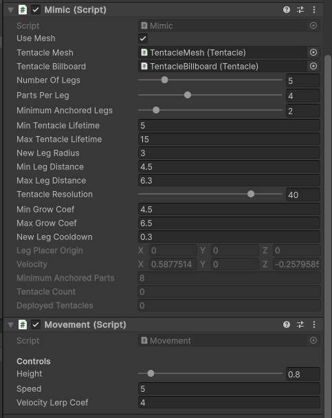

当个触手怪
======

(Github正常排版: [当个触手怪][1])

-----------------


<!-- @import "[TOC]" {cmd="toc" depthFrom=1 depthTo=6 orderedList=false} -->

<!-- code_chunk_output -->

- [**0. 起因**](#0-起因)
- [**1. 原理**](#1-原理)
- [**2. Mimic**](#2-mimic)
  - [**2.1 变量**](#21-变量)
  - [**2.2 初始化**](#22-初始化)
  - [**2.3 Update**](#23-update)
  - [**2.4 其它方法补充**](#24-其它方法补充)
  - [**2.5 组装**](#25-组装)
- [**3. Movement**](#3-movement)
  - [**3.1 移动**](#31-移动)

<!-- /code_chunk_output -->


-----------------

## **0. 起因**

之前群里看到一张图, 就好奇实现.


随便想了一下是

1. 从终点位置从高处往下射线, 命中点为落脚点
2. 玩家中心点到落脚点位置生成贝塞尔曲线
3. 代码控制Mesh的生长 
4. 加入触手位置的扰动

然后看看有没有现成的吧! 随便一搜还真有, 而且是免费的, 赛高!!! [资源地址][2]

抄完差不多这样, 开始恶心心 真下头.

虽然只是一个粗略版, 有很多可以调优的地方, 但是还是可以提供一下思路的.


-----------------

## **1. 原理**

1. 每帧Update, 如果腿的数量少于阈值就产生新的腿
2. 新的腿的终点.xz = 怪物中心点 + 移动方向 * 产生腿的半径 + 随机数, 新的腿的终点.y 通过xz从高处做射线确定
3. 给腿设置个生命周期, 到期就销毁, 下一帧产生新的腿
4. 通过 怪物中心点 新腿的终点 和 腿的生命周期 生成贝塞尔曲线, 表示腿每个节点的位置
5. 把 每个节点 到 后一个节点 的方向 当作旋转轴, 围绕着生成mesh point, 最后拼接成mesh

当然中间还有很多细节, 比如扰动, 射线检测. 放在后面慢慢讲.

-----------------

## **2. Mimic**

### **2.1 变量**

创建个C#文件 **Mimic.cs**.

```CSharp

using System.Collections.Generic;
using UnityEngine;
using Task = System.Threading.Tasks.Task;

public class Mimic : MonoBehaviour
{
}

```

先想想需要什么变量. Leg类后面补充.

每次移动要产生腿, 腿由很多个触手组成, 触手说白了就是圆环拼成的Mesh.


availableLegPool 对象池. 新版本的Unity提供了ObjectPool, 不过我并没有去尝试2333.

```CSharp

public class Mimic : MonoBehaviour
{
	// 触手的prefab
	public Leg legPrefab;

	// 腿的数量
	[Range(2, 20)] public int numberOfLegs = 5;

	// 一个腿有几个触手
	[Tooltip("The number of splines per leg")] [Range(1, 10)]
	public int partsPerLeg = 4;

	// 最少需要几个腿站立
	[Range(0, 19)] public int minimumAnchoredLegs = 3;

	// 腿的生命周期
	[Tooltip("Minimum duration before leg is replaced")]
	public float minLegLifetime = 5;

	[Tooltip("Maximum duration before leg is replaced")]
	public float maxLegLifetime = 15;

	// 新腿的产生半径
	[Tooltip("Leg placement radius offset")]
	public float newLegRadius = 3;

	// 腿的距离
	public float minLegDistance = 4.5f;
	public float maxLegDistance = 6.3f;

	// 触手要细分多少个环
	[Tooltip("Number of spline samples per legpart")] [Range(2, 50)]
	public int legResolution = 40;

	// 触手生长的速度
	[Tooltip("Minimum lerp coeficient for leg growth smoothing")]
	public float minGrowCoef = 4.5f;

	[Tooltip("MAximum lerp coeficient for leg growth smoothing")]
	public float maxGrowCoef = 6.5f;

	// 腿生长的CD
	[Tooltip("Minimum duration before a new leg can be placed")]
	public float newLegCooldown = 0.3f;

	// 腿的落点
	public Vector3 legPlacerOrigin;
	// 移动矢量
	public Vector3 velocity;
	// 最少需要触手的数量
	public int minimumAnchoredParts;
	// 腿的数量
	public int legCount;
	// 触手的数量
	public int deployedLegs;

	private int maxLegs;
	private bool canCreateLeg = true;
	// 对象回收池
	private Queue<Leg> availableLegPool = new();
}

```

### **2.2 初始化**

初始化上面的一些变量.

添加方法 **ResetMimic**, 然后在 **Start** 和 **OnValidate** 中调用.

删除已存在触手, 清空对象池, 然后初始化一些变量.

为什么要初始化方向为随机数? 因为刚开始进入游戏的时候还没有位移, 但是又需要产生腿以供支撑. 

```CSharp

public class Mimic : MonoBehaviour
{
	...
	private Queue<Leg> availableLegPool = new();

	private void Start()
	{
		ResetMimic();
	}

	private void OnValidate()
	{
		ResetMimic();
	}

	private void ResetMimic()
	{
		foreach (var item in GetComponentsInChildren<Leg>())
		{
			Destroy(item.gameObject);
		}

		while (availableLegPool.Count > 0)
		{
			Destroy(availableLegPool.Dequeue().gameObject);
		}

		legCount = 0;
		deployedLegs = 0;

		maxLegs = numberOfLegs * partsPerLeg;
		Vector2 randV = Random.insideUnitCircle;
		velocity = new Vector3(randV.x, 0, randV.y);
		minimumAnchoredParts = minimumAnchoredLegs * partsPerLeg;
		maxLegDistance = newLegRadius * 2.1f;
	}
}

```

### **2.3 Update**

在Update中判断条件, 申请新的腿/触手. 先添加方法 **Update**.

```CSharp

public class Mimic : MonoBehaviour
{
	...

	private void OnValidate()
	{
		...
	}

	private void Update()
	{
		//TODO: 
	}

	private void ResetMimic()
	{
		...
	}
}

```

完善 **Update** 方法.

大体就是计算落点位置, 然后生成触手. 这么多注释懂得都懂!

**NewLegCooldown** 和 **RequestLeg** 后面再补充.

```CSharp

private void Update()
{
	if (!canCreateLeg)
	{
		return;
	}

	Vector3 centerPos = transform.position;

	// 先粗略生成落点
	legPlacerOrigin = centerPos + velocity.normalized * newLegRadius;

	// 不超过最大腿的数量
	if (legCount <= maxLegs - partsPerLeg)
	{
		// 在落点附近在加点随机值
		Vector2 offset = Random.insideUnitCircle * newLegRadius;
		Vector3 newLegPos = legPlacerOrigin + new Vector3(offset.x, 0, offset.y);

		// 如果落点和移动的方向相反, 则翻转落点
		if (velocity.magnitude > 1f)
		{
			float newLegAng = Vector3.Angle(velocity, newLegPos - centerPos);

			if (Mathf.Abs(newLegAng) > 90)
			{
				newLegPos = -newLegPos;
			}
		}

		// 如果落点和移动方向角度差太大, 则让它更靠近移动方向
		if (Vector3.Angle(velocity, newLegPos - centerPos) > 45)
		{
			Vector3 posOffset = newLegPos - centerPos;
			newLegPos = centerPos + (posOffset + velocity.normalized * posOffset.magnitude) * 0.5f;
		}

		// 限制最小落点距离
		if (Vector2.Distance(new Vector2(centerPos.x, centerPos.z), new Vector2(legPlacerOrigin.x, legPlacerOrigin.z)) < minLegDistance)
		{
			newLegPos = (newLegPos - centerPos).normalized * minLegDistance + centerPos;
		}


		// 落点高度判断
		Vector3 hitPoint = Vector3.zero;
		RaycastHit hit;
		if (Physics.Raycast(newLegPos + Vector3.up * 10f, -Vector3.up, out hit))
		{
			hitPoint = hit.point;
		}

		// 途径判断
		if (Physics.Linecast(centerPos, hit.point, out hit))
		{
			hitPoint = hit.point;
		}

		float lifeTime = Random.Range(minLegLifetime, maxLegLifetime);

		NewLegCooldown();

		for (int i = 0; i < partsPerLeg; i++)
		{
			RequestLeg(hitPoint, legResolution, maxLegDistance, Random.Range(minGrowCoef, maxGrowCoef), lifeTime);
			if (legCount >= maxLegs)
			{
				break;
			}
		}
	}
}

```

### **2.4 其它方法补充**

补充 **Mimic** 剩下的方法.

添加方法 **NewLegCooldown**. 主要作用就是让腿的生长有一个冷却, 而不是一下子出来. 平时都是协程写习惯了, 这次换一个口味.

**RequestLeg** , 从对象池获得腿.

**RecycleLeg** , 回收腿放回对象池.

```CSharp

...

private void ResetMimic()
{
	...
}

private async void NewLegCooldown()
{
	canCreateLeg = false;
	await Task.Delay((int)(newLegCooldown * 1000));
	canCreateLeg = true;
}

private void RequestLeg(Vector3 footPosition, int legResolution, float maxLegDistance, float growCoef, float lifeTime)
{
	Leg newLeg;
	if (availableLegPool.Count > 0)
	{
		newLeg = availableLegPool.Dequeue();
	}
	else
	{
		newLeg = Instantiate(legPrefab, transform.position, Quaternion.identity);
	}

	newLeg.gameObject.SetActive(true);
	newLeg.OnInit(this, footPosition, legResolution, maxLegDistance, growCoef, lifeTime);
	newLeg.transform.SetParent(transform);
}

public void RecycleLeg(Leg leg)
{
	availableLegPool.Enqueue(leg);
	leg.gameObject.SetActive(false);
}

```

到这里 **Mimic** 基本就写完了.

### **2.5 组装**

创建一个空的GameObject, 命名为 **Mimic**. 添加类**Mimic** 放一个变量设定图. 我这里有点修改过, 反正大差不差.


然后在 GameObject **Mimic** 下面创建个小球, 把它当做触手怪的做中心点. 

改变小球的缩放, 给一个黑色的材质. 同时为了避免射线检测问题, 需要删除碰撞组件.




-----------------

## **3. Movement**

### **3.1 移动**

写一个简单的移动组件, 让它动起来.

新建一个C# **Movement**. 获得输入轴, 进行改变位置. 但是中心点还是要做射线检测, 改变高度.


```CSharp

using UnityEngine;

public class Movement : MonoBehaviour
{
	[Range(0.5f, 5f)]
	public float height = 0.8f;

	public float speed = 5f;
	public float velocityLerpCoef = 4f;

	private Mimic mimic;
	private Vector3 velocity = Vector3.zero;


	private void Start()
	{
		mimic = GetComponent<Mimic>();
	}

	public void Update()
	{
		
		float vertical = Input.GetAxis("Vertical");
		float horizontal = Input.GetAxis("Horizontal");

		velocity = Vector3.Lerp(velocity, new Vector3(horizontal, 0, vertical).normalized * speed, velocityLerpCoef * Time.deltaTime);

		mimic.velocity = velocity;

		transform.position += velocity * Time.deltaTime;
		RaycastHit hit;
		Vector3 destHeight = transform.position;
		if (Physics.Raycast(transform.position + Vector3.up * 5f, -Vector3.up, out hit))
		{
			destHeight = new Vector3(transform.position.x, hit.point.y + height, transform.position.z);
		}

		transform.position = Vector3.Lerp(transform.position, destHeight, velocityLerpCoef * Time.deltaTime);
	}
}

```

把 **Movement** 也挂在 mimic身上.

-----------------

TODO:  LEG

-----------------

这里暂时只做比较麻烦的Mesh模式, 他还有一个利用LineRenderer 现实的Billboard.

shader中加点顶点offset, 利用世界坐标当作NormalMap UV.

-----------------

最近又回看了卡马克hhhh, 再次对技术充满了兴趣. 

https://www.bilibili.com/video/BV1MV4y1U7p5

想照着 catlike文章 或者 张秀宏的书 有条有理的一步一步写下来, 可惜我再次学了一个四不像hhhh.

-----------------

[1]:https://github.com/HHHHHHHHHHHHHHHHHHHHHCS/MyStudyNote
[2]:https://assetstore.unity.com/publishers/80631