当我在Raymarch云时我在想什么
=================

(Github正常排版: [当我在Raymarch云时我在想什么](https://github.com/HHHHHHHHHHHHHHHHHHHHHCS/MyStudyNote/blob/main/MyNote/%E5%BD%93%E6%88%91%E5%9C%A8Raymarch%E4%BA%91%E6%97%B6%E6%88%91%E5%9C%A8%E6%83%B3%E4%BB%80%E4%B9%88.md))

-----------------

## &emsp;&emsp; 标题灵感来自于村上春树的<<当我谈跑步时我谈些什么>>.没有什么Raymarch相关的内容,主要是偏优化方向(多图杀猫).

-----------------

## **0.起因**

&emsp;&emsp; 最近的任务是渲染云,所以写轮眼全开,写(抄袭并魔改)了一堆.但是网易分享的那篇云相关的文章(https://zhuanlan.zhihu.com/p/350058989) 至今绝望,因为还实现出来,而且也没有什么好的想法和灵感.
先放下我做完的效果图.一些是双拼魔改都搞乱了,找不到原作者见谅...感觉越做越像棉花XD

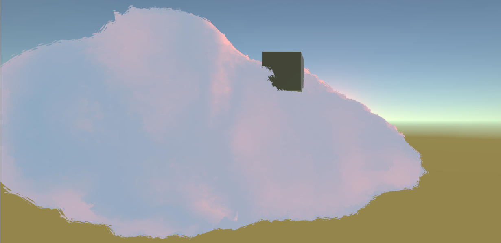

这个来自WalkingFat大佬的绒毛做法,我加了曲面细分(http://walkingfat.com/bump-noise-cloud-3d%e5%99%aa%e7%82%b9gpu-instancing%e5%88%b6%e4%bd%9c%e5%9f%ba%e4%ba%8e%e6%a8%a1%e5%9e%8b%e7%9a%84%e4%bd%93%e7%a7%af%e4%ba%91/)

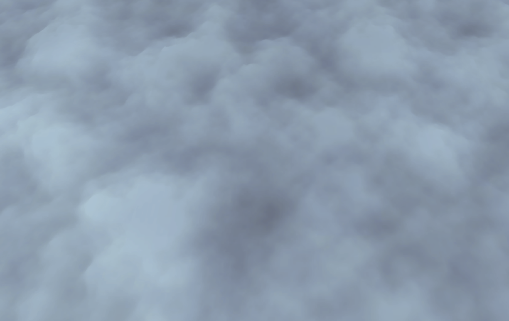

这个是视差的做法(https://zhuanlan.zhihu.com/p/83355147)

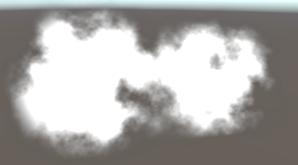

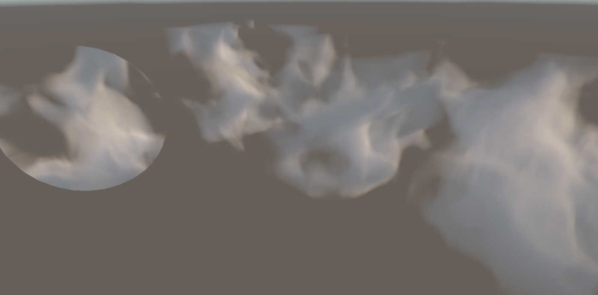

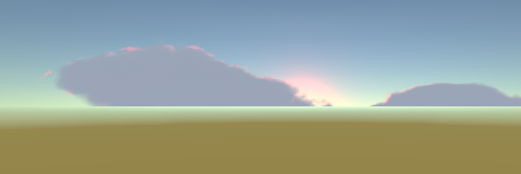

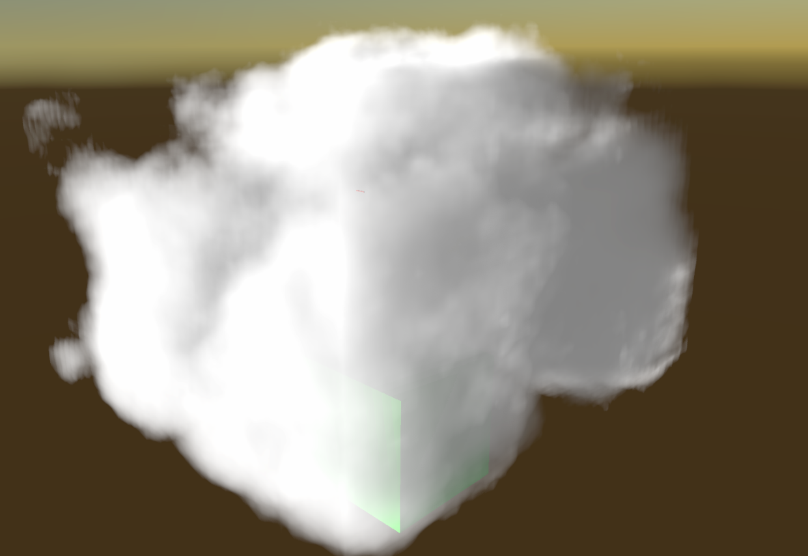

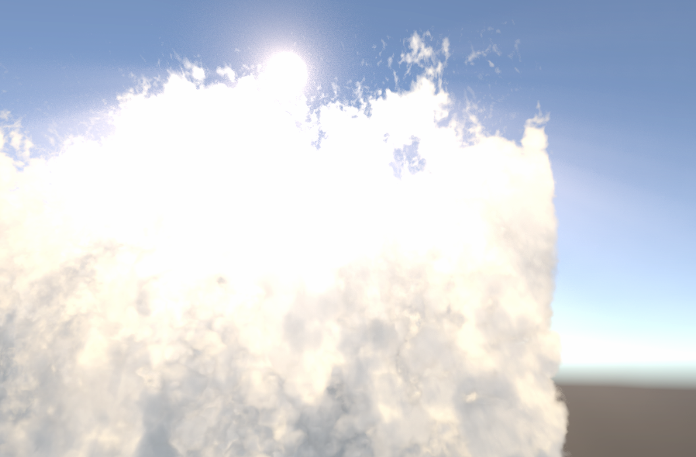

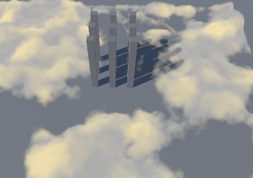

这里使用最后一版本
我把它放到了我的**小米10Pro高通865安卓手机**(打钱)上,结果FPS只有9(还是稍微优化过一点的).
吶吶,电脑上明明这么高的FPS!!!所以就开始了优化之旅.

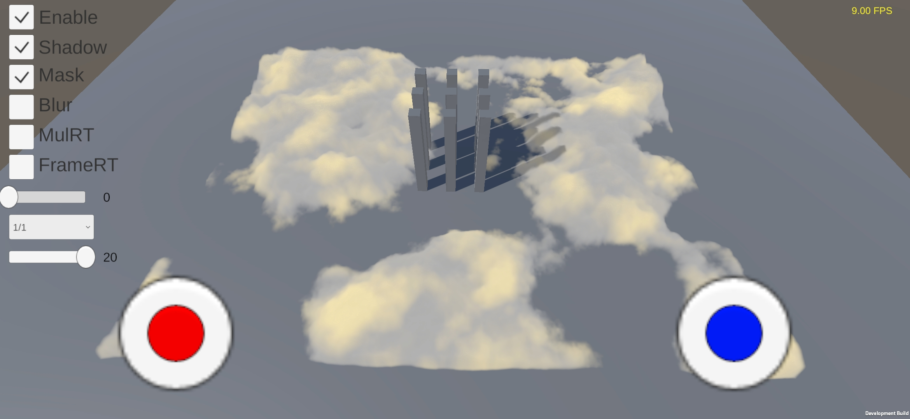

-----------------

## **1.经过**
* ### **优化方法**
&emsp;&emsp; Raymarch的我能想到的主要优化方法有(欢迎提出更多,一起分享)

  0. 降低分辨率
      + 像素越多,要raymarch越多,性能消耗越高
      + 降低分辨率可以十分有效的提高FPS
      + 但是随之而来的就是画质降低,颗粒感拉满
      + 深度图的使用问题
  1. 剔除已经满足/不满足的效果,提前退出
      + 比如视野y相关的判断
      + 比如raycast box的碰撞检测
      + 比如云的alpha已经是1了,继续算算下去意义不大
  2. 提前做好一些事情,在for的时候减少计算量
      + 光照什么的可以做一些烘焙减少计算
  3. 减少for的循环次数
      + 增加每一次for的步长,从而减少for的总次数
      + 但是随之而来的就是会不连续,充满有分层线和噪点
      + 可以添加blur做弥补
  4. 降低刷新率
      + 也是比较有效的,但是快速转动会有残影
      + 可以添加motion blur或者taa做消除
  5. SDF预测
      + 记仇,没有好的思路
      + https://zhuanlan.zhihu.com/p/350058989

* ### **我做了什么**
&emsp;&emsp; 经过深思熟虑后,我做出了一个违背祖训的决定----把这一堆都糅杂再一起.

  0. **光照提前计算**
      + 正常的的时候,我们的光照计算是在raymarch的for循环中进行的.因此会产生大量的性能消耗
      + 我这里离线把噪音贴图做了一个混合处理.把albedo和specular直接叠加写在了噪音贴图的RGB上,Alpha则是再次随机化后的噪音.
      + 做法是:把原来的噪音图进行随机采样,生出新的noise,之后计算光照输出finalColor. 
         - finalColor.rgb = albedo * specular * noise
         - finalColor.a = noise
      + 之前每一步ray都会计算,现在只用进行采样就好了.虽然效果不一定正确,但是优化嘛,不磕碜.
      + 下面三张图分别为原来的noise,finalColor.rgb,finalColor.a

      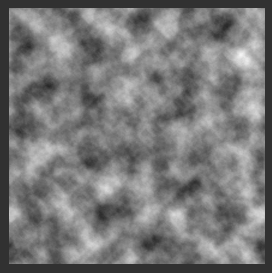
      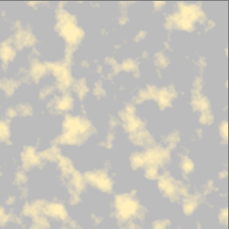
      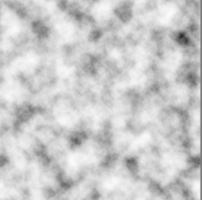

  1. **云的轻微扰动**
      + 因为根据需求云会轻微的起伏晃动
      + 这里可以了利用类似于双线性滤波的原理,进行实现
      + 在raymarchCloud之前加一个Pass , 把噪音图分为四块 或者 传入四张噪音图 , 输入time 进行sincos(time) 
      + finalColor = lerp(lerp(a,b,cos(t)),lerp(c,d,cos(t)),sin(t))

  2. **mask提前计算**
      + 在raymarch的时候是否输出这个颜色为alpha=noise-mask
      + 而在for循环的时候会对noise和mask分别进行采样,造成多次采样计算
      + 可以在云的轻微扰动阶段提前对alpha进行处理

      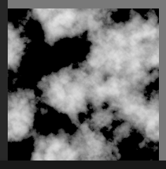

  3. **阴影的优化**
      + for循环的时候,阴影的矩阵计算比较消耗性能
      + 因为已经知道了起点位置,终点位置,当前的位置
      + 所以在没有CSM的时候,可以计算出起点的shadowCoords0和终点的shadowCoords1
      + 在for循环的时候 , shadowCoords = lerp(shadowCooords0,shadowCoords1,t) , 然后SampleShadowmap
      + 不知道数学上是不是正确,但是结果看起来好像没有什么问题.

  4. **for的次数减少**
      + 如果步长很短 , for循环次数过大. 虽然效果不错 , 但是性能消耗也会过高
      + 步长过大 , for循环次数明显减少. 性能大幅度提高 , 但是会出现明显的分层线和噪点
      + 因为步长变大颜色采样会有比较大的偏差 , 可以根据步长去乘一些系数
      + 啊这....自己取舍吧.

      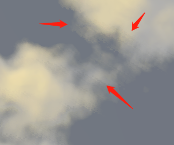

&emsp;&emsp; 上面 0 1 2 3 优化完帧数就提高了几FPS . 4 进行极端对比,FPS相差65(Emmmm,不过噪点,分层线) . 为了进一步满足效果和性能,便进行更进一步的优化处理了.

  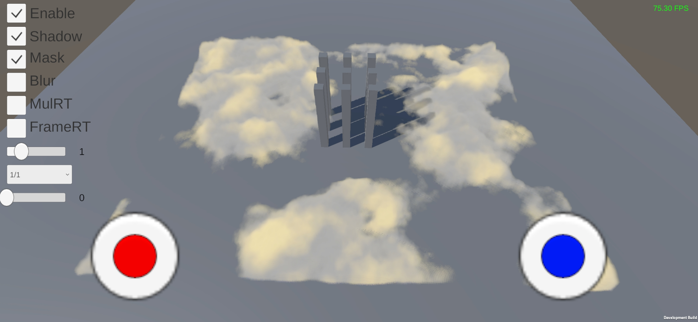
  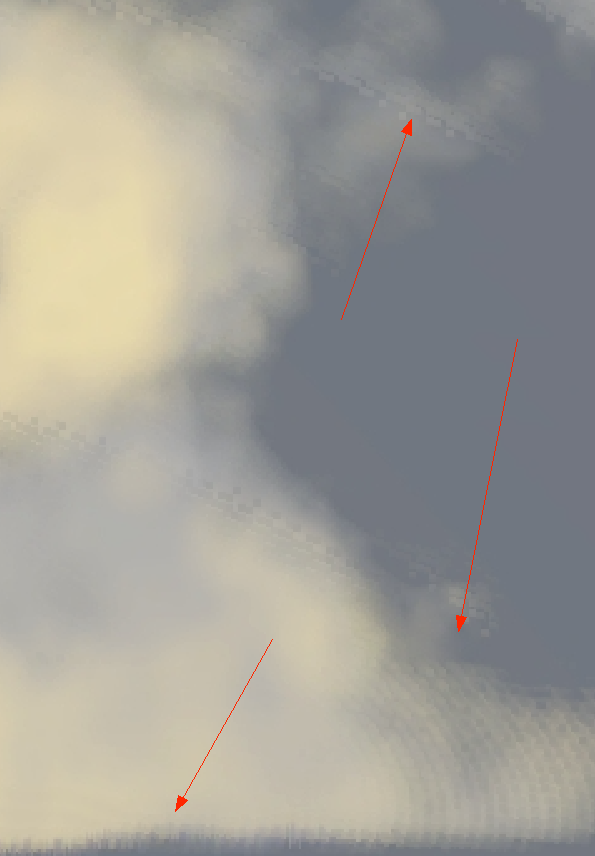

  5. **降低分辨率**
      + 单纯的降低分辨率是非常非常有效的.而且手机的分辨率都挺高的 , 适当降低不影响.
      + 宽高 1/1 即 1/1 分辨率 9 FPS
      + 宽高 1/2 即 1/4 分辨率 28 FPS
      + 宽高 1/4 即 1/16 分辨率 68 FPS
      + 可以观察云和cube的交界处,有比较明显的锯齿
      + 同时远处的时候也会出现一个深度的问题
        + 因为当前的分辨率是缩小的 , 我们无法很好的选择当前的像素去使用原分辨率的深度图的哪个像素(或用周围点 最大,平均,最小)
        + 远处这样可能会出现边缘不正确的问题 , 这里可以去添加 DOF/Blur去欺骗处理

      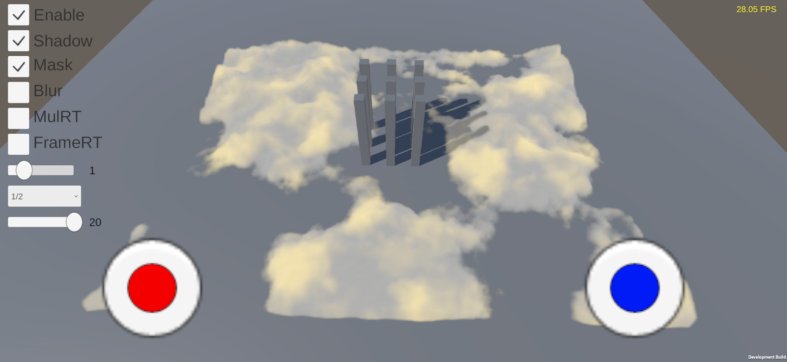
      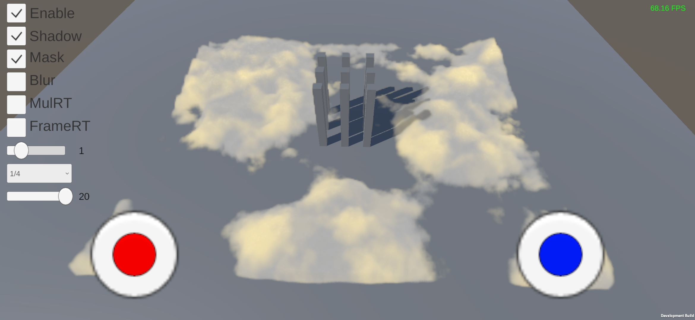

  6. **多图叠加(MulRT Blend)**
      + 原来是渲染宽高1/1的步长为1/20的 , 我们这里开启多图叠加
      + 创建两个RT ab . A:宽高为1/2步长1/20 , B:宽高为1/4步长为1/20
      + 其实分辨率降低可以进一步缩短步长提高效果 , 如 A步长可以为1/30 , B为1/40
      + 这样做还能柔化边缘的锯齿
      + 而且FPS可以提高从 9 提高到 22 

      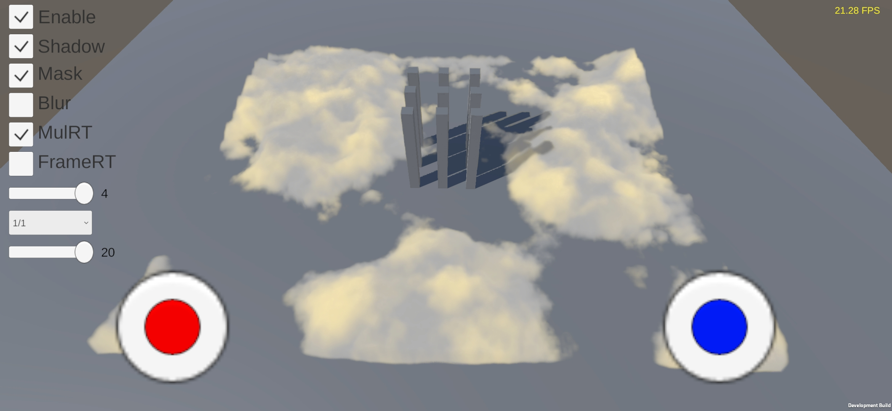
      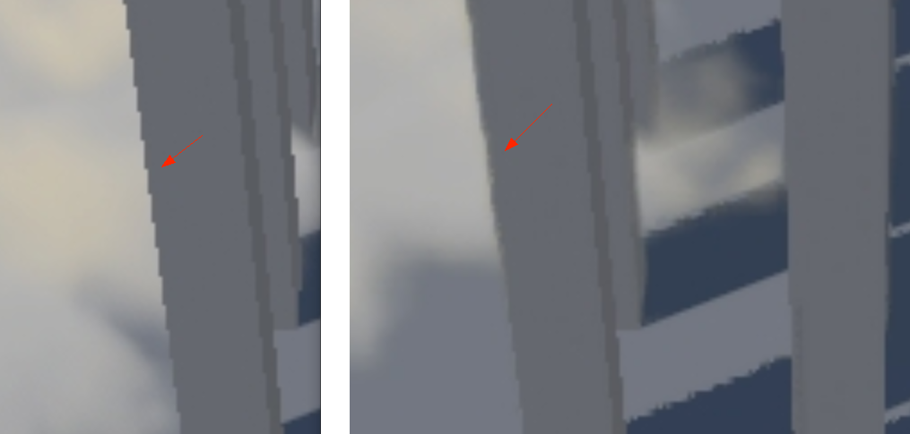

  7. **分帧绘制(FrameRT)**
      + 其实云的绘制和更新,可以分多帧完成,减少压力或提高清晰度
      + 但是在帧数过低的时候会出现拖影和未及时更新错误问题
          - 拖影:可以添加MotionBlur的算法大概率解决.但是这只能针对静态物体&动摄像机的情况
          - 未及时更新错误:比如物体一直向前走,其背后的区域没有及时更新会出现**镂空** , 前面的区域已被遮挡但是**未被擦除**
      + 可以配合TAA食用,但TAA在分辨率过低的时候会闪烁
      + 不绘制的区域DontCare/Load(很多手机DontCare就可以了,但是华为需要Load)

        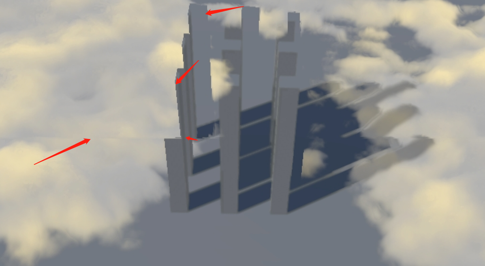
        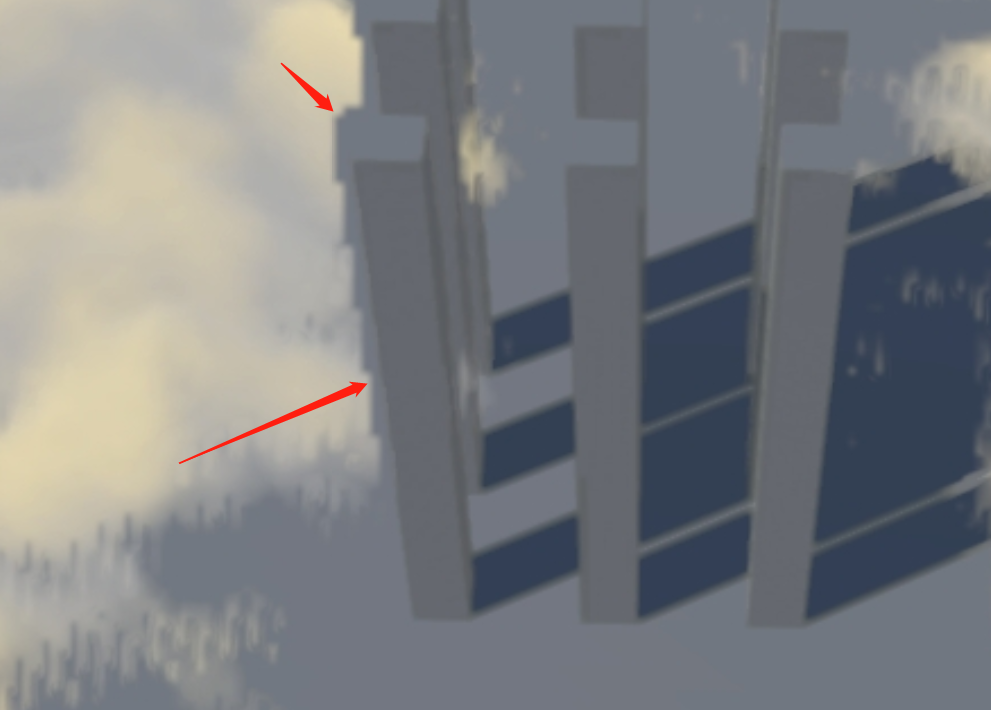

      + **0. 用1/4分辨率,绘制1/4**
          - 假设1/1(其它分辨率同理)的分辨率,用一个小的quad/三角形在A区域进行绘制,下一帧数在B区域进行绘制,然后C,D
          - 这样每次raymarch的像素就只有1/4了,清晰度有所下降
          - 绘制完整的分辨率循环要4帧,ABCD边界会有画面撕裂

        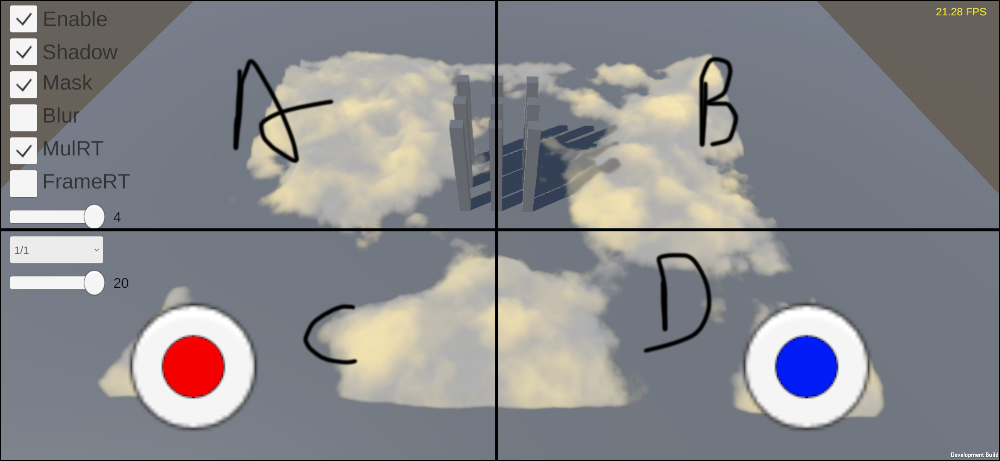
        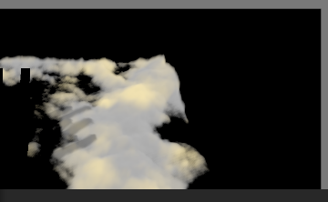
      
      + **1. 用全分辨率,绘制1/4**
          - 和 **0方法** 大致相同,但是是用1/1(其它分辨率同理)的分辨率绘制一个区域,而不是1/4
          - 对比 **0方法** ,性能一定会有所下降,但是毕竟高清了呀,也解决了深度图对应的问题
          - 绘制完整的分辨率循环要4帧,ABCD边界会有画面撕裂

      + **2. 用1/2的分辨率,绘制1/2竖屏**
        - 第一帧绘制AC区域,第二帧绘制BD,但是第三帧数不绘制
        - 第三帧不绘制是为了性能考虑,如果撕裂严重可以绘制
        - 耗时就是(1帧数ms+2帧数ms)/3
        - 绘制完整的分辨率要循环要三帧数,屏幕中间会有竖着的画面撕裂

        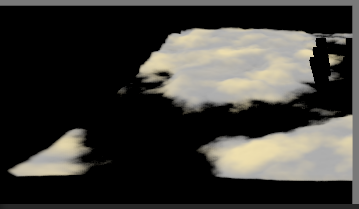

      + **3. 用1/2的分辨率,绘制1/2横屏**
        - 和 **2方法** 大致相同
        - 屏幕中间会有横着的画面撕裂
        - 屏幕如果竖着从中间撕裂的感觉会是两个场景.如果横着,感觉还是一个东西,但是被割裂了

      + **4. 1/4的小洞模式**
        - 有点类似于棋盘格渲染的思想,不过这里是多帧数罢了
        - 第1帧渲染A,第2帧数渲染B, 3 C, 4 D. 四帧一个循环
        - 可以用alpha为0或者discard,我这里用的是discard
        - 性能没有前面的**0 1 2 3 方法**好
        - 虽然没有画面撕裂了,但是会产生拖影
        - https://zhuanlan.zhihu.com/p/127435500
        - https://zhuanlan.zhihu.com/p/130785313

        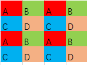
        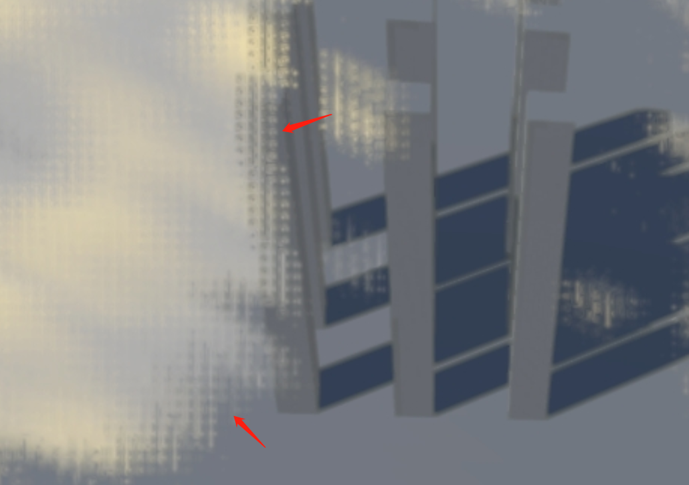

  8. **MulRTBlend+FrameRT**
      + 把两个合二为一,要考虑的有点多.这里就不多讲了
      + 然后尽量减少RT的切换,极限情况有6个Pass.根据不同情况,可以做到Pass的删减
          - 1个 离线Pass 
          - 1个 随机扰动Pass
          - 3个 MulRT Blend Pass
             - 绘制 1/4 RTA
             - 绘制 1/16 RTB
             - 把RTA,RTB合并到1/1 RT
          - 1个 Blend到最终屏幕
  9. **ComputeShadedr**
      + 偷懒没有做.但是理论上应该有提升,不过还是要靠数据说话

## **2.结果**
&emsp;&emsp; 说了这么多性能数据呢.

下面是1/1分辨率,步长是1/20,单位是FPS

mode 2 3 因为是有抽掉一帧不渲染,所以有波动

frame + mode 4 == null 没有做处理

| mode | 0 | 1 | 2 | 3 | 4 |
| ---- | - | - | - | - | - |
| mulRT+frame | 73 | 26 | 44~48 | 44~48 | 22 |
| frame | 33 | 33 | 40~46 | 40~46 | 9 |
| mulRT | 22 |
| null | 9 |

下面是1/2分辨率,步长是1/2,单位是ms

原谅辣鸡手机高刷只有90FPS,所以就用ms了

| mode | 0 | 1 | 2 | 3 | 4 |
| ---- | - | - | - | - | - |
| mulRT+frame | 1.5 | 2.8 | (3.8*2+0.1)/3 | (3.8*2+0.1)/3 | 3.6 |
| frame | 2.3 | 2.3 | 4.3 | 4.3 | 6.8 |
| mulRT | 3.6 |
| null | 6.8 |

下面是RT+Frame0,1/1分辨率,不同步长的耗时,单位是ms

1/0 我这里有给一个最小值0.1,可以当做1/0.1

| 步长 | 耗时(ms) |
| ---- | ------ |
| 1/0 | 1.4 |
| 1/1 | 2.8 |
| 1/2 | 3.2 |
| 1/4 | 4.4 |

下面是RT+Frame0,1/2分辨率,不同步长的耗时,单位是ms

| 步长 | 耗时(ms) |
| ---- | ------ |
| 1/2 | 1.6 |
| 1/3 | 2.0 |
| 1/4 | 2.4 |

不过大多数条件下我们用1/4的分辨率,1/2的步长,mulRT模式基本都够了.因为这时候的耗时<1ms,效果也还能接受.

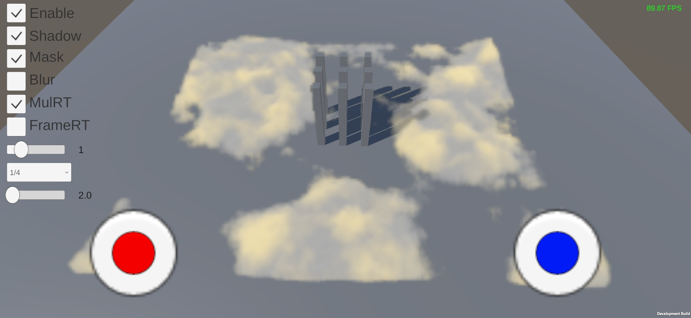