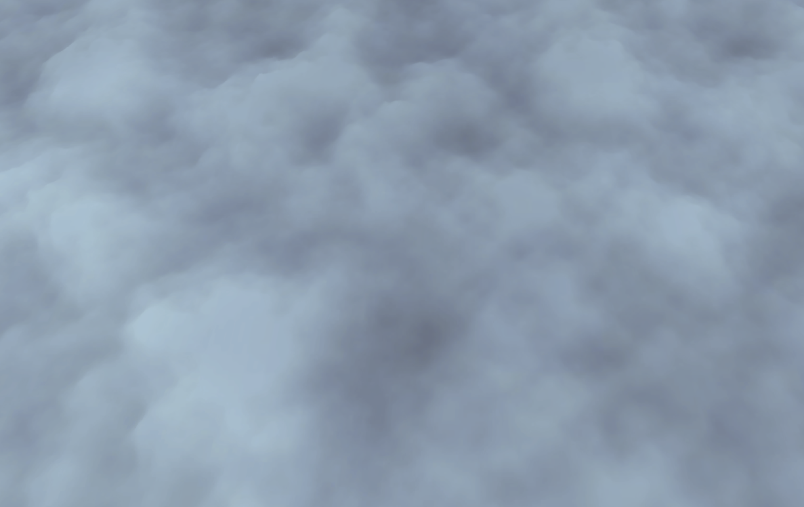
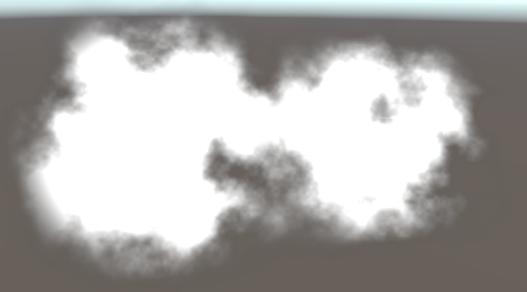
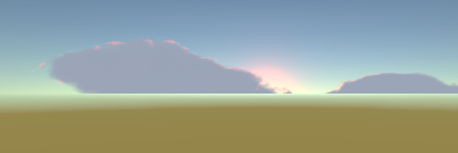
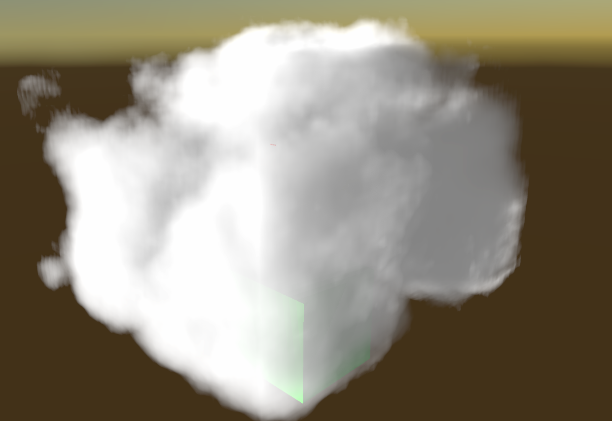
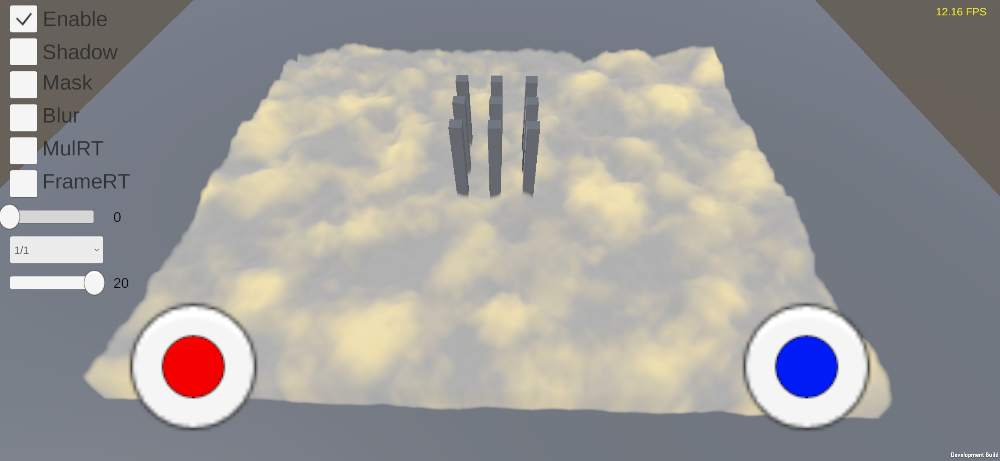
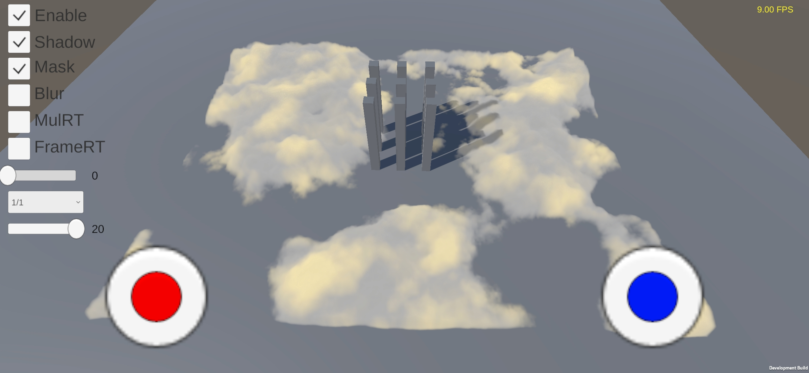
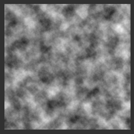
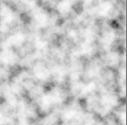

当我在Raymarch时我在想什么
=================

(Github正常排版: [当我在Raymarch时我在想什么](https://github.com/HHHHHHHHHHHHHHHHHHHHHCS/MyStudyNote/blob/main/MyNote/%E5%BD%93%E6%88%91%E5%9C%A8Raymarch%E6%97%B6%E6%88%91%E5%9C%A8%E6%83%B3%E4%BB%80%E4%B9%88.md))

-----------------

## &emsp;&emsp; 标题灵感来自于村上春树的<<当我谈跑步时我谈些什么>>.没有什么Raymarch相关的内容,主要是偏优化方向.

-----------------

## **0.起因**

&emsp;&emsp; 最近的任务是渲染云,所以写轮眼全开,写(抄袭并魔改)了一堆.但是网易分享的那篇云相关的文章(https://zhuanlan.zhihu.com/p/350058989) 至今绝望,因为还实现出来,而且也没有什么好的想法和灵感.
先放下我做完的效果图.一些是双拼魔改都搞乱了,找不到原作者见谅...感觉越做越像棉花XD

这个来自WalkingFat大佬的绒毛做法,我加了曲面细分(http://walkingfat.com/bump-noise-cloud-3d%e5%99%aa%e7%82%b9gpu-instancing%e5%88%b6%e4%bd%9c%e5%9f%ba%e4%ba%8e%e6%a8%a1%e5%9e%8b%e7%9a%84%e4%bd%93%e7%a7%af%e4%ba%91/)

这个是视差的做法(https://zhuanlan.zhihu.com/p/83355147)

这个是我最后被采纳的版本hhhhh开心.

然后我就把它放到了我的**小米10Pro高通865安卓手机**(打钱)上,结果FPS只有9.吶吶,电脑上明明这么高的FPS!!!所以就开始了优化之旅.

-----------------

## **1.经过**
* ### **优化方法**
&emsp;&emsp; Raymarch的我能想到的主要优化方法有(欢迎提出更多,一起分享)

  0. 降低分辨率
      + 像素越多,要raymarch越多,性能消耗越高.
      + 降低分辨率可以十分有效的提高FPS,
      + 但是随之而来的就是画质降低,颗粒感拉满.
  1. 剔除已经满足/不满足的效果,提前退出
      + 比如视野y相关的判断
      + 比如raycast box的碰撞检测
      + 比如云的alpha已经是1了,继续算算下去意义不大.
  2. 提前做好一些事情,在for的时候减少计算量
      + 光照什么的可以做一些烘焙减少计算
  3. 减少for的循环次数
      + 增加每一次for的步长,从而减少for的总次数
      + 但是随之而来的就是会不连续,有断线的感觉
      + 可以添加blur做弥补
  4. 降低刷新率
      + 也是比较有效的,但是快速转动会有残影
      + 可以添加motion blur或者taa做消除
  5. SDF预测
      + 记仇,没有思路
      + https://zhuanlan.zhihu.com/p/350058989

* ### **我做了什么**
&emsp;&emsp; 经过深思熟虑后,我做出了一个违背祖训的决定----把这一堆都糅杂再一起.

  0. 光照提前计算
      + 正常的的时候,我们的光照计算是在raymarch的for循环中进行的.因此会产生大量的性能消耗
      + 我这里离线把噪音贴图做了一个混合处理.把albedo和specular直接叠加写在了噪音贴图的RGB上,Alpha则是再次随机化后的噪音.
      + 做法是:把原来的噪音图进行随机采样,生出新的noise,之后计算光照输出finalColor. 
         - finalColor.rgb = albedo * specular * noise
         - finalColor.a = noise
      + 之前每一步ray都会计算,现在只用进行采样就好了.虽然效果不一定正确,但是优化嘛,不磕碜.
      + 下面三张图分别为原来的noise,finalColor.rgb,finalColor.a

      
      
      
  1. 云的轻微扰动
      + 因为根据需求云会轻微的起伏晃动
      + 双线性采样
  3. mask提前计算
      + 在raymarch的时候是否输出这个颜色为alpha=noise-mask
      + 而在for循环的时候对