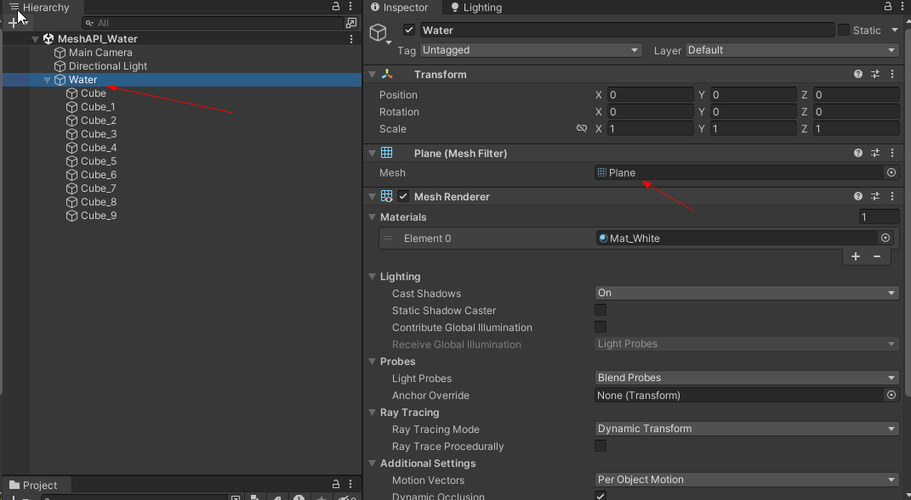

快速学点MeshAPI
=================

(Github正常排版: [快速学点MeshAPI][1])

-----------------

<!-- @import "[TOC]" {cmd="toc" depthFrom=1 depthTo=6 orderedList=false} -->

<!-- code_chunk_output -->

- [**0. 起因**](#0-起因)
- [**1. MeshDescriptor**](#1-meshdescriptor)
- [**2. NativeArray + Job**](#2-nativearray--job)
  - [**2.1 老方法**](#21-老方法)
  - [**2.1.1 基础代码**](#211-基础代码)
  - [**2.1.2 创建Mesh**](#212-创建mesh)
  - [**2.1.3 动起来**](#213-动起来)
  - [**2.2 Job**](#22-job)
  - [**2.2.1 Create Mesh**](#221-create-mesh)

<!-- /code_chunk_output -->

-----------------

## **0. 起因**

&emsp;&emsp; 都什么年代了还在用传统Mesh API. 随着Unity版本更新, 学点新的API. (你什么档次和我用一样的API, 砸了!)

包括下面几个点, 主要参考来源[代码仓库][5]. 当然也可以看看keijiro的Gayhub, 里面也有很多新奇的东西.
  + MeshDescriptor
  + NativeArray + Job
  + RawData + Compute Shader
  + Combine相关
  + 序列化相关

建议使用2021+的版本, 因为RawData需要.

-----------------

## **1. MeshDescriptor**

之前的写法的写法是:

设置vertices, normals. 再设置Mesh的IndexFormat为UInt32.

再设置 mesh中 索引为0的SubMesh 的 indexData(newIndices) 和 绘制模式(Triangles).

```C#

Mesh mesh = new Mesh();

mesh.vertices = newVertices;
mesh.normals = newNormals;

mesh.indexFormat = IndexFormat.UInt32
mesh.SetIndices(newIndices, MeshTopology.Triangles, 0);

```

后面出了**VertexAttributeDescriptor**, 学过OpenGL/DX之类的应该都熟悉 顶点属性描述, 可以包含位置, UV, 法线等等. [官方文档][2]

所以上面的vertex position和normal布局可以写成下面这样, 注意这里还没有填充数据. 

然后再补充Index Buffer属性, 即Index Buffer Count 和 Format.

```C#

Mesh mesh = new Mesh();

mesh.SetVertexBufferParams(verticesCount, new VertexAttributeDescriptor(VertexAttribute.Position, stream: 0)
, new VertexAttributeDescriptor(VertexAttribute.Normal, stream: 1));

mesh.SetIndexBufferParams(indicesCount, IndexFormat.UInt32);

```

然后进行数据填充, 这里省略掉了数据设置.

直接用 **SetVertexBufferData** 和 **SetIndexBufferData** 设置BufferData.

**MeshUpdateFlags**, 可以告诉 Unity 当Mesh数据更新的时候你别做一些事情. 比如 **DontRecalculateBounds** 不要自动生存包围盒, **DontValidateIndices** 不要检查Index索引(可能存在越界). 详见[官方文档][3].

```C#

var vertexPos = new NativeArray<Vector3>(verticesCount, Allocator.Temp);
var vertexNor = new NativeArray<Vector3>(verticesCount, Allocator.Temp);

//省略了数据填充

mesh.SetVertexBufferData(vertexPos, 0, 0, vertexPos.Length, 0, MeshUpdateFlags.DontRecalculateBounds);
mesh.SetVertexBufferData(vertexNor, 0, 0, vertexNor.Length, 1, MeshUpdateFlags.DontRecalculateBounds);


vertexPos.Dispose();
vertexNor.Dispose();

var indicesBuffer = new NativeArray<int>(verticesCount, Allocator.Temp);

//省略了数据填充

mesh.SetIndexBufferData(indicesBuffer, 0, 0, indicesBuffer.Length, MeshUpdateFlags.DontRecalculateBounds | MeshUpdateFlags.DontValidateIndices);

indicesBuffer.Dispose();

```

接着就是设置SubMesh.

同时因为上面让其不要自动生成包围盒, 渲染的时候存在Culling问题. 所以还可以指定一下.

```C#

var subMesh = new SubMeshDescriptor(0, indicesCount, MeshTopology.Triangles);
subMesh.bounds = new Bounds(Vector3.zero, new Vector3(10, 10, 10));
mesh.SetSubMesh(0, subMesh);
mesh.bounds = subMesh.bounds;

```

甚至还可以调用 **mesh.UploadMeshData(true)** , 立即把修改后的Mesh Data 发给 渲染API. **markNoLongerReadable** 如果为true, mesh将卸载掉脚本层的数据拷贝, 但是脚本层之后不能对mesh数据做读取, 跟Mesh的ReadOnly很像. [官方文档][4]

-----------------

## **2. NativeArray + Job**

Talk is cheap, show me your code!

### **2.1 老方法**

先来写一个以前版本的写法. 写完大概就是下图这样.


新建一个Plane, 命名为Water. 然后以Water为父节点, 随便摆放几个Cube.




### **2.1.1 基础代码**

新建个C# **WaterMesh.cs**, 添加 **RequireComponent**, 并且拖拽给Water.

```C#

using UnityEngine;
using UnityEngine.Rendering;

[RequireComponent(typeof(MeshFilter), typeof(MeshRenderer))]
public class WaterMesh : MonoBehaviour
{
}

```

首先需要数据, 这个Plane需要多大, 细分多少个点.

然后直接补充方法, 在 **OnEnable** 中创建 Mesh, **OnDisable** 中销毁Mesh.

因为要考虑到后面别的MeshAPI测试, 所以写了点代码结构.

```C#

public float widthSize = 10;
public float heightSize = 10;
public int widthPoints = 100;
public int heightPoints = 100;

private Mesh waterMesh;
private Vector3[] vertices;

private void OnEnable()
{
	CreateMesh();
}

private void OnDisable()
{
	if (waterMesh != null)
	{
		CoreUtils.Destroy(waterMesh);
	}
}

private void CreateMesh()
{
	waterMesh = CreateMesh_Old();
	GetComponent<MeshFilter>().sharedMesh = waterMesh;
}

private Mesh CreateMesh_Old()
{
	//TODO:
}

```

### **2.1.2 创建Mesh**

完善 **CreateMesh_Old** 方法.

不多赘述, 注意三角绘制顺序就行.

当老模式的时候, 用Unity自带的方法 **RecalculateNormals** 去重建Normal比较快.

```C#

private Mesh CreateMesh_Old()
{
	var mesh = new Mesh();

	mesh.name = "WaterMesh_Old";
	mesh.indexFormat = IndexFormat.UInt32;

	vertices = new Vector3[widthPoints * heightPoints];

	Vector3 startPos = new Vector3(-widthSize * 0.5f, 0, -heightSize * 0.5f);
	float stepOffsetX = widthSize / (widthPoints - 1);
	float stepOffsetZ = heightSize / (heightPoints - 1);

	for (int y = 0; y < heightPoints; y++)
	{
		for (int x = 0; x < widthPoints; x++)
		{
			vertices[y * widthPoints + x] = startPos + new Vector3(x * stepOffsetX, 0, y * stepOffsetZ);
		}
	}

	int row = heightPoints - 1;
	int column = widthPoints - 1;
	int[] indices = new int[column * row * 6];
	int idxStart = 0;

	for (int y = 0; y < row; y++)
	{
		for (int x = 0; x < column; x++, idxStart += 6)
		{
			int startVert = y * widthPoints + x;
			indices[idxStart + 0] = indices[idxStart + 3] = startVert;
			indices[idxStart + 1] = indices[idxStart + 5] = startVert + widthPoints + 1;
			indices[idxStart + 2] = startVert + 1;
			indices[idxStart + 4] = startVert + widthPoints;
		}
	}

	mesh.SetVertices(vertices);
	mesh.SetIndices(indices, MeshTopology.Triangles, 0);
	mesh.bounds = new Bounds(Vector3.zero, new Vector3(widthSize, float.Epsilon, heightSize));
	mesh.RecalculateNormals();

	return mesh;
}

```

### **2.1.3 动起来**

接着让Water Mesh动起来.

那么先要获取目标点(即cubes), 可以直接偷懒用Linq写. 添加属性Transform[] cubes, 然后直接用Linq Select. 注意这时候Cube的父节点要为Water.

```C#

public class WaterMesh : MonoBehaviour
{
	...
	private Vector3[] vertices;

	private Transform[] cubes;

	private void OnEnable()
	{
		cubes = transform.Cast<Transform>().Select(x => x.transform).ToArray();
		CreateMesh();
	}
}

```

添加UpdateMesh相关的属性和方法.

添加 水的波动周期 **waveFrequency** , 周期时间 **localTime**.

更新Mesh相关的三个方法 **Update** , **UpdateMesh** 和 **UpdateMesh_Old** .

```C#

public class WaterMesh : MonoBehaviour
{
	...
	public int heightPoints = 100;
	public float waveFrequency = 2.0f;

	...

	private Transform[] cubes;
	private float localTime;

	...

	private void OnDisable()
	{
		...
	}

	private void Update()
	{
		UpdateMesh();
	}

	private void CreateMesh()
	{
		...
	}

	private void UpdateMesh()
	{
		localTime = waveFrequency * Time.time;
		UpdateMesh_Old();
	}

	private Mesh CreateMesh_Old()
	{
		...
	}

	private void UpdateMesh_Old()
	{
		//TODO:
	}
}

```

完善 **UpdateMesh_Old** 方法.

波浪的y其实就是 **sin(dist * 12.0f - time) / (dist * 20 + 10)** , 再遍历cube做叠加.

```C#

private void UpdateMesh_Old()
{
	for (int i = 0; i < vertices.Length; i++)
	{
		var p = vertices[i];
		var y = 0.0f;
		foreach (var cube in cubes)
		{
			Vector3 cubePos = cube.transform.position;
			var p1 = new Vector2(p.x, p.z);
			var p2 = new Vector2(cubePos.x, cubePos.z);
			var dist = Vector2.Distance(p1, p2);
			y += Mathf.Sin(dist * 12.0f - localTime) / (dist * 20 + 10);
		}

		p.y = y;
		vertices[i] = p;
	}

	waterMesh.SetVertices(vertices);
	waterMesh.RecalculateNormals();
}

```

### **2.2 Job**

改成Job的模式去更新.

### **2.2.1 Create Mesh**

//TODO: Enum
//TODO: 创建和销毁   创建效率没有第一种高
//TODO: Create Mesh
//TODO: Job Update


-----------------

[1]:https://github.com/HHHHHHHHHHHHHHHHHHHHHCS/MyStudyNote/blob/main/MyNote/%E5%BF%AB%E9%80%9F%E5%AD%A6%E7%82%B9MeshAPI.md
[2]:https://docs.unity3d.com/2022.2/Documentation/ScriptReference/Rendering.VertexAttributeDescriptor.html
[3]:https://docs.unity.cn/ScriptReference/Rendering.MeshUpdateFlags.html
[4]:https://docs.unity3d.com/ScriptReference/Mesh.UploadMeshData.html
[5]:https://github.com/Unity-Technologies/MeshApiExamples