水一篇
======

(Github正常排版: [水一篇](https://github.com/HHHHHHHHHHHHHHHHHHHHHCS/MyStudyNote/blob/main/MyNote/%E6%B0%B4%E4%B8%80%E7%AF%87.md))

-----------------

目录
- [水一篇](#水一篇)
	- [**0.原因**](#0原因)
	- [**1.原理**](#1原理)
		- [**1.1.摄像机**](#11摄像机)
		- [**1.2.射线**](#12射线)
		- [**1.3.步进**](#13步进)
	- [**2.框架搭建**](#2框架搭建)

-----------------

## **0.原因**

&emsp;&emsp; 前两天又看见@ycz的史莱姆的demo了([Demo视频地址](https://www.bilibili.com/video/BV1YL411V7DM?spm_id_from=333.851.b_7265636f6d6d656e64.6))! 其实想知道到底用的什么技术做的Doge. 可恶的白神!!!

然后就做了猜想. 第一种就是两年前做的类似于SDF的做法, 也就是今天要讲的. 我抄的@ShinaMashiro 的这篇文章 https://zhuanlan.zhihu.com/p/90245545 . 其实他这篇已经讲的很详细了, **我这篇只是做一个他的的学习笔记**.

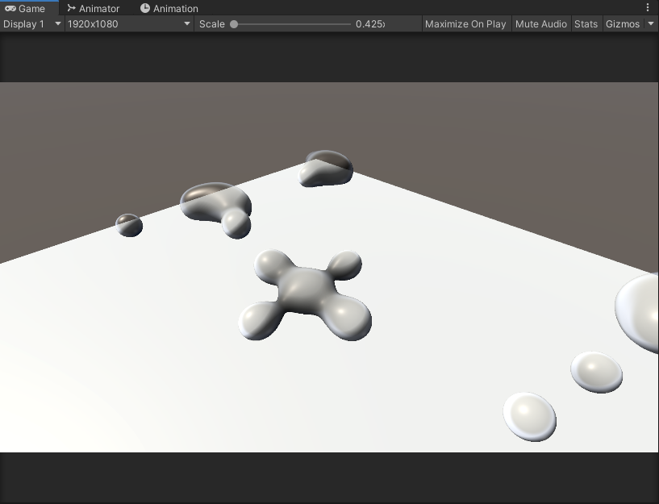

第二种就是骨骼控制. 想起了刚发布的星之卡比3D, 不知道卡比是不是用的这套技术.


放错了再来.

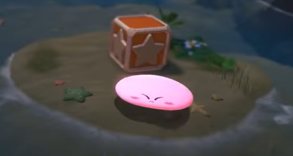

第三种就是物理模拟更新Mesh. 这套比较符合白神(的炫技), 因为在她的另外一个视频里面, 也有胶状/果冻的物理DuangDuangDuang.

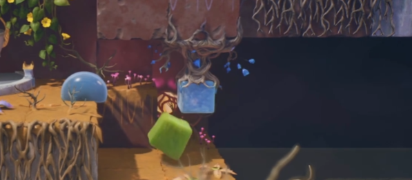

还有之前有想过一个问题, 就是我看物理模拟都是粒子点的, 是怎么把它渲染成效果的. 然后本来这篇是想写这老哥写的液体模拟, 奈何还没有学完.(他有一个免费版本的)[商店地址](https://assetstore.unity.com/packages/tools/physics/zibra-liquids-200718?q=Zibra&orderBy=1)

 

大体出来的效果是这样的.

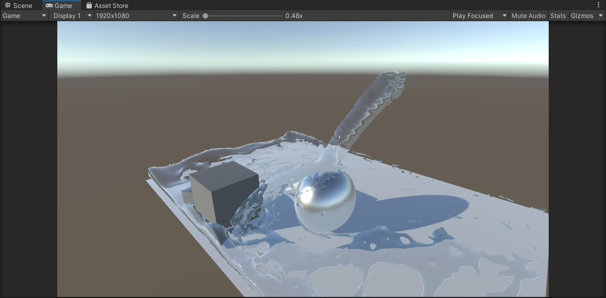 

后面白神回我了一个视频. 有点是射线检测更新mesh的既视感. 失算了, hhhhh.

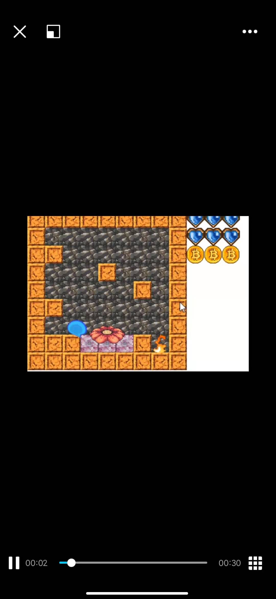 

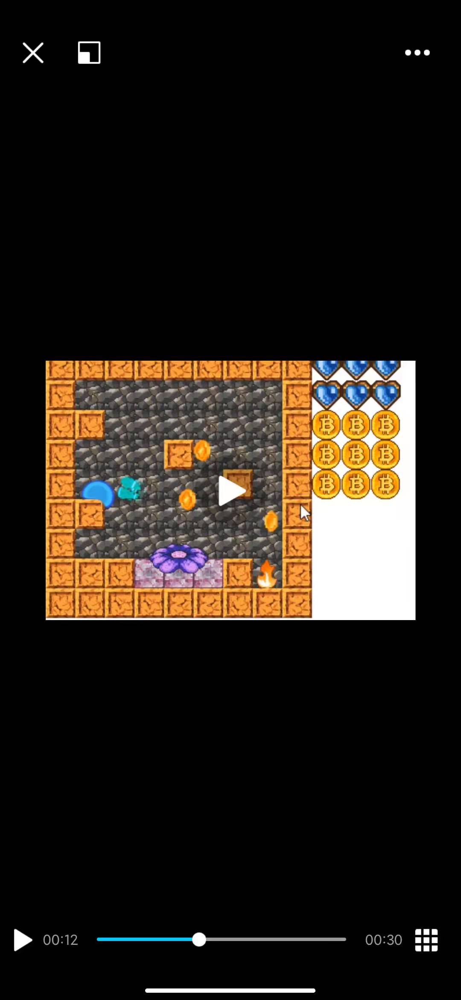 


-----------------

## **1.原理**

&emsp;&emsp; Raymarch+SDF知乎上有很多文章, 还有IQ大佬保姆级系列文章, ShaderToy也有很多相关代码. 所以我这里就快速的人云亦云. 

### **1.1.摄像机**

&emsp;&emsp; 先创建一个透视摄像机机(当然也可以是正交摄像机,不过Ray要对应修改一下). 

假设在View空间, 相机的起点是零点, forward方向是Z正方向. 同时具有fov, aspect, near. 因此可以确定近平面四个点的位置, 并且生成UV.

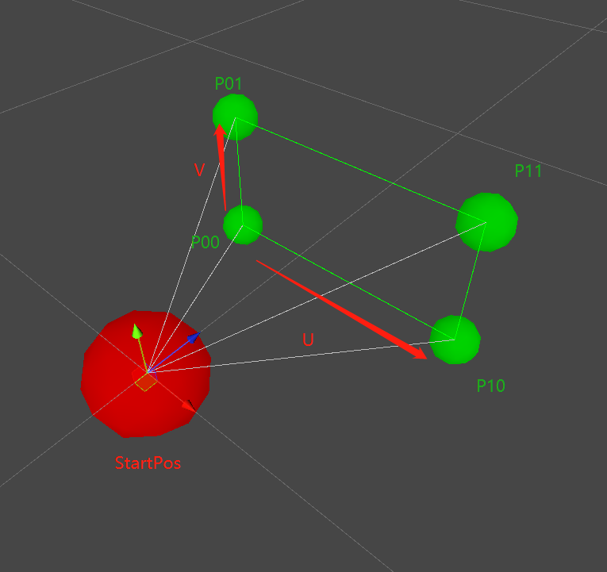 

### **1.2.射线**

&emsp;&emsp; RayMarching, 可以理解为射线步进. 所以我们要先创建射线Ray.

近平面任意一点的位置为: RanomP =  P00 + (P10 - P00) * U + (P01 - P00) * V

从而推出Ray = RanomP - StartPos. 因为StartPos是零点, Ray = RanomP.

这时候加入z属性, 则可以利用等比缩放确认摄像机内的任意一点. (有深度图和ViewToWorldMatrix, 可以还原WorldPosition)

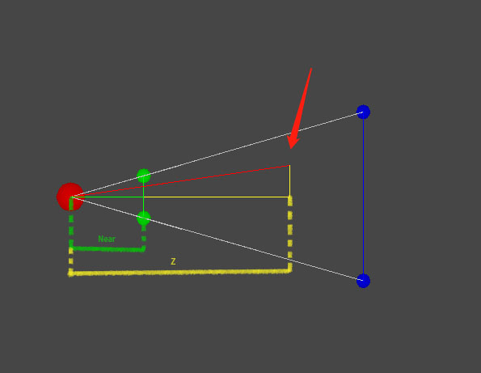 

那么射线怎么分布呢. 通常和RenderTexture有关, 假如RT是3x2像素的. 则把近平面分为3x2的格子, 每一个格子的中间点减去StartPos就是射线. 跟UV或者SV_Position有点像.

这也说明像素越多, 射线越密集, 效果越准确越好.

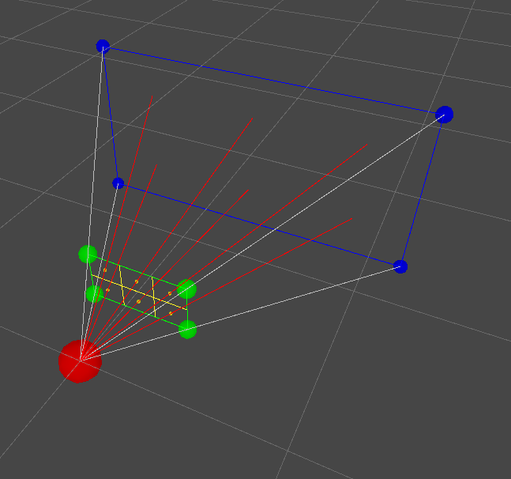

### **1.3.步进**

&emsp;&emsp; 有了Ray, 之后就要怎么进行步进了.

先上ArtOfCode大佬的一个图.

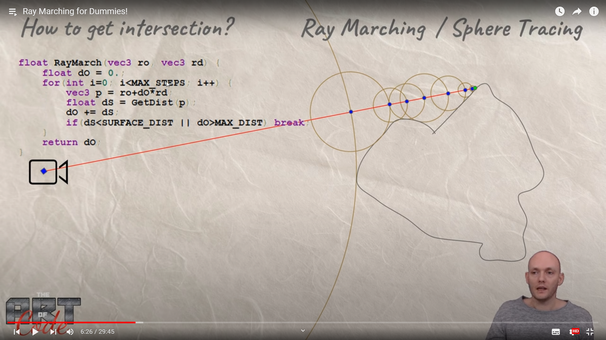

再多放一张有助于理解.

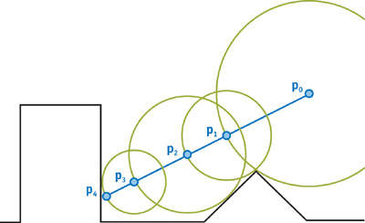

RayMarching的物体需要一个 **float GetDist(float3 point)**方法. 表示点到物体最近的距离. 

假如是球, 则方法表达式为. 还有别的形状可以参考IQ大佬的博客.

```C++

float GetDist (float3 point)
{
	return length(圆心-point) - 半径;
}

```

然后就循环进行步进. 配合上图可以写成伪代码.

```C++

//射线方向 需要normalize
func RayMarching(float3 起点, float3 射线方向)
{
	float 步进距离 = 0;

	for(int i=0; i<最大循环; i++)
	{
		float3 当前点 = 起点 + 射线方向 * 步进距离;
		float 最近距离 = GetDist(p);
		步进距离 += 最近距离;
		if(最近距离 < 0.001)//存在容错
		{
			return 击中;
		}
		if(最近距离 > 最远距离)
		{
			return 超出距离;
		}
	}

	return 步进距离;
}

```

如果场景存在多个物体, 最近距离为 遍历物体得到距离中的 最小值.

其它的写代码的时候在细说吧.

-----------------

## **2.框架搭建**