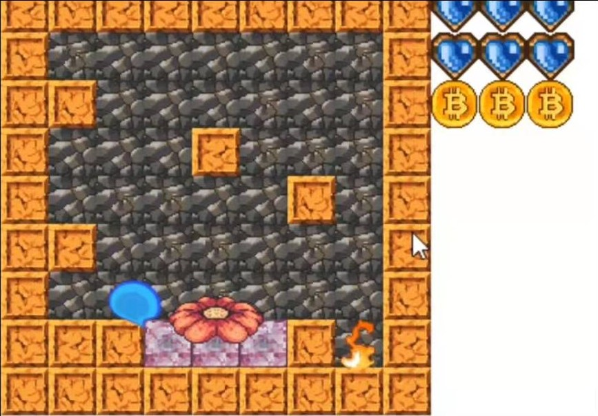
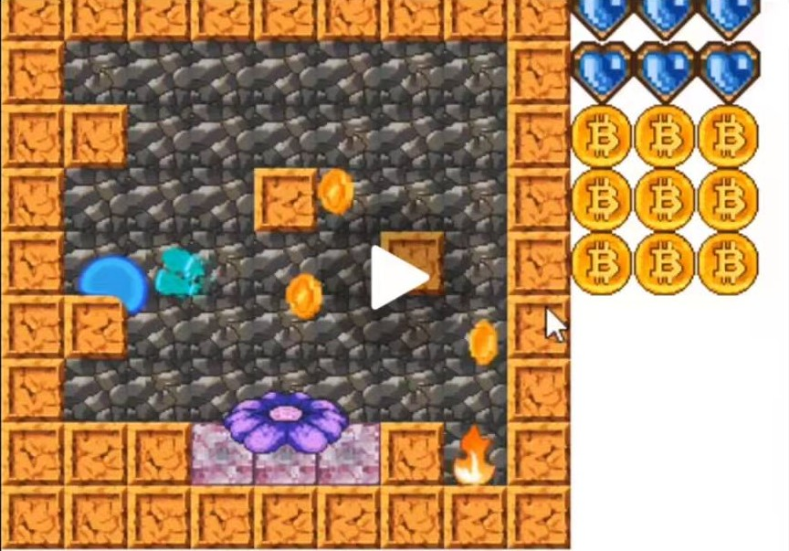

水一篇
======

(Github正常排版: [水一篇](https://github.com/HHHHHHHHHHHHHHHHHHHHHCS/MyStudyNote/blob/main/MyNote/%E6%B0%B4%E4%B8%80%E7%AF%87.md))

-----------------

目录

-----------------

## **0.原因**

&emsp;&emsp; 前两天又看见@ycz的史莱姆的demo了([Demo视频地址](https://www.bilibili.com/video/BV1YL411V7DM?spm_id_from=333.851.b_7265636f6d6d656e64.6))! 其实想知道到底用的什么技术做的Doge. 可恶的白神!!!

然后就做了猜想. 第一种就是两年前做的类似于SDF的做法, 也就是今天要讲的. 我抄的@ShinaMashiro 的这篇文章 https://zhuanlan.zhihu.com/p/90245545 . 其实他这篇已经讲的很详细了, **我这篇只是做一个他的的学习笔记**.

第二种就是骨骼控制. 想起了刚发布的星之卡比3D, 不知道卡比是不是用的这套技术.

放错了再来.

第三种就是物理模拟更新Mesh. 这套比较符合白神(的炫技), 因为在她的另外一个视频里面, 也有胶状/果冻的物理DuangDuangDuang.

之前有想过一个问题, 就是我看物理模拟都是粒子点的, 是怎么把它渲染成效果的. 然后本来这篇是想写这老哥写的液体模拟, 奈何还没有学完.(他有一个免费版本的)[商店地址](https://assetstore.unity.com/packages/tools/physics/zibra-liquids-200718?q=Zibra&orderBy=1)

 

大体出来的效果是这样的.

 

后面白神回我了一个视频. 有点是射线检测更新mesh的既视感. 失算了, hhhhh.

 

 

-----------------

## **0.原理**

&emsp;&emsp; Raymarch+SDF知乎上有很多文章, 还有IQ大佬保姆级系列文章, ShaderToy也有很多相关代码. 所以我这里就快速的人云亦云.

先创建一个透视摄像机机(当然也可以是正交摄像机,不过Ray要对应修改一下). 相机具有起点位置, 远平面四个点的位置和UV属性.

 

