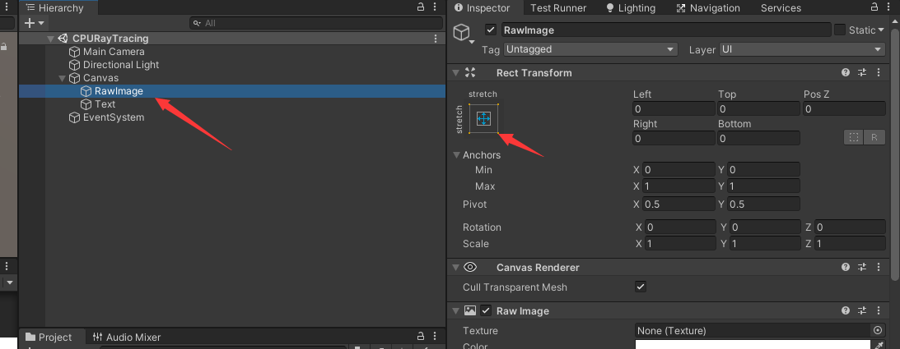
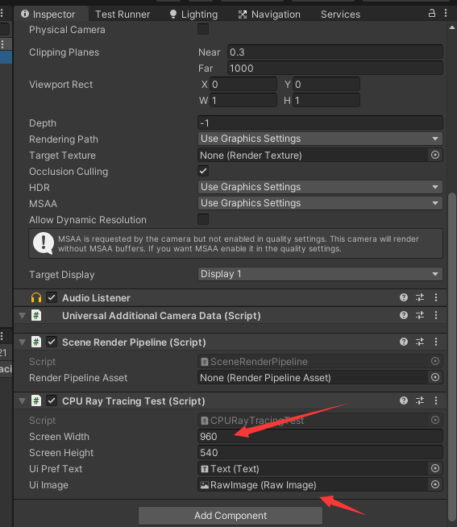

简单的RayTrace_CPU
=================

(Github正常排版: [简单的RayTrace_CPU](https://github.com/HHHHHHHHHHHHHHHHHHHHHCS/MyStudyNote/blob/main/MyNote/%E7%AE%80%E5%8D%95%E7%9A%84RayTrace_CPU.md))

------------------------

[0. 原因](#0)<br>

-----------------
<span id='0'/>

## **0.原因**

&emsp;&emsp; 看到gayhub上有一个项目,抄着学习一下(jiu shi wan),项目地址:[ToyPathTracer](https://github.com/aras-p/ToyPathTracer).

效果虽然不是很好,而且也没有什么高大上的东西,甚至都只有球的计算,但是拿来入门学习还是够用的.里面还有C++和C#的案例,这里就拿Unity来举个栗子,比较容易理解也比较直观.

顺便安利一下闫老师的Games101讲的更详细,而且还搭配逐步的练习.PS:202也出了,yyds!

下图分别是C++,Unity+Job,纯C#(图三和四).效果基本都差不多,但是效率差很大.不过Job的效率居然比想象中的强大.


CPU都被拉满了,比博人传都要燃啊,堪比献给未来的游戏--某剑六,希望七不要拉胯了,拉胯了就说明别人是CPU光追游戏!!!


不过也有解决办法(doge)


回归正题其实学光追还有一个原因,就是很多东西光栅化的确很难办到(但是这个demo只讲简单的光追学习).

比如这个[网站](https://www.imaginationtech.com/blog/hybrid-rendering-for-real-time-lighting/)就举了一些例子,对比说明了光追和光栅化的一些区别.

比如说雨伞是可以轻微透光的,当然光栅化也可以用再次渲染一个shadowmap实现两个shadow的叠加.


还有曲面产生的自发光效果.遥想Unity当年面片自发光还要离线呢!


再比如你撑着遮阳伞着伞走在马路上.伞的内部其实是会被来自地砖的光照亮的.如果按照shadowmap的原理内部应该是暗的.虽然也可以添加**Reflection Probe**来解决.


-----------------

## **1.基础配置**

&emsp;&emsp; 项目需要安装Packages:Burst,Jobs,Mathematics.

创建一个**RawImage**,设置为全屏幕大小,用于显示最后的效果.当然也可以用**CommandBuffer.DrawFullScreen**或者**Graphics.Blit**都可以.这里用UI,首先是偷懒,第二是确保不会被后处理/颜色校正/颜色转换.



创建一个C# **CPURayTracingTest.cs**

```C#
using System;
using System.Diagnostics;
using Unity.Collections;
using UnityEngine;
using UnityEngine.UI;


public class CPURayTracingTest : MonoBehaviour
{
	public int screenWidth, screenHeight;

	public RawImage uiImage;
}
```

挂载给摄像机,并且把刚才的**RawImage**给**uiImage**进行赋值.**screenWidth screenHeight** 给960和540.

屏幕尺寸这里建议给小一点,为了后面方便快速呈现效果.(当然银河电脑当我没有话说!)因为一个像素点会发射很多的光线进行大量的计算,所以给的点越少计算量越少,但是效果越差.



**RawImage**的图片需要**Texture2D**(**Texture2D**需要申请为Linear Color Space, 不过写成false对最终渲染的画面也没有影响),而**Texture2D**的颜色需要**Color Buffer**来填充数据.

**Color Buffer**说白了就是一堆**Color**(需要屏幕像素数量的Color即width*height),便可以直接用**NativeArray<Color>t**来代替.(因为是长生命周期,所以用Allocator.Persistent. Allocator不知道的可以点击[Native Container Allocator](https://blog.csdn.net/lrh3025/article/details/102869011))

创建**Texture2D**和**NativeArray<Color>**,对其进行默认设置.

因为**Color Buffer**每帧数都要做计算更新,所以**Texture2D**需要每帧数回读**Color Buffer**,那便在**Update**进行**Texture2D.LoadRawTextureData**.

最后别忘了在脚本销毁的时候需要释放**NativeArray<Color>**.

这样一来基础的配置就完成了.

```C#
public class CPURayTracingTest : MonoBehaviour
{
	....

	private Texture2D backBufferTex;
	private NativeArray<Color> backBuffer;

	private void Start()
	{
		int width = screenWidth; //Screen.width;
		int height = screenHeight; // Screen.height;

		backBufferTex = new Texture2D(width, height, TextureFormat.RGBAFloat, false, true);
		backBuffer = new NativeArray<Color>(width * height, Allocator.Persistent);
		for (int i = 0; i < backBuffer.Length; i++)
		{
			backBuffer[i] = new Color(0, 0, 0, 1);
		}

		uiImage.texture = backBufferTex;
	}

	private void OnDestroy()
	{
		backBuffer.Dispose();
	}

	private void Update()
	{
		backBufferTex.LoadRawTextureData(backBuffer);
		backBufferTex.Apply();
	}
}
```

-----------------

## **2.工具类准备**

&emsp;&emsp; 在做光追的时候,先要提前准备一些结构体和求交计算.

创建一个static class**CPURayTracingMathUtil.cs**.为了后面写代码方便用**static**方法导入**Mathematics**.

```C#
using Unity.Collections;
using Unity.Collections.LowLevel.Unsafe;
using Unity.Mathematics;
using static Unity.Mathematics.math;

public static class CPURayTracingMathUtil
{

}
```

先创建几个结构体用于储存数据.

射线:**Ray**,需要起始点**ori**和方向**dir**,射线上的某一个点可以表示为ori+dir*t,t>=0,t即距离

碰撞结果:**Hit**,用于一个射线碰撞到场景物体记录的信息结构体.碰撞的点**pos**,记录碰撞点的法线**normal**,射线走了多少距离**t**.

球:**Sphere**,球就是圆心位置**center**和半径**radius**.

```C#
...

public struct Ray
{
	public float3 ori;
	public float3 dir;

	public Ray(float3 o, float3 d)
		=> (ori, dir) = (o, d);

	public float3 PointAt(float t) => ori + dir * t;
}

public struct Hit
{
	public float3 pos;
	public float3 normal;
	public float t;
}

public struct Sphere
{
	public float3 center;
	public float radius;

	public Sphere(float3 c, float r)
		=> (center, radius) = (c, r);
}

public static class CPURayTracingMathUtil
{

}

```

再创建摄像机(Camera)结构体.

摄像机需要起始点**lookFrom**,看的方向**lookAt**,向上的方向**vup**默认float3(0,1,0),视场角**fov**(也就是俗称的底),屏幕宽高**aspect**,光圈大小**aperture**(虚化用),聚焦距离**focusDist**.(Games101-P19有超级详细的说明)

**aperture**值越大,代表光圈越大.因为镜片是薄棱镜,所以产生折射角度会越大,光线不会聚集到一起,最后图像会被模糊.下面的图可以看到效果,显而易见远处模糊.


aperture = 0.5 * 0.2

aperture = 0.1 * 0.2


**focusDist**聚焦距离,正常改动影响不会很大.但是如果**aperture**值比较大的时候就很重要,它能确保聚焦距离对应的一块的图像是清晰的.


aperture = 1 * 0.2 , distToFocus = 3

aperture = 1 * 0.2 , distToFocus = 6


用传入的数据构建摄像机完成基础的属性.

```C#

...

public struct Sphere
{
	...
}

public struct Camera
{
	private float3 origin;
	private float3 lowerLeftCorner;
	private float3 horizontal;
	private float3 vertical;
	private float3 u, v, w;
	private float lensRadius;

	// vfov is top to bottom in degrees
	//aperture光圈大小 模糊用   focusDist是聚焦的距离
	public Camera(float3 lookFrom, float3 lookAt, float3 vup, float vfov, float aspect, float aperture, 
	float focusDist)
	{
		lensRadius = aperture / 2;
		float theta = vfov * PI / 180;
		float halfHeight = tan(theta / 2);
		float halfWidth = aspect * halfHeight;
		origin = lookFrom;
		w = normalize(lookFrom - lookAt);
		u = normalize(cross(vup, w));
		v = cross(w, u);
		lowerLeftCorner = origin - focusDist * (halfWidth * u + halfHeight * v + w);


		horizontal = 2 * halfWidth * focusDist * u;
		vertical = 2 * halfHeight * focusDist * v;
	}
}

public static class CPURayTracingMathUtil
{
}

```


因为光追是从相机点出发射向聚焦平面,所以我们还需要写一个方法用于得到射线.

因为存在光圈,即我们可能会得到虚化/模糊的图片.可以参考上面的图,其实就是没有完美成像在平面上.那么我们可以反过来想,可以让发出去的射线不会太规则,让其加点随机偏移和方向偏离,然后把得到的颜色平均,这样就可以得到虚化的效果了.

随机方向这块可以用别的方法替代,甚至可以用do-while.但是要确保要在圆/球的外面,且不能超过单位1的cube.因为在球内则可能值过小,如果是归一化,则分布的还不够随机过于密集.

```C#

public struct Camera
{
	...

	public Ray GetRay(float s, float t, ref uint state)
	{
		float3 rd = lensRadius * CPURayTracingMathUtil.RandomInUnitDisk(ref state);
		float3 offset = u * rd.x + v * rd.y;
		return new Ray(origin + offset,
			normalize(lowerLeftCorner + s * horizontal + t * vertical - origin - offset));
	}
}


public static class CPURayTracingMathUtil
{
	
	//Random
	//-------------------

	//生成随机数
	private static uint XorShift32(ref uint state)
	{
		uint x = state;
		x ^= x << 13;
		x ^= x >> 17;
		x ^= x << 15;
		state = x;
		return x;
	}

	//[0,1)
	public static float RandomFloat01(ref uint state)
	{
		// 0xFFFFFF => 16777215
		return (XorShift32(ref state) & 0xFFFFFF) / 16777216.0f;
	}

	public static float3 RandomInUnitDisk(ref uint state)
	{
		float3 p;
		// do
		// {
		// 	p = 2.0f * new float3(RandomFloat01(ref state), RandomFloat01(ref state), 0) - new float3(1, 1, 0);
		// } while (lengthsq(p) >= 1.0);
		// return p;

		var x = RandomFloat01(ref state);
		var y = RandomFloat01(ref state);

		float length = 1;
		float dx, dy;
		if (x == 0 && y == 0)
		{
			// return float3(2, 2, 0); // => float3(1,1,0)+float3(1,1,0);
			dx = 1;
			dy = 1;
		}
		else
		{
			float len = sqrt(x * x + y * y);
			dx = x / len;
			dy = y / len;

			if (x != 0 && y != 0)
			{
				float maxDis = min(y / x, x / y); //碰触到 x=1|y=1 的点的距离
				maxDis = sqrt(maxDis * maxDis + 1 * 1) - 1;
				length += maxDis * RandomFloat01(ref state);
			}
		}


		//象限
		var xx = RandomFloat01(ref state);
		if (xx < 0.25f) //第一象限
		{
		}
		else if (xx < 0.5f) //第二象限
		{
			dx *= -1;
		}
		else if (xx < 0.75f) //第三象限
		{
			dx *= -1;
			dy *= -1;
		}
		else //if (xx < 1f)//第四象限
		{
			dy *= -1;
		}

		p = float3(dx * length, dy * length, 0);


		return p;
	}

	public static float3 RandomInUnitSphere(ref uint state)
	{
		float3 p;
		// do
		// {
		// 	p = 2.0f * new float3(RandomFloat01(ref state), RandomFloat01(ref state), RandomFloat01(ref state)) -
		// 	    new float3(1, 1, 1);
		// } while (lengthsq(p) >= 1.0);
		// return p;

		var x = RandomFloat01(ref state);
		var y = RandomFloat01(ref state);
		var z = RandomFloat01(ref state);

		float length = 1;
		float dx, dy, dz;

		if (x == 0 && y == 0 && z == 0)
		{
			// return float3(2, 2, 2); // => float3(1,1,1)+float3(1,1,1);
			dx = 1;
			dy = 1;
			dz = 1;
		}
		else
		{
			float len = sqrt(x * x + y * y + z * z);
			dx = x / len;
			dy = y / len;
			dz = z / len;

			float a, b, c;
			float macD = max(max(x, y), z);
			a = x / macD;
			b = y / macD;
			c = z / macD;

			float maxDis = sqrt(a * a + b * b + c * c) - 1;
			length += maxDis * RandomFloat01(ref state);
		}


		//象限
		var xx = RandomFloat01(ref state);
		if (xx < 0.125f) //第一象限
		{
		}
		else if (xx < 0.25f) //第二象限
		{
			dx *= -1;
		}
		else if (xx < 0.375f) //第三象限
		{
			dx *= -1;
			dy *= -1;
		}
		else if (xx < 0.5f) //第四象限
		{
			dy *= -1;
		}

		if (xx < 0.625f) //第五象限
		{
			dz *= -1;
		}
		else if (xx < 0.75f) //第六象限
		{
			dx *= -1;
			dz *= -1;
		}
		else if (xx < 0.875f) //第七象限
		{
			dx *= -1;
			dy *= -1;
			dz *= -1;
		}
		else //if (xx < 1f)//第八象限
		{
			dy *= -1;
			dz *= -1;
		}

		p = float3(dx * length, dy * length, dz * length);


		return p;
	}

	public static float3 RandomUnitVector(ref uint state)
	{
		float z = RandomFloat01(ref state) * 2.0f - 1.0f;
		float a = RandomFloat01(ref state) * 2.0f * PI;
		float r = sqrt(1.0f - z * z);
		float x, y;
		sincos(a, out x, out y);
		return new float3(r * x, r * y, z);
	}
}

```

-----------------

## **3.射线和球相交**

接下来就就是比较麻烦的射线和球的相交计算.

创建一个**struct SpheresSOA**在**CPURayTracingMathUtil.cs**.先添加点属性用来储存全部球的信息.本来可以用**NativeArray<float4> XYZRadius**来记录,但是为了后面计算的方便快捷,就改成单独记录centerX,centerY,centerZ,radius. radius甚至可以提前计算好r*r和1/r,节约运算.

然后一组是4个,因为floatN最大是float4,开辟一个向上4取整的长度进行初始化.并且别忘记添加销毁代码.

```C#
...

public struct Sphere
{
	...
}

public struct SpheresSOA
{
	[ReadOnly] public NativeArray<float> centerX;
	[ReadOnly] public NativeArray<float> centerY;
	[ReadOnly] public NativeArray<float> centerZ;
	[ReadOnly] public NativeArray<float> sqRadius;
	[ReadOnly] public NativeArray<float> invRadius;

	public SpheresSOA(int len)
	{
		var simdLen = ((len + 3) / 4) * 4;
		centerX = new NativeArray<float>(simdLen, Allocator.Persistent);
		centerY = new NativeArray<float>(simdLen, Allocator.Persistent);
		centerZ = new NativeArray<float>(simdLen, Allocator.Persistent);
		sqRadius = new NativeArray<float>(simdLen, Allocator.Persistent);
		invRadius = new NativeArray<float>(simdLen, Allocator.Persistent);
		// set trailing data to "impossible sphere" state
		for (int i = len; i < simdLen; ++i)
		{
			centerX[i] = centerY[i] = centerZ[i] = float.MaxValue;
			sqRadius[i] = 0.0f;
			invRadius[i] = 0.0f;
		}
	}

	public void Dispose()
	{
		centerX.Dispose();
		centerY.Dispose();
		centerZ.Dispose();
		sqRadius.Dispose();
		invRadius.Dispose();
	}

	public void Update(Sphere[] src)
	{
		for (var i = 0; i < src.Length; i++)
		{
			ref Sphere s = ref src[i];
			centerX[i] = s.center.x;
			centerY[i] = s.center.y;
			centerZ[i] = s.center.z;
			sqRadius[i] = s.radius * s.radius;
			invRadius[i] = 1.0f / s.radius;
		}
	}

}


public struct Camera
...

```

之后就是复杂的射线和球碰撞计算了.用到了unsafe功能.

tMin就是判断射中的阀值

tMax是初始化射线用的距离(默认最大值)

先初始化射线的起始点和方向,循环次数,中心点半径等.

```C#

public struct SpheresSOA
{
	....

	public void Update(Sphere[] src)
	{
		...
	}

	public unsafe int HitSpheres(ref Ray r, float tMin, float tMax, ref Hit outHit)
	{
		float4 hitT = tMax;
		int4 id = -1;
		float4 rOriX = r.ori.x;
		float4 rOriY = r.ori.y;
		float4 rOriZ = r.ori.z;
		float4 rDirX = r.dir.x;
		float4 rDirY = r.dir.y;
		float4 rDirZ = r.dir.z;
		float4 tMin4 = tMin;
		int4 curId = new int4(0, 1, 2, 3);
		int simdLen = centerX.Length / 4;
		//获取一个float4指针
		float4* ptrCenterX = (float4*) centerX.GetUnsafeReadOnlyPtr();
		float4* ptrCenterY = (float4*) centerY.GetUnsafeReadOnlyPtr();
		float4* ptrCenterZ = (float4*) centerZ.GetUnsafeReadOnlyPtr();
		float4* ptrSqRadius = (float4*) sqRadius.GetUnsafeReadOnlyPtr();
		//TODO:
	}
}

```

射线点和圆心点的距离是A,它的平方即(len(P圆-P线))^2 => dot(P圆-P线,P圆-P线) => A^2. 因为方向是法向量,所以B线段的距离平方也可以描述为(dot(P圆-P线,Dir线))^2 => B^2. 那么C^2 = A^2-B^2 , 然后在拿C^2 和 半径平方D^2进行比较 , 如果 D^2 - C^2 == 0 则交点只有一个 刚相交(我们这里不算碰撞成功). <0 则无交点,不相交. >0 两个交点,碰撞成功. 因为D=E都是半径 , 所以可以求得F. 两个碰撞点到射线点的距离分别为B+F和B-F. 和保存的最短距离的进行比较,选出最短的距离. 然后再储存球的id和距离. 依次循环


注意一些球可能是为了凑齐数据4个一组格式而不存在的数据,所以需要sCenterX < float.MaxValue 来做mask跳过

这时候储存的是4个float距离,还需要在之后进一步选出4个中的最小一个.


```C#
...

float4* ptrSqRadius = (float4*) sqRadius.GetUnsafeReadOnlyPtr();
for (int i = 0; i < simdLen; ++i)
{
	float4 sCenterX = *ptrCenterX;
	float4 sCenterY = *ptrCenterY;
	float4 sCenterZ = *ptrCenterZ;
	float4 sSqRadius = *ptrSqRadius;
	float4 coX = sCenterX - rOriX;
	float4 coY = sCenterY - rOriY;
	float4 coZ = sCenterZ - rOriZ;
	float4 nb = coX * rDirX + coY * rDirY + coZ * rDirZ;
	float4 c = coX * coX + coY * coY + coZ * coZ - sSqRadius;
	float4 discr = nb * nb - c;
	bool4 discrPos = discr > 0.0f; //如果有一个交点,,不算碰撞成功
	//if ray hits any of the 4 spheres
	if (any(discrPos))
	{
		float4 discrSq = sqrt(discr);

		//rau could hit spheres at t0&t1
		float4 t0 = nb - discrSq;
		float4 t1 = nb + discrSq;

		// if t0 is above min, take it (since it's the earlier hit); else try t1.
		//如果t0>tmin4 那就试一试t1  如果t1还不行  mask也是失败
		float4 t = select(t1, t0, t0 > tMin4);
		bool4 mask = discrPos & (t > tMin4) & (t < hitT) & (sCenterX < float.MaxValue);
		//if hit ,take it
		id = select(id, curId, mask);
		hitT = select(hitT, t, mask);
	}

	curId += int4(4);
	ptrCenterX++;
	ptrCenterY++;
	ptrCenterZ++;
	ptrSqRadius++;
}

```

之后就是从float4中找出最短的距离t,然后返回物体id和碰撞信息.

碰撞点 = 射线点 + dir*t

法线 = (碰撞点 - 圆心) / r    (/r是为了归一化)

最短距离 = t

如果什么都没有找到 则返回-1

```C#
...

for (int i = 0; i < simdLen; ++i)
{
	...
}

// now we have up to 4 hits, find and return closest one
float2 minT2 = min(hitT.xy, hitT.zw);
float minT = min(minT2.x, minT2.y);
if (minT < tMax)
{
	int laneMask = csum(int4(hitT == float4(minT)) * int4(1, 2, 4, 8));
	//get index of first closet lane
	//tzcnt:返回二进制 末尾零的个数
	int lane = tzcnt(laneMask);
	// if (lane < 0 || lane > 3) Debug.LogError($"invalid lane {lane}");
	int hitId = id[lane];
	//if (hitId < 0 || hitId >= centerX.Length) Debug.LogError($"invalid hitID {hitId}");
	float finalHitT = hitT[lane];
	outHit.pos = r.PointAt(finalHitT);
	outHit.normal = (outHit.pos - float3(centerX[hitId], centerY[hitId], centerZ[hitId])) *
					invRadius[hitId];
	outHit.t = finalHitT;
	return hitId;
}

return -1;

```

-----------------

## **4.材质**

&emsp;&emsp; 每个球都会有自己的材质属性,所以要创建材质结构体用来储存属性.

创建一个C# **CPURayTracing.cs**,在上面添加一个结构体**Material**

这里把材质分为简单的三类:光线不反射的**Lambert**,光线镜面反射的**Metal**,光线穿过内部在内部发生折射的**Dielectric**,这三类的计算方式不同,所以用枚举**Type**加以区分.
  + guid:后面需要判断是否是自身,从而跳过用.C++可以不用这一属性,C#为了避免拷贝的地址不同,所以用guid来避免.
  + type:材质球属性
  + albedo:表面颜色
  + emissive:自发光颜色
  + roughness:粗糙度,反射用
  + ri:折射系数,内部折射用


```C#
public struct Material
{
	public enum Type
	{
		Lambert,
		Metal,
		Dielectric
	}

	private static int GuidSpawn;

	public int guid;
	public Type type;
	public float3 albedo;
	public float3 emissive;
	public float roughness;
	public float ri;

	public Material(Type t, float3 a, float3 e, float r, float i)
		=> (guid, type, albedo, emissive, roughness, ri) = (GuidSpawn++, t, a, e, r, i);

	public bool HasEmission => emissive.x > 0 || emissive.y > 0 || emissive.z > 0;
}

public class CPURayTracing
{
}
```

因为材质球有自发光属性,是光照计算需要的数据.所以记录全部的自发光球体.返回**CPURayTracingMathUtil.cs**的**struct SpheresSOA**添加一点自发光数据的代码.

```C#
public struct SpheresSOA
{	
	...
	[ReadOnly] public NativeArray<float> invRadius;
	[ReadOnly] public NativeArray<int> emissives;
	public int emissiveCount;

	public SpheresSOA(int len)
	{
		...
		emissives = new NativeArray<int>(simdLen, Allocator.Persistent);
		emissiveCount = 0;
	}

	public void Dispose()
	{
		...
		emissives.Dispose();
	}

	public void Update(Sphere[] src, Material[] mat)
	{
		emissiveCount = 0;
		for (var i = 0; i < src.Length; i++)
		{
			...
			if (mat[i].HasEmission)
			{
				emissives[emissiveCount++] = i;
			}
		}
	}

	...
}
```

-----------------

## **5.数据准备**

&emsp;&emsp; 上面我们基本把工具都做的差不多了,在渲染之前还要做一点点(亿点点)数据准备.

在**CPURayTracing.cs**中导入一堆namespace和static namespace.

```C#
using Unity.Burst;
using Unity.Collections;
using Unity.Jobs;
using Unity.Mathematics;
using UnityEngine;
using static Unity.Mathematics.math;
using static MyGraphics.Scripts.CPURayTracing.CPURayTracingMathUtil;

public struct Material
{
	...
}

public class CPURayTracing
{
	...
}
```

然后自己规定一点数据.比如说:
  + DO_SAMPLES_PER_PIXEL:一个像素要发射多少射线
  + DO_ANIMATE_SMOOTHING:给后面动画准备缓动
  + kMinT:判断射中的阈值
  + tMaxT:初始化射线的最大值
  + kMaxDepth:光线深度循环最大的次数.光线碰到物体会进行一次新的弹射,然后再碰到物体,再次弹射,循环ing.所以可能会出现一束光反复弹来弹去,很难终止.次数一旦上去会对性能造成很大的压力,当然次数给少了渲染效果也不好看.

```C#
public class CPURayTracing
{
	private const int DO_SAMPLES_PER_PIXEL = 4;
	private const float DO_ANIMATE_SMOOTHING = 0.5f;

	private const float kMinT = 0.001f;
	private const float kMaxT = float.MaxValue; //1.0e7f;
	private const int kMaxDepth = 10;
}
```

再准备要渲染的球的数据和材质数据,关系是一对一的.可以利用**define**对数据做区分,用**region**让代码看起来干净.

先在顶部定义#define DO_BIG_SCENE, 然后在下面写两个属性**static Sphere[] spheresData**和**static Material[] sphereMatsData**用来储存球和材质球,别忘了用region包起来.

```C#

#define DO_BIG_SCENE

using Unity.Burst;
....

public class CPURayTracing
{

	private const int kMaxDepth = 10;

	#region Data
	private static Sphere[] spheresData =
	{
		//TODO:Data
	}

	private static Material[] sphereMatsData =
	{
		//TODO:Data
	}
	#endregion
}

```

之后就是把数据丢进去,数据可以随便写...只要数量一致的就好了.

```C#

		private static Sphere[] spheresData =
		{
			new Sphere(new float3(0, -100.5f, -1), 100),
			new Sphere(new float3(2, 0, -1), 0.5f),
			new Sphere(new float3(0, 0, -1), 0.5f),
			new Sphere(new float3(-2, 0, -1), 0.5f),
			new Sphere(new float3(2, 0, 1), 0.5f),
			new Sphere(new float3(0, 0, 1), 0.5f),
			new Sphere(new float3(-2, 0, 1), 0.5f),
			new Sphere(new float3(0.5f, 1, 0.5f), 0.5f),
			new Sphere(new float3(-1.5f, 1.5f, 0f), 0.3f),
#if DO_BIG_SCENE
			new Sphere(new float3(4, 0, -3), 0.5f),
			new Sphere(new float3(3, 0, -3), 0.5f),
			new Sphere(new float3(2, 0, -3), 0.5f),
			new Sphere(new float3(1, 0, -3), 0.5f),
			new Sphere(new float3(0, 0, -3), 0.5f),
			new Sphere(new float3(-1, 0, -3), 0.5f),
			new Sphere(new float3(-2, 0, -3), 0.5f),
			new Sphere(new float3(-3, 0, -3), 0.5f),
			new Sphere(new float3(-4, 0, -3), 0.5f),
			new Sphere(new float3(4, 0, -4), 0.5f),
			new Sphere(new float3(3, 0, -4), 0.5f),
			new Sphere(new float3(2, 0, -4), 0.5f),
			new Sphere(new float3(1, 0, -4), 0.5f),
			new Sphere(new float3(0, 0, -4), 0.5f),
			new Sphere(new float3(-1, 0, -4), 0.5f),
			new Sphere(new float3(-2, 0, -4), 0.5f),
			new Sphere(new float3(-3, 0, -4), 0.5f),
			new Sphere(new float3(-4, 0, -4), 0.5f),
			new Sphere(new float3(4, 0, -5), 0.5f),
			new Sphere(new float3(3, 0, -5), 0.5f),
			new Sphere(new float3(2, 0, -5), 0.5f),
			new Sphere(new float3(1, 0, -5), 0.5f),
			new Sphere(new float3(0, 0, -5), 0.5f),
			new Sphere(new float3(-1, 0, -5), 0.5f),
			new Sphere(new float3(-2, 0, -5), 0.5f),
			new Sphere(new float3(-3, 0, -5), 0.5f),
			new Sphere(new float3(-4, 0, -5), 0.5f),
			new Sphere(new float3(4, 0, -6), 0.5f),
			new Sphere(new float3(3, 0, -6), 0.5f),
			new Sphere(new float3(2, 0, -6), 0.5f),
			new Sphere(new float3(1, 0, -6), 0.5f),
			new Sphere(new float3(0, 0, -6), 0.5f),
			new Sphere(new float3(-1, 0, -6), 0.5f),
			new Sphere(new float3(-2, 0, -6), 0.5f),
			new Sphere(new float3(-3, 0, -6), 0.5f),
			new Sphere(new float3(-4, 0, -6), 0.5f),
			new Sphere(new float3(1.5f, 1.5f, -2), 0.3f),
#endif // #if DO_BIG_SCENE        
		};

		private static Material[] sphereMatsData =
		{
			new Material(Material.Type.Lambert, new float3(0.8f, 0.8f, 0.8f), new float3(0, 0, 0), 0, 0),
			new Material(Material.Type.Lambert, new float3(0.8f, 0.4f, 0.4f), new float3(0, 0, 0), 0, 0),
			new Material(Material.Type.Lambert, new float3(0.4f, 0.8f, 0.4f), new float3(0, 0, 0), 0, 0),
			new Material(Material.Type.Metal, new float3(0.4f, 0.4f, 0.8f), new float3(0, 0, 0), 0, 0),
			new Material(Material.Type.Metal, new float3(0.4f, 0.8f, 0.4f), new float3(0, 0, 0), 0, 0),
			new Material(Material.Type.Metal, new float3(0.4f, 0.8f, 0.4f), new float3(0, 0, 0), 0.2f, 0),
			new Material(Material.Type.Metal, new float3(0.4f, 0.8f, 0.4f), new float3(0, 0, 0), 0.6f, 0),
			new Material(Material.Type.Dielectric, new float3(0.4f, 0.4f, 0.4f), new float3(0, 0, 0), 0, 1.5f),
			new Material(Material.Type.Lambert, new float3(0.8f, 0.6f, 0.2f), new float3(30, 25, 15), 0, 0),
#if DO_BIG_SCENE
			new Material(Material.Type.Lambert, new float3(0.1f, 0.1f, 0.1f), new float3(0, 0, 0), 0, 0),
			new Material(Material.Type.Lambert, new float3(0.2f, 0.2f, 0.2f), new float3(0, 0, 0), 0, 0),
			new Material(Material.Type.Lambert, new float3(0.3f, 0.3f, 0.3f), new float3(0, 0, 0), 0, 0),
			new Material(Material.Type.Lambert, new float3(0.4f, 0.4f, 0.4f), new float3(0, 0, 0), 0, 0),
			new Material(Material.Type.Lambert, new float3(0.5f, 0.5f, 0.5f), new float3(0, 0, 0), 0, 0),
			new Material(Material.Type.Lambert, new float3(0.6f, 0.6f, 0.6f), new float3(0, 0, 0), 0, 0),
			new Material(Material.Type.Lambert, new float3(0.7f, 0.7f, 0.7f), new float3(0, 0, 0), 0, 0),
			new Material(Material.Type.Lambert, new float3(0.8f, 0.8f, 0.8f), new float3(0, 0, 0), 0, 0),
			new Material(Material.Type.Lambert, new float3(0.9f, 0.9f, 0.9f), new float3(0, 0, 0), 0, 0),
			new Material(Material.Type.Metal, new float3(0.1f, 0.1f, 0.1f), new float3(0, 0, 0), 0, 0),
			new Material(Material.Type.Metal, new float3(0.2f, 0.2f, 0.2f), new float3(0, 0, 0), 0, 0),
			new Material(Material.Type.Metal, new float3(0.3f, 0.3f, 0.3f), new float3(0, 0, 0), 0, 0),
			new Material(Material.Type.Metal, new float3(0.4f, 0.4f, 0.4f), new float3(0, 0, 0), 0, 0),
			new Material(Material.Type.Metal, new float3(0.5f, 0.5f, 0.5f), new float3(0, 0, 0), 0, 0),
			new Material(Material.Type.Metal, new float3(0.6f, 0.6f, 0.6f), new float3(0, 0, 0), 0, 0),
			new Material(Material.Type.Metal, new float3(0.7f, 0.7f, 0.7f), new float3(0, 0, 0), 0, 0),
			new Material(Material.Type.Metal, new float3(0.8f, 0.8f, 0.8f), new float3(0, 0, 0), 0, 0),
			new Material(Material.Type.Metal, new float3(0.9f, 0.9f, 0.9f), new float3(0, 0, 0), 0, 0),
			new Material(Material.Type.Metal, new float3(0.8f, 0.1f, 0.1f), new float3(0, 0, 0), 0, 0),
			new Material(Material.Type.Metal, new float3(0.8f, 0.5f, 0.1f), new float3(0, 0, 0), 0, 0),
			new Material(Material.Type.Metal, new float3(0.8f, 0.8f, 0.1f), new float3(0, 0, 0), 0, 0),
			new Material(Material.Type.Metal, new float3(0.4f, 0.8f, 0.1f), new float3(0, 0, 0), 0, 0),
			new Material(Material.Type.Metal, new float3(0.1f, 0.8f, 0.1f), new float3(0, 0, 0), 0, 0),
			new Material(Material.Type.Metal, new float3(0.1f, 0.8f, 0.5f), new float3(0, 0, 0), 0, 0),
			new Material(Material.Type.Metal, new float3(0.1f, 0.8f, 0.8f), new float3(0, 0, 0), 0, 0),
			new Material(Material.Type.Metal, new float3(0.1f, 0.1f, 0.8f), new float3(0, 0, 0), 0, 0),
			new Material(Material.Type.Metal, new float3(0.5f, 0.1f, 0.8f), new float3(0, 0, 0), 0, 0),
			new Material(Material.Type.Lambert, new float3(0.8f, 0.1f, 0.1f), new float3(0, 0, 0), 0, 0),
			new Material(Material.Type.Lambert, new float3(0.8f, 0.5f, 0.1f), new float3(0, 0, 0), 0, 0),
			new Material(Material.Type.Lambert, new float3(0.8f, 0.8f, 0.1f), new float3(0, 0, 0), 0, 0),
			new Material(Material.Type.Lambert, new float3(0.4f, 0.8f, 0.1f), new float3(0, 0, 0), 0, 0),
			new Material(Material.Type.Lambert, new float3(0.1f, 0.8f, 0.1f), new float3(0, 0, 0), 0, 0),
			new Material(Material.Type.Lambert, new float3(0.1f, 0.8f, 0.5f), new float3(0, 0, 0), 0, 0),
			new Material(Material.Type.Lambert, new float3(0.1f, 0.8f, 0.8f), new float3(0, 0, 0), 0, 0),
			new Material(Material.Type.Lambert, new float3(0.1f, 0.1f, 0.8f), new float3(0, 0, 0), 0, 0),
			new Material(Material.Type.Metal, new float3(0.5f, 0.1f, 0.8f), new float3(0, 0, 0), 0, 0),
			new Material(Material.Type.Lambert, new float3(0.1f, 0.2f, 0.5f), new float3(3, 10, 20), 0, 0),
#endif
		};

```

然后还要创建之前写的球交数据结构体**SpheresSOA**,别忘了销毁.

```C#
public class CPURayTracing
{
	#region Data
	...
	#endregion
	
	private SpheresSOA spheresSOA;

	public CPURayTracing()
	{
		spheresSOA = new SpheresSOA(spheresData.Length);
	}

	public void Dispose()
	{
		spheresSOA.Dispose();
	}
}

```

当然还要创建相机,不然连拍什么都不知道...

创建一个**DoDraw**方法,用于渲染绘制的.

如果我们要拍大场景,光圈建议小一点,模糊不会那么严重.

同时我们这里也把球和材质的更新也写到这里.

```C#
public class CPURayTracing
{

	public void Dispose()
	{
		...
	}

	public void DoDraw(int screenWidth, int screenHeight)
	{
		float3 lookFrom = new float3(0, 2, 3);
		float3 lookAt = new float3(0, 0, 0);
		float distToFocus = 3f;
		float aperture = 0.1f;
#if DO_BIG_SCENE
		aperture *= 0.2f;
#endif
		Camera cam = new Camera(lookFrom, lookAt, new float3(0, 1, 0), 60,
			(float) screenWidth / (float) screenHeight, aperture, distToFocus);
		
		spheresSOA.Update(spheresData, sphereMatsData);

	}
}
```

-----------------

## **6.渲染**

&emsp;&emsp; 老乡别跑,终于开始讲光照了.

屏幕是由像素组成的.那么我们可以由遍历像素,让它发出N(DO_SAMPLES_PER_PIXEL)根射线求结果.这样就能得到最后效果了
