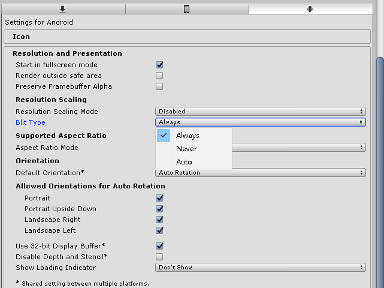
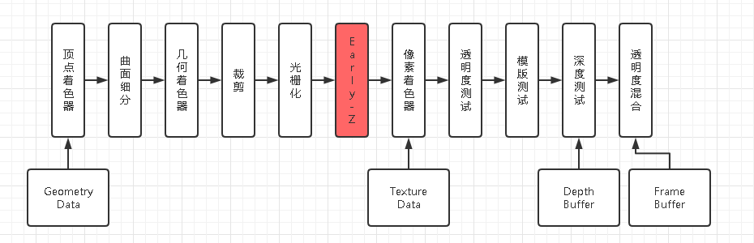
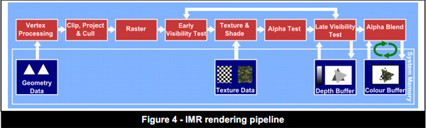
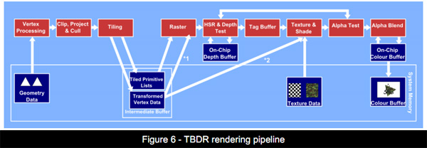
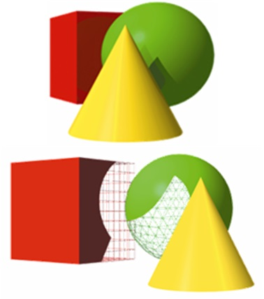
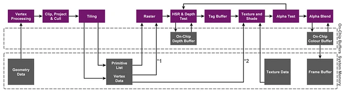
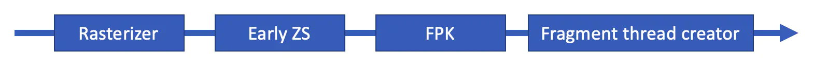

自己的图形学血祭路线
=================

(Github正常排版: [自己的图形学血祭路线](https://github.com/HHHHHHHHHHHHHHHHHHHHHCS/MyStudyNote/blob/main/MyNote/%E8%87%AA%E5%B7%B1%E7%9A%84%E5%9B%BE%E5%BD%A2%E5%AD%A6%E8%A1%80%E7%A5%AD%E8%B7%AF%E7%BA%BF.md))

-----------------

## &emsp;&emsp; 不知道取什么标题... 本文写于比较早的时间，应该有很多问题，欢迎斧正。

-----------------

## **0. 学习路线**
&emsp;&emsp; 首先可以把游戏行业的渲染知识分成四部分： **应用图形学算法** 、 **渲染流程** 、 **图形API** 、 **GPU驱动**。四部分可以从上而下进行学习。

-----------------

## **1. 应用图形学算法**
&emsp;&emsp; 应用图形学算法是很基础也很重要的一层。TA、特效常在这层进行工作。这层包括了我们的Shader中的技能特效（溶解、扰动）、物体效果（冰、草）、光照模型（Lambert、Phong、PBR、NBR）、特殊效果（描边、SSS，眼球，头发）和后效算法（Bloom、DOF、SunShaft）等。除了学习这些之外我们可以在写的时候注意一些细节和优化。

1、先拿我们最常用的后处理来说。后处理的时候我们经常在一帧内频繁切换framebuffer，其实这会有一定的性能开销，尤其是在移动平台的TBDR架构上，每次切换都会让所有的tile执行绘制，而tile绘制会从DRAM拷贝Framebuffer Data到SRAM进行渲染。我们可以写一个Uber Shader最后进行混合。

2、如果是Unity的后处理我们传入参数经常会使用SetFloat(string,float)和SetGlobalTexture(string, RenderTargetIdentifier)等API，但是反编译看它也是调用Shader.PropertyToID(string)把string转换成int。而Shader.PropertyToID(string)如果在Mono的情况下会经历复杂的string转换，最终变成int。所以我们可以提前执行一次转换进行缓存，最后使用SetGlobalTexture(int, RenderTargetIdentifier)等API（ 更多详情 https://zhuanlan.zhihu.com/p/39850106 ）。

3、再往底层走点。在写代码的时候，很多教程会说别用if-else而应该是使用step进行替代。不过这句话在现在并不完全适用。首先step是一条GPU无法优化且有可能负优化的指令，如下面的代码,step配合lerp会把里面的都执行一遍。反观if-else指令就简单很多。这个会随着step里面的的a和b越来越复杂，性能越来越差。
```C++
	return lerp(i.uv.x * i.uv.y, i.uv.x / i.uv.y, step(i.uv.x, 0.5))

	0: ge r0.x, l(0.500000), v0.x
	1: and r0.x, r0.x, l(0x3f800000)
	2: div r0.y, v0.x, v0.y
	3: mad r0.y, -v0.x, v0.y, r0.y
	4: mul r0.z, v0.y, v0.x
	5: mad o0.xyzw, r0.xxxx, r0.yyyy, r0.zzzz
	6: ret 


	if (i.uv.x > 0.5)
		return i.uv.x * i.uv.y;
	else
		return i.uv.x / i.uv.y;

	0: lt r0.x, l(0.500000), v0.x
	1: if_nz r0.x
	2:   mul o0.xyzw, v0.yyyy, v0.xxxx
	3:   ret 
	4: else 
	5:   div o0.xyzw, v0.xxxx, v0.yyyy
	6:   ret 
	7: endif 
	8: ret 
```
接着很多老教程说if-else耗时是因为true和false的分支内容都很多，而GPU是并行的，会把两个分支都执行一次取结果。但是现在的GPU如果像素组（像素组，专业名称——线程组/Warp，GPU是按照线程组进行渲染的,不同GPU数量不一样，更多详情 https://zhuanlan.zhihu.com/p/22232448 ）的if结果都为true/false，这样只会执行一次分支。所以如果我们能确保线程束内的true/false结果统一或者这样的像素块很少，则都可以用if-else。尤其是在我们外部传入bool值的时候，step更加毫无意义。但是可以考虑使用变体与if-else进行权衡。（ 更多详情 https://zhuanlan.zhihu.com/p/33260382 ）

4、再往下走到走到汇编层的优化。写完代码我们可以看下汇编的结果，看看它们编译成了什么样子，是不是有一些和想的有点出路。举个例子clamp(t,0,1)其实等价于saturate(t)一条指令，但是如果clamp(t,a,b)且a和b不是0和1则又等价于max和min两条指令。
```C++
	clamp(x, 0, 1);

	0: mov_sat o0.xyzw, v0.xxxx


	saturate(x);
	0: mov_sat o0.xyzw, v0.xxxx


	clamp(x, 2, 3);

	0: max r0.x, v0.x, l(2.000000)
	1: min o0.xyzw, r0.xxxx, l(3.000000, 3.000000, 3.000000, 3.000000)


	float x = max(x, 2.0);
	x = min(x, 3.0);

	0: max r0.x, v0.x, l(2.000000)
	1: min o0.xyzw, r0.xxxx, l(3.000000, 3.000000, 3.000000, 3.000000)
```
因为数据类型是有溢出和过小的情况，所以汇编不一定会等价优化，下面三条指令理论上在我们的眼里应该是等价的。但是汇编出来的结果可能出乎意料。因为可能在计算的途中会出现值溢出或者过小的情况。（ 更多详情 https://zhuanlan.zhihu.com/p/87936887 ）
```C++
	(a * b + a * c) / a;

	0: mul r0.x, v0.x, cb0[0].x
	1: mad r0.x, v0.x, v0.y, r0.x
	2: div o0.xyzw, r0.xxxx, v0.xxxx


	a * (b + c) / a;

	0: add r0.x, v0.y, cb0[0].x
	1: mul r0.x, r0.x, v0.x
	2: div o0.xyzw, r0.xxxx, v0.xxxx
	
	
	b + c;

	add o0.xyzw, v0.yyyy, cb0[0].xxxx
```

-----------------

## **2. 渲染流程**
&emsp;&emsp; 注意这里是渲染流程并非硬件的渲染管线。常用的渲染流程有两套——Forward Rendering（前向渲染）和Deferred Rendering（延迟渲染）。虽然还有更多如——Forward+（Tiled-based Deferred Shading，分块延迟渲染）等。

&emsp;&emsp; 渲染流程一般都是由游戏引擎开发者的实现的。比如著名的商业引擎Unreal Engine和2018年前的Unity，在不改变源码的情况下，项目组一般都是不会去主动改变这一层的，就算要进行修改，如果不改源码修改也很麻烦。

&emsp;&emsp; 不过熟悉渲染流程和引擎的对于我们的项目还是有一定的好处的。

&emsp;&emsp; 如上面说的前向渲染和延迟渲染的优缺点和选择。简单的说n个物体，m个光源，在前向渲染的时候复杂度是O(m*n)，毕竟是非常直接的线性渲染方式。如果m比较大，性能开销就会很大。并且Unity非SRP的时候我们还需要额外的ForwardAdd pass处理多光源进行叠加，会多次执行Vertex Shader和Fragment Shader，让性能更是雪上加霜。SRP之后，默认情况下我们可以直接在一个Pass内处理一个主光源和8个额外光。当然有能力也可以在一个Pass内处理更多的额外光。所以Deferred Rendering就能很好的解决这个O(m*n)的问题，它的复杂度是O(m+n)。原理利用MRT（Multiple Render Targets）是将所有的物体的信息绘制到G-buffer（Geometric Buffer，几何缓冲区）上，这时候可以剔除被遮挡的片元只留下屏幕上可以看见的片元，之后进行统一的光照计算。不过延迟渲染也有一定的缺点。

1、G-Buffer的内存占用，通常是4张全屏幕大小的GBuffer（0:rgb->albedo color,a->occlusion. 1:rgb->spec color,a->smooth/roughness. 2:rgb->normal. 3:rgb->Emission）。

2、带宽瓶颈，因为需要读写GBuffer有较大的带宽消耗，所以手机通常不使用延迟渲染。不过手机平台可以利用Framebuffer Fetch和Shader Pixel Local Storage进行优化（ 更多详情 https://www.bilibili.com/read/cv779019/ ）

3、透明的渲染存在问题。可能需要在延迟渲染结束之后，以正向渲染的方式绘制透明物体。

4、非常规光照模型支持不友好。如一些物体的PBR Shader不一样，那么在光照阶段就没有很好的办法去处理。

5、MSAA的支持不友好。如果我们在光照阶段使用G-Buffer作为输入光照结束完成之后进行MSAA，会得到错误的结果。不过DX10.1之后就有了支持MSAA的MRT，但是也没有什么意义。如果直接开启MSAA对G-Buffer进行渲染，那么被MSAA的深度是错误的。如果先开启MSAA对Albedo Color RT进行处理和resolving，然后再关闭MSAA渲染其它的RT。这一系列操作不仅浪费了带宽和计算，而且还不如直接使用SSAA，毕竟SSAA效果更好。（更多详情 https://zhuanlan.zhihu.com/p/135444145）。  当然还有延迟渲染还能进行优化改进——改进适应分块延迟渲染，这里就不谈了。（ 更多详情 https://zhuanlan.zhihu.com/p/28489928 ）。

&emsp;&emsp; 再比如在Unity的Player的Android设定下有一个Blit Type，这个设定的作用是在Android平台下结束渲染后输出到屏幕的中间是否执行SRGB颜色转换操作。这个操作会多执行一次Blit操作，造成性能浪费。如果我们的Color Space是Gamma则可以将其设置为Never，从而能减少一次额外的Blit提升性能。



&emsp;&emsp; 之后Unity提出了 **Commandbuffer** 的概念，可以在原有的渲染流程内插入一些自定义的渲染。之后又提出了 **SRP（Scriptable Render Pipeline）** 的概念，这可以让我们自己随意定义渲染管线。换句话来说，随着我们对游戏的品质需求越来越高，走精品化路线。之前我们不能自定义管线，插入删除优化一些渲染效果都非常麻烦困难，但是现在我们有了SRP之后，可以自定义很多东西，就能实现更多的好的效果和优化，极大可能的提升了开发者的自由度。UE4虽然具备绝大部分功能，开发者也可以自己通过 **Mesh Draw Command** 或者 **RDG（Rendering Dependency Graph）** 机制来修改源码中的渲染管线，但是这个需要开发者对于引擎有极深的功力才能驾驭。

-----------------

## **3. 图形API**
&emsp;&emsp; 2001年微软提出了 **DirectX8.0** ，发展到2014年升级成 **DirectX12.0** 。相应的 **OpenGL** 从1.1也发展到了现在的4.6，同时 **GLES** 版本也从1.0发展到了3.2。当然图形API还有 **Vulkan** 和 **Metal** 。

&emsp;&emsp; 在游戏行业中，虽然很少人会去直接使用这些API。尤其是手游，因为不同平台API不一样。但是了解这些API还是非常有必要的。比如，我们现在常用的 **DrawInstance** 对应的 **OpenGL ES API** 就是 **glDrawArrayInstanced** 和 **glDrawElementsInstanced**，这是在 **OpenGL ES3.0** 才开始有的。
&emsp;&emsp; 再比如 **compute shader** 是在 **OpenGL ES 3.1** 才提出， **tesselation shader** 则是在OpenGL ES3.2提出。相对的 **DirectionX 10.0** 推出 **Geometry Shader** ，**DirectX 11.0** 才支持 **Tessellation Shader（Hull Shader，Tessellator，Domain Shader）** 和 **Compute Shader** 。对这些了解后，我们才能更好的针对不同的手机使用不同的特性，实现不同的效果。

&emsp;&emsp; 再举个例子，优化上常说的DrawCall和Batch。这两个有什么区别呢！？在图形API层就非常的直观， **DrawCall** 是CPU发送渲染命令给GPU，对应的图形API是**glDrawElements(OpenGL)/glDrawArrays(OpenGL)/DrawIndexedPrimitive(DX)** 。 **Batch** 是CPU发送渲染需要的数据给GPU（CPU Write），如设置顶点数据 **glBufferData(OpenGL)/glBufferSubData(Opengl)** 等。

&emsp;&emsp; 这几年还推出了一些更底层的图形学API，如2013年AMD推出了 **Mantle** ，然后在2016年将其提供给了khronos，从而诞生了之后的 **vulkan** ，苹果也在2014年推出了 **metal** ，之后又在2017年升级成了 **metal2** 。在游戏开发中我们常说DrawCall过多，导致性能消耗过大，让游戏卡顿。DrawCall正如上面所说是CPU发送渲染命令给GPU。但是在OpenGLES时代，每个渲染API在发送给GPU驱动前，会让CPU做大量的检查工作。这会占用大量的CPU时间，从而导致CPU bound。而metal或者vulkan，简化了GPU驱动这一层，省去了很多的检查工作，这也意味着减少了图形API带来的CPU消耗。所以现在metal版本（IOS）的手游，DrawCall也就没有之前那么敏感。但是这种驱动层的简化，给引擎开发者带来了很大的不变。因为原来很多在驱动层做的事情，会提到引擎层去做。比如少去了一些检查报错，在开发者传入错误的图片的时候，只有crash却没有什么有效的日志，这就十分不友好。

&emsp;&emsp; 当然升级API还有别的好处。先不谈Vulkan的兼容支持问题。如手机是没有显存的，CPU和GPU使用的内存都是在同一份物理内存上。以前的Android都是OpenGL ES，但是它的规范是CPU和GPU的内存是不能共享的，这时候就需要要单独拷贝，造成了浪费。现在有了Vulkan，它可以访问运行应用程序的主处理器上的共享或非共享内存。还有Compute Shader的输入和输出结果，Vulkan也可以实现共享内存，从而提升性能节省空间。ios的metal也有共享内存这一机制。

-----------------

## **4. GPU驱动**
&emsp;&emsp; GPU驱动层和架构层，在游戏行业中应该没有人会去做这一层的开发，因为这些都是芯片厂商去做的事情。但是这里面的一些技术点，我们也需要做一定的了解。

&emsp;&emsp; 比如Early-Z。在Forward渲染中，ZTest是在Fragment Shader之后进行，也就是说被遮挡的部分也要进行Fragment Shader绘制，就产生了无效的overdraw。当Fragment Shader计算量越复杂的时候，造成性能浪费越大。这时候就推出一个硬件功能Early-Z,硬件会在Fragment Shader之前，执行一个新的阶段Early-Z，它会进行深度测试，这样就可以把不可见的fragment discard掉，提高性能。



&emsp;&emsp; Early-Z也有失效的时候，这时候就需要一点的硬件知识的了解。如：Nvdia建议不要开启Alpha test（并且有写入深度或stencil操作），不要在fragment shader中执行Tex Kill（API:clip、discard，并且有写入深度或stencil操作），不要开启DX10的新特性Alpha to Coverage（并且有写入深度或stencil操作），不要在fragment shader修改深度，让GPU直接使用光栅化插值之后的深度。如果违背了上面这些规则，则会让Early-Z优化失效（ 更多详情 https://zhuanlan.zhihu.com/p/53092784 ）。至于为什么？虽然现代的GPU的深度读和写可以分开执行（多一次late-z），但是Early-Z还是把Z-Buffer的读和写都放在了Fragment Shader之前，不然分开两次执行,多次读写会造成更多的开销。如果我们开启深度写入，而我们的Fragment Shader有clip/discard或直接修改深度还有之后的Alpha Test，都会对深度的结果造成影响，所以这些操作会导致Early-Z失效。不过还是可以用dx:earlydepthstencil(dx)/opengl:layout(early_fragment_tests) in这些API强制开启Early-Z。（ 更多详情 https://zhuanlan.zhihu.com/p/33127345 ）。并且要注意下Nvdia这里是针对的是IMR架构，而且后面的DrawCall还是会继续进行Early-Z的优化，移动端下面讲。当然还有别的，如：不要关闭深度测试，不要开启Multi-Sampling等（ 更多详情 https://www.cnblogs.com/timlly/p/11471507.html ）。

&emsp;&emsp; 还有Early-Z的最小剔除单位。因为GPU渲染特性是按照2x2的像素块进行渲染的，并不是1个像素1个像素进行渲染（其实ddx/ddy指令也告诉是按照2x2的像素块渲染）。所以Early-Z的最小单位剔除单位不是1像素，而是1个像素块（2x2像素）。桌面端在Early-Z之前会有一个tile-based rasterization，它是一个更粗颗粒（如8x8，16x16等根据GPU型号差异而不同）的深度比较和蒙板比较进行剔除，它们的最直观的区别就是剔除单位（ 更多详情 https://zhuanlan.zhihu.com/p/277438385 ）。

&emsp;&emsp; 再比如一个硬件特性导致的渲染技巧。在我们后处理blit全屏幕的时候，为什么是用一个大三角形而不是用两个三角形组成的quad！？最表层的是减少顶点的IB或者VB的设置。更深层的是，现代的GPU光栅化后会输出成一个个tile（一个tile至少4x4个像素）进行渲染。这样位于两个三角形交界处会有重叠的tile，照成fragment shader的浪费。同时还有一个纹理缓存命中率的问题，两个三角形缺乏空间的连续性，所以在采样的缓存命中没有一个大三角形高。虽然有些平台没有性能下降，但是还是用一个大三角形最保险。（ 更多相关 https://zhuanlan.zhihu.com/p/128023876 ）

&emsp;&emsp; 说完这些特性技术之后，就是了解GPU渲染架构的特性了。这里先大概谈下PC和Mobile平台的GPU渲染架构特点和差异。先说IMR（Immediate Mode Rendering，立即模式渲染），我们PC端GPU渲染就是用的这套。它如字面意思一样，我们的每一个primitive(点、线、三角面等)都会直接提交渲染，渲染管线并行起来，速度非常快。并且读写是直接对DRAM（显存）上进行操作，DRAM上读写的速度是最快的。当然也有缺点，比如很多需要对当前帧进行读取比较的（比如blending, depth testing 或者stencil testing）都需要频繁从framebuffer中读取数据，这时候就会产生过高的带宽压力，而带宽压力也意味着功耗上升。所以这一套渲染架构适合PC。（ 更多相关 https://zhuanlan.zhihu.com/p/265151933 ）



&emsp;&emsp; 但是Mobile平台因为功耗问题，不能使用这套简单粗暴的管线，所以就使用了另一套———TBR（Tile-Based Rendering，基于瓦片渲染）。




它是指对于一个FBO（帧缓冲），先把FBO拆成许多小的tile（通常16x16和32x32,由SRAM决定），再执行所有的vertex shading，组成图元，生成Triangle List 并保存在FrameData(powervr叫parameter buffer,arm叫plolygon lists)，再把FrameData储存在物理内存。最后需要刷新整个FrameBuffer的时候（如API：Swap Back and Front Buffer，glflush，glfinish，glreadpixels，glcopytexiamge，glbitframebuffer，queryingocclusion，unbind the framebuffer），从物理内存读取每个tile然后进行光栅化和fragment shading。全部tile完成之后把整个FBO写入到显存中。

优点：

一、节省带宽，降低功耗。

缺点：

一、vertex shading的计算结果和每个tile的triangle list需要存到物理内存，fragment shading又要从物理内存里面读回，需要额外的储存空间和执行效率，随着模型的复杂度/顶点增加缺点放大，当增大到内存放不下的时候会暂存到别的地方，读取效率会变得更慢。

二、一帧数内有>=2的渲染，且后面的渲染需要前面的渲染的结果。TBR需要所有的图元执行完毕之后再执行frag。但是我们是>=2的渲染，且后面的渲染需要前面渲染的结果。GPU这时候会把所有缓存的draw都执行，完毕之后释放当前的缓存内容，进行后面的绘制。如果每次draw都需要前面的渲染结果，TBR直接退化成IMR。

&emsp;&emsp; 在手机，TBR虽然比IMR能解决很大部分的功耗问题，但是还有进一步的优化空间——TBDR（Tile Based Deferred Rendering，贴图延迟渲染）。它可以用储存在中间的FrameData做一些优化。如PowerVR/IOS的HSR技术。大体作用是尽可能找到最后看到的fragment shader，剔除掉多余的从而减少Overdraw。如对于不透明的，一些ztest失败，或者stencil失败的物体，在HSR的阶段被kill，根本不会进入fragment shader阶段。虽然ARM Mail的FPK技术也有这种功效, 但是Mali 属于 TBR.

&emsp;&emsp; 这里注意区分市面上的GPU型号区别. TBR是指Mali&Adreno, 只有PowerVR能称为TBDR. TBR也有D, 但是在fs和rasterization之间. 而TBDR的D特指rasterization和fs之间. 这是PowerVR特有的技术.(感谢 @phoenix 指出)




&emsp;&emsp; 既然上面谈到了了HSR，那这里快速讲一下影响HSR（Hidden Surface Removal，隐藏面消除）的东西。主要是Alpha Test和Alpha Blend。开了Alpha Test不会关闭HSR，并且还能进行Opaque剔除。开了Alpha Blend的fragment，不做depth test，直接送到ps阶段。如果同一tile内有复杂的情况——Opaque、Alpha Test、Alpha Blend都存在，则HSR则被关闭了。不过Unity或者SRP有个好处可以避免这个问题，它可以按照渲染队列（RenderOrder/RenderQueueRange）来绘制，即先画Opaque，再画Alpha Test，再画Alpha Blend。不过前提是不要随意乱改变渲染队列，如把Alpha Blend物体的RenderQueue改成Opaque进行绘制。还有一个SRP的好处——按照状态切换进行绘制（SortFlags.OptimizeStateChanges）。还有Unity默认针对Opaque的渲染顺序是从前往后绘制，是因为避免overdraw。但是有了HSR之后，overdraw的问题不再这么严重，所以渲染顺序改成按照状态切换进行绘制，可以尽可能的合批从而减少drawcall。同时使用HSR的时候不要使用ZPrePass，因为也是浪费drawcall。（更多相关 https://zhuanlan.zhihu.com/p/57871063 ）



&emsp;&emsp; 再快速讲讲安卓TBDR的减少overdraw的硬件优化。先说说FPK（arm mali gpu）。它是和Early-Z共存互补的，不过Early-Z是从前到后绘制，而FPK是从后往前绘制。原理是通过Early-Z测试的quad(2x2像素，Fragment Shader以quad为单位，上面也有说道)会进入FIFO buffer Queue（FPKQ，可以容纳256个）。当Quad的4个像素全部被覆盖时(Fully Coverage)，后进入FPKQ的quad被标记为to kill的，它会kill掉相同位置的先进入FPKQ的quad。被kill掉的quad就不会产生Fragment Thread进行Fragment Shader。FPK也有限制，如在渲染Opaque的时候不能有Alpha Blend和Alpha Test。如果要在渲染Opaque的时候非要有Alpha Test的话，则要做好排序。（ 更多相关 https://www.jianshu.com/p/5a99750327fc?utm_campaign=maleskine&utm_content=note&utm_medium=seo_notes&utm_source=recommendation &emsp;&emsp;&emsp;&emsp; 
https://mp.weixin.qq.com/s?__biz=MzI4MzYyNzUwMg==&mid=2247483792&idx=1&sn=0bf99f201801c781c03ba9b05a3a663f&chksm=eb869b11dcf112070eff554717cb641c98b0d58e71c1ba9d40dd0a38e05c39eaf8ca85ce6f7b#rd ）

高通（Qualcomm）的Adreno在5系列之后也添加外置LRZ模块进行优化。在Adreno5系列之前的GPU从前往后绘制是可以提升性能，但是Adreno5系列之后前后顺序不会造成影响。原理是在正常渲染前，先多执行一次Vertex Shader生成低精度depth texture，从而提前对不可见的进行剔除。（更多相关 https://zhuanlan.zhihu.com/p/158616331 &emsp;&emsp;&emsp;&emsp; 
https://blog.csdn.net/redcard0/article/details/89034349 ）

&emsp;&emsp; 除去上面的一帧内不要频繁切换framebuffer、顶点限制、不要随意改变渲染顺序，TBDR还有别的优化点。（ 更多相关 https://gameinstitute.qq.com/community/detail/123220）

1、不使用的Framebuffer的时候要clear或者discard。TBDR架构下commandbuffer不会立即执行，当需要的时候才会进行绘制。所以这个过程可以积累很多的绘制，而glclear可以把当前的framedata进行清空，EXT_discard_framebuffer也有异曲同工之处。如unity在手机平台对RenderTexture也是这样，当不再使用这个rt了要进行unbind了，在某些移动设备上会把剩余的绘制都执行完再销毁，但是在这之前执行rt.Discart()则可以提高性能。而PC是来了立即绘制所以没有关系。

2、每帧数渲染前尽量clear。在绘制全屏幕的时候，我们经常不clear当前的buffer，毕竟是全屏绘制会完整的覆盖之前的framebuffer。对于PC这个是优化，但是TBDR的时候每个tiel在初始化的要从DRAM对framebuffer对应的数据拷贝过来，而clear就可以进行优化。如Unity的SRP设置RT的时候有一个LoadAction，设置为dontcare就可以起到这样的效果。

3、手机上的EarlyZ/ZPrePass斟酌开启关闭。在移动平台TBDR下，IOS有HSR可以不用ZPrePass。一些低端安卓机器drawcall敏感，开启ZPrePass会更加加重负担。

4、手机的MSAA带宽有微弱性能损失或者免费。PC的IMR上因为是对整块FBO进行操作，所以是有很大的带宽消耗。但是在手机MSAA，如把一块tile拷贝到SRAM，进行msaa，最后resolving，写回到DRAM，成本很低。(感谢 @phoenix 指出) (参考:https://zhuanlan.zhihu.com/p/32823370  https://developer.qualcomm.com/software/snapdragon-profiler/app-notes/anti-aliasing-with-adreno)
  ++ Mali是TBR. 但只有Mali Bifrost GPUs 以及之后, 可以接近免费使用MSAA(2x or 4x)
  ++ Adreno & PowerVR 目前GPUs只能用2x, 且不完全免费(有微弱性能损失), 且都不能用4x, 但是不排除以后升级架构带来的改变.
  ++ 建议根据实际项目实验进行调整. 华为的mali 2x 4x 性能和画面都不会有太大的变化和区别. 高通骁龙的Adreno 开2x 画面有明显的变化且帧率有明显下降. 但是苹果的PowerVR可以画质有提升且帧率也没有什么波动. 如果存在问题可以尝试手动Resolve, 在进行观察. (感谢 @蓝色幻想 , @dem 指出)

5、同一帧内减少提交给GPU资源的改动。TBDR是延迟渲染，不过对于顶点都会先执行储存。如VBO提交给GPU被先保存到framedata。这时候这个VBO被改变了，又提交给GPU进行渲染。GPU会对这个VBO生成新的数据保存到framedata。如果同一帧数内VBO改变次数过多则需要大量的内存储存framedata。

-----------------

更多参考资料

https://www.cnblogs.com/timlly/p/11471507.html <br>
https://www.zhihu.com/question/49141824/answer/136096531<br>
https://www.expreview.com/24705-3.html <br>
https://zhuanlan.zhihu.com/p/259760974 <br>
https://www.sohu.com/a/83561143_119711 <br>
https://www.imgtec.com/blog/a-look-at-the-powervr-graphics-architecture-tile-based-rendering/ <br>
https://blog.csdn.net/epubit17/article/details/98302377 <br>
http://cdn.imgtec.com/sdk-documentation/PowerVR+Series5.Architecture+Guide+for+Developers.pdf <br>
https://zhuanlan.zhihu.com/p/66407205 <br>
https://juejin.cn/post/6844904132852072462 <br>