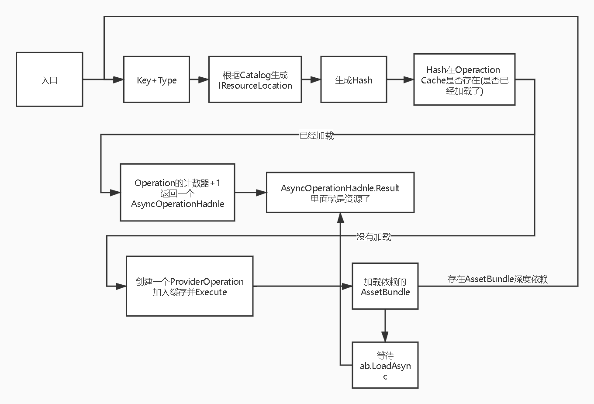

**基于Addressable资源管理系统的大地形加载方法探究**
=================

(Github正常排版: [基于Addressable资源管理系统的大地形加载方法探究](https://github.com/HHHHHHHHHHHHHHHHHHHHHCS/MyStudyNote/blob/main/MyUWA2020Note/%E5%9F%BA%E4%BA%8EAddressable%E8%B5%84%E6%BA%90%E7%AE%A1%E7%90%86%E7%B3%BB%E7%BB%9F%E7%9A%84%E5%A4%A7%E5%9C%B0%E5%BD%A2%E5%8A%A0%E8%BD%BD%E6%96%B9%E6%B3%95%E6%8E%A2%E7%A9%B6.md))

------------------------

[1. 打包](#1) 
[2. 加载](#2) 
[3. 卸载](#3) 
[4. 更新](#4) 
[5. 实战对比](#5) 
[6. 其他](#6) 

------------------------

## **1. 打包**
* ## **AssetBundle**
  + Inspector AssetBundle&Label + 代码打包(不可视化界面)
  + AssetBundle Brower(可视化界面,停止更新)
  + 需要自己手动分析依赖,计算冗余
 

* ## **Addressable -- Addressable Groups**
  + https://zhuanlan.zhihu.com/p/77600079
  + Groups
    - Window->Asset Management->Addressables->Groups(可视化界面)
    - GroupName -> PrimaryKey
    - Path -> InternalId
    - Labels -> Label
  + ScriptableBuildPipeline
    - 选中Group进行个性化设置
    - 不同包体单独设置属性,如:(Compression)压缩格式,(BundleNaming)包名
  + Analyze
    - https://zhuanlan.zhihu.com/p/98663321
    - Window->Asset Management->Addressables->Analyze(可视化界面)
    - 可以检测分析并修复冗余(自动生成公共的组)
  + settings.json
    - 位置:Library\com.unity.addressables\StreamingAssetsCopy\aa\[BuildTarget]
    - Addressable设置项,如:Catalog.json位置,hash位置
  + catalog.json
    - 位置:Library\com.unity.addressables\StreamingAssetsCopy\aa\[BuildTarget]
    - ResourceLocationMap(给IResouceLocation用),key和资源的映射关系
 

------------------------

## **2. 加载**
* ## **AssetBundle**
  + 下载
    - WWW
    - AssetBundle.LoadFromFile
    - UnityWebRequest
  + 加载
    - AssetBundle.LoadAsset
    - 要根据依赖加载AssetBundle
 

* ## **Addressable**
  + https://zhuanlan.zhihu.com/p/82247256
  + Addressable.LoadAssetAsync<T>(string key)
  + Addressable.InitalizeAsync()
    - 需要生成的setting.json 和 catalog.json
  + IResouceLocation
    - Type : 声音,图片......
    - IList\<IResouceLocation\> Dependencies{get;} : 依赖关系
  + ResourceManager
    - 各种加载的缓存
    - Provider
      - 加载器,加载资源和Bundle用
      - AssetBundleProvider
      - BundleAssetProvider
    - Operation
      - 引用计数器,跟卸载有关
      - PrividerOperation
      - AsyncOperationHandle
  + 加载流程
    
 

------------------------

## **3. 卸载**
* ## **AssetBundle**
  + AssetBundle.Unload(true/false)
  + 深度依赖的AssetBundle手动卸载
  + 不能直观的看到哪些AssetBundle在内存中
 

* ## **Addressable**
  + Addressables.Release()
    - https://zhuanlan.zhihu.com/p/98663058
    - 卸载asset用
    - 每调用一次,Operation计数-1,如果计数器为0,触发Destory
    - 其依赖的Operation的计数-1,继续深度递归
    - 如果是ProviderOperation,则会调用Provider.Release()
      - 如果是AssetBundleProvider,则会调用AssetBundle.Unload(true)
      - 如果是BundleAssetProvider,则无事发生.比如:包内2个图片,只卸载1个图片,2个图片还显示
  + Addressables.ReleaseInstance()
    - 通过 Addressables.Instantiate 实例化出来的对象卸载用的方法
  + Addressables.EventViewer 可以查看已经加载了什么
 

------------------------

## **4. 更新**
1. ## **Group -> Content Packing & Loading**
    + 打包和加载的地址
2. ## **Group -> Build Remote Catalog**
    + 勾选会产生catalog_版本号.hash 和 catalog_版本号.json(映射关系的资源目录)
    + 不勾选,产生的setting.json只有内部的catalog,且没有依赖
    + 勾选,产生的setting.json有本地Hash,服务器Hash,有依赖的catalog
3. 资源更新的API
    + GetDownloadSizeAsync(keys),可以计算出更新量
    + DownloadDependenciesAsync(keys)
      - 本地没有key映射的资源,则先下载到本地再加载
      - 如果本地有,则直接加载
    + key的选取:程序约定,从服务器获取,遍历catalog所有的key
4. 资源更新流程
    1. https://blog.csdn.net/u011366226/article/details/104506802/
    2. 注意使用 yield IEnumerator StartCoroutine
    3. Addressables.InitializeAsync,初始化
    4. Addressables.CheckForCatalogUpdates,获取Catalog是否更新
    5. Addressables.UpdateCatalogs,更新Catalog
    6. Addressables.GetDownloadSizeAsync(keys),获取更新的资源大小
    7. Addressables.DownloadDependicesAsync(keys,MergeMode.Union,true),下载更新资源
 

------------------------

## **5. 实战对比**

* ## **大地型包体**
    | 如| AssetBundle  |  Addressable  |
    | ---- | ---- | ---- |
    | AB数量 | 102 | 103(多了一个内置资源) |
    | 总Size大小 | 16.9MB(冗余) | 13.9 |
 

* ## **加载**
  + AssetBundle
    - 得到所属的AB Path
    - 加载AB
    - 加载资源
    - 卸载ab.unload(false)
  + Addressable
    - Addressable.LoadAssetAsync,加载
 

* ## **卸载**
  + AssetBundle
    - 自己统计计数,卸载AB包
    - 自己卸载深度依赖的AB包
  + Addressable
    - Addressables.Release,但是卸载CPU高
 

* ## **总体**
  + Addressable
  + 优点
    - 总体FPS高
    - 简洁,只用关心key+type+handle就好了
    - 不用关AssetBundle 和 依赖关系
    - 可视化查看内存中的AssetBundle
    - 可以分析冗余
  + 缺点
    - 卸载CPU高,因为要处理依赖,计数器
    - 内存占用稍微高点,catalog.json占用问题
    - 不够灵活,如不能让某个AssetBundle常驻内存
 

------------------------

## **6. 其他**
1. ## **SendProfilerEvents**
    + 查看Profiler用
    + Release时,要关闭,否则堆内存会上去很多,耗时也会上去
2. ## **地形渲染成紫色**
    + 原因:Native/Terrain/Diffuse的Shader不一定会打包进去
    + 解决一:在场景中添加一个隐藏的Terrain
    + 解决二:Graphics Setting -> Always Included Shaders
    + 解决三:Shader Variant Collection(SVC) + Graphics Setting->Preloaded Shader
3. ## **从AssetBundle转Addressable**
    + Addressable->Tools->Convert Legacy AssetBundles
    + StreamAsset资源变成Group,但是是一次性的不可逆的
4. ## **Addressable学习Tips**
    + 把Addressable从Packages剪切到Asset,代码可以就可以编辑和更好地跳转了

------------------------