GPU UI
=================

(Github正常排版: [GPU UI](https://github.com/HHHHHHHHHHHHHHHHHHHHHCS/MyStudyNote/blob/main/MyUWA2021Note/GPUUI.md))

------------------------

- [GPU UI](#gpu-ui)
	- [**0. UI常见问题**](#0-ui常见问题)
		- [**0.1 效果相关**](#01-效果相关)
		- [**0.2 动画(性能)相关**](#02-动画性能相关)
		- [**0.3 框架相关**](#03-框架相关)
		- [**0.4 性能消耗**](#04-性能消耗)
		- [**0.5 GPU动画解决**](#05-gpu动画解决)
	- [**1. GPU框架设计**](#1-gpu框架设计)
		- [**1.1 功能特点**](#11-功能特点)
		- [**1.2 三个核心类**](#12-三个核心类)
		- [**1.3 原理**](#13-原理)
	- [**2. 源码详解**](#2-源码详解)
		- [**2.1 动画矩阵变换**](#21-动画矩阵变换)
		- [**2.2 Shader顶点变换**](#22-shader顶点变换)
		- [**2.3 Fill属性改变**](#23-fill属性改变)
		- [**2.4 Sprite属性改变**](#24-sprite属性改变)
		- [**Text属性改变**](#text属性改变)
		- [**鼠标点击**](#鼠标点击)
	- [**3. GPU动画层插件**](#3-gpu动画层插件)
	- [**4. 性能对比**](#4-性能对比)
	- [**4.1 使用建议**](#41-使用建议)
	- [**4.2 总结**](#42-总结)

------------------------

&emsp;&emsp; 来自于UWA2021的分享, [视频地址](https://edu.uwa4d.com/course-intro/1/300)

麦克风太差了, 听着有点难受hhhh... 所以不会记得很详细, 不过这个工具确实挺有趣的.

------------------------

## **0. UI常见问题**

### **0.1 效果相关**
  + 羽化, 模糊, 畸变
  + 自定义形状遮罩
  + 文字描边, 外发光, 倾斜效果
  + 弯曲UI效果
  + 3D模型贴图

### **0.2 动画(性能)相关**
  + 动静分离, UI DrawCall
  + UGUI头顶文字, 飘字性能
  + 改变属性, 导致Canvas重绘
  + 规范美术, 排版不合理

### **0.3 框架相关**
  + 图集打包, 公用/非公用图片, 图片冗余
  + 图片/图集 不显示及时释放

### **0.4 性能消耗**
  + UI-Rebuild
    + LayoutRebuilder.Rebuild
      + 标记时, 会查找父节点
      + 关注触发情况
      + 属性设置:
        + Text组件: set_text...
        + Image组件: set_sprite...
    + Graphic.Rebuild

### **0.5 GPU动画解决**
  + 网格重建
  + 网格合并
  + 顶点属性
  + 不移动, 性能最高
  + 操作Transform简单
  + 可响应鼠标事件

------------------------

## **1. GPU框架设计**

### **1.1 功能特点**
  + 组件式
    + 三层设计结构
  + GPU核心动画层
    + UESMovieEngine
  + 动画控制层
    + GPU DoTween
  + 插件层
    + GPUDoozyUI
    + UESMoviePlgin

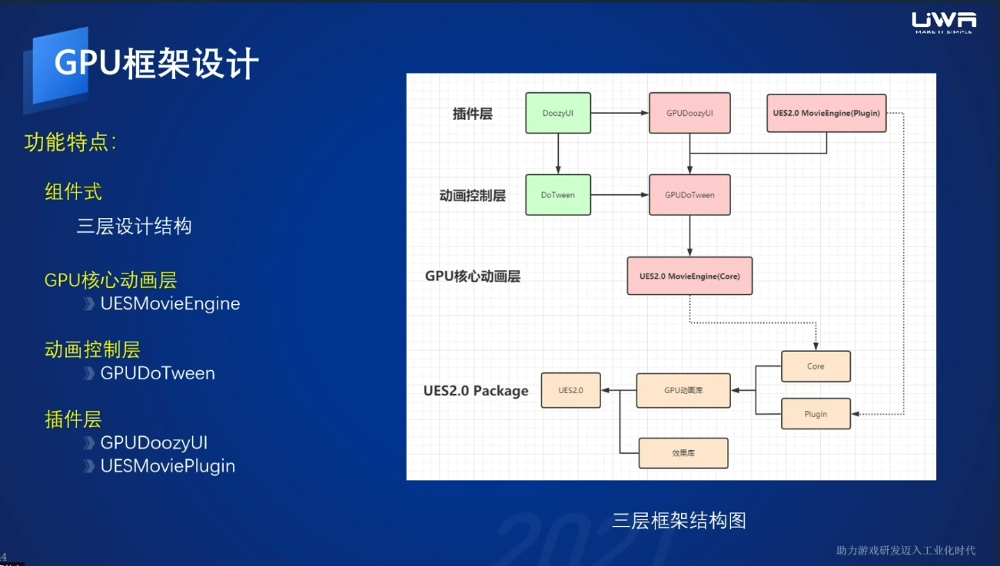

### **1.2 三个核心类**
  + UESMovieEngine(影片引擎)
  + UESMovieClip(影片剪辑)
  + UESMovieShape(影片图形)

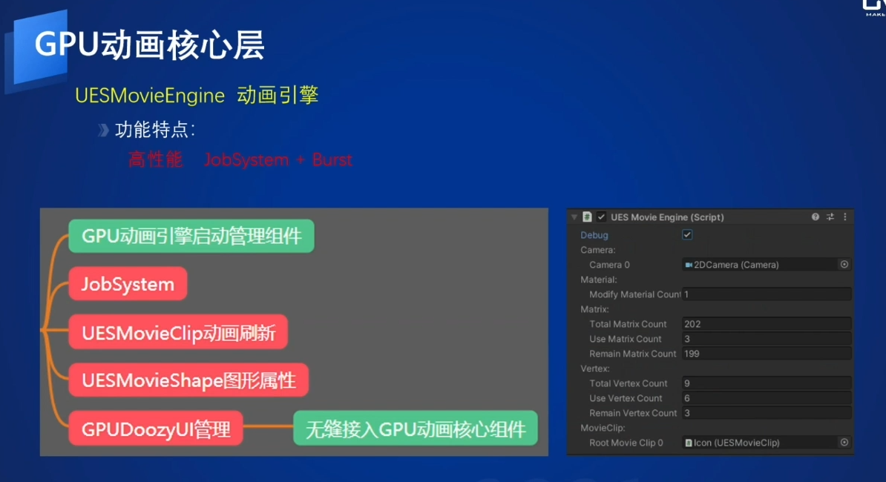

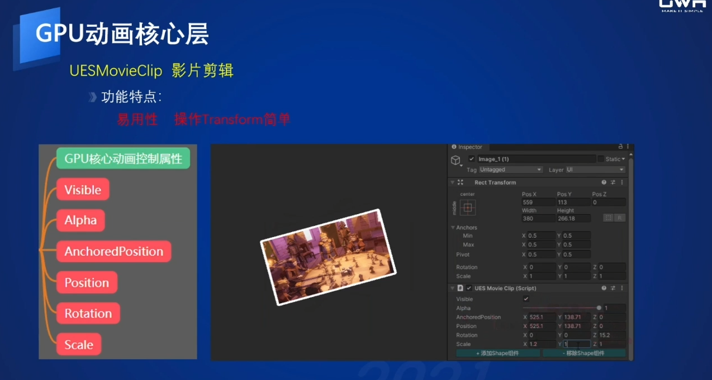

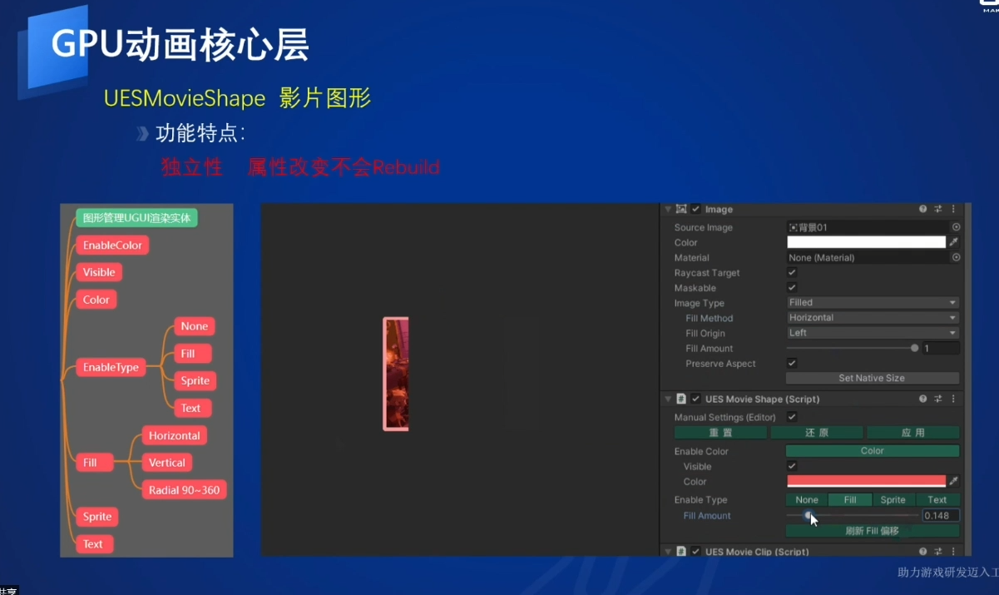

### **1.3 原理**
  + 不触发网格重构, 让动画实现在GPU层
  + CPU端
    + UESMovieShape 处理图片文字属性
      + ShapeID
      + 属性数据
      + ModiifyMesh顶点数据
    + UESMovieClip 处理移动, 动画嵌套
      + ClipID
      + Matrix矩阵
    + UESMovieEngine
      + 分层数据, JobSystem
      + ComputeBuffer写入Shader全局数据
      + MovieClip刷新
  + GPU端
    + Shader VS, 处理顶点数据
    + 根据ClipID, 获取变换Matrix矩阵
      + 移动, 旋转,缩放
      + 混合Color
    + 根据ShapeID, 获取图形数据
      + UV偏移
      + Vertex偏移
      + Color颜色

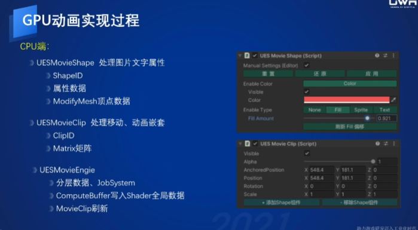

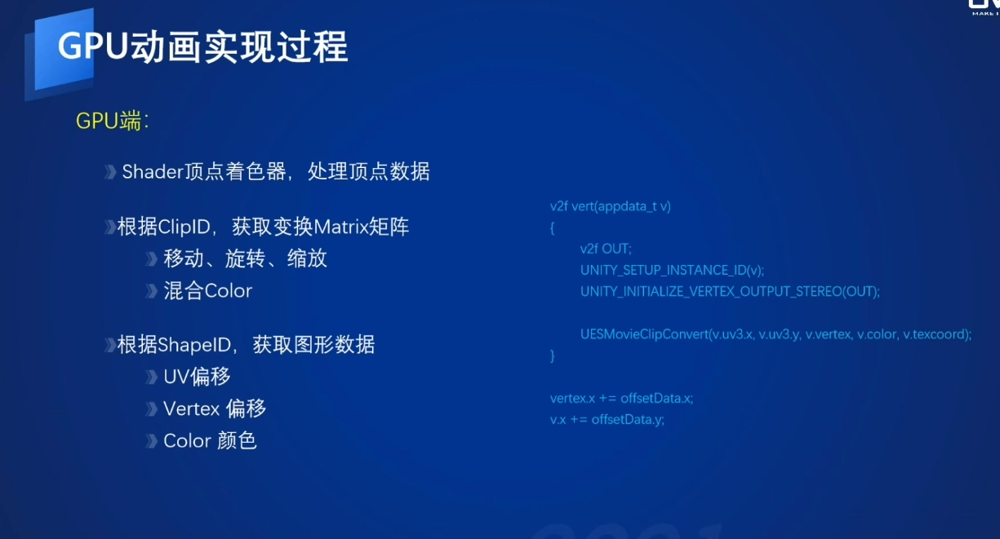

------------------------

## **2. 源码详解**

### **2.1 动画矩阵变换**
  + 世界空间
  + 自身MovieClip动画矩阵
  + 静态相对上一MovieClip位置矩阵
  + 主机混合顶点变换的矩阵

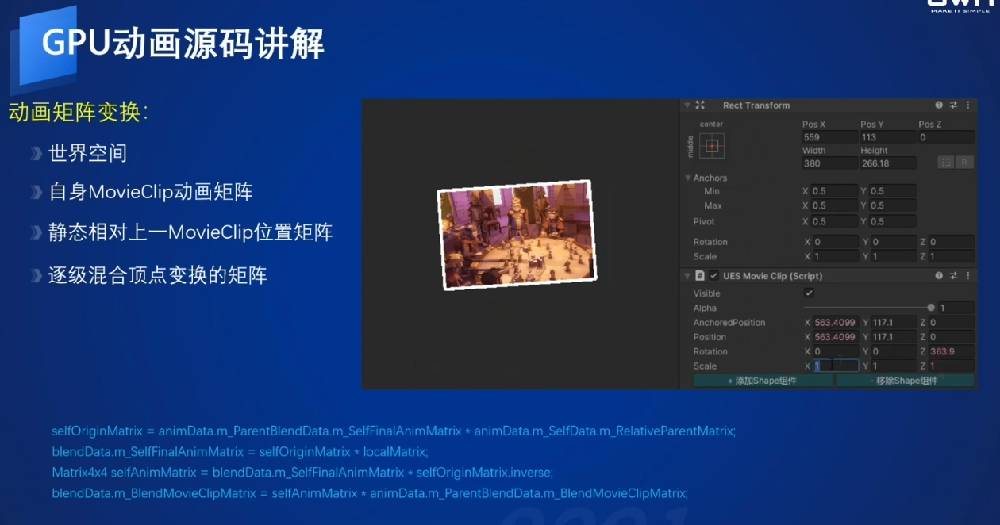

### **2.2 Shader顶点变换**
  + USEMovie.Shader VS 做顶点动画
  + 根据MovieClipID, 获取变换Matrix矩阵
  + 移动, 旋转, 缩放
  + 主机混合顶点变换的矩阵

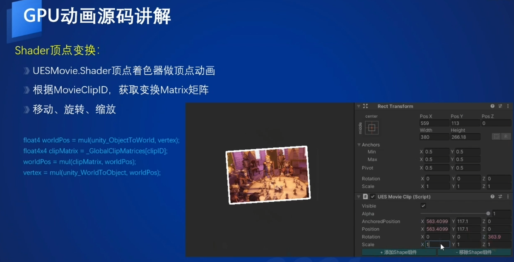

### **2.3 Fill属性改变**
  + Image总宽度,高度
  + 当前Fill值-静态的Fill值, 计算偏移量
  + 根据偏移量计算vertex, uv偏移

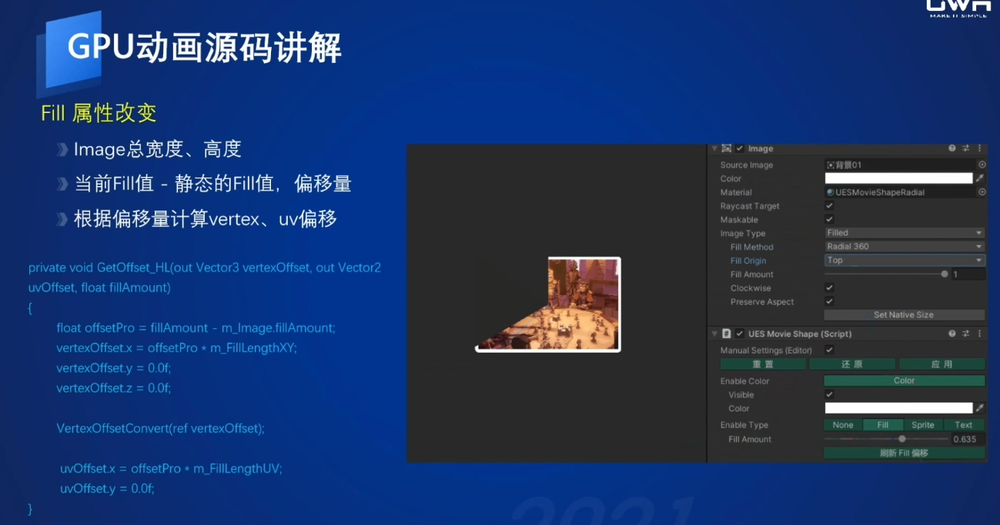

### **2.4 Sprite属性改变**
  + 必须打图集
  + 顶点索引
  + 每个顶点UV偏移量

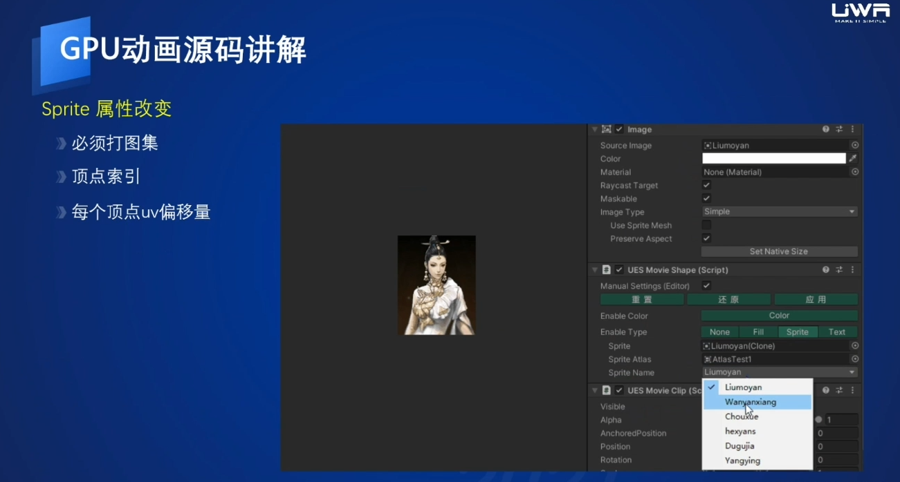

### **Text属性改变**
  + UESMovieText 确定字符串长度
  + UESMovieFront 自定义字体
  + vertex位置, uv偏移
  + 难点:buffer资源占用过多可能会导致性能下降
  + 解决:合理删减字符串, 只留必要的
  + 位置间隙优化
  + 数据索引优化

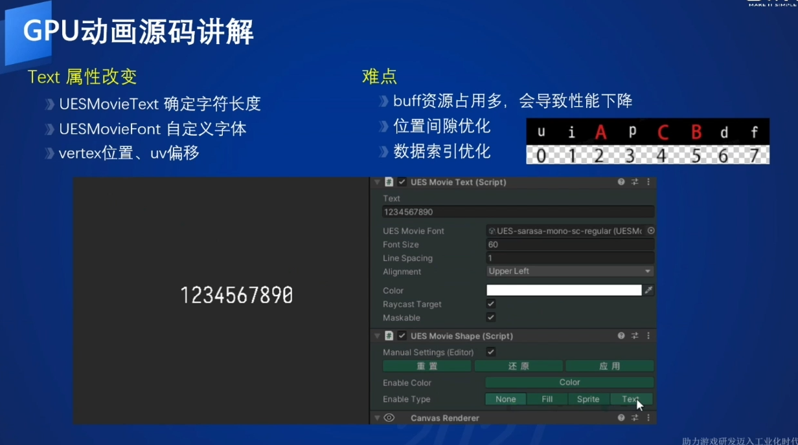

### **鼠标点击**
  + GraphicRaycaster
    + 反射获取List\<BaseRayCaster\>
    + GraphicsRaycaster进行截获
    + 替换UESGraphicsRaycaster
    + 传入真正的GPU 动画矩阵
    + 和鼠标点击区域进行判断

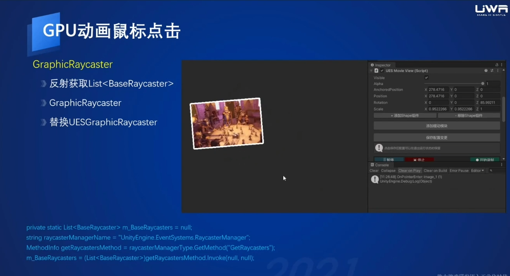

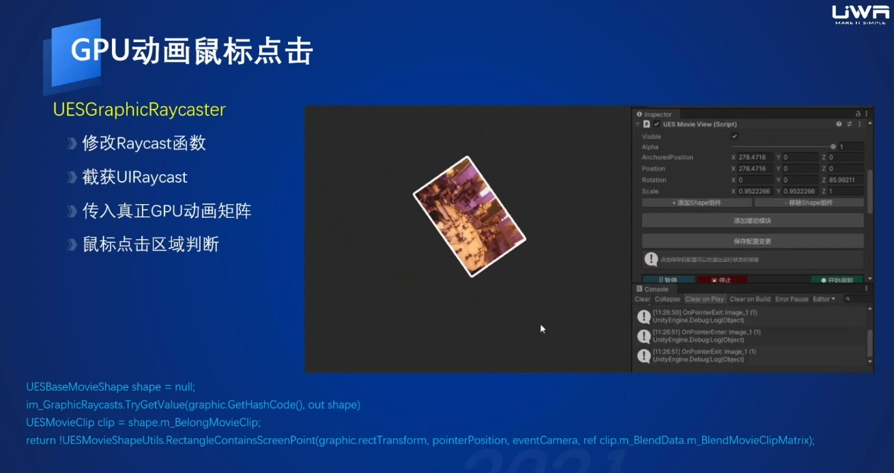

------------------------

## **3. GPU动画层插件**
  + UESMoviePlugin GPU动画插件
    + 功能特点:
      + 轻量级动画编辑
      + 集成UESMovieClip
    + 核心类:
      + UESMovieView
      + UESMovieButton
      + UESMoviePath
    + GPU DoTween
    + GPU Doozy

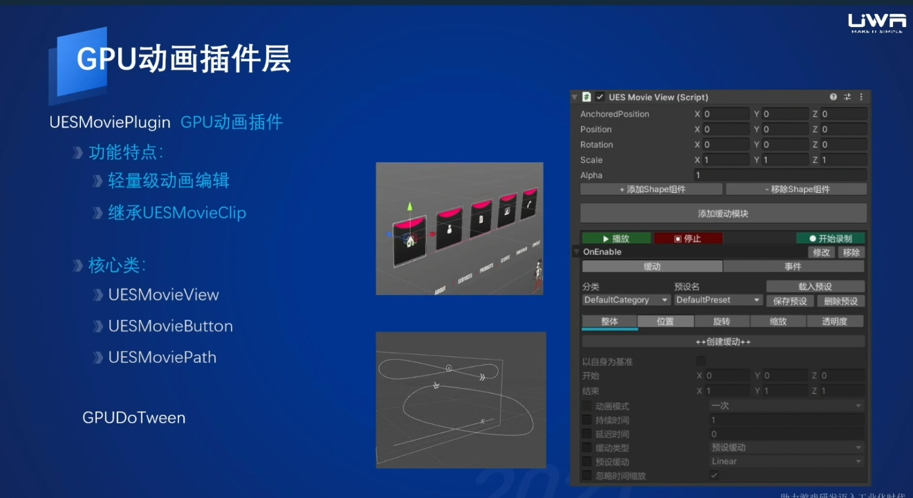

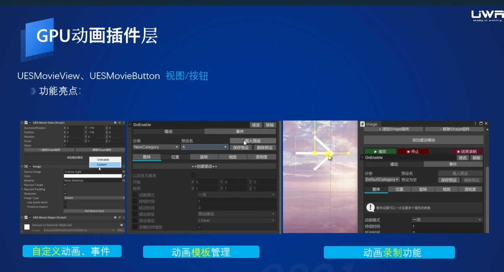

------------------------

## **4. 性能对比**
&emsp;&emsp; 越复杂GPU UI效果越好.

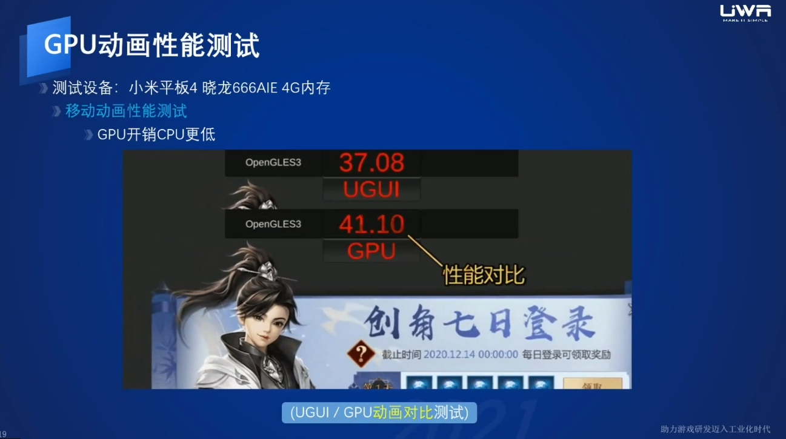

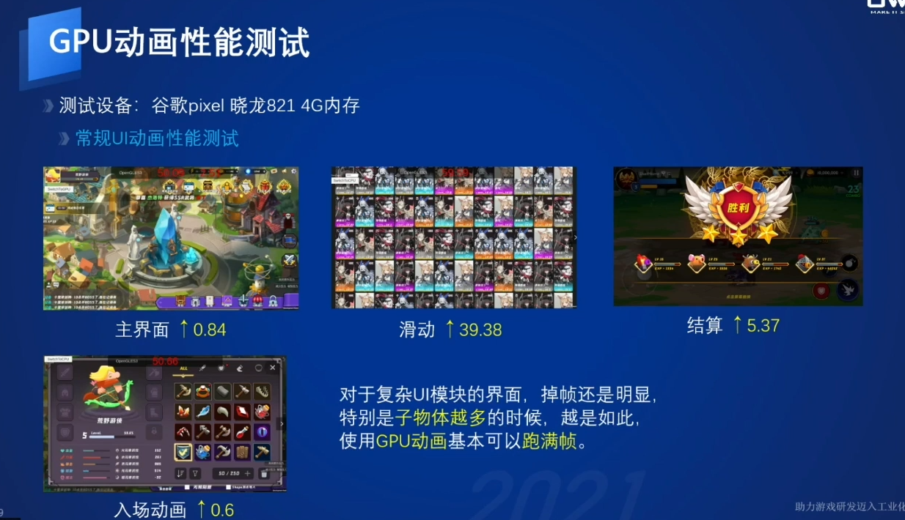

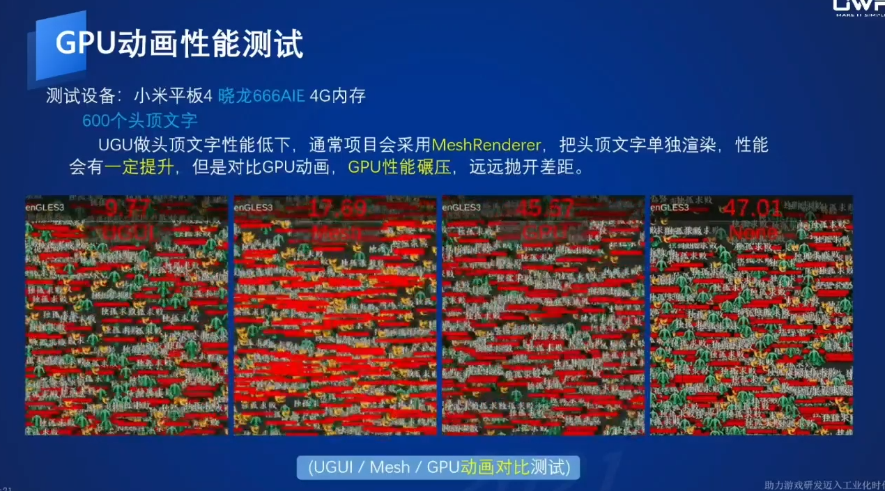

## **4.1 使用建议**
 + 头顶文字, 飘血, 小地图等
 + 主界面/战斗界面, 会动的UI界面
 + 走马灯, 技能按钮, 头顶冒泡
 + UI各模块的循环动画
 + 缓存UI, 重复利用

## **4.2 总结**
 + 不依赖Canvas, 无需动静分离
 + 导致重绘属性需全部接入
 + 适用性广, 所有项目都能使用
 + 解决性能瓶颈, 性能提升明显