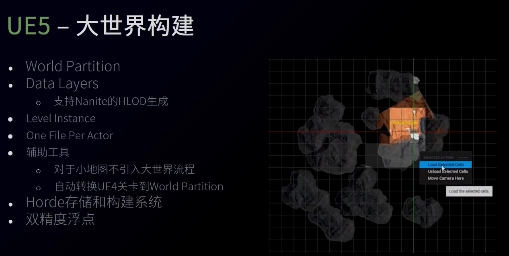
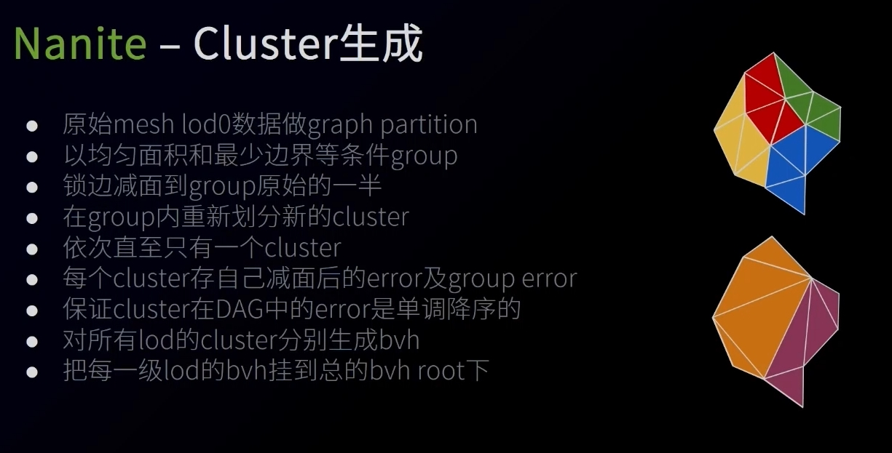
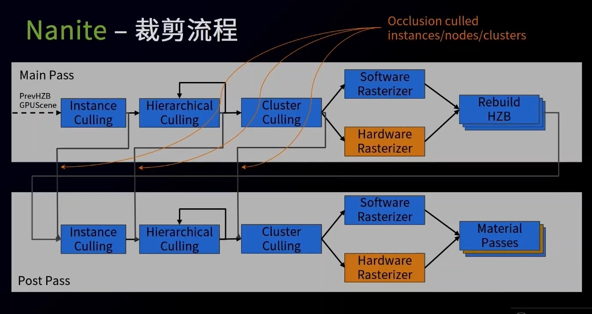
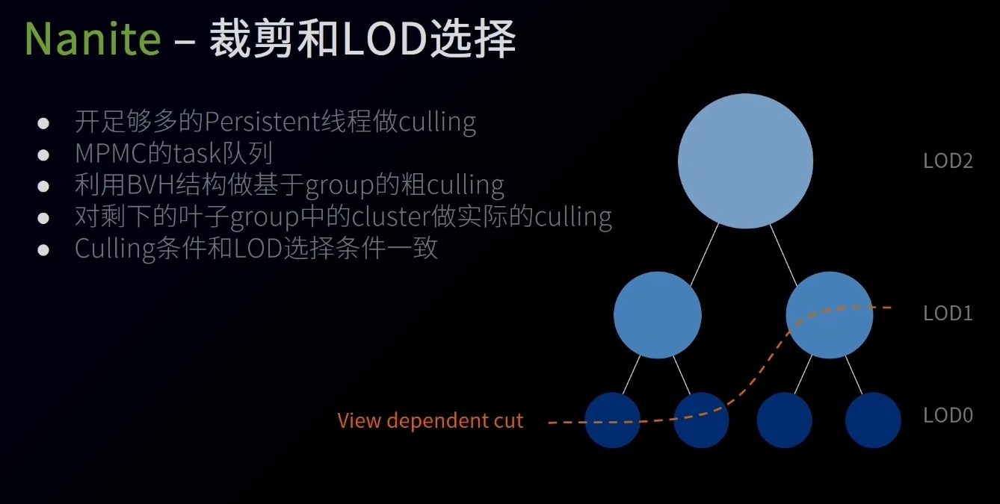
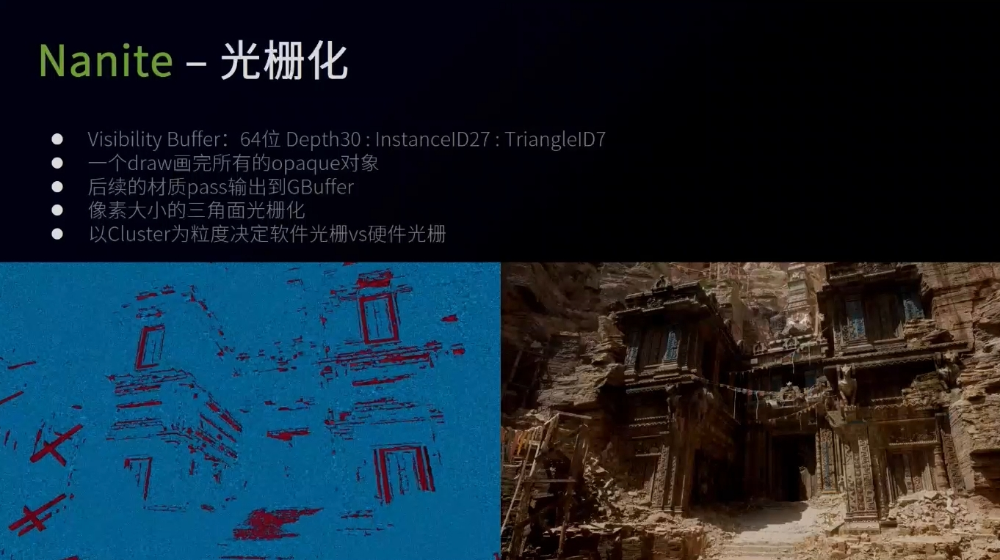
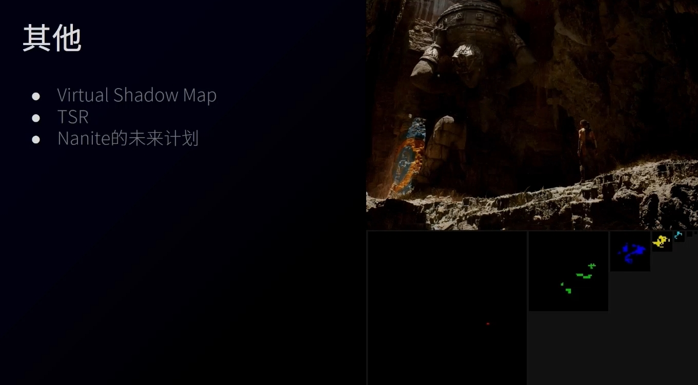

UE5中构建高质量复杂大世界的技术
=================

(Github正常排版: [UE5中构建高质量复杂大世界的技术]())

------------------------

- [UE5中构建高质量复杂大世界的技术](#ue5中构建高质量复杂大世界的技术)
	- [**0. 简介**](#0-简介)
		- [**0.1 UE5的核心功能**](#01-ue5的核心功能)
	- [**1. UE5大世界构建**](#1-ue5大世界构建)
		- [**1.1 大世界组件**](#11-大世界组件)
	- [**2. Nanite**](#2-nanite)
		- [**2.1 简介**](#21-简介)
		- [**2.2 技术**](#22-技术)
		- [**2.3 Cluster生成**](#23-cluster生成)
		- [**2.4 裁剪流程**](#24-裁剪流程)
		- [**2.4 裁剪和LOD选择**](#24-裁剪和lod选择)
		- [**2.5 光栅化**](#25-光栅化)
		- [**2.6 材质**](#26-材质)
		- [**2.7 串流**](#27-串流)
		- [**2.8 压缩**](#28-压缩)
		- [**2.9 其他**](#29-其他)

------------------------

&emsp;&emsp; 来自于UWA2021的分享, 这个视频是免费的哦. [视频地址](https://edu.uwa4d.com/course-intro/1/325)

有很多不懂的, 尴尬. 感谢指正啦!

------------------------

## **0. 简介**

### **0.1 UE5的核心功能**
  + 次世代的渲染技术: Nanite + Lumen
  + 构建大世界的工具集
  + 支撑大世界/大量对象/大量资产的性能
  + 编辑器和用户体验的改进
  + 次世代的动画技术
  + Chaos/网格同步的物理系统
  + 极大改善的主机和移动平台项目迭代的效率和体验

------------------------

## **1. UE5大世界构建**

### **1.1 大世界组件**
  + UE4 World Composition
    + 按照距离对世界进行切分和加载
    + 可以多人同时编写, 但是要预先分区域
    + 因为文件是二进制, 如果不分区域, 合并的时候比较麻烦
    + 如: 把Actor从A区域移动到B区域, 就不好修改和合并了
    + 如: 不经意间修改Actor, 导致Bounds变大, 让流式加载发生改变, 提前加载了比较远的地方, 导致性能卡顿
  + UE5 World Partition
    + 按照Cell进行分块, 然后所有的子系统(如植被, 道路, 水体)也会自动分块
    + 改到哪里, 只用Load Cell, 不用了就可以Unload Cell, 同时占用的内存就小了
    + 大世界烘焙,寻路也能做切分和合并
  + Data Layers
    + 支持Nanite的HLOD生成
    + HLOD有很多设置选项, 如把最低一级的LOD资源进行合并再减面
  + Level Instance
    + 可以把Actor封装成Level Instance
  + One File Per Actor
    + 友好的支持引擎自带的版本管理软件
    + 编辑地图任意区域, 然后提交的时候会生成影响到的区域
    + Runtime的时候, 不会产生影响, 会把数据重新合并回来, 重新排序
  + 辅助工具
    + 对于小地图不引入大世界流程
    + 自动转换UE4关卡到World Partition
  + Horde储存和构建系统
    + 跨地区/在家办公 等分布式办公使用的系统, 也可以本地局域网
    + 云端的 项目文件 和 Data Cache缓存
    + 可以只拿取部分文件
    + 支持云端打包
  + 双精度浮点
    + 引擎的数学运算都支持了双精度
    + 做了很大改进, 为了让内存和性能对比使用单精度的时候没有太大差别 

------------------------

## **2. Nanite**

### **2.1 简介**
  + 虚拟几何体的系统, 基于GPU Driven, 耦合屏幕分辨率, 跟场景复杂度没有关系
  + 先在Nanite存在一定的限制, 只对刚体对象做了支持, Mask和半透的材质目前还没有支持, 未来版本做改进
  + 硬盘存储的压缩和转码
  + 支持Lightmap/Lightmass 2
  + 支持可破碎物(Geometry Collection)
  + 可生成减面后的高质量替代mesh
  + Ray Tracing和物理用减面后的mesh
  + 用解析微分法决定像素误差不可见
  + 更高效的支持多光源投影
  + 目标: VSM支持非nanite的几何体

### **2.2 技术**
  + Cluster生成
  + 裁剪和LOD选择
  + 光栅化
    + 从Nanite渲染的Pass 过渡到GBuffer再去做Lighting
    + 因为Nanite支持还不非常的完善, 还希望走UE4的渲染管线
  + 材质
  + 串流
  + 压缩
  + 未来

### **2.3 Cluster生成**
  + 原始mesh lod0数据做graph partition
    + 原始高精度物体导入UE5, 会做一次离线数据处理
    + 做一次切分, 每128三角面合成一个cluster
    + 按照cluster屏占比尽可能一致
    + 需要lod切换, 意味着相邻级别的lod的边需要锁住, 只有这样lod切换的时候才能没有接缝
    + cluster的边数尽可能少, 这样减面才有效
  + 把一组的cluster 以均匀面积和最少边界等条件合成一个cluster group
    + 尽可能多的面合并到一起做减面, 因为这样质量更高
    + 切换LOD的时候, 跨不同的LOD, 尽可能的保留锁住的边
    + 如:把LOD0的8个cluster合成一个group, 一共有8\*128个三角面, 然后锁住边远做对半减面, 就只剩下4\*128个三角面, 然后把剩下的再次重新做cluster划分生成出来的叫LOD1
  + 以cluster group内重新划分新的cluster
    + LOD0和LOD1的共享一个Group, 他们的边界是一致的, 不会出现边界的跳变的问题
  + 循环迭代, 直到只有1个cluster
    + 不管LOD0多少面, 离到很远很远的时候只有1个cluster, 即128个面
  + 每个cluster保存自己减面后的误差以及上一级cluster group对半减面后的最大误差
  + 保证cluster在DAG中的误差是单调降序的
    + 每次cluster group的边界不一样, 保证减面效果最好
    + LOD越大(模型面数越少的),误差越大
  + 对所有LOD的Cluster分别生成BVH
    + 因为就算几亿/128的出的值, 走instance压力也非常的大
  + 把每一级的LOD的BVH挂到总的BVH Root下
    + BVH是树的结构, 树干储存bounding box, 叶子储存cluster group和bounding box

### **2.4 裁剪流程**
  + Instancing Culling: 跟上一帧的HZB(Hierarchical Z-Buffer)做裁剪()
  + Hierarchical Culling: 再用cluster group的BVH的bounding box 和 上一帧 z-buffer做裁剪(), 这时候得到 cluster group.
  + Cluster Culling: 根据自己的误差 和 parent的 最大误差, 决定自己是否要被裁减掉
    + 同时这个流程也是LOD选择的流程
    + 如LOD0的误差小没有被裁剪, LOD1的误差大被裁减掉了, 就是选中了LOD0
    + 但是LOD0如果误差还是过大, 没有更加精细的了, 还是会继续选择LOD0
  + 因为面非常的小, 硬件的光栅化对此效率很低, 所以根据Cluster投到屏幕上的大小决定走软光栅还是硬光栅
  + 生成新的HZB
  + 有了新的HZB, 把所有的流程重新来一遍. 这样的生成的结果是保守的.
  + 最后生成这一帧数真正的HZB

### **2.4 裁剪和LOD选择**
  + 在Culling的时候也要判断选择哪个LOD, 根据自己的误差是否足够小
  + 误差会根据投到屏幕上的角度做修正
  + 如果这个误差小于一定的阈值(人眼不可感知值)
  + 如果这个误差足够小, 但是它的parent的误差不够, 则说明它被选中了
  + 被选中的不被culling, 其它情况的都被culling
  + 走GPU 并行结构判断
  + 因为每一个物体的LOD级别总数不一样, 而GPU Compute Shader不知道. 所以可能会导致Dispatch空转, GPU利用率很低.
  + 解决办法: 发一个Dispatch, 开足够多的线程(Persistent), 走多生产者多消费者模式
    + 每一个Task同时做了Hierarchical Culling, Cluster Culling, Rasterizer

### **2.5 光栅化**
  + Visibility Buffer 64位: depth 30位, InstanceID 27位, TriangleID 7位(就是 Cluster 128个面片)
  + 一个draw画完所有的Opaque对象, 生成Visibility Buffer
  + 后续的材质pass输出到GBuffer
  + 像素大小的三角面片光栅化
    + 当前的cluster屏占比多少. 当非常小的时候, 因为硬件是以Quad 2x2光栅化处理的, 所以会存在额外的重复处理
    + 当非常小的时候, 所以会自己来估算, 走软栅化
    + 当比较大的时候, 走硬件光栅化处理
    + 光栅化用了高度优化过的扫描线的算法, 中间用了很多利用浮点去模拟顶点数计算的优化
      + 因为假设了Cluster会走软光栅的大小. 所以可以对像素做子像素的划分, 只用保证子像素的浮点精度就好了
  + 最后没有走完整的硬件光栅化, 深度写入不是硬件自己做的, 调用了软光栅化的Write Pixel
    + 用64位的原子操作和Visibility Buffer做比较, 来决定最后留下来的三角面片是什么数据
    + 自己重新做插值
  + 有了Visibility Buffer就解耦合了场景复杂度, 拥有每个像素位置的instance数据和对应的三角面片
  + 下面的图蓝色走的软件光栅化, 红色走的硬件光栅化

### **2.6 材质**
  + 每个Cluster会用额外32位来储存材质信息
  + 两种编码共享, 每个instance支持最多64种材质
    + 因为单个Cluster 128面片上很少概率出现三个以上材质, 除非是LOD级别很高
    + 3个材质以及以下用用fast pass, 3*6位就能表达自己是什么材质, 省下的14位记录三角面哪些区域用的是哪一种材质
    + 因为三角面是可以排序的, 2个7位就能完全表达 128个面片, 第三个材质可以用剩下的数量推算得出
  + MaterialID表
  + 材质深度
    + 24位的buffer
    + 很多材质的深度是预先分配好的
    + 当前画面材质深度和预先分配好的材质深度做depth equal测试, 就能非常快的过滤出来, 这个材质要处理哪几个像素
  + 基于屏幕Tile的InstancedDraw绘制每种可见的MaterialID
    + 不用全屏Quad,使用Tile Quad进一步优化用, 这样可以在vertex阶段剔除掉很多不使用的材质, 这样更不会进到Pixel Shader

### **2.7 串流**
  + Culling算法不感知
  + 始终在GPU保留Culling的层级结构, 只Streaming纯几何数据
    + 做Culling的时候并不可能一下子把所有Cluster数据都加载到内存/显存中, 不然会占用非常大
    + 如果LOD0还不满足误差, 没有更精细的, 还是要被迫选中LOD0
    + Culling计算的时候有BVH数据, 这样可以知道自己要哪一级的数据, 把它写入buffer. 如果和当前的等级不符合, 会做feadback, 再去请求自己实际所需要的级别数据, 让CPU/IO做串流
  + 以Cluster Group 为 Streaming粒度
    + 因为一个Cluster Group的LOD, 只有一个会被选中
  + 以Page对齐
    + Cluster Group可能会很大, 所以会做切分 生成Cluster Group Partition
    + 把所需要的Cluster不在显存中的时候, 把Cluster对应的Cluster Group所在的配置页全部都放到请求列表中
  + 加载完Page后修复数据
    + 等所有的配置页全部加载完成, 在GPU的Buffer上做修复

### **2.8 压缩**
  + 分成内存压缩和磁盘压缩
    + 两套压缩需要用不同的技术
    + 主机平台 磁盘 常用ARC压缩, 二进制数据串做查重, 然后把重复度越高的编码用更简单的编码去表达, 再查表复原
    + 但是内存中, Compute Shader需要均匀的压缩, 非常快的速度去读取数据, 而不是去查表
    + 内存的压缩通常是固定的, 和屏幕分辨率成正比
    + 磁盘是大问题, 比如大场景后, 模型非常多, 生成的Partition占用就非常大
  + 通用压缩很难有成倍的改善
  + 利用通用的硬件压缩, 调整待定数据优势
    + 因为每一个Cluster都是详细的局部数据, 所以精度不用那么高
    + 每一个Cluster中的面片Index大概率都是连着往后去指的, 这样就可以用1bit来描述是继续往后的, 还是表示从某个index开始重新算起
  + 内存格式
  + 储存格式
  + Mesh压缩完后收益也不是非常明显, 主要压力都是来自8K的高清贴图

### **2.9 其他**
  + Virtual Shadow Map
    + 普通的Shadowmap受限于精度
    + 有了Nanlite基础之后, 因为刚才有feadback, 完全可以知道这个像素要的精度是多少
    + 反过来就可以知道Shadow投到这个精度上, 需要哪一级的Mesh
    + 这样就可以选择那一级的Cluster画到哪一级别的Virtual Shadow Map
    + 如下图, 红色区域绘制就很少, 能非常高效的剔除不需要绘制的区域, 能自适应的决定屏幕空间这个位置需要绘制的精度, 然后绘制到特定的ShadowMap上
  + TSR
  + Nanlite的未来计划
    + 目前:
      + 只支持刚体几何对象
      + 不支持SKinMesh, 带顶点动画的, 因为数据是预先处理完的
      + 不支持半透和Mask材质, Visibility Buffer要做Depth剔除, 所以没有深度信息的物体
      + 对于微小聚合物效率不够好
    + 支持所有类型的几何对象
      + 植被
      + 动画
      + 地形
   + 光线追踪
   + 曲面细分
   + 可变分辨率着色
   + 多View渲染
   + 支持无限实例数

