UWA2021其它
=================

(Github正常排版: [UWA2021其它](https://github.com/HHHHHHHHHHHHHHHHHHHHHCS/MyStudyNote/blob/main/MyUWA2021Note/UWA2021%E5%85%B6%E5%AE%83.md))

------------------------

- [UWA2021其它](#uwa2021其它)
	- [**0. 优化网络游戏整体开发效率**](#0-优化网络游戏整体开发效率)
	- [**1. 高能手办团**](#1-高能手办团)
	- [**2. ARPG**](#2-arpg)

------------------------

&emsp;&emsp; 因为有一些能记录的内容太少或者都知道, 或者大同小异的, 所以就合成一篇了. 就记录几个对我印象深刻的几个点.

------------------------

## **0. 优化网络游戏整体开发效率**
  + [视频地址](https://edu.uwa4d.com/course-intro/1/312)
  + 他本人的知乎相关内容, [地址](https://zhuanlan.zhihu.com/p/336925151)
  + 入职培训
    + 比如SVN, 项目规范
    + 这套可以做成视频/文章
    + 可以避免很多基础的问题
  + 好的编辑器
    + 一个好的Editor可以大幅度提高策划,程序的工作心态和效率
  + 别让策划写代码
    + 可以让他们做简单的逻辑
    + 给予他们合适的权限, 而不是自由度过高
  + 代码的积累
    + 代码模块化积累可以快速移植到下一款游戏
  + UI皮肤设计
    + 这套系统很初期就要建立
    + 玩家对UI会看腻了
    + 这时候秋天金黄树叶, 冬天落雪
    + 都是能直接反馈到玩家眼里的
  + 打包要快
    + 建立母包,资源包
    + 利用自动化进行打包
    + 资源可以热更新, 热调试
    + 打包速度要快

------------------------

## **1. 高能手办团**
  + [视频地址](https://edu.uwa4d.com/course-intro/1/304)
  + 头发用传统的大色块做的
  + GI用Lightmap+光照探针+反射探针
  + 近景用PBR, 远景用BlingPhong
  + 手办设计原则
    + 令人印象深刻的外表
      + 好的故事背景,性格 不如 第一眼看到的好的外表
      + 在不知道背景故事的情况下, 外表成为第一个打动人的东西
    + 有张力的Pose
      + 游戏是虚拟的, 可以不参考现实的符合重力, 稳住重心的动作
    + 用心设计细节和底座
    + 光影流动
      + 结构平缓的地方材质粗糙
        + 给材质磨砂感, 必要的地方加上金属感, 这样也可以避免大面积高光
      + 结构密集的地方材质光滑
        + 在角色转动的时候, 有精致的高光点在角色身上流动
      + 利用结构之间的投影, 塑造立体感
        + 模型对自身产生阴影遮挡

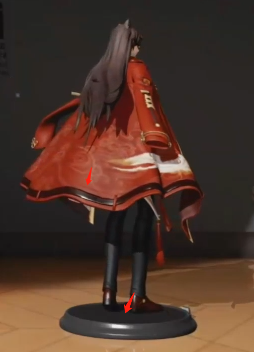

  + 去油腻
    + 干掉菲涅尔
    + 降低高光
      + 双层高光
        + 把高光晕开, 降低自身的锐利的高光, 稍微提高周围的高光
        + 算BRDF的时候的D计算两次, 第一次计算正常粗糙度, 第二次升高粗糙度再算一次, 两项做Lerp
        + 既能保高光点位置, 又能不锐利
      + ACES(Tonemapping)
        + 对皮肤直接用ACES调色,不是后处理
        + 保证在亮色暗色有细节

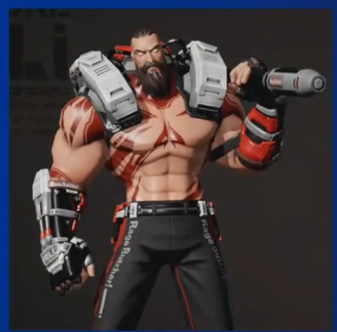

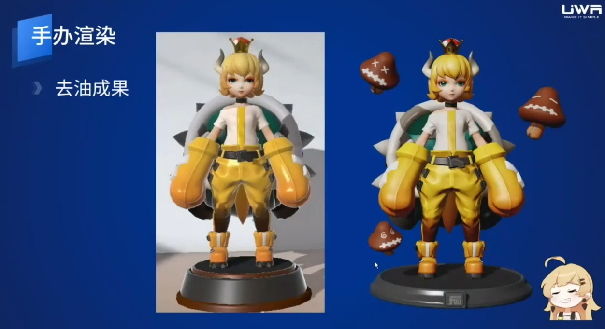

  + 定制环境光
    + 可以产生通透感, 角色自我之间产生反射
    + 在皮肤身上加入定制的环境光, 计算两套环境光

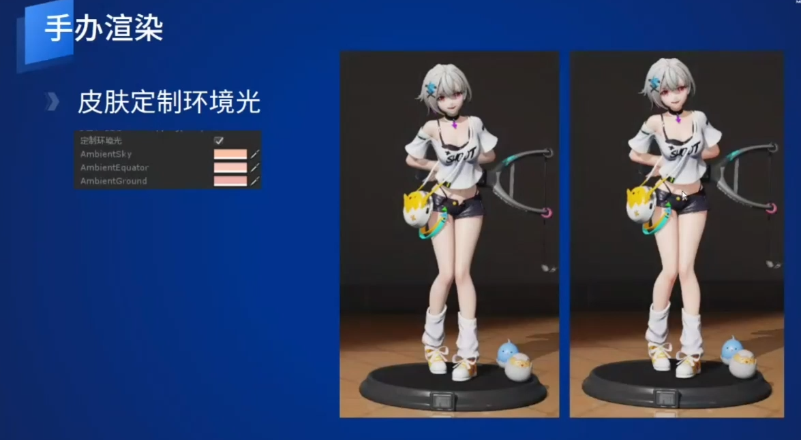

  + 离线渲染VS实时渲染
    + 离线渲染验证设计(C4D)
    + 移动端上还原效果
    + 左边离线, 右边实时, 达到相似的感觉

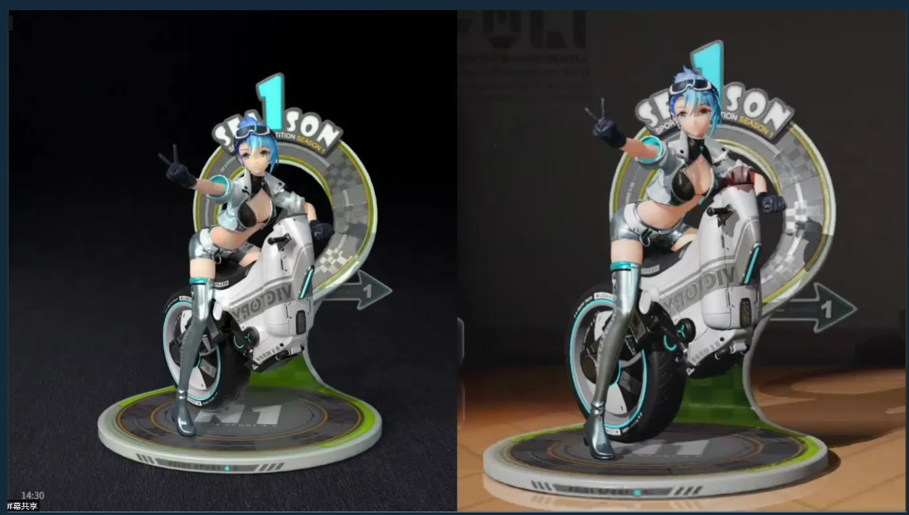

  + 法线贴图压缩
    + 正常情况电脑DXT(R5G6B5A8), 手机ETC(R4G4B4)
    + 手机改成EAC_RG(R8G8)
    + (好奇为什么不用ASTC???)

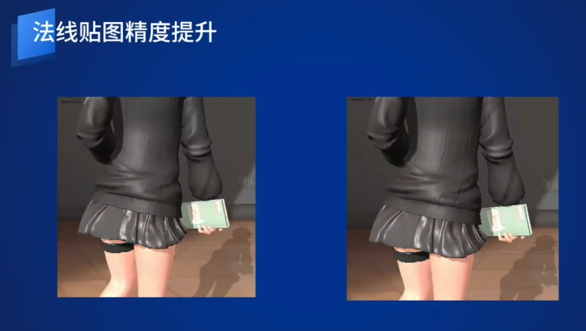

  + 定制Shadowmap
    + 原来Unity的Shadowmap利用率不是很高
    + 创建阴影相机, 定制其投影范围(其实URP可以设置VP)
    + 两种模式: 动态物体注册进相机, 固定相机范围

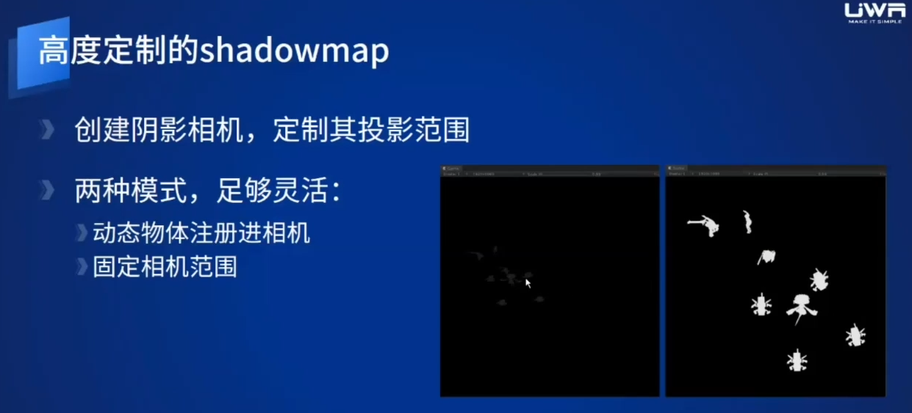

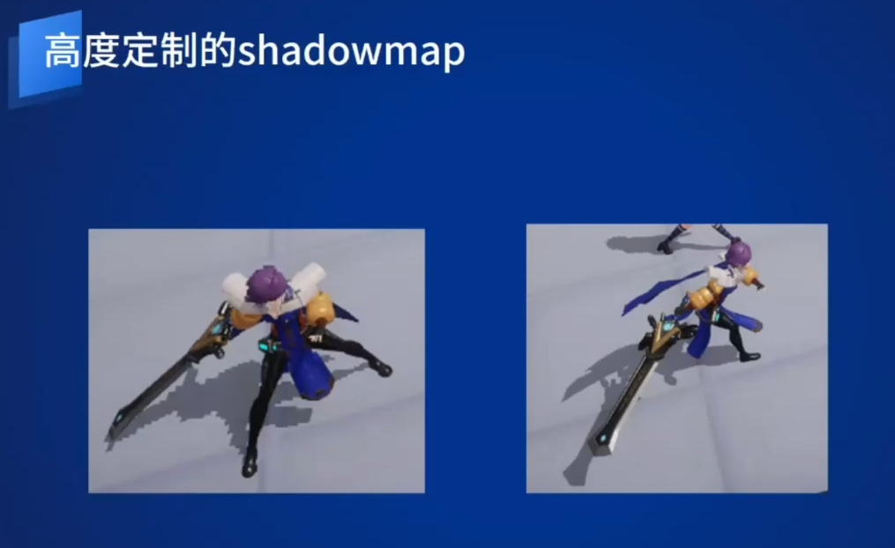

  + 在UI上显示3D角色和场景
    + 使用prefab来显示小场景, 相机拍摄到RT上
    + 对比Scene优势: 轻量, 速度, 随心所欲
    + 场景比较重度, 加载卸载麻烦
    + 美术在场景中制作资源, 布光, 烘焙
    + 点击按钮, 生成prefab储存渲染所需要的数据
      + 直接光, 环境光, 雾, Lightmap等
      + lightmap比较麻烦
      + 支持多套灯光数据, 白天晚上黄昏等等
    + 运行时加载prefab, 应用环境数据到场景
    + 设置相机渲染到RT给UI
    + [知乎文章](https://zhuanlan.zhihu.com/p/71626465)
  + 提前布局画质分级
    + 特效分级
    + Shader LOD
    + 后处理, 阴影等开关
    + QA测试要充分覆盖全部画质和效果开关
  + 量化开销
   + 使用PBR Shader, 渲染面数递增到知道稳定在目标FPS, countA
   + 开启待评估开销的效果, 递减面数到目标FPS, countB
   + A-B就是等效面数, 但是不是很精准
  + 本地资源监测, 定制规则半夜跑

------------------------

## **2. ARPG**
  + [视频地址](https://edu.uwa4d.com/course-intro/1/310)
  + ARPG+割草=人要多, 画质要好, 运行要流畅
  + 定制技术最低目标, 内存最小设备IOS 2G, 帧数稳定30
  + 设备分级,根据设备跑分分级. [设备跑分](https://www.techcenturion.com/mobile-gpu-rankings)
    + 画质开关
    + shader指令数量
    + 场景面数
    + 特效表现
    + 玩家对UI敏感度度高, 3D物体其次, 特效最低

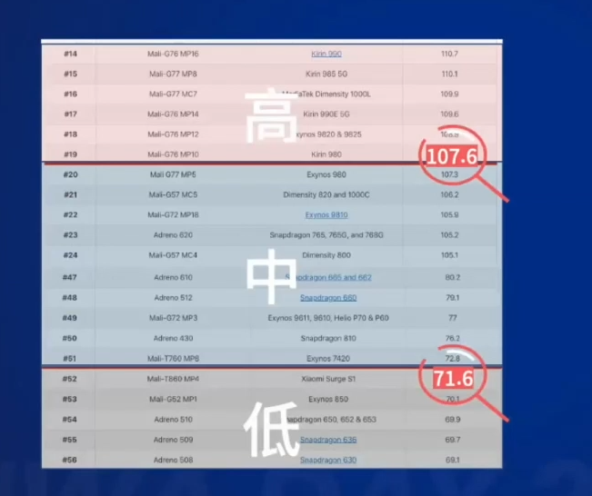

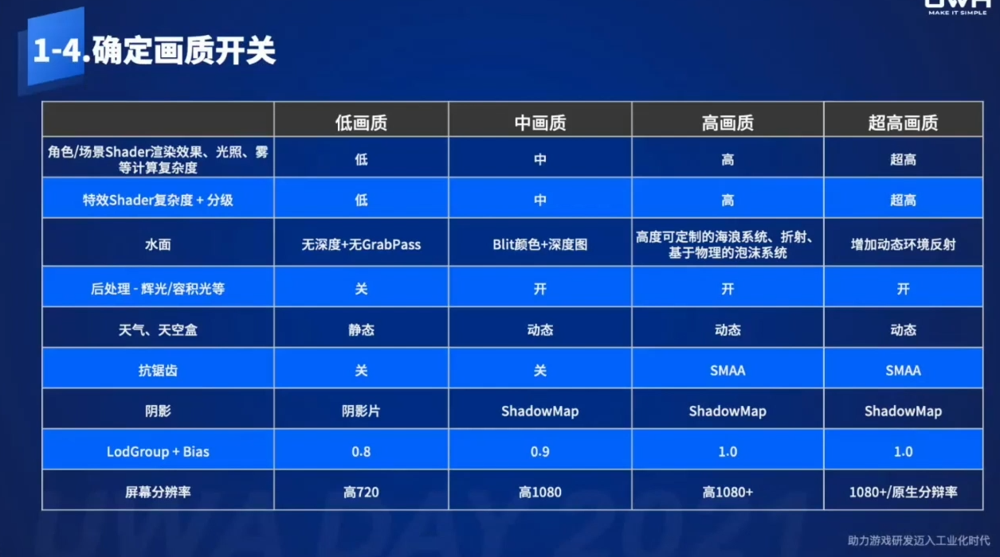

  + 角色资源超出规范
    + 引擎/TA制定角色规范
    + 每天自动化检测本地文件
    + 筛选,预警提示
  + 测不准, 难以定位优化点
    + 自动跑图工具
    + 固定点, 环顾上下左右, 记录数据
    + 报告中, 根据不同的LOD的指标阈值, 列出超标点
    + 报告中, 包含每个场景的统计数据, 方便持续追踪

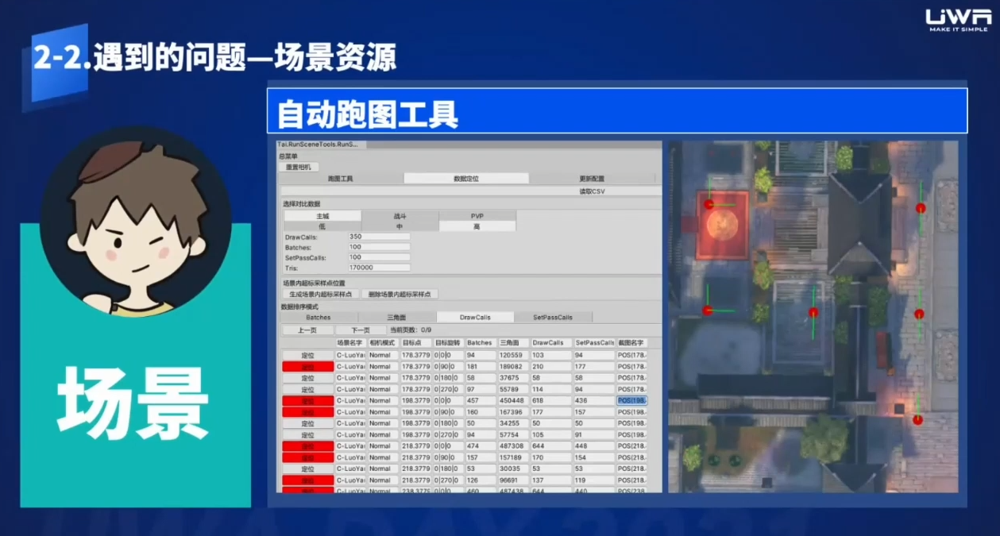

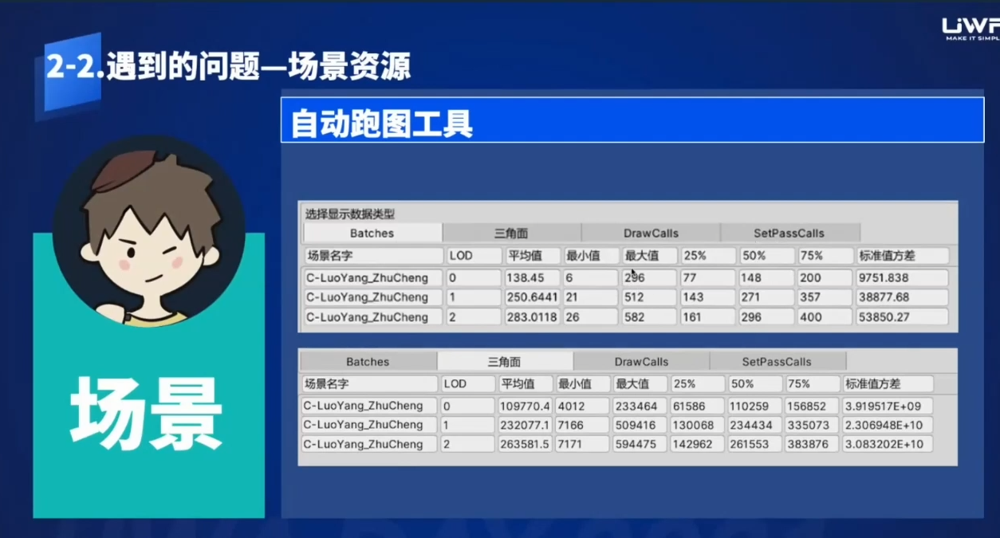

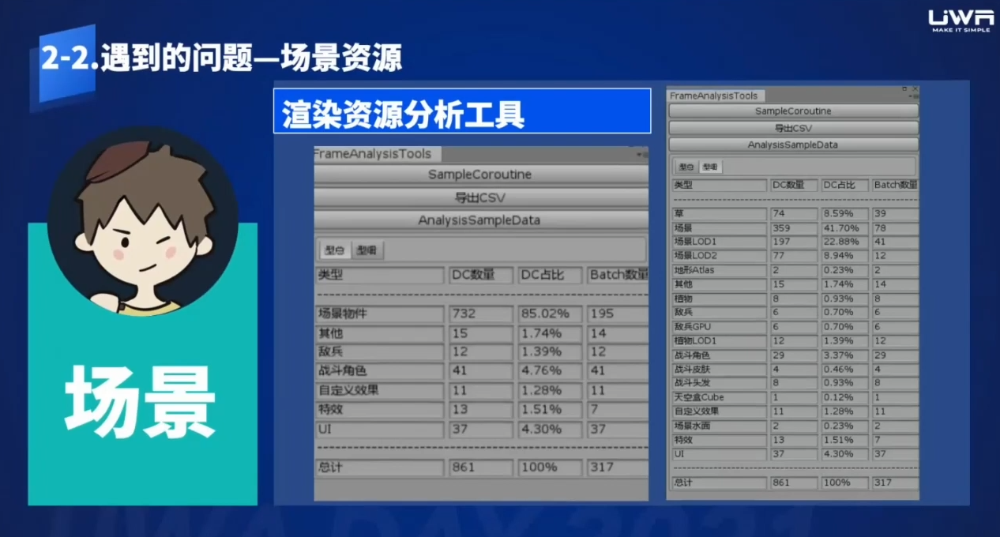

  + 场景特效合批, 调整SortLayer和SortingOrder
    + 虽然效果可能错误, 但是可以换取性能
  + 特效数量超标, 表现效果炸裂
    + 特效编辑器, 从源头开始规范
    + 直接显示指标和OverDraw等

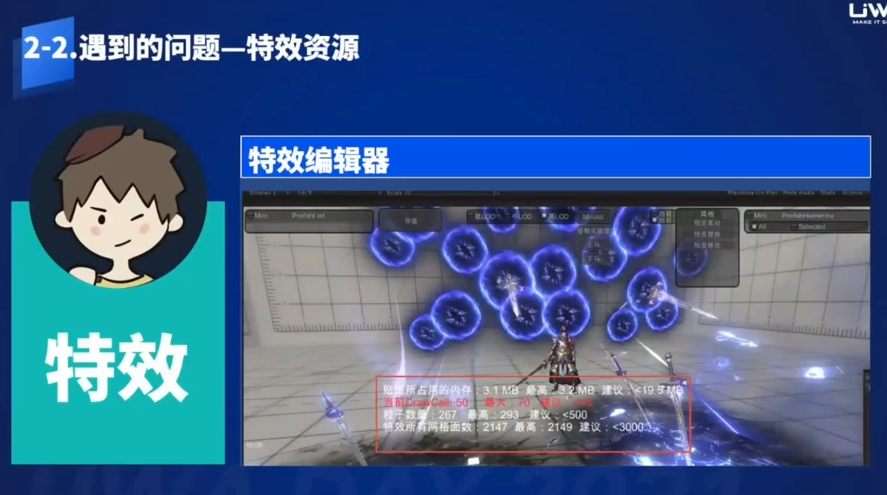

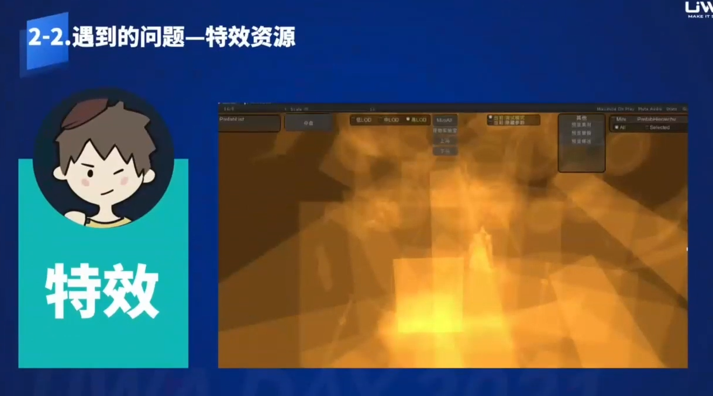

  + 大量小兵的动画更新
    + 减少CPU动画更新消耗,顶点蒙皮消耗
    + GPU Instancing合批
    + 大量重复角色Skinmesh的GPU Skinning解决方案[Github地址](https://github.com/chengkehan/GPUSkinning)
  + 预生成动画矩阵纹理, UV储存骨骼信息, GPU里面进行采样更新信息

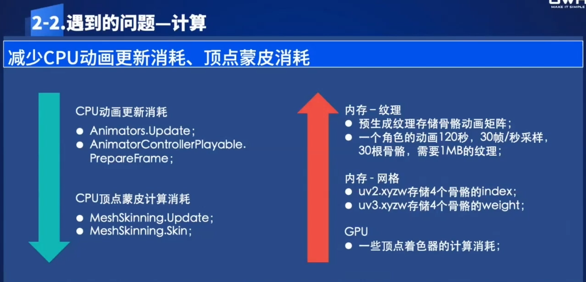

  + UI DrawCall过高
  + 动静分离, 涉及到UI重建
  + 血条和飘字
    + 用网格绘制血条 [文章地址](https://www.cnblogs.com/dongz888/p/4909012.html)
    + 高效的战斗飘字 [文章地址](https://blog.csdn.net/kakashi8841/article/details/50596000)
  + UI挂特效
  + 装载和卸载
  + Use Incremental GC
  + 编辑器下输入lua代码发送给真机执行
  + Unity Headp Explorer [Git地址](https://github.com/pschraut/UnityHeapExplorer)
  + 手机发热和功率 [文章地址](http://www.xuanyusong.com/archives/4753)
  + 自动化构建打包检测