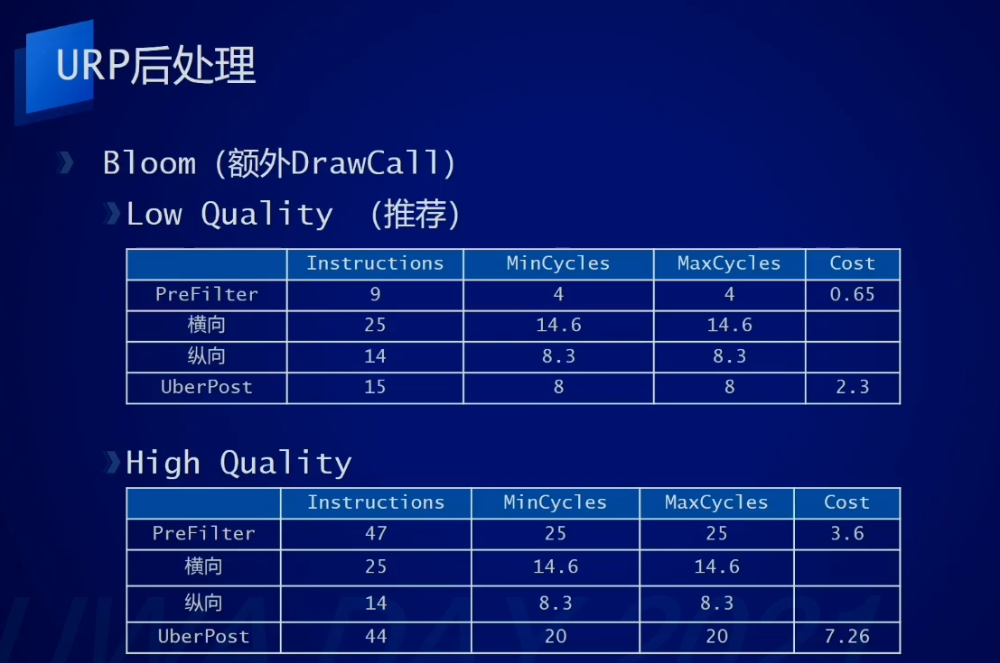

Unity移动游戏性能优化案例分析
=================

(Github正常排版: [Unity移动游戏性能优化案例分析](https://github.com/HHHHHHHHHHHHHHHHHHHHHCS/MyStudyNote/blob/main/MyUWA2021Note/Unity%E7%A7%BB%E5%8A%A8%E6%B8%B8%E6%88%8F%E6%80%A7%E8%83%BD%E4%BC%98%E5%8C%96%E6%A1%88%E4%BE%8B%E5%88%86%E6%9E%90.md))

------------------------

- [Unity移动游戏性能优化案例分析](#unity移动游戏性能优化案例分析)
	- [**0. 渲染**](#0-渲染)
		- [**0.1 URP Batch**](#01-urp-batch)
		- [**0.2 GPU Driven Rendering**](#02-gpu-driven-rendering)
		- [**0.3 Culling 视椎体**](#03-culling-视椎体)
		- [**0.4 HiZ(Hierarchical Z-buffer)**](#04-hizhierarchical-z-buffer)
		- [**0.5 GPU Driven Rendering**](#05-gpu-driven-rendering)
	- [**1. 加载**](#1-加载)
		- [**1.1 定位资源加载的耗时**](#11-定位资源加载的耗时)
		- [**1.2 AssetBundle加载资源耗时非常高**](#12-assetbundle加载资源耗时非常高)
	- [**2. 逻辑代码**](#2-逻辑代码)
		- [**2.1 Lua**](#21-lua)
		- [**2.2 C#**](#22-c)
	- [**3. GPU**](#3-gpu)
		- [**3.1 简介**](#31-简介)
		- [**3.2 GPU单帧分析**](#32-gpu单帧分析)
		- [**3.3 分析**](#33-分析)
		- [**3.4 后处理**](#34-后处理)
		- [**3.5 GPU带宽**](#35-gpu带宽)
	- [**4. 其它**](#4-其它)
	- [**4.1 Timeline**](#41-timeline)
	- [**4.2 String驻留**](#42-string驻留)

------------------------

&emsp;&emsp; 来自于UWA2021的分享, [视频地址](https://edu.uwa4d.com/course-intro/1/322)

------------------------

## **0. 渲染**

### **0.1 URP Batch**
&emsp;&emsp; 打断URP Batcher的几种情况
  + Shader not compatible
    + 如: Spine/Skeleton 默认版本不支持URP batch
    + 在Spine官方可以下载到URP Batch兼容的版本
  + MaterialPropertyBlock
    + 如: 修改武器的颜色, 用MPB会打断, 和URP Batch不兼容
    + 可以实例化材质球, 直接更改颜色
  + Shader穿插
    + 如: 存在多种Shader的物体紧密穿插排布
    + 可以修改RenderQueue, 但是会影响画面表现(如透明混合错误), 需要评估
  + 不同的Keyword
    + 如: Editor下Keyword残留
    + 不要在编辑器下复制材质球, 再替换Shader, 可能会残留
    + 写一个工具检查Keyword

### **0.2 GPU Driven Rendering**
  + 提升运行效率, 把CPU压力转给GPU
  + Culling
    + 视椎体
    + 深度HiZ
  + Terrain

### **0.3 Culling 视椎体**
  + 知乎 Github 都有案例, 不多复述
  + ComputeBuffer初始化
    + localToWorldMatrixBuffer
      + 每个Item的TRS矩阵
    + cullResult
      + 视椎内Item的TRS矩阵
    + argsBuffer
      + Draw Indirect参数
  + 更新ComputeBuffer
    + 相机参数, TRS Buffer
  + Dispatch
  + Compute Shader
  + 计算每个物体的OBB
  + 针对OBB顶点做视椎体剔除
  + 视椎体内物体
  + Append到CullResult
  + DrawInstancedIndirect

### **0.4 HiZ(Hierarchical Z-buffer)**
  + 知乎 Github 都有案例, 不多复述
  + 通过使用上一帧/当前帧数的深度图进行剔除
  + 使用行一帧的深度图, 生成深度图mipmaps
    + 每四个像素选取最远的
  + Compute Shader中通过对比渲染对象的AABB包围盒最远的点的Z和对应的mipmap层的Depth
    + mipmap level, 由物体OBB顶点占屏比例决定
    + Depth Value < AABB Z, 保留
    + Depth Value >= AABB Z, 剔除
  + 生成深度图mipmap耗时
    + blitCopy耗时较高, 可以用Compute Shader

### **0.5 GPU Driven Rendering**
  + 利用是视椎体和Hi-Z
  + 构建地形四叉树, 根据相机位置更新四叉树节点
  + 节点数据: Rect, LOD, Neighbour
  + 视椎体Culling
    + 根据Rect取HeightMap确定AABB
  + Hi-Z Culling
    + 用上一帧的深度图做Culling
  + DrawInstancedIndirect一样的块
  + VS模型的顶点色处理接缝区的顶点LOD
    + 高精度顶点褪变, 带顶点色方向相邻顶点移动
  + VS采样高度
    + 采样高度图并赋予给世界坐标Y

------------------------

## **1. 加载**

### **1.1 定位资源加载的耗时**
  + GOT Online Resource

### **1.2 AssetBundle加载资源耗时非常高**
  + Gradle打包
    + 需要勾选Build->Custom Launcher Gradle Template
    + 配置后缀和目录决定什么会不会被压缩
    + 默认情况: 存在**STREAMING_ASSETS**字段
    + 不小心把StreamingAssets删除, StreamingAssets目录会被压缩
    + 可以看到bundle如果压缩前后的大小不一致, 则表示被压缩
    + AB压不压缩区别不大, 但是资源被压缩后加载速度明显变慢4~5倍数

------------------------

## **2. 逻辑代码**

### **2.1 Lua**
  + GOT Online Lua
  + C#穿梭(耗时高)

### **2.2 C#**
  + Job System + Burst
    + 如DynamicBone插件Job+Burst化

------------------------

## **3. GPU**

### **3.1 简介**
  + Shader复杂度
  + URP后处理
  + GPU带宽

### **3.2 GPU单帧分析**
  + Shader复杂度
  + Overdraw
  + 分辨率
  + 后处理
  + 存在浪费
  + ...

### **3.3 分析**
  + Mali Offline Compiler
    + 观察cycles
    + 根据目标帧率计算每个像素的Shader复杂上限
    + 这样就可以估算出60FPS下每个像素OverDraw的上限次数
    + 因为GPU并不能跑满频, 所以实际OverDraw可能会更少一点
  + Keyword组合
    + 根据keyword组合复杂度分档
    + 定位复杂度高的keyword
  + 小结:
    + 根据Shader复杂度对Shader LOD进行分级
    + 指定机型验证Shader优化后的复杂度变化
    + Standard在中低端机型上开销依旧比较高

### **3.4 后处理**
  + 后处理分类:
    + 无开销
      + Channel Mixer
      + Color Adjustments
      + Color Curves
      + Lift Gamma Gain
      + Shadows Midtones Highlights
      + Split Toning
      + White Balance
      + 因为URP是一定会计算Color Grading LUT的, 最后应用于Uber
      + 上面几个计算在LUT中进行, 开关对性能影响不大
    + UberPost
      + 一些效果对Uber会产生分支, 效果的Cycles也比较高
      + ColorLooup
        + 尽量使用无开销的后处理来改变画面颜色
        + URP每帧都重新生成
      + Tonemapping ACES(LDR)
        + 不建议在LDR中使用ACES模式
          + 因为计算复杂度非常高
        + HDR可以用, 因为在ColorGradingLut过程中烘焙到内置LUT图上
          + LUT图分辨率比较低,如果是32位则为1024x32
          + 虽然计算复杂度高, 但是画的像素少
        + 如果可以使用无开销的后处理来达到类似的效果
    + 额外DrawCall
      + Bloom(High)
        + 耗时高, 建议使用low
      + DOF
        + 复杂度高有其实Bokeh
        + 减少采样数, 降低分辨率
      + SMAA
        + 复杂度高
  + RT丢失Alpha
    + R11G10B11 
    + UberPost中直接返回了1.0
      + 可以修改UberPost Shader解决, 让其返回为alpha
      + 如果bloom要有alpha, 则可以max(alpha, 3*bloom.x)

### **3.5 GPU带宽**
  + 纹理带宽
    + 可能导致高发热高耗电, 很多项目设置不合理
    + mipmap
      + 3D的物体mipmap尽量开启, 不然很容易造成cache miss
      + UI不用开启mipmap
      + 特效,texture2DArray的mipmap也要开启
      + 较大幅度提升FPS
    + 各向异性
      + Setting里面可以Anisotropic Textures选Force on, 强制开启全部图片的各向异性
      + 但是建议根据需要去开启各向异性
      + 较小幅度提升FPS
  + Bloom
    + 减少初始分辨率对带宽的影响较大
    + 减少采样次数对Clocks影响较为明显
  + 设置项
    + 一些地方不需要Copy Depth/Opaque Texture, 减少不必要的开销

------------------------

## **4. 其它**

## **4.1 Timeline**
  + Control Track(ParticleControlPlayable)
    + 因为使用Simulate耗时高
  + Activation Track(Active)
  + Activation Track的耗时少, 数量越多越明显
  + 当打包的时候没有对Timeline的组件之类的进行引用
    + 会自动Stripping, 播放的时候会意外报错
    + 添加link.xml到Assets目录中, [相关文章](https://blog.csdn.net/yuhan61659/article/details/80077285)

## **4.2 String驻留**
  + 对于字符串Intern处理
  + 项目String驻留过多, 导致占用内存过高
  + 可以用MemoryProfiler进行检测
  + 其中Value一列为String的内容, 括号内为重复的次数
  + string.Intern 可以去重, 这样在内存里面只有一份, 但是有多份引用
  + 建议配置表导出的时候, 可以添加去重功能, 减少包体和读取
  + 解析的时候Intern, 减少内存占用

