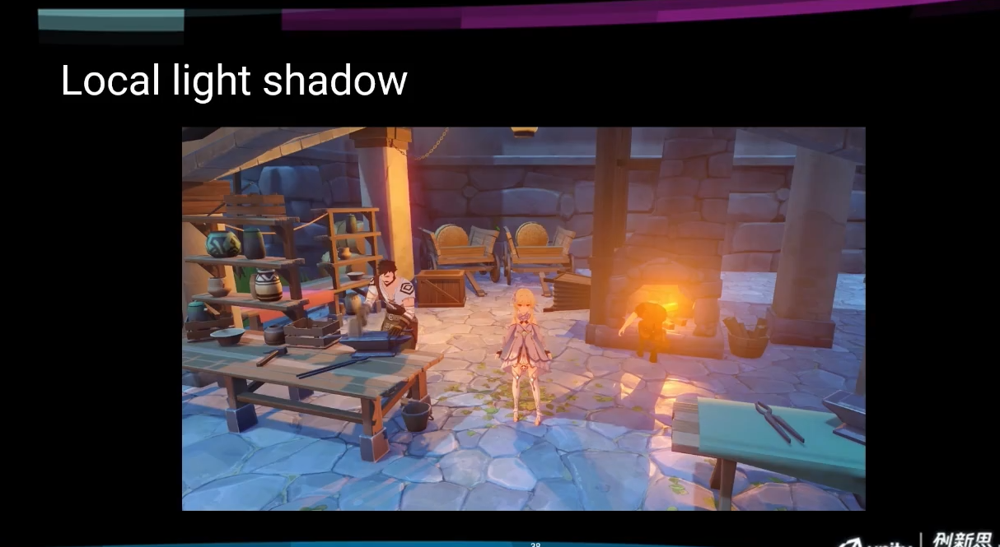

《原神》主机版渲染技术分享
=================

(Github正常排版: [《原神》主机版渲染技术分享](https://github.com/HHHHHHHHHHHHHHHHHHHHHCS/MyStudyNote/blob/main/MyUWA2021Note/%E3%80%8A%E5%8E%9F%E7%A5%9E%E3%80%8B%E4%B8%BB%E6%9C%BA%E7%89%88%E6%B8%B2%E6%9F%93%E6%8A%80%E6%9C%AF%E5%88%86%E4%BA%AB.md))

------------------------
- [《原神》主机版渲染技术分享](#原神主机版渲染技术分享)
	- [**0. 前言**](#0-前言)
		- [**0.1 Unity**](#01-unity)
		- [**0.2 Sony**](#02-sony)
		- [**0.3 渲染管线的简介**](#03-渲染管线的简介)
		- [**0.3 初始状态**](#03-初始状态)
		- [**0.4 技术改造思路**](#04-技术改造思路)
	- [**1. 方向光**](#1-方向光)
		- [**1.1 简介**](#11-简介)
		- [**1.2 距离实现**](#12-距离实现)
		- [**1.3 CPU优化**](#13-cpu优化)
		- [**1.3 GPU优化**](#13-gpu优化)
		- [**1.4 Mask贴图生成**](#14-mask贴图生成)
	- [**2. AO**](#2-ao)
		- [**2.1 简介**](#21-简介)
		- [**2.2 HBAO**](#22-hbao)
		- [**2.3 AO Volume**](#23-ao-volume)
		- [**2.4 Capsule AO**](#24-capsule-ao)
		- [**2.5 AO优化技巧**](#25-ao优化技巧)
	- [**3. Local Light**](#3-local-light)
		- [**3.1 clustered deferred lighting**](#31-clustered-deferred-lighting)
		- [**3.1 local lighting shadow**](#31-local-lighting-shadow)
		- [**3.1 shadow texutre 压缩**](#31-shadow-texutre-压缩)
	- [**4. Volumetric Fog**](#4-volumetric-fog)
		- [**4.1 效果**](#41-效果)
		- [**4.2 实现**](#42-实现)
	- [**5. God Ray**](#5-god-ray)
		- [**5.1 实现**](#51-实现)
		- [**5.2 为什么**](#52-为什么)
	- [**6. IBL(Image Based Lighting)**](#6-iblimage-based-lighting)
		- [**6.1 Reflection probe**](#61-reflection-probe)
		- [**6.2 Ambient probe**](#62-ambient-probe)
		- [**6.3 光照和阴影**](#63-光照和阴影)
		- [**6.4 室内室外**](#64-室内室外)
	- [**7. SSR(Screen space reflection)**](#7-ssrscreen-space-reflection)
		- [**7.1 效果**](#71-效果)
	- [**8. HDR Display**](#8-hdr-display)
		- [**8.1 目标**](#81-目标)
		- [**8.2 管线**](#82-管线)
		- [**8.3 做法**](#83-做法)
		- [**8.4 SDR&HDR一致**](#84-sdrhdr一致)
		- [**8.5 Hue Shift**](#85-hue-shift)
	- [**9. 其它**](#9-其它)
		- [**9.1 参考**](#91-参考)

------------------------

&emsp;&emsp; 这分享视频看了比较久了, 但是忘了写总结. 又回看一次发现自己很多忘了, 一些还没有实现. [视频地址](https://www.bilibili.com/video/BV1Za4y1s7VL), 也有文本版[文章地址](https://mp.weixin.qq.com/s/uyjuciYsMWvI3Z1UAP5wXw).

文章不知道丢哪个文件夹就丢到了UWA2021了.

本来以为一个早上就能写完的, 奈何干货太多, 边写边思考要点时间.

------------------------

## **0. 前言**

### **0.1 Unity**
  + Unity是一个灵活度很高的引擎
  + 简洁的代码风格, 让我们能更方便的定制化开发原神的渲染管线
  + Unity中国技术支持也非常配合

### **0.2 Sony**
  + 开发中超过一半的经历用在如何充分利用主机硬件架构进行开发和优化上
  + 这方面积累了相当多的经验, 和技术实现
    + 但是涉及到Sony NDA限制
    + 不能涉及硬件相关的内容
    + 不能涉及底层优化
  + 因为这次分享是针对渲染管线的, 不涉及CPU和I/O等其他模块

### **0.3 渲染管线的简介** 
  + 原神的定制了两套渲染管线
    + PC + 主机 -> 主机渲染管线
    + Android + IOS -> 手机渲染管线
  + 整体基调是基于PBR的风格化渲染
  + 同步开发, 手机为主要开发平台, 主机起步较晚
  + 技术选择上考虑全平台的资源制作和可能的运行时开销
  + 基于PBR, 让整个大环境的光影效果保持统一
    + 不是完全的能量守恒
    + 根据美术需求, 对不同材质修改光照模型
    + 因为是PBR, 在不同时间的光照, 天气 都会达到预期的效果
  + 游戏中的光影都是实时计算的
    + 24小时时间的关照
    + 动态的天气系统(晴天, 阴天, 下雨, 雾)
  + 高分辨率的输出
    + PS4 Pro分辨率原生4K
      + (但是我好像记得PS4有运用棋盘格渲染技术(Checkerboard Rendering), 进行分辨率拉伸. 可以看这篇[文章地址](https://beebom.com/what-is-checkerboard-rendering/))
    + PS4 base渲染的分辨率为1440P, 最终输出的分辨率1080P.
      + 这样会更加清晰和锐利
    + 更清晰的画面符合原神的美术风格
  + 大量使用Compute Shader
    + 主机管线超过一半feature用Compute Shader实现
    + 支持Async compute管线的平台上, 还能够进一步隐藏开销
    + (手机中很多手机已经较好的适配了Compute Shader, 但是还是存在一些限制)
  + 美术对渲染效果有特殊的要求, 很多光影的效果做法和写是风格游戏非常不一样
    + 拒绝:脏, 黑, 死, 焦, 噪
    + 接受:清新, 明快, 通透, 干净, 动画感
    + 在做所有的feature的时候要注意以上两组词
      + (怪不得光饱和度感觉很高, 闪瞎狗眼, 尤其是过场的时候整个全部白色. A1 闪光弹!)

### **0.3 初始状态** 
  + 为手机平台深度开发的Unity引擎
    + 不能简单地依赖Unity本身的PS4平台实现
    + 很多效果是为手机平台实现的, 主机需要大量的其他feature
    + PS4有很多硬件特性
    + (魔改 23333)
  + 捉襟见肘的开发资源
    + 启动的时候主机团队就一个人
    + 项目组严重缺乏主机开发经验
    + 技术开发有很多别的方面需要处理
      + 索尼账号, 商城, TRC等
  + 紧张的开发时间
    + PS4平台从零开始 , 需要全球同步上市, 开发时间大概一年半

### **0.4 技术改造思路** 
&emsp;&emsp; 在改造主机渲染管线的时候, 遵循以下思路
  + 拒绝堆砌feature
    + 很多看起来酷炫的技术不一定符合游戏风格
  + 尽量选择成熟实用的技术
    + 没有试错的时间
    + 尽量选择对画质帮助更大的feature
  + 多个技术之间最好能产生互动
    + 系统化改造, 让画面看起来更统一
    + 画面提升收益可以倍增, 1+1>2

-----------------

## **1. 方向光**

### **1.1 简介** 
  + 大量时间在室外
    + 室外的方向光阴影非常的重要
  + 近处阴影细腻
    + 画面显得干净
  + 阴影覆盖的范围非常的大
    + 原神的可是范围800m
  + 如下图, 远处的阴影放大之后也可以看到树叶的轮廓

### **1.2 距离实现** 
&emsp;&emsp; 阴影的技术还算是比较常规
  + 使用了Cascaded shadow map 加上基于泊松采样产生的的soft shadow
  + 没有使用通常的4级cascades, 而是用了8级
    + 大力出奇迹, 效果更好, 开销更大
    + 更多的drawcall会带来CPU开销
    + 更多的cascades也会带来GPU的开销
  + 采用Screen Space Shadow map
  + 每个像素基于泊松disc做11次采样生成软阴影
    + 为了消除pattern, 会线旋转再采样
  + 整个pass 的开销超过2ms, 有时候会达到2.5ms+

### **1.3 CPU优化** 
  + 做一个Shadow cache
    + 8级的前4级每帧都更新
    + 后4级采用轮流更新的方式
    + 这样每帧只用更新5个级别的cascades

### **1.3 GPU优化** 
  + GPU端才是优化大头
    + screen space shadow map的开销长期是大于2ms, 某些情况2.5ms
    + 8级比4级别的cascades情况, 从0.5ms涨到了0.8ms
  + 优化之前
    + 泊松分布的采样, 采样次数过多
    + 每一个像素会去做旋转, 消除重复的pattern
  + 优化
    + 尽量在必要的地方做软阴影计算
      + 耗时2~2.6ms -> 1.3~1.7ms
    + 生成一个mask图, 标记全阴影, 半阴影, 非阴影片区
      + 全阴影返回0, 非阴影返回1
      + 半影区才去计算软阴影
      + GPU开销大约减少了30%
      + 甚至比采用4级cascades还要快一些
      + 下图红色区域是半阴影区
        + 绝大部分像素都可以去除软阴影的计算

### **1.4 Mask贴图生成** 

  + 贴图的分辨率是屏幕的1/4x1/4
    + 每一个mask值对应4x4的屏幕像素block
    + 之前: 要计算采样16次, 但是准确
    + 优化: 选择很少的几个像素做sample点计算, 得到近似的结果, 容易出现误差
  + 把mask贴图blur(模糊)处理
    + 让半阴影区域扩散开来
  + 整个mask贴图的生成包括模糊处理开销大概0.3ms
  + GPU开销稳定在1.3~1.7ms
  + 效果很难看出区别, 如下图:

-----------------

## **2. AO**

### **2.1 简介** 
  + 不用AO, 在阴影区域, 画面缺乏对比, 显得浮空
  + 使用AO, 人物和物体在引用中会对周围产生软阴影的投射
  + 采用多种AO技术
    + HBAO, 提供小范围的细节更多的screen space AO
    + AO Volume, 为静态物体提供更大范围的AO
    + Capsule AO, 为角色提供更大范围的AO

### **2.2 HBAO** 
  + 采用HBAO(常规技术)
  + 能够实现比较细节的AO效果(对比SSAO)

### **2.3 AO Volume** 
  + AO Volume能够产生大范围的AO
    + HBAO没有办法产生这种效果, 技术原理和性能限制
  + 离线对物体做一个遮挡信息的计算
    + 是在物体的local space去计算的
    + 因为是离线的, 所以只能针对静态物体
  + 2012年GDC的 InFamous 2 有提到过, [视频地址](https://www.gdcvault.com/play/1015532/Ambient-Occlusion-Fields-and-Decals)

### **2.4 Capsule AO** 

  + 观察红色区域
    + 能够反映人的体形和人影的投射
    + 人物动作改变, 阴影的形状也会改变
    + (黑悟空也有采用这套)
    + (文章把 香菱写成了相邻 doge)
  + 针对角色有带骨骼动画的
    + 胶囊体包裹住人物的四肢和躯干
    + 随着角色的骨骼动画绑定进行同步更新
    + 这些胶囊体会用来做遮挡静思园
  + 具有方向性, 分为无方向的环境遮挡计算和带方向的环境遮挡计算
    + 所以图中所示会有两个阴影: 周围的墙壁和地面
    + 带方向采用的是主光源方向和法线进行混合, 得到虚拟遮挡方向

### **2.5 AO优化技巧** 
  + 做法
    + 采用1/2×1/2分辨率渲染
    + 然后模糊处理
    + 再upsample
  + blur和upsample采用高斯双边滤波模糊(Bilateral filter Gauuian blur)
    + 消除噪点, 不能噪
    + 确保无效的AO渗透到周围的区域
    + 可以看知乎文章高斯双边滤波模糊的介绍, [文章地址](https://zhuanlan.zhihu.com/p/61860792)
  + 优化点:
    + Bilateral filter 原理存在大量重复的计算
    + 2 pass blur + 1 pass upsample = 多次切换RT, AO多次读写
  + 优化方法:
    + 使用compute shader
    + 通过LDS(local data share)来保存blur的中间值
    + 通过同时输出四个像素的方式, 来重用相邻像素的计算
    + 还能使用async compute pipe来进一步降低性能开销
    + 冯乐乐大佬的一篇 More Compute Shaders 翻译, [文章地址](https://zhuanlan.zhihu.com/p/63223223)
    + (感觉主机好多都是直接粗暴上compute shader, 配合compute queue, 恐怖如斯)

-----------------

## **3. Local Light**

### **3.1 clustered deferred lighting** 
  + 支持是视野内同时出现最多1024盏灯
  + 把屏幕分块层64x64像素的tile
  + 每一个tile在深度方向分16级的clusters
  + (现在很多市面上的手游都有上这套技术!)

### **3.1 local lighting shadow** 
  + 多个local light的照明存在交错
    + 产生不同朝向的阴影, 有很好的细节
  + 支持100盏灯的实时阴影
    + 理论上可以支持更多, 但是够用了
  + 阴影的分辨率可以根据优先级和距离进行动态调整
  + 最终的阴影 = 烘焙的静态场景阴影 + 实时的动态场景阴影

### **3.1 shadow texutre 压缩** 
  + 很多local light, 如果都烘焙 shadowtexutre
    + 占用硬盘空间非常大
    + 对I/O有压力
  + 阴影算是深度图, 不能随便使用BCn压缩
    + 什么是BCn? [英文地址](https://www.reedbeta.com/blog/understanding-bcn-texture-compression-formats/), [翻译地址](https://zhuanlan.zhihu.com/p/199635682)
      + BC就代表Block Compression(压缩块), BCn即全部以4x4的像素块为单位进行压缩, 更多详情就看文章吧
  + 需求: 精度损失小, 压缩率高, 解压快
    + 离线生成全场景的静态local light shadow map, 进行压缩
    + 运行时, 用compute shader进行解压, 单张解压非常快
      + 在ps4 base上解压1024x1024的分辨率好是约0.05ms
  + 做法:
    + shadow texture按照2x2的block来进行编码
    + 每4个深度值, 用32bit来保存
      + 想要降低精度损失, 可以选择高精度压缩, 用64bit来保存
      + 编码方式一: 基于深度平面方程的方式
      + 编码方式二: 压缩的浮点数方式
    + 再通过一个quad tree来合并编码以后的数据
      + 每个tile又包含了16×16个block
  + 效果:
    + 左边: 没油压缩的深度图
    + 中间: 平面方程编码的图
    + 右边: quad tree 0到4级的深度图
    + 深色的地方是0

  + 相关文章:
    + 中文详解 [地址](https://www.jianshu.com/p/3f76b8986564)
    + 原文视频 [视频地址](https://dl.acm.org/doi/abs/10.1145/3306307.3328167)
    + 原文PPT [PPT地址](https://drive.google.com/file/d/19EHLJAfqQECjRRShHyS3mHrg4XFxpCOx/view)

  + 压缩后:
    + 室内默认压缩比20:1~30:1
    + 高精度压缩, 压缩比40%~70%
  + 实例:
    + 红圈内还存在一定的瑕疵
    + 原图2048x2048的shadow texture
    + 未压缩8MB
    + 默认压缩,274.4KB, 压缩率29.85
    + 高精度压缩,583.5kb, 压缩率14

-----------------

## **4. Volumetric Fog**

### **4.1 效果** 
  + 体积雾可以接受local light的照明影响
  + 在灯的影响范围内形成一圈光晕
  + 提升画面感觉, 产生泛光
  + 远处建筑物被笼罩, 也会产生朦胧
  + gpu开销不到1ms

### **4.2 实现** 
  + 基于相机空间, 把view frustum分成多个voxel
    + voxel和之前的clustered deferred lighting的clusters是对齐的
    + 方便后面对local light做scattering进行加速
  + 把体积雾和local light信息放进voxel里面
  + 再用ray marching的方式计算体积雾
    + ray marching的时候考虑local light的projection texture 产生相应的效果
  + 使用temporal filter进行多帧混合
    + 可以让雾的效果细腻稳定

-----------------

## **5. God Ray**

### **5.1 实现** 
  + 原理:对于方向光的遮挡产生的(丁达尔效应)
  + 单独的pass生成God Ray
  + 使用1/2x1/2分辨率进行Ray Marching
  + 最多采样5级的Cascades
  + god ray的效果可以叠加到体积雾上

### **5.2 为什么** 
  + 首先并不是物理表现正确的东西
    + 但是可以让美术满意
  + 为什么要单独写一个Pass?
    + 体积雾本来的原理本来也能产生God Ray, 理论上可以一个Pass
    + 但是直接用个体积雾生成God Ray, 美术不满意效果
      + 分辨率不够. 
        + 体积雾的分辨率是靠Voxel, 而Voxel是不会划分的特别精细的
      + 体积雾生成的God Ray强度是完全依赖于体积雾的浓度
        + 明显的God Ray, 需要非常高的雾的浓度
        + 随着雾的浓度提高, 画面回合不通透, 太脏
    + 单独Pass 可以得到更锐利, 清晰的效果
      + 美术调整也更加方便
      + 美术想要什么, 给他做什么
  + 下面两张图分别是体积雾和God Ray Pass生成的God Ray

-----------------

## **6. IBL(Image Based Lighting)**

&emsp;&emsp; 图中左边的是Reflection probe(反射探针), 右边是Ambient probe(环境光探针). 随着24小时的变化, 这两个探针也会跟着变化

### **6.1 Reflection probe** 
  + 为场景提供反射信息
  + 因为存在24小时和动态天气系统, 所以不能baked cubemap
  + 离线烘焙了一个mini GBuffer
  + 运行时,根据当时的光照条件去实时生成环境贴图
  + 美术可以在游戏里面摆很多个这样的Reflection probe
  + 实现:
    + 第一步: relight
      + 当前的光照环境照亮mini Gbuffer, 得到环境贴图
    + 第二步: convolve
      + 生成cubemap的mip chain, 对每级的mipmap做卷积
      + (之前自己写这部分的时候感觉挺耗时的)
    + 第三步: compress
      + 对cubemap用compute shader进行BC6H压缩, 4x4block -> 128bits
    + 用compute shader同时进行处理六个面
    + 分帧数进行, 同时只处理一个probe, 不停循环

### **6.2 Ambient probe** 
  + 实时生成的
  + 在Reflection probe做完relight之后, 包含了当前你整个光照信息
  + 从中间提取当前的Ambient信息
  + 转换成3阶段的SH(Spherical Harmonic, 球谐)系数保存下来
  + 把Reflection probe处理完成以后会进行提取的过程
  + 使用Compute Shader来处理六个面

### **6.3 光照和阴影** 
  + 问题: Relight单靠mini GBuffer没有考虑阴影
    + 出于性能和保存数据大小考虑
    + 导致Relight后两个Probe都会漏光
    + 本来处于阴影当中的的地面会变得明亮
  + 改进: 离线把24消失的shadow都烘焙下来
    + 每隔一段时间烘焙一下
    + 把shadow转换为shadow SH进行保存
    + 通过当前的时间对shadow SH进行插值, 来压暗Relight之后的结果
  + 进阶: 把Local Light的信息也保存下来
    + 把Local Light的SH在Relight的时候也加上
    + 这样可以得到非常好且廉价的Local Light反弹效果
  + 效果: 
    + 第一组图: 观察屋檐和地面本来不应该亮的
    + 第二组图: 加入了Local Light, 屋檐受到了弹射而变亮

### **6.4 室内室外** 
  + Reflection probe分成室内、室外两种
  + Ambient probe也分成室内外不同的环境光
  + 美术摆放室内环境专用的网格(interior mesh), 来标记室内光影响的像素
  + 做了过渡处理. 两套光照切换的时候不会产生硬过渡的效果
    + (感觉像是室外光照亮了内部)
  + 红色区域是就是室内标记图

-----------------

## **7. SSR(Screen space reflection)**

### **7.1 效果**
  + 跟水面的反射技术不一样
    + (盲猜水面是SSPR吗 doge)
  + SSR在PS4 Pro上的GPU开销大概是1.5ms
  + 使用Temporoal filter, 让其稳定, 去燥
  + 为SSR生成了Hi-Z的buffer, 可以让每条射线通过Hi-Z最多能够跟踪的距离达到整个屏幕
    + (SSR + 深度图的HI-Z有很多文章和代码)
  + 反射的时候Sample上一帧数的Color Buffer, 包含特效
  + 就算关闭SSR, 还有Reflection probe提供反射
    + 添加Deferred reflection pass来计算Reflection和Ambient信息
    + 同时把AO也考虑进去, 降低漏光

-----------------

## **8. HDR Display**

&emsp;&emsp; 先上一个冯乐乐大佬的[漫谈HDR和色彩管理](https://edu.uwa4d.com/course-intro/0/181)

### **8.1 目标**
  + 亮度: 是用ST.2084, 最高能够让画面亮度达到10000 nits
  + 色彩空间: 需要支持Rec.2020色彩空间
    + 在CIE 1931下, 老的Rec.709覆盖范围是35.9%
    + Rec.2020是75.8%

### **8.2 管线**
  + SDR: 使用tone mapping(色调映射) 和 color grading(颜色映射)
  + HDR:
    + color grading -> HDR color grading
    + tone mapping -> RRT+ODT(reference rendering transform + output display transform) 即 ACES pipeline
    + 但是原神没有使用ACES pipeline(RRT+ODT), 因为和游戏风格不符合
  + UI HDR, 单独画到一个RT, 再和场景做合并
    + 因为UI的亮度处理方式和场景不太一样
    + (之前纳闷过HDR之后UI不一致怎么办)
  + PS4支持HDR10 (IPhone的HDR显示也很NB)
 
### **8.3 做法**
  + 美术在Davinci(达芬奇)做HDR校色, 再通过脚本输出HDR的LUT(Look-Up-Table) [达芬奇地址](https://www.blackmagicdesign.com/products/davinciresolve/)
  + 运行时候用一个Compute Shader 生成WCG(更宽的色域) Color Lut
    + 白平衡
    + WCG color grading
    + WCG color expansion(颜色扩展)
    + 这些重度的ALU计算在LUT阶段完成, 只需要不到0.05ms

### **8.4 SDR&HDR一致**
  + 为了保证低亮度范围内画面和SDR版本的游戏一致
    + HDR的渲染画面和tone mapping处理之后做了一个基于亮度的混合
    + 在亮度不高的地方, 尽量保证filmic tonempping的关于toe部分的处理. 可以看狼人这篇的[HDR&Filmic Tonemapping Operators](https://blog.csdn.net/wolf96/article/details/48467937) 和 JOHN HABLE 的这篇 [Filmic Tonemapping with Piecewise Power Curves](http://filmicworlds.com/blog/filmic-tonemapping-with-piecewise-power-curves/)
  + Transfer functions in imaging
    + [wiki地址](https://en.wikipedia.org/wiki/Transfer_functions_in_imaging)
    + OETF(opto-electronic transfer function)
      + 场景颜色作为输入, 转换成图像信号作为输出的方法
    + EOTF(electro-optical transfer function)
      + 图像作为输入, 并将其转换成显示器的线性光输出的方法
    + OOTF(opto-optical transfer function)
      + 是将场景光作为输入, 显示器光作为输出
      + OOTF是OETF和EOTF的结果，
      + 通常是gamma的
    + HDR用了BT1886作为EOTF曲线, gamma 2.4作为OETF曲线
    + SRD: EOTF_BT1886(OETF_sRGB(color))!=color
      + 1886是gamma2.4
      + SDR的OETF是一个分段函数, 大致上看作是gamma 2.2
      + 也就会出现 OETF处理完的颜色, 经过EOTF, 得到的颜色不是本身存在误差
    + HDR: Inverse_PQ(PQ(color)) = color
      + OETF和EOTF是被很好的定义了
      + 颜色经过这两个处理能够还原成原来的颜色
    + 但是大家已经习惯了在HDR存在误差
      + 为了模拟这个误差, 
      + 在HDR管线的尾部增加了OOTF 曲线, 模拟BT1886(sRGB(color))转换带来的误差

### **8.5 Hue Shift**

  + 什么是Hue Shift?
    + 如上图灰度图+噪音图进行扰动得到火焰的形状纹理, 再用橘色去染色, 最后把火焰的整体亮度提高
    + SDR下存在tone mapping, tone mapping的亮部是有一条曲线, 会让亮度增加逐渐变慢
    + 橘色的R通道跟G通道的差异本来就是很大(RGB: 255,145,56)
    + 随着亮度的增加, tone mapping曲线的介入, R通道增长变慢, G通道逐渐赶上来, 就产生了Hue shift
    + 画面开始发黄, SDR的火焰就开始产生了变色
    + 但是HDR没有tone mapping不会产生整个效果
  + Hue Preserving
    + 美术想要在HDR复现这个效果, 所以需要一个方法来还原这个效果. 这个过程就叫Hue Preserving
      + 因为在HDR下, R和G通道保持比例
      + 随着亮度提高, 会得到非常高的橘色
      + 在视觉上不会让人觉得很明亮, 因为没有变成黄色
    + 方法一: 黑体辐射, 即色温 (并未使用)
      + 这是一个基于物理的算法. 在黑体辐射中, 随着温度不同, 光的颜色各不相同 [百度百科](https://baike.baidu.com/item/%E9%BB%91%E4%BD%93%E8%BE%90%E5%B0%84)
        + 红——橙红——黄——黄白——白——蓝白的渐变过程
        + "黑体"的温度越高, 光谱中蓝色的成份则越多. 而红色的成份则越少
        + 如白炽灯暖白色, 色温为2700k
        + 日光色荧光灯, 色温为6000k
      + 让美术去指定温度, 根据温度来算出应该产生什么颜色
      + 原神没有使用这个功能
        + 这个需要美术修改美术资源
        + 这个HDR功能是后期才加入的
        + 不能让美术大量去修改已有的资源
    + 方法二: 模拟
      + 原神不是写实类游戏, 火可可以有各种的颜色
      + 元素反应可以转换火焰的颜色
      + 在shader里面去模拟Hue Shift
        + 把模拟放到 color grading pass 中
        + 并且合并到LUT的计算里
      + 不需要修改先有的资源, 且得到的效果非常满意
      + 通过引入tone mapping的方式模拟Hue Shift, 顺手解决了SDR和HDR亮度部分画面一致性的问题
      + 性能的负担可以忽略不计
        + 因为是在生成LUT的时候去计算的

-----------------

## **9. 其它**

### **9.1 参考**
  + [Fast Filtering of Reflection Probes](http://josiahmanson.com/research/ggx_filtering/)
  + [A scalable real-time many-shadowed-light rendering system](https://dl.acm.org/doi/abs/10.1145/3306307.3328167)
  + [Lighting technology of The Last of Us](http://miciwan.com/SIGGRAPH2013/Lighting%20Technology%20of%20The%20Last%20Of%20Us.pdf)
  + [HDR display in Call of Duty](https://www.youtube.com/watch?v=EN1Uk6vJqRw)
    + [PPT](https://research.activision.com/publications/archives/hdr-in-call-of-duty)
  + [Hi-Z Screen-SpaceCone-Traced Reflections](http://what-when-how.com/Tutorial/topic-547pjramj8/GPU-Pro-Advanced-Rendering-Techniques-168.html)
  + [ambient occlusion fields and decals in infamous 2](https://www.gdcvault.com/play/1015320/Ambient-Occlusion-Fields-and-Decals)
  + [Creating the Atmospheric World of Red Dead Redemption 2: A Complete and Integrated Solution](https://www.jendrikillner.com/post/graphics-programming-weekly-issue-96/)
    + [解读](https://zhuanlan.zhihu.com/p/91365039)