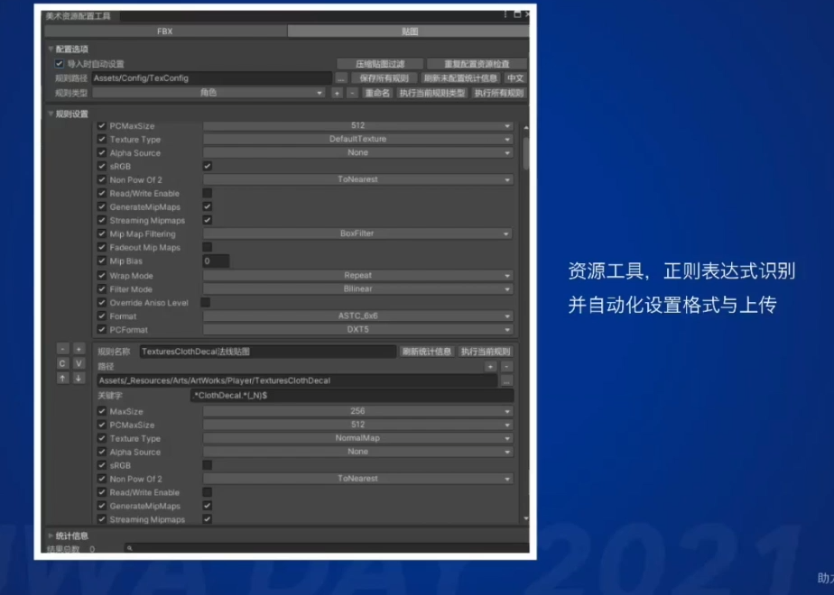

剑侠世界3的优化分享
=================

(Github正常排版: [剑侠世界3的优化分享](https://github.com/HHHHHHHHHHHHHHHHHHHHHCS/MyStudyNote/blob/main/MyUWA2021Note/%E5%89%91%E4%BE%A0%E4%B8%96%E7%95%8C3%E7%9A%84%E4%BC%98%E5%8C%96%E5%88%86%E4%BA%AB.md))

------------------------

- [剑侠世界3的优化分享](#剑侠世界3的优化分享)
	- [**0. 简介**](#0-简介)
		- [**0.1 基础参数**](#01-基础参数)
	- [**1. 场景优化**](#1-场景优化)
		- [**1.1 简介**](#11-简介)
		- [**1.2 场景基础数据(主城)**](#12-场景基础数据主城)
		- [**1.2 静态处理**](#12-静态处理)
		- [**1.3 场景流式加载机制**](#13-场景流式加载机制)
		- [**1.4 序列化场景为数据文件**](#14-序列化场景为数据文件)
		- [**1.5 运行时策略**](#15-运行时策略)
		- [**1.6 面数预算机制**](#16-面数预算机制)
		- [**1.7 动态降级策略(带宽/ALU)**](#17-动态降级策略带宽alu)
		- [**1.8 加速场景切换速度**](#18-加速场景切换速度)
		- [**1.9 取代LODGroup, 独立LOD线程**](#19-取代lodgroup-独立lod线程)
		- [**1.10 光照烘焙&TextureStreaming**](#110-光照烘焙texturestreaming)
		- [**1.11 TextureStreaming**](#111-texturestreaming)
		- [**1.12 PVS遮挡剔除(Potentially visible set)**](#112-pvs遮挡剔除potentially-visible-set)
		- [**1.13 地形&植被**](#113-地形植被)
		- [**1.14 水下地形优化**](#114-水下地形优化)
		- [**1.15 水下地形优化**](#115-水下地形优化)
		- [**1.16 植被相关**](#116-植被相关)
		- [**1.17 总结**](#117-总结)
	- [**2. 体素**](#2-体素)
		- [**2.1 简介**](#21-简介)
	- [**3. 远景优化思路**](#3-远景优化思路)
		- [**3.1 简介**](#31-简介)
	- [**4. 资源相关**](#4-资源相关)
		- [**4.1 简介**](#41-简介)
		- [**4.2 静态资源扫描处理**](#42-静态资源扫描处理)
		- [**4.3 打包原则**](#43-打包原则)
		- [**4.4 AssetBundle管理**](#44-assetbundle管理)
		- [**4.5 增量更新&更新下载**](#45-增量更新更新下载)
		- [**4.6 代码更新策略**](#46-代码更新策略)
	- [**5. 内存相关**](#5-内存相关)
		- [**5.1 简介**](#51-简介)
		- [**5.2 Mono**](#52-mono)
		- [**5.3 资源内存**](#53-资源内存)
		- [**5.4 第三方插件**](#54-第三方插件)
		- [**5.5 RT**](#55-rt)
		- [**5.6 特效粒子内存**](#56-特效粒子内存)
		- [**5.7 Shader lab**](#57-shader-lab)
		- [**5.8 内存泄漏监测**](#58-内存泄漏监测)
	- [**6. 其它**](#6-其它)
		- [**6.1 简介**](#61-简介)
		- [**6.2 角色**](#62-角色)
		- [**6.3 特效**](#63-特效)
		- [**6.4 UI**](#64-ui)
		- [**6.5 Shader/后处理**](#65-shader后处理)
		- [**6.6 功耗**](#66-功耗)
		- [**6.7 机型适配&兼容**](#67-机型适配兼容)

------------------------

&emsp;&emsp; 来自于UWA2021的分享 [视频地址](https://edu.uwa4d.com/course-intro/1/306)

------------------------

## **0. 简介**

### **0.1 基础参数**
  + 引擎: 基于Unity 2019.4.X 源码编译
  + 管线: 基于URP7.X改造
  + 发布平台: Android/IOS/Windows/Mac
  + API: OPENGL ES3.0或以上, Vulkan版本正在制作
  + 内存要求: 2G或者以上
  + 机型: OPPO A5/华为 Mate9/Iphone 6S/以上
  + 分辨率: 移动端最高画质默认960P
  + 包体: 首包1.4G, 完整2.6G, 后台边玩变下, 补充下载

------------------------

## **1. 场景优化**

### **1.1 简介**
  1. 场景静态处理
  2. 场景流式加载机制
  3. 取代LODGroup, 独立LOD线程
  4. 光照烘焙&TextureStreaming
  5. PVS遮挡剔除
  6. 地形&植被
  7. 移动逻辑体素格子
  8. 远景优化思路

### **1.2 场景基础数据(主城)**
  + 主体大小2K, 外围远景4K
  + 总体制作面数2000万面以上(3级LOD, 不包含植被instancing)
  + 4万以上Renderer
  + 50万颗以上植被
  + 手机最高可视距离3.5公里以上
  + 模型Mesh制作3级LOD(按1/0.6/.3面数比例来制作)

### **1.2 静态处理**
  + 会增加打包大小和运行的内存
  + 分层分块分LOD相同材质静态合并Mesh
    + 不同物体分层(远景/地形/植被/建筑框架/地砖/中景/近景/其它)
    + 按区域分块(正常32*32米格子, 但是不同层的分块会不一样)
    + 根据参数, 再细分(是否参与烘焙, 是否投射阴影, 是否接受阴影, 相同材质, 相同LOD数量)
    + 自动合并, 针对特殊物体手动合并(比如说大物件)
  + 不可见面剔除
    + 背面剔除
      + 如 可移动区外
      + 通过法线计算来判断
    + 地下剔除
      + 如 地形以下
      + 通过物理射线检测一个面片上的顶点是否都位于地下
    + 闭合模型重叠面剔除
      + 如 石头堆叠
      + 面片发射射线判断是否击中物体自身, 但是存在误差
  + 带顶点动画物体合并
    + 质心坐标合并到UV3
  + 合并后同步源参数
    + Layer, Tag, ContributeGI, LightmapScale, Shadow Caster...
    + 未参与合并的Renderer保持不变
    + 打组机制, A和B存在子集Renderer被合并, 那么要保持A和B同时显示或隐藏
  + 导出Mesh/Prefab文件供后面使用
    + 提高复用率, 增加合批的概率
  + 资源标记(提前标记)
    + 画质分级
      + 高配加载1/2/3/4 Level, 中配加载1/2/3 Level, 低配加载1/2 Level
    + 是否投射阴影/接受阴影/参与水体反射/水下物件等
    + 第三级LOD光贡献不明显的Renderer提前标记为运行时关闭
    + 其它逻辑标记等

### **1.3 场景流式加载机制**
  + 流式加载需求
    + 内存/打包依赖/增量更新大小/DrawCall/远近区分降级等
  + 基础设定
    + 场景按照画质分级(Level1/2/3/4)
    + 分层标记 (远景/地形/植被/建筑框架/地砖/中景/近景/其它)
    + 每层会限定, 最小最大的加载距离, 最小最大裁剪距离
    + 每层会有一个单独配置, 根据设定物体包围盒大小和评估权重来设定加载, 切换LOD0/1/2的距离
    + 运行时按照距离裁剪掉大部分对画面贡献不大的物件

### **1.4 序列化场景为数据文件**
  + 序列化后场景.unity为空文件
    + 没有Renderer, 只保留一些场景设置类脚本, 灯光, 环境参数等
  + 按物件裁剪距离分3层系列化
    + 减少运行加载数据文件内存占用
    + 裁剪距离在1024以上/512以上/512以下分级打包
      + tile_x_xy.asset,  每个级都会导出多个块的数据文件
    + 预先生成四叉树结构化储存, 分级减少深度, 不同级更新频率不一样
    + 数据量尽量简化, 减少大小
      + 只记录LOD0, position, scale, rotation, tag, layer, lightmapindex等必须还原数据
      + 原始.unity文件大小230MB以上, 系列化后空场景为500K + 10MB系列化分块数据文件

### **1.5 运行时策略**
  + 是用CullingGroup有限加载视距内tile
  + 分帧一部加载卸载资源/对象
    + 严格控制帧耗时
    + 是用只能缓存池(自动收缩)
    + 同时只存在一种LOD, 切换LOD时, 主动unload前一级别的Mesh
    + 必要时才更新(如位置变更, 不同层频率不一样等, 优先更新近处的LOD)
    + 支持边玩边下机制, 资源下载完成之后才加载物体
    + 模板prefab复用机制, 减少GameObject/Component创建开销
  + 按照距离进行切换LOD/裁剪(四叉树用于加快视椎内查找)

### **1.6 面数预算机制**
  + 同屏加载面数过多时, 可以自动裁剪对画面贡献不大的中远景
    + 算法可以使用屏占比
  + 计算频率控制

### **1.7 动态降级策略(带宽/ALU)**
  + 实时阴影范围内
    + directional on + recvshadow on + normal on + lightmapon + shadowmask on
  + 实时阴影发范围~300米
    + directional off + recvshadow off + normal on + lightmap on + shadowmask on
  + 300米以外
    + directional off + recvshadow off + normal off + lightmap on + shadowmask on 
  + 更远距离
    + directional off + recvshadow off + normal off + lightmap off + shadowmask off 
  + 可以烘焙到顶点色
  + 天气/植被等特殊计算部分也找此距离进行降级
  + 增加变体数量, 对SRP Batcher不友好, 具体项目评估

### **1.8 加速场景切换速度**
  + 跨场景传送
    + IPHONE11可控制跨图时间在1秒一下完成进入主城
    + 提前预装加载目标场景, 任务追踪提前加载下一场景, 传送固定CD时预加载
    + 切换场景时, 控制切换功耗时, 超过3秒以上直接进入
      + 跨图仅有限加载目标点周围一定距离
      + 同步方式加载周围地形层, 地砖层, 保证地面正确
      + 其它物件使用异步加载, 跨图读条中不用等待是否加载完成
  + 同场景远距离传送
    + 人为引入传送CD: 3秒, 传送不需要界面遮罩盖住
    + 传送CD中即预加载目标落点资源(方案同上)
    + 打断传送CD后, 自动超时释放

### **1.9 取代LODGroup, 独立LOD线程**
  + 原生LODGroup计算量稍大
  + 原生LODGroup更新频率不可控
  + 不建议大规模是用LODGroup, 可小范围使用, 或者多个Prefab组合为一个LODGroup
  + 是用单独线程来计算, 可控制计算量/频率等
    + 可以用四叉树加快
  + 距离裁剪/屏占比裁剪

### **1.10 光照烘焙&TextureStreaming**
  + Direction烘焙模式 + ShadowMask 间接烘焙 + 实时直接光照
    + 原始场景烘焙贴图张数, 约55张 2048大小贴图lightmap, 共.3 * 55 = 165张
  + 光照贴图分层分区域烘焙
    + 渐进式烘焙下控制: LightmapParameters.bakedLightmapTag
    + 相同Tag会烘焙到一张图内
    + 光照贴图总数会增加, 每张贴图大小分布依赖Tag设置
  + 光照贴图流式加载
    + 使用时加载, 不用时写在, 谢忠中原距离物件不使用dir贴图
    + 节省一半以上原始光照贴图内存
  + 昼夜方案
    + 提取黑夜点光源lightmap与白天差异值存到shadowmask的空闲的gba通道中
    + 白天GI * 弱化系数 + shadowmask.gba * 点光全局强度 * 点光TintColor = 黑夜GI

### **1.11 TextureStreaming**
  + 可以在Editor -> Project Setting -> Quality -> Texture Streaminng 勾选启用
  + 官方介绍文档 [文章地址](https://docs.unity3d.com/2022.1/Documentation/Manual/TextureStreaming.html)
  + 官方API文档 [文章地址](https://docs.unity3d.com/2022.1/Documentation/Manual/TextureStreaming-API.html)
  + 给每个贴图指定不同mipmap减低纹理带宽 [文章地址](https://www.xuanyusong.com/archives/4699)
  + 有效控制贴图内存
    + MaxLevelReduction
      + mipmap最多可以减小几级, unity任何时候都不会加载比这更大的
      + 默认2最大7, 0最清晰 7最模糊
      + 如默认2 则表示只加载2级及其更模糊的Level
    + MemoryBudget
      + 所有纹理设置一个总内存限制, 会自动降低mipmap级别来确保不超出此预算范围
      + 如果加载的超过这个值了, 则会自动降低一些贴图的level
    + 贴图导入设置: mipmap priority
      + 想要角色清晰则可以值配大一点
    + Texture2D.requestedMipmapLevel 
      + 默认加载mipmap等级
      + 如果没有释放mipmap. 是因为Unity有缓存机制, 没有超过Budget则不会释放
    + Texture2D.streamingTextureDiscardUnusedMips
      + 调用这个方法, 可以清空加载mipmap的等级
    + 源码改进requestedMipmapLevel
      + 让其及时生效
    + 打开全部UI角色模糊问题
      + 打开UI时增加内存阈值
      + UICamera StreamingMipmapBias = -2 , 强制让摄像机内的Level添加偏移
      + 或者使用StreamingController进行预加载, 比较麻烦
    +  ASync Upload Buffer Size合理设置
      +  是用最大纹理大小, 避免自动调整缓冲区造成性能影响

### **1.12 PVS遮挡剔除(Potentially visible set)**
  + MMORPG首选PVS方案, 降低运行时开销
  + 参考Unreal实现
    + 自动表示遮挡物/被遮挡物, 减少美术工作量
    + 格栅化生成可见单元(6米\*6米\*8米cell * 2层)
    + 按256*256生成block, Mesh归属block, Mesh拥有Block ID和 Local ID
    + cell与可见距离内meshs进行Physics求交, 采用一点随机算法
    + 导出分块数据文件, bitarray标记可见性
    + 数据精简, 按场景流式加载分层来进行可见性判断
  + 利用Job System加速烘焙时计算
  + 分布式烘焙支持, 12台机器搭建集群
  + 运行时, 流式加载写在数据文件, 多线程中解析数据文件
  + 分帧循环遍历设置Renderer可见性
  + 只对LOD0烘焙, 减少数据量

### **1.13 地形&植被**
  + 使用Terrain转Mesh(Unity原始Terrain比较拉胯)
    + 自动减面转Mesh并且生成多级LOD
    + 256 * 256 为一块,  保持边缘锁定
    + 地形HLOD
    + 工具采集Overdraw指定位置地形应该先渲染还是后渲染
  + 地形全局预混合贴图(适用2K地形场景)
    + 原始地形采样14张贴图: ctrl + 全局AO + (4 diffuse + 4 normal + 4 metallic)
    + 原始地形是用TextureArray2D
    + 全局预混合贴图只需要采样3张(全局diffuse + 全局normal + 全局metallic)
    + 近处是用原始地形(保持精度), 远处降级地形为全局预混合贴图
  + 虚拟贴图VT/RVT优劣
    + 解决大世界内存,采样,带宽的问题
    + 手游上存在一定的风险
      + TBDR架构下缓存的策略
      + Cache Miss
      + Compute Shader的支持
    + 需要评估实力, 项目的预期

### **1.14 水下地形优化**
  + 主城覆盖大面积水, 玩家可潜入水底
  + 按照水深度分割开地形, 水深2米下基本看不到地形
  + 角色在水上时: 水下地形加载为低模并且切换到全局预混合模式
  + 角色进水下时: 水下地形切换为原始地形
  + 角色在水上或水下时, 可针对其他模型进行同样优化或者裁剪
  + 进入水下相机视距可适当缩减

### **1.15 水下地形优化**
  + 主城覆盖大面积水, 玩家可潜入水底
  + 按照水深度分割开地形, 水深2米下基本看不到地形
  + 角色在水上时: 水下地形加载为低模并且切换到全局预混合模式
  + 角色进水下时: 水下地形切换为原始地形
  + 角色在水上或水下时, 可针对其他模型进行同样优化或者裁剪
  + 进入水下相机视距可适当缩减

### **1.16 植被相关**
  + 草, 灌木, 树, 远景公告板
  + 植被制作
    + 3级LOD(插片数量, 草单面材质, 树双面材质)
    + 草顶点计算光照
    + 接受阴影(用屏幕shadowmask软阴影), 接地色(用地形diffuse)
  + 数据文件组织
    + 128*128米为大块, 适配使用DrawIndirect机型(无数量限制, 但是适配机型少一点)
    + 大块内再切割为32*32米小块: 适配使用DrawIntancing机型(有数量限制1023, 适配机型多一点)
    + 上面两个API是不会进行剔除的, 所以需要自己剔除
    + 128大块和32小块均参与PVS烘焙
    + 先进行PVS剔除, 大块+小块
    + 进行块级别的加载距离剔除, 大块+小块
    + 进行块级别的视椎体剔除, 大块+小块
    + 适配DrawIndirect的GPU再进行胆颗粒度的视椎体剔除+Hi-Z遮挡剔除

### **1.17 总结**
  + 流式加载卸载
  + 分画质密度限制, 按距离密度衰减
  + 按距离切换LOD(mesh, shader lod)
  + 支持限定DrawCall数量, 限定绘制植被数量, 避免分布相差过大
    + 需要避免绘制抖动
  + Draw API
    + CommandBuffer.DrawMeshInstanced
    + CommandBuffer.DrawMeshInstancedIndirect
    + Graphics.DrawMeshInstanced
  + Alpha Test OverDraw, Pre Z Pass?
    + 在URP 添加一个Pre Z Pass
    + 不用对全场景做PreZ Pass
    + 只对高模的, 近处LOD0的, Alpha Test 物件/树叶 去计算
    + 低配, shader LOD已经很低了, 不需要做Pre Z Pass
    + 因为Pre-Z存在顶点和带宽的消耗, 还会造成TBDR下的FrameData的增大
  + IndirectDraw在手机平台/模拟器等均存在兼容+性能问题, 建议针对性能测试有提升机型才开启
  + Vulkan下需要再次评估

------------------------

## **2. 体素**

### **2.1 简介**
  + 减少物理使用场合
    + 实时物理计算: 死亡效果
    + 实时物理计算: 场景可破坏物件
  + 场景可移动表面提体素化
    + 数据文件和内存展开, 都要尽量精简压缩, 避免增加包体
    + 联通性等不要使用指针等消耗过多内存的方法, 保持内存的连续性
    + 相似区块合并
  + 远距离寻路配合
    + 近距离用格子联通性
    + 远距离A*打点, 走官道线还是走分支

------------------------

## **3. 远景优化思路**

### **3.1 简介**
  + 公告板
    + 冒名顶替物(Imposter, 生成实时or静态Bake)
    + 单张Billbord
  + 远景模型
    + 背面剔除掉多余三角面
    + 交错摆放营造层次感
  + 天空盒地平面虚影
    + 营造纵深感
  + HLOD
  + 指数高度雾/大气散射/体积渲染
    + 指数高度雾高配启用, 低配用线性雾

------------------------

## **4. 资源相关**

### **4.1 简介**
  + 静态资源扫描处理
  + 打包原则
  + AssetBundle管理
  + 增量更新&后台下载
  + 代码更新策略

### **4.2 静态资源扫描处理**
  + UWA / URP Tools 定期扫描问题处理
  + 导入资源工具自动设置好格式(贴图, FBX, 动画)
  + 材质多余的Keyword清理, 材质多余参数清理
    + 切换shader后还会保留之前的记录
    + 会导致打断合批或者增加依赖

### **4.3 打包原则**
  + 打包策略好坏直接影响运行效率和内存
  + 减少AB数量总数, 限制单个AB大小(1~5MB)
  + 分资源类型, 分大目录, 分场景打包
  + 单个场景按流式加载规则分层分块打包
  + 减少单个AB依赖链的长度, 不允许AB出现循环依赖现象
  + 公共资源单独打爆(被依赖次数大于多少次), 按被依赖次数分级打包
  + 去除运行时,不使用的冗余资源

### **4.4 AssetBundle管理**
  + 自己管理Mainifest, 记录资源依赖与AB反向依赖
  + 按单个资源粒度记录依赖关系, 相同依赖关系公用数据
  + 加载单个资源, 只需加载该资源实际依赖的AB
  + 资源缓存/AB缓存/引用计数/加载依赖链记录
  + 异步分帧加载卸载, 控制帧耗时, 控制帧数加载数量, 读条时候加快
  + 卸载资源, 资源的依赖链AB无任何反向依赖引用存在时候卸载
    + 是用AssetBundle.Unload(true)
    + 可降低UnloadUnused调用频率, 避免卡顿
  + 特殊情况同步加载与异步加载关系处理
  + 新版本 AssetBundle.memoryBudget (TextureStreaming Mipmap Priority)

### **4.5 增量更新&更新下载**
  + 首包内容补全-压缩包一次性下在(老账号)
  + 首包内容补全-边下边玩(新账号)
  + 增量内容更新
  + 华为HMS Network Kit加速下载能力
  + 多线程处理(任务分发/读写文件/下载处理)
  + CDN主备下在速度优先切换

### **4.6 代码更新策略**
  + 紧急问题处理-后台GM命令下发(Lua)
  + 常规更新-Lua
  + 代码Bug修复-Inject Fix
  + 大版本更新-安卓DLL patch(libunity.so, libil2cpp.so)

------------------------

## **5. 内存相关**

### **5.1 简介**
  + Mono
  + 资源
  + 第三方插件
  + RT
  + 特效粒子
  + Shader lab
  + 内存泄漏检测

### **5.2 Mono**
  + 配置表系列二进制格式, 是用精简的数据格式, 比如bool合并为bitset
  + 管理好各类型的缓存(对象池), 避免频繁分配, 同时要做好只能释放策略
  + 容器相关: 字典等可实现自己的uint16索引版本, 注意2倍扩容
  + 字符串: string.Intern, 减少拼接, 类似技能CD的时间进度字符串等均可以预先生成缓存
  + 网络协议序列化/反序列化对象复用
  + 避免每帧或频繁分配的GC
  + 流式加载写在/用到才加载/延迟加载
  + 减少GC.COllect调用频率, 会卡顿, 是用增量式GC
  + 控制在100MB左右

### **5.3 资源内存**
  + 警惕资源冗余多引用的无用部分
  + 同时只加载一级的LOD Mesh
  + 不使用的资源及时释放, 如低配画质不开启发现贴图, 只用加载最后一级别的mipmap
  + 关注大小异常的资源和重复资源, 如一份资源存在两份文件的拷贝
  + 按设备的内存去动态控制加载的资源级别
  + 理解资源格式各种压缩方案的优劣/Project Setting(Mesh optimize, Compress), 相关设置影响
  + 资源泄漏监控, 返回登录界面后的资源内存要与首次进入登录界面保持一致

### **5.4 第三方插件**
  + 音频/视频播放插件, 注意释放
  + Lua, 注意泄漏, 深度扫描过大, 关注key数量过大的table
  + 警惕Native插件BUG, 定期关注升级信息
  + Unity Memory Profiler, XCode的内存Profiler, Android Profiler
  + 安卓内存工具 [文章地址](https://developer.android.com/studio/profile/memory-profiler?hl=zh-cn)

### **5.5 RT**
  + 理解RT格式, UNorm, SRGB, SFloat等, 是否需要深度/模板
  + 临时RT复用/Swap
  + 不同机型不同格式, 一些手机还不支持特定格式的RT
  + 不是用的特性及时关闭, 释放RT
  + 合并Pass处理, 如Uber Post Pass

### **5.6 特效粒子内存**
  + 注意渲染模式为MeshRender的粒子
  + URP不支持IndirectDraw, 会产生大量合批的VBO数据且不回收

### **5.7 Shader lab**
  + 自动化工具跑场景, 采集SVC(不同画质/不同设置/不同天气/不同地图等)
  + 注意multi_compile, shader_feature/使用ShadedrStripper设定/Shader打包后处理等 裁剪掉多余变体
  + 注意URP本身的Shader变体/lit/后处理等, 裁减掉多余的变体, 如果存在引用存到URP配置
  + 同画质下不同的keyword能合并就合并
  + 如果是固定想要的直接使用define的方式
  + 减少shader的种类, 同时对SRP Batch也不友好
  + 减少超级复合材质的情况

### **5.8 内存泄漏监测**
  + 自动化案例监控内存变化曲线
  + 形成历史统计数据
  + 同案例历史数据波动变化大的需要关注当天的提交内容

------------------------

## **6. 其它**

### **6.1 简介**
  + 角色
  + 特效
  + UI
  + Shader/后处理
  + 功耗
  + 机型适配&兼容

### **6.2 角色**
  + CPU蒙皮, 降低GPU开销
    + 因为项目的GPU成为了瓶颈, 所以改用CPU
  + 角色LOD: 高摸 + 低模 + ShaderLOD 2级 + 贴花开关 + 半透转不透 + 动态骨骼开关 + 骨骼优化 + 不同画质下处理方案区别
    + 因为存在好几种情况, 如大规模战场, 所以需要很多的机制来应对
  + 同屏人数: 服务端先顶同屏人数 + 客户端显示模型人数
  + 距离判断: 限定动态骨骼模型总数 + 动画频率控制 + 人物关系优先判断
    + 离人物远用少量的骨骼去控制低模
    + 组队或者好友, 优先显示高摸
  + 剔除模型多余Mesh通道, 合并UV通道
  + 角色自阴影PCF Pass, 拉近才开启
  + 大规模战场同模机制
  + 战斗自适应降级, 如关闭挂件动画
  + 捏脸运行时合并图集, 顶点格式压缩

### **6.3 特效**
  + 特效开销静态资源扫描, 生成报告提示
  + 特效数量限制: 按特效类型/敌对关系 等限制每种类可创建上限
  + 特效LOD: 制作分高低两级别, 按施法距离和画质切换, 近距离先限定高阶特效数量, 远距离按随机比例出现高或低特效
  + 按距离自适应空值特效粒子发射数量
  + 按画质配置不同参数
  + 场景特效, 场景流式加载机制控制裁剪距离

### **6.4 UI**
  + 优先保证主要界面DrawCall数量
  + UI图集智能缓存+先顶缓存总数量
  + 半屏或全屏UI, 关闭场景相机与不需要的Pass
  + 半屏毛玻璃效果界面, 使用一次抓屏模糊, 关闭场景相机
  + 飘字Instancing
  + 小地图等 大图+Mask的方式 改为 Shader里UV位移, 减少Overdraw
  + UI异步加载模式, 减少卡顿点
  + 脚本层优化, 事件回调合并, 延迟触发等

### **6.5 Shader/后处理**
  + 合理使用低精度浮点数
  + 避免精度转换
  + 避免冗余重复计算, 如Object Space 转换到 World Space储存, 然后又要用到 Object Space 又反转换
  + 一些计算可以放入顶点, 甚至低配机一些效果在顶点计算
  + 降低顶点带宽(低配机主要问题)
  + 减少使用反三角函数, smoothstep, fmod等 [文章地址](https://zhuanlan.zhihu.com/p/34629262)
  + 做好Shader计算降级, 采样降级, 半透转不透(距离远近切换)
  + 材质中空白贴图使用宏关闭采样
  + 不使用Pass的feature要及时关闭
  + 减少SetRenderTarget切换, 合理使用LoadStoreAction
  + 适当降低RT分辨率
  + 匹配机型能实施不同开销版本的效果 

### **6.6 功耗**
  + 优化目的为了提升玩家体验, 提高帧率, 降低内存, 减少功耗发热, 提升畅玩时间
  + 功耗采集作为日常自动化工具性能能分析的一个重点
    + 瞬时电流, 电压, 游戏时长
    + 发布版本不采集, 因为各个安卓版本可能不一样
  + 智能降温模式
    + 更多是通过帧率, 毛刺针的数量作为标准, 帧数稳定之后再升级效果
    + 战场降低效果, 拍照提升效果
    + 自适应分辨率
    + 各类配置参数动态降级(如LODBias, 加载物件数, 角色数, 后处理等)

### **6.7 机型适配&兼容**
  + 机型默认画质级别适配: GPU型号, CPU型号, 设备标识
  + 异形机型UI适配, 折叠屏等
  + 不同画质机型兼容, 稳定性测试
  + 机型性能配置: 50+项可配置参数控制性能相关参数
  + 常见问题: RT格式/shader复杂度过高/shader采样数过高/Compute Shader兼容/NaN/无穷大/normalize(0)/深度异常
  + GPU驱动问题: 识别驱动版本绕过
  + 模拟器兼容问题: 识别出模拟器并做特殊处理
  + 机型内存适配: 动态更改内存相关参数,如Streaming配置等
  + 引擎BUG: 保持与Unity官方一月一次的沟通