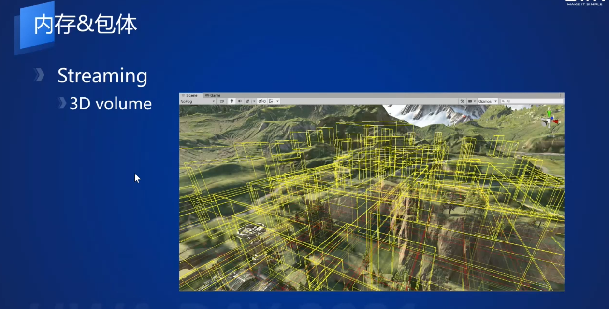
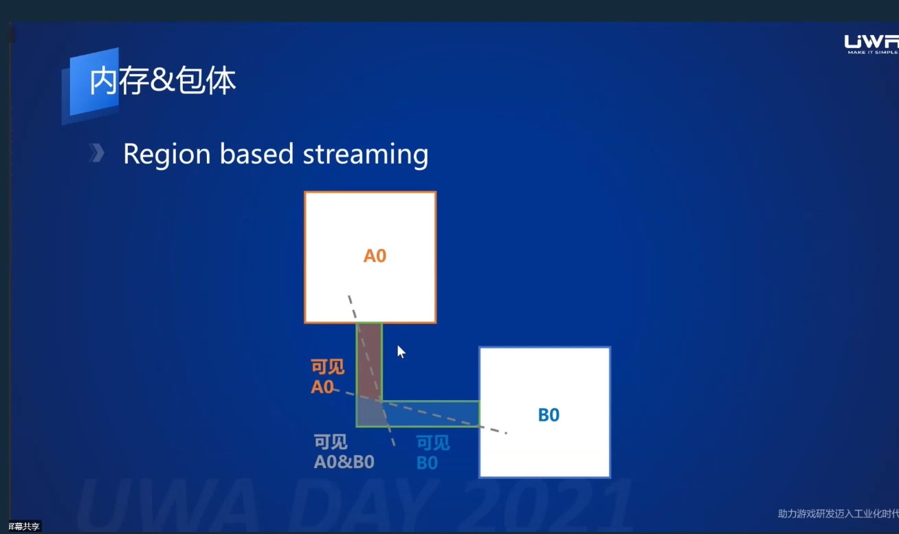

大世界手游开发-基于Unity引擎的大世界场景解决方案
=================

(Github正常排版: [大世界手游开发-基于Unity引擎的大世界场景解决方案](https://github.com/HHHHHHHHHHHHHHHHHHHHHCS/MyStudyNote/blob/main/MyUWA2021Note/%E5%A4%A7%E4%B8%96%E7%95%8C%E6%89%8B%E6%B8%B8%E5%BC%80%E5%8F%91-%E5%9F%BA%E4%BA%8EUnity%E5%BC%95%E6%93%8E%E7%9A%84%E5%A4%A7%E4%B8%96%E7%95%8C%E5%9C%BA%E6%99%AF%E8%A7%A3%E5%86%B3%E6%96%B9%E6%A1%88.md))

------------------------

- [大世界手游开发-基于Unity引擎的大世界场景解决方案](#大世界手游开发-基于unity引擎的大世界场景解决方案)
	- [**0. 大规模物体渲染**](#0-大规模物体渲染)
		- [**0.1 ECS**](#01-ecs)
		- [**0.2 管理**](#02-管理)
		- [**0.3 加载**](#03-加载)
		- [**0.4 卸载**](#04-卸载)
		- [**0.5 Batch**](#05-batch)
		- [**0.6 植被**](#06-植被)
	- [**1. 内存和包体**](#1-内存和包体)
		- [**1.1 自适应分层**](#11-自适应分层)
		- [**1.2 遮挡**](#12-遮挡)
		- [**1.3 打包**](#13-打包)
		- [**1.4 Streaming框架**](#14-streaming框架)
	- [**2. LOD资源管理**](#2-lod资源管理)
		- [**2.1 规则制定**](#21-规则制定)
		- [**2.2 动态LOD**](#22-动态lod)
		- [**2.3 LOD制作**](#23-lod制作)
	- [**3. 远景方案**](#3-远景方案)
		- [**3.1 HLOD**](#31-hlod)
		- [**3.2 HLOD In ECS**](#32-hlod-in-ecs)
		- [**3.3 纹理复用**](#33-纹理复用)
		- [**3.4 剔除**](#34-剔除)
	- [**4. Shadow**](#4-shadow)
		- [**3.1 Shadow**](#31-shadow)
		- [**3.2 SST**](#32-sst)

------------------------

&emsp;&emsp; 来自于UWA2021的分享, [视频地址](https://edu.uwa4d.com/course-intro/1/309)

------------------------

## **0. 大规模物体渲染**

### **0.1 ECS**
  + [Unity 2018 ECS的分享](https://www.youtube.com/watch?v=9MuC3Kp6OBU)
  + AOS(array of struct) 转换成了 SOA(struct of array)
  + 把相同的数据类型紧密的放在一起, 访问数据类型更友好
  + Shared Component Manager, 通常是 Mesh 之类的

### **0.2 管理**

  + 传统模式
    + Editor下用GameObjects
    + 然后使用Scene去管理GameOjects
    + 运行时, 加载Scene的GameObjets 合并到主场景
    + (其实还有一种方式)--------
    + Editor下 Scene管理GameObject
    + 利用工具把整个场景的物体用一个GameObject包裹住成一个Prefab
    + 加载的时候不用切换场景, 只用加载Prefab就好了
  + ECS
    + Editor下用GameObject, 然后在利用Convert ECS 转换成 Entities/Components
    + 再把这些转换后的Entities/Components保存成SubScenes 
      + 即把地图的组件分块保存
    + 运行时, 加载SubScene其中的Entities/Components, 合并到当前场景

### **0.3 加载**
  + 一个主场景和一堆空的场景
  + 发起加载请求, 加载 Shadred Components 和 Enities
  + 反序列成ECS Data
  + 然后把场景的数据移动到主场景
  + Move的时候, 把指针改了一个指向, 性能不错

### **0.4 卸载**
  + 每一个Chunk(Compoents)都有Shadred Component 的 Scene GUID
  + 根据 Scene GUID 去卸载

### **0.5 Batch**
  + 基本的需要Draw Instances(batch)
    + RenderMesh(mesh/material)
    + LocalToWorld
  + batch合批过程
    + 每生成一个SubScene调用FrozenRenderSceneTag(SceneGUID) 返回一个Tag
    + 如果这Tag, 判断是否在上一帧的FrozenRenderSceneTags存在
      + 如果存在, 则从现在的batches先进行移除
    + 找到这个Tag所有关联的 ArchetypeChunks
    + 再根据RenderMesh排序生成Batch
    + 但是每一个Mesh的SubScene GUID不同, 不能batch在一起 
  + 优化
    + 生成一个DynamicRenderMeshTag
      + 其值为RenderMesh.GetHashCode()
      + 把FrozenRenderSceneTags 替换成 DynamicRenderMeshTag
      + 这样就不用根据SubScene GUID来再区分了, 而是根据RenderMesh的种类
    + Remove batches耗时高
      + 因为Remove的时候还会再遍历判断一次Tag相等, 时间复杂度(N)
      + 优化: 在加入Batch的时候同时记录它加入的位置, Remove的时候可以快速移除
    + Add new Batches for Tags 耗时高
      + 因为会Copy LocalToWorld Buffer 到BatchRenderGroup
        + 但是渲染的时候, Cull完成之后, 把需要的Buffer再从这个Buffer中挑出来, 发生再次拷贝
      + 优化(需要改引擎源码):
        + 改成用指针, ECS Chunk的时候用指针
        + 当真正Culling完成之后, 才进行拷贝
    + 优化完成之后
      + DrawCall: 558 -> 348
      + SetPass: 193 -> 157
      + CPU: 5.8ms -> 5.3ms
    + 更多:
      + 原生的ECS代码还是存在优化点
      + 可以去掉更多的GameObject, 用Streaming接入到ECS
        + 碰撞体换成ECS, 灯光, 音效等

### **0.6 植被**
  + HIMMR(Hierarchical Instance Mesh Render)
    + 用BVH + Instance Range 管理
    + 非叶子节点: range + bounds
    + 当需要culling的时候, 从上到下遍历 bounds
    + 最后找到要绘制的物体
   + 提交渲染的时候, Instance Data是连续的, 这时候可以连续拷贝, 提升性能

-----------------

## **1. 内存和包体**

### **1.1 自适应分层**
  + 九宫格存在的问题:
    + 当大山的显示距离是250米, 草的显示距离是50米
    + 这时候把大山的地形块加载进来, 同时也会显示草
    + 用2D划分
  + 自适应分层:
    + 不同的物体加入到Layer
    + Layer组成Layers在地图的块中
    + 用3D Volume划分
    + 存在NearLoadDistance, FarLoadDistance 和 UnloadBias
      + UnloadBias防止人物反复横跳的时候, 出现反复加载卸载
    + 是用ECS+JobSystem, 判定的时候性能消耗不会很高

### **1.2 遮挡**
  + 发生遮挡的时候, 可以不去加载另外一个地图块
  + 添加一个场景触发器(需要做早起做场景规划的时候确认)
    + 掉线和传送难处理
  + 解决掉线传送:
    + 出现一个Connection(圆形A-B)区域, 当传送到Region(如实线A)的时候加载关联的Connection
    + 传送到Connection的时候, 加载相关联的Region
    + 当Connection的Region都被卸载的时候, 卸载自身
    + Connection区域可以是一个多边形的

### **1.3 打包**
  + 如果做成.unity/.prefab
    + Block内无法加载优先级, 比如优先加载对画面更大的东西
    + 不方便做手机高中低配管理
    + 文件数量过多
      + 2K地图64m一个格子 32*32 = 1024 blocks
      + 距离分层[10, 32, 52, 72, 105, 152, 256, 512, 1024] * 1024个物件Layer = 9216 Layers
      + 每个Layer都有ECS数据(.bin + .asset) 还有额外产生 18342个文件
  + Layers做成StreamingAsset
    + 包括的物体: ECS, HIMR, Collision, Prefab(骨骼/特效用,ECS无法实现), SST, EnvReflection, Audio, Light...
    + 打包成 Soft Asset 和 SoftBianary
      + Soft Asset 是对 Unity Assets的引用, 无法合并到block中
      + 许多SoftBianary合成Block Files
      + Block Files, 因为需要更新Patch, 所以不会合成一个非常大, 还是根据场景64x64划分
      + SoftBianary,  根据需要去读取Block File中的某个块(起点+长度), 进行实例化
    + string path 改成 hash id
    + 本身Soft Asset/SoftBianary占用很低, 实例化占用才是大头
  + StreamAssets
    + 加载优先级, 根据画面贡献权重去加载
    + Quality Level, 手机分级
    + Dynamic Load, 位面/动态场景去加载
  + Block File
    + 文件数量可控
    + 省去了prefab和ECS的.asset已经各种子系统可能需要的文件

### **1.4 Streaming框架**
  + 是对上面的总结
  + 资源自描述加载距离
  + 统一的序列化管理
  + 可以扩展系统
  + 可以配合逻辑分区

-----------------

## **2. LOD资源管理**

### **2.1 规则制定**
  + 老版本: 制定整数/区间来规定LOD的面数和距离
    + 存在问题: 需要手动填且填的随心所以不一定符合规范
  + 新版本: 屏幕空间面数密度
    + 原理跟纹理密度有点像, 单位屏幕空间内有多少面数
    + 假设面数太高会, 会浪费了顶点计算
    + 面数太低, 则显示效果不太好, 只有简单的轮廓
    + 得到公式: 同一类型模型 K值 = 面数 * (切换距离)^2
      + 去手动配置K值, 或者如果美术的LOD模型已经做好可以反推K值
    + 可以解决人工手调距离, 现在只用调整k值就好了
    + 方便排查, 很远的物体面数过多, 则会提示k值过高

### **2.2 动态LOD**
  + 之前是根据距离定死了LOD的现实
  + 新的: 
    + 在一定的观测点下
    + 满足DrawCall约束的前提下, 去挑选减少面数总量最高进行LOD
    + 循环添加LOD模型, 直到满足面数要求
    + 观测点可以根据游戏的NavMesh进行生成, 如果存在自由度过高, 可以添加采样点范围
  + 特别大的建筑做LOD的性价比可能比较低
    + 面数非常多, 做多次LOD, 占用非常大
    + 不如把数量非常多的小物件多做几次LOD来的收益高

### **2.3 LOD制作**
  + 为什么需要美术来做?
  + Simplygon自动减面工具
    + 最多生成6级别的LOD, 可以配合贪心原则
    + 优点:
      + LOD跳变可控, 自动达到指定的规范
      + LOD规格随意切换, 配合上面的K值可以迅速生成
      + 迅速迭代, 美术只做LOD0就可以生成其它的LOD
    + 缺点:
      + 自动生成的效果和面数分配比 不如美术手工减面
  + LOD Pipeline
    + 要效果: 美术做全部的LOD, 自动生成LOD距离, 贪心挑选LOD
    + 要效率: 美术做LOD0, 根据距离配置生成LODn, 贪心挑选LOD
    + (其实现在的美术软件自动减面都很强, 一个命令行就能生成)

------------------------

## **3. 远景方案**

### **3.1 HLOD**
  + Hierarchical Loevel of Detail
  + 解决200-1km的视距
    + 把远处的一匹模型合成一个mesh, 从而减少drawcall和面数
    + 比如塔插入山中两个drawcall合批成一个, 底下的塔面数也可以相应减去
  + 使用houdini减面并且烘焙贴图
    + Base Color
    + AO
    + Normal
    + Metallic
    + Roughness
  + shader 相同, 所以也没有什么大关系
  + 父子关系

### **3.2 HLOD In ECS**
  + 用ECS性能会比较高
  + LoadRequirement
    + RefPos: self reference point
    + MinDist: minimum distance
    + MaxDist: 无穷大 / maximum distannce
  + RootLodRequirement
    + RefPos: parent reference point
    + MinDist: 0
    + MaxDist: parent minimum distance / 无穷大
  + LOD显示条件:
    + LodRequirement.Min < CamDist < LodRequirement.Max
    + RootLodRequirement.Min < CamDist < RootLodReuirement.Max
  + 如下图所示:
    + 左: 近处的时候没有合批
    + 中: 开始小范围合批
    + 右: 整个合批

### **3.3 纹理复用**
  + HLOD会有很多重复的贴图可以进行复用
  + 原则:
    + Mesh Material相同
    + 缩放尺寸比例相同
      + 因为贴图的尺寸分布是根据物在世界空间的展开来给予的
      + 如果A大B小 和 A小B大, 最会出现贴图分布一样
    + 旋转关系
      + 因为一些效果需要跟世界空间的Normal进行混合
      + bake之后, 再运用到不同旋转的物体, 效果就会错误
  + 复用率: 20%~30%
  + 进一步: 如右边三个大多数相同, 则可以求一个并集

### **3.4 剔除**
  + 基于Bounds剔除
    + 比如物体很小又很远则可以剔除
  + 基于NavMesh可见性剔除
    + 剔除所有观测点不可见的问题
    + 比如: 地图起伏遮挡, 剔除在山谷和背面的物体
  + 效果:
    + 刻意提高视角来观察, 视角低的时候, 同时使用Hi-Z剔除
    + 无HLOD: 185 DrawCall 19万面
    + 有HLOD: 265 DrawCall 29万面
    + 这样远处就有丰富的细节了

------------------------

## **4. Shadow**

### **3.1 Shadow**
  + 近处用CSM, 3个级别150米
  + 远处用SST(Sparse Shadow Tree), 1KM阴影范围

### **3.2 SST**
  + [SST](https://blog.csdn.net/toughbro/article/details/7941821)
  + [几个AAA游戏中的阴影技术](https://research.activision.com/publications/archives/sparse-shadow-trees)
  + 做法:
    + 用一个四叉树去压缩离线生成的shadowmap
      + 生成Shadowmap, 构建点云, 再用平面拟合
      + 用平面公式去拟合, 算出方差
      + 点到平面的距离 最大值 - 最小值, 如果大于阈值继续拆分拟合, 直到最小4x4
    + runtime再进行解码, decode到CSM的2~3级别
  + 编码:
    + Parent node: 2bit control code. 剩下是指向下一个位置的indices, 下一个块在struct buffer的偏移
    + 62-bit node: 因为需要ABC三个值, 论文是C值要求更高所以30bit, AB分别是16
    + 32-bit node: 但是实测下来ABC分别为10bit也完全够用
    + 当无法匹配平面的时候, 压缩到Uint32*5
      + Z = relativeZ * scale + offset
    + 更激进k-means分两个聚类
      + 16bit标记聚类
      + 每16bit表示其中一个聚类深度, 共两个
  + 解决占用过大的问题, 同时又有大范围高精度
  + 2K*2K地图
    + 1KM阴影现实范围
    + 5MB内存
    + 如下图, 远处有阴影

