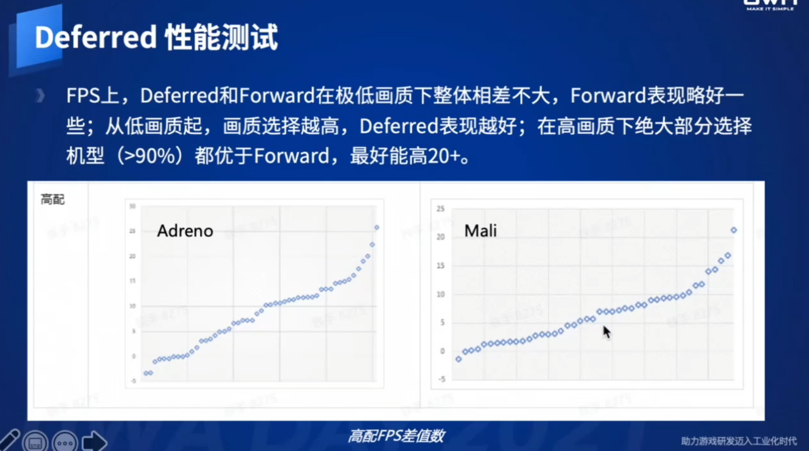
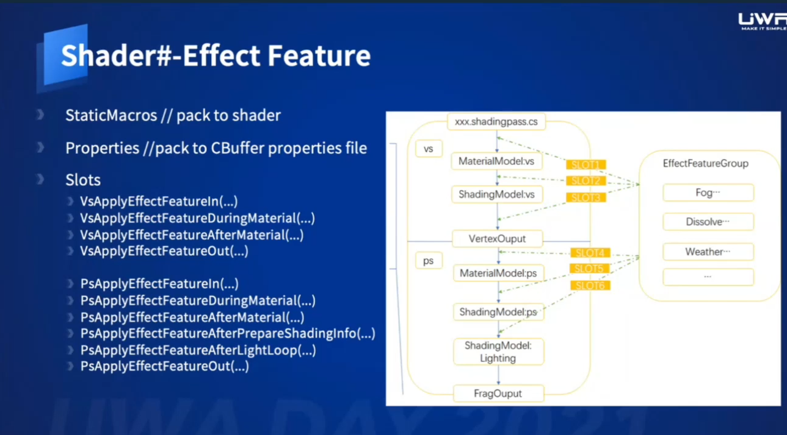

延迟渲染管线手游技术解决方案
=================

(Github正常排版: [延迟渲染管线手游技术解决方案](https://github.com/HHHHHHHHHHHHHHHHHHHHHCS/MyStudyNote/blob/main/MyUWA2021Note/%E5%BB%B6%E8%BF%9F%E6%B8%B2%E6%9F%93%E7%AE%A1%E7%BA%BF%E6%89%8B%E6%B8%B8%E6%8A%80%E6%9C%AF%E8%A7%A3%E5%86%B3%E6%96%B9%E6%A1%88.md))

------------------------

- [延迟渲染管线手游技术解决方案](#延迟渲染管线手游技术解决方案)
	- [**0. 手游的延迟渲染管线**](#0-手游的延迟渲染管线)
		- [**0.1 Deferred Rendering**](#01-deferred-rendering)
		- [**0.2 移动端**](#02-移动端)
	- [**2. 渲染技术**](#2-渲染技术)
		- [**2.1 Shader#**](#21-shader)
		- [**2.2 光照剔除**](#22-光照剔除)
		- [**2.3 性能**](#23-性能)
		- [**2.4 Defferd 效果**](#24-defferd-效果)
	- [**3. Shader#**](#3-shader)
		- [**3.1 传统Unity Shader弊端**](#31-传统unity-shader弊端)
		- [**3.2 模块组件**](#32-模块组件)

------------------------

&emsp;&emsp; 来自于UWA2021的分享, [视频地址](https://edu.uwa4d.com/course-intro/1/297)

------------------------

## **0. 手游的延迟渲染管线**

### **0.1 Deferred Rendering**
  + Forward vs Deferred (知乎都有, 跳过)
  + 降低光照计算复杂度, 有效减少Lighting的OverDraw
  + GBuffer可以给别Pass提供数据, 增加渲染质量(SSAO等)

### **0.2 移动端**
  + Tiled特性 (知乎都有, 跳过)
  + One Pass Deferred(metal 和 vulkan)
    + Unity支持
  + Frame Buffer Fetch Deferred (安卓的高通)
    + Frame Buffer Fetch Color 写法支持
    + Frame Buffer Fetch Depth 写法不支持
  + Pixel Local Storange Deferrred (安卓的Mali)
    + Pixel Local Storage 写法不支持
    + Mali额外在GBuffer存了Depth信息
    + 因为同时读PLS和FrameBufferFetchDepth过慢
  + HSR (苹果)
    + 跟渲染数据无关
    + 0 OverDraw(AlphaTest等打断HSR除外)
    + AlphaTest 会打断HSR
  + FPK(Mali), LRZ(Anreno), 跟HSR相似
    + 不透明物体排序(非AlphaTest)没有太大的意义
  + 有了这套剔除技术是不是可以不用延迟了?
    + 并不是, 因为存在不一定完美剔除
    + 而且转到延迟渲染可能还会有优化
  + 问题:
    + 多平台的Deferred兼容性(pc, IOS, Android, Mali)
    + 不同管线的兼容性(低配Forward, 高配Deferred, 且适配移动端特性)
    + Unity特定平台Shader语法的问题
      + 缺失部分One Pass. Frame Buffer Fetch
      + 不支持Pixel Local Storage写法
    + Deferred VS Forward 性能比较
      + 需要最后看消耗, 不同平台差异可能大
      + 需要看使用场景, 适用于多光源

-----------------

## **2. 渲染技术**

### **2.1 Shader#**
  + 用C# 用来组织, 管理, 生成Shader的框架
  + C#继承, 派生等面向对象语言能力, 简化代码解决冗余
  + 提供Shader FrameWork, 材质模式, 光照模型, 各种特殊以组件习惯是开发和归档.
  + 结构清晰, 便于开发和维护
  + 引擎监视特殊后缀(*.shader.cs, *.hlsl.cs)的文件, 实时转译成ShaderLab文件
  + 解决用一份Shader支持所有平台, 同时解决Unity不支持写Frame Buffer Fetch Depth 和 Pixel Local Storage Deferred
  + 解决变体过多

### **2.2 光照剔除**
  + Clustered Deferred Rendering
    + (知乎都有, 跳过)
  + Light Volume
    + 如果Stencil > 1, 在Volume里面
    + 如果Stencil > 1, 存在重叠
    + 如果同屏32光和7个shading model, 32*7=224 Draw Call, Draw爆炸
    + 改进:采用物体Instance来绘制
      + 第一次绘制Addition Light(7 Draw Call)
      + 第二次绘制Direct Light + Indirect Light + Emission(7 Draw Call)
      + 存在问题: Light Volume重叠
      + 如果stencil>0, 则不能确定哪个light Volumes真实有效
      + 需要在Shader里面跟包围盒再剔除一次
  + Clustered VS Light Volume
    + Clustered剔除结果是一个格子一个格子
    + Light Volume剔除结果更加准确, GPU好是相对减少, 区别不打
    + Clustered 目前只支持32盏灯
    + Light VOlume 支持大量多光源, Instance绘制后光源不受Draw Call限制
    + 会占用Stencil. 假设某个像素最多不超过7盏灯, Stencil则只占用3bit

### **2.3 性能**
  + 大多数设备Defferd性能高于Forward, 尤其是高配手机
  + 图二X轴是性能越来强, Y轴是Defderred FPS - Forward FPS

### **2.4 Defferd 效果**
  + Screen Space Shadow Mask
  + Screen Space AO
  + Defered Decals
    + Forward:
      + 支持Box投影
      + 无法拿到发现信息, 无法做出正确的光照效果
      + Shading 存在Overdraw
    + Deferred Decals
      + 支持Box投影
      + 可以通过GBuffer拿到Normal,PBR参数等
      + 没有Overdraw

-----------------

## **3. Shader#**

### **3.1 传统Unity Shader弊端**
  + 结构复杂, 添加一个功能需要修改大量的问题件
  + 代码冗余, Shader里面各种重复代码
  + 代码难以复用, 多管闲事难以切换管理
  + 代码难一维护, 代码结构混乱, 增删功能需要修改大量文件
  + HLSL本身的局限性
    + 不支持抽象
    + 不支持继承
    + 不支持跳转(最新Rider支持, 但不完善)

### **3.2 模块组件**
  + Shader
    + 包含多个Sub Shader, 各个Sub Shader由组件组成
  + Material Model
    + 不同刚才孩子有不同材质的末模板
  + Shading Model
    + 不同的Shader, 光照模型可以复用
    + 需要定义VS和PS阶段光照, 因为可能在VS做光照也可能在PS阶段做
    + 拆分主光和其他光的计算, 主光可能有更多更好的光照计算
  + Shading Pass
    + 跟管线相关, 如:Forward, Deferred, PreZ Pass
    + EncodeGbuffer, DecodeGbuffer, EncodeMicroGbuffer, DecodeMicroGbuffer
  + Effect Feature
    + 贯穿整个Shading Pass的组件, 如Fog, Dissolve等组件
    + 可以在Shader的各个阶段插入EffectFeatureGroup
  + 其他
    + 使用Stencil Mask
      + 用Stencil, 编码3bit在ShadingModel, 5bit在Material Mask
      + 在GbufferPass, 会根据屏幕区域的Stenicl, 分别来执行相应的Stencil Pass
      + 如有7个SadingModel, 会绘制7次全屏来执行计算
    + 开发团队只有一两个人, 且不公开

