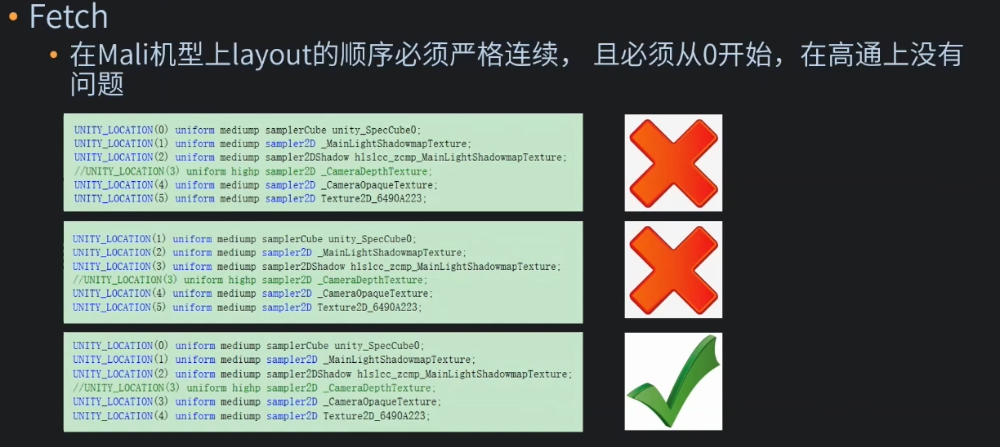

UWA其它
======

(Github正常排版: [UWA其它][1])

-----------------

因为知识点比较少, 要么都是以前说过的, 就索性合成一篇文章.

括号()内的话都是我自己想的.

-----------------

<!-- @import "[TOC]" {cmd="toc" depthFrom=1 depthTo=6 orderedList=false} -->

<!-- code_chunk_output -->

- [**1. Unity移动游戏性能优化案例分析**](#-1-unity移动游戏性能优化案例分析-)
  - [**1.1 URP**](#-11-urp-)
    - [**1.1.1 使用URP的项目占比?**](#-111-使用urp的项目占比-)
    - [**1.1.2 RenderPipelineManager.DoRenderLoop_Internal消耗**](#-112-renderpipelinemanagerdorenderloop_internal消耗-)
    - [**1.1.3 SRP Batcher会失效**](#-113-srp-batcher会失效-)
    - [**1.1.4 OverDraw**](#-114-overdraw-)
    - [**1.1.5 Renderer Feature**](#-115-renderer-feature-)
  - [**1.2 Custom Bloom**](#-12-custom-bloom-)
  - [**1.3 带宽**](#-13-带宽-)
  - [**1.4 Shader**](#-14-shader-)
  - [**1.5 Spine**](#-15-spine-)
  - [**1.6 TextMeshPro**](#-16-textmeshpro-)
- [**2. SLG手游的制作和优化**](#-2-slg手游的制作和优化-)
  - [**2.1. 地形高度图压缩**](#-21-地形高度图压缩-)
  - [**2.2 河道和峡谷的处理**](#-22-河道和峡谷的处理-)
  - [**2.3. 地形抹平**](#-23-地形抹平-)
  - [**2.4. RVT**](#-24-rvt-)
  - [**2.5. 水体**](#-25-水体-)
  - [**2.6. ShadowMap**](#-26-shadowmap-)
  - [**2.7. 多光源**](#-27-多光源-)
  - [**2.8. 粒子系统**](#-28-粒子系统-)
  - [**2.9. 运行时带宽压缩**](#-29-运行时带宽压缩-)
  - [**2.10. 发热**](#-210-发热-)
- [**3. 《玄中记》手游的CPU性能优化**](#-3-玄中记手游的cpu性能优化-)
  - [**3.1. Shader加载和编译优化**](#-31-shader加载和编译优化-)
  - [**3.2. DrawCall优化**](#-32-drawcall优化-)
  - [**3.3. 代码模块耗时优化**](#-33-代码模块耗时优化-)
  - [**3.4. UI模块耗时优化**](#-34-ui模块耗时优化-)
  - [**3.5. 动画模块耗时优化**](#-35-动画模块耗时优化-)
  - [**3.6. 物理模块耗时优化**](#-36-物理模块耗时优化-)
  - [**3.7. (声音)**](#-37-声音-)
- [**4. 《永劫无间》战斗系统开发经验分享**](#-4-永劫无间战斗系统开发经验分享-)
  - [**4.1. 动作系统**](#-41-动作系统-)
  - [**4.2. 英雄系统**](#-42-英雄系统-)
  - [**4.3. AI系统**](#-43-ai系统-)
  - [**4.4. 角色Tick优化**](#-44-角色tick优化-)
  - [**4.5. 加载优化**](#-45-加载优化-)
- [**5. 引擎与TA中台的工业化实践**](#-5-引擎与ta中台的工业化实践-)
  - [**5.1. 技术共享**](#-51-技术共享-)
  - [**5.2. 开发效率**](#-52-开发效率-)
  - [**5.3. 模块化场景**](#-53-模块化场景-)
  - [**5.4 内存拷贝**](#-54-内存拷贝-)
  - [**5.5 Shader填充**](#-55-shader填充-)
  - [**5.6 遮挡剔除**](#-56-遮挡剔除-)
- [**5.7. LookDev**](#-57-lookdev-)
- [**5.8. 标准**](#-58-标准-)
- [**5.8. Asset Processor**](#-58-asset-processor-)
- [**5.9. Asset Flows**](#-59-asset-flows-)
- [**5.10. 局部PCG**](#-510-局部pcg-)
- [**5.11. 场景编辑器**](#-511-场景编辑器-)

<!-- /code_chunk_output -->

-----------------

## **1. Unity移动游戏性能优化案例分析**
  [视频地址][2]

### **1.1 URP**
  
#### **1.1.1 使用URP的项目占比?**
  + 2021 Q4 37%
  + 2022 Q1 42%
  + 2022 Q2 49%
  + 2022 Q3 54% 

#### **1.1.2 RenderPipelineManager.DoRenderLoop_Internal消耗**
  + 本身消耗
  + GPU压力影响
  + 相机数量影响

函数消耗没有特别集中的点.


GPU压力. 分辨率降低RenderLoop耗时明显降低.

|OPPO R17|2340x1080 (1.0)|1872x864 (0.8)|1170x540 (0.5)|
|-|-|-|-|
|Renderloop耗时均值(ms)|8.75|6.76|3.55|
|FPS|23.05|34.84|58.97|
|GfxWaitForPresent (ms)|17.49|9.29|4.84|

相机数量影响. 这里的相机什么都没有绘制, 但是还是存在一定的消耗, 所以关闭/减少无效的相机, 尽量合并相机.

|OPPO R17|1170x540(0个)|1170x540(1个)|1170x540(2个)|1170x540(3个)|
|-|-|-|-|-|
|Renderloop耗时均值(ms)|3.55|6.15|7.54|9.11|
|FPS|58.97|56.91|52.42|46.84|

#### **1.1.3 SRP Batcher会失效**

1. 特定的几个版本OpenGL下 SRP Batch会失效.


2. MaterialPropertyBlock(MPB)和SRP Batcher不兼容.

3. 多灯光对粒子系统合批的影响.

  不同粒子受到的灯光不同就会不能Batch. 

  因为特效经常不受灯光影响. 所以可以把粒子系统的Layer标记成FX, 灯光的Culling Mask取消勾选FX层.

  但是这种改法在不同版本中生效的情况不一样.


#### **1.1.4 OverDraw**

  原来的OverDraw方法会失效, 所以用了一套新的方案代替. [代码仓库][3]

  然后自己再写一个Compute Shader, 对全屏Over DrawRT做累加, 除以像素数量, 得到平均值.


#### **1.1.5 Renderer Feature**
  注意Renderer Feature在多个相机上会产生效果, 所以会产生无用的开销. 
  
  如果一些相机不要这些效果, 可以创建空的Renderer, 为相机指定Render.

  (其实也可以根据CameraName CameraTag来直接return.)


  还有比如说只有选中的时候才出现描边, 正常的情况下不用. 那么就可以做成动态开关.

  (他是通过反射去获取的. 其实也没有必要, 直接加一个static bool之类的都可以.)


```CSharp

public static class ScriptableRendererExtension
{
    private static readonly Dictionary<ScriptableRenderer, Dictionary<string, ScriptableRendererFeature>> s_renderFeatures = new Dictionary<ScriptableRenderer, Dictionary<string, ScriptableRendererFeature>>();

    public static ScriptableRendererFeature GetRendererFeature(this ScriptableRenderer renderer, string name)
    {
        if (!s_renderFeatures.TryGetValue(renderer, out var innerFeatures))
        {
            var propertyInfo = renderer.GetType().GetProperty("rendererFeatures", BindingFlags.Instance | BindingFlags.NonPublic);
            List<ScriptableRendererFeature> rendererFeatures = (List<ScriptableRendererFeature>)propertyInfo?.GetValue(renderer);
            if (rendererFeatures == null)
            {
                s_renderFeatures[renderer] = null;
            }
            else
            {
                innerFeatures = new Dictionary<string, ScriptableRendererFeature>();
                for (var i = 0; i < rendererFeatures.Count; i++)
                {
                    var feature = rendererFeatures[i];
                    innerFeatures[feature.name] = feature;
                }
                s_renderFeatures[renderer] = innerFeatures;
            }
        }
        if (innerFeatures != null)
        {
            innerFeatures.TryGetValue(name, out var result);
            return result;
        }
        return null;
    }
}

```

```CSharp

public void SwitchSSAO(bool active)
{
    var data = Camera.main.GetUniversalAdditionalCameraData();
    var feature = data.scriptableRenderer.GetRendererFeature("NewScreenSpaceAmbientOcclusion");
    feature.SetActive(active);
}

```

### **1.2 Custom Bloom**

  想要不同特效Bloom效果不一样. 其实就是利用MRT(Color RT + Mask RT)去绘制特效. 

  

  判断是否是MRT就是**RenderingUtils.IsMRT(renderPass.colorAttachments)**.

  然后就是C# 设置MRT, Shader那边修改SV_Target为MRT. C# 记得Clear RT Color.

  Mask记录当前特效自定义的Bloom的Threshold. 剔除过低Alpha的像素. Blend Mode记得改成MRT的.

  然后替换Bloom Shader中的threshold的值. 他这里Mask为1 则为volume的threshold.

  但是有个缺点, 因为需要修改MRode的Blend Mode, 所以需要OpenGLES 3.2. 比如说小米4X直接不渲染, 5XBlend Mode 没有修改成功, OPPO R17则修改成功.

```CSharp
internal static bool IsMRT(RTHandle[] colorBuffers)
{
    return GetValidColorBufferCount(colorBuffers) > 1;
}

internal static uint GetValidColorBufferCount(RTHandle[] colorBuffers)
{
    uint nonNullColorBuffers = 0;
    if (colorBuffers != null)
    {
        foreach (var identifier in colorBuffers)
        {
            if (identifier != null && identifier.nameID != 0)
                ++nonNullColorBuffers;
        }
    }
    return nonNullColorBuffers;
}
```


### **1.3 带宽**

  Copy Depth Pass, 会增加很高的带宽. 因为会切换RT. 增加了一次RAM到RAM的拷贝. 使得所有的Tile多了一次Load和Store.


  改进就是使用FramebufferFetch. 比如说: GL_ARM_shader_framebuffer_fetch_depth_stencil.

下面是OpenGL Depth版本, 可能要把Unity的ShaderLab改成GLSL.

```C++
#ifdef FRAGMENT
#version 320 es
#extension GL_ARM_shader_framebuffer_fetch_depth_stencil : enable

#ifdef GL_EXT_shader_texture_lod
#extension GL_EXT_shader_texture_lod : enable
#endif

#endif
```

原本获取Depth是通过纹理采样的方式: float depth = texture(_CameraDepthTexture, uv.xy).x;

可以更改为: loat depth = gl_LastFragDepthARM:

Fetch Depth优化效果, 小米10S 90FPS 2340x1080

| |Copy Depth|Fetch Depth|
|-|-|-|
|Read|3.5G/s|2.9G/s|
|Write|1.1GMB/s|480MB/s|

下面是Unity的默认的inout color版本.

```C++
#include "UnityCG.cginc"
#pragma vertex vert
#pragma fragment frag
// in practice: only compile for gles2,gles3,metal
#pragma only_renderers framebufferfetch

struct appdata_t {
    float4 vertex : POSITION;
    float2 texcoord : TEXCOORD0;
};

struct v2f {
    float4 vertex : SV_POSITION;
    fixed4 color : TEXCOORD0;
};

v2f vert (appdata_t v)
{
    v2f o;
    o.vertex = mul(UNITY_MATRIX_MVP, v.vertex);
    o.color.rg = v.texcoord*4.0;
    o.color.ba = 0;
    return o;
}

void frag (v2f i, inout fixed4 ocol : SV_Target)
{
    i.color = frac(i.color);
    ocol.rg = i.color.rg;
    ocol.b *= 1.5;
}
```

兼容问题?

低端机不太行. Mali的layout的顺序必须从0开始, 然后严格连续. 高通则没事.




### **1.4 Shader**

精度: 手机端合理使用float/half, 减少Shader复杂度.

条件分支: 手动指定UNITY_BRANCH, UNITY_FLATTEN.

UNITY_BRANCH: GPU会先执行if表达式里的条件,若条件返回true, 则后续仅执行true对应的那一段代码. 但会打乱执行顺序, 不适合并行处理.

UNITY_FLATTEN: GPU会执行所有分支的代码，在后面才通过if表达式里的条件来选取其中一个分支的结果. 更适合于并行处理.

如果什么都不标记的话编译器会按自己的判断选择其中之一, 然而不是每个平台每个版本的编译器都足够聪明, 开发中最好可以进行手动指定.

比如说下面代码如果没有指定UNITY_BRANCH, 则会计算条件里面的代码, 然后最后的阶段用bool值来做取舍.

如果添加了, 则会先判断if.


当if判断为true执行的代码段增加的Shader复杂度较高时, 且本身判断结果对于所有像素来说是一致的 (例如Uniform变量作为判断条件的参数), 建议手动添加UNITY_BRANCH.

当if判断为true执行的代码段增加的Shader复杂度较低时, 可以考虑使用UNITY_FLATTEN, 从而减少if打断并行执行的状态.

### **1.5 Spine**

  动画单独拆分, 按需加载.

  (不要一个Anim Ctrl巨大无比, 比如展示界面的角色可能就唱跳Rapper, 但是你把不需要的跳舞等也放进来了. 根据不同情景合适拆分.)

### **1.6 TextMeshPro**

1. 动态图集纹理被默认开启Read/Write Enabled改成静态图集, Generation Settins->Atlas Population Mode从Dynamic修改Static, 32MB->16MB. 如果规划好规划好字符集直接打静态.

如果有用户输入窗口生僻字怎么办? 使用一张512*512的动态图集作为上述静态图集的Fallback内存占用仅0.5MB，即总共16MB+0.5MB

2. 打出来的静态图集如果能完全包括所有可能的字符, 则解除引用(就是把Generation Settins->Source Font File 为空). 可以把字体文件的内存占用也节省下来 (有显示··的风险).

3. 图集纹理格式默认为Alpha8改成ASTC8x8, 16MB->4MB, Inspector中没有办法直接改.

先拷贝图集原纹理到同一路径下, 设置压缩格式. 再替换TMP引用的图集纹理.

-----------------

## **2. SLG手游的制作和优化**
  [视频地址][4]

### **2.1. 地形高度图压缩**
  
  把地形高度图从32bit直接用8bit表达.

### **2.2 河道和峡谷的处理**

  减少起伏小的顶点. 把高度图用scharr算出起梯度起伏程度. 起伏程度大, 顶点就越多.


### **2.3. 地形抹平**

  静态处理: 获取terrain data, 然后预处理平滑 让其看起来更自然.

  动态抹平: 64x64的RT, 一个像素对应游戏中5x5m的格子, 里面存放动态建筑信息. 建筑底座提高, 地形对应也升高.

### **2.4. RVT**

  因为Unity的之前地形采样过于耗时, 多层之后还要绘制多次. 所以使用了RVT.


  使用RVT之后还能减少贴花的使用, 把Decal放到Decal VT 合并到 Final Terrain VT.

  但是存在融合计算的问题, 所以直接把d设置为0.


### **2.5. 水体**

  用场景深度图去绘制水.

### **2.6. ShadowMap**

  Unity原来的ShadowMap利用率太低, 而且因为他们是固定视角SLG所以可以不用WorldToLight的矩阵运算. 

  可以改成WorldToPlane的阴影算法.


### **2.7. 多光源**

  一个pixel = 一个tile = 一个32bit的uint, 用来存存mask. 然后有一个小贴图存GlobalLightList, 用位运算拿到Light. 这样可以避免SSBO和Compute Shader.


### **2.8. 粒子系统**

  重新做了粒子系统.

  同一个Particle System的不同实例, 由于绘制参数基本相同, 其实完全可以合批绘制, 不必按照实例来分DC.
  
  使用同一材质球的不同Particle System, 且绘制模式不为Mesh的Particle System, 其实都是可以合批绘制的.

  (其实如果不考虑要兼容低端机的话, 可以直接走GPU了.)


### **2.9. 运行时带宽压缩**

  运行时纹理压缩. (没有讲太多, 其实苹果自带了一套带宽纹理压缩)

### **2.10. 发热**

  带宽过大或CPU单核利率用过高, 导致温度上升, 降频, 卡顿.

-----------------

## **3. 《玄中记》手游的CPU性能优化**

  [视频地址][5]

### **3.1. Shader加载和编译优化**

  + Shader.Parse:
    + Shader资源的加载和解析
    + 发生在加载Shader资源时
  + Shader.CreateGpuProgram
    + GPU驱动将Shader编译成对应硬件的可执行程序
    + 发生在使用此Shader的GameObject第一次渲染时, 也可以通过API主动调用只会执行一次, 编译后的文件会存到磁盘上供后续使用
    + 耗时较大, 是主要优化对象

  Shader.CreateGpuProgram执行时机
  + Unity自动调用
    + 优点: 按需编译
    + 缺点: 导致画面明显卡顿
  + Shader.WarmUpAllShaders()
    + 优点: 使用简单
    + 缺点: 编译所有变体、第一次会导致长时间卡顿
  + ShaderVariantsCollection.WarmUp()
    + 优点: 可以合理统计游戏主线用到的变体, 然后针对性WarmUp
    + 缺点: 游戏更新时需要重新统计变体合集

  Shader使用建议
  + 将所有Shader以及ShaderVariantsCollection打包成一个AB
  + 游戏启动后主动加载该AB并常驻
  + 使用ShaderVariantsCollection进行WarmUp

做了分帧warmUp, 避免让玩家以为卡死了.

```CSharp
int len = m_svc.Length;
int 1 = 0;
while(i < len)
{
    startTime = Time.realtimesinceStartup;
    //每一允许编评时间以2ms为判断条件，这开实际编评时间应该在20-20+singLecompiLeTine之间
    while (i < len && Time.realtimesinceStartup - startTime < 0.02)
    {
        m_svc[1++].Warmup();
    }
    m_Progress = (float)1 / len;
    yleld return null;
}
```

### **3.2. DrawCall优化**

  + 剔除策略: 通过减少需要染的物体数量来减少DrawCall
  + 合批策略: 通过更少的DrawCall数量来渲染同样数量的物体

  大世界地形相关:

  + 近景-中景-远景采用不同显示方案, 7x7个格子
  + 近景: 最中心9个格子, 高精度地表, 大中小物件
  + 中景: 中环16个格子, 低精度地表, 大中物件
  + 远景: 最外环24个格子, 低精度地表, 大物件


  UI相关:
  + 当UI是全屏不透明时, 关闭场景相机
  + 当UI全屏半透时
    + 关闭一些不重要的场景物件的渲染
    + 同时可以降低场景相机分辨率
  + 不透明的UI部分用面片遮挡场景相机对应位置
    + 例: 聊天界面出现时, 在场景相机对应的位置放置一个Quad面片

  LOD相关:
  + 场景复杂物件设置2-3层LOD
  + 与自己无关效果用低级LOD代替

  合批:
  + 离线手动合批
  + 静态合批 (未使用)
  + 动态合批
  + GPU Instancing

  离线手动合批-以轩辕城为例
  + 存在大量建筑物, 建筑的部件进行复用
  + 例如所有相同风格的建筑使用同一根栏杆, 资源复用率较高, 但会导致DrawCall数量较多
  + 将每个建筑上的不同组件合成一整个Mesh, 贴图合并, UV调整
  + 最终整个轩辕城的贴图规模控制在在3张2048x2048, 场景DrawCall明显下降


  动态合批-以3D HUD为例
  + 能够与场景物件发生遮挡, 数量较多，面数较少
  + 合理设置RenderQueue, 保证所有HUD渲染顺序连续, 以利用动态合批
  + 但是会增加一部分OverDraw
  + 如下图角色名字3DUI被合批了


  GPU Instancing - 草海&树林
  + Graphics.DrawMeshInstanced
    + 设置Material.enableInstancing
    + 每次最多1023个实例
    + 需要用CullingGroup做视锥剔除, 因为Draw会去绘制视野外的
    + 需要用MaterialPropertyBlock做材质属性修改, 对实例做些属性修改


### **3.3. 代码模块耗时优化**

  (Unity两个官方视频都有介绍: [视频地址][6], [视频地址][7])

  + Accelerometer Frequency关闭或者降低频率
    + 访问设备加速仪, 用不到就可以关了
    + Project Settings->Player->IOS->Other Settings->Accelerometer Frequency
  + Release包中通过条件编译彻底关闭日志
    + 避免写文件开销以及传参过程中的字符串拼接gc
  + Release包中使用IL2CPP, 且将C++ Compiler Configuration设置成Master模式
    + 实测在zip解压过程中, Master比Debug模式性能提高30%以上
  + 慎用UnityEngine.Object及其子类的判等操作
  + 慎用gameObject.SetActive(true/false)
    + 尤其在UI中, 会带来较大开销
    + 如果UI中此操作成为性能热点, 可以通过移入/移出屏幕, 或者scale设为0/1来实现UI显隐
  + 慎用gameObject.AddComponent
    + 会进行大量前置检查(DisallowMutipleComponent/RequireComponent等), 效率低
    + 建议在prefab上提前加好对应组件
  + 慎用Object.Find、Object.FindObjectOrType及其变种
    + 会遍历所有GameObject的所有Components
  + 缓存Camera.main结果, 必要时再更新
    + 调用了Object.FindObjectWithTag, Object.Find的变种
    + (其实在Unity某个版本之后已经自动帮我们做缓存了)
  + 缓存this.transform/transform.Find()/GetComponent()的结果
  + 优先使用GetComponentsInChildren(List\<T\>), 减少GC
  + Address Properties by ID: 通过ID而不是名字访问属性
  + tranform.name/gameObject.name每次调用都会重新生成字符串，频繁调用时考虑用GetSiblingIndex()
  + Awake/Start/Update等函数属于native code->managed code的跨语言调用, 安全检查多, 开销大
    + 删除空函数
    + 新建UpdateManager来管理所有的MonoBehaviour的Update逻辑, 代价是调用堆栈变的不够直观
  + Update逻辑降顿
  + 视锥剔除请使用CullingGroups
    + 草海和树木等使用GPU Instancing进行渲染的原始数据就是通过CullingGroups进行视锥剔除/*`1
  + 选择合适的数据结构
    + 高效遍历: List, LinkedList等
    + 高效查询: Dictionary, HashSet等
  + 进一步提高Dictionary的效率
    + Add效率: 预估Dictionary容量, 提前分配内存查询
    + 效率: 针对string类型key值, 自定义Equals函数
  + 使用Pool来对实例化之后的GameObject进行缓存
    有效减少IO和实例化开销
  + 加载线程优先级控制
    + 游戏过程中将加载线程优先级调成Low/Normal, 以保证画面的流畅.
    + 切换场景等有Loading界面存在的时候, 将加载线程优先级调成High, 以减少加载时间
    + 在Loading界面隐藏的前一刻, 可以主动调用一下GC.Collect, 减少后续GC的概率
    + Loading时 Application.backgroundLoadingPriority = ThreadPriority.High;
    + Looding结束 Application.backgroundLoadingPriority = ThreadPriority.Normal;
  + 避免加载和卸载同时发生
    + 会产生Loading.LockPersistentManage的锁, 降低IO效率
    + 切换场景的时候尤其需要控制好加载卸载的顺序
  + 自定义AssetBundle的Manifest文件格式, 提高速度, 减少GC
    + 自带的依赖列表会new一个数组, 查询速度也不快
    + 打完包之后, 自定义格式组织依赖
  + 使用编译后的Lua代码存储配表数据
    + Json: 加载时间2.78s, Mono内存:64MB, Lua内存增量:0MB
    + Lua: 加载时间0.29s, Mono内存:8MB, Lua内存增量:2.39MB
  + xLua合理配置[LuaCallCSharp] [GCOptimize]标签
    + 生成桥接代码，提高跨语言访问效率
    + 减少GC
  + Lua代码中缓存频繁调用的C#接口, 减少调用时的CS.a.b.c.fun()调用层级
  + 用Lua的C扩展库来处理byte[]
    + 网络协议解析在Lua中进行
    + 原生Lua只能以string.pack/unpack方式来处理byte[]类型, 高GC, 高耗时
    + 通过C扩展库, 实现byte[]存储在C#, Lua通过指针读写, 可做到基本类型无GC, 且耗时大幅降低
    + 需要开启unsafe
    + 需要在C#端通过UnsafeUtility.PinGCArrayAndGetDataAddress将byte[]固定在内存中, 免受GC影响


  关于this.transform, 存在一定的耗时.

```CSharp
Transform t;
float time = Time,realtimeSinceStartup;
for (int i = 0; < 100000; i++)
{
    t = this.transform;
}
//Out Time: 0.002827168s
Debug.Log(Time.realtimeSinceStartup - time);

Transform ts = this.transform;
time = Time.realtimeSinceStartup;
for (int i=0;< 100000; i++)
{
    t = ts;
}
//Out Time: 0.00023067
Debug.Log(Time.realtimeSinceStartup - time);
```

  关于自定义的string比较器. 因为判断key相等会GetHashCode()和Equals(). 原来的string的Equals()比较复杂.

```CSharp

private Dictionary<string, AssetBundleContainer> dict
nen Dictionary<string, AssetBundleCantainer>(4096, CustomOrdinalStringComparer.GetComparer());

public class CustomOrdinalStringComparer : IEqualityComparer<string>
{
    private static var comper = new CustomOrdinalStringComparer();

    public static CustomOrdinalStringComparer GetComparer()
    {
        return comper();
    }

    public bool Equals(string a, string b)
    {
        if(a.Length != b.Length)
        {
            return false;
        }
        int aLen = a.Length;
        int i =0;
        while(i < aLen && a[i] == b[i])
        {
            i++;
        }
        return i == aLen;
    }

    public int GetHashCode(string s)
    {
        return s.GetHashCode();
    }

}

```

  合理的操作数据结构，以List.Remove为例, 队首移除和队尾移除. 

  队尾移除更快, lua/python也同理.

```CSharp

// 队首移除
public static void TestListRemove()
{
    int cnt = 100000;
    List<int> list = new List<int>(cnt);
    for (int i = 0; i < cnt; i++)
    {
        list.Add(i);
    }
    float time = Time.realtimeSinceStartup;
    for(int i = cnt-1; i>=0; i--)
    {
        list.RemoveAt(0);
    }
    //Out Time: 0.3946654s
    Debug.Log(Time.realtimeSinceStartup - time);
}

//队尾移除
public static void TestListRemove()
{
    int cnt = 100000;
    List<int> list = new List<int>(cnt);
    for (int i = 0; i < cnt; i++)
    {
        list.Add(i);
    }
    float time = Time.realtimeSinceStartup;
    for(int i = cnt-1; i>=0; i--)
    {
        list.RemoveAt(i);
    }
    //Out Time: 0.001158834s
    Debug.Log(Time.realtimeSinceStartup - time);
}


```

  开发时候为了安全性用了get/set. 但是本质是Func, 所以会在堆栈上分配内存. 如果次数少无所谓, 但是在循环中频繁使用或许可以考虑下面代码.

```CSharp
#if DELELOPMENT_BUILD
    int m_health;
    public int health { get => m_health; }
#else
    public int health;
#endif
```
### **3.4. UI模块耗时优化**

  + 优化DrawCall
  + 降低UI更新开销
  + UI点击优化

  优化DrawCall
  + 合批规则:
    + 以Canvas为单位进行合批
    + 计算所有元素的depth
    + 对所有元素排序, 得到VisiableList: depth从小到大排列, 相同depth值的元素按照materialID等指标排序
    + 渲染: 相邻且可以合批的元素进行合批处理
  + 优化方法:
    + 尽量共用Atlas图集, 且相同图集的图片在Hierarchy中尽量保持相邻
    + 将Text组件提到所在Hierarchy层级中的最上层, 且使用相同字体的Text组件保持相邻(尤其伤害跳字)
    + 尽量避免图片/文字相互遮挡
    + 尽量使用Rect2DMask来代替Mask组件, Mask多个DC
    + 使用循环列表

  降低UI更新开销
  + 减小Graphic Rebuild/Layout Rebuild开销(C#)
    + 避免使用动态文本, 尤其是大段的动态文本
    + 避免使用Text的BestFit特性
    + 避免频繁的SetActive(true/false)元素
  + 减小Canvas Rebatch开销 (C++, MultiThread)
    + 合理划分Canvas, 避免单个Canvas包含大量内容
    + 对于经常发生变化的元素使用单独的Canvas. 例如伤害跳字, 列表等

  UI点击优化
  + 点击检测会遍历所有Raycast Target设置为true的UI元素, 开销较大
  + 只开启必要的RaycastTarget, 例如对一个Button来说, 只需要在背景板上允许点击即可
  + 可以制作工具来进行设置检测

### **3.5. 动画模块耗时优化**

  + 使用HashID值来查询Animator
  + QualitySettings.blendWeights限制顶点关联的骨骼数
  + SkinnedMeshRenderer.UpdateWhenOffscreen, 离开屏幕是否计算
    + 如果开启, 动画Root Motion的时候, 移出视野就可能回不来了
  + Optimize GameObjects
    + 导入动画FBX会生成动画骨骼的GameObjects, 在Root节点下
    + 如果没有挂点需求, 可以关闭, 让它不生成
    + 不过也可以直接关闭, 然后把挂点骨骼给过滤出来
  + 慎用Scale动画曲线, 曲线计算耗时
  + GPU动画 (顶点烘焙/骨骼烘焙)

### **3.6. 物理模块耗时优化**

  + Physics.autoSyncTransforms
    + true: transform变化时, 相应的Rigidbody或Collider都会自动修改
    + false: 只有在FixedUpdate中PhysicsSimulation之前同步修改
    + Physics.SyncTransforms()按需同步修改
  + Physics.autoSimulation, 设置是否应该自动模拟物理
    + 按需开关
  + 使用non-allocating physics api:
    + 例如用RaycastNonAlloc替换RaycastAll
    + 一定是RayCastAll这种接口, 不带All的接口本身就没有GC

### **3.7. (声音)**

下面是自己写的, 就是上面的两个视频小结.

可以将音频文件设置为Force To Mono, 即强制单声道, 可以省下一半的内存和磁盘空间

甚至可以压缩比特率.

IOS适合用ADPCM和MP3格式, Android适合用OGG Vorbis格式

-----------------

## **4. 《永劫无间》战斗系统开发经验分享**

  [视频地址][8]

### **4.1. 动作系统**

  1. 每个招式可独立配置受击动画, 玩家处于倒地/浮空受击动画也不一样
  2. 进一步强化表现力的受击动画也不一样
  3. 动画分层, 半身动画


  4. 基于数据驱动的AnimatorController生成流程
  + 配置数据生成动画状态机
    + 动作State
    + 动作Tag
    + 动画分层
    + 是否循环
    + 自动过渡状态
  + 参数化生成BlendTree
    + 混合类型
    + 混合参数


  5. 自定义的状态过渡规则
  + 基础原则
    + 移除所有Animator Condition
    + 仅保留自动过渡
  + 攻击动作 
    由连招图确定
  + 运动动作
    自定义配置数据
  + 受击动作
    由打击资源确定


  6. Playable Mapping组合替换机制
  + 沿用Animator Override Controller的思想开发的更加灵活的动作替换机制.
  + 通过合理的动作集合拆分+重新组合. 实现在不改动逻辑代码的前提下丰富玩家的行为.
  + 比如说: 下雪天玩家走路姿势变为瑟瑟发抖, 玩家拾取了魂玉招式会变化.
  
  7. 使用Animation Playable

  运行时, 利用Animator Controller 生成Playable结构, 同时借助Playable Mapping的组合数据构建Playable Graph的数据流.

  优点: 自定义加载策略, 更好的性能表现. 高度自由的动作组合替换机制.

  缺点: 不够直观, 具备一定学习成本需要更多的配套工具辅助开发

  8. 动作工具流


### **4.2. 英雄系统**

1. 通用属性系统: 一种通用的战斗数据同步框架
  + 通用属性编辑器配置属性数据
    + 数据类型
    + 数据同步方向
    + 数据广播模式
  + 自动化代码生成
    + 对每个属性进行编码
    + 生成双端统一的数据结构
  + 无感的数据同步方式
    + 数据变更自动增量同步
    + 多个数据变更自动打包同步
    + 断线重连全量同步


2. 通用属性系统: 可视化的数据跟踪和调试流程


3. 技能顺序
  + 前置技能检测
  + 通过连招图确定技能动作
  + 动作轨道驱动技能组件


### **4.3. AI系统**
1. AI负载分配
  + 筛选处于机器人AOI范围内的在线玩家客户端
  + 定义影响客户端分配机器人优先级的参数
    + 客户端已经挂载的机器人数目
    + 客户端主控的延迟
    + 客户端是否是机器人的当前主控在可筛选的
  + 客户端中按照优先级动态分配主控

2. 客户端分层架构
  + AI状态机
    + 通常服务于具体的关卡规则和玩法
  + AI总控
    + 战斗循环, 控制战斗节奏确定状态, 收敛可选行为的集合
  + AI行为组
    + 计算每个行为的收益
    + 结合优先级和权重等得到行为输入
  + AI行为的输入
    + 内置机器人: 模拟输入
    + 伏羲机器人: 伏羲AI (强化学习)
    + PVE怪物: AI连招图

3. 输入模拟
  + 机器人输入
    + 永劫无间高度自由的游戏性决定了极高的操作上限
    + 大量的高阶操作需要通过组合输入才能释放
  + 内置机器人
    + 按键输入模拟
      + 以时间轴的形式记录玩家的按键输入
      + 运行时在时间轴上回放记录的按键输入
  + 相机输入模拟
      + 给机器人构造虚拟相机
      + 考量反应速度，预判，随机误差等因素模拟相机的移动
  + 伏羲机器人
    + 寻路
      + 强化学习+三维感知
    + 近战AI
      + 强化学习+知识蒸馏


4. AI连招图
  + 怪物输入
    + 不需要过多的运动性动作表现, 不需要像玩家一样具备极高的操作上限
    + 需要更直观地表达策划的设计意图需要有一定的规则可循
  + AI连招图
    + 可视化编辑怪物的出招方式, 每张图由多种不同类型的节点构成了一个有向无环图
    + 每执行一个招式, 都会结合各种条件, 概率等因素筛选下一个可执行的招式, 轻松实现各种变招效果
    + 提供直观清晰的调试模式, 可以命令怪物执行任意一条指定路径上的招式


### **4.4. 角色Tick优化**
  + 角色逻辑Tick性能消耗来源
    + 动画系统的更新
    + 视觉组件更新
    + 运动性与环境检测
    + AI系统更新
  + 导致的问题
    + 角色数对游戏帧率影响非常大
    + 角色密集的高资源区体验糟糕
  + 优化思路
    + 借鉴LOD的思想处理角色逻辑Tick
  + 实现
    + 角色逻辑组件弃用Mono
    + 通过统一入口管理角色Tick依据多个维度计算每个角色的降频倍数N
      + 角色类型
      + 与主角的水平距离
      + 与主角的垂直距离
      + 是否在主角视野中
    + 每隔N帧执行一次角色Tick
  + 初步优化结果
    + Tick次数大规模减少
    + 帧率不稳定
  + 二次优化: Tick窗口重新排布
    + 对具备相同降频倍数N的角色进行分组
    + 将这组角色均匀排布在长度为N帧的窗口上
    + 每个角色独立计算得到在窗口上的offset
  + 二次优化结果
    + Tick次数大规模减少
    + 帧率保持相队稳定


### **4.5. 加载优化**

  + 常见的帧率波动问题
    + 九宫格管理的静态对象批量加载
    + 角色单体资源复杂，单个加载流程耗时就高
  + 批量加载优化
    + 分帧加载
    + 同帧创建个数
    + 最大等待帧数缓冲区长度
  + 复杂单体加载优化
    + 预加载
    + 延迟组装

-----------------

## **5. 引擎与TA中台的工业化实践**

  [视频地址][9]


### **5.1. 技术共享**

  中台TA去进入项目组, 定制化服务项目, 同时把项目技术带回中台.

  把技术做成Packages包, 方便快速安装.

### **5.2. 开发效率**

  Brust C# 内存访问的overlay导致的效率下降.


  Pass的资源管理.


  渲染中间结果输出到屏幕, 和渲染流程可视化.


  大项目开发, 每天SVN更新资源, 然后Unity Import, 需要很久的耗时.

  Library下会生成一份cache, 把cache存在asset server. 通过asset ID 把 asset server上的cache拉取到用户本地.(感觉跟Unity Asset Server做的事情差不多.)


  构建App包体缓慢, 如无增量构建常常达到小时或者数小时级别.

  增量构建依赖CI平台, 对于开发或者修复bug时的调试工作流不友好.

  App包体巨大, 构建完还得传输和安装到手机, 需要较长的时间.

  那么就可以在Unity Editor中打出空的手机包. 运行游戏, 用到asset的时候把数据streaming到手机. 这时候开发机作为streaming server.

### **5.3. 模块化场景**

  用ECS渲染, 减少DrawCall.

  把建筑资源模块化, 可以复用模型和贴图. 但是模块化会都大量增加C#对象和Render Nodes. 每个模块是一个Entity, 静态Instanced Batching.

  (其实可以打包的时候做统计预处理. 运行游戏的时候用Graphics.DrawInstance去合批绘制, 类似于自己手动做合批, 但是要注意Culling.)


### **5.4 内存拷贝**

  CommandBuffer的内存拷贝, 来保证Unity的引擎安全. 同时C#端就不用考虑生命周期了.

```C++

void ScriptableRenderContet::ExecuteCommandBuffer(RenderingCommandBuffer& commandBuffer)
{
	#if UNITY_EDITOR
		commandBuffer.ValidateForSRP(m_IsInsideRenderPassForValidation);
	#endif

	// Copy the command buffer to allow the passed in one to be cleared and reused
	MemLabelRef memLabel = commandBuffer.GetMemLabel();
	RenderingCommandBuffer* clonedCommandBuffer = UNITY_NEW(RenderingCommandBuffer, memLabel)(memLabel, commandBuffer);

	UInt32 idex = static_cast<UInt32>(m_CommandBuffers.Size());
	m_CommandBuffers.push_back(clonedCommandBuffer);
	AddCommandWithIndex(kScriptRenderCommand_ExecuteCommandBuffer, index);
}
```

  Instance Data的内存拷贝.

```C++

void RenderingCommandBuffer::AddDrawMeshInstanced(Mesh* mesh, int subset, Material* material, int pass, const Matrix4x4f* matrices, size_t numInstances, ShaderPropertySheet* properties)
{
	DebugAssert(mesh != NULL);
	DebugAssert(material != NULL);
	DebugAssert(matrices != NULL);
	int propIndex = RegisterPropertySheet();
	PrepareSourceInstanceData(*m_PropertySheets[propIndex], matrices, numInstances, properties);

	UInt32 materialID = m_Materials.Put(material);
	UInt32 internalNodeID = RegisterNode(NULL, materialID, mesh, kNodeResolveFlag_CheckMaterialInstancing);
	RenderCommandDrawMeshInstanced cmd = {materialID, (SInt16)subset, (SInt16)pass, propIndex, internalNodeID, false , nullptr};
	m_Buffer.WriteValueType<RenderCommandType>(kRenderCommand_DrawMeshInstanced);
	m_Buffer.WriteValueType(cmd);
}
```

  那么就可以在引擎源码层把内存拷贝全部去掉, 只传入引用, 自己去管理生命周期. 比如对这些cmd, instanceData再封装一层保证生命周期安全.

### **5.5 Shader填充**

  ConstantBuffer的填充.

  比如原来的Unity是用SetVector(Time), SetVector(SinTime), SetVector(CosTime), SetVector(CameraPos)等. 因为他无法确认这个相同生命周期的数据块内的数据来自于哪里, 就只能一个一个设置.

  那么可以自己写一个ConstantBuffer, 把数据都Set进来, 最后一起Bind给Shader.

  (但是要注意float4对齐.)


### **5.6 遮挡剔除**

  他们的Hi-Z: GPU的深度图生成Mipmap, 用CPU去请求GPU的深度图Mipmap. 然后CPU做遮挡剔除. GPU->CPU存在3帧延迟, 尽管做了矩阵恢复到上3帧, 但是还是有瑕疵.

  比如说3帧前, 人在墙后, 这时候移动到了墙前面, 这时候新的东西需要过3帧才能显示.

  所以用了Intel提出的Masked Software Occlusion Culling, [相关文章][10], 能解决延迟3帧问题, 但是GPU会有1ms的开销.

  保留了两种方案, 默认是Hi-Z, 然后判断可能会出现延迟问题的时候, 就上软光栅SOC.

## **5.7. LookDev**

  加入LookDev. Unity新版本中就有. 但是还要对齐Unity和各个外部软件的渲染结果.


## **5.8. 标准**

  美术组成, 命名, 用处, 面数规范.

  mesh的Physics Cook. mesh之前为readable, 但是子节点经过旋转和非同一缩放, 产生了skew. 所以Unity会把Skew后的mesh bake成一个新的mesh, 然后作为物理碰撞体. 所以规范不要出现非同一缩放且带旋转的子节点.


## **5.8. Asset Processor**

  Asset导入处理的流程直观化.

  比如说资源, 后处理类型, 版本号, 作者, SVN提交记录. 资源的规则, 正则表达式.

  同时因为文件标记了会被哪些Processor处理, 所以如果改动Processor代码, 只用处理标记文件就好了, 不需要整个re-import.


## **5.9. Asset Flows**

  比如说Maya的资源导出做一次检查, 然后提交到Database. DataBase会自动在Unity中创建文件夹, 导入文件, 自动绑定材质球和贴图.


## **5.10. 局部PCG**

  Unity中连接了Houdini Server, 实现PCG.

  白模的布尔操作, 类似于UE的.


## **5.11. 场景编辑器**

  Unity如果把大世界的全部GO都加载进来会很卡. 做个分块化编辑器, 分块加载, 再把GO变成ECS渲染.

  然后又开发了场景编辑器 用于多人协同. 分块加载, 同职位协同. 分图层保存, 同块不同职位协同.


-----------------

[1]:https://github.com/HHHHHHHHHHHHHHHHHHHHHCS/MyStudyNote/blob/main/MyUWA2022Note/%E7%A7%BB%E5%8A%A8%E7%AB%AF%E5%AE%9E%E6%97%B6GI%E6%96%B9%E6%A1%88.md
[2]:https://edu.uwa4d.com/course-intro/1/486
[3]:https://github.com/ina-amagami/OverdrawForURP
[4]:https://edu.uwa4d.com/course-intro/1/480
[5]:https://edu.uwa4d.com/course-intro/1/473
[6]:https://www.bilibili.com/video/BV1Tt4y1X7f6
[7]:https://www.bilibili.com/video/BV1Bp4y1i7wK
[8]:https://edu.uwa4d.com/course-intro/1/475
[9]:https://edu.uwa4d.com/course-intro/1/470
[10]:https://www.intel.com/content/www/us/en/developer/articles/technical/masked-software-occlusion-culling.html