其它的杂记
======

(Github正常排版: [其它的杂记][1])

-----------------

这篇不是UWA 而是关于其他的杂记.

-----------------


<!-- @import "[TOC]" {cmd="toc" depthFrom=1 depthTo=6 orderedList=false} -->

<!-- code_chunk_output -->

- [**1. 漏光LightLeak**](#-1-漏光lightleak-)
  - [**1.1 COD: Infinite Warfare**](#-11-cod-infinite-warfare-)
  - [**1.2 DDGI**](#-12-ddgi-)
  - [**1.3 对马岛之魂**](#-13-对马岛之魂-)
  - [**1.4 COD New**](#-14-cod-new-)
  - [**1.5 原神**](#-15-原神-)
  - [**1.6 SDF**](#-16-sdf-)
- [**2. Unity Terrain**](#-2-unity-terrain-)
- [**3. 采样UV 1/512**](#-3-采样uv-1512-)
- [**4. 环境反射**](#-4-环境反射-)
  - [**4.1 球形贴图(Spherical Map)**](#-41-球形贴图spherical-map-)
  - [**4.2 八面体贴图(Octahedral Map)**](#-42-八面体贴图octahedral-map-)
  - [**4.3 双抛面捕捉(Dual Paraboloid Mapping)**](#-43-双抛面捕捉dual-paraboloid-mapping-)

<!-- /code_chunk_output -->


-----------------

## **1. 漏光LightLeak**

  球谐的压缩[相关文章][17], MDB(Moving Basis Decomposition)压缩球谐[相关文章][18].

### **1.1 COD: Infinite Warfare**
  [相关文章][9], [PPT地址][10]

  2017年的COD: Infinite Warfare中, Probe使用的是Delaunay四面体网格来做插值

  对每个Probe所在四面体的一个顶点对面三角面, 细分成15个小三角 记录深度. 每个值为一个Byte(8bit). 所以每个Probe所在四面体的对面三角面一共要存储16Byte, 四个面就是64Byte. 如果再乘以四面体数量数据量非常庞大.

  通常四面体的数量都是Probe数量的几倍, 就当四面体的数量等于Probe的数据, 如果在16km大地形上, 解决LightLeak问题也将消耗至少3.26GB.

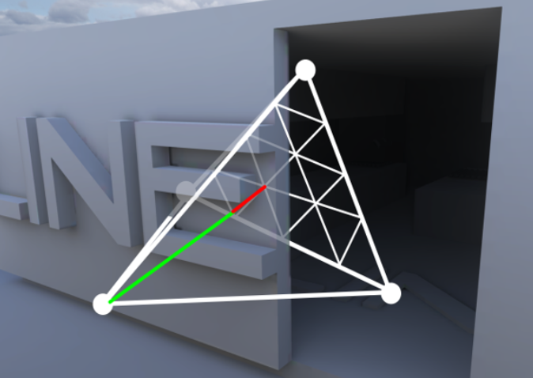

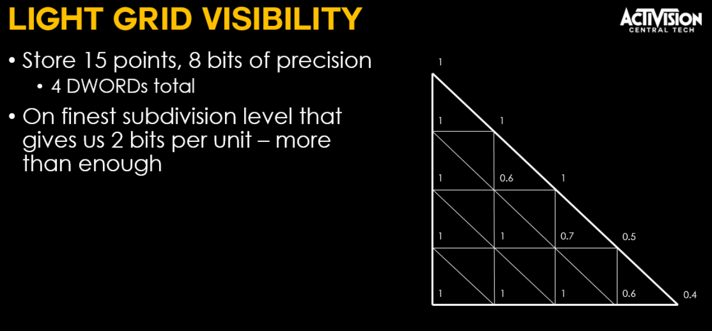

### **1.2 DDGI**

  [相关文章][11], [相关文章][12]
  
  2019年的DDGI 快速三步走:
  1. 均匀分布probe, 每个probe发射N条光线, 采集当前的Radiance
  2. 对第一步的数据进行预处理, 针对每个probe发射的N条光线, 进行光照积分处理
  3. 在屏幕空间中, 使用步骤2的贴图结果, 产生屏幕空间的光照GI图
  4.  得到屏幕空间的GI光照后, 直接与之前的场景光照结果进行迭加(在UE的defer流程中是覆盖DeferredSceneColor这张RT)

  漏光:
  1. 预处理每个probe对应一个2D的八面体深度贴图
  2. 实时的时候根据切比雪夫不等式计算点前点看到probe的概率
  3. 同时点的法线平面与probe的关系来决定probe的混合权重
  4. 也可以在手动加权重

  DDGI是一种可以完全自动化并且对于各种形状的房子都可以用的. (其实还是要手动避免Probe和墙面太近, 甚至在墙里面, 建议推出去一些, 比如彩虹老师说的用借用SDF自动化). 

  不过深度图预烘焙需要的数据量也非常的大, 比如说一张图尺寸为16*16.

### **1.3 对马岛之魂**

  [相关PPT][13]

  2021年的对马岛之魂采用的是Delaunay网格来进行probe的插值, 每个probe增加了一个标记位, 用来标记自己是室内的probe还是室外的probe.

  对于每个模型表面, 需要有一个室内权重. 标记模型表面的方法有三种：1. 标记模型然后传入Per Object 的Uniform. 2. 室内室外用不同的顶点色. 3. 放贴花.

  一个像素点, 拿到室内权重W. 计算Delaunay网格的重心坐标. 对于每个参与插值的probe: 如果是室内probe, 权重额外乘以W, 如果是室外probe, 权重额外乘以1-W. 最后将权重使用重心坐标归一化

  数据量很小, 但是的都是美术苦力活. 室内外共享顶点/模型也很麻烦. 而且这种在模型上下功夫, 所以如果是动态角色进入室内外不知道怎么做的。

### **1.4 COD New**

  [相关PPT][15]

  在2021年SIGGRAPH上的COD又说了一种方法.

  对一个block的随机采样点做射线检测, 只有室外的采样点的颜色才会被保留并累积在最终的cell中心的SH中. 不过室外会变暗, 有点AO的味道了.

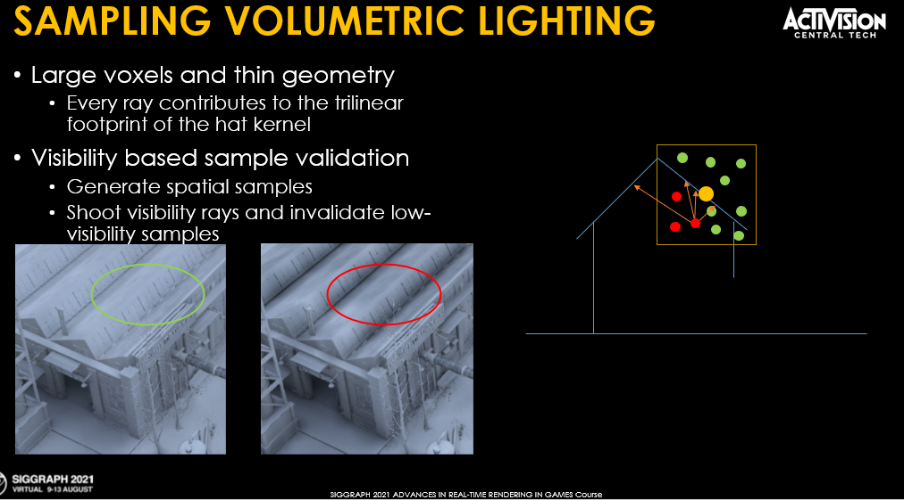

### **1.5 原神**
  [视频地址][16]

  + Reflection probe分成室内、室外两种
  + Ambient probe也分成室内外不同的环境光
  + 美术摆放室内环境专用的网格(interior mesh), 来标记室内光影响  + 的像素
  + 做了过渡处理. 两套光照切换的时候不会产生硬过渡的效果
  + (感觉像是室外光照亮了内部)
  + 红色区域是就是室内标记图

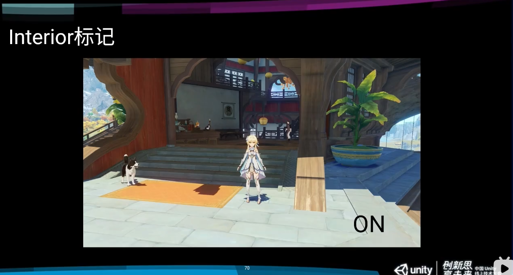

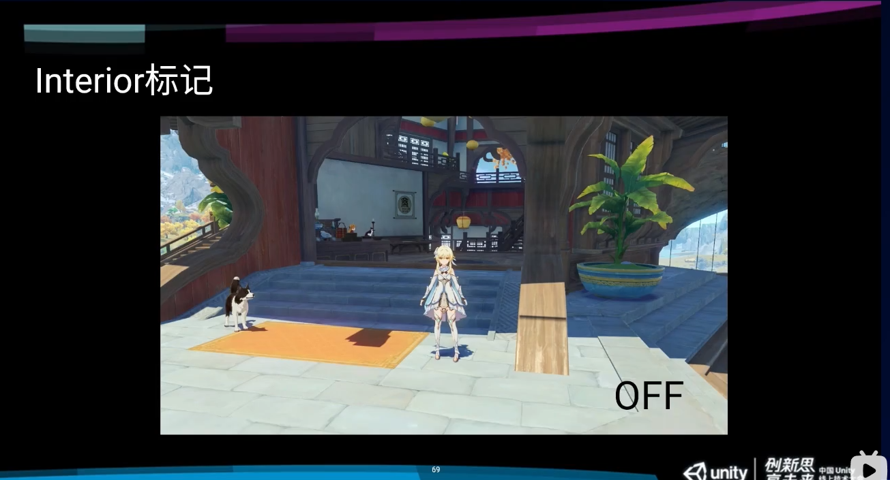


### **1.6 SDF**
  用SDF区分室内外, 但是存在一个问题就是精度问题.

  可以加入自动化. 在室内外规则分布点, 用蓝噪音来球形采样, 来判断这个SDF是否符合规则.

-----------------

## **2. Unity Terrain**
  + 创建大量的Imposter RenderTexture
  + 多纹理支持不佳, DrawCall倍增
  + HLODSystem/TerrainHLOD
    + Bake成HLOD Mesh, 内存占用大
    + Bake成纹理, 效果不佳
    + 存在碰撞问题
  + Unity的Height Map Blit 到RT的时候用了Half, 然后存在精度丢失, 高度1024米就不准确了
    + PC的时候half也是float, 不会复现, 手机才重现
    + 只能自己LoadRawTextureData去自己生成图
  + Terrain Texture
    + Unity支持最多16张图
    + 可以用TextureArray来解决
    + Unity自带是没有AO图的, 可以抛弃Metallic, 把Normal.xy+Smoothness+AO合并成一张图
    + 减少Map Index阶段贴图采样开销
      + 融合精度不太好, 所以要求格子很小
      + 不能公用顶点, 需要重新打散为Quad/Double Triangle
      + 设置Quad VertColor.rgb为0~1, 方便下面反算插值
      + 在Vert阶段 OUT.mapIndex = mapIndex * IN.color; OUT.color = IN.color.
      + 然后fragment会进行插值
      + Frag阶段 mapIndex = IN.mapIndex / IN.color
      + 如: V0 mapIndex:3 color:0, V1 mapIndex:6 color:1
	  + Vert: V0 mapIndex:3 * 0=0 color:0, V1 mapIndex:6 * 1=6 color:1
	  + Frag: V0和V1的中间点V2, mapIndex:3 color:0.5, 则mapIndex = 3/0.5 = 6

-----------------

## **3. 采样UV 1/512**
  采样的时候像素有1/512的偏移, [参考文章1][2], [参考文章2][3]

  如下图当我们用 **float2 texelFrac = frac(uv * textureSize - 0.5);** 对大于256像素的图片进行采样的时候, 发现结果和理想的不符合, 发生了偏移.

  因为这时候发生了一个16.8定点数和浮点数的转换. 它会把最后的1/256像素的最后半位, 即最后的1/512像素, 四舍五入到更高的位置.

  解决办法就是用下方代码做补偿. 但是如果不是精确的权重图等, 关系不是很大.

```C++
const float offset = 1.0/512.0;
float2 texelFrac = frac(uv * textureSize + (-0.5 + offset));
```

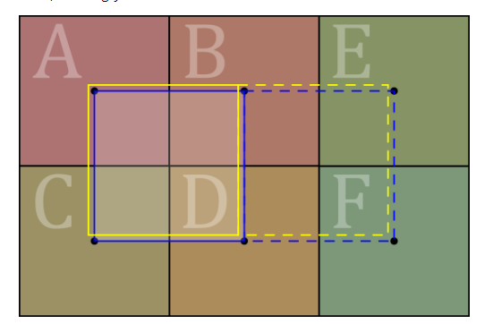

-----------------

## **4. 环境反射**
  以前的反射贴图都是六面体. 类似于下图这样, 会浪费一定的空间. 要么就会1张图变成六张图.


### **4.1 球形贴图(Spherical Map)**
  就是把上面的六张图合成一张图. 比较常用的就是球形贴图.

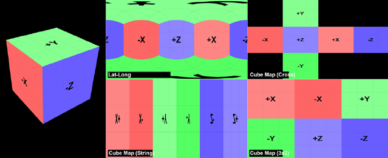

  其实就是用UV两个方向表示球上的三个方向来储存贴图. [相关文章][4]

  上下两个极限位置在球上立体角很小, 但是在2D图中却拥有一行的像素, 会导致了一定的变形.

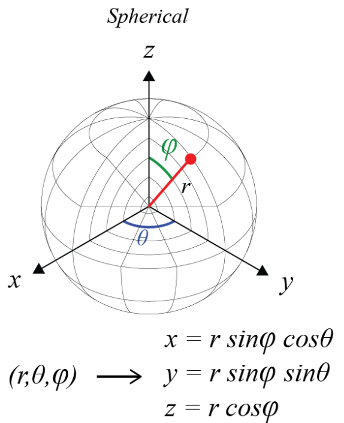

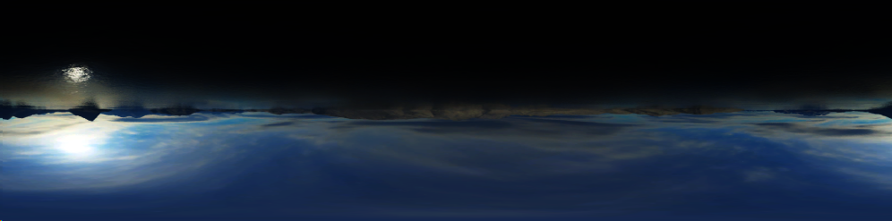

### **4.2 八面体贴图(Octahedral Map)**
  解决上面像素分配不均匀, 可以用均匀的八面体进行储存. 但是其实八面体也只是稍微解决了极点分配不均匀. [相关文章][5], [相关文章][14].

  不过采样的时候存在一定的线性插值问题.

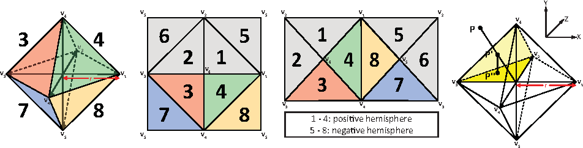

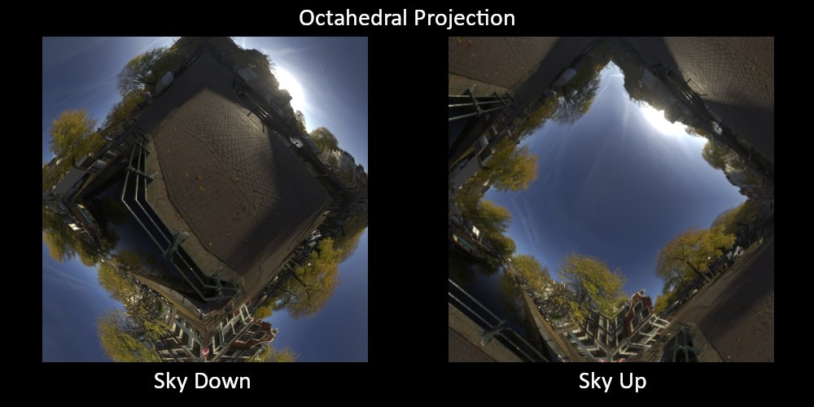


  当然也可以用更激进一点的方式储存.

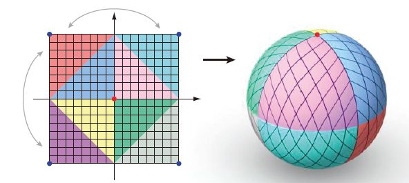

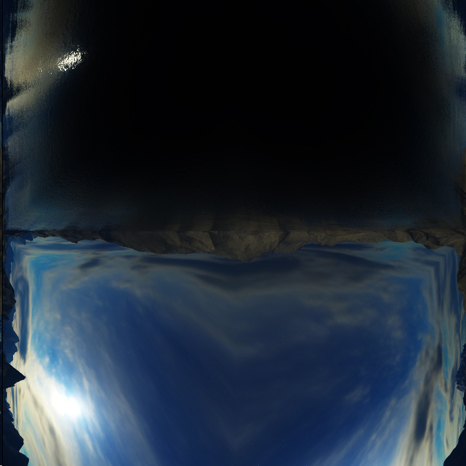


### **4.3 双抛面捕捉(Dual Paraboloid Mapping)**
  把原来的拍摄六次形成cubemap变成只用两次拍摄获得, 从而大大的减少绘制次数, 但是也是存在一定的畸变. [相关文章][6], [相关文章][7], [相关文章][8].

  不过如果想要实时反射这套技术可以试一试.

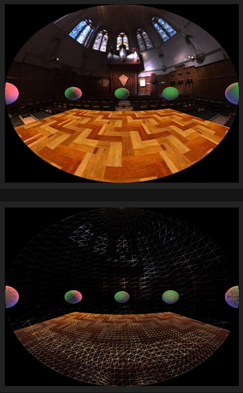

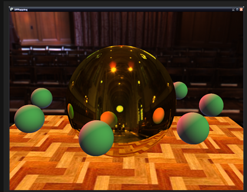


-----------------

[1]:https://github.com/HHHHHHHHHHHHHHHHHHHHHCS/MyStudyNote/blob/main/MyUWA2022Note/%E7%A7%BB%E5%8A%A8%E7%AB%AF%E5%AE%9E%E6%97%B6GI%E6%96%B9%E6%A1%88.md
[2]:https://www.reedbeta.com/blog/texture-gathers-and-coordinate-precision/
[3]:https://learn.microsoft.com/en-us/windows/win32/direct3d12/conservative-rasterization
[4]:https://zhuanlan.zhihu.com/p/84494845
[5]:https://zhuanlan.zhihu.com/p/408898601
[6]:https://zhuanlan.zhihu.com/p/40784734
[7]:http://www.klayge.org/material/3_12/DPSM/DualParaboloidMappingInTheVertexShader.pdf
[8]:http://graphicsrunner.blogspot.com/2008/07/dual-paraboloid-reflections.html
[9]:https://blog.csdn.net/toughbro/article/details/78153634
[10]:https://view.officeapps.live.com/op/view.aspx?src=http%3A%2F%2Fadvances.realtimerendering.com%2Fs2017%2FPrecomputed%2520Lighting%2520in%2520CoD%2520IW_20_PPS.pptx
[11]:https://zhuanlan.zhihu.com/p/404520592
[12]:https://morgan3d.github.io/articles/2019-04-01-ddgi/overview.html
[13]:https://advances.realtimerendering.com/s2021/jpatry_advances2021/index.html#/51/0/7
[14]:https://zhuanlan.zhihu.com/p/384232048
[15]:https://research.activision.com/publications/2021/09/large-scale-global-illumination-in-call-of-duty
[16]:https://www.bilibili.com/video/BV1Za4y1s7VL?t=1702.0
[17]:https://www.jianshu.com/p/99f4775c93b9
[18]:https://arisilvennoinen.github.io/Publications/mbd.pdf