移动端实时GI方案
======

(Github正常排版: [移动端实时GI方案][1])

-----------------

[UWA视频地址][2], 2021年Unity开放日就讲过了 [文章地址][8], [视频地址][9].

原作者/大佬的 [知乎主页][3]

括号()内的话都是我自己想的.

-----------------

<!-- @import "[TOC]" {cmd="toc" depthFrom=1 depthTo=6 orderedList=false} -->

<!-- code_chunk_output -->

- [**1. 光源**](#1-光源)
  - [**1.1 Tile-based Light Culling**](#11-tile-based-light-culling)
  - [**1.2 Light Barrier**](#12-light-barrier)
  - [**1.3 Light Num**](#13-light-num)
- [**2. GI**](#2-gi)
  - [**2.1 一般**](#21-一般)
  - [**2.2 Irradiance Volume**](#22-irradiance-volume)
  - [**2.3 储存详细**](#23-储存详细)
  - [**2.4 Streaming**](#24-streaming)
  - [**2.5 Baker Tools**](#25-baker-tools)
  - [**2.5 耗时**](#25-耗时)
  - [**2.6 其它**](#26-其它)
- [**3. Dynamic GI**](#3-dynamic-gi)
  - [**3.1 以往的技术**](#31-以往的技术)
  - [**3.2 Lux**](#32-lux)
  - [**3.3 效果**](#33-效果)
  - [**3.4 漏光**](#34-漏光)
  - [**3.5 性能**](#35-性能)
  - [**3.6 缺点**](#36-缺点)

<!-- /code_chunk_output -->

-----------------

## **1. 光源**
  目标是手机同屏32盏点光, PC 128盏点光.

### **1.1 Tile-based Light Culling**
  + [相关文章][4], [COD Tile Culling][5]
  + 先基于tile进行一次culling, 再在Z上进行一次culling
  + 在Compute Shader上完成
  + (现在好像很多在研游戏都已经用了这套技术在手机上)

### **1.2 Light Barrier**
  + 遮挡剔除, 视椎体裁剪
  + 比如 给点光加一个范围
    + 下图点光范围有一个BOX裁剪范围,
    + 如果没有裁剪范围就会漏光
    + 同时可以让Tile Light Culling 更加精确
    + (其实Light Layer上也可以解决漏光)

### **1.3 Light Num**
  + 检测屏幕物体接受光源的数量
  + 如果是深红色则说明超标了
  + (有点类似于OverDraw的感觉)

-----------------

## **2. GI**

### **2.1 一般**
  + 一般手游静态光用UV2去烘焙Lightmap
  + 动态物体用Light Probe(光照探针)
  + (Lightmap占用硬盘和内存压力比较大)
  + (其实Lightmap是可以realtime的, [大佬秀技][6])

### **2.2 Irradiance Volume**
  + [相关文章][7]
  + 储存每一块区域的光照信息
  + 他们游戏就是用的这套

### **2.3 储存详细**
  + 用2阶球谐, 1阶段存 Color(3Byte), 2阶只存亮度(3Byte)
  + 存Sky Visbility(1Byte), 存Light Mask(1Byte)
  + 合计8Byte, 即两个UInt

  + 为什么2阶段球谐不存4个Color? 
    + 为了压缩数据

  + Sky Visbility?
    + 有点类似于长距离AO, AO分为长距离AO和短距离AO
    + 下图GI AO 即 Sky Visbility, 可以看到往内部区域走会逐渐变暗

  + 计算公式?
    + 间接光 = GIIndirectSH(烘焙) * LightIntensity(美术调节) + GISkyVisibility(烘焙) * SkySH(美术调节)

  + Light Mask?
    + 表示这块区域的光照贡献主要是平行光产生的, 还是附加光产生的
    + 当白天变成晚上时, 区域的光照贡献主要是附加光, 则亮度不怎么会产生变化
    + 如冰柱的主要贡献是平行光, 白天还好, 但是晚上冰柱周围都变暗了, 冰柱没有变暗会很诡异

### **2.4 Streaming**
  + Scrolling Clipmap Update
    + 比如一组是个128×128×100的3D texture
    + 分帧数, 切片更新, 当角色到边缘的时候发起加载和upload
    + [相关文章][10]

### **2.5 Baker Tools**
  + (他们自己写了一个工具可以烘焙选定区域)
  + 根据NavMesh和碰撞体自动摆放区域, 溢出无效的probes
  + 数据压缩
  + 做预处理, 减少漏光
  + 远处变成2D的Gobal Map
    + 因为3D Texture覆盖范围比较小 远处就需要2D 做弥补

### **2.5 耗时**
  + 范围: 256m * 256m * 200m
  + 3D Texture: 2 * RGBA8 128 * 128 * 100
  + GPU运算时间: 0.4ms(IphoneX)
  + CPU解析时间: 0.17ms(Mi 9)
  + 内存: 2~4MB
  + 包体占用: 2MB~9MB / 1KM 

### **2.6 其它**
  + 3D Virtual Texture (没有细说)
    + 当巨高的场景, 可以用做数据整合, 使其规则化

  + Lightmap VS Irradiance Volume

| Lightmap Volume | Irradiance Volume |
| ------------- | ------------ |
| 静态物体 | 两者都可 |
| 需要UV2 | 不用UV2 |
| 更大的包体和内存 | 占用包体和内存小 |
| 可扩展性强大 | 数据要自定义 |
| 效果更好 | 漏光 |
| 兼容度更好 | 是用Compute Shader 和 3D Texutre |
| 烘焙慢 | 烘焙更快 |
| 离线烘焙 | 可以实时GI |

-----------------

## **3. Dynamic GI**

### **3.1 以往的技术**
  + Radiosity
    + 把场景分成很多patch, 类似于UV2
    + 然后预计算一个patch 对另一个patch 的影响, 距离 朝向 可见性
    + 解方程很难, 基本都是靠迭代
  + PRT(Precomputed Radiance Transfer)
    + [相关文章][11], 还有全境封锁2016GDC的分享
    + 预存储光照传播关系, 每个probe受哪些surfel影响, 每个surfel的材质信息
    + 直接光变化时, 更新surfel, 从而更新probe, 最后做relightinng
    + 需要场景是静态的
    + 手机上这套方案也已经在实现了
  + SDFGI
  + Voxel Cone Tracing
    + 把场景体素化, 然后Cone Tracing
    + [相关文章][12]
  + Lumen
    + 一堆技术的组合
    + Radiance Cache
    + SDF/SSGI
    + Screen Space Probe
    + Voxe Radiance
  + (RTX)
  + ...

### **3.2 Lux**

  他们自己取名, 跟Lumen名字类似.

  是基于LPV的(Light Propagation Volumes), Games也有讲过, [相关文章][13],[相关知乎][14].

  如果用RSM生成初始数据. 比如说从光源生成4张RT 深度图, 法线图, Diffuse图, 位置图. 然后实际用的时候, 当作虚拟光源, 多次采样叠加当作间接光的结果.

  但是RSM 的DrawCall 是非常爆炸的. 然后采样的次数也是非常的多, 每个位置要采样64次. 所以需要分帧, 和Temporal降噪.

  他们使用的: 把间接光和直接光都注入到Radiance Volume的Probe, 光照在Probe之间传播, 最后用Volume照亮场景.

  LPV需要用RSM来考虑遮挡关系, 但是这里没有用到RSM. 所以引入了新的数据结构Propagate Buffer.  

  就是用Physics.Raycast计算相邻的Probe的可见性, 储存数据是0和1. 判断的准确性不太行, 但是效率不错. 

  然后美术可以标记哪些部件不参与遮挡, 比如说玻璃可以透光, 但是墙不会.

  计算方式就是线性插值.比如a1是室外 SkyVis=1, a2是室内 SkyVis=0, a0就是处于中间 可以做插值. 然后6个方向加起来除以6. 然后分帧迭代. 如果有的点周围没有相邻的点, 则说明在室内, SkyVis为0.

  间接光SH也差不多, 就是多考虑了方向性. 比如L1在靠近L0反向的颜色为黑色.

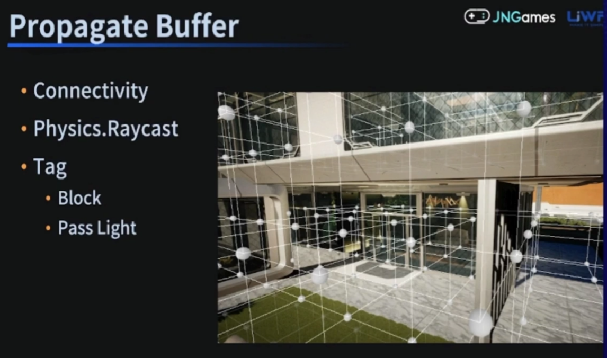

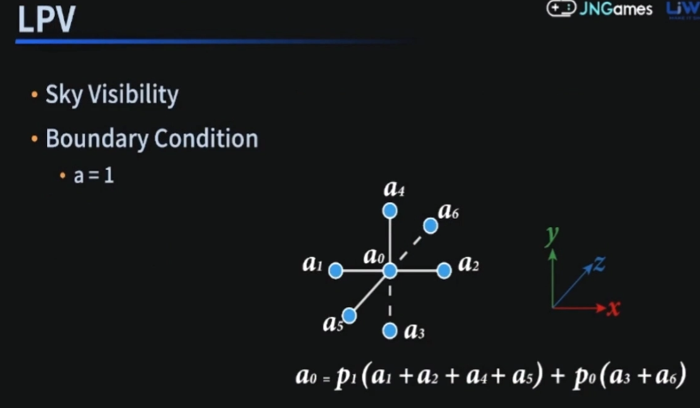

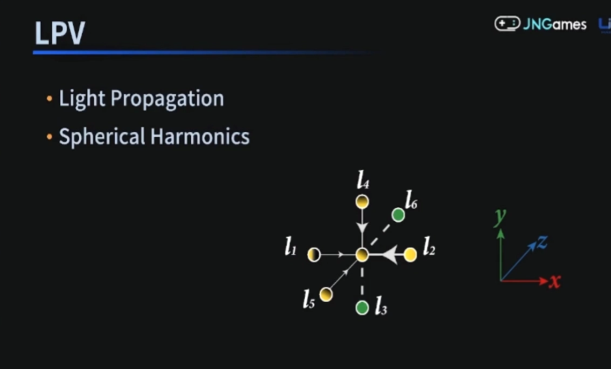

  **迭代叠加越加越亮?**

  雅克比迭代, 每次计算完当前全部迭代之后带入下一次迭代. 高斯赛德尔, 如果计算的时候有值已经算出来了, 则带入公式加速求解速度.

  比如Pixel Shader 对于两张RT的pingpong, 就是雅克比. 但是他们这里用Compute Shader, 如果是高斯赛德尔迭代, 就需要很处理Barrier和数据一致性, 比较繁琐性能也不好. 所以这里就很随意如果数据更新了就用新的, 没有更新就用旧的.

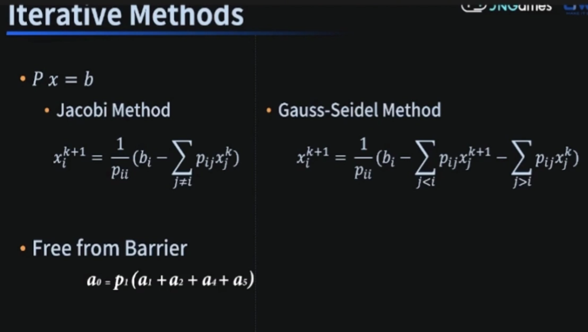

  **迭代反射?**

  用迭代近似处理多次反射. 比如下面的L3是不连通的, 因此会反射一定的irrdiance, 计算的时候就会考虑一定的从下往上的加成.

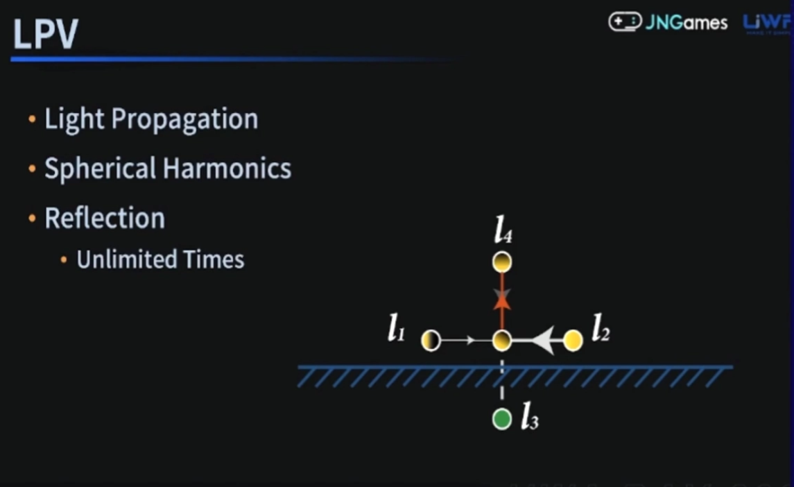

  **耗时?**

  初始化需要24ms. loading的时候做完, 玩家修改建筑的时候局部更新. 更新的时 平均CPU耗时0.5ms.

  **光照注入?**

  怎么知道哪些probe受到哪些光影响? 在CPU 做 Lighting Culling, 因为屏幕上的probe其实是非常少的. 

  关于光照的遮挡. 在Propagate Buffer中用Raycast的时候顺便记录了六个方向的深度值. 这样只考虑probe和光源的距离就好了. 对于每个光源只考虑周围的八个probe, 别的位置都不计算.

### **3.3 效果**

比平行光 Diffuse效果要好, 而且效率也会高点. 不过高光部分效果不太行, 平行光是GGX, 而Lux高光效果会变散.

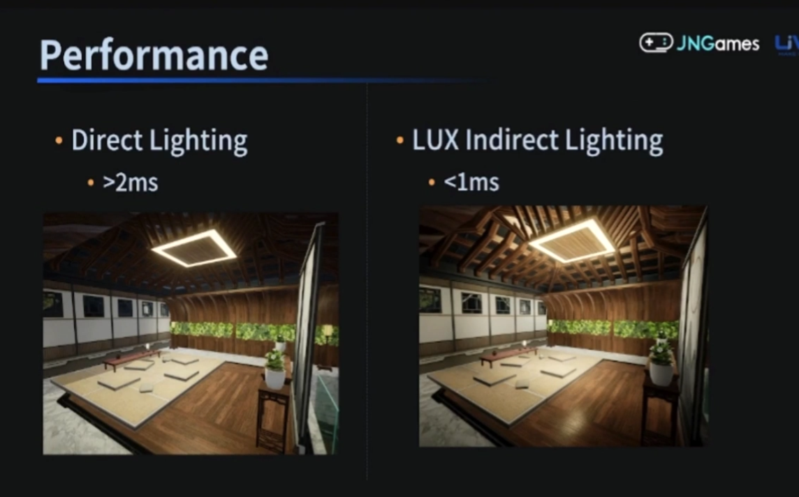

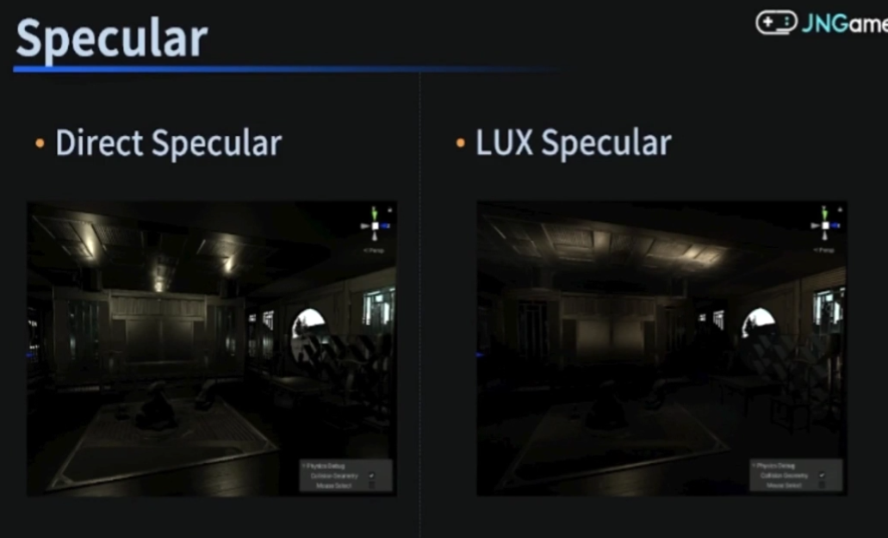

### **3.4 漏光**

  大体上是不会漏光的, 但是采样时插值还是会漏光. 比如下图墙角处, 蓝绿色插值就会出现漏光.

  (后面一篇文章也会快速讲一个这个)

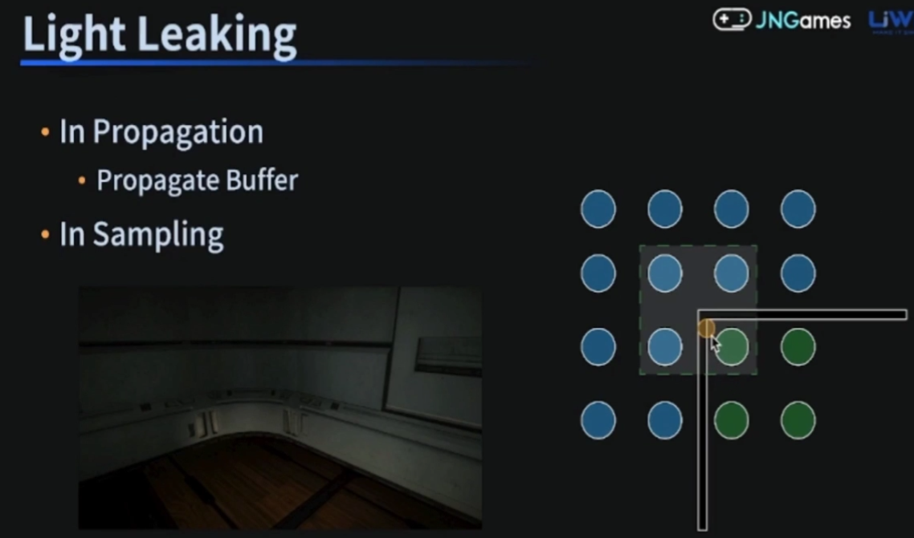

  一种是区分室内室外做两套probe. 对于规则物体的demo效果比较好, 但是实际上房子不太规则, 所以没有采样.

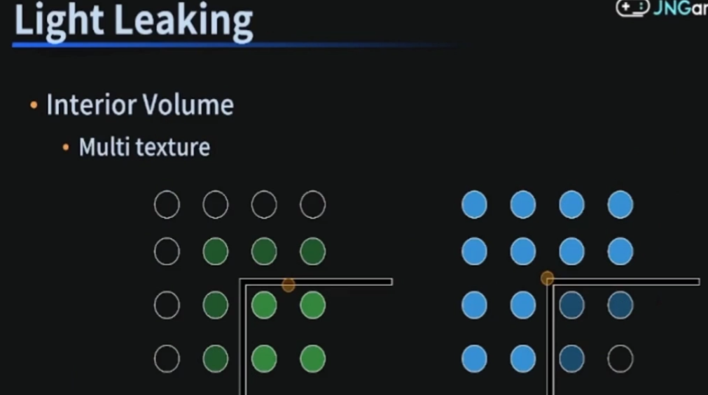

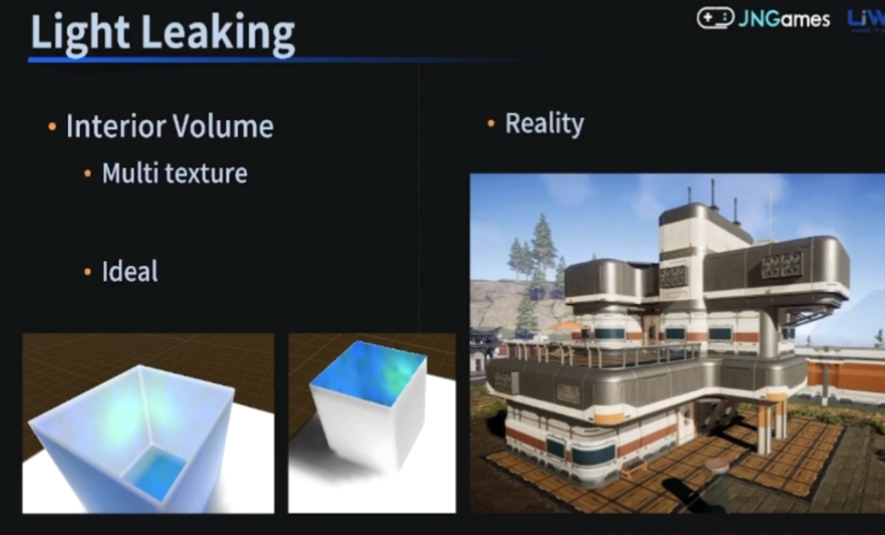

  COD用四面体. probe储存四面体中一个点到对面三角面的每个点的深度, 然后做深度对比.

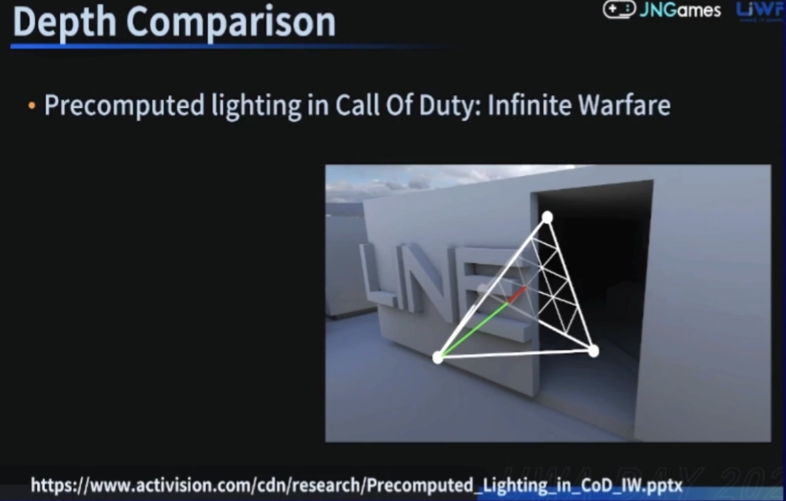

  DDGI. 每个probe对应一个2D的八面体深度贴图, 八个点的距离, 距离平方, 然后用切比雪夫不等式做一个概率估计. 不用线性插值, 而且自己还可以做权重处理. 但是需要的数据量太多了. 每个probe需要16*16个Bytes来记录深度.

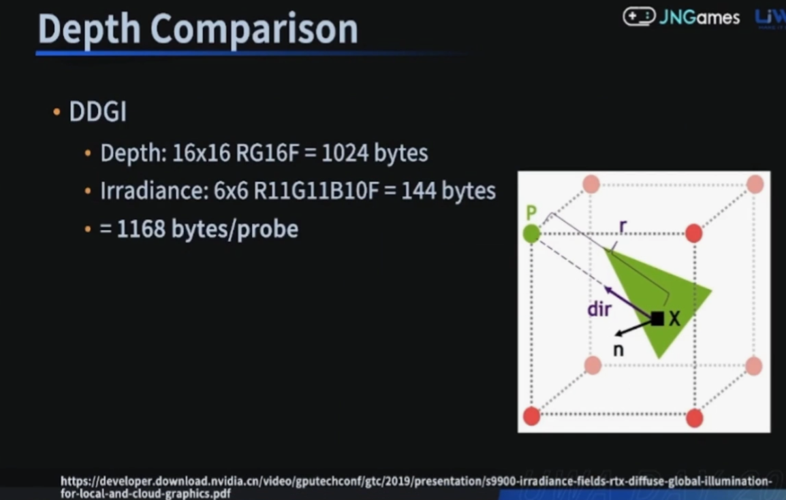

  Lux. 
  
  实时的时候可以用Propagate Buffer记录的六个方向的深度.

  离线可以精准点, 在预烘焙阶段抓一张深度图, 用八个方向的球面高斯去拟合 [球面高斯][15], 然后记录八个方向的系数.

  然后手动计算插值做深度比较.

  为什么用球面高斯?

  因为球谐的形状比较圆, 但是球面高斯比较符合墙角的形状.

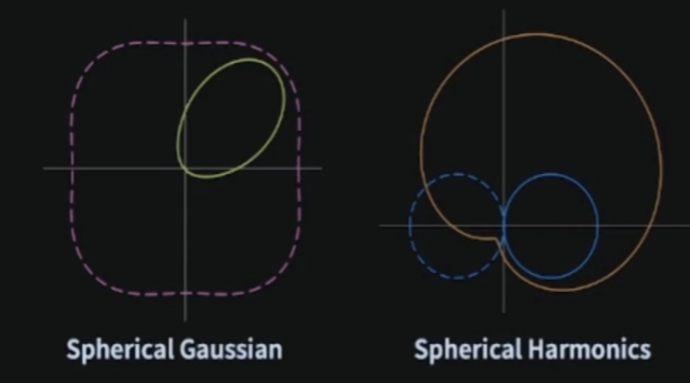

### **3.5 性能**
  + Iphone13
  + 地图大小120m * 120m * 40m. 
  + 前20帧LPV准备. GPU0.5ms, CPU<0.8ms.
  + Relighting阶段. 硬件三线性插值0.5ms. 防漏光需要自己采样八次计算插值做比较 耗时1.5ms.
  + 防漏光是可选的, 并且可以降低分辨率继续减少消耗.

### **3.6 缺点**
  + 高光效果
  + 附加光的形状
  + Volume精度和深度精度导致的瑕疵

-----------------

[1]:https://github.com/HHHHHHHHHHHHHHHHHHHHHCS/MyStudyNote/blob/main/MyUWA2022Note/%E7%A7%BB%E5%8A%A8%E7%AB%AF%E5%AE%9E%E6%97%B6GI%E6%96%B9%E6%A1%88.md
[2]:https://edu.uwa4d.com/course-intro/1/471
[3]:https://www.zhihu.com/people/pu-ye-4
[4]:https://lxjk.github.io/2018/03/25/Improve-Tile-based-Light-Culling-with-Spherical-sliced-Cone.html
[5]:https://www.activision.com/cdn/research/2017_Sig_Improved_Culling_final.pdf
[6]:http://www.polylab.dk/projects.html
[7]:https://www.gdcvault.com/play/1015326/Deferred-Radiance-Transfer-Volumes-Global
[8]:https://developer.unity.cn/projects/60efe674edbc2a0159e317cf
[9]:https://www.bilibili.com/video/BV1R44y1q7vX
[10]:https://www.gdcvault.com/play/1015326/Deferred-Radiance-Transfer-Volumes-Global
[11]:https://www.inf.ufrgs.br/~oliveira/pubs_files/Slomp_Oliveira_Patricio-Tutorial-PRT.pdf
[12]:https://developer.download.nvidia.com/GTC/PDF/GTC2012/PresentationPDF/SB134-Voxel-Cone-Tracing-Octree-Real-Time-Illumination.pdf
[13]:https://www.advances.realtimerendering.com/s2009/Light_Propagation_Volumes.pdf
[14]:https://zhuanlan.zhihu.com/p/412287249
[15]:https://zhuanlan.zhihu.com/p/514017351