移动端实时GI方案
======

(Github正常排版: [移动端实时GI方案][0])

-----------------

[UWA视频地址][2], 2021年Unity开放日就讲过了 [文章地址][8], [视频地址][9].

原作者/大佬的 [知乎主页][3]

括号()内的话都是我自己想的.

-----------------

<!-- @import "[TOC]" {cmd="toc" depthFrom=1 depthTo=6 orderedList=false} -->

<!-- code_chunk_output -->

- [**0. 大纲**](#0-大纲)
- [**1. 光源**](#1-光源)
  - [**1.1 Tile-based Light Culling**](#11-tile-based-light-culling)
  - [**1.2 Light Barrier**](#12-light-barrier)
  - [**1.3 Light Num**](#13-light-num)
- [**2. GI**](#2-gi)
  - [**2.1 一般**](#21-一般)
  - [**2.2 Irradiance Volume**](#22-irradiance-volume)
  - [**2.3 储存详细**](#23-储存详细)
  - [**2.4 Streaming**](#24-streaming)
  - [**2.5 Baker Tools**](#25-baker-tools)
  - [**2.5 耗时**](#25-耗时)
  - [**2.6 其它**](#26-其它)
- [**3. Dynamic GI**](#3-dynamic-gi)
  - [**3.1 以往的技术**](#31-以往的技术)

<!-- /code_chunk_output -->

-----------------

## **0. 大纲**
  0. 

-----------------

## **1. 光源**
  目标是手机同屏32盏点光, PC 128盏点光.

### **1.1 Tile-based Light Culling**
  + [相关文章][4], [COD Tile Culling][5]
  + 先基于tile进行一次culling, 再在Z上进行一次culling
  + 在Compute Shader上完成
  + (现在好像很多在研游戏都已经用了这套技术在手机上)

### **1.2 Light Barrier**
  + 遮挡剔除, 视椎体裁剪
  + 比如 给点光加一个范围
    + 下图点光范围有一个BOX裁剪范围,
    + 如果没有裁剪范围就会漏光
    + 同时可以让Tile Light Culling 更加精确
    + (其实Light Layer上也可以解决漏光)

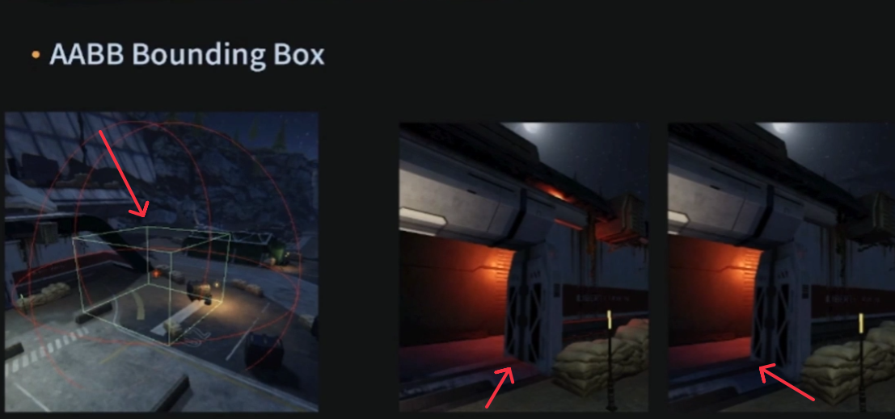

### **1.3 Light Num**
  + 检测屏幕物体接受光源的数量
  + 如果是深红色则说明超标了
  + (有点类似于OverDraw的感觉)

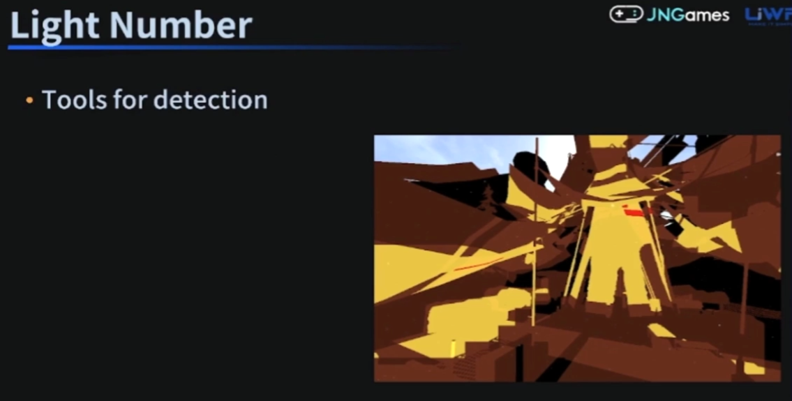

-----------------

## **2. GI**

### **2.1 一般**
  + 一般手游静态光用UV2去烘焙Lightmap
  + 动态物体用Light Probe(光照探针)
  + (Lightmap占用硬盘和内存压力比较大)
  + (其实Lightmap是可以realtime的, [大佬秀技][6])

### **2.2 Irradiance Volume**
  + [相关文章][7]
  + 储存每一块区域的光照信息
  + 他们游戏就是用的这套

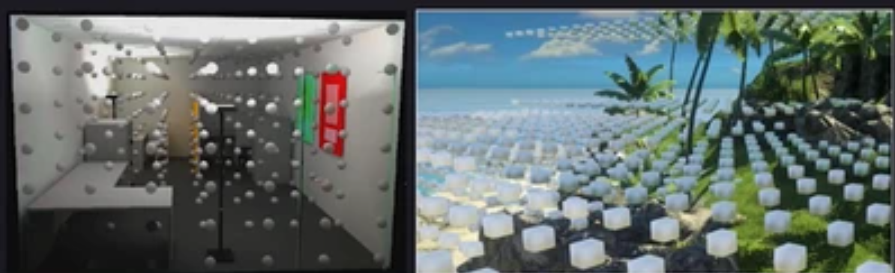

### **2.3 储存详细**
  + 用2阶球谐, 1阶段存 Color(3Byte), 2阶只存亮度(3Byte)
  + 存Sky Visbility(1Byte), 存Light Mask(1Byte)
  + 合计8Byte, 即两个UInt

  + 为什么2阶段球谐不存4个Color? 
    + 为了压缩数据

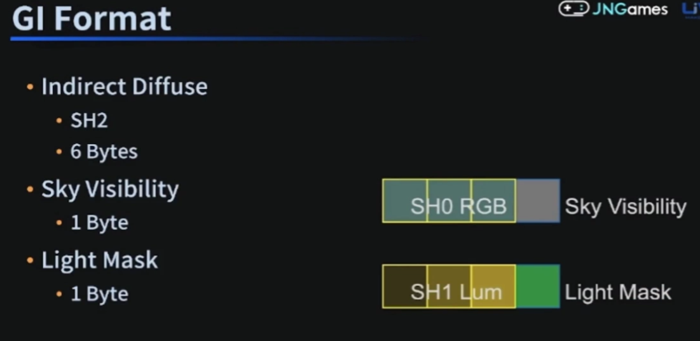

  + Sky Visbility?
    + 有点类似于长距离AO, AO分为长距离AO和短距离AO
    + 下图GI AO 即 Sky Visbility, 可以看到往内部区域走会逐渐变暗

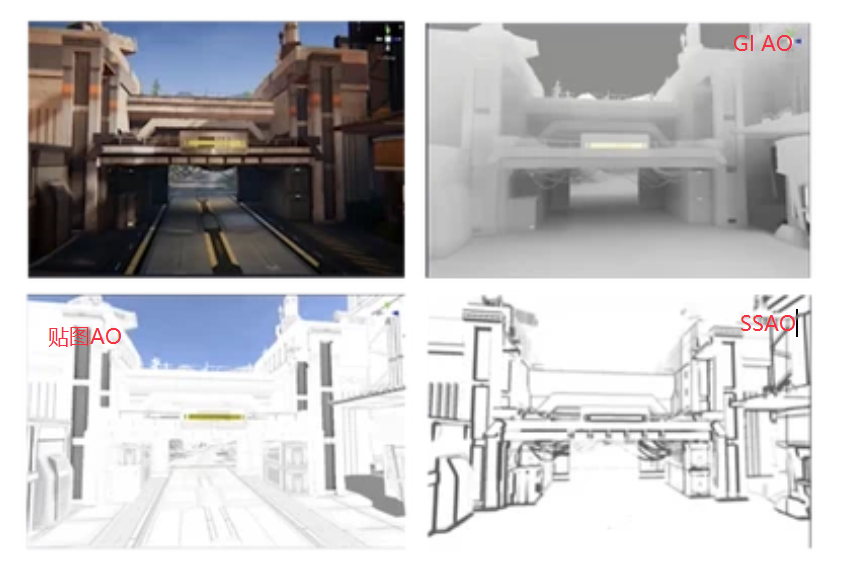

  + 计算公式?
    + 间接光 = GIIndirectSH(烘焙) * LightIntensity(美术调节) + GISkyVisibility(烘焙) * SkySH(美术调节)

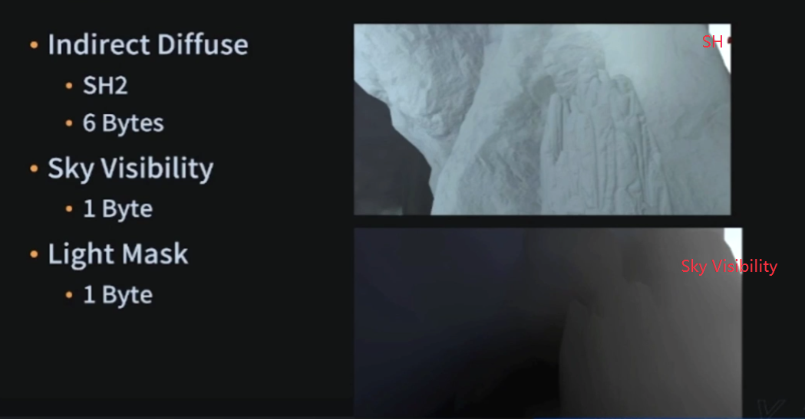

   + Light Mask?
    + 表示这块区域的光照贡献主要是平行光产生的, 还是附加光产生的
    + 当白天变成晚上时, 区域的光照贡献主要是附加光, 则亮度不怎么会产生变化
    + 如冰柱的主要贡献是平行光, 白天还好, 但是晚上冰柱周围都变暗了, 冰柱没有变暗会很诡异

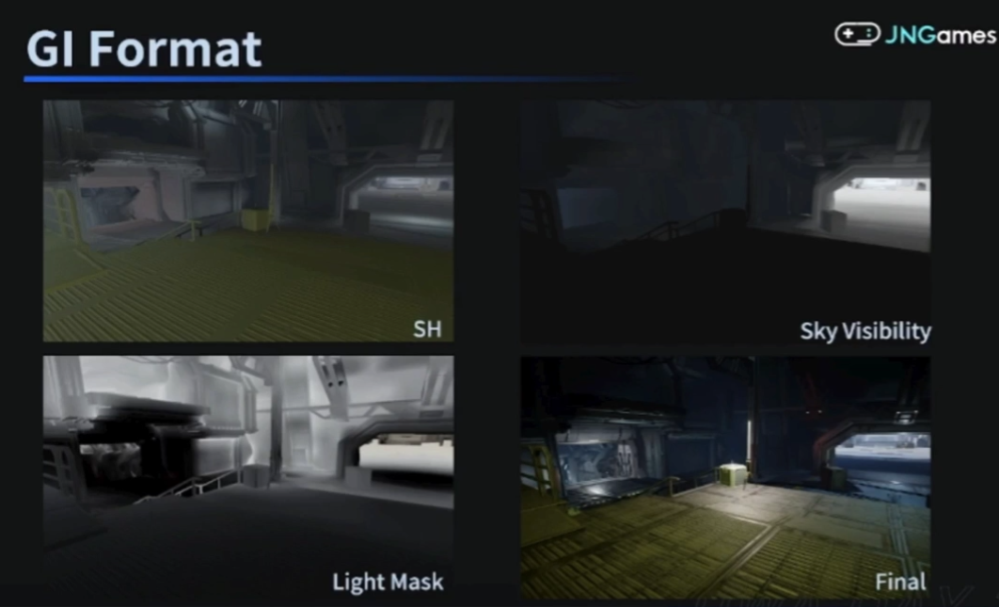

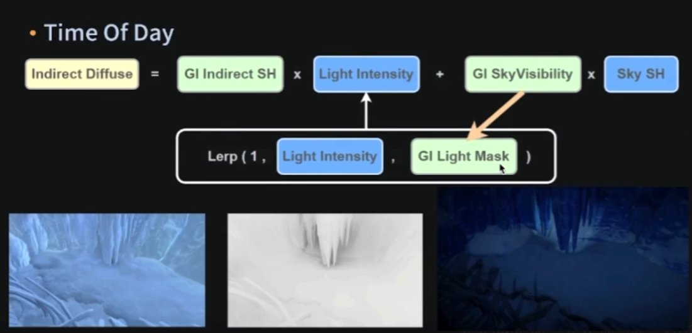

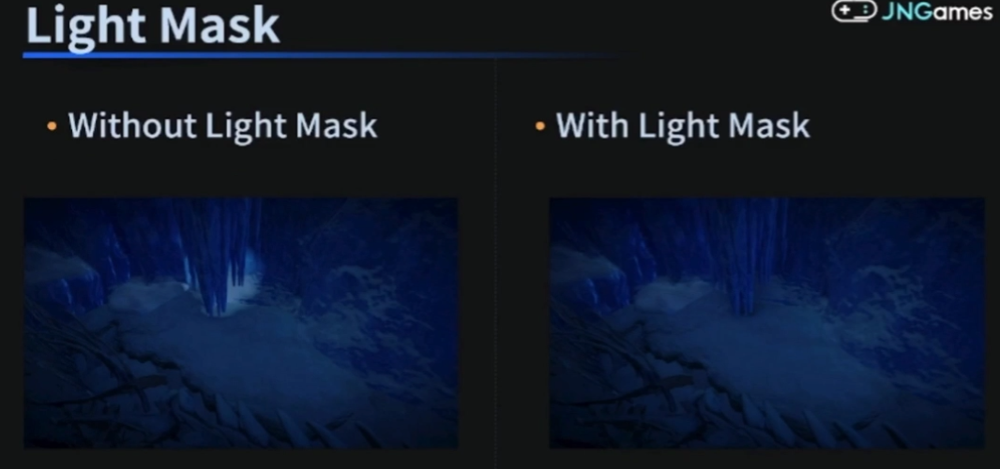

### **2.4 Streaming**
  + Scrolling Clipmap Update
    + 比如一组是个128×128×100的3D texture
    + 分帧数, 切片更新, 当角色到边缘的时候发起加载和upload
    + [相关文章][10]

### **2.5 Baker Tools**
  + (他们自己写了一个工具可以烘焙选定区域)
  + 根据Navmmesh和碰撞体自动摆放区域, 溢出无效的probes
  + 数据压缩
  + 做预处理, 减少漏光
  + 远处变成2D的Gobal Map
    + 因为3D Texture覆盖范围比较小 远处就需要2D 做弥补

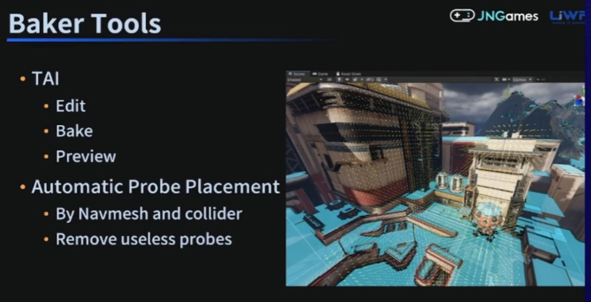

### **2.5 耗时**
  + 范围: 256m * 256m * 200m
  + 3D Texture: 2 * RGBA8 128 * 128 * 100
  + GPU运算时间: 0.4ms(IphoneX)
  + CPU解析时间: 0.17ms(Mi 9)
  + 内存: 2~4MB
  + 包体占用: 2MB~9MB / 1KM 

### **2.6 其它**
  + 3D Virtual Texture (没有细说)
    + 当巨高的场景, 可以用做数据整合, 使其规则化
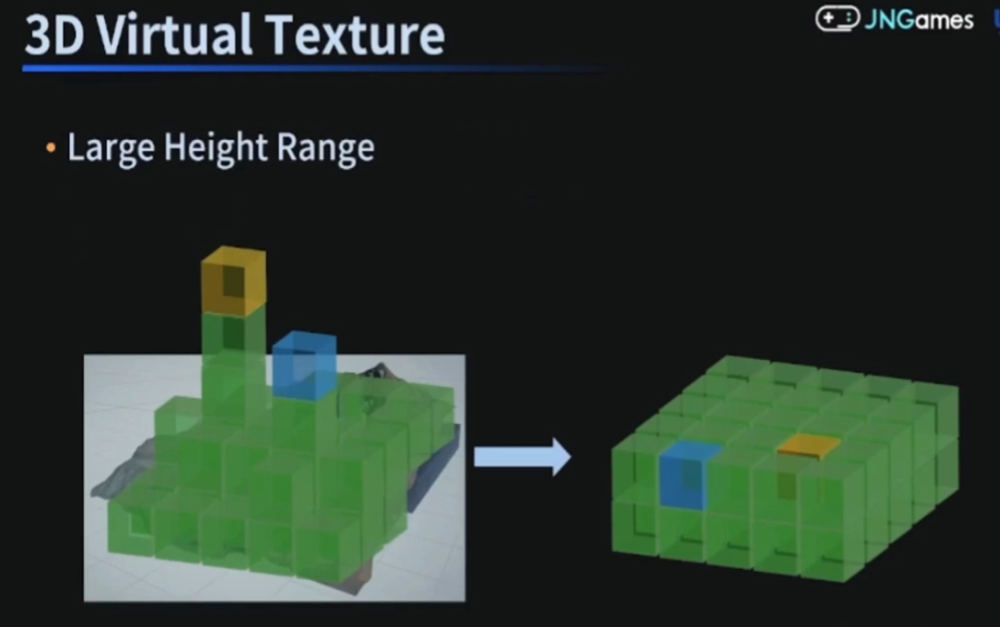

  + Lightmap VS Irradiance Volume

| Lightmap Volume | Irradiance Volume |
| ------------- | ------------ |
| 静态物体 | 两者都可 |
| 需要UV2 | 不用UV2 |
| 更大的包体和内存 | 占用包体和内存小 |
| 可扩展性强大 | 数据要自定义 |
| 效果更好 | 漏光 |
| 兼容度更好 | 是用Compute Shader 和 3D Texutre |
| 烘焙慢 | 烘焙更快 |
| 离线烘焙 | 可以实时GI |

-----------------

## **3. Dynamic GI**

### **3.1 以往的技术**
  + Radiosity
    + 把场景分成很多patch, 类似于UV2
    + 然后预计算一个patch 对另一个patch 的影响, 距离 朝向 可见性
    + 解方程很难, 基本都是靠迭代
  + PRT(Precomputed Radiance Transfer)
    + [相关文章][11], 还有全境封锁2016GDC的分享
    + 预存储光照传播关系, 每个probe受哪些surfel影响, 每个surfel的材质信息
    + 直接光变化时, 更新surfel, 从而更新probe, 最后做relightinng
    + 需要场景是静态的
    + 手机上这套方案也已经在实现了
  + SDFGI
  + Voxel Cone Tracing
  + Lumen
  + RTX
  + ...

-----------------

[1]:https://github.com/HHHHHHHHHHHHHHHHHHHHHCS/MyStudyNote/blob/main/MyUWA2022Note/%E7%A7%BB%E5%8A%A8%E7%AB%AF%E6%B8%B2%E7%A1%AC%E4%BB%B6%E7%89%B9%E6%80%A7%E6%8F%90%E5%8D%87%E6%B8%B8%E6%88%8F%E4%B8%8A%E9%99%90.md
[2]:https://edu.uwa4d.com/course-intro/1/471
[3]:https://www.zhihu.com/people/pu-ye-4
[4]:https://lxjk.github.io/2018/03/25/Improve-Tile-based-Light-Culling-with-Spherical-sliced-Cone.html
[5]:https://www.activision.com/cdn/research/2017_Sig_Improved_Culling_final.pdf
[6]:http://www.polylab.dk/projects.html
[7]:https://www.gdcvault.com/play/1015326/Deferred-Radiance-Transfer-Volumes-Global
[8]:https://developer.unity.cn/projects/60efe674edbc2a0159e317cf
[9]:https://www.bilibili.com/video/BV1R44y1q7vX
[10]:https://www.gdcvault.com/play/1015326/Deferred-Radiance-Transfer-Volumes-Global
[11]:https://www.inf.ufrgs.br/~oliveira/pubs_files/Slomp_Oliveira_Patricio-Tutorial-PRT.pdf