移动端渲硬件特性提升游戏上限
======

(Github正常排版: [移动端渲硬件特性提升游戏上限][1])

-----------------

这个其实是UOD的免费视频 [视频地址][2]. 讲的东西我基本都没有学习过! 

这篇很多特性都是Metal(Apple)的, 虽然一些安卓厂商也出了其中一些特性.

UWA太贵了, 加上游戏太好玩了(可恶XGP免费了P5R), 后面就挑几个感兴趣的看吧.

原作者/大佬的 [知乎主页][26] , [个人Blog][27] !!!

-----------------

<!-- @import "[TOC]" {cmd="toc" depthFrom=1 depthTo=6 orderedList=false} -->

<!-- code_chunk_output -->

- [**0. 大纲**](#0-大纲)
- [**1. Metal Binary Archive**](#1-metal-binary-archive)
  - [**1.1 Shader编译**](#11-shader编译)
  - [**1.2 离线编译**](#12-离线编译)
  - [**1.3 第一版编译**](#13-第一版编译)
  - [**1.4 第二版编译**](#14-第二版编译)
  - [**1.5 效果**](#15-效果)
  - [**1.6 Reference**](#16-reference)
- [**2. Metal Variable Rate Rasterization Rate Map**](#2-metal-variable-rate-rasterization-rate-map)
  - [**2.1 Why**](#21-why)
  - [**2.2 渲染管线**](#22-渲染管线)
  - [**2.3 性能**](#23-性能)
  - [**2.4 RRM VS VRS**](#24-rrm-vs-vrs)
  - [**2.5 Reference**](#25-reference)
  - [**2.6 其它**](#26-其它)
- [**3. Vulkan Variable Rate Shading**](#3-vulkan-variable-rate-shading)
  - [**3.1 原理**](#31-原理)
  - [**3.2 支持**](#32-支持)
  - [**3.3 使用**](#33-使用)
  - [**3.4 性能**](#34-性能)
  - [**3.5 Reference**](#35-reference)
  - [**3.6 其它**](#36-其它)
- [**4. Metal Async Compute**](#4-metal-async-compute)
  - [**4.1 原理**](#41-原理)
  - [**4.2 How**](#42-how)
  - [**4.2 解决**](#42-解决)
  - [**4.3 Reference**](#43-reference)
- [**5. Stenil ID**](#5-stenil-id)
  - [**5.1 What**](#51-what)
- [**6. Metal Multi-Threaded Rendering**](#6-metal-multi-threaded-rendering)
  - [**6.1 What**](#61-what)
  - [**6.2 Multi Command Buffer**](#62-multi-command-buffer)
  - [**6.3 Multi Command Buffer by different thread**](#63-multi-command-buffer-by-different-thread)
  - [**6.4 MTLParallelRenderCommandEncoder**](#64-mtlparallelrendercommandencoder)
  - [**6.5 Reference**](#65-reference)
- [**7. Metal Lossless & Lossy**](#7-metal-lossless-lossy)
  - [**7.1 What**](#71-what)
  - [**7.2 Lossless效果**](#72-lossless效果)
  - [**7.3 Reference**](#73-reference)
- [**8. Framepacing**](#8-framepacing)
  - [**8.1 What**](#81-what)
  - [**8.2 效果**](#82-效果)
  - [**8.3 How**](#83-how)
  - [**8.4 Reference**](#84-reference)

<!-- /code_chunk_output -->

-----------------

## **0. 大纲**
  + Metal Binary Archive
    + 编译Shader导致的Loading的卡顿问题
  + Metal Variable Rate Rasterization Rate Map
    + Metal的降低分辨率/动态分辨率相关
  + Vulkan Variable Rate Shading
    + Vulkan的降低分辨率/动态分辨率相关
  + Metal Async Compute
    + GPU并行计算相关
  + Stencil_ID Lighting Pass
    + UE的 mobile deferred pipeline 的 lightingpass 动态分支相关
  + Metal Multi_Threaded Rendering
    + 多线程渲染相关
  + Metal Lossless & Lossy
    + 带宽相关
  + Metal Frame Pacing
    + 帧平均耗时相关

-----------------

## **1. Metal Binary Archive**

### **1.1 Shader编译**

  主要是编译Shader导致的Loading的卡顿问题.

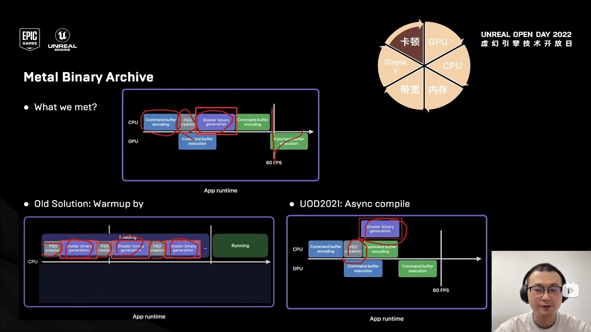

正常模式:
  1. Command buffer encoding -- 执行命令
  2. PSO creation -- PSO创建, 申请编译Shader
  3. Shader binary generation -- 正式执行Shader编译

当执行Shader编译花费大量时间的时候, 会导致Loading卡顿严重

老方法 Warmup:
  1. 把Shader提前编译好
  2. PSO creation
  3. 加载编译好的Shader

如果Shader Binary过大, 那么Loading的时候会IO会增加很多时间

新方法 Aysnc Compile:
  1. 由另外一个线程执行Shader编译
  2. 没有编译好Shader的物体不绘制

### **1.2 离线编译**

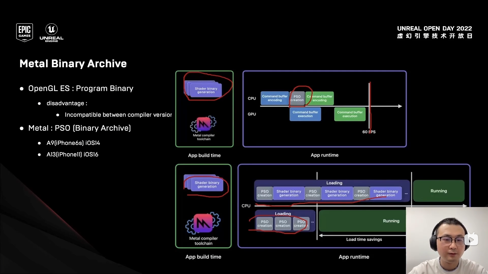

  + PC
    + 打包时, 提前把Shader编译好, 一起打进包体
  + OpenGLES
    + 老的OpenGLES不支持离线编译
    + OpenGLES3.0开始支持离线编译Shader
    + 编译后的文件叫Program Binary, 以extension的形式存在的
    + 缺点: 不同编译器不同芯片不兼容, 需要为每个芯片每个操作系统单独生成一份Program Binary
  + Metal:
    + 苹果2014放弃了OpenGL, 使用了Metal
    + Metal使用PSO, 比Program性能更好状态更多更好管理 (UE也使用PSO)
    + 离线编译后的文件叫Binary Archive
    + Binary Archive第一版
      + A9 Iphone6S IOS14开始支持
      + 缺点: 不同编译器版本支持不支持
    + Binary Archive第二版
      + A13 Iphone11 IOS16开始支持
      + 可以一套支持多个芯片

### **1.3 第一版编译**

第一版(A9 Iphone6S IOS14)的编译过程.

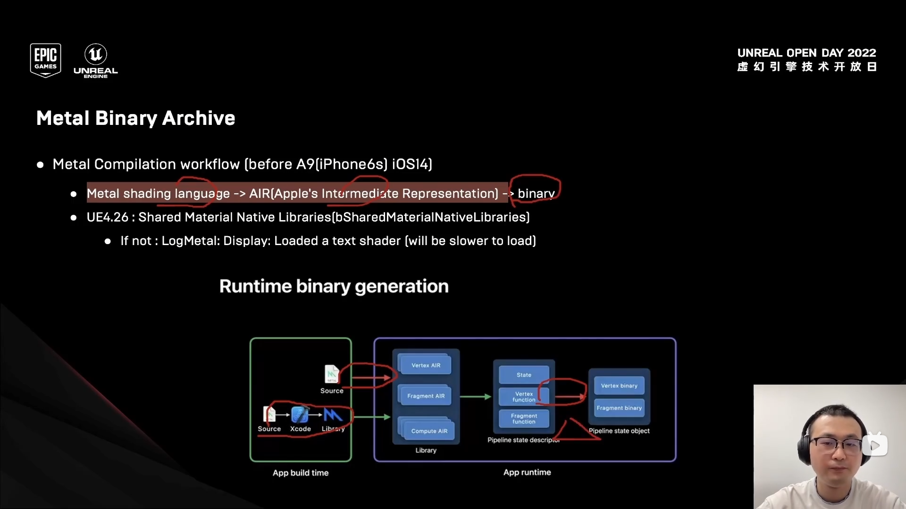

第一步 先通过Metal Shading Language 翻译成 AIR. 第二步 AIR 再翻译成 Binary. 这两步都需要大量的时间.

第一步可以在离线打包的时候完成. 但是第二步必须在运行时执行.

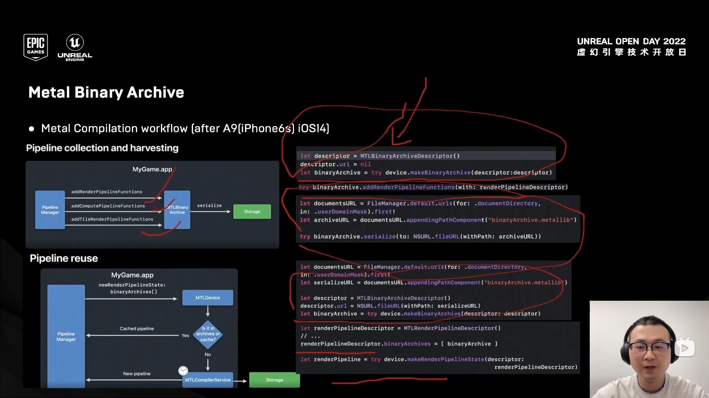

收集: 
  1. 先打一个普通的包, 在游戏运行时候编译PSO
  2. 通过代码创建Binary Archive, 让它的URL为 nil
  3. 然后通过AddRenderPipelineFunction, 把PSO 和 Binary Archive关联在一起
  4. 把Binary Archive存下来

使用:
  1. 使用URL指定刚才创建好的Binary Archive文件
  2. 创建PSO的时候指定Binary Archive
  3. 生成PSO的时候会从Binary Archive中查找是否有合适的
  4. 如果有则直接使用, 不触发Shader编译
  5. 如果没有则触发Shader编译

### **1.4 第二版编译**

第二版(A13 Iphone11 IOS16)的编译过程. 跟第一版有点相似.

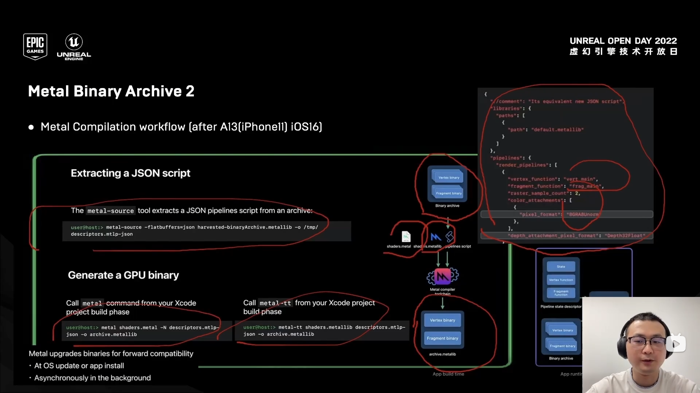

收集:
  1. 先执行第一版Binary Archive 储存
  2. 执行命令, 生成json(可手写)
  3. 把Json和Shader代码(或AIR文件)给XCODE
  4. 用命令生成第二版的Binary Archive

使用:
  1. 和第一版一样

第二版如何兼容多个操作系统和芯片的?

苹果系统会在安装APP或升级操作系统的时候, 编译/升级 Binary Archive, 来保证向前兼容. 因为升级是在后台异步完成的, 所以对用户来说是无感的.

### **1.5 效果**

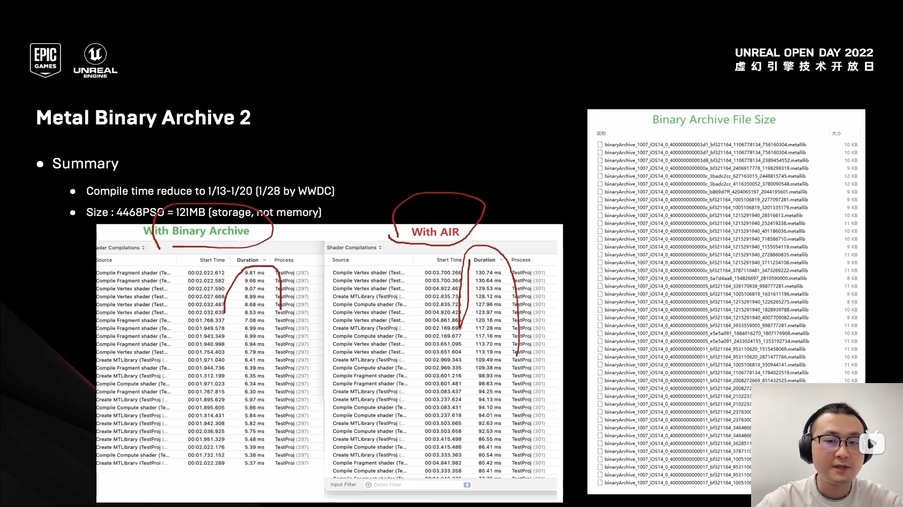

用Binary Barchive 的编译时间是 Air 的 1/20. WWDC上说可以到1/28

每个Binary Barchive的大小约10KB, 4468PSO未压缩共121MB. 占用的是包体而非内存. Binary Barchive使用后可以立即销毁, 不会占用内存.

### **1.6 Reference**
  
  + [WWDC2020 Build GPU binaries with Metal][3]
  + [WWDC2021 Discover compilation workflows in Metal][4]
  + [WWDC2022 Target and optimize GPU binaries with Metal 3][4]
  + [AppleDeveloper MTLBinaryArchive][5]

可以看到苹果这三年都在推BinaryArchive.

-----------------

## **2. Metal Variable Rate Rasterization Rate Map**

  主要是降低分辨率/动态分辨率相关. 

### **2.1 Why**

优化时, 如果考虑用降低分辨率节省GPU运算, 效果会被大幅度降低, 美术会不喜欢.

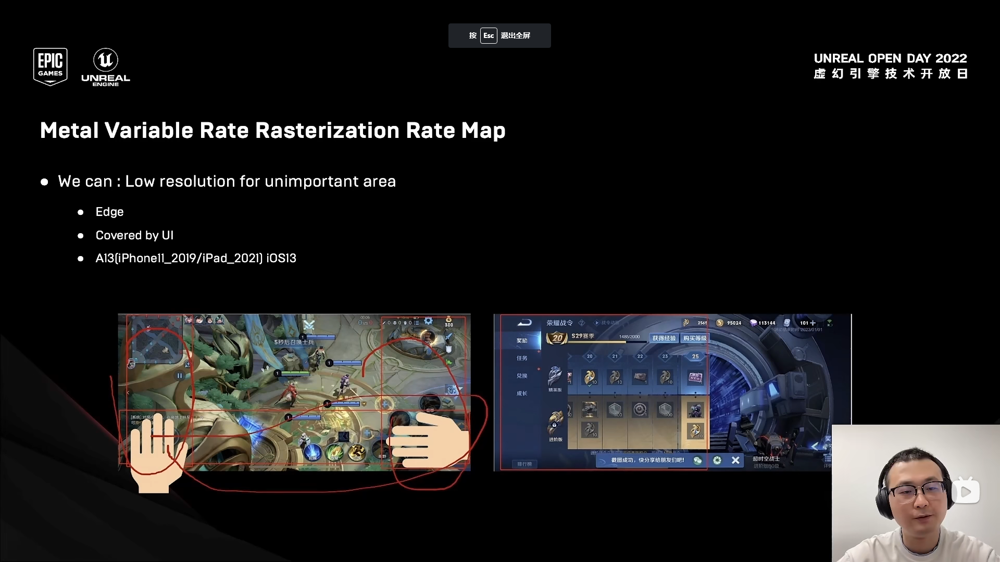

  当然也有例外的时候, 比如说场景被UI遮挡的部分和场景被手遮挡的部分都不会显得那么重要. 这时候就引入了 **Metal Variable Rate Rasterization Rate Map** (RRM).

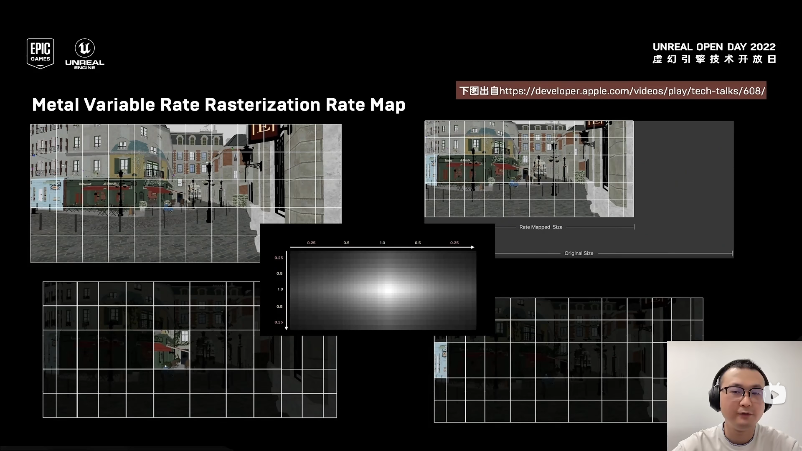

原来: 
  1. 把屏幕等分为N个Tile
  2. 每个Tile尺寸一样

如上图RRM优化后: 
  1. 缩小屏幕分辨率
  2. 把屏幕分成N个Tile
  3. 每个Tile按照权重尺寸不一样(上图中间大, 周围小)
  4. upscale回原始分辨率

中间的LUT图就是RRM的Tile比例, 越暗则越小. 

右上角可以看到RRM后对比原分辨率缩小了, 但是中心区域的渲染效果没有变化.

左和右下角可以看到虽然内容是一样的, 但是质量就有差别了.

### **2.2 渲染管线**

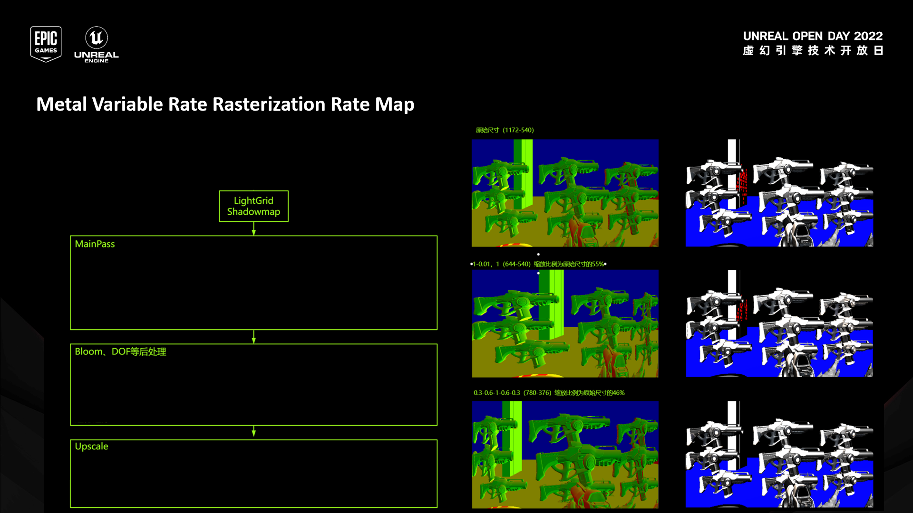

渲染管线基于基于ue4.26mobile deferred shading修改定制.

Pass:
  1. 降低分辨率,native resolution降低为1175*540
  2. lightgrid计算光照, shadowmap计算阴影
  3. mainpass绘制主场景
  4. 后处理: bloom,dof等
  5. upscale为native resolution

上图第一行就是正常渲染.

第二行图使用RRM, 左边一半为原始分辨率, 右边一半为1%的分辨率. 在渲染的时候左边占了绝大部分, 但是upscale回去比例是正常的, 不过右边明显模糊了.(硬件有做插值)

第三行图使用RRM, 使用和苹果tech talk demo推荐比例, 中间大周围小.

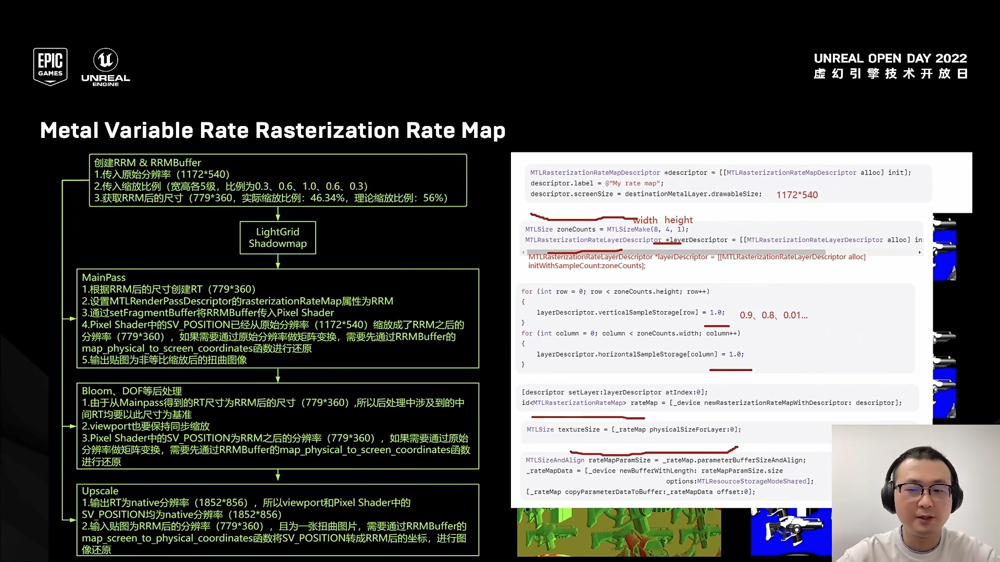

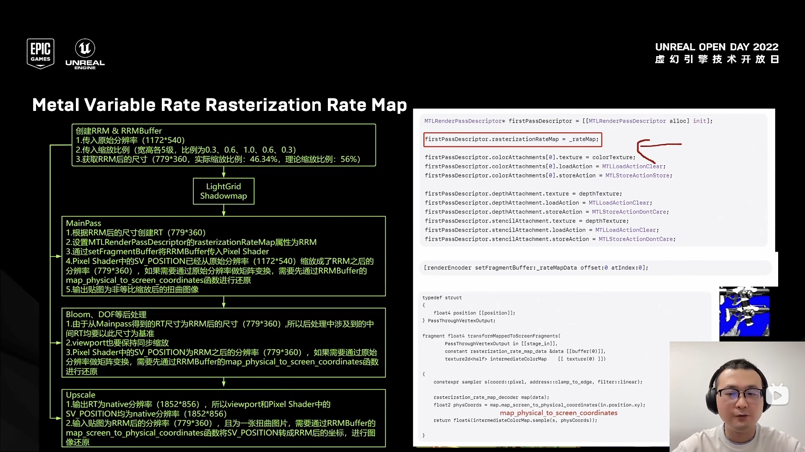

做法:
  1. 创建RRMDescriptor
      + 创建时指定目标分辨率, 如1172*540
  2. 创建RRMLayerDescriptor
      + 指定RRM比例, 如宽高各几段, 每段的比例如何
      + 这里代码宽高各1, 每段比例也为1
      + 前面demo, 0.3, 0.6, 1.0, 0.6, 0.3 正态分布
  3. 根据RRMDescriptor和RRMLayerDescriptor创建RRM
      + 通过RRM去创建需要的低分辨率RT
      + RT尺寸并非之前给的分段比例值推算而来, 苹果根据提供的分段比例给出建议的合适大小
      + 每一分段比例也不一定是预设值, 硬件会做插值
  4. 创建对应的RRMBuffer
      + RRMBuffer用于Shader中做分辨率映射运算.
  5. mainPass
      + 设置renderpassdescriptor时, 传入RRM
      + viewport为原分辨率, 光栅化后为按照RRM缩小的分辨率, 如SV_POSITION是RRM缩小分辨率后的位置
      + 如屏幕转阴影空间变化, SV_POSITION需要经过RRMBuffer的map_physical_to_screen_coordinates转回原位置
  6. upscale回原分辨率
      + 原分辨率SV_Position通过RRMBuffer的map_screen_to_physical_coordinates转换到RRM后的位置

### **2.3 性能**

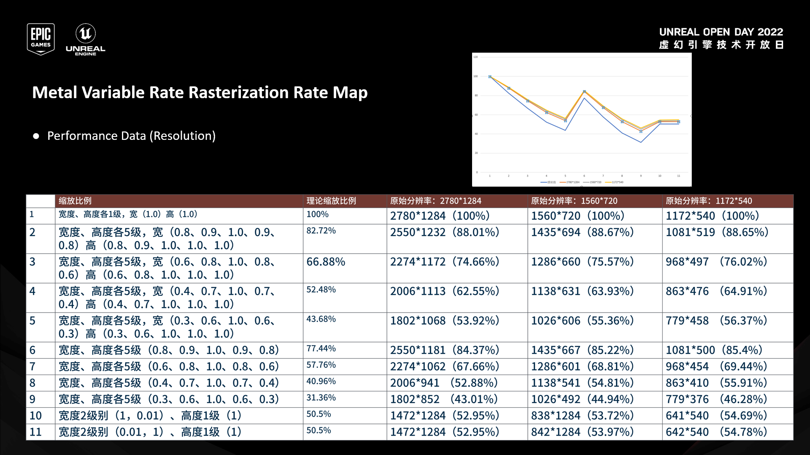

设置的理论分辨率和实际RRM推荐的分辨率, 蓝色理论分辨率, 黄色RRM推荐分辨率, 发现很相近. 

但是实际分辨率会多一点,是因为会多分配一些分辨率用做插值渐变.

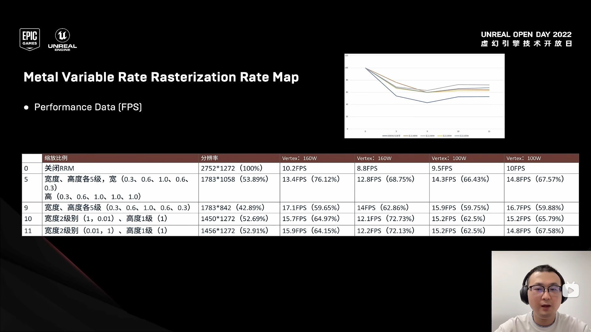

RRM实际分辨率的缩放，性能变化. 蓝色线代表了分辨率的缩放值, 其他颜色为每帧耗时的比例.

随着分辨率的降低, FPS随着提高. 分辨率在40-50%左右的时候, 耗时为之前的60-70%, 因为RRM只优化了PS, 而VS及前面的lightgrid、shadowmap pass并没有优化.

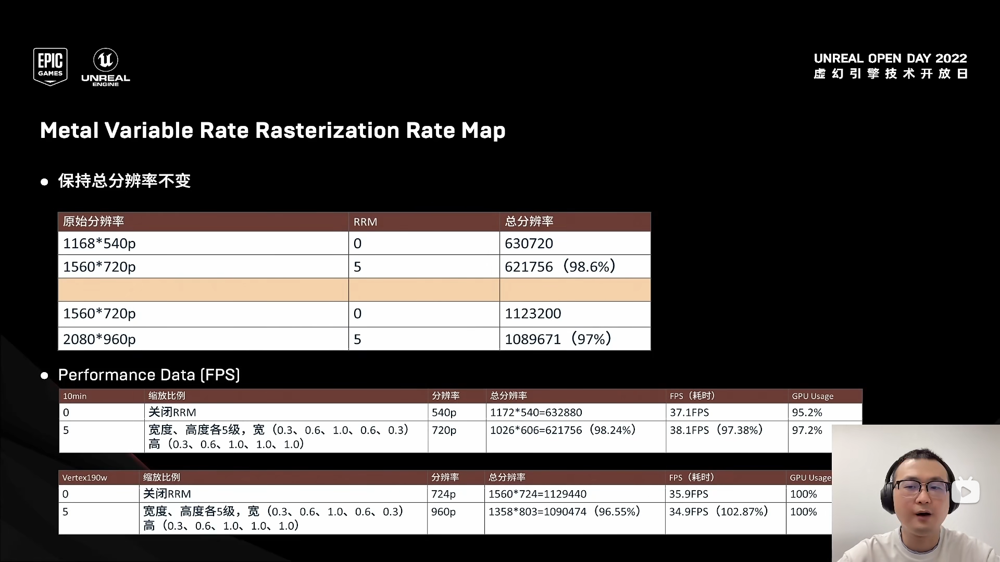

关于RRM开销. 用RRM把高分辨率得到原生分辨率, 并没有什么额外开销.

### **2.4 RRM VS VRS**

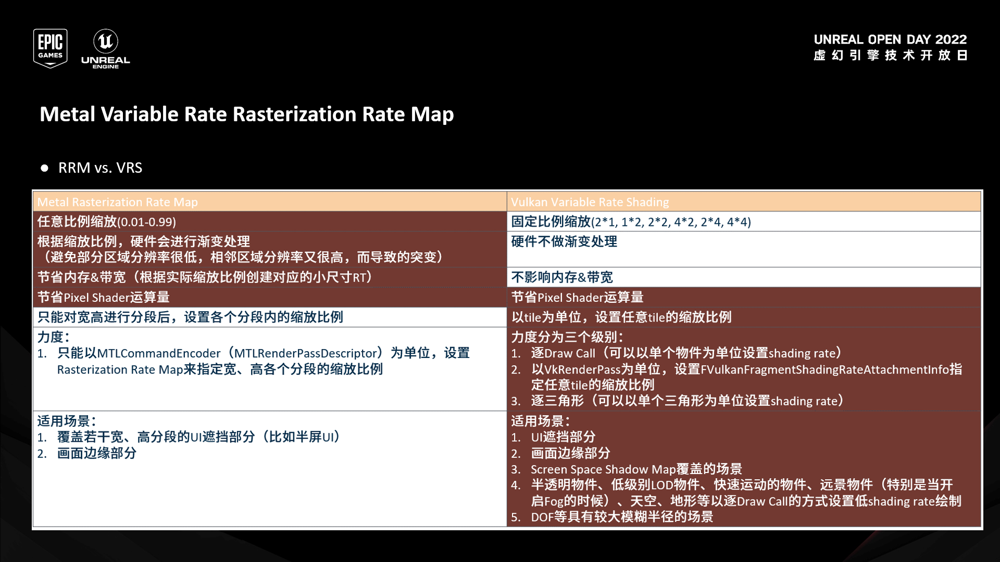

RRM:
  + 降低PS消耗
  + 任意比例缩放(1%~99%)
  + 根据比例硬件会做渐变过渡处理
  + 使用了低分辨率RT, 内存带宽降低
  + 只能对宽高分段后, 甚至分段缩放比例
  + 力度:
    + 只能以MTLCommandEncoder(MTLRenderPassDescriptor)为单位, 设置RRM来指定宽和高各个分段的缩放比例
  + 适用于:
    + UI遮挡部分
    + 画面边缘部分

VRR(Variable Rate Shading):
  + 降低PS消耗
  + 固定比例缩放,如 2\*1, 1\*2, 2\*2, 4\*2, 2\*4, 4\*4
  + 硬件不会做渐变过渡处理
  + 不会影响RT, 所以内存和带宽不会变小
  + 以tile为单位, 设置每个tile的缩放比例
  + 力度:
    + 逐Draw Call, 单个物件为单位设置Shading Rate
    + 以VKRenderPass为单位, 设FVulkanFragmentShadingRateAttachmentInfo置顶任意tile的缩放比例
    + 逐三角形, 可以以单个三角形为单位设置Shading Rate
  + 适用于:
    + UI遮挡部分
    + 画面边缘部分
    + Screen Space Shadow Map覆盖场景
    + 半透明物件, 低级LOD物件, 快速运动物件, 远景(特别开Fog)物件, 天空, 大面积低频变化地形 等逐Draw Call的方式设置低Shading Rate绘制
    + DOF等具有较大模糊半径的场景

### **2.5 Reference**

  + [Metal Enhancements for A13 Bionic][7]
  + [Modern Rendering with Metal][8]
  + [MTLRasterizationRateMap][9]
  + [Variable Rasterization Rate][10]

在modern rendering with metal这个官方demo中出现, 这个demo中还包含了icb和sparse texture等metal特有的重磅feature.

### **2.6 其它**

自己的一些小记, 随便写写.

1. 要iPhone11(A13和iOS13)以及后续机型才支持
2. 影响FrameGraph的Pass合并
    + 两个PassRT相同, 合并成一个RT, 节省RT切换
    + 如果开启VRR, RT大小不一致, 影响合并
3. Memoryless的RT是不能被拆分的, 否则会crash
    + AC两个PASS写到MemorylessRT, 中间还有B Pass
    + B的VRR不同, 导致不能合批成一个pass, 从而会去load Memoryless的RT
    + 这时不符合Metal API检测, 导致 crash
4. 格子数问题
    + 如果格子越多, map_screen_to_physical_coordinate API消耗越大
5. 被分辨率整除
    + 水平和垂直的分割数要被分辨率整除, 否则会黑线
6. 如果需要好的深度图, 那么不建议使用这个feature

-----------------

## **3. Vulkan Variable Rate Shading**

  原视频比较快速的讲了一次, 我这里加了点自己的理解.

### **3.1 原理**

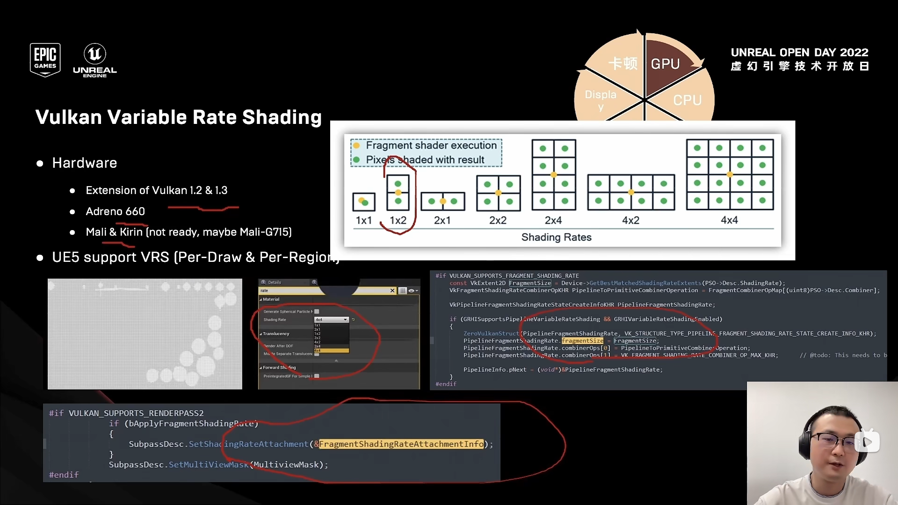

VRS算是MSAA的拓展, 是动态分辨率技术的一种, 可以让多个像素共用一个PS的计算结果.

vrs不影响rt分辨率. 以为vrs1*2为例, 在中心点(黄色点)进行一次计算, 然后用于两个像素(绿色点)中.

理想条件下就可以达到N个像素, 缩短为原来的1/N. 为什么是理想!? 因为如果物体只占用一个像素, ps无论如何还是会计算一次.

### **3.2 支持**

vrs依赖于vulkan1.2或者1.3的extension.

当前市上只有adreno660以上机型支持, 如: 小米11.

mali和麒麟芯片的内部人员介绍, 目前feature已经开发完毕, 但是芯片还没上市.

### **3.3 使用**

上图左边是针对ui抠出来一个mask图, 把mask图作为创建subpass的输入参数, 使该subpass在绘制对应tile的时候使用相应的vrs级别.

上图右边是目前ue在editor中已经添加好的功能, 每个材质球都有可以设置该材质球的vrs级别的属性.

相应的代码从ue5中截出来的, 可以看到vulkan rhi的相关代码ue5已经写完了, 直接使用即可.

### **3.4 性能**

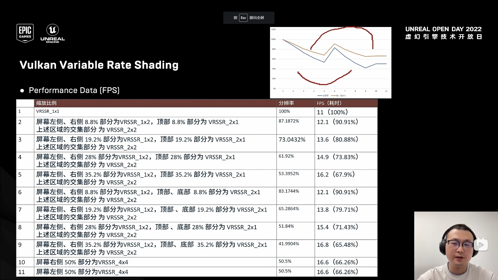

蓝色线代表理论上可以节省ps的比例, 黄色线是一帧的耗时情况. 和rrm基本相同. 

PS运算量在原来40-50%左右的时候, 耗时为之前的60-70%, 原因也和RRM一样.

### **3.5 Reference**

  + Spec:
    + [1.2 VK_KHR_fragment_shading_rate][11]
    + [1.3 VK_KHR_fragment_shading_rate][12]
    + [1.2 Fragment Shading Rates][13]
    + [github VK_KHR_fragment_shading_rate][14]
  + Khronos Blog:
    + [Khronos Vulkan Working Group Releases Shading Rate Extension to Increase Rendering Performance and Quality][15]
  + Lib:
    + [Added SPV_KHR_fragment_shading_rate SPIRV-Headers#172, Support SPV_KHR_fragment_shading_rate SPIRV-Tools#3943, Add GL_EXT_fragment_shading_rate glslang#2428, Add GLSL_EXT_fragment_shading_rate GLSL#137, Add validation for VK_KHR_fragment_shading_rate Vulkan-ValidationLayers#2266, [spirv] Add VK_KHR_variable_rate_fragment_shading SPIR-V support microsoft/DirectXShaderCompiler#3664][16]
  + Sample:
    + [Fragment shading rate][17]
    + [fragment_shading_rate_dynamic][18]

### **3.6 其它**

自己的一些小记, 随便写写.

  + [VRS远近对比][19]
  + 对比RRM, 深度图是独立的, 不受影响
  + 特别要注意Alpha Test, 可能变化会很大. 如铁丝网模糊后就彻底镂空了

-----------------

## **4. Metal Async Compute**

  GPU并行计算相关.

### **4.1 原理**

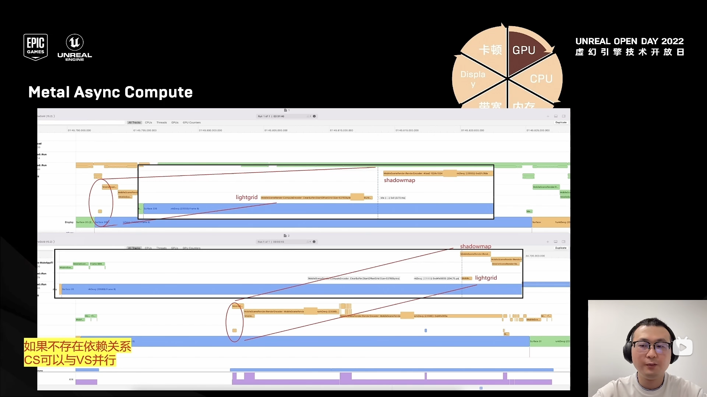

因为GPU多核的特性可以并行处理事情, 所以利用率很重要. 

Async Compute, 当两个没有任何依赖的Pass, 且任意一个Pass无法把GPU占满, 则会把两个Pass在GPU中同时执行, 互不干扰. 

比如A Pass 1min, B pass 100ms, 如果队列模式要 100ms, 并行模式只用100ms, 耗时缩短了一半.

如上图(来自于xcode instrument). 管线是ue4.26 mobile deferred renderer. 开始时 Compute Pipeline计算lightgrid，用Render Pipeline计算shadowmap. 这两个CS VS不存在依赖关系.

如果没有开AsyncCompute, 可以在时间轴上看到lightgrid和shadowmap中间有明显的gap.

打开AsyncCompute, lightgrid和shadowmap, 在时间轴上已经重合, 处于并行计算.

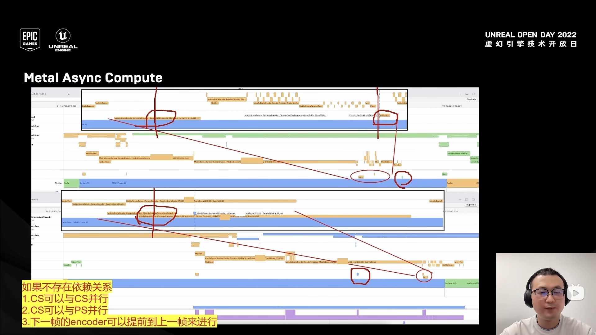

再比如 mainPass之后的CS计算hzb, 后处理用CS根据SceneColor算自动曝光. 两个Pass都为CS, 毫无关系, 就算Pass距离很远, 也会进行并行重叠计算.

而且看上图, 这两个CS已经并行计算了, 同时还有PS在同时执行.

同时现在的游戏都是多线程渲染比较多, 当前帧绘制时, 下一帧的CPU和CommnadBuffer可能都已经准备好了.

看上图上边, 绿色表示下一帧, 黄色表示当前帧数, 需要等黄色全部执行完毕后才能继续执行.

但是上图下边, 蓝色表示下一帧, 蓝色的一些准备工作已经提前到黄色的当前帧来执行了.

### **4.2 How**

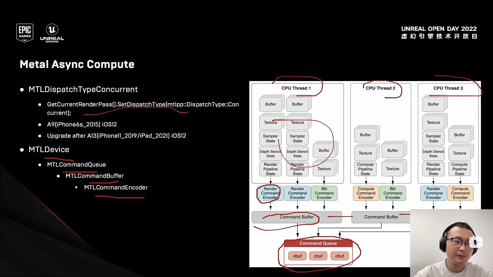

Metal打开方式在RenderPass指定Concurrent.

硬件要求 A9 IOS12, 后来 A13 IOS12 升级了一版.

两个Pass需要没有依赖关系. 如果有依赖还一起执行, 可能就会出现读写顺序问题.

Metal基本概念:
  1. Metal中最底层的是mtldevice, 对应gpu
  2. mtldevice创建mtlcommandqueue, 比较重度的资源, 一个游戏中只有一个
  3. 通过commandqueue去创建commandbuffer, commandbuffer可以有很多
  4. commandbuffer用来收集gfxapi, 比如创建commandencoder(也就是renderpass)

如上图所示, 3个CPU线程, 每个线程可以创建很多renderencoder(renderpasss), 提交给commandbuffer. 再把commandbuffer提交给commandqueue. 最后commandqueue提交给device.

虽然我们可以控制commandqueue的提交顺序, 但是打async compute可能会打乱顺序. 

比如我们要先写A贴图, 再读取A贴图. 这时候打开async compute, 顺序被打乱, 先执行了读取A贴图, 就出现了错误.

### **4.2 解决**

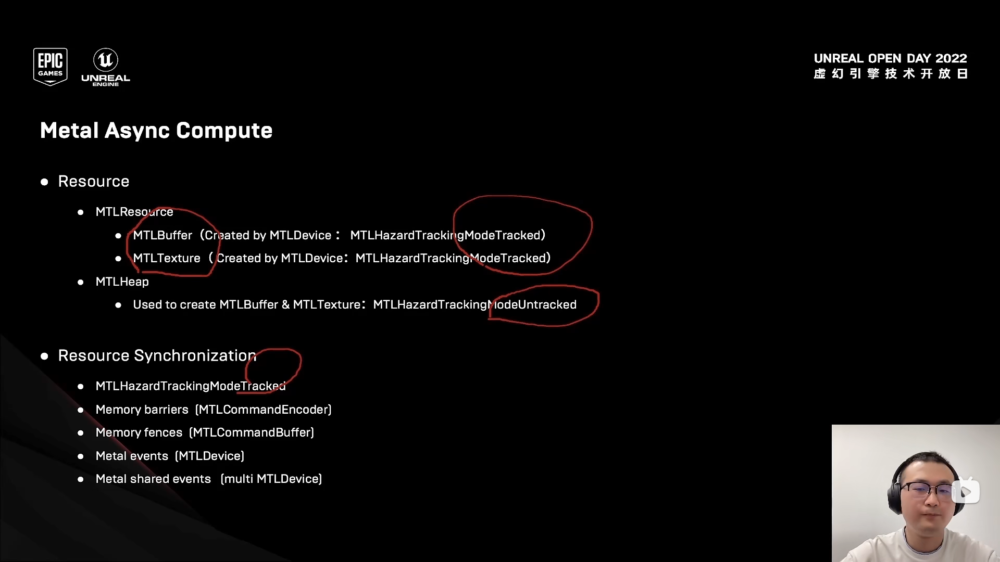

上面的资源, 在metal中可以分为mtltexture和mtlbuffer, 可以通过mtldevice创建, 也可以通过heap创建. heap具有优势, 比如sparse texture.

两个资源的重要区别: mtltexture, 标记为tracked. mtlbuffer, 标记为untracked.

标记为tracked的时, 这个资源由GPU来管理依赖关系. 比如上面的例子, 当gpu发现自己管理的texture在a操作和b操作中出现了读写依赖关系, 那么就会强制在a操作结束之后, 再进行b操作.

这样就可以API 先开 async compute, 没有依赖的texture(如贴图, 只读不写) 标记为 untrack, 有依赖的(如rt), 标记为trace.

除了trace标记让GPU管理依赖之外, metal还有另外四种资源同步方法.

0. trace标记
    + 参考上面
1. 资源依赖发生在encoder内
    + 两个CS, 第一个CS先写buffer, 第二个CS读取buffer
    + 如果这两个cs被encoder同一个commandencoder内
    + 需要加barrier
2. 资源发生在commandbuffer内
    + 如后处理放在同一个commandbuffer内, 如bloom后处理的输出是dof后处理的输入
    + 则用fence
3. 资源依赖放生在多个commandbuffer之间
    + 如lightgrid和mainpass就放在2个commandbuffer中
    + mainpass需要lightgrid输出的光照信息, 需要确保lightgrid已经算好
    + 使用event
4. 多个device(gpu)之间
    + 用shareevent
    + 作用范围最大
    + 性能消费高, 因为作用范围越广耗费越高

### **4.3 Reference**

  + [Resource Synchronization][20]
  + [Metal Programming Guide][21]

-----------------

## **5. Stenil ID**

UE的 mobile deferred pipeline 的 lightingpass 动态分支相关.

### **5.1 What**

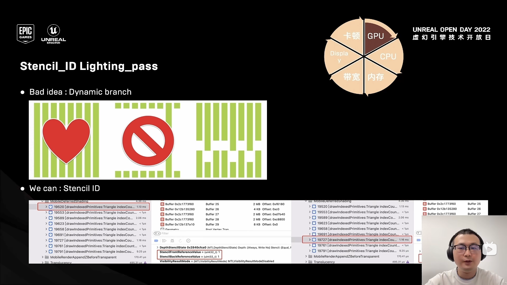

ue4.26 mobile shading render deferred pipeline的lightingpass中, 不同的shadingmodel使用动态分支代码来区分, 然而移动端对动态分支不友好.

如上图, 当一个wavefront中出现了两种分支都会涉及的情况, 则会出现很gpu核心空转, 影响了gpu利用率, 增加耗时.

所以用Stencil ID来解决, 虽然多了DrawCall, 但是保证了gpu利用率.

看xcode gpucapture中, 有些shadingmodel在当前没有出现, 耗时在1us以下. 只有当前屏幕有的shadingmodel, 才会有耗时.

-----------------

## **6. Metal Multi-Threaded Rendering**

  主要是多线程渲染.

### **6.1 What**

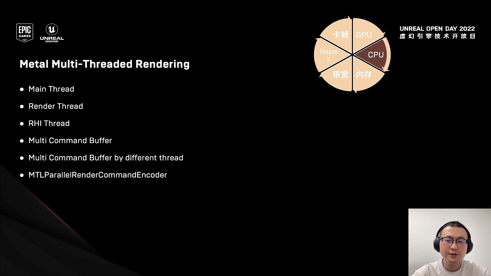

大世界, 美术标准高, DrawCall数量多, CPU压力大耗时高. 一是合批, 二是gpu driven, 三是多线程渲染. 这里主要讲多线程渲染.

1. Main Thread
    + 主线程
2. Render Thread
    + 创建一个renderthread专门做渲染方面的事情, 如culling, cpu粒子update
3. RHI Tahread
    + 专门用来执行gfxapi
    + ue已经实现了这个功能
4. Multi Command Buffer
    + 下面会讲
    + 多拆几个commandbuffer, 把GPU运算提前, 降低一帧的总时间(CPU+GPU)
5. Multi Command Buffer by different thread
    + 下面会讲
    + 降低CPU耗时
6. MTLParallelRenderCommandEncoder
    + 下面会讲
    + 多线程录制renderpass gfxapi

### **6.2 Multi Command Buffer**

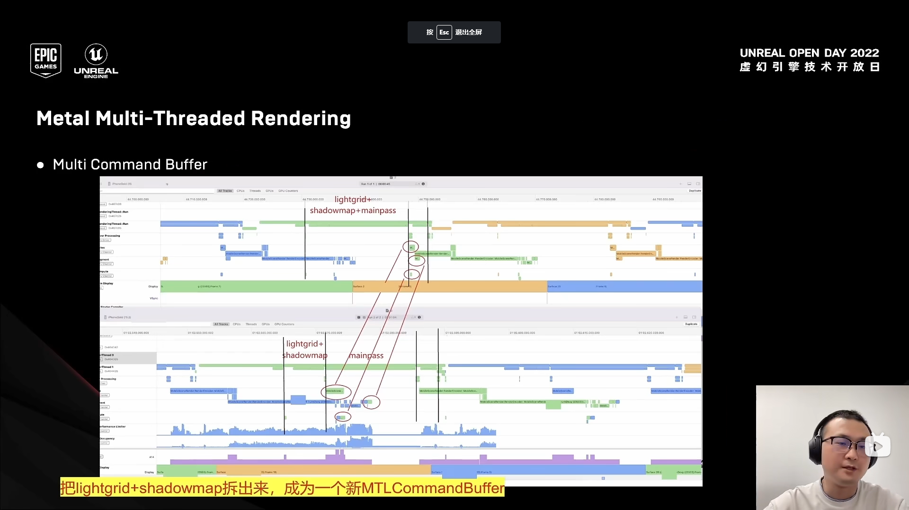

多拆几个commandbuffer, 把GPU运算提前, 降低一帧的总时间(CPU+GPU).

上图上边, 如果把lightgrid, shadowmap, mainpass合成一个大的commandbuffer中, 当大的commandbuffer的cpu执行结束后, gpu才开始执行.

上图下边, 把lightgrid+shadowmap拆成单独的一个commandbuffer, mainpass为另外一个commandbuffer. 在gpu中, lightgrid和shadowmap的计算已经被提前. 虽然cpu耗时没有变, 但因为提前执行了GPU的一些渲染, 总耗时变少.

### **6.3 Multi Command Buffer by different thread**

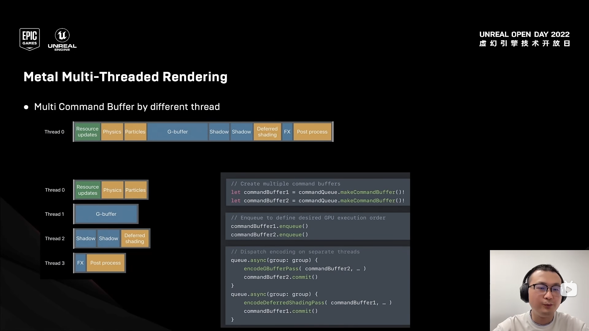

如何降低CPU耗时? 把上面拆的多个commandbuffer放在多个thread中进行执行.

如上图右边代码. 创建两个commandbuffer. 再填充gfx api之前先调用enqueue函数, 明确这2个commandbuffer的执行顺序, 再在多线中并行填充gfxapi. 填充完毕后再调用commit. 既保证执行顺序, 又用多线程加速了整个CPU执行时间.

### **6.4 MTLParallelRenderCommandEncoder**

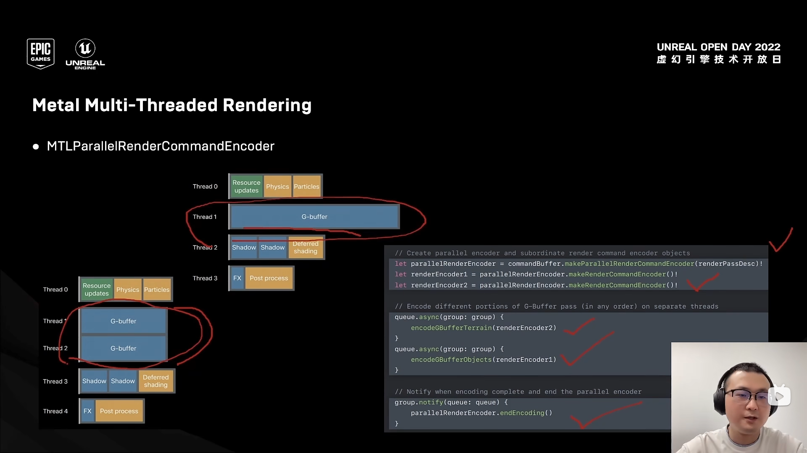

当某个renderpass CPU耗时过高, 可以用parallelrendercommandencoder多线程录制renderpass gfxapi.

如果已经使用了很多的commandbuffer, 但是有些renderpass耗时还是很高, 会拖慢整体进度. 比如上图gbuffer, 按照移动端设计每个rt的load/store action, 会耗费带宽, 而移动端对带宽敏感, 所以不能拆过多的renderpass.

把renderpass拆成多个mtlparallelrendercommandencoder放在多个thread中, 如上图右边代码:

1. 通过commandbuffer根据renderpassdescriptor创建一个parallelrendercommandencoder
2. 再通过它拆成多个子encoder
3. 每个thread用一个子encoder去执行gfx api
4. 等所有的子encoder结束后, 再执行parallelrendercommandencoder的endencoding函数.

这等效于多个thread去录制一个renderpass中的gfx api.

### **6.5 Reference**

  + [Metal for Game Developers][22]

-----------------

## **7. Metal Lossless & Lossy**

  主要是带宽相关.

### **7.1 What**

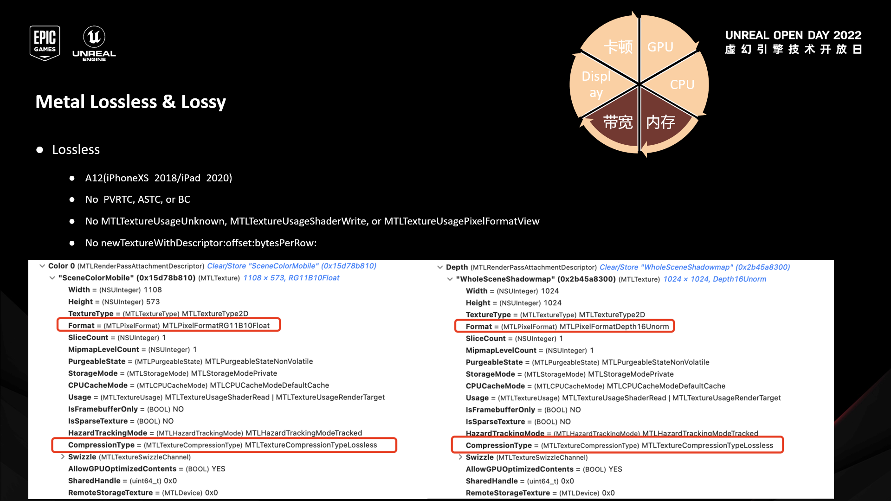

上面解决CPU和GPU耗时, 但是还有发热降频和内存过高oom crash问题. 发热除了cpu,gpu,alu运算过多外, 还有移动端对带宽的敏感.

gpu的带宽操作主要是rt的load/store action. 之前主要是rt的memoryless, don’t care等属性. 之后metal又提出了lossless和lossy.

Lossless:
  + 无损压缩
  + 原理: gpu根据当前rt的内容, 在load/store传输之前进行压缩和解压缩
  + 优点: 带宽占用小, 因为压缩后比原始rt要小
  + 缺点: 不影响内存占用
  + feature 默认打开
  + 不支持的贴图格式:
    + PVRTC
    + ASTC
    + BC
    + 等原来就压缩过的贴图
  + 不支持的特殊属性贴图:
    + MTLTextureUsageUnknown
    + MTLTextureUsageShaderWrite
    + MTLTextureUsagePixelFormatView
    + newTextureWithDescriptor:offset:bytesPerRow:
  + rt格式支持友好, 如:
    + color rt format: 111110
    + depth rt format: depth16

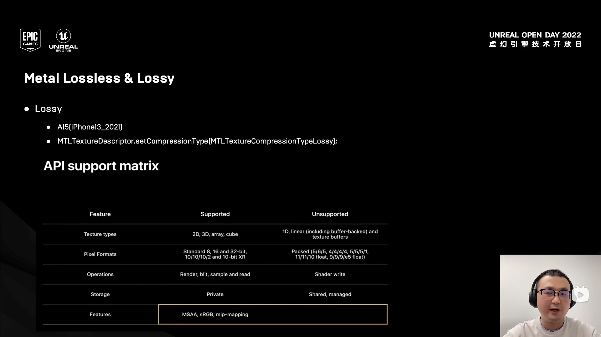

Lossy:
  + 50%有损压缩
  + 2021年提出, A15 IPhone13
  + 无论rt中的内容是什么都会进行50%有损压缩
  + 内存为原来的一半
  + 代码设置: MTLTextureDescriptor.setCompressionType

### **7.2 Lossless效果**

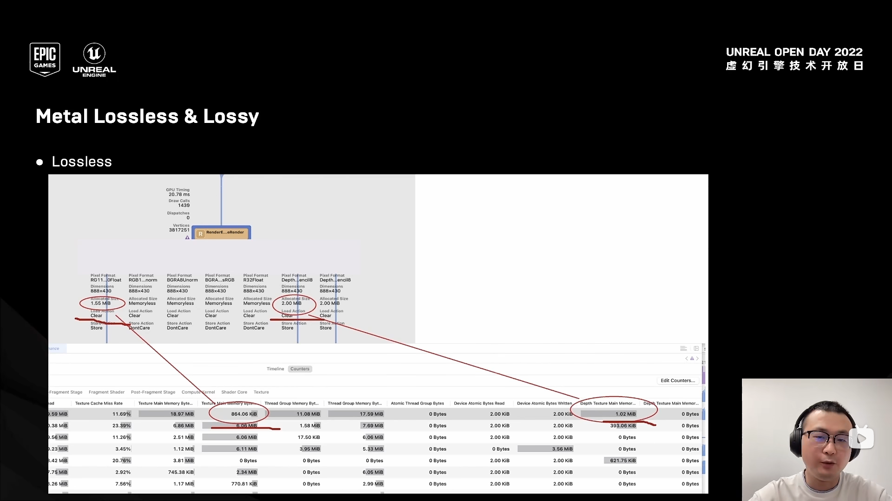

上图GPU capture + counter测试Lossless的效果. 原本1.55mb的rt实际带宽只有864kb, 2m的rt实际带宽只有1.02m, 相当于节约了一半. 如果游戏画面比较简单, 比如一张纯色rt, 那么可以节约更多. 

Lossless feature不影响内存. 因为这里的压缩比例是根据rt中内容的可变压缩比例, 目的是保证了效果无损. 所以创建还是按照原始尺寸分配内存.

### **7.3 Reference**

  + [Optimizing Texture Data][23]
  + [Discover advances in Metal for A15 Bionic][24]

-----------------

## **8. Framepacing**

  关于显示帧数的稳定性.

### **8.1 What**

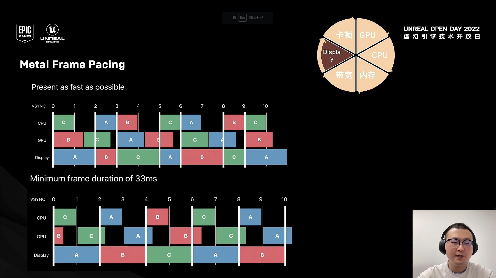

上图每个颜色代表一帧.

上图上边, 代表没有开framepacing. 当display B的时候, gpu在算C, 由于C很快算好, 那么B只显示了16.66ms, vsync就把 c swap到屏幕上. 但是A和C却显示了33ms.

上图下边, 开了framepacing, 即使C很快算好, 但是display还是会让B显示满33.33ms.

framepacing的功能就是确保diplay上一帧显示至少x ms (33.33ms等).

### **8.2 效果**

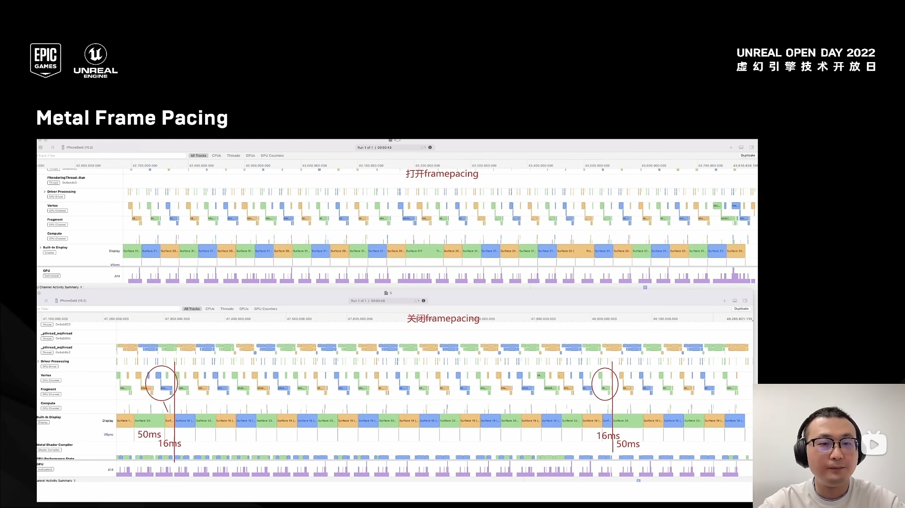

上图上边, 每帧数都显示满33ms, 流畅.

上图下边, 绿色计算的快, 所以蓝色之显示16ms. 之后黄色又计算的慢, 导致绿色显示了50ms 就不流畅, 导致了常说的卡顿.

### **8.3 How**

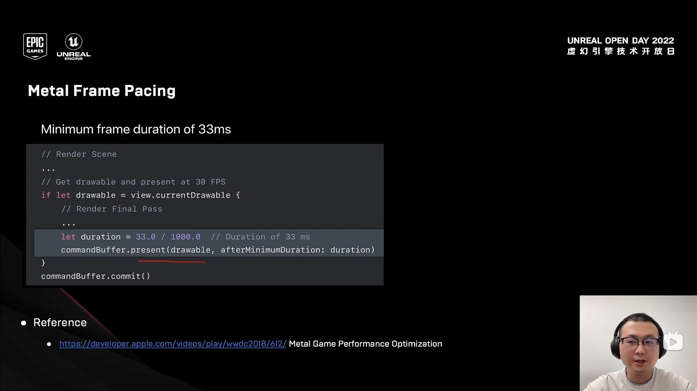

只有一行, 就是present的时候设置一个时间, 确保每帧display的时间.

### **8.4 Reference**

  + [Metal Game Performance Optimization][25]

-----------------

因为我不是写底层API的, 所以这次听完还是学到很多的. 尤其是很多新的特性, 很关键!!! 感动感谢.

-----------------

[1]:https://github.com/HHHHHHHHHHHHHHHHHHHHHCS/MyStudyNote/blob/main/MyUWA2022Note/%E7%A7%BB%E5%8A%A8%E7%AB%AF%E6%B8%B2%E7%A1%AC%E4%BB%B6%E7%89%B9%E6%80%A7%E6%8F%90%E5%8D%87%E6%B8%B8%E6%88%8F%E4%B8%8A%E9%99%90.md
[2]:https://www.bilibili.com/video/BV1aW4y1x7CA
[3]:https://developer.apple.com/videos/play/wwdc2020/10615
[4]:https://developer.apple.com/videos/play/wwdc2021/10229
[5]:https://developer.apple.com/videos/play/wwdc2022/10102
[6]:https://developer.apple.com/documentation/metal/mtlbinaryarchive?language=objc
[7]:https://developer.apple.com/videos/play/tech-talks/608/
[8]:https://developer.apple.com/documentation/metal/metal_sample_code_library/modern_rendering_with_metal
[9]:https://developer.apple.com/documentation/metal/mtlrasterizationratemap?language=objc
[10]:https://developer.apple.com/metal/Metal-Shading-Language-Specification.pdf
[11]:https://www.khronos.org/registry/vulkan/specs/1.2-extensions/html/chap50.html#VK_KHR_fragment_shading_rate
[12]:https://www.khronos.org/registry/vulkan/specs/1.3-extensions/man/html/VK_KHR_fragment_shading_rate.html
[13]:https://www.khronos.org/registry/vulkan/specs/1.2-extensions/html/vkspec.html#primsrast-fragment-shading-rate
[14]:https://github.com/KhronosGroup/Vulkan-Docs/blob/main/proposals/VK_KHR_fragment_shading_rate.adoc
[15]:https://www.khronos.org/blog/khronos-vulkan-working-group-releases-shading-rate-extension-to-increase-rendering-performance-and-quality
[16]:https://github.com/KhronosGroup/Vulkan-Docs/issues/1384
[17]:https://github.com/KhronosGroup/Vulkan-Samples/tree/master/samples/extensions/fragment_shading_rate
[18]:https://github.com/KhronosGroup/Vulkan-Samples/tree/master/samples/extensions/fragment_shading_rate_dynamic
[19]:https://weibo.com/ttarticle/p/show?id=2309404665166867595495
[20]:https://developer.apple.com/documentation/metal/resource_synchronization?language=objc
[21]:https://developer.apple.com/library/archive/documentation/Miscellaneous/Conceptual/MetalProgrammingGuide/Introduction/Introduction.html
[22]:https://developer.apple.com/videos/play/wwdc2018/607/
[23]:https://developer.apple.com/documentation/metal/textures/optimizing_texture_data?language=objc  
[24]:https://developer.apple.com/videos/play/tech-talks/10876/  
[25]:https://developer.apple.com/videos/play/wwdc2018/612/
[26]:https://www.zhihu.com/people/geekfaner
[27]:http://www.geekfaner.com