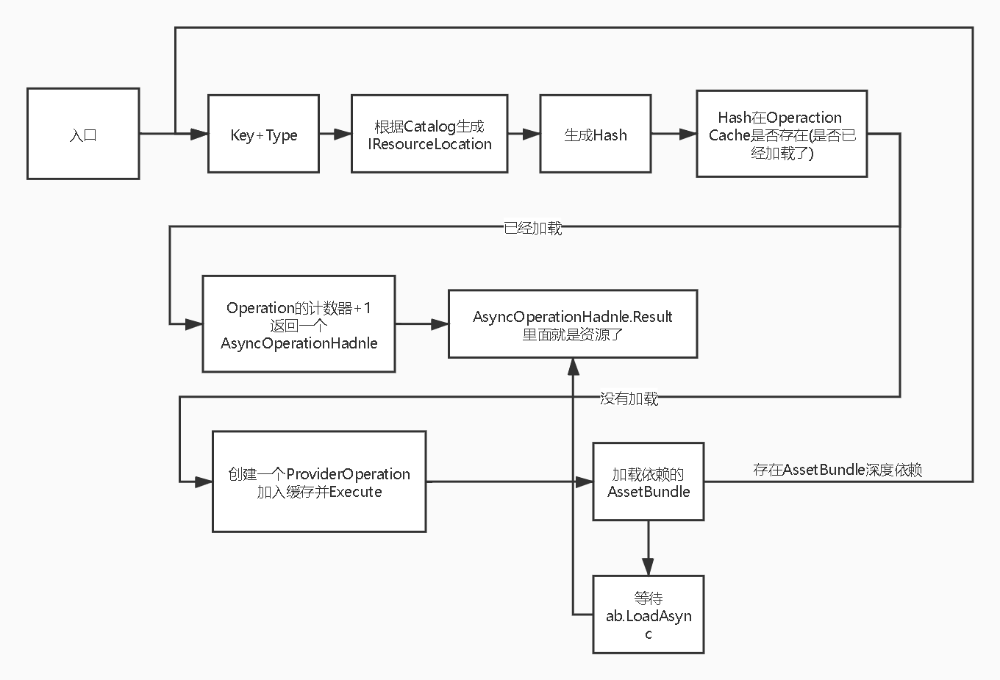

**基于Addressable资源管理系统的大地形加载方法探究**
=================

(Github正常排版: [基于Addressable资源管理系统的大地形加载方法探究](TODO:))

------------------------

[1. 渲染知识树](#1) 
[2. Why SRP](#2) 
[3. Project](#3) 
[4. URP VS LWRP](#4) 

------------------------

## **1. 打包**
* ## **AssetBundle**
  + Inspector AssetBundle&Label + 代码打包(不可视化界面)
  + AssetBundle Brower(可视化界面,停止更新)
  + 需要自己手动分析依赖,计算冗余
 

* ## **Addressable -- Addressable Groups**
  + https://zhuanlan.zhihu.com/p/77600079
  + Groups
    - Window->Asset Management->Addressables->Groups(可视化界面)
    - GroupName -> PrimaryKey
    - Path -> InternalId
    - Labels -> Label
  + ScriptableBuildPipeline
    - 选中Group进行个性化设置
    - 不同包体单独设置属性,如:(Compression)压缩格式,(BundleNaming)包名
  + Analyze
    - Window->Asset Management->Addressables->Analyze(可视化界面)
    - 可以检测分析并修复冗余(自动生成公共的组)
  + settings.json
    - 位置:Library\com.unity.addressables\StreamingAssetsCopy\aa\[BuildTarget]
    - Addressable设置项,如:Catalog.json位置,hash位置
  + catalog.json
    - 位置:Library\com.unity.addressables\StreamingAssetsCopy\aa\[BuildTarget]
    - ResourceLocationMap(给IResouceLocation用),key和资源的映射关系
 

------------------------

## **2. 加载**
* ## **AssetBundle**
  + 下载
    - WWW
    - AssetBundle.LoadFromFile
    - UnityWebRequest
  + 加载
    - AssetBundle.LoadAsset
    - 要根据依赖加载AssetBundle
 

* ## **Addressable**
  + https://zhuanlan.zhihu.com/p/82247256
  + Addressable.LoadAssetAsync<T>(string key)
  + Addressable.InitalizeAsync()
    - 需要生成的setting.json 和 catalog.json
  + IResouceLocation
    - Type : 声音,图片......
    - IList\<IResouceLocation\> Dependencies{get;} : 依赖关系
  + ResourceManager
    - 各种加载的缓存
    - Provider
      - 加载器,加载资源和Bundle用
      - AssetBundleProvider
      - BundleAssetProvider
    - Operation
      - 引用计数器,跟卸载有关
      - PrividerOperation
      - AsyncOperationHandle
  + 加载流程
    
 

------------------------

## **3. Project**
1. ## **Z-Pre Pass**
    + 跳过冗余的PS运算(VS->EarylyZ->是否跳过PS,HSR下则废了)
    + 特殊功能,如Screen Space Shadow Map(SSSM)等
    + 缺点DrawCall上去,所以低端安卓机不开
    + HSR生效的时候,Z-Pre也不用开
 

2. ## **Shadow**
    + Shadow Map
    + PCF
    + ESM
    + CSM
    + SSSM
    + Self Shadow(专门用相机拍摄主角阴影,近距离,高精度)
 

3. ## **Main Pass**
    + 分辨率(不同手机,不同画质,不一样的渲染分辨率)
    + 延迟贴花(Framebuffer Fetch)
    + 软粒子(Framebuffer Fetch)
 

4. ## **特效被后效影响**
    + 特效在不同场景的后效想要表达一样的效果 , 后效如:ColorGrading,AutoExposure,Bloom
    + 高配:MainPass+后效Uber+绘制特效+特效Uber,缺点DepthRT Load&Store , 多一次后效Uber
    + 中配:MainPass(BloomMask:0)+绘制特效(BloomMask:特效Alpha)+后效Uber , 缺点边缘可能有点怪
    + 低配:MainPass+绘制特效+特效后效 , 缺点无场景后效
 

5. ## **Distort**
    + 技能只扰动场景,屏幕后效(雨)扰动全部
    + 扰动存在RT的RG中,后效Uber采样做UV偏移
    + 高配:只影响场景的Distort+后效Uber+Distort(屏幕)+后效Uber,缺点DepthRT Load&Store , 多一次后效Uber
    + 低配:Distort(屏幕)+后效,缺点无技能Distort
 

6. ## **后效**
    + 1.Global Fog(Framebuffer Fetch)
    + 2.Volume Light(Framebuffer Fetch)
    + 3.DOF
    + 4.SunShaft
    + 5.SSAO
    + 6.AutoExposure
    + 7.Vignetee
    + 8.Bloom
    + 9.Color Grading
    + 10.Radial Blur
    + 不同画质,不同配置可以开关一些效果
    + 尽量减少RT的切换
 

7. ## **特殊效果**
    + 1.Wind(风影响植被抖动)
    + 2.Trail(踩草,单位接触植被,植被抖动)
    + 3.Snow Trail(踩到雪地的凹陷脚印)
    + 4.Plane Reflection (水平面反射)
    + 5.Ripple (踩到水的涟漪圈圈)
    + 6.Rain (屏幕雨效果,物体打湿的感觉)
    + 7.Water Ripple(下雨地上涟漪圈圈)
    + 8.Motion Blur(运动模糊)
    + 9.Lens Flare(太阳光的光晕拉丝)
 

8. ## **Post Process Volume**
    + 用Volume完成同一场景不同后效切换
 

------------------------

## **4. URP VS LWRP**
1. ## **API**
2. ## **多了m_CapturePass截屏**
3. ## **使用CamerasStack管理Camera**
4. ## **ScriptableRenderer代替IRendererSetup**
5. ## **主光确保是方向光的前提下,再根据强度来判断**
6. ## **SRP Batcher支持**
 

------------------------